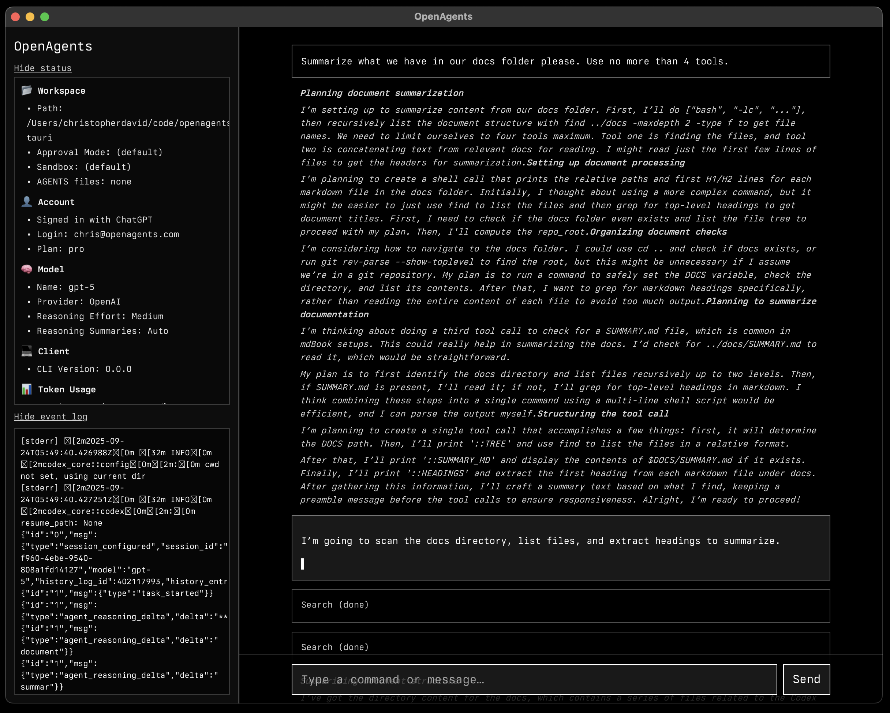

# OpenAgents

A desktop app to command OpenAI Codex and other agents. Work in progress.



## Stack

- Rust
- Tauri
- Leptos 

## Documentation

### Local Development

To run the app locally, you'll need to set up a few dependencies:

#### Prerequisites

1. **Install Rust** (if not already installed):
   ```bash
   curl --proto '=https' --tlsv1.2 -sSf https://sh.rustup.rs | sh
   source ~/.cargo/env
   ```

2. **Install Tauri CLI**:
   ```bash
   cargo install tauri-cli
   ```

3. **Install Trunk** (for WebAssembly frontend builds):
   ```bash
   cargo install trunk
   ```

4. **Add WebAssembly target**:
   ```bash
   rustup target add wasm32-unknown-unknown
   ```

#### Running the App

Once you have all dependencies installed, you can run the development server:

```bash
cargo tauri dev
```

This will start both the Rust backend and the Leptos frontend with hot reload enabled.

### Technical Documentation

- Overview of Codex systems docs: [docs/codex/README.md](docs/codex/README.md)
- Building a Chat UI with streaming: [docs/codex-chat-ui.md](docs/codex-chat-ui.md)
- Architecture: [docs/codex/architecture.md](docs/codex/architecture.md)
- Authentication: [docs/codex/authentication.md](docs/codex/authentication.md)
- Protocol overview: [docs/codex/protocol-overview.md](docs/codex/protocol-overview.md)
- Prompts: [docs/codex/prompts.md](docs/codex/prompts.md)
- Sandbox: [docs/codex/sandbox.md](docs/codex/sandbox.md)
- Tools: [docs/codex/tools.md](docs/codex/tools.md)
- Testing: [docs/codex/testing.md](docs/codex/testing.md)

## Codebase Overview

- Purpose: Desktop chat UI that drives Codex via a streaming protocol.
- Crates: `openagents-ui` (Leptos/WASM, root crate) and `openagents` (Tauri v2, `src-tauri/`) in a Cargo workspace.
- Frontend:
  - Entry points: `src/main.rs` mounts `App` from `src/app.rs`.
  - UI: Sidebar shows workspace/account/model/client/token usage, raw event log, and recent chats. Main pane renders transcript blocks (User, Assistant, Reasoning, Tool) with autoscroll.
  - Controls: Reasoning level selector (Minimal/Low/Medium/High) invokes `set_reasoning_effort`; chat bar sends prompts via `submit_chat`.
  - Markdown: `pulldown_cmark` for rendering; styling via Tailwind Play CDN and Berkeley Mono (see `index.html` and `public/fonts/`).
- Desktop (Tauri):
  - Entry: `src-tauri/src/main.rs` → `openagents_lib::run()` in `src-tauri/src/lib.rs`.
  - Commands exposed to UI: `get_full_status`, `list_recent_chats`, `load_chat`, `submit_chat`, `set_reasoning_effort`, `greet`.
  - Protocol process: Spawns `cargo run -p codex-cli -- proto` from `codex-rs/` if present, else `codex proto`. Forces `approval_policy=never`, `sandbox_mode=danger-full-access`, `model=gpt-5`, and selected reasoning effort.
  - Streaming: Maps protocol JSON lines to UI events (assistant deltas, reasoning deltas/summaries, tool begin/delta/end, token counts).
- Auth & Sessions:
  - Auth: Reads `~/.codex/auth.json` to detect ApiKey or ChatGPT; extracts email/plan from `id_token`.
  - Sessions: Scans `~/.codex/sessions` and `~/.codex/archived_sessions` for `rollout-*.jsonl`, parses meta (cwd, approval, sandbox, CLI version) and reconstructs chat items.
- Config & Build:
  - Trunk: `Trunk.toml` targets `index.html`; dev served on `1420`.
  - Tauri: `src-tauri/tauri.conf.json` runs Trunk in dev and uses `../dist` in builds.
  - Workspace: Root `Cargo.toml` lists `src-tauri` as a member.
- Vendored tooling: `codex-rs/` contains TUI and supporting crates used by the protocol runner.

### Quick Commands

- Dev (web): `trunk serve` → http://localhost:1420
- Dev (desktop): `cd src-tauri && cargo tauri dev`
- Build (web): `trunk build --release` → `dist/`
- Build (desktop): `cd src-tauri && cargo tauri build`
- Tests (workspace): `cargo test` or `cargo test -p openagents`

### Build Health

Run these checks before committing:
- UI: `cargo check --target wasm32-unknown-unknown`
- Tauri: `cd src-tauri && cargo check`
# OpenAgents – Tauri + Leptos
## Headless Master Task (no desktop app)

You can exercise the Master Task flow without launching the desktop app using a small CLI that ships with the Tauri crate.

Prereqs:
- Rust toolchain installed

Useful commands (from repo root):
- Create a task (read-only sandbox):
  `cargo run -p openagents_lib --bin master_headless -- create "Readonly – Flow Test" read-only`
- Plan with a simple goal (fallback planner):
  `cargo run -p openagents_lib --bin master_headless -- plan <task_id> "List top-level files; Summarize crates"`
- Run one budgeted turn:
  `cargo run -p openagents_lib --bin master_headless -- run-once <task_id>`
- Run until done (cap to N steps):
  `cargo run -p openagents_lib --bin master_headless -- run-until-done <task_id> 10`
- List / Show:
  `cargo run -p openagents_lib --bin master_headless -- list`
  `cargo run -p openagents_lib --bin master_headless -- show <task_id>`

Notes:
- Headless mode uses a fallback planner and a simulated runner turn that enforces budgets and updates metrics without contacting the protocol.
- Real protocol-driven runs and UI streaming remain available via the desktop app.
- Logs: headless operations append to `$(CODEX_HOME)/master-tasks/<task_id>.log` with timestamps (plan start/done, run starts/completions, metrics deltas, next pending index).

See also:
- QA scenarios: `docs/qa/master-task-qa.md`
- Sample read-only config idea: `docs/samples/master-task.json`
