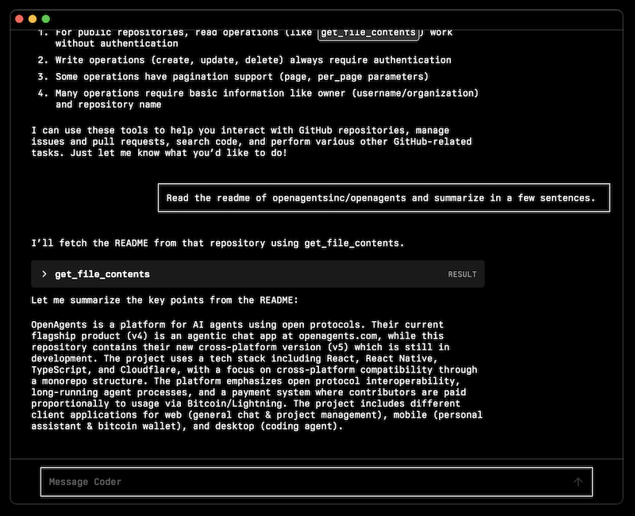
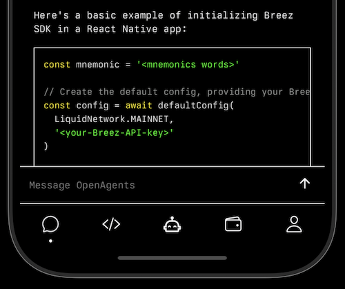
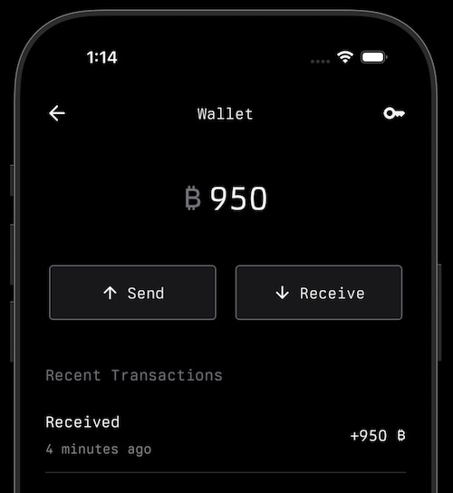

# OpenAgents

OpenAgents is a platform for AI agents using open protocols.

Our current flagship product (v4) is an agentic chat app live at [openagents.com](https://openagents.com).

This repo holds our new cross-platform version (v5), a work in progress.

Initial focus is Coder, our desktop app intended to be a drop-in replacement for Claude Code with standard chat UI & thread history and first-class MCP integration.

## Running Coder locally

Main branch not stable. Basic functionality usable at [15edaaca8ac](https://github.com/OpenAgentsInc/openagents/tree/15edaaca8ac601ac1c1f1a2d816465b375780a42)

```bash
git clone git@github.com:OpenAgentsInc/openagents.git
cd openagents
yarn install
yarn coder
```

Then click settings icon bottom right > API Keys > Add Anthropic and/or OpenRouter key

## Repo Structure

```
  openagents/
  ├── apps/                   # Client applications
  │   ├── chatserver/         # AI SDK chat API
  │   ├── coder/              # Coding agent desktop app
  │   ├── mcp-github-server/  # Remote MCP server with GitHub tools
  │   ├── onyx/               # Onyx mobile app & bitcoin wallet
  │   └── website/            # Web client (React Router/Vite/Cloudflare)
  ├── packages/               # Shared libraries/components
  │   ├── agents/             # Agent definitions
  │   ├── core/               # Shared core logic
  │   └── ui/                 # UI components
  └── docs/                   # Documentation
```

## v5 Tech Stack

- Frontend: React, React Native, TypeScript
- Backend: Cloudflare stack
- Auth: better-auth
- Vercel AI SDK

## v5 Architecture Considerations

- A cross-platform monorepo lets us maximize code reuse across clients for different platforms and use cases, e.g.:
    - Web: General agentic chat & project management
    - Mobile: Personal assistant & bitcoin wallet
    - Desktop: Coder
- Clients should benefit from open protocol interoperability from day one, e.g.:
    - MCP clients
    - Nostr clients (DVMs etc.)
- Agents should run as long-running processes
    - Cloudflare Agent SDK built on Durable Objects
- Agents should be composable from reusable building blocks
    - MCP tools
    - Extism plugins
- Contributors should be paid proportional to paid usage
    - See draft [Flow of Funds](https://github.com/OpenAgentsInc/openagents/wiki/Flow-of-Funds)
    - Via Bitcoin using any Lightning wallet, or soon our noob-friendly Onyx wallet using the Breez SDK
- Agents should be able to have their own wallets
    - Bitcoin/Lightning & stablecoins via [Spark wallet](https://www.spark.info/)?

## Resources

- [Website](https://openagents.com)
- [Follow us on X](https://x.com/OpenAgentsInc)
- [Stacker News Community](https://stacker.news/~openagents)

## Video Series

We've documented a year of development in 160+ videos on X.
Check out [episode one](https://twitter.com/OpenAgentsInc/status/1721942435125715086) or see the [full episode list](https://github.com/OpenAgentsInc/openagents/wiki/Video-Series).

## Screenshots






