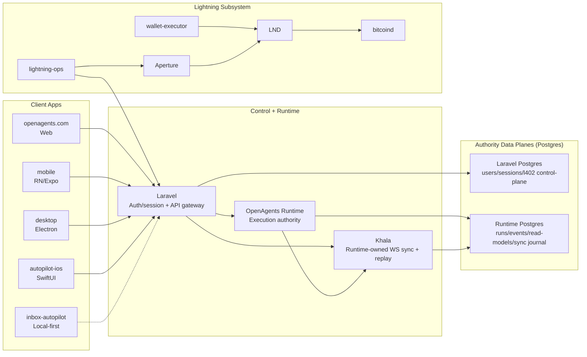

# OpenAgents

OpenAgents is a multi-surface agent platform with two authority planes and one runtime-owned sync plane:

- `apps/openagents-runtime/`: execution authority (runs, worker lifecycle, receipts, replay).
- `apps/openagents.com/`: identity/session/control-plane authority and public API gateway.
- **Khala**: runtime-owned WebSocket sync + replay lane for read-model delivery.

## Product Surfaces

- `apps/openagents.com/`: Laravel web/control-plane app.
- `apps/openagents-runtime/`: Elixir runtime service.
- `apps/mobile/`: React Native + Expo app.
- `apps/desktop/`: Electron app.
- `apps/autopilot-ios/`: Swift/iOS app.
- `apps/onyx/`: Rust local-first notes app.
- `apps/inbox-autopilot/`: local-first inbox automation app.
- `apps/lightning-ops/`: operator tooling for L402 control-plane reconcile.
- `apps/lightning-wallet-executor/`: Bolt11 payment execution service.

## Architecture Snapshot



## Authority Model

- Runtime + runtime Postgres are authority for execution correctness.
- Laravel + Laravel Postgres are authority for identity/session/profile plus Lightning control-plane intent.
- Khala is delivery infrastructure (subscriptions, watermarks, replay), not an authority write path.
- Clients hydrate via HTTP first, then subscribe to Khala for incremental updates.

## Laravel Postgres vs Runtime Postgres

The boundary is defined by **ownership and write authority**, not by whether infra is one DB instance or multiple.

| Plane | Owner | Authority Data | Direct Writers |
|---|---|---|---|
| Laravel Postgres | `apps/openagents.com` | users/sessions/profile, API tokens, `l402_control_plane_*` tables, admin/control-plane persistence | Laravel services/controllers only |
| Runtime Postgres | `apps/openagents-runtime` | run events, worker events, replay artifacts, runtime read models, Khala tables (`runtime.sync_*`) | Runtime services/projectors/sync components only |

Allowed cross-plane interaction:

1. Laravel calls runtime APIs for runtime-owned data and actions.
2. Runtime never back-writes Laravel authority tables directly.
3. Khala reads runtime-owned sync/read-model data; it does not mutate Laravel authority state.

Deployment topology:

- Supported: one Cloud SQL instance with logical DB/schema separation.
- Supported: separate Cloud SQL instances.
- Invariant: ownership boundaries above stay unchanged in either topology.

## How Each App Consumes Khala

| Surface | Khala Usage | Bootstrap Path | Authority Writes |
|---|---|---|---|
| `apps/openagents.com` | Khala WS behind `VITE_KHALA_SYNC_ENABLED` for reactive Codex summaries | Laravel/runtime HTTP + `POST /api/sync/token` | Laravel APIs + runtime APIs |
| `apps/mobile` | Khala WS behind `EXPO_PUBLIC_KHALA_SYNC_ENABLED` for worker summaries | Runtime APIs + `POST /api/sync/token` | Laravel/runtime APIs |
| `apps/desktop` | Khala WS behind `OA_DESKTOP_KHALA_SYNC_ENABLED` for status lanes | Laravel/runtime HTTP + sync token endpoint | Laravel/runtime APIs |
| `apps/autopilot-ios` | Not primary today (runtime SSE lane remains) | Laravel/runtime HTTP + SSE | Laravel/runtime APIs |
| `apps/onyx` | No Khala dependency (local-first storage) | Local vault bootstrap | Local-only data writes |
| `apps/inbox-autopilot` | Not primary today (local-first architecture) | Local daemon + selected APIs | Local daemon + selected APIs |
| `apps/lightning-ops` | No Khala dependency for control-plane (API/mock transport modes) | Internal Laravel control-plane APIs | Laravel internal control-plane APIs |
| `apps/lightning-wallet-executor` | No Khala dependency | Service-local + Lightning infra | Service-local + Lightning infra |

## Khala Delivery Lifecycle

1. Runtime writes canonical authority event in runtime Postgres.
2. Runtime projector updates runtime read-model row.
3. Khala sync sink allocates per-topic watermark and appends stream event.
4. Khala WS channel replays from client watermark and then streams live updates.
5. Clients persist watermark locally and apply updates idempotently by `doc_key` + `doc_version`.

## Primary References

- `docs/ARCHITECTURE.md`
- `docs/sync/thoughts.md`
- `docs/sync/ROADMAP.md`
- `docs/sync/SURFACES.md`
- `apps/openagents-runtime/docs/RUNTIME_CONTRACT.md`
- `apps/openagents-runtime/docs/KHALA_SYNC.md`

## Quick Start (Web)

```bash
cd apps/openagents.com
composer install
npm install
composer run dev
```

More:

- `apps/openagents.com/README.md`
- `docs/README.md`
- `docs/PROJECT_OVERVIEW.md`
- `AGENTS.md`
