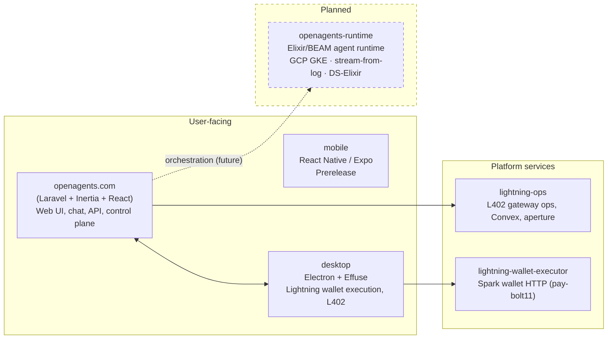

# OpenAgents

OpenAgents is the **operating system for the AI agent economy**. We ship three apps—**web** at [openagents.com](https://openagents.com) (**`apps/openagents.com/`**), **mobile** in **`apps/mobile/`**, and **desktop** in progress—and the platform beneath: **runtime** (identity, transport, payments, treasury on permissionless protocols), **reputation** (trajectory logging, proofs), and a **marketplace** for skills and compute.

**Release quality:** Web is **alpha** (live at [openagents.com](https://openagents.com), Laravel app in **`apps/openagents.com/`**). Mobile and desktop are **prerelease**.

If you're looking for the philosophy / "why open", start with **[MANIFESTO.md](./docs/MANIFESTO.md)**.

## Apps architecture



- **openagents.com** (`apps/openagents.com/`): Core web app — Laravel 12, Inertia, React; chat, auth, API; production deploy to Cloud Run.
- **mobile** (`apps/mobile/`): React Native (Ignite/Expo) mobile surface — prerelease.
- **desktop** (`apps/desktop/`): Electron shell for Lightning (EP212); wallet/payment execution; Convex + OpenAgents API.
- **lightning-ops** (`apps/lightning-ops/`): Effect service for L402 gateway — Convex state, aperture config, route validation.
- **lightning-wallet-executor** (`apps/lightning-wallet-executor/`): HTTP service for agent-owned Spark wallet (e.g. pay-bolt11).
- **openagents-runtime** (planned): Elixir agent runtime; see [docs/plans/active/elixir-agent-runtime-gcp-implementation-plan.md](docs/plans/active/elixir-agent-runtime-gcp-implementation-plan.md) (does not exist yet).

**Vision and architecture:** [docs/SYNTHESIS.md](docs/SYNTHESIS.md) (“OpenAgents: The Agentic OS”) is the north-star spec: what OpenAgents is (the OS for the AI agent economy), core primitives (identity, transport, payments, treasury, FX), the wedge→platform path (Autopilot → trajectory/issue moat → Neobank → skills/compute marketplace → Exchange), and a status-tagged stack. It defers to [SYNTHESIS_EXECUTION.md](docs/SYNTHESIS_EXECUTION.md) for what’s wired today and to [GLOSSARY.md](docs/GLOSSARY.md) and [PROTOCOL_SURFACE.md](docs/protocol/PROTOCOL_SURFACE.md) for terminology and protocol details.

## What’s possible with Autopilot (evolving agent)

Autopilot is an agent you can chat with in plain language. Right now you can sign in on the web, start a conversation, and use it for the capabilities we’ve shipped today (e.g. analyzing code you paste, suggesting refactors, generating configs). What it can do is not fixed: **the system is built to evolve**.

New behaviors are added as **signatures**—versioned, measurable steps with clear inputs and outputs—and can be compiled, tested, and rolled out like software. Over time, the Autopilot “network” will grow through a **marketplace** of signatures and tools: as we and others add capabilities (new tools, new skills), those become available to your Autopilot. So if you ask for something it can’t do yet, the answer is “not yet”—we’re building toward a world where user demand and new signatures continuously expand what’s possible.

**To try it now:** go to [openagents.com](https://openagents.com), sign in, and start chatting. Your Autopilot will remember your preferences and the thread; you can use it for coding help, Blueprint updates, and whatever we’ve enabled so far—with more coming as the ecosystem grows.

## Quick Start (Web)

```bash
cd apps/openagents.com
composer install && npm install
composer run dev
```

See [apps/openagents.com/README.md](apps/openagents.com/README.md) for full dev and deploy instructions.

## Mobile

The mobile app lives in **`apps/mobile/`**.

## Documentation

Start with:

* **Web app**: [apps/openagents.com/](apps/openagents.com/)
* **Mobile app**: [apps/mobile/](apps/mobile/)
* **Vision / architecture (north-star spec)**: [docs/SYNTHESIS.md](docs/SYNTHESIS.md)
* **Docs index (everything else)**: [docs/README.md](docs/README.md)
* **Repo map / ownership**: [docs/PROJECT_OVERVIEW.md](docs/PROJECT_OVERVIEW.md)
* **Agent contract / contribution norms**: [AGENTS.md](./AGENTS.md)
