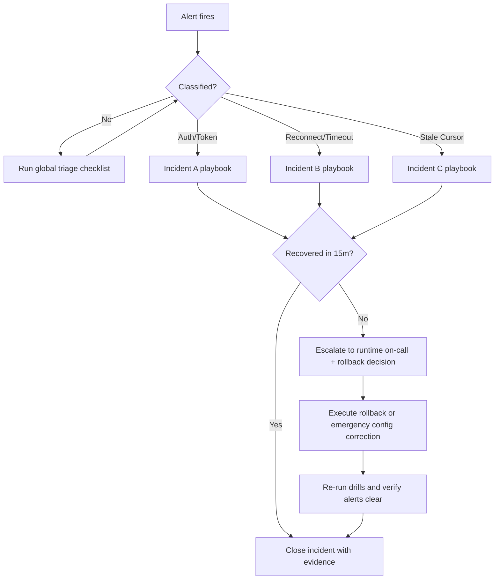

# WS/Auth/Stale-Cursor Incident Runbook

Runbook scope: migration-critical websocket/auth/replay incidents for runtime + Khala.

## Detection Map

Primary alerts:

- `OpenAgentsRuntimeSyncSocketAuthFailureRatioHigh`
- `OpenAgentsRuntimeSyncSocketTimeoutRateHigh`
- `OpenAgentsRuntimeSyncStaleCursorSpike`
- `OpenAgentsKhalaTokenMintFailureRatioHigh`

Dashboards:

- `apps/runtime/deploy/monitoring/grafana/runtime-ops-dashboard.json`
  - `Sync Socket Auth Failure Ratio`
  - `Sync Socket Timeout Rate`
  - `Sync Stale Cursor Incidents (10m)`
  - `Khala Token Mint Failure Ratio`

## Global Triage Checklist

1. Capture incident start time and all firing alert names.
2. Confirm current runtime image and migrate-job image parity:

```bash
GCP_PROJECT=openagentsgemini \
GCP_REGION=us-central1 \
RUNTIME_SERVICE=runtime \
MIGRATE_JOB=runtime-migrate \
apps/runtime/deploy/cloudrun/check-migration-drift.sh
```

3. Pull the last 15 minutes of runtime logs with websocket/auth filtering:

```bash
gcloud logging read \
  'resource.type="cloud_run_revision" AND resource.labels.service_name="runtime" AND (textPayload:"sync" OR textPayload:"token" OR textPayload:"stale_cursor")' \
  --project openagentsgemini \
  --freshness=15m \
  --limit=200 \
  --format='value(timestamp,textPayload)'
```

4. Determine incident class below and execute class-specific playbook.

## Incident A: WS Auth and Token Failures

Triggers:

- `OpenAgentsRuntimeSyncSocketAuthFailureRatioHigh`
- `OpenAgentsKhalaTokenMintFailureRatioHigh`

Likely causes:

- sync token signing key mismatch/rotation drift
- bad issuer/audience/claims version values
- token mint endpoint auth regression
- expired/revoked session/token churn

Actions:

1. Validate runtime sync auth env values (`issuer`, `audience`, active signing key set) match control-service mint config.
2. Confirm token mint endpoint health and error class mix in control-plane logs.
3. Check sync auth reject reasons in runtime telemetry (`unknown_kid`, `claim_mismatch`, `token_expired`, `missing_token`).
4. If key drift is confirmed, rotate to known-good key set and redeploy runtime/control in lock-step.
5. Re-run auth drill slice:

```bash
cd apps/runtime
mix test test/openagents_runtime/sync/jwt_verifier_test.exs --only chaos_drill
mix test test/openagents_runtime_web/channels/sync_channel_test.exs --only chaos_drill
```

Exit criteria:

- auth failure ratio falls below 2% for 15m
- no continuing `unknown_kid`/`claim_mismatch` burst in logs

## Incident B: WS Reconnect and Timeout Storm

Trigger:

- `OpenAgentsRuntimeSyncSocketTimeoutRateHigh`

Likely causes:

- websocket heartbeat timeout tuning mismatch
- client reconnect storm after runtime/Khala restart
- upstream network path instability

Actions:

1. Check connection churn (`openagents_runtime_sync_socket_connection_count`) and reconnect rate (`openagents_runtime_sync_socket_reconnect_count`).
2. Inspect timeout-heavy clients/surfaces from logs/trace metadata.
3. Validate heartbeat interval/timeout settings and recent deploy diffs.
4. If reconnect storm follows deploy, rollback runtime revision to last known-good.
5. Run reconnect drill slice:

```bash
cd apps/runtime
mix test test/openagents_runtime_web/channels/sync_channel_test.exs --only chaos_drill
```

Exit criteria:

- timeout rate returns to baseline
- reconnect sessions resume without replay gaps

## Incident C: `stale_cursor` Spike

Trigger:

- `OpenAgentsRuntimeSyncStaleCursorSpike`

Likely causes:

- clients offline past replay retention horizon
- retention horizon accidentally shortened
- rapid deploy churn with reconnect backlog

Actions:

1. Confirm retention configuration and recent retention-job runs.
2. Check stale topic distribution and retention floor from error payloads.
3. Validate client behavior: stale cursor must trigger full resnapshot + watermark reset.
4. If service-side retention is misconfigured, restore prior horizon and replay affected projections.
5. Run stale-cursor drill slice:

```bash
cd apps/runtime
mix test test/openagents_runtime_web/channels/sync_channel_test.exs --only chaos_drill
```

Exit criteria:

- stale cursor incident rate decreases after client resync/retention correction
- no repeated stale cursor loops for same active client cohort

## Escalation and Rollback Decision Flow



Escalate immediately (no wait) when any are true:

1. Auth failures block >25% of new websocket sessions for >5m.
2. Timeout storm prevents reconnect recovery for >10m.
3. `stale_cursor` spikes coincide with projection drift/hash mismatch incidents.
4. Two mitigation attempts fail to restore metrics within one alert window.

## Rehearsal Evidence

- Tabletop report: `apps/runtime/docs/reports/2026-02-21-ws-auth-stale-cursor-tabletop.md`
