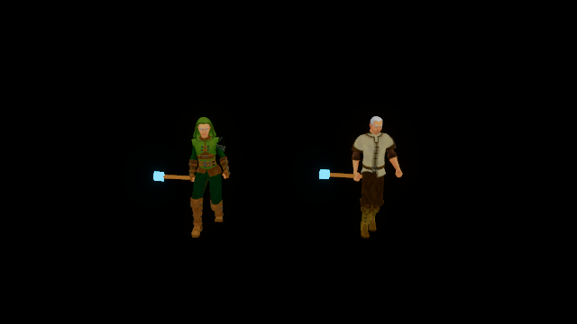

# Character locomotion acceptance

V21 adds one Rust animation controller for authoring previews and the native
renderer. It blends idle, walk, and run by presented speed, derives gait phase
from traveled distance, applies bounded turn and aim adjustments, and places
feet against admitted, read-only terrain queries. Root motion remains in place;
animation cannot move the authority or prediction.

`named-rigs.json` retains a 300-frame fixture for the male peasant and female
ranger at each of three crowd tiers. Body placements are scripted across slope
and stair query geometry. Each fixture includes idle, movement, casting, death,
prone, and a new life. It checks final equipment sockets, planted contacts, and
marker order. The greatest planted-foot drift is 4.17 mm, below the 5 mm bound;
socket matrix differences are zero. Pose samples fall from 300 to 152 and 79.
Markers advance every frame, including frames that reuse a skeletal pose.

Each tier also repeats the same independent authority combat script. Ordered
checkpoint hashes, accepted or refused casts, and damage events match across
tiers. The checkpoint before and after every visual update is identical. This
establishes presentation isolation; it does not establish cross-build or
cross-architecture floating-point determinism.

The merged engine suite passes 152 tests. The full optimized world suite passes 576
tests with three ignored helpers before the observer geometry addition; a final
focused check verifies that addition without advancing prediction or authority.
The content suite passes 24 tests and its CLI workflow before the final aim-pitch
sign correction; the final named-rig replay exercises the corrected controller.
The content editor test covers graph admission, rejection without a journal
mutation, cached diagnostics, undo, and redo. Actual compiler admission covers
all six standard outfits.

Against current main, the renderer passes 80 library tests with six graphics
checks ignored. The native client passes 54 tests with five graphics checks
ignored. The explicit offscreen Vulkan check separately passes on an NVIDIA
GeForce RTX 4080 at the high renderer tier. `renderer.json` retains its adapter,
device profile, per-frame animation diagnostics, and counters. Over 18 frames,
it records 29 planted contacts and zero equipment-socket matrix error. Bodies
and equipment use the same final palette. The query terrain is not drawn in the
capture. GPU timestamp queries are disabled, so this is a palette integration
check, not a GPU timing result.

Checks use the pinned Rust toolchain and the existing warm Cargo target. Some
behavior fixtures use package-specific zero-debug or zero-optimization test
overrides to fit the shared disk. Their sample counts describe algorithm work,
not measured CPU or GPU frame time. GPU skinning still runs every frame.

The disk filled during terrain-query compilation, renderer linking, and native
dependency compilation. The first final rig run also
failed its evidence write because its relative destination resolved under the
crate directory; the retry uses an absolute destination. Both failures are
retained. The native fixture initially lacked a terrain-coordinate type
annotation, and the first GPU run refused an undeclared idle state on the static
wand. The corrected GPU fixture uses the wand's legacy default binding. Native
library results before that test-only binding correction remain labeled as
such; the final GPU executable has its own recorded hash.
Executable retirement receipts preserve hashes and provenance for
completed or obsolete audit checks. Each retirement checks all hard links and
visible process executable inodes. Dependency archives remain in the existing
target paths. Relocation receipts preserve the audit's incremental data in private RAM
scratch while the shared disk is full; existing target paths remain linked. The
retained wrappers redirect affected incremental writes and compiler outputs,
without changing the declared optimization or debug profiles. Owner processes
and devices remain untouched. The incremental data must return to persistent
storage after disk capacity is available.

These fixtures cover explicitly named Universal skeleton mappings and retained
licensed assets. They do not prove arbitrary retargeting, facial performance,
animation-driven gameplay root motion, a complete motor traversal over terrain,
backward/strafe gait admission, physical-device budgets, or production art quality.
