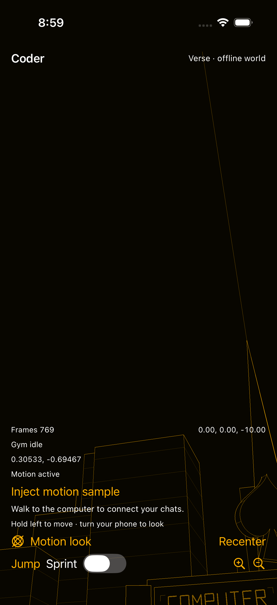

# Motion camera evidence

This directory retains the focused verification for
[the motion-camera correction](../../../../docs/coder/verification/2026-09-26-motion-camera.md)
and [issue #9716](https://github.com/OpenAgentsInc/openagents/issues/9716).
Stored text logs have trailing whitespace removed; original logs and result
bundles remain in the local paths recorded here. Checks use synthetic poses
and offline application data. They do not run
models, benchmarks, or paid services.

- [Native motion checks](native-motion-checks.log): fresh sample delivery during
  uneven display callbacks, receipt-time freshness, lifecycle, unavailable sensors, and independent Core Motion gravity
  and viewing-direction fixtures for upright, left, right, and upward poses.
- [Rust mobile tests](rust-mobile-tests.log): 19 Verse scene checks passed,
  including real body rotations, sign/roll equivalence, wrapped smoothing,
  display and sensor rate independence, slow frames, pole crossings, movement,
  and lifecycle resets.
- Portable Verse: `cargo test -p verse --no-default-features --lib` passed all
  124 tests, including actual upward view direction and ordinary orbit views.
- [Strict Clippy](rust-clippy.log): `coder-mobile` and portable `verse` libraries
  and tests passed with warnings denied.
- [Desktop consumer check](rust-desktop-check.log): the default-feature `verse`
  binary compiled successfully.
- [Android Kotlin compilation](android-kotlin-compile.log): application and
  instrumentation-test sources compiled. Existing system-bar deprecation
  warnings remain. This is not an Android runtime acceptance result.
- Native Swift: all app sources passed iOS arm64 typechecking; the focused UI
  test passed simulator typechecking.
- [Final iOS UI run](ios-ui-final.log): all three `FullscreenMotionUITests`
  passed against build 44 on a dedicated iPhone 17 Pro simulator with iOS 26.5.
  This covers full-screen layout; left and right body turns; upward look;
  smoothed settling; touch suppression in motion mode; left-side movement;
  recenter; background/resume; and unavailable-sensor touch fallback.

Rust commands used the pinned toolchain with the per-worktree target directory,
`CARGO_INCREMENTAL=0`, `CARGO_PROFILE_DEV_DEBUG=0`, and `CARGO_BUILD_JOBS=2`.

Verification ran on September 26 local time and September 27 UTC. Native
fixtures and simulator results do not establish physical-device motion comfort
or performance. The [first iOS UI run](ios-ui-attempt1.log) was interrupted: the
simulator host killed the XCTest runner while another agent launched a different test
suite on the same simulator. The Coder app remained running. The
[filtered runner diagnostic](ios-runner-interruption.log) records the host's
termination request. That run is not counted as a passing motion check.
The final run uses a dedicated simulator to avoid concurrent installations
and test-runner replacement. Its device ID is
`A0B00847-76AC-472F-A90F-B008FEFF390B`; the local result bundle is
`/tmp/coder-motion44-final.xcresult`. The temporary simulator was shut down
and removed after capture; its result bundle and exported evidence remain.
[Build 44's distribution receipt](testflight-build44.json) confirms a clean
source archive, successful signature verification and upload, and Apple states
`VALID` and `IN_BETA_TESTING`. Release notes are saved for internal testers.

The [structured UI summary](ios-ui-summary.json) and
[native source hashes](native-source.sha256) identify the tested app boundary.
The final capture was inspected: the camera points above the buildings with
pitch `-0.69467` radians. Test-only diagnostics and the injected-pose button
appear only in the explicit synthetic preview.

