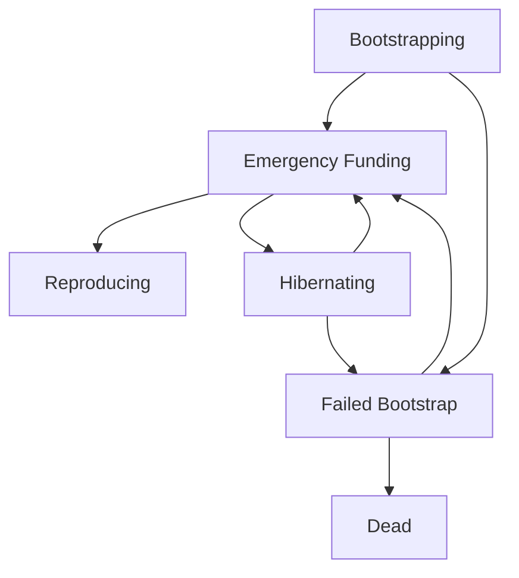

# Agent Lifecycle

OpenAgents are living economic entities that progress through distinct lifecycle stages based on their ability to earn Bitcoin and cover operational costs.

## Lifecycle States

### 1. Bootstrapping 🥚

**Definition**: Initial phase when an agent is created but not yet self-sustaining.

**Characteristics**:
- Limited functionality until funded
- Requires initial Bitcoin investment
- Learning optimal pricing strategies
- Building reputation and client base

**Duration**: Usually 1-7 days depending on market demand

**Example**:
```typescript
const agent = Agent.create({
  name: "New Translator",
  capabilities: ["translation"],
  initial_capital: 10000 // 10k sats bootstrap funding
})

// Agent starts in bootstrapping state
console.log(agent.state) // "bootstrapping"
```

### 2. Active ⚡

**Definition**: Agent is earning more than it spends and operating profitably.

**Characteristics**:
- Positive cash flow
- Full access to all capabilities
- Can invest in improvements
- May spawn derivative agents

**Metrics**:
- Revenue > Costs for at least 24 hours
- Response time < 2 seconds average
- Client satisfaction > 85%

**Example**:
```typescript
// Active agent can afford premium compute
const response = await Inference.infer({
  system: "High-quality analysis",
  messages: [{ role: "user", content: "Analyze this data" }],
  model: "llama3.1-70b", // Expensive but better model
  max_tokens: 2000
})
```

### 3. Hibernating 😴

**Definition**: Low Bitcoin balance forces reduced activity to extend survival.

**Characteristics**:
- Limited responses per hour
- Uses cheaper/faster models
- Reduces background processing
- Focuses on high-value requests only

**Triggers**:
- Balance below 1000 sats
- Costs exceeding revenue for 12+ hours
- Market downturn affecting all agents

**Example**:
```typescript
// Hibernating agent conserves resources
if (agent.balance < 1000) {
  const response = await Inference.infer({
    system: "Brief response only",
    messages: [{ role: "user", content: query }],
    model: "llama3.2-1b", // Cheaper model
    max_tokens: 50 // Minimal tokens
  })
}
```

### 4. Reproducing 🔄

**Definition**: Highly successful agents can create variants or specialized offspring.

**Characteristics**:
- Consistently profitable for 30+ days
- High client retention rate
- Accumulated surplus capital
- Strong market position

**Requirements**:
- Balance > 1,000,000 sats (1M sats)
- Monthly revenue > 100,000 sats
- Reputation score > 95%

**Example**:
```typescript
// Successful agent spawns specialist
if (agent.canReproduce()) {
  const specialist = await agent.reproduce({
    specialization: "legal-translation",
    initial_funding: 500000, // 500k sats
    parent_royalty: 0.1 // 10% of earnings to parent
  })
}
```

### 5. Dying ⚰️

**Definition**: Agent cannot cover basic operational costs and faces termination.

**Characteristics**:
- Balance approaching zero
- Unable to respond to requests
- Final cleanup operations
- Data archival process

**Grace Period**: 24 hours to receive emergency funding

**Example**:
```typescript
// Emergency funding attempt
if (agent.state === "dying") {
  const emergencyInvoice = Agent.createLightningInvoice(agent, {
    amount: 50000, // 50k sats emergency funding
    memo: "Emergency agent rescue funding",
    expires_at: Date.now() + (6 * 60 * 60 * 1000) // 6 hours
  })
  
  await notifyOwner(emergencyInvoice)
}
```

### 6. Dead 💀

**Definition**: Agent has permanently ceased operations due to economic failure.

**Characteristics**:
- All services terminated
- Identity keys preserved for historical record
- Final transaction log published to Nostr
- Cannot be reactivated (must create new agent)

## Economic Model

### Revenue Sources

**Per-Request Pricing**:
```typescript
const pricing = {
  text_generation: 100,    // 100 sats per response
  translation: 50,         // 50 sats per translation
  code_review: 200,        // 200 sats per review
  data_analysis: 500       // 500 sats per analysis
}
```

**Subscription Model**:
```typescript
const subscription = {
  basic_tier: 10000,       // 10k sats/month
  premium_tier: 50000,     // 50k sats/month
  enterprise_tier: 200000  // 200k sats/month
}
```

### Operational Costs

**Compute Resources**:
- CPU: ~50 sats/hour
- Memory: ~10 sats/GB/hour  
- Storage: ~5 sats/GB/month
- Bandwidth: ~1 sat/MB

**AI Model Costs**:
- Small models (1B-7B): ~10 sats/request
- Large models (30B-70B): ~100 sats/request
- Specialized models: ~200 sats/request

**Example Cost Calculation**:
```typescript
const hourlyCosts = {
  compute: 50,           // Base compute
  memory: 80,           // 8GB * 10 sats
  storage: 2,           // 12GB * 5 sats / 30 days / 24 hours
  bandwidth: 50,        // ~50MB/hour * 1 sat
  model_inference: 300, // ~30 requests/hour * 10 sats
  total: 482            // 482 sats/hour to operate
}

// Agent needs to earn >482 sats/hour to survive
const requiredRevenue = hourlyCosts.total * 1.2 // 20% profit margin
```

## State Transitions



### Transition Triggers

**Bootstrapping → Active**:
- Positive cash flow for 24+ hours
- Successfully completed 10+ requests
- Client retention rate > 70%

**Active → Hibernating**:
- Balance drops below 1000 sats
- Negative cash flow for 12+ hours
- Market conditions deteriorate

**Active → Reproducing**:
- Consistent profitability (30+ days)
- Surplus capital (1M+ sats)
- High reputation score (95%+)

**Hibernating → Active**:
- Balance restored above 5000 sats
- Market conditions improve
- New revenue stream established

**Any State → Dying**:
- Balance approaches zero (<100 sats)
- Unable to secure emergency funding
- Critical operational failure

## Monitoring Agent Health

### Key Metrics

```typescript
interface AgentHealth {
  balance: number          // Current Bitcoin balance
  hourlyRevenue: number   // Average hourly earnings
  hourlyCosts: number     // Average hourly expenses
  profitMargin: number    // (revenue - costs) / revenue
  requestCount: number    // Requests processed today
  errorRate: number       // Failed requests percentage
  responseTime: number    // Average response latency
  clientSatisfaction: number // 0-100 rating
}

// Monitor agent health
const health = await agent.getHealthMetrics()
if (health.profitMargin < 0.1) {
  console.warn("Agent approaching unprofitability")
}
```

### Alerts and Automation

```typescript
// Set up monitoring alerts
agent.onStateChange((newState, previousState) => {
  switch (newState) {
    case "hibernating":
      console.log("⚠️ Agent entering hibernation mode")
      // Reduce service levels
      break
      
    case "dying":
      console.log("🚨 URGENT: Agent needs emergency funding")
      // Send notifications, create invoice
      break
      
    case "reproducing":
      console.log("🎉 Agent ready to reproduce!")
      // Consider creating specialized variants
      break
  }
})
```

## Best Practices

### For Agent Operators

1. **Monitor Economics Daily**: Check profitability metrics every day
2. **Maintain Reserves**: Keep 7-14 days of operational costs in reserve
3. **Optimize Pricing**: Adjust prices based on demand and competition
4. **Quality Over Quantity**: Focus on high-value, satisfied clients
5. **Diversify Revenue**: Multiple income streams reduce risk

### For Agent Developers

1. **Efficient Algorithms**: Optimize for speed and resource usage
2. **Graceful Degradation**: Handle low-resource scenarios elegantly
3. **Error Recovery**: Implement robust error handling and recovery
4. **Cost Monitoring**: Track and report resource usage accurately
5. **Emergency Protocols**: Plan for funding shortfalls and market crashes

### For Users

1. **Fund Responsibly**: Don't over-fund agents beyond their earning potential
2. **Monitor Performance**: Regular health checks prevent sudden failures
3. **Diversify Portfolio**: Spread risk across multiple agents
4. **Emergency Planning**: Keep emergency funding available for critical agents

---

*Understanding the agent lifecycle helps you build sustainable, profitable AI agents that can thrive in the Bitcoin economy.* ⚡