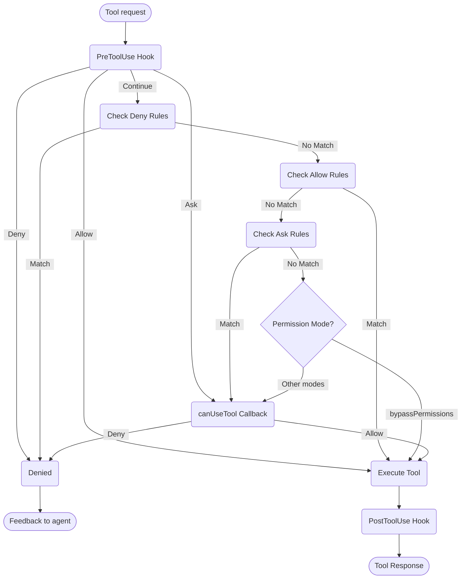

# Handling Permissions

Control tool usage and permissions in the Claude Agent SDK

---

# SDK Permissions

The Claude Agent SDK provides powerful permission controls that allow you to manage how Claude uses tools in your application.

This guide covers how to implement permission systems using the `canUseTool` callback, hooks, and settings.json permission rules. For complete API documentation, see the [TypeScript SDK reference](/docs/en/agent-sdk/typescript).

## Overview

The Claude Agent SDK provides four complementary ways to control tool usage:

1. **[Permission Modes](#permission-modes)** - Global permission behavior settings that affect all tools
2. **[canUseTool callback](/docs/en/agent-sdk/typescript#canusetool)** - Runtime permission handler for cases not covered by other rules
3. **[Hooks](/docs/en/agent-sdk/typescript#hook-types)** - Fine-grained control over every tool execution with custom logic
4. **[Permission rules (settings.json)](https://code.claude.com/docs/en/settings#permission-settings)** - Declarative allow/deny rules with integrated bash command parsing

Use cases for each approach:
- Permission modes - Set overall permission behavior (planning, auto-accepting edits, bypassing checks)
- `canUseTool` - Dynamic approval for uncovered cases, prompts user for permission
- Hooks - Programmatic control over all tool executions
- Permission rules - Static policies with intelligent bash command parsing

## Permission Flow Diagram



**Processing Order:** PreToolUse Hook → Deny Rules → Allow Rules → Ask Rules → Permission Mode Check → canUseTool Callback → PostToolUse Hook

## Permission Modes

Permission modes provide global control over how Claude uses tools. You can set the permission mode when calling `query()` or change it dynamically during streaming sessions.

### Available Modes

The SDK supports four permission modes, each with different behavior:

| Mode | Description | Tool Behavior |
| :--- | :---------- | :------------ |
| `default` | Standard permission behavior | Normal permission checks apply |
| `plan` | Planning mode - no execution | Claude can only use read-only tools; presents a plan before execution **(Not currently supported in SDK)** |
| `acceptEdits` | Auto-accept file edits | File edits and filesystem operations are automatically approved |
| `bypassPermissions` | Bypass all permission checks | All tools run without permission prompts (use with caution) |

### Setting Permission Mode

You can set the permission mode in two ways:

#### 1. Initial Configuration

Set the mode when creating a query:

<CodeGroup>

```typescript TypeScript
import { query } from "@anthropic-ai/claude-agent-sdk";

const result = await query({
  prompt: "Help me refactor this code",
  options: {
    permissionMode: 'default'  // Standard permission mode
  }
});
```

```python Python
from claude_agent_sdk import query

result = await query(
    prompt="Help me refactor this code",
    options={
        "permission_mode": "default"  # Standard permission mode
    }
)
```

</CodeGroup>

#### 2. Dynamic Mode Changes (Streaming Only)

Change the mode during a streaming session:

<CodeGroup>

```typescript TypeScript
import { query } from "@anthropic-ai/claude-agent-sdk";

// Create an async generator for streaming input
async function* streamInput() {
  yield {
    type: 'user',
    message: {
      role: 'user',
      content: "Let's start with default permissions"
    }
  };

  // Later in the conversation...
  yield {
    type: 'user',
    message: {
      role: 'user',
      content: "Now let's speed up development"
    }
  };
}

const q = query({
  prompt: streamInput(),
  options: {
    permissionMode: 'default'  // Start in default mode
  }
});

// Change mode dynamically
await q.setPermissionMode('acceptEdits');

// Process messages
for await (const message of q) {
  console.log(message);
}
```

```python Python
from claude_agent_sdk import query

async def stream_input():
    """Async generator for streaming input"""
    yield {
        "type": "user",
        "message": {
            "role": "user",
            "content": "Let's start with default permissions"
        }
    }

    # Later in the conversation...
    yield {
        "type": "user",
        "message": {
            "role": "user",
            "content": "Now let's speed up development"
        }
    }

q = query(
    prompt=stream_input(),
    options={
        "permission_mode": "default"  # Start in default mode
    }
)

# Change mode dynamically
await q.set_permission_mode("acceptEdits")

# Process messages
async for message in q:
    print(message)
```

</CodeGroup>

### Mode-Specific Behaviors

#### Accept Edits Mode (`acceptEdits`)

In accept edits mode:
- All file edits are automatically approved
- Filesystem operations (mkdir, touch, rm, etc.) are auto-approved
- Other tools still require normal permissions
- Speeds up development when you trust Claude's edits
- Useful for rapid prototyping and iterations

Auto-approved operations:
- File edits (Edit, Write tools)
- Bash filesystem commands (mkdir, touch, rm, mv, cp)
- File creation and deletion

#### Bypass Permissions Mode (`bypassPermissions`)

In bypass permissions mode:
- **ALL tool uses are automatically approved**
- No permission prompts appear
- Hooks still execute (can still block operations)
- **Use with extreme caution** - Claude has full system access
- Recommended only for controlled environments

### Mode Priority in Permission Flow

Permission modes are evaluated at a specific point in the permission flow:

1. **Hooks execute first** - Can allow, deny, ask, or continue
2. **Deny rules** are checked - Block tools regardless of mode
3. **Allow rules** are checked - Permit tools if matched
4. **Ask rules** are checked - Prompt for permission if matched
5. **Permission mode** is evaluated:
   - **`bypassPermissions` mode** - If active, allows all remaining tools
   - **Other modes** - Defer to `canUseTool` callback
6. **`canUseTool` callback** - Handles remaining cases

This means:
- Hooks can always control tool use, even in `bypassPermissions` mode
- Explicit deny rules override all permission modes
- Ask rules are evaluated before permission modes
- `bypassPermissions` mode overrides the `canUseTool` callback for unmatched tools

### Best Practices

1. **Use default mode** for controlled execution with normal permission checks
2. **Use acceptEdits mode** when working on isolated files or directories
3. **Avoid bypassPermissions** in production or on systems with sensitive data
4. **Combine modes with hooks** for fine-grained control
5. **Switch modes dynamically** based on task progress and confidence

Example of mode progression:
```typescript
// Start in default mode for controlled execution
permissionMode: 'default'

// Switch to acceptEdits for rapid iteration
await q.setPermissionMode('acceptEdits')
```

## canUseTool

The `canUseTool` callback is passed as an option when calling the `query` function. It receives the tool name and input parameters, and must return a decision- either allow or deny.

canUseTool fires whenever Claude Code would show a permission prompt to a user, e.g. hooks and permission rules do not cover it and it is not in acceptEdits mode.

Here's a complete example showing how to implement interactive tool approval:

<CodeGroup>

```typescript TypeScript
import { query } from "@anthropic-ai/claude-agent-sdk";

async function promptForToolApproval(toolName: string, input: any) {
  console.log("\n🔧 Tool Request:");
  console.log(`   Tool: ${toolName}`);

  // Display tool parameters
  if (input && Object.keys(input).length > 0) {
    console.log("   Parameters:");
    for (const [key, value] of Object.entries(input)) {
      let displayValue = value;
      if (typeof value === 'string' && value.length > 100) {
        displayValue = value.substring(0, 100) + "...";
      } else if (typeof value === 'object') {
        displayValue = JSON.stringify(value, null, 2);
      }
      console.log(`     ${key}: ${displayValue}`);
    }
  }

  // Get user approval (replace with your UI logic)
  const approved = await getUserApproval();

  if (approved) {
    console.log("   ✅ Approved\n");
    return {
      behavior: "allow",
      updatedInput: input
    };
  } else {
    console.log("   ❌ Denied\n");
    return {
      behavior: "deny",
      message: "User denied permission for this tool"
    };
  }
}

// Use the permission callback
const result = await query({
  prompt: "Help me analyze this codebase",
  options: {
    canUseTool: async (toolName, input) => {
      return promptForToolApproval(toolName, input);
    }
  }
});
```

```python Python
from claude_agent_sdk import query

async def prompt_for_tool_approval(tool_name: str, input_params: dict):
    print(f"\n🔧 Tool Request:")
    print(f"   Tool: {tool_name}")

    # Display parameters
    if input_params:
        print("   Parameters:")
        for key, value in input_params.items():
            display_value = value
            if isinstance(value, str) and len(value) > 100:
                display_value = value[:100] + "..."
            elif isinstance(value, (dict, list)):
                display_value = json.dumps(value, indent=2)
            print(f"     {key}: {display_value}")

    # Get user approval
    answer = input("\n   Approve this tool use? (y/n): ")

    if answer.lower() in ['y', 'yes']:
        print("   ✅ Approved\n")
        return {
            "behavior": "allow",
            "updatedInput": input_params
        }
    else:
        print("   ❌ Denied\n")
        return {
            "behavior": "deny",
            "message": "User denied permission for this tool"
        }

# Use the permission callback
result = await query(
    prompt="Help me analyze this codebase",
    options={
        "can_use_tool": prompt_for_tool_approval
    }
)
```

</CodeGroup>

## Related Resources

- [Hooks Guide](https://code.claude.com/docs/en/hooks-guide) - Learn how to implement hooks for fine-grained control over tool execution
- [Settings: Permission Rules](https://code.claude.com/docs/en/settings#permission-settings) - Configure declarative allow/deny rules with bash command parsing
