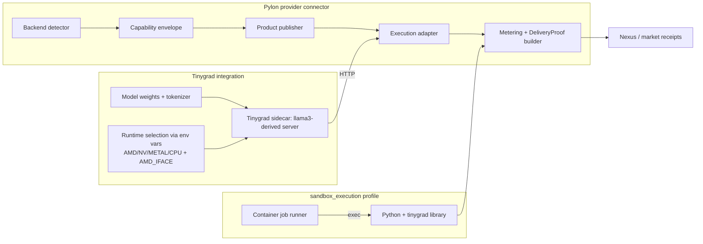
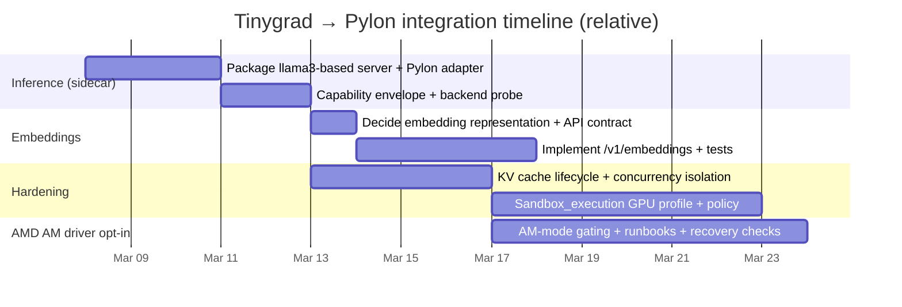

# Tinygrad Integration Research for OpenAgents Pylon Compute Plan

## Executive summary

Tinygrad is not “just a model runner”; it is an end‑to‑end deep learning stack (tensor library + compiler + execution engine) that happens to include multiple inference‑capable examples and runtime backends. For Pylon, this matters because Tinygrad can be integrated in multiple deployment shapes: as a library inside a sandbox job, as a local sidecar process that exposes an API, or as a backend selected by environment variables that drives GPU execution directly. Tinygrad’s documentation explicitly emphasizes multi‑GPU sharding (“shard your Tensors with `Tensor.shard`”), a simple JIT (`TinyJit`), and multiple runtimes selectable via environment variables. citeturn24view0turn36view0turn28search4

On AMD specifically, Tinygrad offers two materially different paths: (a) the “AMD backend” that uses the Linux amdgpu driver via KFD, and (b) the “AM driver,” a userspace driver targeting RDNA3/RDNA4 that runs with `AMD=1` and expects the amdgpu kernel module to be unloaded; Tinygrad’s runtime docs also warn that `AMD_IFACE=PCI` “may unbind your GPU from the amdgpu driver.” These are very different operational and security postures for providers. citeturn36view0turn33view0

For LLM inference readiness, Tinygrad’s `examples/llama3.py` is the most “Pylon‑shaped” artifact: it loads weights (including GGUF via a disk‑backed tensor), supports multiple quantization modes (int8 / NF4 / FP8), can shard a model across multiple devices, and exposes an HTTP API with OpenAI‑like endpoints such as `/v1/models`, `/v1/completions`, and `/v1/chat/completions` (streaming). citeturn23view0turn25view3turn23view2turn14view0  
However, Tinygrad’s Llama3 example does **not** implement an embeddings endpoint (no `/v1/embeddings` in `llama3.py`), so “Tinygrad embeddings” will require either (1) adding an embeddings route to that server, or (2) using Tinygrad’s separate model zoo (e.g., BERT/CLIP) or its PyTorch “tiny” backend to run conventional embedding models. citeturn25view2turn25view0turn31view3turn26search3

The AMD “AM driver” appears active and evolving rather than frozen: commit history for `amdev.py` shows multiple recent commits in early 2026 addressing MI3xx recovery, SDMA, and related reliability concerns, which affects Pylon risk/ops planning. citeturn41view0turn42view0

## Tinygrad snapshot that matters for Pylon

### Runtime backends and interfaces you can treat as provider capability dimensions

Tinygrad’s runtime documentation describes multiple backends and indicates that you can “force a specific runtime to be default using environment variables (e.g., `CPU=1`).” It lists `AMD` (RDNA2+), `NV`, `METAL`, `CUDA`, `CL`, `CPU`, and `WEBGPU`, with AMD interfaces selectable via `AMD_IFACE=(KFD|PCI|USB)`. citeturn36view0

The same runtime docs explicitly characterize AMD interfaces in a way that maps cleanly into a Pylon “capability envelope”:

- `KFD`: uses the amdgpu driver (kernel‑mediated, conventional ROCm‑style device access). citeturn36view0  
- `PCI`: uses the AM driver and “may unbind your GPU from the amdgpu driver.” citeturn36view0turn33view0  
- `USB`: “USB3 interface for asm24xx chips.” citeturn36view0  

This suggests Pylon should treat “Tinygrad on AMD” as at least two distinct provider modes (`AMD_IFACE=KFD` vs `AMD_IFACE=PCI`) with different readiness and risk.

### AM driver reality and George Hotz positioning

Tinygrad’s own AM driver doc is unusually operational: it calls AM “a userspace driver targeting AMD’s RDNA3/RDNA4,” says “Make sure that amdgpu module is unloaded and just run tinygrad with `AMD=1`,” and lists optional requirements like “System without IOMMU for P2P / SDMA support” and “vfio-pci module for IRQ handling.” citeturn33view0

The same doc includes details that matter for “attestation posture” and troubleshooting in a provider network: queue binding (“Tinygrad uses only one compute queue… `pipe=0 queue=0`” and one SDMA queue at `engine=0 queue=0`), plus boot states and reset requirements. citeturn33view0

On public positioning, George Hotz’s “AMD YOLO” post explicitly frames Tinygrad as building a “fully sovereign AMD stack,” mentions Tinygrad “has a torch frontend now,” and expresses an expectation that “with good software, the MI300X should outperform the H100.” This is not a benchmark guarantee, but it is a signal of intent and focus. citeturn46search1  
Separately, Hotz opened an issue titled “AM backend is stable for MI300X/MI350X,” but the issue body itself lists remaining work items (e.g., SDMA warm boot, AQL warm boot bug, MI350 clocks), which again suggests “promising but moving.” citeturn46search0

### Evidence of active AMD driver engineering in early 2026

Commit history for `tinygrad/runtime/support/am/amdev.py` shows a sequence of 2026 commits (Jan–Mar 2026) including “am: mi3xx recovery,” “am: enable all sdma engines,” and other recovery/boot/persistence related work. citeturn41view0  
A representative commit (“am: mi3xx recovery #15051”) modifies recovery logic and adds/reset behavior for multi‑XCC systems (soft reset loops guarded by `self.xccs > 1`). citeturn42view0  
For OpenAgents, the key implication is: if you expose Tinygrad AM driver providers broadly, you should plan for higher variance and the need for aggressive health checks, crash recovery, and honest capability/eligibility gating.

### LLM example maturity signals you can leverage

Tinygrad’s `examples/llama3.py` has a visible commit history with performance‑ and capability‑relevant milestones (e.g., “fix llama3 with nf4 quantize,” “add quantize fp8 in llama3,” plus later maintenance). citeturn39view0

It also appears intentionally “serverable”: it includes an HTTP server surface with endpoints `/v1/models`, `/v1/completions`, and `/v1/chat/completions`, including streaming enforcement. citeturn14view0  
This makes it the best existing starting point for a Pylon “tinygrad.*” inference adapter.

## Tinygrad inference components relevant to Pylon

### Model execution runtime and KV cache

Tinygrad’s Llama transformer implementation (`extra/models/llama.py`) includes an explicit in‑memory KV cache in the `Attention` module when `max_context` is enabled: it allocates `cache_kv` as a `Tensor.zeros(2, bsz, max_context, n_kv_heads, head_dim, ...)`, updates slices via `.assign(Tensor.stack(xk, xv))`, and then reads keys/values from the cached region for subsequent tokens. citeturn22view0

Two details are especially actionable for Pylon:

- There is already a multi‑device hook: if `x.device` is a tuple (sharded execution), `cache_kv.shard_(x.device, axis=...)` is invoked when `SHARD_KVCACHE` is set. citeturn22view0  
- This KV cache is purely memory‑resident as written (no disk/offload path in the KV code), which means long contexts directly pressure VRAM/RAM and will interact with provider inventory promises. citeturn22view0  

### Quantization support in the Llama3 runner

`examples/llama3.py` implements multiple quantization modes:

- int8 linear weights (`Int8Linear`) with per‑row scaling and optional embedding quantization. citeturn23view0turn23view2  
- NF4 block quantization (`NF4Linear`) with explicit codebook and per‑block scale tensors. citeturn23view1turn23view2  
- FP8 quantization (`FP8Linear` / `quantize_to_fp8`). citeturn25view3turn39view0  

`build_transformer(...)` selects these modes via `--quantize` (`int8`, `nf4`, `fp8`, or `float16`). citeturn25view3  
This is exactly the kind of “capability envelope” dimension Pylon should surface, because it changes throughput, memory footprint, and (for embeddings) numerical behavior.

### Multi‑GPU and sharding

Tinygrad documentation advertises “amazing support for multiple GPUs” and calls out `Tensor.shard`. citeturn24view0  
In `llama3.py`, multi‑device execution is first‑class: it constructs a `device` tuple when `--shard > 1`, and then explicitly shards weights by module‑type (attention, FFN, embeddings, output) using `v.shard_(device, axis=...)`. citeturn25view3turn23view3

MoE sharding patterns also exist in examples. `examples/mixtral.py` routes expert weights to devices based on expert index and explicitly asserts `only BS=1` in its MixtureFeedForward. citeturn38view0  
Additionally, `convert_from_huggingface(...)` in the Llama model code has a dedicated MoE branch keyed on `'.mlp.experts.'` (“# support MoE models”), stacking expert tensors. citeturn22view0  
For Pylon, “MoE support exists” is true, but “MoE throughput at batch sizes >1” may be weaker or incomplete depending on which path you use.

### Deployment modes that exist today

From what’s visible in primary sources, Tinygrad’s practical deployment modes relevant to Pylon are:

- “Library mode”: run Python scripts that import Tinygrad and execute (typical). citeturn28search4turn24view0  
- “Sidecar HTTP mode”: `examples/llama3.py` serves OpenAI‑shaped endpoints over HTTP when API is enabled. citeturn14view0turn25view3  
- “PyTorch frontend mode”: `extra/torch_backend/backend.py` registers a PyTorch PrivateUse1 backend named `"tiny"` and maps torch devices to Tinygrad devices (e.g., `_from_torch_device` returns `f"{Device.DEFAULT}:{device.index or 0}"`). citeturn31view3turn31view0  

That last mode is potentially the fastest path to “embeddings” in practice, because it allows reuse of existing PyTorch model code (subject to operator coverage and performance tradeoffs).

## Missing pieces for inference and embeddings and concrete engineering tasks

### What is “ready enough” now for Pylon

If you define “ready enough” as “can execute LLM inference with a stable on‑box control surface,” Tinygrad’s `llama3.py` is already close: it supports multiple quantizations, multi‑device sharding, disk‑backed GGUF loading, and OpenAI‑like completion/chat endpoints. citeturn23view0turn25view3turn14view0

### Gaps for your stated Pylon scope

#### Embeddings endpoint and embedding‑grade models

There is no `/v1/embeddings` route in `llama3.py`, and the file contains no “embeddings” matches. citeturn25view2turn25view0  
So “Tinygrad embeddings” needs a deliberate choice:

- Extend `llama3.py` with an embeddings route that returns a deterministic vector for a given input (fastest, but you must decide *which representation* counts as “the embedding”).  
- Or implement a separate embedding server built on a dedicated embedding model (e.g., BERT / CLIP / other models under `extra/models/*`), which implies additional tokenization/preprocessing work and packaging. citeturn26search3  
- Or use the PyTorch “tiny” backend and run a known embedding model in PyTorch while dispatching compute to Tinygrad (most compatible with existing embedding model ecosystems, but requires ops coverage and introduces the “torch frontend” native extension build/runtime complexities). citeturn31view3turn31view0turn29view0  

A fast, pragmatic Pylon path is: **ship Tinygrad inference first via `llama3.py`**, then implement embeddings either as (a) a minimal server route for a chosen standardized embed model, or (b) a separate “tinygrad‑embed” sidecar.

#### Batch execution and throughput posture

The Mixtral example asserts “only BS=1,” which is a warning sign that some advanced inference paths may not be generalized for server batching today. citeturn38view0  
Even if plain Llama is structurally batch‑compatible, you’ll want explicit “batch posture” fields in the capability envelope and matching/routing rules to avoid over‑promising.

#### KV cache offload/eviction and long‑context inventory

Tinygrad’s KV cache is allocated as a tensor with size proportional to `(bsz * max_context * n_kv_heads * head_dim)` and is updated in place. citeturn22view0  
There is no primary‑source evidence (in the KV cache code shown) for disk spill or tiered KV caches. That is a likely missing feature if you want to offer very long contexts on commodity VRAM without strict context caps.

A related tell: the Llama code contains an explicit comment about memory pressure (“70B llama OOM on tinybox” unless casting BF16 to FP16). citeturn22view0turn25view3

### Concrete task list with code locations and risk notes

The table below is intentionally “agent‑actionable”: tasks, where to implement, and what can break.

| Area | Concrete task | Likely code location(s) | Effort | Risk / gotchas |
|---|---|---|---|---|
| Inference sidecar packaging | Create a *stable* Tinygrad LLM server entrypoint that Pylon can manage (pin flags, disable model download by default, enforce auth/localhost binding) | Start from `examples/llama3.py` server section (Bottle routes) citeturn14view0turn25view3 | Med | `llama3.py` is an example, not a supported API; future upstream changes may break CLI/args. citeturn39view0 |
| Embeddings API | Add `/v1/embeddings` route (OpenAI‑style) with deterministic vector format; decide representation: pooled last hidden state, CLS token, or model‑specific embedding head | `examples/llama3.py` (server routes) + `extra/models/llama.py` (to expose hidden states) citeturn14view0turn22view0 | Med–High | You may need to change model forward to optionally return hidden states (today it returns next token sample or logits depending on temperature path). citeturn22view0turn25view3 |
| KV cache management | Add explicit KV cache lifecycle controls: reset per request, reuse per session, optional sliding window; expose memory accounting | `extra/models/llama.py` KV cache (`cache_kv`) and `llama3.py` request/session glue citeturn22view0turn25view3 | Med | Concurrency: KV cache is stored on the module instance; multi‑request concurrency needs per‑session cache isolation. |
| KV cache tiering (optional) | Prototype KV cache offload to host memory or disk‑backed tensors for “long context” SKUs (likely with a strict performance disclaimer) | KV cache in `extra/models/llama.py`; potential use of disk tensors pattern seen in GGUF loading (`device=f"disk:{fn}"`) citeturn23view0turn22view0 | High | Disk KV cache will likely be too slow for interactive inference; host‑tiered KV requires careful copy slicing and robust metering. |
| AMD mode selection | Add provider‑safe defaults: prefer `AMD_IFACE=KFD` and require explicit opt‑in for `PCI` (“AM driver”) mode; expose this in capability envelope | Tinygrad runtime docs + AM driver docs define semantics citeturn36view0turn33view0 | Low–Med | `AMD_IFACE=PCI` can unbind GPU from amdgpu and AM mode requires unloading amdgpu module. citeturn36view0turn33view0 |
| AMD reliability gating | Implement aggressive health checks and “degraded” state transitions for AM/MI3xx providers based on driver recovery signals/logs | Tinygrad AM driver code and its recent recovery changes citeturn41view0turn42view0turn33view0 | Med | AM is actively changing (recent commits); your integration must be resilient to upstream changes. citeturn41view0turn39view0 |
| Embeddings via torch frontend (alternative) | If using PyTorch models: package the “tiny” backend extension build and provide a minimal compatibility matrix | `extra/torch_backend/backend.py` and `wrapped_tensor.cpp` build path via `torch.utils.cpp_extension.load(...)` citeturn31view0turn31view3turn28search6 | High | Native compilation at install time, operator coverage variance, and added supply‑chain surface (compilers, PyTorch ABI). |
| Provider capability discovery | Implement a `tinygrad-probe --json` output that reports device arch, memory, interface, and supported product IDs | AMD properties exist in `ops_amd.py` (arch/target/XCC/SE/CU counts, VRAM alloc errors) citeturn45view3turn45view0turn36view0 | Med | Probing AMD devices may require permissions and stable sysfs; also note memory errors referencing resizable BAR. citeturn45view1 |

## Mapping Tinygrad to the OpenAgents Pylon provider substrate

### Recommended integration shape for Pylon v0

Given Pylon is meant to be a **narrow standalone provider connector**, the most robust near‑term Tinygrad integration is a “sidecar server adapter”:

- Pylon manages a Tinygrad process (Python environment) pinned to a known entrypoint derived from `examples/llama3.py`. citeturn14view0turn25view3  
- Pylon speaks HTTP to that sidecar for text generation (and, after you add it, embeddings).
- Pylon separately offers `sandbox_execution` via your existing sandbox runtime, where Tinygrad can also be available as a library (for “arbitrary execution” jobs that want GPU access).

This minimizes language/FFI complexity while letting you reuse Tinygrad’s existing API‑shaped server surface.

### Backend detection and health model

Tinygrad selection is largely environment‑variable driven (e.g., `AMD=1`, `AMD_IFACE=...`, `CPU=1`). citeturn36view0turn33view0  
So for Pylon, “backend detection” should be modeled as:

- **Dependency readiness:** Python + tinygrad import works; sidecar entrypoint is present; model weights are reachable (local path). citeturn24view0turn25view3  
- **Device readiness:** runtime choice is valid for hardware (e.g., AMD requires RDNA2+ per docs); and for AM driver mode, preconditions are satisfied (amdgpu unloaded, etc.). citeturn36view0turn33view0  
- **Operational readiness:** sidecar responds to `/v1/models`; optional periodic no‑op inference. citeturn14view0turn25view3  

On AMD, add explicit readiness gating for memory/VRAM posture; Tinygrad’s AMD runtime contains allocation failure handling that references host‑visible VRAM and resizable BAR, which is a real-world failure mode you’ll want to surface as `degraded` vs `online`. citeturn45view1turn45view0

### Capability envelope fields tailored to Tinygrad

Below is a minimal “Tinygrad capability envelope” that is motivated directly by Tinygrad’s docs and code:

- `backend_family: "tinygrad"` (Pylon-defined)
- `tinygrad.runtime`: one of `{AMD, NV, METAL, CUDA, CL, CPU, WEBGPU}` aligned to Tinygrad runtimes citeturn36view0  
- `tinygrad.amd.iface`: `{KFD, PCI, USB}` when runtime is AMD citeturn36view0  
- `tinygrad.am_driver.enabled`: boolean (true when `AMD_IFACE=PCI` or AM-driver specific provisioning) with explicit disclaimer that it may unbind GPU / require unloading amdgpu citeturn36view0turn33view0  
- `device.arch`: AMD “gfx…” string derived from `gfx_target_version` (Tinygrad computes `self.arch = "gfx%d%x%x" % self.target`) citeturn45view4turn45view3  
- `device.topology`: fields like `num_xcc`, `se_cnt`, `cu_cnt` (Tinygrad reads `num_xcc` and computes SE/CU counts) citeturn45view3turn45view4  
- `memory.vram_alloc_host_visible_supported`: boolean (inferred from alloc probe; Tinygrad raises a specific error advising resizable BAR) citeturn45view1  
- `inference.quantization_modes`: subset of `{float16, int8, nf4, fp8}` supported by the chosen server entrypoint/model citeturn25view3turn23view1turn39view0  
- `inference.kv_cache`: `{in_memory: true, shardable: true/false}`; shardability exists when `SHARD_KVCACHE` is configured and multi-device mode is used citeturn22view0turn25view3  
- `moe.supported`: true if you ship Mixtral/MoE paths (Tinygrad has MoE support hooks) citeturn22view0turn38view0  
- `batching.posture`: `{bs1_only: true/false}`; Mixtral example explicitly asserts BS=1 citeturn38view0  

### Product IDs and mapping to Pylon compute families

You said Pylon supports `inference`, `embeddings`, and `sandbox_execution`. A clean taxonomy that respects Tinygrad’s reality:

- `tinygrad.text_generation` (inference family)  
  Backed by `examples/llama3.py` OpenAI-like `/v1/chat/completions` or `/v1/completions`. citeturn14view0turn25view3  
- `tinygrad.embeddings` (embeddings family)  
  **Requires** implementing an embeddings route or a separate embedding sidecar; there is no embeddings route today in `llama3.py`. citeturn25view2turn25view0  
- `tinygrad.sandbox.container.exec` (sandbox_execution family)  
  A sandbox profile that includes Python + tinygrad and (optionally) GPU devices; runtime selection still uses env vars per Tinygrad. citeturn36view0turn24view0  

### Execution adapter design and delivery-proof hooks

The Pylon-side adapter should treat Tinygrad as an **execution engine** plus an **evidence source**:

- **Metering:** Count prompt tokens, output tokens, and runtime seconds; optionally capture Tinygrad internal counters if you instrument them (e.g., `GlobalCounters` is used in examples while iterating tokens). citeturn25view3turn38view0  
- **Delivery proof:** Include (a) standardized inputs/outputs hashes, (b) model identifier (weights path hash + tokenizer hash), (c) quantization mode, (d) device/runtime fields (including `AMD_IFACE`), and (e) timing. For AM driver providers, include AM driver state and relevant flags (`AM_RESET`, `AM_DEBUG`) as part of evidence, because AM boot/recovery behavior is non-trivial. citeturn33view0turn41view0  

### Integration flow diagram



## Security, sandboxing, and attestation implications

### High-risk vs lower-risk provider modes on AMD

Tinygrad’s runtime docs and AM driver docs imply three AMD operational tiers:

- **Lower friction (recommended default):** `AMD_IFACE=KFD` (uses amdgpu driver) citeturn36view0  
- **Higher friction / specialized rigs:** `AMD_IFACE=PCI` (AM driver) which “may unbind your GPU from the amdgpu driver,” and AM mode expects the amdgpu kernel module to be unloaded. citeturn36view0turn33view0  
- **Niche hardware:** `AMD_IFACE=USB` for asm24xx chips. citeturn36view0  

For Pylon, the practical security takeaway is: **AM driver support should be an explicit opt-in safety mode** with stronger operator warnings and stricter eligibility, because it changes host driver binding and may require privileged actions (unloading kernel modules, VFIO IRQ handling recommendations). citeturn33view0turn36view0

### Containerization and device access constraints

To run Tinygrad on GPUs inside a sandboxed job, you will almost certainly need direct device pass-through (e.g., `/dev/kfd`, `/dev/dri` for AMD KFD). The moment you pass through GPU devices, your sandbox threat model changes: GPU driver attack surfaces and kernel interfaces become part of your TCB.

Tinygrad’s own docs make an explicit memory safety warning in its runtime interoperability section: when using external memory pointers (`Tensor.from_blob`), “you must ensure these pointers remain valid … to prevent memory corruption.” While this is not “sandboxing guidance,” it is a reminder that Tinygrad expects correct low-level memory lifetimes, and provider integrations should be conservative about exposing raw pointer interop in untrusted contexts. citeturn36view0

### Attestation posture suggestions for Pylon

If you want Tinygrad providers to participate in a trust-sensitive market, the delivery-proof payload should record “driver mode” and “runtime mode,” because they meaningfully affect correctness and risk:

- `tinygrad_runtime` and `amd_iface` per runtime docs. citeturn36view0  
- For AM driver nodes: record queue and boot state details indirectly via “AM driver enabled” + relevant env flags (`AM_RESET`, `AM_DEBUG`). citeturn33view0  
- Capture “arch” and topology fields from AMD runtime to support later fraud detection and matching (Tinygrad logs/derives `arch` and has `num_xcc` / CU/SE counts). citeturn45view3turn45view4  

## Performance and cost tradeoffs vs Ollama and Apple Foundation Models

### What you get with Ollama and Apple FM as baselines

Ollama’s official docs expose embeddings as a first-class capability, with a dedicated endpoint (`POST /api/embed`) and explicit examples for batch input. citeturn47search0  
This is a product advantage over Tinygrad **today**, because Tinygrad’s Llama3 server does not ship embeddings endpoints out of the box. citeturn25view2turn25view0

For text generation, llama.cpp describes itself as “LLM inference in C/C++,” which generally implies a more inference-specialized, compiled runtime posture than Tinygrad’s Python scripts. citeturn47search1  
This matters because Pylon is a provider connector: operational stability and predictable throughput are part of the product.

Apple’s Foundation Models framework is explicitly on-device and requires users to have Apple Intelligence enabled to use the on-device language model. citeturn47search2  
So Apple FM’s “availability” is constrained by platform and user settings, whereas Tinygrad aims to run across multiple backends/hardware types (including AMD/NV/CPU) via its runtime system. citeturn36view0turn28search4

### Tinygrad’s likely sweet spot in your Pylon story

Tinygrad’s differentiation for Pylon is not “it’s the best local LLM runner today.” It’s:

- A deep learning stack that can run on many backends and supports multi‑GPU sharding. citeturn24view0turn25view3  
- An explicit push toward AMD enablement including a proprietary userspace “AM driver” path, with active MI3xx work. citeturn33view0turn41view0turn46search1  
- Flexibility: you can treat Tinygrad as the engine inside `sandbox_execution` jobs (arbitrary programs that use GPU), not only as a fixed inference server. citeturn28search4turn36view0  

But there are real performance/product constraints visible in primary sources:

- Some MoE example code asserts batch size 1. citeturn38view0  
- KV cache is in-memory; long contexts will stress VRAM unless you implement eviction/tiering. citeturn22view0  
- Embeddings need new work (server route + embedding representation/model decision). citeturn25view2turn25view0  

### Comparison table for decision-making

| Dimension | Tinygrad | Ollama (baseline) | Apple Foundation Models (baseline) |
|---|---|---|---|
| Primary shape | DL stack + examples; can be sidecar server or library citeturn28search4turn14view0 | Productized local model runtime with a documented embeddings endpoint citeturn47search0 | On-device framework tied to Apple Intelligence enablement citeturn47search2 |
| Inference readiness for Pylon | `llama3.py` provides OpenAI-like chat/completions endpoints + quantization + multi-device sharding citeturn14view0turn25view3turn39view0 | Mature “local inference server” posture; embeddings also first-class in docs citeturn47search0 | Strong for Apple devices where enabled; platform constrained citeturn47search2 |
| Embeddings readiness | Not present in `llama3.py` today; must implement citeturn25view2turn25view0 | Documented `/api/embed` endpoint citeturn47search0 | Not assessed here; depends on Apple APIs and model capabilities citeturn47search2 |
| AMD GPU angle | Unique: `AMD_IFACE=PCI` uses AM driver; active MI3xx work; but higher ops risk citeturn36view0turn41view0turn33view0 | AMD support depends on underlying engine/tooling; not evaluated in depth here citeturn47search1 | N/A (Apple hardware focus) citeturn47search2 |
| Security concerns | AM driver mode can require unbinding/unloading drivers; torch backend compiles native extension; GPU pass-through expands TCB citeturn33view0turn31view3turn36view0 | Standard local server risks; depends on deployment; embeddings API exists citeturn47search0 | On-device + Apple-controlled; requires user enablement citeturn47search2 |

## Integration roadmap, acceptance criteria, tests, and doc wording

### Roadmap with milestones and effort estimates

The roadmap below assumes your Pylon substrate can already manage backends and run sandbox jobs. It focuses on what Tinygrad adds and what Pylon must do to make it honest.

| Milestone | Outcome | Acceptance criteria | Effort |
|---|---|---|---|
| Tinygrad inference sidecar adapter | Pylon can offer `tinygrad.text_generation` using a managed local Tinygrad process | `pylon status` reports Tinygrad backend healthy; `/v1/models` reachable; at least one chat completion succeeds end-to-end via `llama3.py` server routes citeturn14view0turn25view3 | Medium |
| Capability envelope + detection | Providers advertise truthful Tinygrad runtime and AMD interface | Capability envelope includes `tinygrad.runtime`, `AMD_IFACE`, quantize mode, sharding count; AMD `PCI` mode requires explicit opt-in and warning text consistent with Tinygrad docs citeturn36view0turn33view0 | Medium |
| Embeddings endpoint | Pylon can offer `tinygrad.embeddings` as a first-class compute family | `/v1/embeddings` implemented (or equivalent), returns deterministic vectors; includes model identifier + dimension metadata; metering includes input token count citeturn25view2turn25view0 | Medium–High |
| KV cache lifecycle + concurrency safety | Multiple concurrent sessions do not corrupt each other | KV cache is per-session or reset per request; tests cover two interleaved sessions; `max_context` respected; memory growth bounded citeturn22view0 | Medium |
| Sandbox_execution profile with GPU | `tinygrad.sandbox.container.exec` usable for arbitrary jobs needing Tinygrad | Sandbox profile includes tinygrad; GPU access is gated; filesystem/network policies enforced; delivery proof includes environment + runtime selection citeturn36view0turn24view0 | High |
| AMD AM-driver “pro” mode | Optional high-performance AMD nodes | AM mode only enabled with explicit operator opt-in; state tracked; health checks handle MI3xx recovery paths; operator runbook references AM driver boot/reset semantics citeturn33view0turn41view0turn42view0 | High |

### Timeline diagram



### Suggested exact wording for Pylon docs and compute-market taxonomy

Below are copy blocks you can paste into `docs/pylon/PYLON_PLAN.md` (or wherever you keep provider backends) and into your compute taxonomy docs. These are written to remain truthful given Tinygrad’s primary-source behavior.

#### Pylon docs: Tinygrad backend description

```text
Tinygrad backend (experimental)

Pylon can run compute jobs using Tinygrad, an end-to-end deep learning stack with multiple hardware runtimes (AMD, NV, METAL, CPU, etc.). The Tinygrad backend is exposed as Pylon product IDs:

- tinygrad.text_generation (inference)
- tinygrad.embeddings (embeddings)
- tinygrad.sandbox.container.exec (sandbox_execution profile with Tinygrad installed)

AMD provider note:
Tinygrad supports multiple AMD interfaces. KFD uses the standard amdgpu driver. PCI uses Tinygrad’s AM userspace driver. PCI / AM mode may unbind the GPU from the amdgpu driver and may require unloading the amdgpu kernel module; enable only on dedicated machines.
```

This language is directly grounded in Tinygrad runtime docs (AMD interfaces and warning) and AM driver docs (amdgpu module unloaded). citeturn36view0turn33view0

#### Compute taxonomy: product IDs and capability envelope examples

Capability envelope examples should make runtime + interface explicit, and should never imply “raw accelerator trading” when the reality is a Tinygrad runtime running a specific product family.

```yaml
# Example: Tinygrad inference provider on AMD using KFD (amdgpu)
backend_family: tinygrad
product_id: tinygrad.text_generation
compute_family: inference
tinygrad:
  runtime: AMD
  amd_iface: KFD
model:
  name: llama3
  quantize: nf4
execution:
  shard: 1
device:
  arch: gfxNNN
observability:
  kv_cache: in_memory
```

```yaml
# Example: Tinygrad inference provider using AM driver (PCI interface) — dedicated nodes only
backend_family: tinygrad
product_id: tinygrad.text_generation
compute_family: inference
tinygrad:
  runtime: AMD
  amd_iface: PCI
  am_driver: true
  am_env:
    AM_RESET: 0
    AM_DEBUG: 1
security:
  dedicated_node_required: true
  warning: "May require unloading amdgpu module / may unbind GPU from amdgpu"
```

The rationale for these fields is explicitly documented by Tinygrad (AMD_IFACE enumeration + warning; AM driver run requirements and env vars). citeturn36view0turn33view0

### Prioritized primary sources and commits

The sources below are the highest-signal “anchors” to keep an integration honest and up to date:

- Tinygrad runtime docs (runtimes + AMD interface semantics + warning about PCI unbinding). citeturn36view0  
- Tinygrad AM driver doc (RDNA3/RDNA4 scope, `AMD=1`, amdgpu unloaded requirement, env vars, boot/reset semantics). citeturn33view0  
- `examples/llama3.py` server routes and quantization/sharding logic (your best inference sidecar substrate). citeturn14view0turn25view3turn23view1  
- Llama model KV cache implementation (`cache_kv` allocation, update, and optional sharding). citeturn22view0  
- AM driver development velocity: `amdev.py` commit history (Jan–Mar 2026) and MI3xx recovery commit `4e12fc3` (“am: mi3xx recovery”). citeturn41view0turn42view0  
- George Hotz public framing: “AMD YOLO” blog post; “AM backend is stable for MI300X/MI350X” issue (with remaining tasks). citeturn46search1turn46search0  
- Baseline comparison docs: Ollama embeddings endpoint and Apple Foundation Models on-device requirement. citeturn47search0turn47search2
