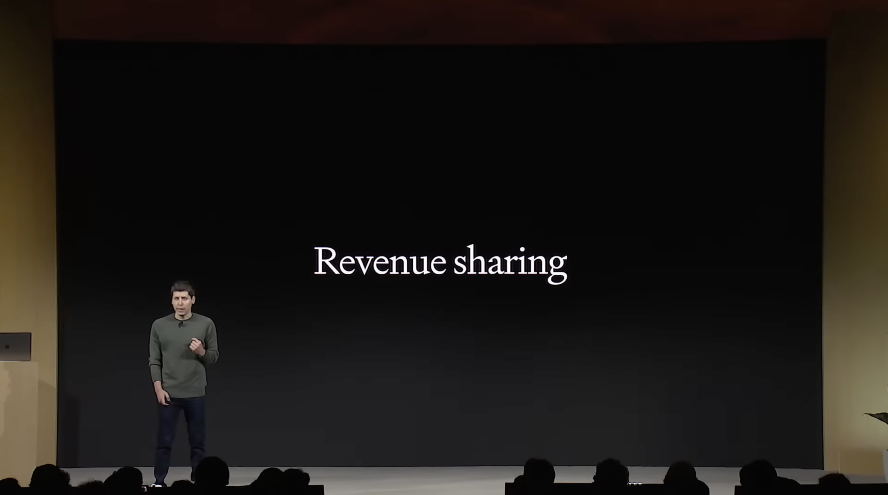

layout: title
id: title
title: Three DevDays Later
source: the owner's talk title, 2026-09-30

---

layout: image
id: revenue-sharing
source: a DevDay stage photo; decks/assets/revenuesharing.png

---

layout: image
id: ethan-mollick
source: x.com/emollick, 2026-09-29; screenshot in decks/assets/ethan1.png

