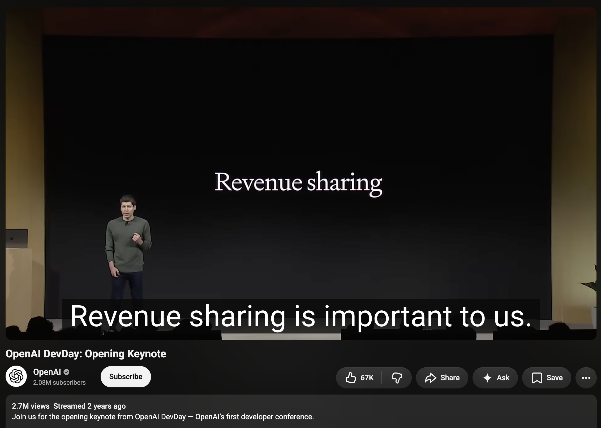
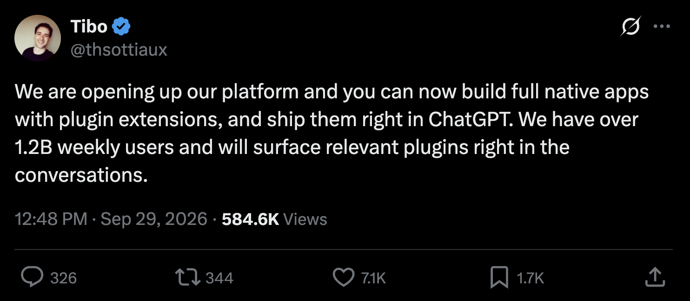
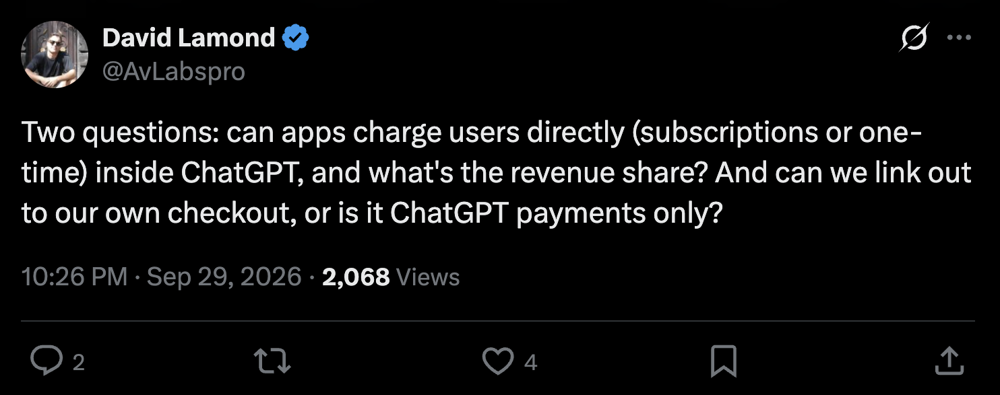
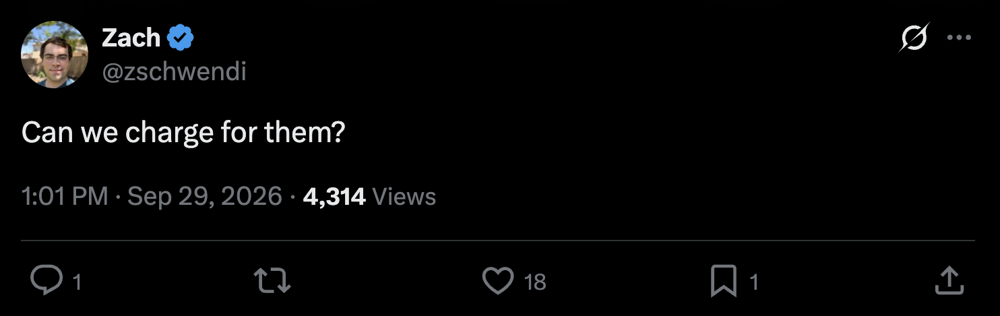
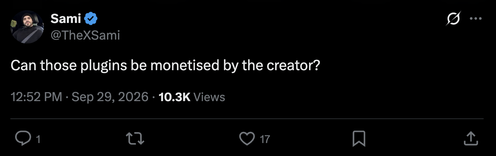
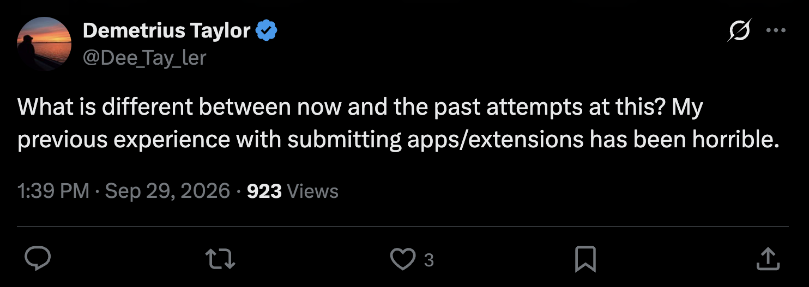
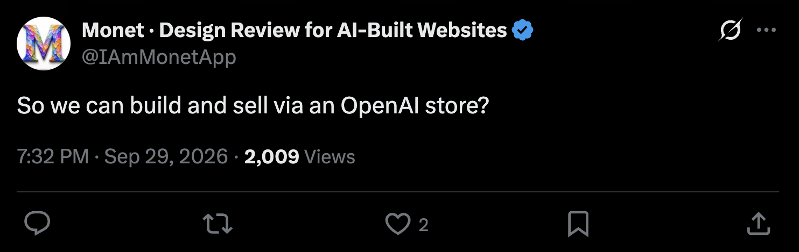
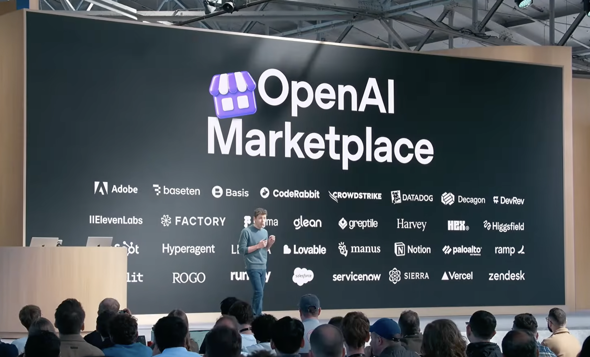

layout: title
id: title
title: Three DevDays Later
source: the owner's talk title, 2026-09-30

---

layout: image
id: revenue-sharing-important
source: OpenAI DevDay opening keynote on YouTube; screenshot in decks/assets/important.png

---

layout: image
id: ethan-mollick
scale: 2
source: x.com/emollick, 2026-09-29; screenshot in decks/assets/ethan1.png

---

layout: image
id: tibo-opening-the-platform
scale: 2
source: x.com/thsottiaux, 2026-09-29; screenshot in decks/assets/tweet-tibo-open.png

---

layout: gallery
id: can-we-charge
source: replies on X, 2026-09-29; screenshots in decks/assets/tweet-*.png

---

layout: image
id: marketplace
source: OpenAI DevDay keynote stage; screenshot in decks/assets/marketplace.png

