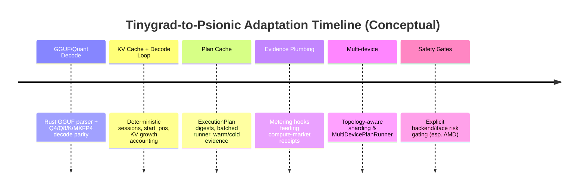

# Tinygrad Design Patterns to Adapt Into OpenAgents Psionic Runtime

## Executive summary

Tinygrad is an end-to-end “small but complete” ML stack: an eager tensor API backed by an IR, compiler/scheduler, and multiple device runtimes (CUDA/NV, AMD, Metal, CPU, etc.). It explicitly emphasizes JIT + graph execution, kernel fusion, and hackability. citeturn32search5turn29view2

For Psionic (your Rust in-repo local runtime intended to replace the desktop’s Ollama dependency and eventually serve as compute-market execution substrate), the most valuable Tinygrad “ports” are not UI/server pieces but *engine primitives and invariants*: GGUF/GGML parsing + quantized tensor decoding, a deterministic token-by-token decode loop with a first-class KV-cache lifecycle, and a JIT/graph capture layer that produces stable “execution plans” with measurable evidence (kernel counts, memory traffic, compile-cache hits, etc.). Tinygrad’s `TinyJit` graph batching pattern and `GraphRunner`/`MultiGraphRunner` are particularly relevant to the compute-market requirement that “what happened” be machine-checkable and receiptable rather than heuristic. citeturn43view1turn43view3

The highest-leverage Tinygrad code to study and adapt first is concentrated in a few places:

- `tinygrad/nn/state.py`: `gguf_load` + `ggml_data_to_tensor` (quantized GGUF/GGML decode). citeturn35view0turn35view2turn24view0  
- `extra/models/llama.py`: KV-cache creation/update, token-by-token execution path, optional `TinyJit` for the `(1,1)` decode step, and hooks suggesting where custom attention kernels can be spliced in. citeturn36view2turn36view0turn36view4turn36view2  
- `examples/llama3.py`: end-to-end “served-ish” inference loop: disk-mapped GGUF ingest, sharding, quantization options, per-token counters/throughput reporting, and a minimal `/v1/*` OpenAI-ish streaming server for parity experiments. citeturn38view2turn38view0turn39view0  
- `tinygrad/engine/jit.py`: `apply_graph_to_jit` (batched graph capture), `GraphRunner`/`MultiGraphRunner` (multi-device and plan execution), plus explicit estimates and plan-variable substitution logic. citeturn43view1turn43view3turn43view5  
- Runtime/backends: `runtime/ops_cuda.py` and the large `runtime/ops_amd.py` show the “direct device runtime” posture; Tinygrad documentation also makes the AMD interface split (KFD vs PCI/AM driver vs USB) explicit, including the fact that the PCI/AM path may unbind a GPU from the kernel’s `amdgpu` driver. citeturn26view1turn28view0turn30view0turn27view3

Key caution: Tinygrad intentionally contains sharp edges that are unacceptable in a production-by-default provider connector. Example: the AMD “AM driver” flow is explicitly described as requiring the `amdgpu` kernel module be unloaded. That has major security and operational implications for Psionic running on end-user/provider machines. citeturn30view0

## Tinygrad components most relevant to Psionic inference and embeddings

### Loader and quantization substrate

Tinygrad includes a first-class GGUF loader (`gguf_load`) and a GGML-type decoder (`ggml_data_to_tensor`) in `tinygrad/nn/state.py`. The `ggml_data_to_tensor` docstring and implementation enumerate multiple quantized schemes (not just int8): Q4_0, Q4_1, Q8_0, several “K” formats (Q4_K/Q5_K/Q6_K), and MXFP4. citeturn35view2turn35view0

This is directly aligned with your Psionic requirement to migrate away from Ollama while still being able to consume the GGUF ecosystem (Ollama’s installed store and the broader ggml/gguf quantized model availability). The *code location* for Tinygrad’s GGUF ingest and quantized tensor decoding is therefore a high-priority “pattern source” for Psionic’s `psionic-models` / `psionic-catalog` roadmap epics.

Tinygrad’s own commit history shows active changes in this area recently, including “Add Q4_K gguf quantization support” (PR #14750) and “new Q4_K quantization for gguf loader” (PR #14706), which is a signal that the loader is evolving and that Psionic should treat “GGUF feature parity” as a moving target rather than a one-and-done parser. citeturn24view0

### LLM execution, KV cache, and token-by-token decode loop

The core LLM execution patterns live in `extra/models/llama.py` and are used by `examples/llama3.py`. Tinygrad implements a KV cache by allocating a tensor buffer, updating it via slicing/assign, and then selecting keys/values from the cache for attention. This is explicitly in the attention path and is gated by `max_context`. citeturn36view2

Two “Psionic-relevant” aspects stand out:

- **Deterministic and explicit cache lifecycle**: cache allocation occurs on first use (via `hasattr(self, "cache_kv")`), and updates are explicit slice assigns. This maps cleanly to Psionic’s need for a machine-checkable “what did we store and when” story (a prerequisite for delivery proofs). citeturn36view2  
- **A distinct token-by-token fast path**: `Transformer.__call__` routes the `(batch, seqlen) == (1,1)` case to a JIT’d forward call when `start_pos != 0`, implying that the “decode step” is optimized as a stable repeated kernel graph. citeturn36view0turn36view4

Tinygrad also leaves a deliberate “escape hatch” for custom attention kernels (`STUB_ATTENTION`), which suggests a pattern for Psionic: keep attention as an interface boundary where you can swap in FlashAttention-like kernels per backend while preserving the model-level semantics. citeturn36view2

### Multi-device sharding and topology awareness

Tinygrad’s `examples/llama3.py` includes explicit model weight sharding rules when the `device` is a tuple (multi-device). It shards different tensors across different axes depending on whether a weight belongs to attention, feed-forward, token embeddings, output head, or quantization scales. citeturn38view0turn38view4

In the attention KV cache path, Tinygrad also supports sharding the KV cache across devices (conditional on an environment variable), reflecting that KV usually becomes the dominant memory consumer as sequence length grows. citeturn36view2turn36view3

For Psionic, this strongly supports making *topology* and *sharding strategy* first-class capability-envelope qualifiers. Without that, a provider might “truthfully” advertise a GPU but still be unable to serve a given context length or concurrency class without OOM.

### JIT capture, graph execution, batching, and execution plans

Tinygrad’s JIT subsystem is unusually relevant to your compute-market “evidence” goals:

- `apply_graph_to_jit` explicitly **splits the captured JIT cache into batches** “for faster graph execution” and to allow overlapped execution while graphs update. citeturn43view1  
- `GraphRunner` packages a list of `ExecItem`s and sets up buffer replacement maps and variable substitution so the same captured plan can be replayed. citeturn43view3  
- `MultiGraphRunner` is explicitly described as a marker for graphs supporting multiple devices “of the same type,” and it gates which `ExecItem`s are eligible. citeturn43view3  
- Graph execution accumulates `Estimates` across the plan, and tracks symbolic dimension substitutions. citeturn43view5

This set of patterns maps very cleanly to Psionic’s need to produce stable “execution-plan digests,” warm/cold compile evidence, and metering hooks. Tinygrad’s JIT/graph design is therefore a strong reference implementation for “plan identity” as a compute-market primitive (even if Psionic’s internal IR differs).

### Runtime/backends and the “truthful device interface” posture

Tinygrad’s public runtime docs list multiple runtimes and also explain you can force a default runtime via environment variables (e.g., `CPU=1`). Critically for AMD, the docs make the interface split explicit: `AMD_IFACE=(KFD|PCI|USB)`, where `KFD` uses the kernel `amdgpu` driver, `PCI` uses Tinygrad’s AM driver, and `USB` is for some USB3 bridge chips; it also warns that `AMD_IFACE=PCI` “may unbind your GPU from the amdgpu driver.” citeturn28view0

The AM driver docs are unusually blunt: it is a userspace driver targeting RDNA3/RDNA4, and the “how to run” section says to ensure `amdgpu` is unloaded and run Tinygrad with `AMD=1`. citeturn30view0

The implementation side (`runtime/ops_amd.py`) includes direct use of KFD ioctls, VM acquisition, GPU memory allocation, mmapping, and explicit error paths for memory allocation/refusal (including a specific hint about “resizable BAR” when allocating host-visible VRAM). citeturn27view3turn27view4

For Psionic, the *design pattern to adapt* is not “be a userspace GPU driver,” but rather:

- treat the backend selection + device interface as *explicit capability truth* (not silent fallback),
- surface health, topology, and risk posture as part of the capability envelope,
- and build metering/evidence around the runtime substrate.

## What to port, reimplement, or adapt in Rust

The table below is framed as “Tinygrad pattern source → Rust Psionic module recommendation,” focusing on what pays down the Ollama replacement and compute-market substrate gaps.

### Component adaptation matrix

| Tinygrad component (primary source) | What it does in Tinygrad | Why it matters to Psionic | Recommendation | Suggested Psionic crate/module shape |
|---|---|---|---|---|
| `tinygrad/nn/state.py::gguf_load` citeturn35view0turn24view0 | Parses `.gguf`, returns key/value metadata + `state_dict` tensors; requires tensor on an “execution-capable” device. citeturn35view0 | Your roadmap requires GGUF ingestion + tokenizer/prompt behaviors to cut over from Ollama while reusing installed models. Only a robust parser unlocks that. | **Reimplement in Rust**, closely following Tinygrad’s parsing rules; treat Tinygrad as a behavioral oracle. | `crates/psionic-models/src/gguf/*` plus a thin `psionic-models::WeightFormat::Gguf` facade |
| `tinygrad/nn/state.py::ggml_data_to_tensor` quant decode citeturn35view2turn24view0 | Decodes GGML quantized blocks into float tensors; explicitly supports Q4_0/Q4_1/Q8_0/Q4_K/Q5_K/Q6_K/MXFP4. citeturn35view2 | GGUF models often arrive quantized; if Psionic can’t decode these formats efficiently, you cannot replace Ollama’s “it just runs locally” behavior. | **Reimplement** with Rust SIMD + optional backend kernels; mirror Tinygrad’s block math first, optimize second. | `crates/psionic-quant/*` (or `psionic-models::quant`) implementing block decode and “dequantize view” semantics |
| `extra/models/llama.py` KV cache allocate/update + attention path citeturn36view2turn36view3 | Creates `cache_kv` lazily; updates via slice assign; optionally shards cache across devices. citeturn36view2turn36view3 | KV cache dominates memory and determines max context + concurrency truth. Must be explicit and measurable for compute-market receipts. | **Adapt the lifecycle pattern**, but redesign storage: typed `KvCache` object with explicit ownership, size accounting, and backends-of-record. | `crates/psionic-serve/src/kv_cache/*` + `psionic-runtime` allocators; later `psionic-cache-disk` for spill |
| `extra/models/llama.py` token-by-token `TinyJit` path citeturn36view0turn36view4turn43view1 | Uses JIT’d forward only for `(1,1)` decode step and nonzero `start_pos`; graph capture accelerates repeated decode. citeturn36view4turn43view1 | Low-latency text generation typically runs BS=1 decode. JIT/plan caching is how you turn that into a stable “product” instead of per-token recompilation variance. | **Adapt the concept** (plan caching) not the Python code. In Rust, represent a “DecodePlan” keyed by model/backend/shape/dtype/quant mode. | `crates/psionic-compiler` “plan cache” + `psionic-runtime` “compiled plan runner” |
| `tinygrad/engine/jit.py::apply_graph_to_jit` batching citeturn43view1 | Splits captured exec list into batches to improve graph execution and overlap. citeturn43view1 | This is directly usable to define “warm/cold compile posture” and “execution plan digest,” and to expose evidence in receipts. | **Port the design pattern**: a stable plan graph, batch segmentation, and variable/shape substitution. | `crates/psionic-runtime/src/plan/*` + `crates/psionic-provider/src/evidence/*` |
| `GraphRunner` + `MultiGraphRunner` citeturn43view3turn43view5 | A Runner that replays a captured plan, supports multi-device (same type) and carries estimates. citeturn43view3turn43view5 | Strong template for Psionic’s future multi-device inference, and for exposing topology-aware execution evidence. | **Adapt**: define `PlanRunner` + `MultiDevicePlanRunner` in Rust with explicit device constraints and topology claims. | `psionic-runtime` runner traits; `psionic-provider` capability + topology models |
| `examples/llama3.py` disk GGUF ingest (`disk:` device) citeturn38view2turn44view0 | Creates disk-backed tensors and then moves to execution device; supports `.gguf` loading via disk mapping. citeturn38view2turn44view0 | Psionic needs a *catalog + loader* that can read large local models without copying everything eagerly. | **Reimplement** as a Rust “paged tensor storage” + mmap; match behavior before optimizing. | `psionic-catalog` + `psionic-models` with memory-mapped blob store readers |
| `examples/llama3.py` explicit sharding rules citeturn38view0turn38view4 | Hard-coded sharding axes per parameter family; includes quant scale sharding. citeturn38view0turn38view4 | Psionic must avoid “GPU present” claims without stating sharding constraints and supported topologies. | **Adapt** into a declarative sharding spec per model family; avoid hard-coding by key string matching in final design. | `psionic-models` sharding metadata + `psionic-runtime` placement planner |
| `runtime/ops_cuda.py` + runtime docs citeturn26view1turn28view0 | Concrete CUDA/NVRTCs and runtime selection model via env vars. citeturn26view1turn28view0 | Helps define “backend truth surfaces” and which toolchains are required. | **Use as a reference** for capability + health reporting. Don’t port raw. | `psionic-backend-cuda` capability probes; `psionic-provider` backend truth |

## Gaps in Tinygrad that matter for a production-grade Psionic compute substrate

This section distinguishes “Tinygrad has it” from “Psionic needs it,” especially where Tinygrad intentionally tolerates research-grade ergonomics.

### Disk-backed KV cache and spill-to-disk

Tinygrad’s Llama cache (`cache_kv`) is an in-memory tensor allocated on first use and then updated with slice assigns. citeturn36view2 It can be sharded across devices, but there is no indication in the core Llama code of a disk-backed KV path. citeturn36view2turn36view3

However, Tinygrad has an explicit disk runtime concept (`DiskDevice`) that mmaps files or shared memory segments and can use `O_DIRECT` (when available) and `mmap` paths. citeturn44view0 Tinygrad’s Llama3 example also uses a disk device to create a `uint8` tensor for a `.gguf` file and then moves it to the default device. citeturn38view2

Implication for Psionic: disk-backed KV cache is not “present,” but Tinygrad provides a *pattern hook* (disk-backed tensors as first-class devices). Translating that to Rust is feasible.

Engineering effort estimate for Psionic: **High** (because spill-to-disk KV is a correctness + latency + IO-scheduling problem, not just storage). Engineering effort in Tinygrad itself (if you were to add it there): **Medium–High**, likely by introducing an alternate KV storage backend (RAM vs disk) in `extra/models/llama.py` and implementing a “paged KV” tensor device.

Concrete code anchors:
- Tinygrad KV cache allocate/update: `extra/models/llama.py` attention path where `cache_kv` is created and updated. citeturn36view2  
- Tinygrad disk tensor runtime: `tinygrad/runtime/ops_disk.py::DiskDevice` memory-mapping and open semantics. citeturn44view0  
- Disk tensor used for GGUF in Llama3: `examples/llama3.py` `.gguf` branch creating `device=f"disk:{fn}"`. citeturn38view2  

### Durable model catalog and lifecycle controls

Tinygrad’s `examples/llama3.py` “server” is an example-level web app that exposes `/v1/models`, tokenization helpers, and streaming-only completions endpoints. citeturn39view0 It is not a durable catalog: it loads a single model from a provided path, and model lifecycle/persistence are outside its scope. citeturn39view0

Psionic needs a catalog and lifecycle contract because the desktop currently gets those behaviors “for free” from Ollama (“tags”/“ps”/“show,” warm/unload/keepalive semantics, and stable streaming contract). Your own roadmap already calls this out; Tinygrad is best used here as a “known-minimal server shape,” not as reusable infrastructure.

Engineering effort estimate for Psionic: **High** (catalog + lifecycle + integrity checks + concurrent load admission are a full subsystem).

### Robust, production-ready driver integration posture

Tinygrad supports AMD with multiple interfaces, including a path that uses Tinygrad’s own AM userspace driver. The docs explicitly warn that the PCI/AM interface may unbind the GPU from the system driver (`amdgpu`), and the AM driver docs explicitly say to unload `amdgpu`. citeturn28view0turn30view0

For provider machines (especially a consumer device running Autopilot/Pylon-like tools), this is operationally and security sensitive. Tinygrad is demonstrating feasibility; Psionic needs a “safe-by-default” posture, likely preferring standard OS driver stacks (Metal on macOS; AMD via ROCm/HIP or Vulkan compute; NVIDIA via CUDA) while keeping “experimental sovereign driver” paths gated.

The existence of open issues like `AMD_IFACE=USB: copy from CPU to AMD in jit segfaults` underscores that some interface paths are still fragile. citeturn31search4

Engineering effort estimate for Psionic: **Medium–High** depending on how broadly you want to support “nonstandard” device paths.

### Secure sandboxing and provider-side operational policy

Tinygrad itself is not a sandboxing framework; it is a compute framework. The strongest security signal in the sources is actually a *warning* about runtime behavior (unbinding GPU driver, requiring module unload, etc.). citeturn28view0turn30view0

So: Tinygrad offers very little to “port” directly for sandboxing. The best you can adopt is the principle of **explicit runtime policy** (don’t hide dangerous default behaviors), which aligns with your compute-market truth goals.

Engineering effort estimate for Psionic: **High** if you want “sandbox_execution” to be a product family with strong constraints; Tinygrad doesn’t solve that for you.

## Mapping Tinygrad patterns onto Psionic provider substrate and compute-market truth

### Backend detection and capability-envelope mapping

Tinygrad’s runtimes are selected either automatically or via environment variables, with explicit per-backend interfaces (e.g., AMD `KFD|PCI|USB`). citeturn28view0 The simplest “pattern port” for Psionic is:

- treat backend detection as a *probe + health report* step,
- ensure the provider can only advertise a backend/product if the probe is healthy,
- and encode the interface mode in capability truth (e.g., `amd_iface=kfd` vs `amd_iface=pci_am_driver`).

For AMD specifically, Psionic should reflect the same “risk split” Tinygrad documents: `KFD` (uses kernel driver) vs PCI/AM (userspace driver, may require unbinding). citeturn28view0turn30view0

### Product IDs and “tinygrad → psionic” namespace mapping

Tinygrad’s model examples effectively implement “served products” (text generation) and expose minimal OpenAI-ish endpoints. citeturn39view0turn36view0 Psionic should translate this into backend-neutral, compute-family-first product IDs, with backend family and interface reflected as qualifiers rather than embedded in the product identity.

A concrete, taxonomy-aligned mapping:

- Tinygrad “text generation” example behavior → `psionic.text_generation`
- Tinygrad “embeddings” (not shown in llama3) patterns + BERT-family inference patterns (Tinygrad has dedicated model files) → `psionic.embeddings`
- “Disk-backed tensors + plan caching” evidence surfaces → `psionic.*` delivery-proof evidence fields

If you still want explicit linkage in docs (“Tinygrad-derived runtime patterns”), keep it as provenance metadata, not product IDs.

### Metering hooks and delivery-proof inputs

Tinygrad’s Llama3 example uses `GlobalCounters.reset()` per token and prints token/s and memory bandwidth estimates using `GlobalCounters.global_mem` and time deltas. citeturn38view2turn38view4 This is a very direct template for Psionic’s delivery-proof hooks:

- record per-step kernel count (or “exec items”),
- record bytes moved (H2D/D2H/device-device),
- record time in compile vs run vs sync,
- record plan cache hit/miss,
- record KV cache size and growth.

The Tinygrad JIT layer also accumulates `Estimates` and tracks symbolic dims and variable substitutions for plan replay. citeturn43view5turn43view3 That suggests that Psionic should compute an “ExecutionPlanDigest” based on:
- backend family + compiler configuration,
- IR hash + lowering hash + kernel sources hash,
- sharding/topology plan,
- memory planner decisions.

### Integration flow diagram

```mermaid
flowchart TD
  A[Psionic provider probe] --> B{Backend healthy?}
  B -- no --> B1[Report degraded/refused capability]
  B -- yes --> C[Derive capability envelope<br/>backend_family, iface, mem, topology]
  C --> D[Select product family<br/>text_generation / embeddings]
  D --> E[Load model<br/>GGUF + tokenizer + prompt rules]
  E --> F[Build/lookup ExecutionPlan<br/>plan cache key]
  F --> G[Run inference step(s)]
  G --> H[Collect runtime evidence<br/>timing, mem bytes, plan hit/miss, kv size]
  H --> I[Emit compute-market delivery proof inputs]
  I --> J[Publish receipts / update earnings]
```

## Security, sandbox, and attestation implications of Tinygrad-style backends

### AMD driver modes are a front-and-center risk boundary

Tinygrad’s docs describe an AMD interface split and explicitly acknowledge that one path may unbind the GPU from the OS driver (`AMD_IFACE=PCI` uses the AM driver). citeturn28view0turn30view0 The AM driver docs also explicitly instruct “make sure that amdgpu module is unloaded.” citeturn30view0

For Psionic, that means:

- **Do not ship** an AM-driver-like mode as default provider behavior.
- If you support an “experimental sovereign driver mode,” it should be:
  - explicit opt-in,
  - strongly gated by warnings,
  - and ideally run only on dedicated/provider machines.

On the implementation side, `runtime/ops_amd.py` demonstrates what “direct driver” entails: KFD ioctls, GPU VM acquisition/enabling, allocation of VRAM/host memory, mmapping and fixed mappings, and complex error surfaces. citeturn27view3turn27view4 This is not just “a backend,” it is an attack surface.

### Disk-mapped model inputs are useful but need integrity guarantees

Tinygrad’s Llama3 example uses disk-backed tensors for GGUF loading. citeturn38view2turn44view0 For a provider network, that is attractive (can avoid copying giant files), but it raises:
- integrity: what digest was served?
- consistency: did the file change while memory-mapped?
- provenance: which tokenizer/template metadata was used?

Tinygrad’s code here is a pattern source for mechanics, not a full policy.

### Sandbox execution is orthogonal

Tinygrad provides almost no “sandboxing” primitives; it is an execution engine. So Psionic’s future `sandbox_execution` family should not be designed as “run Tinygrad in a container.” Instead, it should be designed as a separate execution profile system where the ML runtime might be *one tool inside the sandbox*, and the sandbox provides the boundaries (filesystem/network/CPU/memory/time/cgroups/VM isolation).

## Prioritized adaptation roadmap for Psionic

The roadmap below assumes your current state: Psionic already exists with CPU text generation & embeddings tests, Metal embeddings, and AMD discovery/readiness surfaces (per your provided roadmap). The objective is “Tinygrad-derived patterns” that enable:

- Ollama replacement behaviors (model ingest, tokenization & prompt contracts, lifecycle)
- Compute-market substrate evidence (plan digests, metering hooks, capability truth)

### Milestones and acceptance criteria

| Milestone | What you adapt from Tinygrad | Acceptance criteria | Effort |
|---|---|---|---|
| GGUF loader + quant decode parity | Implement Rust equivalents of `gguf_load` and the `ggml_data_to_tensor` quant block decoders (Q4_0/Q4_1/Q8_0/Q4_K/Q5_K/Q6_K/MXFP4). citeturn35view0turn35view2turn24view0 | Psionic can load a representative set of GGUF models; quant decode produces correct tensors vs reference; loader resilience against alignment and metadata variation. citeturn35view0turn35view2 | High |
| Deterministic decode loop + KV cache object | Mirror Tinygrad’s explicit KV cache allocate/update semantics and `start_pos` model contract; implement stable session lifecycle and KV growth accounting. citeturn36view2turn36view0 | Token-by-token decode (BS=1) matches reference logits/sampling across seeds; KV cache size and context refusal/truncation rules are explicit; session can be resumed/cleared deterministically. citeturn36view2turn36view0 | High |
| Plan cache + “GraphRunner-like” replays | Adapt `apply_graph_to_jit` batching and `GraphRunner`/`MultiGraphRunner` concepts into Rust “ExecutionPlan” caching and replay with variable substitution + estimates. citeturn43view1turn43view3turn43view5 | “Warm decode” hit rate tracked; plan digest stable for same model/backend; evidence includes kernel count + estimates; multi-device plan has explicit constraints. citeturn43view3turn43view5 | Medium–High |
| Evidence and delivery-proof plumbing | Adapt Tinygrad’s per-token `GlobalCounters` pattern conceptually into Psionic metering (timing, bytes, plan hits, KV growth). citeturn38view2turn38view4 | For each request, Psionic emits structured evidence suitable for compute-market receipts (plan digest, timings, bytes, cache state, refusal reason codes). | Medium |
| Multi-device sharding v1 | Convert Tinygrad’s hard-coded sharding rules into a declarative sharding plan per model family; support at least “same-type multi-device” like `MultiGraphRunner` expects. citeturn38view0turn43view3 | Provider can advertise topology; model can load across N devices; refusal path is explicit when topology mismatches. citeturn43view3turn38view0 | Medium–High |
| Safety gates for AMD interface modes | Use Tinygrad’s explicit AMD interface split as documentation/behavioral inspiration; gate dangerous modes. citeturn28view0turn30view0 | Psionic never silently switches to risky driver modes; “experimental” modes require explicit opt-in and emit capability truth that reflects that mode. citeturn28view0turn30view0 | Medium |

### Timeline sketch



## Suggested wording for Psionic docs and compute-market taxonomy

Below is wording that truthfully captures “Tinygrad-derived patterns” without claiming you ship Tinygrad or its drivers.

### Psionic docs wording

> **Tinygrad-derived design patterns (not a port).**  
> Psionic’s execution substrate borrows proven design patterns from Tinygrad—especially GGUF/GGML ingestion, quantized weight decoding, explicit KV-cache lifecycle, and plan-cached decode execution—while re-implementing these systems in Rust with Psionic-native IR, runtime traits, and provider-evidence surfaces. citeturn35view0turn35view2turn36view2turn43view1

> **Execution plans and evidence.**  
> Psionic produces stable execution plans (with cacheable plan digests) and emits structured runtime evidence (timing, memory traffic, cache posture, and KV growth) so compute-market receipts can reflect what happened without relying on app-local heuristics. citeturn43view1turn43view5turn38view2

> **Backend truth and risk posture.**  
> Psionic uses explicit backend detection and health reporting. It does not silently fall back to CPU when an accelerated backend is unhealthy. Experimental interface modes (e.g., AMD paths that may require driver unbind/unload) are gated and must be explicitly opted into. citeturn28view0turn30view0

### Compute-market taxonomy wording snippets

> **Compute Market → inference / embeddings**  
> Psionic is a backend family that can serve `inference` (text generation) and `embeddings` products. The product identity remains backend-neutral (`psionic.text_generation`, `psionic.embeddings`), while the capability envelope conveys backend family, interface mode, topology, and memory posture. citeturn28view0turn38view0turn36view2

Capability-envelope example (illustrative):

```json
{
  "backend_family": "psionic",
  "execution_kind": "local_inference",
  "product_family": "inference",
  "model_family": "llama",
  "quantization": "gguf:q4_k",
  "topology": { "devices": 2, "homogeneous": true, "sharding": "tensor_parallel_axis_rules_v1" },
  "kv_cache": { "max_context_tokens": 8192, "storage": "vram", "shardable": true },
  "backend_iface": { "amd_iface": "kfd", "metal": false, "cuda": true },
  "evidence": { "plan_cache": "enabled", "plan_digest": "sha256:..." }
}
```

(Quantization formats and KV-cache sharding are explicitly present in Tinygrad’s reference implementation patterns. citeturn35view2turn36view3turn38view0)

## Prioritized primary sources worth bookmarking and re-reading

Tinygrad code and docs are the best “ground truth” for the patterns above:

- `tinygrad/nn/state.py` (`gguf_load`, `ggml_data_to_tensor`, quant types supported) citeturn35view0turn35view2  
- Recent commit history for GGUF/quant changes (e.g., Q4_K support PRs) citeturn24view0  
- `extra/models/llama.py` (KV cache update, `TinyJit` decode path, sharded KV) citeturn36view2turn36view4turn36view3  
- `examples/llama3.py` (disk GGUF mapping, multi-device sharding rules, per-token counters, minimal `/v1/*` server shape) citeturn38view2turn38view0turn39view0  
- `engine/jit.py` (`apply_graph_to_jit` batching, `GraphRunner`/`MultiGraphRunner`, plan estimates) citeturn43view1turn43view3turn43view5  
- Runtime docs for explicit backend selection and AMD interface risk split citeturn28view0turn30view0  
- ops-level implementations for CUDA and AMD (useful primarily as “what a mature backend ends up needing” reference) citeturn26view1turn27view3turn27view4  
- George Hotz blog posts that contextualize AMD driver work and the “sovereign stack” motivation: “A dive into the AMD driver workflow” and “AMD YOLO.” citeturn32search0turn31search7