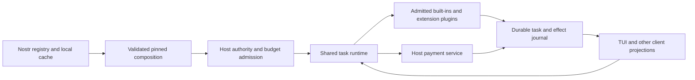

# What to carry forward: typed plugins, Nostr, and payments

Research snapshot: October 6, 2026, at OpenAgents
`f94d63c544a914b60453b4015108f593272a9376`. This is a recommendation for
the new agent and TUI specification, not a change to the normative protocols
or a claim that the proposed architecture already runs. Read it with the
[history and current terminal survey](claude-code-replacement-history.md)
and [DeepSeek Harness lessons](deepseek-harness-lessons.md).

## Recommended direction

Use **everything is a plugin** as the composition model: the agent loop,
model adapters, typed decisions, context builders, workflows, operations,
inspectors, and TUI features should have explicit interfaces and replaceable
providers. Reuse the Nostr registry for distribution and identity, and make
payments a shared host service available to admitted operations.

Keep a small host boundary responsible for authority, effect admission,
durable ownership, resource accounting, and wallet access. A plugin can
propose work or implement a service within its admitted scope. It cannot
authorize itself, replace the active task's policy, or acquire wallet keys.
This combines DeepSeek's composition idea with OpenAgents' existing
[authority contracts][pol] and [package boundary][ext].

### Broaden composition without erasing the current plugin contract

The [glossary][glossary] defines a plugin as an addition containing skills,
workflows, Wasm, and tests; knowledge publishes beside the package. It
explicitly says Coder and its engines are not plugins. The proposed uniform
composition model goes beyond that current product definition.

Use two implementation classes behind the shared interfaces:

| Class | What it may contain | Who admits it |
| --- | --- | --- |
| Host-owned built-in provider | Rust implementations of an engine adapter, loop, storage, shell, policy, wallet, or renderer. | The operator's trusted host composition. |
| Installed extension plugin | Existing NIP-EXT skills, workflows, bounded Wasm, tests, and references to supported host bindings. | Package validation plus separate activation and execution admission. |

This is a proposed internal organization. It does not add a new wire
component kind or permit extensions to ship native executables. NIP-EXT's
[compatible host component sets][host-components] can describe exact client,
engine, helper, and adapter artifacts without letting a package install
privileged code. Keep those distinctions visible in inspection views even
if the TUI gives them one **Plugins** entry point.

## What the TypeSafe research contributes

All five files under `docs/research/typesafe/` were read. They contribute
three complementary arguments and two local measurement records:

| Source | Carry forward | Limit on the claim |
| --- | --- | --- |
| [AI Council talk][council] | Software should consume focused judgments and explicit uncertainty, rather than rely on agreeable prose as a decision interface. | The training argument is the speaker's explanation; it does not establish every model's behavior. |
| [AI Engineer talk][engineer] | Put small typed decisions inside code-owned workflows. Keep generation for tasks that require new content. | Jev's stated target is calibrated decision-making, not simply RLVR. |
| [a16z discussion][a16z] | Distinguish availability/SLAs from determinism, robustness, and useful judgment. Design and measure each. | Broad readiness and programming without examples remain aspirations. |
| [Calibration report][calibration] | Join decisions to outcomes; pin question/model/map identities; choose thresholds from written costs and held-out data. | Its appended result supersedes the opening implementation snapshot. |
| [Projected gains][projections] | State proposed gains and the observations that would confirm or reject them. | Its worked trace is authored; projected cost, speed, and hard-task gains are not measured results. |

The live TypeSafe documentation could not be refreshed from this environment
(HTTP 403). These recommendations use the retained research and local
contracts, without asserting current vendor API limits.

### Code owns the workflow; judgments supply semantic understanding

Use deterministic code for identity, arithmetic, eligibility, schema checks,
budgets, permissions, deadlines, state transitions, and execution. Use a
typed judgment where the software must interpret meaning: relevance,
intent, task class, ambiguity, or a claim's relationship to evidence.
Use generation to produce a patch, explanation, or new artifact.

A reusable semantic component should specify its purpose, input/output
meaning, evidence requirements, abstention, and protected constraints.
Its implementation may be deterministic code, a decision model, generation,
or a bounded workflow. Pin the implementation separately from the semantic
contract. This carries forward [the TypeSafe agent analysis][analysis] and
[NIP-OPT][opt] without making every component a handwritten Jev call.
NIP-OPT supplies the general design; a complete portable optimization and
promotion runtime is not implemented at this snapshot.

Prefer this path for known operations:

1. Filter eligibility mechanically and retrieve a bounded candidate set.
2. Use a typed selector when interpretation is needed, including `none`.
3. Validate the selection and arguments against the exact binding.
4. Execute the bounded workflow under the host's existing authority.
5. Check its result and separately admit integration where necessary.

Retrieval recall and judgment accuracy need separate measurement: a model
cannot select an omitted candidate. An explicit structured operation request
can skip semantic selection, while still passing admission. See the
[progressive discovery contract][discovery] and [Jev programming guidance][jev].

Batch independent questions over the same state. They cannot consume each
other's answers. Fetching new evidence or constructing dependent state
requires a later step. Do not add a judgment to a known mechanical rule
merely because a model is available.

### Preserve state and decision provenance outside the conversation

The host owns objectives, user corrections, obligations, pending effects,
budgets, and task status. A model's current context is one projection of
that state. Evidence retains its source version, completeness, recipient,
and expansion path; a summary does not become a replacement source.
The [product-suite plan][suite] supplies this ownership model.

For a judgment that affects action, retain:

- task/request and source-state identities;
- semantic contract, question-set, model, and implementation identities;
- original answer/distribution and any calibration-map identity;
- the consuming policy, costs, thresholds, shortlist, and abstention;
- the chosen action and admitted effects;
- the eventual outcome, check scope, and label provenance.

Join outcomes by identity. Distinguish missing evidence, model errors, policy
errors, runtime errors, provider failures, and unresolved effects. Put this
detail in inspection views; ordinary users should see the selected action,
reason, cost, and pending decision without tuning raw probabilities.

### Carry the calibration result accurately

The calibration report's opening says serving is off. Its
[later result][calibration-result] says the admitted `answer` map serves
by default at 0.90; `route` remains raw because its map failed the gate.
In the held-out `answer` rows, wrong served answers fall from 5 to 3 while
fall-throughs rise from 104 to 123. Precision intervals overlap and expected
cost changes from 0.815 to 0.810 per row. That is a conservative tradeoff,
not proof of a general cost or quality win.

When `p` is probability of correctness, wrong action costs 10, and fallback
costs 1, the worked rule is `(1 − p) × 10 < 1`, or `p > 0.90`. Those written
costs explain that policy; they are not universal product defaults.

Require representative labels, positive and negative cases, held-out checks,
sample counts, confident errors, reliability, and drift checks before making
a learned policy the default. Freeze task meaning and acceptance before
optimization. A confidence score, optimization result, or signed evaluation
cannot create an execution or spending grant.

## What to keep from the existing plugin system

| Existing foundation | Keep it | Remaining boundary |
| --- | --- | --- |
| [Wasm host][wasm] | Pure/snapshot-read profiles, no ambient network/model/WASI access, bounded fuel/memory, invocation receipts. | Repeatable output and a receipt do not establish correctness. General guest operation/result schema validation still needs wiring. |
| [Program runtime][program-runtime] | Typed named steps, pinned sources/operations, child limits, shared admission. | The parser recognizes `Invoke`, but this runtime refuses it at admission; typed capability-route dispatch is separate. |
| [Route dispatch][route-dispatch] | Exact admitted release, recipient, fee, typed arguments, and journaled result; no hidden widening on model fallback. | A registry or dispatcher alone does not make every installed component available through every agent path. |
| [Extension evaluation][eval] | With/without runs, exact baseline/component identities, protected cases, cost and outcome evidence. | A tuned fixture or author-written test set alone does not justify default adoption. |
| [Signed registry][registry] | Publisher-qualified identity, immutable release, manifest/file digests, explicit install and enable. | Dependency resolution and full revocation freshness at every use remain incomplete. |

The implementation has moved beyond some old gap lists. The current registry
publishes `3184` releases and `30184` listings, searches them, checks downloaded
files, and installs disabled. Conversely, [current downloads][registry-limits]
reject dependency-bearing packages and check matching signed revocations at
installation; that is less than the draft's full checkpoint/retained-revocation
lifecycle. Preserve these bounds instead of assuming a universal registry.
Local inspect/use also performs no relay check, so an unknown revocation state
is not a fresh proof of eligibility. See [local use][local-use].

The parser and production runtime also differ: [Coder dispatch][invoke-gap]
refuses `Invoke`, even though NIP-PRG describes it. A [general schema
evaluator][schema] exists, while the packet invocation path does not
automatically apply every operation's input/output schema closure. Those
are specific integration tasks for a shared plugin operation boundary.

## A plugin composition graph for the new system

Define each replaceable service through a definition, a provider, and its
consumers. Resolve a bounded dependency graph before activation. Each node
needs an exact identity, interface version, supported scope, dependencies,
declared effects, limits, lifecycle, and evidence references. A saved profile
selects the graph; it is not an authority document.

Pin the effective graph for a task/turn and record its identity. A plugin
update or profile edit applies at a declared boundary, after current work
has settled or been reconciled. Disposal removes registrations, hooks,
timers, and new-work eligibility; it cannot undo an already sent command,
payment, or publication. Missing required services refuse activation with a
specific cause. Revocation blocks new eligible uses according to policy
while preserving the records needed to reconcile existing work.

Compose interactive, headless, and background profiles from the same
runtime services. Their differences should be presentation and admitted
bindings. The TUI must not own another execution loop, wallet policy, or
independent mutable account of task state.

## Nostr registry with built-in payments

### Reuse the existing identities and transport

Keep NIP-EXT for package releases/listings/revocations, NIP-CAP for operation
descriptions, NIP-PRG for workflows, NIP-EVAL for attributable measurements,
and NIP-KB for knowledge. The [OpenAgents protocol map][nips] connects these
to task, context, policy, and recovery contracts. Use the existing draft
allocations; this proposal invents no event kinds.

Resolve names to publisher-qualified identities and then exact release and
artifact digests. A mutable listing advertises a candidate; it is not the
execution pin. Cache verified content locally so discovery can work offline,
and report unavailable or stale status explicitly. Signatures establish
authorship; evaluation establishes scoped evidence; the host supplies trust
and authority. Relay availability cannot be a prerequisite for ordinary
local work on already admitted components.

### Keep the commercial meanings separate

| User action | Contract and status at this snapshot |
| --- | --- |
| Discover/install a plugin | Signed NIP-EXT registry and checked installation exist. This grants no execution or spending authority. |
| Pay for one invocation | HTTP x402 paid plugin calls exist. The initial supported route is one no-capability Wasm module, pure or with an empty snapshot. |
| Pay for completed commissioned work | NIP-MKT/NIP-LAB define agreement, checks, acceptance, and later settlement. The current labor host supports free work; general paid settlement remains incomplete. |
| Buy a license or entitlement | A separate commercial contract is needed. A manifest license string or signed per-call fee does not implement paid access rights. |

The [paid plugin route][paid-plugin] prices the endpoint plus the signed
author fee and records settlement before executing the pinned guest.
Its author split and [payout worker][payout] already exist. Accruing a share
and confirming its payout are distinct states. [Native x402][native-x402]
also has [encrypted purchase/status transport][native-transport]; older
glossary/spec status text understates this implementation. None of this survey
establishes deployment or a funded real-wallet acceptance result.

### Make payment one host service

Expose quote, reserve, approve, pay, reconcile, and receipt operations to
admitted workflows through a host-owned binding. Keep wallet credentials
outside packages, model prompts, and renderer state. Request a dedicated
spending admission; [ordinary chat commands][chat-effects] do not gain spend
authority from their usual Enter confirmation.

An exact purchase record should bind publisher/plugin/release, operation and
input digest, recipient, endpoint, quote, payee/network, invoice/payment
identity, amount and fee ceilings, expiry, purchase identity, and task or
execution identity. Persist it before contacting the wallet. Reserve principal
and possible fees across concurrent tasks; retain pending/unknown liabilities.
Retry or reconcile the same attempt instead of creating another purchase.

Reuse the existing [transactional compute holds][holds], [device spending
reservations][device-spend], [payout recovery][payout], and [funded task
binding][funded-task] as patterns. These paths solve different parts of the
problem; their existence does not make the current x402 buyer policy a
transactional wallet budget.

Record payment, execution, delivery, verification, acceptance, author payout,
entitlement, and refund separately. A paid invoice does not authorize OS
effects or establish that a result is correct. Built-in payments should make
these boundaries available to every admitted operation, not merge them into
one **Success** flag.
The [funded inbox contract][funded-inbox], [MKT settlement/refund rules][market-payment],
and [LAB output-rights rules][labor-rights] preserve those distinctions.

### Close the known recovery gaps before broadening paid plugins

1. **Persist the quote and release through payment and retry.** The current
   front re-quotes each request; plugin release stability depends on a
   [five-minute in-memory cache][cache-ttl]. Bind the original exact quote
   durably before paying. See [pricing flow][front-pricing] and
   [plugin resolution][plugin-cache].
2. **Reserve before wallet dispatch.** CLI buyer checks recent payments and
   appends successful payments afterward. They do not reserve concurrent or
   unknown attempts, including this attempt's fee ceiling. See
   [buyer policy][buyer-policy] and [buyer dispatch/accounting][buyer-accounting].
3. **Make native admission recoverable across its write boundaries.** Purchase
   state, replay consumption, and execution intent currently involve separate
   writes. Implement the normative transaction or an equivalent recoverable
   admission protocol with conflict protection. See [native admission][native-admission]
   and [required recovery semantics][x402-recovery].
4. **Recover output after a lost reply.** Generic paid plugin replay prevention
   and settlement do not provide durable completed-result retrieval. Retain
   the result/receipt by purchase identity. See [front execution][front-execution].
5. **Keep paid labor and licensing separate.** Extend [free labor][free-labor]
   only after implementing its postacceptance obligations. Define licensing
   only when the product needs it. Refunds require their own obligation and
   confirmed attempt; neither lane supplies automatic refunds.

## What the new TUI should make visible

Use one plugin management surface that shows publisher, exact active release,
component kind, source, enabled/admitted/unavailable state, dependencies,
permissions, fee model, and measured evidence. Put technical provenance in
expandable inspection; show the reason a requested plugin cannot run.

A payment prompt shows what is bought, the immediate receiver and any
author-fee beneficiary, the exact release/operation, total price and fee ceiling, and whether approval is once
or under a standing allowance. Pending, unknown, paid, execution-failed, and
result-ready states need different labels and recovery actions.

For ordinary work, preserve durable queue/steer/stop controls, background
task survival, visible executor/model changes, and inspectable tool results.
The [terminal survey](claude-code-replacement-history.md#current-terminal-survey)
documents why these contracts cannot be inferred from the existing key names.

## Suggested delivery order

1. Specify service interfaces, trusted host responsibilities, task state,
   and the pinned composition record. Assemble a local baseline without
   optional registry access or plugins.
2. Compose current built-ins and bounded extensions through those interfaces.
   Finish operation dispatch and schema enforcement; prove unload/cancel,
   durable inbox, and result recovery with offline fixtures.
3. Reuse registry identity/install/enable, then add dependency closure and
   revocation freshness with explicit offline policy.
4. Ship a durable bounded paid-invocation lane using existing guest and wallet
   adapters. Check concurrent budgets, changed quote/release, restart after
   debit, duplicate proof, lost output, and unknown wallet outcome.
5. Measure complete tasks with and without candidate plugins and decisions,
   including difficult work, false refusals, fallback, human intervention,
   latency, and cost per checked result. Promote exact versions under policy.
6. Expand execution profiles and commercial semantics only after their
   contracts and recovery cases exist. Keep the TUI a client throughout.

[glossary]: https://github.com/OpenAgentsInc/openagents/blob/f94d63c544a914b60453b4015108f593272a9376/docs/glossary.md#L27-L85
[pol]: https://github.com/OpenAgentsInc/openagents/blob/f94d63c544a914b60453b4015108f593272a9376/nips/openagents/NIP-POL.md#L193-L236
[ext]: https://github.com/OpenAgentsInc/openagents/blob/f94d63c544a914b60453b4015108f593272a9376/nips/openagents/NIP-EXT.md#L39-L106
[host-components]: https://github.com/OpenAgentsInc/openagents/blob/f94d63c544a914b60453b4015108f593272a9376/nips/openagents/NIP-EXT.md#L255-L310
[council]: https://github.com/OpenAgentsInc/openagents/blob/f94d63c544a914b60453b4015108f593272a9376/docs/research/typesafe/2026-06-19-ai-council-diogo-almeida-transcript.md#L207-L268
[engineer]: https://github.com/OpenAgentsInc/openagents/blob/f94d63c544a914b60453b4015108f593272a9376/docs/research/typesafe/2026-07-31-ai-engineer-diogo-almeida-transcript.md#L404-L425
[a16z]: https://github.com/OpenAgentsInc/openagents/blob/f94d63c544a914b60453b4015108f593272a9376/docs/research/typesafe/2026-09-28-a16z-jev-transcript.md#L355-L381
[calibration]: https://github.com/OpenAgentsInc/openagents/blob/f94d63c544a914b60453b4015108f593272a9376/docs/research/typesafe/2026-10-03-calibration.md
[projections]: https://github.com/OpenAgentsInc/openagents/blob/f94d63c544a914b60453b4015108f593272a9376/docs/research/typesafe/2026-10-03-calibration-projected-gains.md#L8-L86
[analysis]: https://github.com/OpenAgentsInc/openagents/blob/f94d63c544a914b60453b4015108f593272a9376/docs/coder/design/typesafe-agent-analysis.md#L18-L92
[opt]: https://github.com/OpenAgentsInc/openagents/blob/f94d63c544a914b60453b4015108f593272a9376/nips/openagents/NIP-OPT.md
[discovery]: https://github.com/OpenAgentsInc/openagents/blob/f94d63c544a914b60453b4015108f593272a9376/docs/extensions/architecture.md#L126-L177
[jev]: https://github.com/OpenAgentsInc/openagents/blob/f94d63c544a914b60453b4015108f593272a9376/docs/decision-models/jev/knowledge-base.md#L351-L440
[suite]: https://github.com/OpenAgentsInc/openagents/blob/f94d63c544a914b60453b4015108f593272a9376/docs/coder/design/typesafe-product-suite.md#L79-L152
[calibration-result]: https://github.com/OpenAgentsInc/openagents/blob/f94d63c544a914b60453b4015108f593272a9376/docs/research/typesafe/2026-10-03-calibration.md#L171-L196
[wasm]: https://github.com/OpenAgentsInc/openagents/blob/f94d63c544a914b60453b4015108f593272a9376/docs/extensions/plugins.md#L24-L133
[program-runtime]: https://github.com/OpenAgentsInc/openagents/blob/f94d63c544a914b60453b4015108f593272a9376/docs/extensions/plugins.md#L135-L229
[route-dispatch]: https://github.com/OpenAgentsInc/openagents/blob/f94d63c544a914b60453b4015108f593272a9376/crates/openagents-chat/src/capability.rs#L1-L29
[eval]: https://github.com/OpenAgentsInc/openagents/blob/f94d63c544a914b60453b4015108f593272a9376/nips/openagents/NIP-EVAL.md
[registry]: https://github.com/OpenAgentsInc/openagents/blob/f94d63c544a914b60453b4015108f593272a9376/crates/openagents-cli/src/plugin_registry.rs#L1-L14
[registry-limits]: https://github.com/OpenAgentsInc/openagents/blob/f94d63c544a914b60453b4015108f593272a9376/crates/openagents-cli/src/plugin_registry.rs#L803-L833
[nips]: https://github.com/OpenAgentsInc/openagents/blob/f94d63c544a914b60453b4015108f593272a9376/nips/openagents/README.md#L150-L189
[paid-plugin]: https://github.com/OpenAgentsInc/openagents/blob/f94d63c544a914b60453b4015108f593272a9376/crates/openagents-cli/src/pay_plugin.rs#L1-L19
[payout]: https://github.com/OpenAgentsInc/openagents/blob/f94d63c544a914b60453b4015108f593272a9376/crates/pay-ledger/src/payout.rs#L1-L30
[native-x402]: https://github.com/OpenAgentsInc/openagents/blob/f94d63c544a914b60453b4015108f593272a9376/crates/x402/src/native.rs#L1-L10
[chat-effects]: https://github.com/OpenAgentsInc/openagents/blob/f94d63c544a914b60453b4015108f593272a9376/crates/route-contract/src/route.rs#L165-L176
[holds]: https://github.com/OpenAgentsInc/openagents/blob/f94d63c544a914b60453b4015108f593272a9376/crates/pay-ledger/src/compute/hold.rs#L1-L18
[device-spend]: https://github.com/OpenAgentsInc/openagents/blob/f94d63c544a914b60453b4015108f593272a9376/crates/coder-access/src/spend.rs#L1-L27
[funded-task]: https://github.com/OpenAgentsInc/openagents/blob/f94d63c544a914b60453b4015108f593272a9376/crates/x402/src/execution.rs#L1-L40
[front-pricing]: https://github.com/OpenAgentsInc/openagents/blob/f94d63c544a914b60453b4015108f593272a9376/crates/x402/src/front.rs#L587-L641
[plugin-cache]: https://github.com/OpenAgentsInc/openagents/blob/f94d63c544a914b60453b4015108f593272a9376/crates/openagents-cli/src/pay_plugin.rs#L371-L383
[buyer-policy]: https://github.com/OpenAgentsInc/openagents/blob/f94d63c544a914b60453b4015108f593272a9376/crates/x402/src/policy.rs#L190-L224
[buyer-accounting]: https://github.com/OpenAgentsInc/openagents/blob/f94d63c544a914b60453b4015108f593272a9376/crates/openagents-cli/src/x402.rs#L810-L846
[native-admission]: https://github.com/OpenAgentsInc/openagents/blob/f94d63c544a914b60453b4015108f593272a9376/crates/x402/src/native.rs#L1098-L1148
[x402-recovery]: https://github.com/OpenAgentsInc/openagents/blob/f94d63c544a914b60453b4015108f593272a9376/nips/openagents/NIP-X402.md#L369-L392
[front-execution]: https://github.com/OpenAgentsInc/openagents/blob/f94d63c544a914b60453b4015108f593272a9376/crates/x402/src/front.rs#L929-L1027
[free-labor]: https://github.com/OpenAgentsInc/openagents/blob/f94d63c544a914b60453b4015108f593272a9376/docs/coder/runtime/free-labor.md#L17-L29
[local-use]: https://github.com/OpenAgentsInc/openagents/blob/f94d63c544a914b60453b4015108f593272a9376/crates/openagents-cli/src/plugin_use.rs#L144-L155
[invoke-gap]: https://github.com/OpenAgentsInc/openagents/blob/f94d63c544a914b60453b4015108f593272a9376/crates/coder/src/runtime.rs#L2551-L2555
[schema]: https://github.com/OpenAgentsInc/openagents/blob/f94d63c544a914b60453b4015108f593272a9376/crates/nostr/src/contracts/schema.rs#L1-L94
[native-transport]: https://github.com/OpenAgentsInc/openagents/blob/f94d63c544a914b60453b4015108f593272a9376/crates/openagents-cli/src/x402_native.rs#L73-L118
[funded-inbox]: https://github.com/OpenAgentsInc/openagents/blob/f94d63c544a914b60453b4015108f593272a9376/crates/x402/src/execution.rs#L61-L68
[market-payment]: https://github.com/OpenAgentsInc/openagents/blob/f94d63c544a914b60453b4015108f593272a9376/nips/openagents/NIP-MKT.md#L320-L433
[labor-rights]: https://github.com/OpenAgentsInc/openagents/blob/f94d63c544a914b60453b4015108f593272a9376/nips/openagents/NIP-LAB.md#L437-L468
[cache-ttl]: https://github.com/OpenAgentsInc/openagents/blob/f94d63c544a914b60453b4015108f593272a9376/crates/openagents-cli/src/pay_plugin.rs#L38-L40
