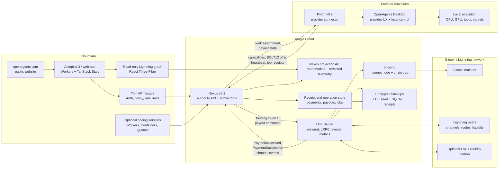
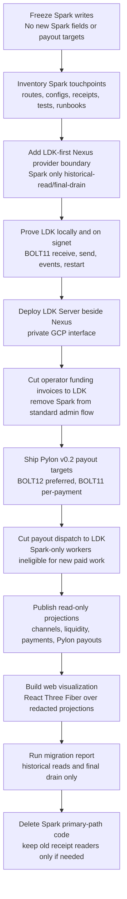

# LDK Nexus Treasury Transition Audit and Roadmap

Date: 2026-05-15

This is the separate LDK audit requested after the Nexus/Spark timeout
incident analysis. It does not evaluate LND. The working decision is to move
Nexus treasury and Pylon settlement to LDK immediately. Spark should be treated
as old state to migrate or read for historical records, not as a concurrent
active payment rail.

## Target Hosted Architecture

The completed v0.2 topology should keep durable Bitcoin and Lightning
infrastructure on server infrastructure suited for long-running stateful
processes. Cloudflare remains the right home for web, API facade, and
coding-related edge services. Google Cloud is appropriate for the hosted
Bitcoin and Lightning authority because `bitcoind`, LDK channel state, payment
event subscriptions, backups, and restore drills need stable disks,
long-running processes, and explicit operator access.



Hosting rules:

- `bitcoind`, LDK Server, Nexus payment authority, receipt storage, and backup
  jobs belong on Google Cloud or equivalent long-running server
  infrastructure.
- Cloudflare Workers should not host the LDK node or Nexus treasury spend
  authority. Workers can host web pages, API facades, auth, policy checks,
  read-only projections, queues, and coding-related services.
- Pylon runs on provider machines. It advertises LDK-compatible payout targets
  and executes local work, but it does not own Nexus treasury keys.
- Autopilot 3 can visualize the system and call Nexus APIs, but it should not
  store custody material or become the Lightning node host.

## Cutover Flow



## Sources Reviewed

- `competition/ldk/README.md`
- `competition/ldk/ldk-server-presentation-transcript.md`
- `competition/ldk/repos/ldk-server/README.md`
- `competition/ldk/repos/ldk-server/docs/getting-started.md`
- `competition/ldk/repos/ldk-server/docs/configuration.md`
- `competition/ldk/repos/ldk-server/docs/api-guide.md`
- `competition/ldk/repos/ldk-server/docs/operations.md`
- `competition/ldk/repos/ldk-server/ldk-server-grpc/src/proto/api.proto`
- `competition/ldk/repos/ldk-server/ldk-server-grpc/src/proto/events.proto`
- `competition/ldk/repos/ldk-node/README.md`
- `competition/ldk/repos/ldk-node/CHANGELOG.md`
- `competition/ldk/repos/ldk-node/src/builder.rs`
- `competition/ldk/repos/ldk-garbagecollected/README.md`
- `competition/ldk/repos/ldk-garbagecollected/ts/package.json`
- `competition/ldk/repos/ldk-garbagecollected/node-net/README.md`
- `competition/ldk/repos/ldk-garbagecollected/node-net/net.mts`
- `competition/ldk/repos/ldk-nodejs/README.md`
- `competition/ldk/repos/rust-lightning/README.md`
- `competition/ldk/repos/lightningdevkit.org/docs/index.md`
- `competition/ldk/repos/lightningdevkit.org/docs/introduction/architecture.md`
- `competition/ldk/repos/lightningdevkit.org/docs/key_management.md`
- `competition/ldk/repos/lightningdevkit.org/docs/_blog/bolt12-has-arrived.md`
- `competition/ldk/repos/lightningdevkit.org/docs/_blog/announcing-vss.md`
- `competition/ldk/repos/lightningdevkit.org/docs/_blog/announcing-rapid-gossip-sync.md`
- `competition/ldk/repos/vss-client/README.md`
- `competition/ldk/repos/vss-server/README.md`
- `competition/ldk/repos/rapid-gossip-sync-server/README.md`
- `openagents/docs/nexus-treasury.md`
- `openagents/docs/reports/nexus/2026-04-20-treasury-wallet-recovery-runbook.md`
- `openagents/docs/reports/nexus/20260503-provider-presence-heartbeat-hotfix.md`

## Executive Decision

Move the hosted Nexus treasury path to an LDK-backed provider now.

This transition should be treated as the defining payment-rail change for
**Nexus v0.2** and **Pylon v0.2**:

- Nexus v0.2 should make the LDK-backed treasury provider the primary
  implementation for new funding, receive, payout, receipt, and admin
  operation paths.
- Pylon v0.2 should advertise and accept standard Lightning payout targets,
  with BOLT12 offers as the durable default and BOLT11 as a per-payment
  compatibility path.
- Spark should not remain as an active compatibility rail. Existing Spark
  records should remain readable only long enough to audit, migrate, or perform
  a bounded final drain if one is unavoidable.

The fastest responsible path is:

1. Put an LDK provider boundary into Nexus so Spark code can be isolated,
   audited, and removed from the primary path.
2. Stand up `ldk-server` as the first LDK daemon target because it already
   exposes gRPC, events, metrics, TLS, HMAC auth, systemd hooks, and node
   operations.
3. Keep the implementation prepared to drop from `ldk-server` to `ldk-node`
   directly if `ldk-server` preview status blocks production use.
4. Use BOLT11 invoices for immediate operator funding workflows.
5. Move durable Pylon payout targets toward BOLT12 offers, with BOLT11 as a
   per-payment compatibility path.
6. Freeze Spark writes, migrate historical Spark records, perform any strictly
   necessary final drain as an explicitly named operator action, and remove
   Spark from normal funding, payout, and worker-registration paths.

This is not just a payment-provider preference. Spark has repeatedly put slow
wallet sync, stale history, and leaf spendability on the operational critical
path. LDK gives us a standard Lightning node model with explicit event streams,
channel state, durable node identity, and standard receive/payment contracts.

## Current Spark Failure Pattern

The existing Nexus treasury path is Spark-first:

- `treasury funding-target` returns Spark receive material and optional
  Spark/Bolt11 invoices.
- Hosted Nexus pays Pylons to Spark addresses.
- Bolt11 compatibility currently does not prove that Spark leaves are spendable
  for Spark-address payouts.
- Pylon workers historically created local Spark payout destinations before
  advertising paid work.

That model has failed in ways that are not acceptable for an operator payment
rail:

- Funding target calls timed out at 10 seconds, 20 seconds, 180 seconds, and
  even 600 seconds in different reports.
- Recovery reports showed wallet inspections timing out after scanning or
  rebuilding Spark wallet storage.
- Spark wallet history could return empty payments even when balances changed.
- The wallet scanned leaves but ignored many as `SplitLocked` or
  `TransferLocked`.
- Relay logs showed `Failed to select leaves:
  TreeServiceError(InsufficientFunds)` even when nominal balance existed.
- Nexus had to add backpressure around payout dispatch because one slow or
  blocked payout target could pile up live sends.
- Runtime mitigations had to distinguish nominal balance from actually
  selectable spendable leaves.

The practical conclusion is stronger than "increase timeouts." Nexus should no
longer put Spark sync, Spark invoice creation, Spark history hydration, or
Spark leaf selection on an interactive funding or payout path.

## Why LDK

LDK is a Rust Lightning stack, not a monolithic daemon. The relevant properties
for OpenAgents are:

- Runtime pieces are intentionally pluggable: persistence, networking, chain
  source, signing, and gossip source can be chosen by the integrator.
- The core protocol implementation is used in production and exposes
  lower-level control when we need custom custody or policy.
- `ldk-node` packages the LDK core with BDK wallet support, SQLite/filesystem or
  custom persistence, bitcoind/Electrum/Esplora chain sources, Rapid Gossip
  Sync, BOLT11, BOLT12, splicing, async payments, LSPS client support, and
  experimental LSPS2 service support.
- `ldk-server` packages `ldk-node` as a daemon with gRPC, CLI, TLS, HMAC auth,
  events, Prometheus metrics, systemd hooks, Tor configuration, and an MCP
  crate.

The target OpenAgents deployment should use this layered approach:

- `ldk-server` first for fast daemonization and integration testing.
- `ldk-node` directly if daemon maturity or API churn becomes the blocker.
- Core `rust-lightning` only where Nexus needs lower-level custom signer,
  persistence, channel, pathfinding, or receipt behavior that `ldk-node` cannot
  expose cleanly.

## Important LDK Server Caveat

The presentation describes LDK Server as an enterprise-ready direction, with
Postgres, Docker, Prometheus, systemd, Tor, LSP support, and a clean API. The
current checked-out `ldk-server` repo documentation is more conservative:

- The README says it is work in progress.
- It says APIs are under development.
- It says it has not been tested for production use.
- The current operations docs describe disk-backed `keys_seed`,
  `ldk_node_data.sqlite`, and `ldk_server_data.sqlite` as the primary backup
  artifacts.

Therefore, do not couple Nexus business logic directly to `ldk-server` RPC
shapes. Wrap it behind an internal provider boundary, pin the tested commit,
and be ready to swap the provider implementation to direct `ldk-node`.

## Autopilot 3 and Web Implementation Boundary

Autopilot 3 should not embed the production LDK node in the browser or in the
Cloudflare Worker for Nexus v0.2 or Pylon v0.2.

The LDK reference lane gives two different answers:

- `ldk-node` is the right high-level production integration surface, but it is
  Rust-first with Swift, Kotlin, and Python bindings through UniFFI. Its node
  model expects an application or service runtime that can own long-lived node
  state, chain sync, peer networking, event loops, entropy, and durable
  SQLite/filesystem/custom-KV storage.
- `ldk-garbagecollected` does ship TypeScript/WASM bindings for lower-level
  LDK, and the archived `ldk-nodejs` repo points users there. Those TypeScript
  bindings are functionally complete but beta quality. They require modern
  browser/runtime primitives such as `FinalizationRegistry`, `WeakRef`, and
  WASM BigInt. The Node adapter bridges LDK `SocketDescriptor` and
  `PeerManager` to Node TCP sockets; the browser path explicitly requires us
  to provide our own bridge from `SocketDescriptor` to a WebSocket proxy.

That means browser LDK is technically possible as an R&D lane, but it is not
the production payment authority for the v0.2 cutover. A real browser-resident
Lightning node would still need:

- a WebSocket-to-Lightning-peer proxy with backpressure and reconnect behavior,
- audited IndexedDB or remote VSS-backed persistence for channel monitors and
  wallet state,
- browser key custody and recovery UX,
- single-writer protection so the same node backup cannot be active in two
  tabs, devices, or restored sessions,
- chain data sourcing and route graph handling that do not rely on fragile
  public infrastructure,
- watchdog behavior for suspended tabs, mobile browser lifecycle pauses, and
  interrupted persistence,
- a clear answer for how user wallets differ from Nexus treasury authority.

Autopilot 3's correct role is the web control plane:

- render a read-only, React Three Fiber Lightning and Pylon state
  visualization before any browser wallet work,
- show Nexus treasury and Pylon settlement status,
- create funding invoices by calling Nexus server APIs,
- call authorized admin operations such as pay invoice, pay offer, list
  payments, list channels, and connect peer,
- render invoices, offers, payment receipts, channel state, and degraded
  states,
- expose token-authenticated API routes that proxy to Nexus with policy and
  audit receipts,
- decode or validate payment targets client-side only when that does not imply
  custody.

Autopilot 3 must not store or own:

- LDK seed material,
- channel monitor state,
- `keys_seed`,
- `ldk_node_data.sqlite`,
- LDK wallet entropy,
- spend authority for Nexus funds,
- user wallet state in Convex.

A Cloudflare Worker route in Autopilot 3 is also not the node host. Workers
are a good facade for authorization, rate limiting, audit receipts, admin
tools, and projections, but the core LDK node needs a long-running runtime with
durable local or explicitly designed remote persistence and real peer
networking. If Workers participate in v0.2, they should sit in front of Nexus
or project read models from Nexus. They should not be the single source of
truth for LDK channel state or treasury spend authority.

The browser/WebAssembly path should stay explicitly out of the critical path
until after Nexus v0.2 and Pylon v0.2 ship. It can be studied later for:

- signet demos,
- invoice and offer parsing,
- user-owned experimental wallets,
- mobile/web recovery flows backed by VSS,
- non-custodial browser payment experiences that never touch Nexus treasury
  funds.

If we want LDK embedded close to the Autopilot product sooner, the better
target is a native/desktop runtime or a server-side Nexus/Pylon process, not
the Autopilot 3 browser app.

### First Web Surface: Read-Only Lightning Visualization

The first LDK-related web surface should be visualization, not wallet custody.
Autopilot 3 should present a read-only canvas that makes OpenAgents' section of
the Lightning network understandable at a glance. Use React Three Fiber for the
primary graph, with ordinary HTML panes for exact receipts, filters, and event
details.

The canvas should show:

- Pylons as nodes, grouped by user, project, machine, and payout domain.
- Nexus treasury nodes, LSP nodes, and important peers as distinct graph
  actors.
- Channels as directional edges with capacity, inbound liquidity, outbound
  liquidity, channel reserve, and health encoded as width, color, and labels.
- Animated money flows for invoice creation, payment attempts, successful
  payments, failed routes, retries, forwards, and reconciled payouts.
- Pending, settled, failed, and reversed payout states on a time axis.
- Route failures, stale chain sync, stale gossip/RGS, disconnected peers, and
  low-liquidity conditions as visible hazard overlays.
- Pylon earning events linked to the channel or payment path that settled the
  payout.

The data path should be:

```text
LDK / Nexus event ingestion
  -> normalized peer, channel, liquidity, payment, payout, and receipt snapshots
  -> read-only Nexus projection API
  -> Autopilot 3 API facade with WorkOS/API-token policy
  -> React Three Fiber Lightning graph canvas
```

That projection must be redacted and read-only. It may include ids, aliases,
balances, capacities, liquidity bands, event timestamps, degraded-state reason
codes, and receipt references. It must not include seed material, channel
monitor state, raw `keys_seed`, raw SQLite data, LDK API keys, macaroon-like
credentials, or spend authority.

This view is valuable before user wallets exist in the browser because it gives
operators and users a visible model of what the network is doing: which Pylons
are earning, which channels are constrained, where liquidity is moving, and why
a payout is blocked. It also gives the LDK cutover an obvious product surface
that is safer than browser custody.

## Target Architecture

### Service Boundary

Add a `TreasuryLightningProvider` boundary under Nexus control:

```text
Nexus API / admin tools
  -> treasury operation store
  -> TreasuryLightningProvider
       -> LDK provider, new default
            -> LDK Server gRPC, phase 1
            -> ldk-node direct daemon/library, fallback or phase 2
       -> Spark historical reader / final drain, disabled by default
```

The provider boundary must own:

- idempotency keys
- receive target creation
- outbound payment dispatch
- payment status lookup
- event ingestion
- balance and channel health snapshots
- error normalization
- receipt projection

Nexus-facing code should not know whether an LDK receive target is BOLT11,
BOLT12, or an LSP/JIT receive path. It should know only the durable operation
id, rail, amount, beneficiary, current state, and receipt facts. Spark should
appear only through historical read models or the explicitly disabled final
drain path.

### LDK Daemon Placement

Run the first LDK service as a sidecar or sibling service on the Nexus host:

```text
nexus-mainnet-1
  nexus-relay / nexus-control
  ldk-server
  bitcoind-backed chain source
  local encrypted or restricted storage volume
  Prometheus scrape / logs / backup job
```

Use loopback gRPC first:

- `127.0.0.1:3536`
- pinned self-signed TLS certificate
- `x-auth: HMAC <unix_timestamp>:<hmac_hex>`
- 60 second clock skew budget
- local API key read from a root-owned secret path

Do not expose the LDK gRPC port publicly during the first production phase.

### Chain Backend

Production should use bitcoind, not public Electrum or public Esplora.

The LDK Server docs explicitly warn that Electrum/Esplora are not recommended
for publicly reachable nodes because LDK cannot verify gossip against the
blockchain in the same way and malicious peers can flood the node with fake
channel announcements. Electrum/Esplora remain acceptable for local, signet,
mobile-style, or private prototype lanes.

### Storage and Backup

Back up at least:

- `<storage_dir>/keys_seed`: critical; node identity and master secret.
- `<network_dir>/ldk_node_data.sqlite`: critical; channel state and on-chain
  wallet data.
- `<network_dir>/ldk_server_data.sqlite`: useful; payment and forwarding
  history.
- TLS certificate and API key for operational continuity, though they are
  reconstructable with client reconfiguration.

Never restore the same LDK node backup into two running instances. That can
create channel-state conflicts and risk funds.

This single-writer rule must be reflected in every Nexus restore and failover
runbook.

### Event Projection

Subscribe to `SubscribeEvents` and project events into Nexus treasury operation
records:

- `PaymentReceived`
- `PaymentSuccessful`
- `PaymentFailed`
- `PaymentClaimable`
- `PaymentForwarded`

The LDK Server event stream uses a bounded broadcast channel. Slow subscribers
can miss events. Therefore, event projection must be backed by periodic
`ListPayments` reconciliation, not treated as the only source of truth.

### Payment Contracts

Immediate receive path:

- `Bolt11Receive` for operator funding invoices.
- `Bolt11ReceiveForHash` only when Nexus needs a hold/claim/fail workflow.
- `Bolt11ReceiveViaJitChannel` only after LSPS2 liquidity has been tested.

Durable Pylon payout target:

- Prefer `Bolt12Receive` offers because BOLT12 is reusable and avoids the
  per-payment BOLT11 invoice problem.
- Use `UnifiedSend` for payer-side support of BIP21, BIP353 HRNs, BOLT11, and
  BOLT12 once the target type is known.
- Keep BOLT11 payout as a compatibility path only when the beneficiary can
  supply a fresh invoice per payout.

The legacy Spark address model must not be copied into the LDK model. Standard
Lightning does not have "pay this reusable BOLT11 invoice forever." Durable
receive identity should be BOLT12, BIP353, LNURL-pay, or a provider-mediated
invoice request flow. The LDK-first target should be BOLT12.

## Mapping Current Nexus Behavior to LDK

| Current Nexus/Spark behavior | LDK replacement |
| --- | --- |
| `treasury funding-target` creates Spark receive material | `Bolt11Receive` for immediate operator invoice, later `Bolt12Receive` for reusable offers |
| Spark address as Pylon payout destination | BOLT12 offer as durable payout destination; BOLT11 only per-payment |
| Spark wallet balance/status | `GetBalances`, `GetNodeInfo`, `ListChannels`, Prometheus metrics |
| Spark payment history scan | `ListPayments` plus event projection |
| Spark send | `Bolt11Send`, `Bolt12Send`, or `UnifiedSend` |
| Spark spendability/leaf checks | Channel/liquidity health, outbound balance, route failures, no-route/precondition errors |
| Spark data sync timeout | LDK wallet sync timestamps, chain backend health, gossip/RGS freshness |
| Spark payout receipt | `PaymentSuccessful` / `PaymentReceived` event plus `GetPaymentDetails` |
| Spark leaf selection block | Insufficient outbound liquidity, failed route, failed precondition, or channel reserve constraint |
| Recovery wallet rebuild | `keys_seed` + `ldk_node_data.sqlite` restore drill with single-writer guard |

## Authoritative Spark-to-LDK Migration Sequence

The migration should be explicit. Do not interpret "move to LDK" as a
concurrent operating model. Spark and LDK should not coexist as active funding
or payout choices. Spark exists only to read or migrate old state and to perform
a tightly bounded final drain if one is unavoidable.

Current state:

- Nexus treasury can create Spark-backed funding targets and optional BOLT11
  material through the current funding endpoint.
- Nexus accepted-work payouts currently know how to pay Spark-address workers.
- Pylon workers historically create or advertise Spark payout destinations.
- Existing payout receipts and runbooks may contain Spark-specific fields.

Target state:

- Nexus v0.2 owns an LDK-first treasury operation model with enough historical
  rail metadata to audit old Spark records.
- New Nexus funding invoices come from LDK `Bolt11Receive`.
- New Pylon v0.2 workers advertise standard Lightning payout targets, with
  BOLT12 offers preferred and BOLT11 used only per payment or compatibility
  flow.
- Spark has no write path in new funding, receive, payout, or worker
  registration. Historical Spark records remain readable until audited or
  migrated.

Migration order:

1. Inventory and freeze Spark touchpoints.
   - List every Nexus route, admin command, Pylon config field, payout record,
     receipt field, test, and runbook that creates, stores, reads, or sends to
     Spark material.
   - Add a migration note beside each touchpoint: `legacy-read`,
     `final-drain-only`, `ldk-replace`, or `delete-after-cutover`.
   - Stop adding new Spark-specific fields to public or internal APIs.

2. Add the Nexus provider boundary before moving funds.
   - Introduce `TreasuryLightningProvider`.
   - Put existing Spark calls behind `SparkTreasuryProvider` only long enough
     to inventory, quarantine, and delete them.
   - Add `LdkTreasuryProvider` behind the same interface.
   - Do not expose Spark versus LDK as a product or operator rail choice.
   - Store treasury operations with LDK-first fields that still preserve
     historical rail metadata:
     `operation_id`, `rail`, `amount_msat`, `target_kind`, `target_hash`,
     `beneficiary`, `status`, `provider_payment_id`, `receipt_refs`, and
     timestamps.
   - Keep historical Spark fields readable through compatibility projection
     code, not through new business logic.

3. Prove LDK locally and on signet.
   - Use a two-node LDK harness.
   - Prove BOLT11 invoice creation, payment, event projection, restart safety,
     missed-event reconciliation with `ListPayments`, and error normalization.
   - This gate must pass before any production default changes.

4. Cut Nexus operator funding invoices to LDK first.
   - Deploy LDK beside Nexus on loopback.
   - Switch admin funding invoice creation to LDK when
     `NEXUS_TREASURY_PROVIDER=ldk`.
   - Remove Spark funding from the standard admin flow.
   - If Spark funds must be swept, use a separate final-drain operator command,
     not a fallback route.
   - Record timing around invoice creation and event reconciliation. This is
     the first production proof that funding no longer depends on Spark sync or
     Spark wallet history hydration.

5. Ship Pylon v0.2 payout target registration.
   - Add payout target variants: `bolt12_offer`, `bolt11_invoice`,
     `bip353_name`, and optional `lnurl_pay`.
   - Pylon v0.2 should prefer BOLT12 when available.
   - Pylon should advertise a capability/version marker so Nexus can choose
     LDK-compatible payout behavior without guessing.
   - Old `spark_address` config may be read only to identify workers that must
     upgrade before they can receive new payouts.
   - Pylon should continue to show local payout state, but it must not become a
     broad wallet shell.

6. Cut payout dispatch to LDK.
   - Upgraded Pylon v0.2 workers get LDK-standard payouts through BOLT12 or
     per-payment BOLT11.
   - Workers without an LDK-compatible target are not eligible for new paid
     work after the cutover.
   - Every accepted-work receipt must store the rail, payment artifact,
     provider payment id, terminal event state, and degraded reason if payout
     failed.
   - Operators should be able to filter historical payouts by rail, but new
     payouts should be `rail=ldk`.

7. Add read-only projections and visualization.
   - Project LDK peer, channel, liquidity, payment, payout, and degraded-state
     facts through Nexus.
   - Join those facts with Pylon earning and payout receipt facts.
   - Feed the Autopilot 3 React Three Fiber graph from those redacted
     projections only.

8. Disable new Spark creation.
   - Stop creating new Spark payout destinations in Pylon.
   - Stop returning Spark receive material from the default Nexus funding
     target route.
   - Leave historical reconciliation reads in place only until the migration
     audit is complete.

9. Decommission Spark writes.
   - Block new Spark sends except for an explicitly approved final drain.
   - Produce a report of any remaining active workers or receipts that still
     depend on Spark.
   - Remove Spark from standard runbooks, admin tools, and chat/API defaults.

10. Delete Spark primary-path code after the drain is complete.
    - Keep only historical readers if needed for old receipts.
    - Remove Spark leaf-selection backpressure, Spark sync timing workarounds,
      and Spark funding-target retries from the primary Nexus path.

Cutover rule:

- Do not make LDK the production default until local/signet proof is green.
- Do not require Pylon v0.2 workers to use LDK until Nexus has production LDK
  receive and send receipts.
- Do not keep Spark active after cutover. Keep only historical readers and one
  explicitly named final-drain path until the migration report is complete.

## Pylon v0.2 Changes Required

Pylon v0.2 cannot remain Spark-address-only.

Required changes:

1. Add payout target variants:
   - `bolt12_offer`
   - `bolt11_invoice`
   - `bip353_name`
   - `lnurl_pay`, optional if we choose to support an HTTPS invoice provider
2. Prefer BOLT12 offers for durable worker payout registration.
3. Add per-payment invoice request support for workers that can supply fresh
   BOLT11 invoices.
4. Read old Spark targets only to identify workers that need an upgrade; do not
   accept Spark targets for new paid work after cutover.
5. Add a capability bit or version marker so Nexus knows whether a Pylon can
   receive over LDK-standard Lightning.
6. Update accepted-work payout records to store the target rail and the exact
   payment artifact used.
7. Update operator/admin APIs and chat tools to surface the payment rail
   clearly.

## Immediate Roadmap

### Phase 0: Provider Boundary and Local Harness

Ship this before any mainnet LDK funds move. This is the foundation for Nexus
v0.2 and Pylon v0.2.

- Add a `TreasuryLightningProvider` trait or equivalent internal interface.
- Move Spark-specific code behind `SparkTreasuryProvider`.
- Add `LdkTreasuryProvider` with a fake/local implementation first.
- Add config:
  - `NEXUS_TREASURY_PROVIDER=ldk`
  - `NEXUS_SPARK_FINAL_DRAIN_ENABLED=false`
  - `NEXUS_LDK_SERVER_URL`
  - `NEXUS_LDK_API_KEY_PATH`
  - `NEXUS_LDK_TLS_CERT_PATH`
  - `NEXUS_LDK_STORAGE_DIR`
  - `NEXUS_LDK_NETWORK=regtest|signet|bitcoin`
  - `NEXUS_LDK_CHAIN_BACKEND=bitcoind|electrum|esplora`
- Add treasury operation rows that are not tied to Spark fields.
- Add integration tests for:
  - receive target idempotency
  - send idempotency
  - event projection
  - missed event recovery through payment listing
  - provider error normalization
- Build a local regtest or signet harness with two LDK nodes and a bitcoind
  backend.
- Prove:
  - LDK starts and reports node info.
  - A BOLT11 invoice is generated quickly.
  - A second node pays it.
  - `PaymentReceived` and `PaymentSuccessful` events project into Nexus.
  - Restart does not lose payment/channel state.

### Phase 1: Operator Funding Invoice Cutover

This replaces the slow Spark funding-target path first and makes Nexus v0.2
meaningfully LDK-backed even before all Pylons have upgraded.

- Deploy LDK Server beside Nexus on a non-public interface.
- Use bitcoind in production.
- Add Prometheus metrics scrape and alerting.
- Add logrotate.
- Add backup job for `keys_seed` and SQLite state.
- Add restore drill runbook.
- Change admin funding invoice creation to use `Bolt11Receive` when
  `NEXUS_TREASURY_PROVIDER=ldk`.
- Remove Spark funding target creation from the standard admin path.
- Keep any Spark sweep/drain behavior in a separate, disabled-by-default final
  drain command.
- Record phase timing for:
  - API request receipt
  - LDK RPC start/end
  - invoice returned
  - payment observed by event
  - payment reconciled by `ListPayments`

Success gate:

- Funding invoice creation p95 under 2 seconds in normal operation.
- Funding invoice creation never blocks on full wallet history hydration.
- Direct LDK receive event appears in Nexus treasury operation history.

### Phase 2: Pylon Receive Target Migration

This is the Pylon v0.2 cutover. It moves worker payout identity off Spark
addresses.

- Add Pylon payout target schema variants.
- Update Pylon registration to advertise BOLT12 support when available.
- Add Nexus capability negotiation for LDK-compatible worker payout behavior.
- Update payout dispatch to prefer BOLT12 offers for durable workers.
- Add BOLT11 per-payment fallback for old or simple workers.
- Treat workers that only advertise Spark targets as not eligible for new paid
  work after cutover.

Success gate:

- A new Pylon can register a BOLT12 offer target.
- Nexus can pay that target through LDK.
- Accepted-work payout receipt stores the LDK payment id, rail, target, and
  event-derived terminal state.

### Phase 3: Liquidity and Channel Operations

LDK does not remove the need to manage liquidity. It makes the state explicit.

- Define inbound and outbound liquidity thresholds for Nexus.
- Add admin chat/API tools for:
  - node info
  - balances
  - channels
  - peers
  - open channel
  - close channel
  - splice in
  - splice out
  - payment status
- Evaluate LSPS2/JIT channels after basic BOLT11/BOLT12 receive works.
- Add alerts for:
  - low outbound liquidity
  - low inbound liquidity
  - stale wallet sync timestamp
  - stale RGS timestamp
  - rising failed payment count
  - missing event subscriber

Success gate:

- Admins can diagnose why a payout cannot route without reading raw service
  logs.
- A liquidity issue produces a typed Nexus degraded state, not a generic
  funding-target timeout.

### Phase 3.5: Read-Only Web Liquidity Visualization

This phase is the first web-facing LDK product slice. It should not wait for a
browser wallet.

- Add read-only Nexus projection endpoints for:
  - peers
  - channels
  - liquidity bands
  - payment attempts
  - payment terminal states
  - payout receipts
  - Pylon earning events
  - degraded Lightning states
- Add stable redaction rules so the projection is safe for Autopilot 3 and
  future public or semi-public operator surfaces.
- Build an Autopilot 3 React Three Fiber canvas that renders the OpenAgents
  Lightning graph with animated payment and payout flows.
- Add exact side panes for selected channel, payment, Pylon, peer, and receipt
  objects.
- Keep all write operations out of the visualization path.

Success gate:

- An operator can see where liquidity is, where payments are flowing, and why a
  payout is blocked without shelling into the Nexus host.
- The visualization consumes only read-only projections and cannot initiate a
  payment, open a channel, close a channel, or expose custody material.

### Phase 4: Spark Decommission

Start only after BOLT12/BOLT11 Pylon settlement works in production.

- Stop creating new Spark payout destinations.
- Stop returning Spark invoice material from standard funding target APIs.
- Keep read-only Spark reconciliation for historical payments.
- Add final migration report of active workers still advertising Spark targets.
- Remove Spark leaf-selection backpressure from the primary payout path.
- Archive old Spark runbooks as legacy.

Success gate:

- No active worker, runbook, admin chat tool, or Autopilot API path requires
  Spark for a new treasury or payout operation.

## Security and Custody Requirements

LDK changes the custody model from Spark service state to node/channel state.
This is better for explicit control, but it raises the cost of sloppy
operations.

Hard requirements:

- Restrict `keys_seed`, `api_key`, TLS key, and SQLite state to the service
  user.
- Never print the API key or seed in logs, docs, issues, or chat responses.
- Pin the TLS certificate for the local Nexus client.
- Keep gRPC on loopback during initial production.
- Back up state after every channel-changing operation.
- Test restore before relying on mainnet funds.
- Do not run two active instances from the same node identity or backup.
- Treat slow or failed persistence as a funds-risk event.

VSS is not a phase-one requirement for the hosted Nexus daemon. It matters
later for mobile, multi-device, or user-wallet recovery. VSS can store
encrypted Lightning state and is integrated with LDK Node, but LDK Node's own
changelog still marks remote persistence as a risk area because unrecoverable
persistence failures can panic after retries. Use local durable storage first
for Nexus.

## Rapid Gossip Sync

RGS is useful, but it is not the first production dependency for the hosted
Nexus node.

Use RGS for:

- lightweight clients
- fast route graph initialization
- mobile-style Pylon wallets
- maybe a future OpenAgents-operated RGS service

Do not use RGS as a substitute for production bitcoind-backed chain truth on
the hosted public Nexus node. The RGS docs describe a semi-trusted server
model. That is fine for performance, but Nexus treasury should keep direct
chain backend authority for the hosted settlement node.

## Operational Runbook Additions

Add or update runbooks for:

- LDK Server install and pinning.
- LDK Server config for mainnet with bitcoind backend.
- API key and TLS certificate provisioning.
- Systemd unit and restart policy.
- Logrotate.
- Prometheus scrape and alerts.
- Backup and restore.
- Mainnet funding invoice smoke.
- BOLT12 Pylon payout target smoke.
- Payment event subscriber restart.
- Missed event reconciliation.
- Spark historical-read and final-drain procedure.
- Spark decommission.

Each runbook should include exact commands, expected output fields, failure
states, and the rollback condition.

## Testing Plan

### Unit Tests

- Provider config parsing.
- HMAC metadata construction for LDK Server API.
- TLS certificate pin loading.
- Treasury operation idempotency.
- Rail-specific target validation.
- Error normalization from gRPC codes.

### Integration Tests

- Local regtest LDK invoice creation.
- Local regtest LDK invoice payment.
- Event projection.
- Payment lookup reconciliation after intentionally disconnecting the event
  stream.
- Restart during pending invoice.
- Restart after received payment.
- Insufficient balance/no-route error mapping.
- Pylon BOLT12 target registration.
- BOLT12 payout dispatch.

### Production Smoke

- Read-only `GetNodeInfo`.
- Read-only `GetBalances`.
- Generate a tiny operator invoice.
- Pay from a controlled external wallet.
- Verify Nexus sees `PaymentReceived`.
- Verify `ListPayments` agrees.
- Dispatch a bounded tiny payout to a controlled BOLT12/BOLT11 test target.
- Confirm receipt projection.

Do not run repeated live funding-target calls as a debug loop. Local or signet
reproduction should do the heavy testing.

## API and Admin Chat Requirements

Autopilot/Nexus admin tools should not expose raw LDK internals, but admins
need enough control to operate the node:

- `treasury.status`
- `treasury.createFundingInvoice`
- `treasury.listPayments`
- `treasury.getPayment`
- `treasury.listChannels`
- `treasury.openChannel`
- `treasury.closeChannel`
- `treasury.spliceIn`
- `treasury.spliceOut`
- `treasury.listPeers`
- `treasury.connectPeer`
- `treasury.payInvoice`
- `treasury.payOffer`
- `treasury.decodePaymentTarget`
- `treasury.reconcilePayments`

Every write-side command must require admin authorization, an idempotency key,
and a durable operation row.

Autopilot 3 routes should remain thin wrappers around these Nexus operations.
They can enforce WorkOS/API-token identity, shape UI responses, and write audit
receipts, but Nexus remains the source of truth for LDK operations and spend
authority.

## Implementation Issue List by Repository

Create these as concrete issues before implementation. Execute them in order.
The issue IDs below are planning labels, not existing GitHub issue numbers.

| ID | Repo | Phase | Issue | Deliverables | Depends On | Proof |
| --- | --- | --- | --- | --- | --- | --- |
| LDK-01 | `openagents` | 0 | Freeze and inventory Spark touchpoints | Code and runbook inventory of every Spark route, config field, payout record, test, admin command, and Pylon registration path; each marked `legacy-read`, `final-drain-only`, `ldk-replace`, or `delete-after-cutover`; no new Spark write path accepted | none | Inventory doc, grep checklist, CI/test note showing no new Spark target creation in the normal path |
| LDK-02 | `openagents` | 0 | Add LDK-first Nexus treasury provider boundary | `TreasuryLightningProvider` interface; `LdkTreasuryProvider` scaffold; Spark quarantined behind historical-reader/final-drain adapter only; config shape for LDK Server URL, TLS, API key, storage, network, chain backend | LDK-01 | Unit tests for config parsing, idempotency keys, provider selection, and Spark-disabled default |
| LDK-03 | `openagents` | 0 | Add treasury operation and receipt store updates | Durable operation rows for funding invoice, payout, payment status, event projection, rail metadata, target hash, beneficiary, terminal state, and degraded reason; migration path for old Spark receipts | LDK-02 | Migration test, replay test, receipt projection test |
| LDK-04 | `openagents` | 0 | Build local LDK regtest/signet harness | Two-node LDK harness with bitcoind backend; BOLT11 invoice creation; payment send; restart safety; missed-event reconciliation through `ListPayments` | LDK-02 | Scripted smoke run with invoice creation, payment, event projection, restart, and reconciliation logs |
| LDK-05 | `openagents` | 0 | Wire LDK Server client into Nexus | gRPC/TLS/HMAC client for `GetNodeInfo`, `GetBalances`, `Bolt11Receive`, `ListPayments`, `GetPayment`, and `SubscribeEvents`; error normalization from gRPC codes into Nexus degraded states | LDK-04 | Integration tests against harness; typed error fixtures |
| LDK-06 | `openagents` | 1 | Deploy LDK Server and bitcoind topology on Google Cloud | GCP runbooks and scripts for `bitcoind`, LDK Server, systemd, private interface binding, Prometheus metrics, logrotate, backup, restore drill, and operator access | LDK-04, LDK-05 | Non-public signet or dry-run host with read-only node info, balances, and metrics verified |
| LDK-07 | `openagents` | 1 | Cut Nexus operator funding invoices to LDK | Standard funding endpoint uses LDK `Bolt11Receive`; Spark funding removed from normal admin/API/chat path; final-drain command is separate and disabled by default | LDK-05, LDK-06 | Funding invoice p95 under 2 seconds; paid invoice appears as `PaymentReceived`; `ListPayments` reconciliation agrees |
| LDK-08 | `openagents` | 2 | Add Pylon v0.2 payment-target registration | Pylon advertises `bolt12_offer`, `bolt11_invoice`, `bip353_name`, and optional `lnurl_pay`; no new Spark destination creation; Spark config read only to flag upgrade-required workers | LDK-02 | Pylon registration smoke showing BOLT12 target and capability marker; Spark-only worker marked ineligible |
| LDK-09 | `openagents` | 2 | Cut accepted-work payout dispatch to LDK | Nexus pays upgraded Pylons through BOLT12 or per-payment BOLT11; accepted-work receipts store payment id, target, rail, terminal event state, and degraded reason | LDK-05, LDK-08 | Bounded payout smoke to controlled target; receipt projection shows LDK payment id and terminal event |
| LDK-10 | `openagents` | 3 | Add liquidity and channel admin operations | Admin APIs/chat tools for node info, balances, channels, peers, connect peer, open/close channel, splice in/out, payment status, pay invoice, pay offer, and reconcile payments | LDK-05, LDK-07 | Admin smoke against signet/dry-run node; write commands require admin auth and idempotency keys |
| LDK-11 | `openagents` | 3 | Add liquidity alerts and degraded states | Thresholds and typed degraded states for low inbound/outbound liquidity, stale wallet sync, stale event subscriber, failed payment rate, stale gossip/RGS, and route failure | LDK-10 | Unit tests for thresholds; integration fixture for no-route/insufficient-liquidity mapping |
| LDK-12 | `openagents` | 3.5 | Publish read-only Nexus projection endpoints | Projection APIs for peers, channels, liquidity bands, payment attempts, terminal states, payout receipts, Pylon earning events, and degraded Lightning states; redaction rules | LDK-09, LDK-11 | Read-only endpoint smoke; redaction tests prove no seed, API key, private channel secret, or custody material leaks |
| LDK-13 | `autopilot3` | 3.5 | Build React Three Fiber Lightning/Pylon visualization | Web surface consuming Nexus read-only projections; graph nodes for Nexus, LDK channels, peers, Pylons, payments, liquidity, and degraded states; side panes for selected objects | LDK-12 | Local and deployed visual smoke; no write operations exposed from visualization |
| LDK-14 | `autopilot3` | 3.5 | Add thin Autopilot 3 Nexus API/admin facades | WorkOS/API-token gated routes for treasury status and approved admin operations; all writes proxy to Nexus with idempotency and audit receipts; no custody material in Worker state | LDK-10, LDK-12 | API smoke with admin token; unauthorized user cannot access write tools; route logs show Nexus operation ids |
| LDK-15 | `openagents` | 4 | Decommission Spark from new operations | Remove Spark from normal funding, payout, worker-registration, admin, API, and chat paths; keep only historical readers and disabled final-drain path until report closes | LDK-07, LDK-09 | Grep checklist, tests proving no normal path creates or sends Spark material, migration report |
| LDK-16 | `openagents` | 4 | Write final Spark migration and drain report | Report active workers, old receipts, remaining Spark funds, drain status, deleted code paths, retained historical readers, and rollback limits | LDK-15 | Checked-in report; operator signoff criteria documented |
| LDK-17 | `treasury` | 0-2 | Decide and implement long-term custody ownership split | If hosted payment authority moves out of Nexus, implement the LDK provider and operation store in `treasury`; if Nexus remains owner for v0.2, record that decision and keep `treasury` as a later extraction target | LDK-02 | Decision record plus either `treasury` implementation plan or explicit v0.2 non-goal |
| LDK-18 | `openagents.com` | 3.5 | Add public/brand links to read-only compute and Lightning status where appropriate | Link or embed approved read-only status surfaces from the public website without exposing admin controls or custody data | LDK-12, LDK-13 | Public page smoke; unauthenticated view only sees approved redacted data |
| LDK-19 | `openagents` | all | Update runbooks and operator docs after each phase | Exact commands, expected output fields, failure states, rollback conditions, backup/restore steps, and production smoke procedure for every shipped phase | each phase | `git diff --check`; runbook command syntax checks where scripts exist |

### Copy-Ready GitHub Issue Bodies

#### LDK-01 — Freeze and inventory Spark touchpoints

Target repo: `OpenAgentsInc/openagents`

Labels: `ldk`, `nexus`, `pylon`, `spark-migration`, `phase-0`, `docs`

Depends on: none

Body:

We are moving Nexus treasury and Pylon settlement to LDK as a single active
payment rail. Spark must not remain a concurrent funding or payout rail. Before
implementation starts, inventory every Spark touchpoint and freeze new Spark
write behavior.

Scope:

- Find every Nexus route, admin command, worker registration path, Pylon config
  field, payout target, payout receipt, migration, test, script, and runbook
  that creates, stores, reads, or sends Spark material.
- Mark each touchpoint as one of `legacy-read`, `final-drain-only`,
  `ldk-replace`, or `delete-after-cutover`.
- Add a checked-in inventory document under `docs/` or `docs/reports/`.
- Add a code comment or TODO marker beside any code path that must survive only
  temporarily for historical reads or the final drain.
- Confirm the normal code path cannot create new Spark payout destinations or
  new Spark funding targets.

Acceptance criteria:

- The inventory identifies owner module, file path, behavior, migration marker,
  and deletion condition for every Spark touchpoint found.
- The standard funding, payout, Pylon registration, admin, API, and chat paths
  are documented as moving to LDK-only.
- No new public or internal API fields are added that make Spark a durable
  active rail.
- Any final-drain path is explicitly named and disabled by default.

Verification:

- Include the exact `rg` commands used to find Spark touchpoints.
- Run the relevant unit/test suite available for the touched area.
- Run `git diff --check`.
- Comment on the issue with the inventory path and remaining touchpoint counts
  by migration marker.

Out of scope:

- Do not implement LDK calls in this issue.
- Do not create a Spark/LDK selector in user-facing product flows.

#### LDK-02 — Add LDK-first Nexus treasury provider boundary

Target repo: `OpenAgentsInc/openagents`

Labels: `ldk`, `nexus`, `treasury`, `phase-0`, `rust`

Depends on: LDK-01

Body:

Introduce the internal Nexus boundary that lets normal treasury behavior become
LDK-first while quarantining Spark as historical-read/final-drain-only code.
This boundary should prevent Nexus business logic from depending on
Spark-specific fields.

Scope:

- Add a `TreasuryLightningProvider` trait or equivalent internal interface.
- Add an `LdkTreasuryProvider` scaffold with fake/local behavior sufficient for
  tests.
- Move existing Spark calls behind a quarantined adapter only long enough to
  support historical reads and disabled final-drain operations.
- Add config for:
  - `NEXUS_TREASURY_PROVIDER=ldk`
  - `NEXUS_SPARK_FINAL_DRAIN_ENABLED=false`
  - `NEXUS_LDK_SERVER_URL`
  - `NEXUS_LDK_API_KEY_PATH`
  - `NEXUS_LDK_TLS_CERT_PATH`
  - `NEXUS_LDK_STORAGE_DIR`
  - `NEXUS_LDK_NETWORK=regtest|signet|bitcoin`
  - `NEXUS_LDK_CHAIN_BACKEND=bitcoind|electrum|esplora`
- Do not expose Spark versus LDK as a product or operator rail choice.

Acceptance criteria:

- New treasury logic calls the provider boundary, not direct Spark code.
- The default config is LDK-first.
- Spark final drain cannot run unless the explicit final-drain flag is enabled.
- Provider errors normalize into typed Nexus errors.
- The implementation is structured so `ldk-server` can later be swapped for a
  direct `ldk-node` daemon/library without changing Nexus business logic.

Verification:

- Unit tests for config parsing, provider selection, idempotency key handling,
  disabled Spark final drain, and provider error normalization.
- Run the relevant Rust test target.
- Run `git diff --check`.

Out of scope:

- Do not move mainnet funds.
- Do not deploy LDK Server.

Implementation status, 2026-05-16:

- `apps/nexus-control/src/treasury_provider.rs` now defines the
  `TreasuryLightningProvider` boundary, provider config types, normalized
  provider errors, and a deterministic `LdkTreasuryProvider` local scaffold.
- `TreasuryConfig` now parses the LDK provider shape:
  `NEXUS_TREASURY_PROVIDER`, `NEXUS_SPARK_FINAL_DRAIN_ENABLED`,
  `NEXUS_LDK_SERVER_URL`, `NEXUS_LDK_API_KEY_PATH`,
  `NEXUS_LDK_TLS_CERT_PATH`, `NEXUS_LDK_STORAGE_DIR`,
  `NEXUS_LDK_NETWORK`, and `NEXUS_LDK_CHAIN_BACKEND`.
- The default provider is LDK. The legacy Spark funding and payout paths can
  run only when the provider is explicitly `spark_final_drain` and the final
  drain flag is enabled.
- The LDK scaffold returns stable local funding targets and payout ids keyed
  by idempotency values, so later `ldk-server` or direct `ldk-node` calls can
  replace the scaffold behind the same Nexus boundary.

#### LDK-03 — Add treasury operation and receipt store updates

Target repo: `OpenAgentsInc/openagents`

Labels: `ldk`, `nexus`, `receipts`, `phase-0`, `data-model`

Depends on: LDK-02

Body:

Add durable treasury operation and receipt storage that can represent LDK
funding invoices, payouts, event projection, reconciliation, and old Spark
receipt migration without tying new business logic to Spark fields.

Scope:

- Add or extend operation rows for:
  - funding invoice creation
  - outbound payout dispatch
  - payment status lookup
  - event projection
  - reconciliation pass
  - final-drain operation if needed
- Store operation id, rail metadata, amount msat, target kind, target hash,
  beneficiary, status, provider payment id, receipt references, degraded
  reason, created/updated timestamps, and terminal event state.
- Add migration or compatibility projection for old Spark receipts.
- Ensure operation rows are idempotent and replay-safe.
- Ensure receipt projection can rebuild after process restart.

Acceptance criteria:

- New LDK operations can be represented without Spark-specific fields.
- Old Spark receipts remain queryable for audit.
- No custody secrets, API keys, seeds, or private channel data are stored in
  receipt rows.
- Operation replay produces the same read model.

Verification:

- Migration tests for old receipt shape.
- Replay/rebuild tests for operation projections.
- Receipt projection unit tests.
- Run `git diff --check`.

Implementation status, 2026-05-16:

- `nexus-control` now persists `TreasuryOperationRecord` rows keyed by stable
  operation ids. The row is provider neutral: kind, rail, rail metadata,
  amount msat, hashed target, beneficiary, status, hashed provider payment id,
  receipt refs, degraded reason, timestamps, and terminal state.
- New operation kinds cover funding invoice creation, outbound payout dispatch,
  payment-status lookup, event projection, reconciliation pass, and a reserved
  explicit final-drain operation.
- Funding target creation records a `funding_invoice_creation` operation and a
  `treasury.funding_invoice.created` receipt without storing raw invoices or
  provider targets in the operation/receipt payload.
- Payout preparation, dispatch outcomes, wallet snapshots, and reconciliation
  now update operation rows. Receipt recording also writes an
  `event_projection` operation and links receipt ids back to matching
  operation rows.
- Legacy Spark payout records migrate on treasury-state load into `spark`
  operation rows with hashed payout targets/payment ids, preserving audit
  visibility without making new LDK logic depend on Spark fields.
- `GET /v1/treasury/status` exposes a bounded
  `recent_treasury_operations` list for operator diagnostics.
- Unit coverage now includes legacy Spark migration, funding-operation
  idempotency and secret redaction, projection replay, and receipt-reference
  attachment.

Out of scope:

- Do not implement live LDK gRPC calls here unless already provided by LDK-05.

#### LDK-04 — Build local LDK regtest/signet harness

Target repo: `OpenAgentsInc/openagents`

Labels: `ldk`, `nexus`, `test-harness`, `phase-0`, `bitcoin`

Depends on: LDK-02

Body:

Build the local proof harness that lets us test the LDK path before any mainnet
funds move. This should be the primary debugger for invoice, payment, event,
restart, and reconciliation behavior.

Scope:

- Add a local regtest or signet harness with two LDK nodes and a bitcoind
  backend.
- Start LDK nodes, connect peers, create a BOLT11 invoice, pay it, and observe
  both receive and send events.
- Project `PaymentReceived` and `PaymentSuccessful` into Nexus operation rows.
- Test restart during pending invoice and after received payment.
- Test missed event recovery by disconnecting the event stream and reconciling
  with `ListPayments`.
- Make the harness reproducible through a script or documented command.

Acceptance criteria:

- A developer can run one command or documented command sequence to prove the
  local flow.
- The harness produces machine-checkable logs/artifacts for invoice creation,
  payment, event projection, restart, and reconciliation.
- The harness does not require mainnet funds.

Verification:

- Include the exact harness command in the issue close comment.
- Include relevant output paths or log snippets.
- Run `git diff --check`.

Out of scope:

- Do not deploy production LDK Server.
- Do not add public routes.

Implementation status, 2026-05-16:

- `scripts/nexus/ldk-local-proof-harness.sh` is the one-command local proof
  path for this phase.
- The script runs `cargo run -p nexus-control --bin ldk-local-proof-harness`
  with `--check` and writes artifacts under `target/ldk-local-proof/latest/`
  by default.
- The harness models two local LDK nodes against a regtest bitcoind backend,
  creates a BOLT11 invoice, pays it, emits `PaymentReceived` and
  `PaymentSuccessful`, exercises restart during a pending invoice and after a
  received payment, disconnects the event stream, and reconciles through a
  `ListPayments` event.
- The machine-checkable artifacts are:
  - `summary.json`
  - `events.jsonl`
  - `operation_rows.json`
  - `run.log`
- `operation_rows.json` uses Nexus-shaped provider-neutral treasury operation
  rows for funding invoice creation, event projection, outbound payout
  dispatch, and payment status lookup. Raw invoices and raw payment ids are
  hashed in the operation rows.
- This is the local deterministic proof surface for LDK-05. Production
  `ldk-server` gRPC/TLS/HMAC calls remain out of scope for LDK-04.

#### LDK-05 — Wire LDK Server client into Nexus

Target repo: `OpenAgentsInc/openagents`

Labels: `ldk`, `nexus`, `grpc`, `phase-0`, `rust`

Depends on: LDK-04

Body:

Implement the first LDK Server client inside Nexus behind the provider
boundary. Use private gRPC/TLS/HMAC client behavior and normalize all service
errors into Nexus operation/degraded states.

Scope:

- Generate or use an LDK Server client for:
  - `GetNodeInfo`
  - `GetBalances`
  - `Bolt11Receive`
  - `ListPayments`
  - `GetPayment`
  - `SubscribeEvents`
- Add TLS certificate pin loading.
- Add HMAC metadata construction.
- Map gRPC errors and LDK payment failures to typed Nexus errors.
- Project LDK events into treasury operation rows.
- Reconcile missed events by listing payments.

Acceptance criteria:

- Nexus can create a BOLT11 funding invoice through LDK Server in the local
  harness.
- Nexus can observe payment events and reconcile them by payment listing.
- No raw LDK API key, TLS key, seed, or custody secret is logged.
- Error states are typed and inspectable.

Implementation note, 2026-05-16:

- `apps/nexus-control/src/treasury_provider.rs` now has the first LDK Server
  client boundary and routes the default LDK funding target through it.
- Local proof mode implements `GetNodeInfo`, `GetBalances`, `Bolt11Receive`,
  `ListPayments`, `GetPayment`, and `SubscribeEvents` with deterministic
  local-harness state.
- Remote mode validates the private `host:port` endpoint, loads API key and
  TLS certificate paths, computes the LDK Server HMAC metadata format, and
  records only TLS certificate fingerprints. Hosted gRPC activation still
  belongs to the LDK Server topology/deployment issues.
- LDK payment/event facts can be projected into provider-neutral treasury
  operation rows, and missed events can be reconciled from `ListPayments`.
- Error fixtures cover `unavailable`, `no_route`, `insufficient_balance`,
  `stale_event_stream`, and `malformed_response`.

Verification:

- Integration tests against LDK-04 harness.
- Unit tests for HMAC metadata and TLS pin loading.
- Error fixture tests for no-route, insufficient balance, unavailable server,
  stale event stream, and malformed response.
- Run `git diff --check`.

Out of scope:

- Do not add channel-management admin tools yet.

#### LDK-06 — Deploy LDK Server and bitcoind topology on Google Cloud

Target repo: `OpenAgentsInc/openagents`

Labels: `ldk`, `nexus`, `gcp`, `deployment`, `phase-1`

Depends on: LDK-04, LDK-05

Body:

Create the deployment topology for hosted `bitcoind` and LDK Server on Google
Cloud or equivalent long-running server infrastructure. Cloudflare should not
host the LDK node or custody authority.

Scope:

- Add runbooks/scripts for:
  - `bitcoind` host setup
  - LDK Server installation and pinning
  - systemd units and restart policy
  - private interface binding
  - TLS/API key provisioning
  - Prometheus metrics
  - logrotate
  - backup for LDK seed, SQLite state, and relevant Nexus operation data
  - restore drill
- Keep gRPC private and non-public.
- Document where Google Cloud is the appropriate host and why.
- Add operator verification commands for node info, balances, sync status, and
  metrics.

Acceptance criteria:

- A non-public signet or mainnet dry-run host can return read-only node info and
  balances.
- Backups exist and a restore drill is documented.
- The deployment does not expose gRPC publicly.
- The runbook includes rollback conditions.

Verification:

- Syntax-check scripts where possible.
- Run read-only smoke against the dry-run host.
- Run `git diff --check`.

Out of scope:

- Do not move production funding endpoints until LDK-07.

#### LDK-07 — Cut Nexus operator funding invoices to LDK

Target repo: `OpenAgentsInc/openagents`

Labels: `ldk`, `nexus`, `funding`, `phase-1`, `payments`

Depends on: LDK-05, LDK-06

Body:

Replace the slow Spark funding-target path with LDK `Bolt11Receive` for the
standard Nexus operator funding invoice flow.

Scope:

- Change the standard funding endpoint and admin/chat/API tool to create
  invoices through LDK.
- Remove Spark funding target creation from the standard admin path.
- Keep Spark sweep/drain behavior only in a separate disabled-by-default final
  drain command.
- Record phase timing:
  - request received
  - Nexus operation row created
  - LDK RPC start/end
  - invoice returned
  - payment event observed
  - payment reconciled by `ListPayments`
- Add or update docs/runbook for the new funding endpoint behavior.

Acceptance criteria:

- Funding invoice creation p95 is under 2 seconds in normal operation.
- Invoice creation never blocks on Spark wallet history or Spark sync.
- Paid invoice appears as `PaymentReceived` in Nexus operation history.
- `ListPayments` reconciliation agrees with the event stream.

Verification:

- Local or signet smoke.
- One bounded production/dry-run funding invoice smoke when safe.
- Run `git diff --check`.

Out of scope:

- Do not implement Pylon payout dispatch in this issue.

#### LDK-08 — Add Pylon v0.2 payment-target registration

Target repo: `OpenAgentsInc/openagents`

Labels: `ldk`, `pylon`, `registration`, `phase-2`

Depends on: LDK-02

Body:

Update Pylon registration so new workers advertise LDK-compatible Lightning
payout targets instead of Spark destinations.

Scope:

- Add payout target variants:
  - `bolt12_offer`
  - `bolt11_invoice`
  - `bip353_name`
  - optional `lnurl_pay`
- Prefer BOLT12 offers for durable payout registration.
- Add per-payment BOLT11 invoice request support where useful.
- Add a capability bit or version marker so Nexus can verify LDK-compatible
  payout support.
- Stop creating new Spark payout destinations.
- Read old Spark config only to flag workers that need upgrade.

Acceptance criteria:

- New Pylons can register BOLT12 targets.
- New Pylons do not create Spark destinations.
- Spark-only workers are marked not eligible for new paid work after cutover.
- Registration records include capability/version markers.

Verification:

- Pylon registration smoke.
- Unit tests for target validation and capability parsing.
- Grep checklist showing no normal Spark destination creation.
- Run `git diff --check`.

Out of scope:

- Do not dispatch live payouts in this issue.

#### LDK-09 — Cut accepted-work payout dispatch to LDK

Target repo: `OpenAgentsInc/openagents`

Labels: `ldk`, `nexus`, `pylon`, `payouts`, `phase-2`

Depends on: LDK-05, LDK-08

Body:

Move accepted-work payouts to LDK for upgraded Pylon v0.2 workers. Spark-only
workers should not receive new paid work after cutover.

Scope:

- Update payout dispatch to use BOLT12 offers or per-payment BOLT11 targets.
- Require an LDK-compatible payout target for new paid work.
- Store payment id, target kind, target hash, rail metadata, terminal event
  state, and degraded reason in accepted-work receipts.
- Add idempotency keys for payout sends.
- Add typed errors for no route, insufficient balance, stale target, and
  provider unavailable.
- Update operator/admin surfaces to show payout status clearly.

Acceptance criteria:

- Nexus can pay a controlled BOLT12/BOLT11 target through LDK.
- Accepted-work receipts include LDK payment id and terminal event state.
- Retried dispatch with the same idempotency key does not double-pay.
- Spark-only workers are ineligible for new paid work.

Verification:

- Bounded payout smoke to a controlled target.
- Receipt projection test.
- Idempotency test.
- Run `git diff --check`.

Out of scope:

- Do not add channel open/close admin tools here.

#### LDK-10 — Add liquidity and channel admin operations

Target repo: `OpenAgentsInc/openagents`

Labels: `ldk`, `nexus`, `admin`, `liquidity`, `phase-3`

Depends on: LDK-05, LDK-07

Body:

Add admin-level APIs and chat tools for operating the LDK node without exposing
raw LDK internals or custody material.

Scope:

- Add authorized admin operations for:
  - `treasury.status`
  - `treasury.listPayments`
  - `treasury.getPayment`
  - `treasury.listChannels`
  - `treasury.openChannel`
  - `treasury.closeChannel`
  - `treasury.spliceIn`
  - `treasury.spliceOut`
  - `treasury.listPeers`
  - `treasury.connectPeer`
  - `treasury.payInvoice`
  - `treasury.payOffer`
  - `treasury.decodePaymentTarget`
  - `treasury.reconcilePayments`
- Require admin authorization and idempotency keys for every write command.
- Add operation rows for write-side commands.
- Return shaped, operator-readable responses instead of raw LDK internals.

Acceptance criteria:

- Admins can diagnose node, channel, peer, and payment state from Nexus
  surfaces.
- Write commands create durable operation rows.
- Unauthorized users cannot execute write commands.
- No secret material is returned or logged.

Verification:

- Admin smoke against signet/dry-run node.
- Authorization tests.
- Idempotency tests.
- Run `git diff --check`.

Out of scope:

- Do not build the React Three Fiber visualization here.

#### LDK-11 — Add liquidity alerts and degraded states

Target repo: `OpenAgentsInc/openagents`

Labels: `ldk`, `nexus`, `alerts`, `liquidity`, `phase-3`

Depends on: LDK-10

Body:

Add typed degraded states and alert thresholds so liquidity and payment issues
are visible before they become generic payout failures.

Scope:

- Define thresholds for:
  - low inbound liquidity
  - low outbound liquidity
  - stale wallet sync
  - stale event subscriber
  - stale gossip/RGS
  - rising failed payment count
  - no route
  - insufficient channel balance
- Project degraded states into Nexus read models.
- Add alert output suitable for operator dashboards and admin chat/API tools.
- Ensure degraded states include actionable detail without exposing secrets.

Acceptance criteria:

- Liquidity issues become typed Nexus degraded states.
- Admin surfaces can explain why a payout cannot route.
- Alerts are testable with fixture data.
- Degraded states are available to read-only projections.

Verification:

- Unit tests for threshold evaluation.
- Integration fixture for no-route/insufficient-liquidity mapping.
- Run `git diff --check`.

Out of scope:

- Do not implement public visualization here.

#### LDK-12 — Publish read-only Nexus projection endpoints

Target repo: `OpenAgentsInc/openagents`

Labels: `ldk`, `nexus`, `api`, `projections`, `phase-3.5`

Depends on: LDK-09, LDK-11

Body:

Expose redacted read-only projections for Autopilot 3 visualization and future
operator surfaces. These endpoints must not expose custody material or allow
write operations.

Scope:

- Add read-only projection endpoints for:
  - peers
  - channels
  - liquidity bands
  - payment attempts
  - payment terminal states
  - payout receipts
  - Pylon earning events
  - degraded Lightning states
- Add stable redaction rules.
- Add pagination or time-windowing where needed.
- Add auth policy for operator-only versus safe public/semi-public data.
- Document response shapes.

Acceptance criteria:

- Autopilot 3 can consume the projections without needing raw LDK access.
- No seed, API key, private channel secret, or custody material appears in
  responses.
- The endpoints are read-only and cannot initiate payments or channel changes.
- Projection data joins LDK facts with Pylon earning/payout facts.

Verification:

- Read-only endpoint smoke.
- Redaction tests.
- Authorization tests.
- Run `git diff --check`.

Out of scope:

- Do not build the Three.js/React Three Fiber canvas in this issue.

#### LDK-13 — Build React Three Fiber Lightning/Pylon visualization

Target repo: `OpenAgentsInc/autopilot3`

Labels: `ldk`, `nexus`, `visualization`, `react-three-fiber`, `phase-3.5`

Depends on: LDK-12

Body:

Build the first web-facing LDK product slice: a read-only React Three Fiber
visualization of OpenAgents' Lightning/Pylon state.

Scope:

- Consume only the read-only Nexus projection endpoints from LDK-12.
- Render graph nodes for Nexus, LDK Server, channels, peers, Pylons, payments,
  liquidity bands, and degraded states.
- Animate payment and payout flows without exposing write controls.
- Add side panes for selected channel, peer, payment, Pylon, and receipt
  objects.
- Match Autopilot 3 visual style and support dark mode.
- Add Storybook stories or equivalent component previews if the app convention
  requires them.

Acceptance criteria:

- The visualization does not expose payment, channel-open, channel-close, or
  custody actions.
- It works with mocked projection data locally.
- It works against deployed read-only projections when available.
- It clearly shows where services are hosted and where money/liquidity is
  moving.

Verification:

- Local visual smoke.
- Deployed smoke if the target environment exists.
- Screenshot or short recording attached to the issue.
- Run app lint/build checks.

Out of scope:

- Do not implement Nexus write operations in Autopilot 3.

#### LDK-14 — Add thin Autopilot 3 Nexus API/admin facades

Target repo: `OpenAgentsInc/autopilot3`

Labels: `ldk`, `nexus`, `api`, `admin`, `phase-3.5`

Depends on: LDK-10, LDK-12

Body:

Add Autopilot 3 routes that wrap Nexus treasury/admin APIs without moving
Nexus authority or LDK custody into Cloudflare.

Scope:

- Add WorkOS/API-token gated routes for:
  - treasury status
  - read-only projection access
  - approved admin operations from LDK-10
- Proxy write operations to Nexus with idempotency keys.
- Write audit receipts for user/admin actions where Autopilot 3 owns the UI/API
  edge.
- Ensure Cloudflare Worker state never stores LDK seed, node key, API key,
  private channel material, or treasury spend authority.
- Add clear unauthorized and insufficient-permission errors.

Acceptance criteria:

- Authorized admin can call approved operations through Autopilot 3.
- Unauthorized users cannot access write tools.
- Route logs and responses include Nexus operation ids for writes.
- No custody material is persisted in Autopilot 3.

Verification:

- API smoke with admin token.
- Unauthorized-user smoke.
- Route/unit tests for idempotency and response shaping.
- Deploy Autopilot 3 if changed.

Out of scope:

- Do not host LDK Server or bitcoind on Cloudflare.

#### LDK-15 — Decommission Spark from new operations

Target repo: `OpenAgentsInc/openagents`

Labels: `ldk`, `spark-migration`, `decommission`, `phase-4`

Depends on: LDK-07, LDK-09

Body:

Remove Spark from every normal funding, payout, worker-registration, admin,
API, and chat path after LDK receive and payout paths are proven.

Scope:

- Remove standard Spark funding target creation.
- Remove standard Spark payout dispatch.
- Remove new Spark payout destination creation in Pylon.
- Remove Spark from admin/chat/API defaults.
- Keep only historical read models and a disabled-by-default final-drain path
  until the migration report closes.
- Delete Spark leaf-selection backpressure and Spark sync timing workarounds
  from primary paths.

Acceptance criteria:

- No normal path creates new Spark funding or payout material.
- No normal path sends Spark payouts.
- Spark-only workers are not eligible for new paid work.
- Historical Spark receipts remain readable until migration report signoff.

Verification:

- Grep checklist for Spark creation/send paths.
- Tests proving Spark final drain is disabled by default.
- Run relevant test suites.
- Run `git diff --check`.

Out of scope:

- Do not delete historical receipt readers until LDK-16 says it is safe.

#### LDK-16 — Write final Spark migration and drain report

Target repo: `OpenAgentsInc/openagents`

Labels: `ldk`, `spark-migration`, `docs`, `phase-4`

Depends on: LDK-15

Body:

Write the final migration report that proves Spark is gone from new operations
and documents any retained historical readers or completed final-drain action.

Scope:

- Report active workers that still advertised Spark targets at cutover.
- Report old Spark receipts and their retained read path.
- Report remaining Spark funds, final-drain status, and operator signoff.
- List deleted Spark primary-path code.
- List retained historical readers and their deletion condition.
- Document rollback limits after the LDK cutover.
- Archive old Spark runbooks as legacy.

Acceptance criteria:

- The report is checked in.
- It states whether any Spark final drain was performed.
- It proves no active runbook, admin tool, API, or chat flow requires Spark for
  a new operation.
- It records explicit operator signoff criteria.

Verification:

- `git diff --check`.
- Links to LDK-15 grep/test proof.
- Manual review of retained Spark references.

Out of scope:

- Do not reintroduce Spark as an active rail.

#### LDK-17 — Decide and implement long-term custody ownership split

Target repo: `OpenAgentsInc/treasury`

Labels: `ldk`, `treasury`, `architecture`, `custody`, `phase-0`

Depends on: LDK-02

Body:

Decide whether hosted LDK payment authority remains in Nexus for v0.2 or moves
to the closed-source `treasury` service. This issue should produce a decision
record and, if needed, an implementation/extraction plan.

Scope:

- Review the v0.2 Nexus provider boundary from LDK-02.
- Decide whether `treasury` owns:
  - LDK provider implementation
  - operation store
  - payment event subscriber
  - payout dispatch
  - backup/restore authority
  - final-drain procedure
- If `treasury` owns any of these, create the implementation plan and interface
  contract with Nexus.
- If Nexus owns v0.2, record `treasury` extraction as a later target and define
  the handoff boundary.

Acceptance criteria:

- A checked-in decision record exists in the appropriate repo.
- The decision identifies which service owns custody authority for v0.2.
- If extraction is chosen, the issue list and API/interface boundary are
  updated.
- If extraction is deferred, the non-goal is explicit.

Verification:

- Decision doc committed.
- Cross-links added from this roadmap.
- `git diff --check`.

Out of scope:

- Do not block LDK proof in Nexus while waiting for long-term extraction unless
  the decision explicitly says Nexus must not hold v0.2 custody authority.

#### LDK-18 — Add public/brand links to read-only compute and Lightning status

Target repo: `OpenAgentsInc/openagents.com`

Labels: `ldk`, `website`, `compute`, `status`, `phase-3.5`

Depends on: LDK-12, LDK-13

Body:

Add public website links or embeds for approved read-only compute and Lightning
status surfaces. This should support brand/product visibility without exposing
admin controls or custody data.

Scope:

- Identify which read-only projections are safe for unauthenticated public
  display.
- Add links or embeds from the public website to approved Autopilot/OpenAgents
  status surfaces.
- Ensure no admin controls are visible.
- Ensure no private channel, custody, seed, API key, or sensitive operational
  data is exposed.
- Add copy that accurately describes the status surface as read-only.

Acceptance criteria:

- Public users can reach approved read-only status views.
- Unauthenticated users cannot access admin or write operations.
- The page does not imply the public website hosts custody authority.

Verification:

- Public page smoke.
- Unauthenticated access test.
- Production build/deploy check for `openagents.com` if changed.

Out of scope:

- Do not implement Nexus or LDK logic in `openagents.com`.

#### LDK-19 — Update runbooks and operator docs after each phase

Target repo: `OpenAgentsInc/openagents`

Labels: `ldk`, `docs`, `runbook`, `ops`, `all-phases`

Depends on: each phase as it lands

Body:

Keep operator documentation accurate as each phase ships. This is a continuing
issue or repeated issue template that must be closed only when the matching
implementation phase has updated docs.

Scope:

- Update runbooks for:
  - LDK Server install and pinning
  - bitcoind-backed mainnet config
  - API key and TLS certificate provisioning
  - systemd unit and restart policy
  - logrotate
  - Prometheus scrape and alerts
  - backup and restore
  - mainnet funding invoice smoke
  - BOLT12 Pylon payout smoke
  - payment event subscriber restart
  - missed-event reconciliation
  - Spark historical-read and final-drain procedure
  - Spark decommission
- Include exact commands, expected output fields, failure states, rollback
  conditions, and proof artifacts.
- Update this roadmap when issue order or ownership changes.

Acceptance criteria:

- Every shipped phase has matching docs.
- Runbooks do not print or ask agents to print raw API keys, seeds, or bearer
  tokens.
- Commands are syntax-checked where scripts exist.
- Rollback conditions are explicit.

Verification:

- `git diff --check`.
- Script syntax checks where applicable.
- Links to implementation proof in each phase close comment.

Out of scope:

- Do not use docs as a substitute for implementation proof.

Repository ownership notes:

- `openagents` owns the current Nexus/Pylon implementation work, deployment
  scripts, runbooks, compute-market receipts, and desktop/provider-facing
  integration until another repo explicitly takes ownership.
- `autopilot3` owns only the web/API facade and read-only visualization layer.
  It must not store LDK custody material or become the Lightning node host.
- `treasury` should own the closed-source money-moving service if we decide to
  extract custody authority out of Nexus after the v0.2 cutover. Until then,
  the `treasury` issue is a decision and extraction-prep issue, not a blocker
  for proving LDK in Nexus.
- `openagents.com` owns public website linkage only. It should not implement
  Nexus authority, LDK node behavior, or Pylon runtime behavior.
- `competition/ldk` remains read-only reference material, not an implementation
  home.

## Open Questions

- Which exact `ldk-server` commit should Nexus pin for the first harness?
- Does the current `ldk-server-client` crate expose everything we need, or do
  we generate our own gRPC client from the proto?
- Do we want `ldk-server` long-term, or only as a bridge while we build a
  direct `ldk-node` daemon?
- What is the initial channel capital and inbound liquidity policy?
- Which peer or LSP is the first production liquidity partner?
- How soon can Pylon advertise BOLT12 offers by default?
- Do we need LNURL-pay in addition to BOLT12 for practical compatibility?
- Should Nexus operate its own RGS server later for Pylon/mobile clients?
- When is VSS mature enough for user-facing wallet recovery in OpenAgents?
- Should a browser LDK R&D lane exist after v0.2, or should all user-wallet
  work target native/desktop first?
- Which channel and liquidity facts are safe to expose to ordinary users
  versus admin-only operator views?
- What is the minimum event projection needed for the React Three Fiber
  Lightning graph to be useful before write-side channel tools exist?

## Recommended Next Work

1. Create the internal provider boundary and LDK config shape in Nexus.
2. Add a local regtest LDK harness and keep it in CI or a reproducible smoke
   script.
3. Wire the first `ldk-server` client for `GetNodeInfo`, `GetBalances`,
   `Bolt11Receive`, `ListPayments`, and `SubscribeEvents`.
4. Deploy LDK Server on signet or a private mainnet dry-run host with no public
   gRPC exposure.
5. Cut operator funding invoice creation over to LDK.
6. Add BOLT12 payout target support to Pylon v0.2.
7. Move accepted-work payouts to LDK for upgraded workers.
8. Add the read-only Nexus projection APIs needed for peer, channel, liquidity,
   payment, payout, and degraded-state visualization.
9. Build the Autopilot 3 React Three Fiber Lightning/Pylon graph as the first
   web-facing LDK surface.
10. Add Autopilot 3 web/API facades for Nexus treasury status and admin
    operations without storing LDK custody material in the web app.
11. Decommission Spark from new treasury and payout operations.

## Bottom Line

LDK is the right immediate direction because it gives OpenAgents a standard
Lightning substrate with explicit node state, payment events, channel
operations, BOLT11 compatibility, and BOLT12 reusable receive targets. Spark
has already forced too many slow sync, stale history, and leaf spendability
workarounds into Nexus. Nexus v0.2 and Pylon v0.2 should be the releases that
make LDK the primary payment rail. The transition should begin with an internal
provider boundary and a local LDK harness, then move operator funding invoices,
then move Pylon payout targets. The first web product slice should be a
read-only React Three Fiber visualization of Pylons, channels, liquidity, and
payment flows. Browser wallet custody remains later R&D. Spark should be
removed from new operations only after LDK receive and payout paths are proven.
