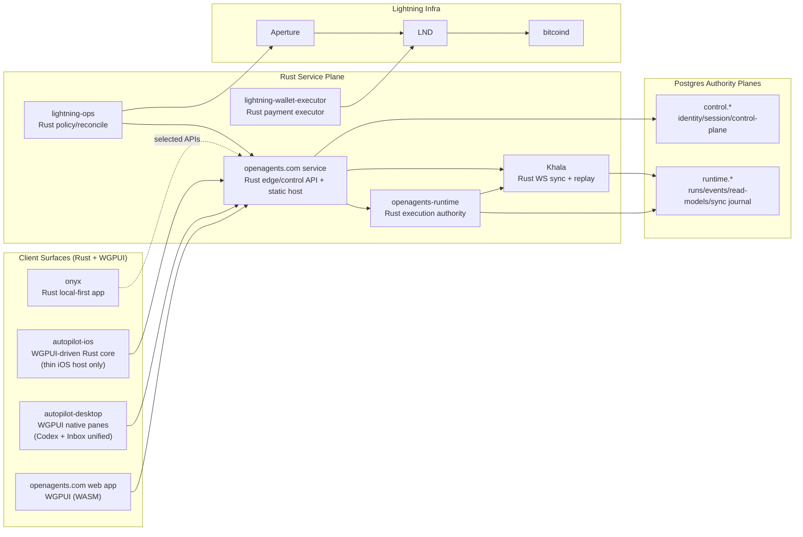

# OpenAgents Rust-Only Endstate Architecture

Status: Target endstate (post-migration)  
Last updated: 2026-02-21  
Applies after: Rust-only migration completion across product surfaces and core services

## Purpose

Define the canonical architecture after OpenAgents completes migration to Rust-only product logic and Rust-only service implementation, with WGPUI as the shared UI runtime.

This document is the target architecture, not a statement of current production state.

## Mandatory Endstate Outcomes

1. `apps/mobile/` is deleted.
2. `apps/desktop/` is deleted.
3. `apps/inbox-autopilot/` is deleted as a standalone app and folded into `apps/autopilot-desktop/`.
4. `apps/openagents.com/` is converted to Rust + WGPUI (no Laravel/React runtime in endstate).
5. Runtime and sync stack are Rust implementations (no Elixir runtime in endstate).
6. Existing ADR set under `docs/adr/` is archived; a new ADR series is authored from scratch for the Rust endstate.

## Architecture Principles (Endstate)

1. Rust is the implementation language for all product logic, authority logic, and sync delivery logic.
2. WGPUI is the shared UI system across web, desktop, and iOS surfaces.
3. `proto/` remains the universal schema authority.
4. Authority boundaries remain explicit:
   - Control-plane authority
   - Execution-plane authority
5. Khala remains projection/replay delivery infrastructure, never an authority write path.
6. WebSocket is the only live sync transport for Khala. No new SSE lanes.

## Endstate Topology

## Endstate Repository Shape

### Surviving app roots

- `apps/openagents.com/`: Rust edge/control-plane service + static WGPUI web host.
- `apps/openagents-runtime/`: Rust runtime execution authority.
- `apps/autopilot-desktop/`: Rust native desktop app with WGPUI pane system; includes former inbox-autopilot capabilities.
- `apps/autopilot-ios/`: iOS app packaging + host shell for Rust/WGPUI runtime.
- `apps/lightning-ops/`: Rust service.
- `apps/lightning-wallet-executor/`: Rust service.
- `apps/onyx/`: Rust local-first app.

### Removed app roots

- `apps/mobile/` (removed).
- `apps/desktop/` (removed).
- `apps/inbox-autopilot/` (folded into `apps/autopilot-desktop/`, then removed).

## Service Boundaries and Ownership

### 1) `apps/openagents.com/` (Rust edge/control plane)

Owns:

- User identity, auth/session, org membership, API policy surfaces.
- Sync token minting and scope derivation.
- Public API gateway behavior.
- Static hosting for WGPUI WASM bundles.

Does not own:

- Execution event authority.
- Runtime projector correctness.

### 2) `apps/openagents-runtime/` (Rust execution plane)

Owns:

- Runs, workers, durable event log, receipts/replay artifacts.
- Execution policy decisions tied to runtime events.
- Projectors/read models derived from runtime authority events.

Does not own:

- User identity/session authority records.

### 3) Khala (Rust, runtime-owned sync subsystem)

Owns:

- Topic watermarks.
- Replay journal.
- Subscription/replay/live fanout semantics.

Does not own:

- Any authority writes for control or runtime domains.

## Data Plane Model (unchanged in concept, Rust in implementation)

Two authority planes remain mandatory:

- `control.*` schema (identity/session/control).
- `runtime.*` schema (execution/sync/read models).

Allowed deployment options:

- One Cloud SQL instance with strict schema ownership and DB role isolation.
- Two separate Postgres instances.

Invariant:

- Cross-plane writes are forbidden.
- Cross-plane interaction happens only through explicit service APIs/contracts.

## UI Runtime Endstate (WGPUI Everywhere)

### Shared UI and state

- Shared UI crates render equivalent surfaces across web/desktop/iOS.
- Shared app state machine crates define route state, view models, and command intent.
- Platform-specific code is limited to bootstrapping, window/surface integration, and OS capability bridges.

### Platform packaging

- Web: `wasm32` build served by `apps/openagents.com/`.
- Desktop: native Rust app (`apps/autopilot-desktop/`).
- iOS: Rust core + WGPUI surface with minimal host bridge for Apple platform integration.

No product/business logic remains in React Native, Electron, SwiftUI view logic, or legacy web stacks.

### `openagents.com` implementation (in-process Rust WGPUI on web)

The web app runs Rust UI logic in-process inside the browser (WASM). The Rust/WGPUI runtime owns rendering state, route state, and command/subscription orchestration exactly like desktop, with only a minimal JavaScript host shim.

Runtime model:

1. Browser loads `index.html`, a tiny JS bootstrap, and a versioned `.wasm` bundle from `apps/openagents.com`.
2. JS bootstrap creates the browser surface (WebGPU/WebGL fallback), then hands control to Rust entrypoint.
3. Rust/WGPUI app shell mounts, restores local persisted state, and executes bootstrap queries.
4. App opens Khala WebSocket subscriptions directly from Rust networking code and applies replay/live frames to shared state stores.

JS boundary rules:

1. JS is host glue only: startup, service worker registration, browser APIs that require JS interop.
2. Product routes, feature logic, command handling, auth/session state, and presentation logic stay in Rust crates.
3. No React/Inertia/SPA framework runtime in endstate.

Proposed crate split for the web surface:

1. `crates/openagents-ui-core`: shared WGPUI components, theme tokens, layout primitives.
2. `crates/openagents-app-state`: shared route graph, view-model reducers, command queue, watermark cache interfaces.
3. `crates/openagents-proto-client`: proto-generated wire clients + domain mapping adapters.
4. `crates/openagents-khala-client`: WS session/reconnect/resume logic, topic subscriptions, replay bootstrap.
5. `apps/openagents.com/web-shell`: wasm entrypoint and browser host adapters.
6. `apps/openagents.com/service`: Rust edge/control API service + static asset host.

Client data flow on web:

1. Command path: WGPUI action -> Rust command bus -> HTTPS API call (edge/runtime) -> authority write -> ack/result.
2. Read path: Rust Khala WS client receives `KhalaFrame` stream -> reducer applies ordered projection updates -> WGPUI rerender.
3. Resume path: local watermark cache + subscription resume -> replay gap fill -> live tail.

Build and release shape:

1. Build wasm bundle from shared Rust app crates (`wasm32-unknown-unknown`).
2. Produce content-hashed JS/WASM assets and static manifest.
3. Rust edge service serves static assets and control APIs from one deployable unit.
4. Runtime/Khala deploy independently; web bundle pins protocol compatibility versions at build time.

SSR and first-paint strategy:

1. Initial endstate can be CSR-first with fast wasm boot and skeleton shell.
2. If needed, add Rust-generated pre-rendered shell HTML for first paint only.
3. Hydration remains Rust-owned; no split brain with a second UI framework.

Migration sequence to reach this state:

1. Stand up Rust edge service alongside current `apps/openagents.com` stack.
2. Ship Rust/WGPUI web shell for a small route slice (for example Codex thread surface).
3. Move route-by-route from Laravel/React pages to Rust/WGPUI modules behind flags.
4. Switch default route handling to Rust shell once core user flows are complete.
5. Remove Laravel/React runtime dependencies after parity and soak validation.

## Inbox Autopilot Consolidation

Endstate inbox architecture:

- Inbox ingestion/classification/draft/policy logic moves into Rust crates used by `apps/autopilot-desktop/`.
- Inbox UI becomes pane modules inside the desktop WGPUI pane system.
- Standalone inbox app and separate app-level UI shell are removed.
- Local mailbox/audit storage remains local-first under desktop ownership.
- Optional cloud/runtime hooks flow through the same Rust API and Khala contracts as other desktop features.

## Command vs Subscription Model

Locked behavior:

1. Commands/mutations go through authenticated HTTP/gRPC APIs on edge/runtime services.
2. Read model updates stream via Khala WebSocket subscriptions.
3. Clients persist per-topic watermarks and resume deterministically.
4. `stale_cursor` forces full bootstrap refresh and watermark reset.

## Protocol and Contract Governance

`proto/` remains canonical for all cross-surface contracts and is the source of truth even in the Rust-only endstate.

Locked policy:

1. All cross-process and client/server contracts are proto-first.
2. Rust code generation from proto is mandatory for app and service consumers.
3. Rust-native types are allowed for internal state machines/render models only, not as wire authority.
4. Any JSON transport payloads must be strict mappings from proto-defined schemas (debug/interop only).
5. No language-local schema authority is allowed.

Required layering:

1. Wire layer: proto-generated Rust types (`proto/openagents/*`).
2. Domain layer: Rust-native structs/enums with invariants and helper behavior.
3. Mapping boundary: explicit `TryFrom`/`From` conversion code between wire and domain.

Prohibited anti-pattern:

- “types-first in Rust” for Khala/runtime/control contracts.

## Auth and Identity Flow (Rust Endstate)

1. Client authenticates with edge control-plane APIs.
2. Edge returns access token and (if needed) refresh token.
3. Client requests sync token from edge with explicit topic scopes.
4. Client connects to Khala WS using sync token.
5. Khala enforces topic ACL and ownership checks before subscription.

## Khala Frame Envelope (Rust Endstate)

Khala keeps proto-first transport frames with an explicit envelope for replay stability:

- `topic`
- `seq`
- `kind`
- `payload_bytes`
- `schema_version`

This envelope is mandatory for deterministic replay, forward/backward compatibility, and cross-target decoder parity (native + wasm + iOS host bridges).

## Lightning and Payment Architecture (Rust Endstate)

- `apps/lightning-ops/` remains control-plane policy/reconcile authority in Rust.
- `apps/lightning-wallet-executor/` remains execution adapter for LND/BOLT11 settlement in Rust.
- Control intent remains in control-plane authority data.
- Settlement execution remains externalized to wallet executor + Lightning infra.
- Khala may stream derived operational summaries; it never becomes settlement authority.

## Deployment and Operations

Primary target remains GCP deployment topology with:

- Rust edge/control service.
- Rust runtime service.
- Rust Khala sync service (or runtime-embedded subsystem).
- Postgres authority planes.
- Existing Lightning infra integration.

Operational requirements:

- Deterministic replay checks and projector drift detection.
- Sync watermark correctness tests.
- Contract compatibility gates from `proto/`.
- End-to-end regression harness for web/desktop/iOS against one runtime contract.

## ADR Reset Policy (Required for Endstate)

Before declaring migration complete:

1. Archive all current ADRs under an explicit archive path (example: `docs/plans/archived/adr-pre-rust-reset/`).
2. Reinitialize `docs/adr/` with a new ADR index and numbering series.
3. Author a new foundational ADR set at minimum:
   - Rust-only architecture and language policy.
   - WGPUI shared UI runtime policy.
   - Dual authority-plane data ownership.
   - Khala WS-only replay protocol.
   - Inbox-autopilot consolidation into autopilot-desktop.
   - Surface removals (`apps/mobile`, `apps/desktop`, standalone `apps/inbox-autopilot`).

## Definition of Done for This Endstate

The architecture is considered fully realized only when:

1. Deprecated app roots are removed.
2. Rust services are authoritative in production for both control and runtime planes.
3. Web/desktop/iOS user-facing product logic is served by shared Rust/WGPUI crates.
4. Khala WS replay is the sole live sync lane.
5. New ADR set is in place and old ADR set is archived.
6. `docs/ARCHITECTURE.md` is replaced or explicitly marked historical in favor of this document.

## Rivet Rust Integration Exploration (for BEAM Replacement)

Rivet is high-signal for the Rust migration when treated as a source of patterns and subsystem ideas, not as OpenAgents' core platform model.

Rivet's core thesis is valuable for BEAM replacement work: long-lived stateful units with realtime delivery, durability, workflows, and hibernation-friendly lifecycle behavior. OpenAgents should selectively harvest these ideas while keeping its own authority boundaries intact.

### What to harvest

1. Guard-style ingress and hibernating websocket lifecycle
   - Sources:
     - `~/code/rivet/engine/packages/guard-core/`
     - `~/code/rivet/docs/engine/GUARD.md`
     - `~/code/rivet/docs/engine/HIBERNATING_WS.md`
   - Use in OpenAgents:
     - stable WS reconnect/resume behavior at edge/Khala boundaries
     - lifecycle handling across deploy/restart/sleep conditions
     - reduced reconnect storms under load

2. Gasoline durable workflow and history discipline
   - Sources:
     - `~/code/rivet/engine/packages/gasoline/`
     - `~/code/rivet/docs/engine/GASOLINE/OVERVIEW.md`
     - `~/code/rivet/docs/engine/GASOLINE/WORKFLOW_HISTORY.md`
     - `~/code/rivet/engine/packages/workflow-worker/src/lib.rs`
   - Use in OpenAgents:
     - durable run orchestration with explicit deterministic boundaries
     - replay-safe workflow history evolution
     - long-lived Codex orchestration compatibility checks

3. UniversalPubSub and UniversalDB abstraction seams
   - Sources:
     - `~/code/rivet/engine/packages/universalpubsub/`
     - `~/code/rivet/engine/packages/universaldb/`
   - Use in OpenAgents:
     - internal runtime fanout behind a driver seam (memory first, later NATS/Redis/Postgres if needed)
     - bounded retry/backoff and transport decoupling without protocol churn

4. WS client reconnect and framing patterns
   - Sources:
     - `~/code/rivet/rivetkit-rust/packages/client/`
     - `~/code/rivet/rivetkit-rust/packages/client/src/connection.rs`
     - `~/code/rivet/rivetkit-rust/packages/client/src/remote_manager.rs`
   - Use in OpenAgents:
     - resilient Khala client reconnect behavior
     - cleaner resume semantics for watermark-driven subscriptions

### What not to adopt wholesale

1. Do not make actor instances the authority model for OpenAgents domain data.
2. Do not import Rivet's full platform surface area as the OpenAgents runtime core.
3. Do not replace OpenAgents contract governance with Rivet-native protocol surfaces.

OpenAgents authority remains Postgres planes (`control.*`, `runtime.*`), with proto-first contracts and Khala as projection/replay transport only.

### First two implementation bets

1. Build a UniversalPubSub-style seam in runtime + Khala fanout, starting with in-memory driver and adding external brokers only when needed.
2. Adopt Gasoline-inspired workflow history discipline and add deterministic replay compatibility tests as release gates for run orchestration changes.

### Guardrails

1. Preserve OpenAgents topic/watermark semantics and `stale_cursor` recovery contracts.
2. Preserve OpenAgents edge auth/scope/ownership enforcement model.
3. Keep adoption incremental behind feature flags and bounded rollout plans.
4. Record each harvested subsystem decision as a Rust-era ADR with rationale and rollback path.

### Licensing and provenance

Rivet is Apache-2.0 licensed (`~/code/rivet/LICENSE`), allowing selective reuse/adaptation with required notice preservation when copying code.
