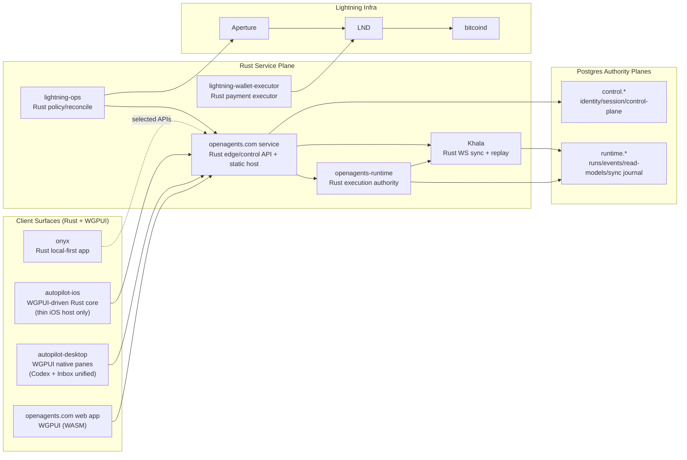

# OpenAgents Rust-Only Endstate Architecture

Status: Target endstate (post-migration)  
Last updated: 2026-02-21  
Applies after: Rust-only migration completion across product surfaces and core services

## Purpose

Define the canonical architecture after OpenAgents completes migration to Rust-only product logic and Rust-only service implementation, with WGPUI as the shared UI runtime.

This document is the target architecture, not a statement of current production state.

## Mandatory Endstate Outcomes

1. `apps/mobile/` is deleted.
2. `apps/desktop/` is deleted.
3. `apps/inbox-autopilot/` is deleted as a standalone app and folded into `apps/autopilot-desktop/`.
4. `apps/openagents.com/` is converted to Rust + WGPUI (no Laravel/React runtime in endstate).
5. Runtime and sync stack are Rust implementations (no Elixir runtime in endstate).
6. Existing ADR set under `docs/adr/` is archived; a new ADR series is authored from scratch for the Rust endstate.

## Architecture Principles (Endstate)

1. Rust is the implementation language for all product logic, authority logic, and sync delivery logic.
2. WGPUI is the shared UI system across web, desktop, and iOS surfaces.
3. `proto/` remains the universal schema authority.
4. Authority boundaries remain explicit:
   - Control-plane authority
   - Execution-plane authority
5. Khala remains projection/replay delivery infrastructure, never an authority write path.
6. WebSocket is the only live sync transport for Khala. No new SSE lanes.

## Endstate Topology

## Endstate Repository Shape

### Surviving app roots

- `apps/openagents.com/`: Rust edge/control-plane service + static WGPUI web host.
- `apps/openagents-runtime/`: Rust runtime execution authority.
- `apps/autopilot-desktop/`: Rust native desktop app with WGPUI pane system; includes former inbox-autopilot capabilities.
- `apps/autopilot-ios/`: iOS app packaging + host shell for Rust/WGPUI runtime.
- `apps/lightning-ops/`: Rust service.
- `apps/lightning-wallet-executor/`: Rust service.
- `apps/onyx/`: Rust local-first app.

### Removed app roots

- `apps/mobile/` (removed).
- `apps/desktop/` (removed).
- `apps/inbox-autopilot/` (folded into `apps/autopilot-desktop/`, then removed).

## Service Boundaries and Ownership

### 1) `apps/openagents.com/` (Rust edge/control plane)

Owns:

- User identity, auth/session, org membership, API policy surfaces.
- Sync token minting and scope derivation.
- Public API gateway behavior.
- Static hosting for WGPUI WASM bundles.

Does not own:

- Execution event authority.
- Runtime projector correctness.

### 2) `apps/openagents-runtime/` (Rust execution plane)

Owns:

- Runs, workers, durable event log, receipts/replay artifacts.
- Execution policy decisions tied to runtime events.
- Projectors/read models derived from runtime authority events.

Does not own:

- User identity/session authority records.

### 3) Khala (Rust, runtime-owned sync subsystem)

Owns:

- Topic watermarks.
- Replay journal.
- Subscription/replay/live fanout semantics.

Does not own:

- Any authority writes for control or runtime domains.

## Data Plane Model (unchanged in concept, Rust in implementation)

Two authority planes remain mandatory:

- `control.*` schema (identity/session/control).
- `runtime.*` schema (execution/sync/read models).

Allowed deployment options:

- One Cloud SQL instance with strict schema ownership and DB role isolation.
- Two separate Postgres instances.

Invariant:

- Cross-plane writes are forbidden.
- Cross-plane interaction happens only through explicit service APIs/contracts.

## UI Runtime Endstate (WGPUI Everywhere)

### Shared UI and state

- Shared UI crates render equivalent surfaces across web/desktop/iOS.
- Shared app state machine crates define route state, view models, and command intent.
- Platform-specific code is limited to bootstrapping, window/surface integration, and OS capability bridges.

### Platform packaging

- Web: `wasm32` build served by `apps/openagents.com/`.
- Desktop: native Rust app (`apps/autopilot-desktop/`).
- iOS: Rust core + WGPUI surface with minimal host bridge for Apple platform integration.

No product/business logic remains in React Native, Electron, SwiftUI view logic, or legacy web stacks.

## Inbox Autopilot Consolidation

Endstate inbox architecture:

- Inbox ingestion/classification/draft/policy logic moves into Rust crates used by `apps/autopilot-desktop/`.
- Inbox UI becomes pane modules inside the desktop WGPUI pane system.
- Standalone inbox app and separate app-level UI shell are removed.
- Local mailbox/audit storage remains local-first under desktop ownership.
- Optional cloud/runtime hooks flow through the same Rust API and Khala contracts as other desktop features.

## Command vs Subscription Model

Locked behavior:

1. Commands/mutations go through authenticated HTTP/gRPC APIs on edge/runtime services.
2. Read model updates stream via Khala WebSocket subscriptions.
3. Clients persist per-topic watermarks and resume deterministically.
4. `stale_cursor` forces full bootstrap refresh and watermark reset.

## Protocol and Contract Governance

- `proto/` remains canonical for all cross-surface contracts.
- Rust code generation is mandatory for all app/service consumers.
- Any JSON transport payloads must be strict mappings from proto-defined schemas.
- No language-local schema authority is allowed.

## Auth and Identity Flow (Rust Endstate)

1. Client authenticates with edge control-plane APIs.
2. Edge returns access token and (if needed) refresh token.
3. Client requests sync token from edge with explicit topic scopes.
4. Client connects to Khala WS using sync token.
5. Khala enforces topic ACL and ownership checks before subscription.

## Lightning and Payment Architecture (Rust Endstate)

- `apps/lightning-ops/` remains control-plane policy/reconcile authority in Rust.
- `apps/lightning-wallet-executor/` remains execution adapter for LND/BOLT11 settlement in Rust.
- Control intent remains in control-plane authority data.
- Settlement execution remains externalized to wallet executor + Lightning infra.
- Khala may stream derived operational summaries; it never becomes settlement authority.

## Deployment and Operations

Primary target remains GCP deployment topology with:

- Rust edge/control service.
- Rust runtime service.
- Rust Khala sync service (or runtime-embedded subsystem).
- Postgres authority planes.
- Existing Lightning infra integration.

Operational requirements:

- Deterministic replay checks and projector drift detection.
- Sync watermark correctness tests.
- Contract compatibility gates from `proto/`.
- End-to-end regression harness for web/desktop/iOS against one runtime contract.

## ADR Reset Policy (Required for Endstate)

Before declaring migration complete:

1. Archive all current ADRs under an explicit archive path (example: `docs/plans/archived/adr-pre-rust-reset/`).
2. Reinitialize `docs/adr/` with a new ADR index and numbering series.
3. Author a new foundational ADR set at minimum:
   - Rust-only architecture and language policy.
   - WGPUI shared UI runtime policy.
   - Dual authority-plane data ownership.
   - Khala WS-only replay protocol.
   - Inbox-autopilot consolidation into autopilot-desktop.
   - Surface removals (`apps/mobile`, `apps/desktop`, standalone `apps/inbox-autopilot`).

## Definition of Done for This Endstate

The architecture is considered fully realized only when:

1. Deprecated app roots are removed.
2. Rust services are authoritative in production for both control and runtime planes.
3. Web/desktop/iOS user-facing product logic is served by shared Rust/WGPUI crates.
4. Khala WS replay is the sole live sync lane.
5. New ADR set is in place and old ADR set is archived.
6. `docs/ARCHITECTURE.md` is replaced or explicitly marked historical in favor of this document.

## Rivet Rust Integration Exploration (for BEAM Replacement)

This section captures specific Rust components in `~/code/rivet` that are relevant to replacing BEAM-era operational behavior with Rust-native systems in OpenAgents.

### What is relevant to harvest

1. Guard-style WS/HTTP edge gateway patterns  
   Source:
   - `~/code/rivet/engine/packages/guard-core/`
   - `~/code/rivet/docs/engine/GUARD.md`
   - `~/code/rivet/docs/engine/HIBERNATING_WS.md`
   
   Why useful for OpenAgents:
   - route resolution + proxy lifecycle + websocket handling patterns for high-concurrency ingress.
   - practical hibernating websocket behavior to reduce idle compute while preserving client sockets.

2. Gasoline durable workflow model  
   Source:
   - `~/code/rivet/engine/packages/gasoline/`
   - `~/code/rivet/docs/engine/GASOLINE/OVERVIEW.md`
   - `~/code/rivet/docs/engine/GASOLINE/WORKFLOW_HISTORY.md`
   - `~/code/rivet/engine/packages/workflow-worker/src/lib.rs`
   
   Why useful for OpenAgents:
   - durable, replay-safe workflow steps (`signal`, `activity`, `sleep`, sub-workflow patterns).
   - versioned workflow history evolution mechanics for long-lived workflows without replay divergence.
   - maps directly to Codex/agent lifecycle orchestration and recovery semantics.

3. Universal PubSub abstraction patterns  
   Source:
   - `~/code/rivet/engine/packages/universalpubsub/`
   - `~/code/rivet/engine/packages/universalpubsub/src/driver/mod.rs`
   - `~/code/rivet/engine/packages/universalpubsub/src/pubsub.rs`
   
   Why useful for OpenAgents:
   - multi-driver pubsub facade (memory/nats/postgres drivers).
   - chunked payload handling, retry/backoff patterns, and local fast-path optimization.
   - strong candidate for internal runtime event fanout without coupling to a single broker.

4. Universal DB abstraction patterns  
   Source:
   - `~/code/rivet/engine/packages/universaldb/`
   - `~/code/rivet/engine/packages/universaldb/src/driver/mod.rs`
   - `~/code/rivet/engine/packages/universaldb/src/database.rs`
   
   Why useful for OpenAgents:
   - transactional driver abstraction and retryable txn model.
   - helps keep runtime storage internals swappable without protocol churn.

5. RivetKit Rust client transport patterns  
   Source:
   - `~/code/rivet/rivetkit-rust/packages/client/`
   - `~/code/rivet/rivetkit-rust/packages/client/src/connection.rs`
   - `~/code/rivet/rivetkit-rust/packages/client/src/remote_manager.rs`
   
   Why useful for OpenAgents:
   - reconnection-oriented websocket client lifecycle.
   - explicit connection token/id reuse and protocol framing.
   - notable alignment with WS-first direction (their SSE path is explicitly not implemented in current gateway flow).

### What should not be lifted wholesale

1. Full actor platform semantics as core OpenAgents domain model.
2. EPaxos/epoxy multi-region KV stack by default (`~/code/rivet/engine/packages/epoxy/`), unless specific multi-region consistency needs justify complexity.
3. Rivet protocol surface as-is; OpenAgents remains proto-first under `proto/` and keeps Khala/runtime contracts authoritative.

### Proposed integration posture

OpenAgents should harvest implementation patterns, not adopt Rivet architecture wholesale:

1. Use Guard-core-inspired ingress/websocket lifecycle techniques in the Rust edge + Khala gateway.
2. Use Gasoline-inspired durable workflow/history strategies for runtime orchestration and recovery.
3. Use UniversalPubSub-inspired abstractions for internal event fanout.
4. Keep OpenAgents authority boundaries and contract model unchanged (`control.*` vs `runtime.*`, proto authority, Khala projection-only).

### Implementation guardrails for harvesting

1. Preserve OpenAgents topic/watermark model for Khala; no replacement with actor IDs as authority keys.
2. Preserve OpenAgents auth/token/ownership policy semantics at edge and subscription layers.
3. Keep dependency and operational footprint bounded; adopt subsystems incrementally behind feature gates.
4. Record each adopted pattern as a new Rust-era ADR with explicit rationale and rollback plan.

### Licensing and provenance

Rivet repository is Apache-2.0 licensed (as documented in `~/code/rivet/README.md`), which is compatible with pattern-level reuse and selective code adaptation, subject to preserving required notices when copying implementation code.
