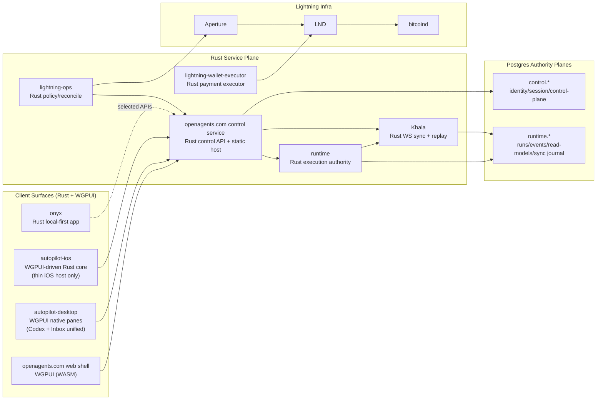

# OpenAgents Rust-Only Endstate Architecture

Status: Target endstate (post-migration)  
Last updated: 2026-02-21  
Applies after: Rust-only migration completion across product surfaces and core services

## Purpose

Define the canonical architecture after OpenAgents completes migration to Rust-only product logic and Rust-only service implementation, with WGPUI as the shared UI runtime.

This document is the target architecture, not a statement of current production state.

Implementation sequencing and issue backlog live in `docs/ARCHITECTURE-RUST-ROADMAP.md`.

## Mandatory Endstate Outcomes

1. `apps/mobile/` is deleted.
2. `apps/desktop/` is deleted.
3. `apps/inbox-autopilot/` is deleted as a standalone app and folded into `apps/autopilot-desktop/`.
4. `apps/openagents.com/` is converted to Rust + WGPUI (no Laravel/React runtime in endstate).
5. Runtime and sync stack are Rust implementations (no Elixir runtime in endstate).
6. Existing ADR set under `docs/adr/` is archived; a new ADR series is authored from scratch for the Rust endstate.

## Architecture Principles (Endstate)

1. Rust is the implementation language for all product logic, authority logic, and sync delivery logic.
2. WGPUI is the shared UI system across web, desktop, and iOS surfaces.
3. `proto/` remains the universal schema authority.
4. Authority boundaries remain explicit:
   - Control-plane authority
   - Execution-plane authority
5. Khala remains projection/replay delivery infrastructure, never an authority write path.
6. WebSocket is the only live sync transport for Khala. No new SSE lanes.

## Endstate Topology

## Endstate Repository Shape

### Surviving app roots

- `apps/openagents.com/`: Rust control service + static WGPUI web shell host.
- `apps/runtime/`: Rust runtime execution authority.
- `apps/autopilot-desktop/`: Rust native desktop app with WGPUI pane system; includes former inbox-autopilot capabilities.
- `apps/autopilot-ios/`: iOS app packaging + host shell for Rust/WGPUI runtime.
- `apps/lightning-ops/`: Rust service.
- `apps/lightning-wallet-executor/`: Rust service.
- `apps/onyx/`: Rust local-first app.

### Removed app roots

- `apps/mobile/` (removed).
- `apps/desktop/` (removed).
- `apps/inbox-autopilot/` (folded into `apps/autopilot-desktop/`, then removed).

## Service Boundaries and Ownership

### 1) `apps/openagents.com/` (Rust control service)

Owns:

- WorkOS is the canonical identity/authentication provider.
- OpenAgents control-plane is authoritative for authorization, sessions, device management, org membership, and revocation, derived from WorkOS identity.
- Sync token minting and scope derivation.
- Public control API gateway behavior.
- Static hosting for WGPUI WASM bundles.

Does not own:

- Execution event authority.
- Runtime projector correctness.

### 2) `apps/runtime/` (Rust execution plane)

Owns:

- Runs, workers, durable event log, receipts/replay artifacts.
- Execution policy decisions tied to runtime events.
- Projectors/read models derived from runtime authority events.

Does not own:

- User identity/session authority records.

### 3) Khala (Rust sync service, runtime-owned contracts)

Owns:

- Topic watermarks.
- Replay journal.
- Subscription/replay/live fanout semantics.
- Delivery enforcement for per-topic monotonic stream behavior after replay bootstrap.

Does not own:

- Any authority writes for control or runtime domains.

Ordering contract:

- `seq` allocation is performed transactionally in runtime Postgres and is the single ordering oracle.

## Data Plane Model (unchanged in concept, Rust in implementation)

Two authority planes remain mandatory:

- `control.*` schema (identity/session/control).
- `runtime.*` schema (execution/sync/read models).

Allowed deployment options:

- One Cloud SQL instance with strict schema ownership and DB role isolation.
- Two separate Postgres instances.

Invariant:

- Cross-plane writes are forbidden.
- Cross-plane interaction happens only through explicit service APIs/contracts.

## UI Runtime Endstate (WGPUI Everywhere)

### Shared UI and state

- Shared UI crates render equivalent surfaces across web/desktop/iOS.
- Shared app state machine crates define route state, view models, and command intent.
- Platform-specific code is limited to bootstrapping, window/surface integration, and OS capability bridges.

### Platform packaging

- Web: `wasm32` build served by `apps/openagents.com/`.
- Desktop: native Rust app (`apps/autopilot-desktop/`).
- iOS: Rust core + WGPUI surface with minimal host bridge for Apple platform integration.

No product/business logic remains in React Native, Electron, SwiftUI view logic, or legacy web stacks.

### `openagents.com` implementation (in-process Rust WGPUI on web)

The web shell runs Rust UI logic in-process inside the browser (WASM). The Rust/WGPUI runtime owns rendering state, route state, and command/subscription orchestration exactly like desktop, with only a minimal JavaScript host shim.

Runtime model:

1. Browser loads `index.html`, a tiny JS bootstrap, and a versioned `.wasm` bundle from `apps/openagents.com`.
2. JS bootstrap creates the browser surface (WebGPU/WebGL fallback), then hands control to Rust entrypoint.
3. Rust/WGPUI app shell mounts, restores local persisted state, and executes bootstrap queries.
4. App opens Khala WebSocket subscriptions directly from Rust networking code and applies replay/live frames to shared state stores.

JS boundary rules:

1. JS is host glue only: startup, service worker registration, browser APIs that require JS interop.
2. Product routes, feature logic, command handling, auth/session state, and presentation logic stay in Rust crates.
3. No React/Inertia/SPA framework runtime in endstate.

Proposed crate split for the web surface:

1. `crates/openagents-ui-core`: shared WGPUI components, theme tokens, layout primitives.
2. `crates/openagents-app-state`: shared route graph, view-model reducers, command queue, watermark cache interfaces.
3. `crates/openagents-proto-client`: proto-generated wire clients + domain mapping adapters.
4. `crates/openagents-khala-client`: WS session/reconnect/resume logic, topic subscriptions, replay bootstrap.
5. `apps/openagents.com/web-shell`: wasm entrypoint and browser host adapters.
6. `apps/openagents.com/service`: Rust control API service + static asset host.

Client data flow on web:

1. Command path: WGPUI action -> Rust command bus -> HTTPS API call (control service/runtime service) -> authority write -> ack/result.
2. Read path: Rust Khala WS client receives `KhalaFrame` stream -> reducer applies ordered projection updates -> WGPUI rerender.
3. Resume path: local watermark cache + subscription resume -> replay gap fill -> live tail.

Build and release shape:

1. Build wasm bundle from shared Rust app crates (`wasm32-unknown-unknown`).
2. Produce content-hashed JS/WASM assets and static manifest.
3. Rust control service serves static assets and control APIs from one deployable unit.
4. Runtime/Khala deploy independently; web bundle pins protocol compatibility versions at build time.

SSR and first-paint strategy:

1. Initial endstate can be CSR-first with fast wasm boot and skeleton shell.
2. If needed, add Rust-generated pre-rendered shell HTML for first paint only.
3. Hydration remains Rust-owned; no split brain with a second UI framework.

## Inbox Autopilot Consolidation

Endstate inbox architecture:

- Inbox ingestion/classification/draft/policy logic moves into Rust crates used by `apps/autopilot-desktop/`.
- Inbox UI becomes pane modules inside the desktop WGPUI pane system.
- Standalone inbox app and separate app-level UI shell are removed.
- Local mailbox/audit storage remains local-first under desktop ownership.
- Optional cloud/runtime hooks flow through the same Rust API and Khala contracts as other desktop features.

## Command vs Subscription Model

Locked behavior:

1. Commands/mutations go through authenticated HTTP APIs (protobuf or strict JSON mapping). gRPC is permitted for internal service-to-service only.
2. Read model updates stream via Khala WebSocket subscriptions.
3. Clients persist per-topic watermarks and resume deterministically.
4. `stale_cursor` forces full bootstrap refresh and watermark reset.

## Topic Taxonomy and Scope Grammar

1. Topic names follow deterministic prefixes (for example `user:{user_id}:runs`, `org:{org_id}:workers`, `run:{run_id}:events`).
2. Sync scope claims are derived from validated topic prefix grammar, not arbitrary free-form strings.
3. Auth decisions are evaluated against user/org/device ownership and topic prefix policy before subscription is accepted.

## Protocol and Contract Governance

`proto/` remains canonical for all cross-surface contracts and is the source of truth even in the Rust-only endstate.

Locked policy:

1. All cross-process and client/server contracts are proto-first.
2. Rust code generation from proto is mandatory for app and service consumers.
3. Rust-native types are allowed for internal state machines/render models only, not as wire authority.
4. Any JSON transport payloads must be strict mappings from proto-defined schemas (debug/interop only).
5. No language-local schema authority is allowed.

Required layering:

1. Wire layer: proto-generated Rust types (`proto/openagents/*`).
2. Domain layer: Rust-native structs/enums with invariants and helper behavior.
3. Mapping boundary: explicit `TryFrom`/`From` conversion code between wire and domain.

Prohibited anti-pattern:

- “types-first in Rust” for Khala/runtime/control contracts.

## Auth and Identity Flow (Rust Endstate)

1. Client authenticates through WorkOS-driven control-plane auth at control service APIs.
2. Control service validates WorkOS identity/session claims and maps them to OpenAgents control-plane authorization state.
3. Control service returns OpenAgents access token and rotating refresh token bound to a stable `device_id`.
4. Refresh token rotation is mandatory; old refresh token IDs become revoked as soon as a new token is issued.
5. Client requests sync token from control service with explicit topic scopes and device/session context.
6. Client connects to Khala WS using sync token; Khala enforces topic ACL and ownership checks before subscription.
7. If session/device access is revoked, Khala actively evicts live sockets and returns `reauth_required` semantics on reconnect.

## Session and Device Model (Required)

1. Every client installation has a stable `device_id` used for session scoping, sync token issuance, and watermark namespace partitioning.
2. Session controls include per-device revoke and global revoke ("log out other devices") behavior.
3. Revocation propagates from control plane to Khala fast enough to terminate unauthorized live subscriptions.
4. Watermark caches are namespaced by user/org/device so cross-device cursor bleed cannot occur.

## Khala Frame Envelope (Rust Endstate)

Khala keeps proto-first transport frames with an explicit envelope for replay stability:

- `topic`
- `seq`
- `kind`
- `payload_bytes`
- `schema_version`

This envelope is mandatory for deterministic replay, forward/backward compatibility, and cross-target decoder parity (native + wasm + iOS host bridges).

## Khala Delivery Contract

1. Delivery is at-least-once; clients must apply events idempotently by `(topic, seq)`.
2. After replay bootstrap completes, delivery is monotonic per topic for an active subscription.
3. Sequence gaps are permitted during bootstrap/reconnect handling only; steady-state live delivery must be gap-free per topic.
4. `stale_cursor` requires snapshot/replay bootstrap and local watermark reset before resuming live tail.

## Operational Requirements

### Compatibility and Version Policy

1. `schema_version` is enforced as a negotiated compatibility contract between client and server, not a passive metadata field.
2. Control service and Khala enforce minimum supported client versions for safety-critical protocol changes.
3. Compatibility windows are explicit and time-bounded; out-of-window clients receive deterministic upgrade-required responses.
4. Replay window semantics and cursor behavior changes must ship with compatibility gates and migration handling.

### Khala Retention, Compaction, and Delivery Semantics

1. Per-topic ordering is authoritative by `seq`, with runtime Postgres as the ordering oracle across multi-node Khala deployment.
2. Retention windows are explicit per topic/QoS tier, with replay budget limits and operator-visible cost controls.
3. Long-lived topics require periodic snapshot/compaction so replay remains bounded and affordable.
4. `stale_cursor` is raised by deterministic policy (expired retention, compaction boundary, or invalid cursor lineage), not ad hoc failure.
5. Slow-consumer policy is explicit: bounded per-connection buffers, fairness across topics, and forced resync/disconnect behavior when limits are exceeded.

### Web WASM Persistence and Update Policy

1. Web state/watermarks persist in IndexedDB with schema-versioned migrations.
2. Bundle updates require asset pinning and service worker rollout rules to avoid JS/WASM/protocol skew.
3. Each client bundle advertises `client_build_id`; server endpoints publish `min_build_id` and compatible protocol range.
4. Client includes build metadata in API/WS handshake; out-of-window build IDs receive explicit upgrade-required responses.
5. Offline mode behavior is explicit per route (read-only cached state vs online-required hard fail).
6. Rollback behavior must include persisted-state migration safety for downgraded bundles.

### WS Security and Audit Policy

1. Sync tokens include short TTLs and anti-replay controls (`jti`, nonce discipline, revocation checks).
2. Browser WS connections enforce allowed origin policy and reject invalid cross-origin handshake attempts.
3. Subscription attempts (allow/deny) and WS auth failures are auditable events in control/runtime observability lanes.
4. Topic join authorization is enforced continuously for session validity, not only at first connection.

### Observability and SLO Baseline

1. Khala golden signals: active connections, reconnect rate, join rate, replay lag, replay duration, stale-cursor rate.
2. Delivery health metrics: outbound queue depth, dropped frames, slow-consumer disconnects, per-topic throughput.
3. Correctness metrics: projector drift hashes and replay verification outcomes.
4. Client telemetry schema captures reconnect reasons, auth failures, and crash/boot timing without violating privacy policy.

## Lightning and Payment Architecture (Rust Endstate)

- `apps/lightning-ops/` remains control-plane policy/reconcile authority in Rust.
- `apps/lightning-wallet-executor/` remains execution adapter for LND/BOLT11 settlement in Rust.
- Control intent remains in control-plane authority data.
- Settlement execution remains externalized to wallet executor + Lightning infra.
- Khala may stream derived operational summaries; it never becomes settlement authority.
- Wallet executor is never an identity authority; it acts only on explicit, auditable control-plane instructions and returns signed receipts.
- Wallet executor identity/authentication, key custody, secret rotation, and payment receipt canonicalization are explicit ADR-governed requirements.

## Onyx Integration Contract (Required)

1. Onyx consumes only explicitly allowed control/runtime APIs documented as public integration surfaces.
2. Onyx identity binding (shared user/org vs delegated identity) is explicitly defined and enforced by control-plane policy.
3. Offline behavior and sync expectations for Onyx are documented separately from core Codex client guarantees.

## Deployment and Operations

Primary target remains GCP deployment topology with:

- Rust control service.
- Rust runtime service.
- Rust Khala sync service as a separately deployable production service (embedding is allowed for local/dev only).
- Postgres authority planes.
- Existing Lightning infra integration.

Buildout sequencing, migration gates, ADR reset tasks, and definition-of-done tracking are maintained in `docs/ARCHITECTURE-RUST-ROADMAP.md`.

## Rivet Rust Integration Exploration (for BEAM Replacement)

Rivet is high-signal for the Rust migration when treated as a source of patterns and subsystem ideas, not as OpenAgents' core platform model.

Rivet's core thesis is valuable for BEAM replacement work: long-lived stateful units with realtime delivery, durability, workflows, and hibernation-friendly lifecycle behavior. OpenAgents should selectively harvest these ideas while keeping its own authority boundaries intact.

### What to harvest

1. Guard-style ingress and hibernating websocket lifecycle
   - Sources:
     - `~/code/rivet/engine/packages/guard-core/`
     - `~/code/rivet/docs/engine/GUARD.md`
     - `~/code/rivet/docs/engine/HIBERNATING_WS.md`
   - Use in OpenAgents:
     - stable WS reconnect/resume behavior at control-service/Khala boundaries
     - lifecycle handling across deploy/restart/sleep conditions
     - reduced reconnect storms under load

2. Gasoline durable workflow and history discipline
   - Sources:
     - `~/code/rivet/engine/packages/gasoline/`
     - `~/code/rivet/docs/engine/GASOLINE/OVERVIEW.md`
     - `~/code/rivet/docs/engine/GASOLINE/WORKFLOW_HISTORY.md`
     - `~/code/rivet/engine/packages/workflow-worker/src/lib.rs`
   - Use in OpenAgents:
     - durable run orchestration with explicit deterministic boundaries
     - replay-safe workflow history evolution
     - long-lived Codex orchestration compatibility checks

3. UniversalPubSub and UniversalDB abstraction seams
   - Sources:
     - `~/code/rivet/engine/packages/universalpubsub/`
     - `~/code/rivet/engine/packages/universaldb/`
   - Use in OpenAgents:
     - internal runtime fanout behind a driver seam (memory first, later NATS/Redis/Postgres if needed)
     - bounded retry/backoff and transport decoupling without protocol churn

4. WS client reconnect and framing patterns
   - Sources:
     - `~/code/rivet/rivetkit-rust/packages/client/`
     - `~/code/rivet/rivetkit-rust/packages/client/src/connection.rs`
     - `~/code/rivet/rivetkit-rust/packages/client/src/remote_manager.rs`
   - Use in OpenAgents:
     - resilient Khala client reconnect behavior
     - cleaner resume semantics for watermark-driven subscriptions

### What not to adopt wholesale

1. Do not make actor instances the authority model for OpenAgents domain data.
2. Do not import Rivet's full platform surface area as the OpenAgents runtime core.
3. Do not replace OpenAgents contract governance with Rivet-native protocol surfaces.

OpenAgents authority remains Postgres planes (`control.*`, `runtime.*`), with proto-first contracts and Khala as projection/replay transport only.

### Guardrails

1. Preserve OpenAgents topic/watermark semantics and `stale_cursor` recovery contracts.
2. Preserve OpenAgents control-service auth/scope/ownership enforcement model.
3. Keep adoption incremental behind feature flags and bounded rollout plans.
4. Record each harvested subsystem decision as a Rust-era ADR with rationale and rollback path.

### Licensing and provenance

Rivet is Apache-2.0 licensed (`~/code/rivet/LICENSE`), allowing selective reuse/adaptation with required notice preservation when copying code.
