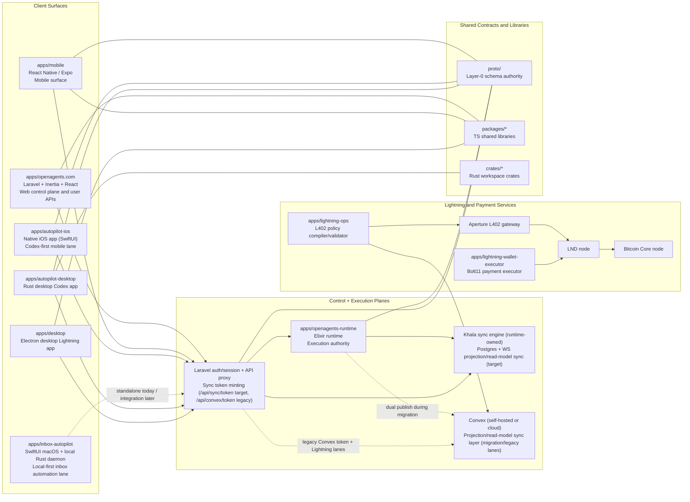

# OpenAgents Architecture Overview

This document gives a single architecture view of the full OpenAgents system across web, runtime, desktop, mobile, Lightning infrastructure, shared packages, Rust crates, and protocol contracts.

Use this as an orientation layer; canonical invariants remain in ADRs and contracts.

- Coverage includes all application surfaces called out in `README.md`: `apps/openagents.com/`, `apps/mobile/`, `apps/autopilot-ios/`, `apps/inbox-autopilot/`, `apps/desktop/`, `apps/lightning-ops/`, `apps/lightning-wallet-executor/`, and `apps/openagents-runtime/` (plus current repo-active `apps/autopilot-desktop/`).

- ADR index: `docs/adr/INDEX.md`
- Runtime API contract: `apps/openagents-runtime/docs/RUNTIME_CONTRACT.md`
- Proto authority: `proto/README.md`

## System Topology

## Application Surfaces

### Core product apps

| App | Path | Primary role | Key stack | Delivery status (current) |
|---|---|---|---|---|
| OpenAgents web app | `apps/openagents.com/` | User-facing control plane, auth/session authority, API gateway/proxy, sync token minting (`/api/sync/token` target; Convex token bridge during migration) | Laravel 12, Inertia, React, TypeScript | Alpha/live |
| OpenAgents runtime | `apps/openagents-runtime/` | Execution authority for runs/events, policy/spend, Codex worker lifecycle, replay semantics | Elixir, Phoenix, Postgres | Active runtime plane |
| Mobile app | `apps/mobile/` | Mobile user/admin surface over the same runtime and projection contracts | React Native, Expo | Prerelease |
| iOS app | `apps/autopilot-ios/` | Native iOS Autopilot surface, codex-first worker admin/stream lane | SwiftUI, Xcode | Prerelease |
| Inbox Autopilot app | `apps/inbox-autopilot/` | Local-first inbox automation app with SwiftUI macOS shell + Rust daemon (Gmail sync/classify/draft/audit) | SwiftUI, Rust | Prerelease/adjacent lane |
| Rust desktop Codex app | `apps/autopilot-desktop/` | Desktop Codex UX and local execution loops synchronized with runtime contracts | Rust workspace crates | Prerelease/integration in progress |
| Electron desktop Lightning app | `apps/desktop/` | Desktop shell for Lightning/payment workflows and local execution boundaries | Electron, TS/JS packages | Prerelease |

### Service apps from `README.md`

| App | Path | Primary role | Key stack | Delivery status (current) |
|---|---|---|---|---|
| Lightning ops compiler | `apps/lightning-ops/` | Compiles L402 route/policy intent into deterministic Aperture gateway config | Effect/TypeScript | Active service |
| Lightning wallet executor | `apps/lightning-wallet-executor/` | Executes agent-controlled Bolt11 payments under policy/limit constraints | HTTP service + Spark/LN integration | Active service |

## Platform Domains (Product-Level)

`README.md` describes OpenAgents as a platform made of runtime, reputation, and marketplace primitives. Current code mapping:

1. Runtime domain: implemented primarily in `apps/openagents-runtime/` with control-plane/API mediation in `apps/openagents.com/`.
2. Reputation domain: implemented as durable execution artifacts/receipts/traces and replay evidence (`docs/execution/`, runtime events, observability artifacts), not as a standalone app.
3. Marketplace domain: represented in roadmap and protocol surfaces; delivered incrementally via signatures/tools/protocol contracts rather than a single isolated app today.

### External infrastructure operated by OpenAgents

| Component | Role |
|---|---|
| `bitcoind` | Bitcoin Core full node backing Lightning infrastructure |
| `lnd` | Lightning node used by gateway/payment flows |
| Aperture | L402 gateway enforcing paid-route policy |
| Khala | Runtime-owned Postgres + WS projection/read-model sync engine (target lane) |
| Convex | Reactive projection/read-model layer for migration and non-migrated lanes |

## Authority Boundaries (Critical)

These are non-negotiable system boundaries.

1. Runtime + Postgres are the source of truth for run events, Codex worker lifecycle, policy/spend, and replay artifacts.
2. Khala is projection/delivery only (runtime-owned subsystem in `apps/openagents-runtime` for v1).
3. Convex remains projection-only where still enabled during migration; it is never authority.
4. Runtime is the single writer to projection documents (Khala and Convex during dual-publish windows).
5. Laravel remains auth/session authority and mints short-lived sync tokens (`/api/sync/token` target; `/api/convex/token` during migration).
6. Proto definitions under `proto/` are the shared Layer-0 schema authority.

Primary references:
- `docs/adr/ADR-0029-convex-sync-layer-and-codex-agent-mode.md`
- `docs/adr/ADR-0028-layer0-proto-canonical-schema.md`
- `apps/openagents-runtime/docs/CONVEX_SYNC.md`
- `docs/sync/thoughts.md`
- `docs/sync/ROADMAP.md`

## Database Topology (Clarified)

This section clarifies the practical meaning of "single authority database" in this architecture.

### Current state (2026-02-20)

1. Runtime authority lane:
   - Runtime authority data (runs/workers/events/projections) is Postgres-backed.
   - In current Cloud Run wiring, `openagents-runtime` and `openagents-web` both connect to Cloud SQL instance `l402-aperture-db`, with runtime currently using database `openagents_web`.
2. Convex lane:
   - Self-hosted Convex non-prod uses a separate Cloud SQL instance (`oa-convex-nonprod-pg`, database `convex_nonprod`).
3. Lightning lane:
   - Aperture uses Postgres in `l402-aperture-db` (database `aperture`).
4. Non-authority stores still in use:
   - Redis for Laravel cache/queue/session.
   - Local SQLite stores in desktop/mobile/local daemons where applicable.
   - Service-local storage for specific components (for example wallet executor internals).

### Target state (Khala fully implemented)

1. Runtime-owned Postgres is the single authority data plane for runtime/Codex state (and Lightning control-plane state after second-wave migration).
2. Khala delivers derived read-model updates from that authority plane to clients over WS.
3. Clients continue to do initial HTTP hydration + incremental Khala updates.
4. Convex is removed from migrated lanes and eventually decommissioned by lane.

### Important qualifier

"Single database" in this architecture means a single authority data plane for agent/runtime domain correctness. It does **not** mean every subsystem in OpenAgents must share one physical database or drop caches/local stores.

## End-to-End Data and Control Flows

### Flow A: Codex worker lifecycle (web/mobile/iOS/desktop)

1. Client calls Laravel APIs (`/api/runtime/codex/workers*`).
2. Laravel validates user session and forwards signed internal requests to runtime (`/internal/v1/codex/workers*`).
3. Runtime executes lifecycle operations, records durable events in Postgres, applies policy/spend controls, and emits stream/replay-safe artifacts.
4. Runtime projector writes derived summaries to Khala (and optionally Convex during dual-publish migration windows).
5. Clients consume:
   - authoritative control/status via Laravel<->runtime path
   - low-latency projection badges/summaries via Khala WS subscriptions (`sync:v1`) with replay resume + heartbeat timeout semantics (or Convex until each surface migrates).

### Flow A1: iOS Codex handshake lane (current)

1. iOS signs in with email code via `POST /api/auth/email` and `POST /api/auth/verify`.
2. iOS uses bearer token APIs:
   - `GET /api/runtime/codex/workers`
   - `POST /api/runtime/codex/workers`
   - `GET /api/runtime/codex/workers/{workerId}`
   - `POST /api/runtime/codex/workers/{workerId}/events`
   - `GET /api/runtime/codex/workers/{workerId}/stream` (`Accept: text/event-stream`)
3. Laravel proxies stream and control requests to runtime using signed internal headers.
4. Runtime SSE stream emits worker events; iOS advances cursor from `id:` values.
5. Desktop ack events are produced only when a desktop worker is actually connected/running.

### Flow B: L402 policy and Lightning payment path

1. Route/policy intent is currently maintained in Convex for the L402 plane (migrating to runtime/Postgres authority in the Khala second wave).
2. `apps/lightning-ops/` compiles/validates deterministic Aperture config from that intent.
3. Aperture enforces incoming paid routes via `lnd`.
4. For outbound paid calls, `apps/lightning-wallet-executor/` pays Bolt11 invoices via Lightning wallet integrations and policy limits.
5. Node infrastructure is anchored by `lnd` + `bitcoind`.

## Shared Contract and Library Layers

### `proto/` (Layer-0 universal schema)

- Canonical shared protocol contracts (`codex_workers`, `codex_events`, `codex_auth`, receipts, events, reasons, comms).
- Additive evolution policy with Buf breaking checks.
- Code generation verification lives in `scripts/verify-proto-generate.sh`.

### `packages/` (shared TS libraries)

- Shared orchestration/UI/runtime helper libraries used by web/mobile/desktop/service apps.
- Includes Effect-oriented libraries and Lightning-related shared modules.

### `crates/` (shared Rust workspace)

- Shared Rust crates used by the Rust desktop Codex app and supporting runtime/client integrations.
- Consolidates desktop runtime abstractions, protocol clients, and UI integration crates.

## Deployment Shape (Current Direction)

1. `apps/openagents.com` deploys as the web control plane (Cloud Run-centric operations).
2. `apps/openagents-runtime` is the execution plane with Postgres durability and stream/replay contracts.
3. Khala v1 ships inside `apps/openagents-runtime` and shares Postgres for transactional projection+delivery correctness.
4. Convex remains non-authoritative projection infrastructure only for migration and non-migrated lanes.
5. Lightning services (`lightning-ops`, `lightning-wallet-executor`, Aperture, LND, bitcoind) run as a dedicated payment subsystem.
6. Desktop/mobile/iOS clients consume the same runtime/proto contracts as web.

### Production wiring snapshot (2026-02-20)

1. `openagents-web` (Cloud Run) proxies Codex worker APIs to `openagents-runtime` via `OA_RUNTIME_ELIXIR_BASE_URL`.
2. Shared runtime signing secret is enforced on both sides (`OA_RUNTIME_SIGNING_KEY` in web, `RUNTIME_SIGNATURE_SECRET` in runtime).
3. Runtime stream endpoints are routed through an auth-only internal pipeline so SSE requests with `Accept: text/event-stream` are accepted.
4. Convex token bridge (`/api/convex/token`) remains active for migration; `/api/sync/token` is available for Khala clients.

### Current Cloud SQL guardrails

1. Database instance is currently small (`db-f1-micro`), so connection pressure must be constrained.
2. Runtime Cloud Run service is constrained to low DB fan-out (`POOL_SIZE=2`, `max-instances=1`).
3. Web Cloud Run service is constrained to reduce burst DB pressure (`max-instances=1`, lower concurrency).
4. If these constraints are raised, DB tier and connection budget must be scaled first.

## Operational and Verification Expectations

1. Architecture changes should be captured in ADRs before or with implementation.
2. Runtime correctness cannot be moved into Laravel controllers/models.
3. Projection drift must be recoverable by runtime replay/reprojection.
4. Claims of completion require relevant build/test harness evidence per surface.

## Related Docs

- Repository map: `docs/PROJECT_OVERVIEW.md`
- Documentation index: `docs/README.md`
- Runtime contract: `apps/openagents-runtime/docs/RUNTIME_CONTRACT.md`
- Runtime ops: `apps/openagents-runtime/docs/OPERATIONS.md`
- Khala sync spec: `docs/sync/thoughts.md`
- Khala roadmap: `docs/sync/ROADMAP.md`
- Convex sync plan: `docs/plans/active/convex-self-hosting-runtime-sync-plan.md`
- Convex roadmap: `docs/plans/active/convex-runtime-codex-master-roadmap.md`
- Codex unified plan: `docs/codex/unified-runtime-desktop-plan.md`
