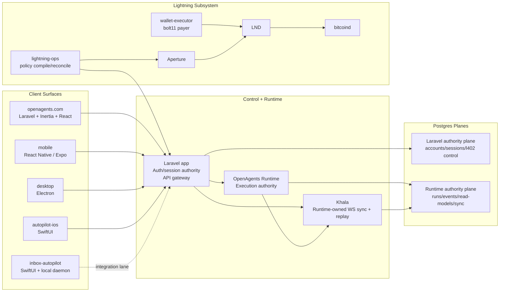

# OpenAgents Architecture

This document defines the current architecture with **Khala** as the runtime-owned sync and replay plane.

## Scope

Covered surfaces:

- `apps/openagents.com/`
- `apps/openagents-runtime/`
- `apps/mobile/`
- `apps/desktop/`
- `apps/autopilot-ios/`
- `apps/inbox-autopilot/`
- `apps/lightning-ops/`
- `apps/lightning-wallet-executor/`
- shared contracts under `proto/` and shared packages

Core references:

- `docs/adr/INDEX.md`
- `docs/sync/thoughts.md`
- `docs/sync/ROADMAP.md`
- `docs/sync/SURFACES.md`
- `apps/openagents-runtime/docs/RUNTIME_CONTRACT.md`
- `apps/openagents-runtime/docs/KHALA_SYNC.md`
- `proto/README.md`

## Topology

## Non-Negotiable Boundaries

1. Runtime + runtime Postgres are authority for execution-domain state.
2. Laravel + Laravel Postgres are authority for identity/session/control-plane state.
3. Khala is projection delivery infrastructure, never an authority write path.
4. Client apps do not write authority data through Khala.
5. Shared schema contracts are proto-first under `proto/`.
6. Proto remains schema source-of-truth even through Rust migration; Rust wire types must be generated from proto, with Rust-native domain types layered above.

## Laravel Postgres vs Runtime Postgres

The architecture is based on ownership boundaries, not instance count.

### Laravel authority plane

Owner:

- `apps/openagents.com` controllers/services/migrations.

Authority includes:

- users, sessions, profiles, tokens,
- web control-plane state,
- Lightning control-plane intent/state (`l402_control_plane_*`),
- admin/API operational records.

### Runtime authority plane

Owner:

- `apps/openagents-runtime` services/projectors/migrations.

Authority includes:

- run/worker/event durability,
- replay receipts/artifacts,
- runtime read models,
- Khala tables (`runtime.sync_*`), including watermarks and replay journal.

### Deployment relationship

Supported deployment patterns:

- one Cloud SQL instance with separate logical DB/schema ownership,
- separate Cloud SQL instances for Laravel and runtime.

In either pattern:

- cross-plane writes are not allowed,
- cross-plane reads/actions happen only through explicit APIs,
- ownership remains with the app that owns migrations for that plane.

## Khala (Runtime-Owned Sync Plane)

Khala v1 ships inside `apps/openagents-runtime` and shares runtime Postgres for transactional correctness.

Khala responsibilities:

- authenticated WebSocket subscriptions,
- per-topic durable watermarks,
- replay-on-resume and stale-cursor handling,
- bounded catch-up and live fanout for runtime read models.

Khala storage model:

- `runtime.sync_stream_events`: ordered replay journal by topic/watermark,
- `runtime.sync_topic_sequences`: DB-native per-topic watermark allocation,
- `runtime.sync_*_summaries`: runtime-owned read-model payload tables.

Khala protocol model:

- proto-first contracts under `proto/openagents/sync/v1/`,
- WS-only live transport (no new SSE lane for Khala),
- client-side watermark persistence and idempotent doc-version apply.
- explicit versioned envelope semantics for replay-safe evolution (topic/seq/kind/payload/schema version fields).

## App Consumption Matrix

| App | Khala usage | Bootstrap + auth | Authority writes |
|---|---|---|---|
| `apps/openagents.com` | feature-gated Khala WS for Codex summaries | WorkOS web auth/session + runtime/Laravel HTTP + `POST /api/sync/token` | Laravel APIs + runtime APIs |
| `apps/mobile` | feature-gated Khala WS for worker summaries | WorkOS email-code (`/api/auth/email` -> `/api/auth/verify`, `X-Client: openagents-expo`) + runtime HTTP + `POST /api/sync/token` | Laravel/runtime APIs |
| `apps/desktop` | feature-gated Khala WS for status summaries | WorkOS email-code (`/api/auth/email` -> `/api/auth/verify`, `X-Client: openagents-desktop`) + Laravel/runtime HTTP + sync token | Laravel/runtime APIs |
| `apps/autopilot-desktop` | runtime SSE codex worker stream + runtime sync write lane | WorkOS email-code auth (`POST /api/auth/email`, `POST /api/auth/verify`) + Laravel runtime worker APIs | Laravel/runtime APIs |
| `apps/autopilot-ios` | runtime SSE remains primary lane | WorkOS email-code (`/api/auth/email` -> `/api/auth/verify`, `X-Client: autopilot-ios`) + Laravel/runtime HTTP + SSE | Laravel/runtime APIs |
| `apps/inbox-autopilot` | local-first primary, Khala not primary | local daemon + selected APIs | local daemon + selected APIs |
| `apps/lightning-ops` | no Khala dependency for control-plane lane | internal Laravel control-plane APIs | Laravel internal control-plane APIs |
| `apps/lightning-wallet-executor` | no Khala dependency | service-local config + Lightning infra | service-local + Lightning infra |
| `apps/openagents-runtime` | produces and serves Khala stream/read models | runtime Postgres direct | runtime Postgres direct |

Auth invariant for runtime stream-capable clients:

- client login uses WorkOS email-code flow via Laravel (`/api/auth/email` -> `/api/auth/verify`),
- verify response includes bearer token for recognized runtime-stream clients (iOS/mobile/desktop),
- client auth state is considered valid for runtime/sync lanes only when bearer token is present,
- worker stream visibility is scoped by authenticated user ownership in runtime/Laravel proxy boundaries.

## Canonical Data Flows

### Runtime/Codex sync flow

1. Client calls Laravel/runtime HTTP API for baseline state.
2. Runtime commits authority event to runtime Postgres.
3. Runtime projector updates read model and appends Khala stream journal event with topic watermark.
4. Client subscribes via Khala WS and resumes from its persisted watermark.
5. Khala replays missed events then streams live updates.

### Lightning control-plane flow

1. Operator actions hit Laravel control-plane APIs.
2. Laravel persists control-plane state in Laravel Postgres.
3. `lightning-ops` reads intent via internal API and compiles/reconciles gateway state.
4. Gateway/payment infrastructure executes policy and settlement lifecycle.

## Contracts and Observability

- Protocol/schema authority: `proto/`.
- Runtime contract: `apps/openagents-runtime/docs/RUNTIME_CONTRACT.md`.
- Sync architecture and rollout docs: `docs/sync/*`.
- Runtime operations and telemetry docs: `apps/openagents-runtime/docs/*`.
- Lightning operations runbooks: `docs/lightning/runbooks/*`.

## Change Control

Architecture-affecting changes must update:

1. `docs/ARCHITECTURE.md`,
2. relevant ADRs in `docs/adr/`,
3. sync docs under `docs/sync/` when Khala behavior/surfaces change.
