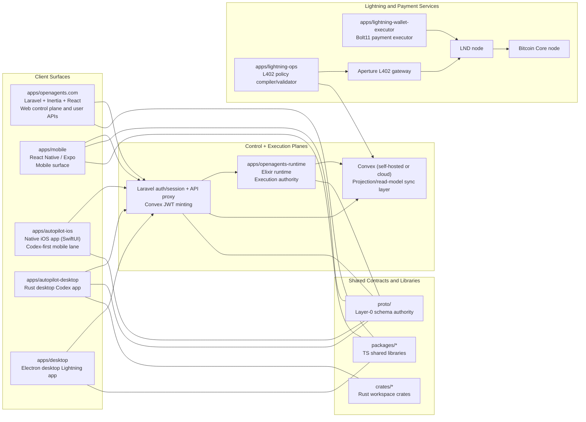

# OpenAgents Architecture Overview

This document gives a single architecture view of the full OpenAgents system across web, runtime, desktop, mobile, Lightning infrastructure, shared packages, Rust crates, and protocol contracts.

Use this as an orientation layer; canonical invariants remain in ADRs and contracts.

- Coverage includes all application surfaces called out in `README.md`: `apps/openagents.com/`, `apps/mobile/`, `apps/autopilot-ios/`, `apps/desktop/`, `apps/lightning-ops/`, `apps/lightning-wallet-executor/`, and `apps/openagents-runtime/` (plus current repo-active `apps/autopilot-desktop/`).

- ADR index: `docs/adr/INDEX.md`
- Runtime API contract: `apps/openagents-runtime/docs/RUNTIME_CONTRACT.md`
- Proto authority: `proto/README.md`

## System Topology

## Application Surfaces

### Core product apps

| App | Path | Primary role | Key stack | Delivery status (current) |
|---|---|---|---|---|
| OpenAgents web app | `apps/openagents.com/` | User-facing control plane, auth/session authority, API gateway/proxy, Convex JWT minting | Laravel 12, Inertia, React, TypeScript | Alpha/live |
| OpenAgents runtime | `apps/openagents-runtime/` | Execution authority for runs/events, policy/spend, Codex worker lifecycle, replay semantics | Elixir, Phoenix, Postgres | Active runtime plane |
| Mobile app | `apps/mobile/` | Mobile user/admin surface over the same runtime and projection contracts | React Native, Expo | Prerelease |
| iOS app | `apps/autopilot-ios/` | Native iOS Autopilot surface, codex-first worker admin/stream lane | SwiftUI, Xcode | Prerelease |
| Rust desktop Codex app | `apps/autopilot-desktop/` | Desktop Codex UX and local execution loops synchronized with runtime contracts | Rust workspace crates | Prerelease/integration in progress |
| Electron desktop Lightning app | `apps/desktop/` | Desktop shell for Lightning/payment workflows and local execution boundaries | Electron, TS/JS packages | Prerelease |

### Service apps from `README.md`

| App | Path | Primary role | Key stack | Delivery status (current) |
|---|---|---|---|---|
| Lightning ops compiler | `apps/lightning-ops/` | Compiles L402 route/policy intent into deterministic Aperture gateway config | Effect/TypeScript | Active service |
| Lightning wallet executor | `apps/lightning-wallet-executor/` | Executes agent-controlled Bolt11 payments under policy/limit constraints | HTTP service + Spark/LN integration | Active service |

## Platform Domains (Product-Level)

`README.md` describes OpenAgents as a platform made of runtime, reputation, and marketplace primitives. Current code mapping:

1. Runtime domain: implemented primarily in `apps/openagents-runtime/` with control-plane/API mediation in `apps/openagents.com/`.
2. Reputation domain: implemented as durable execution artifacts/receipts/traces and replay evidence (`docs/execution/`, runtime events, observability artifacts), not as a standalone app.
3. Marketplace domain: represented in roadmap and protocol surfaces; delivered incrementally via signatures/tools/protocol contracts rather than a single isolated app today.

### External infrastructure operated by OpenAgents

| Component | Role |
|---|---|
| `bitcoind` | Bitcoin Core full node backing Lightning infrastructure |
| `lnd` | Lightning node used by gateway/payment flows |
| Aperture | L402 gateway enforcing paid-route policy |
| Convex | Reactive projection/read-model layer for low-latency client sync |

## Authority Boundaries (Critical)

These are non-negotiable system boundaries.

1. Runtime + Postgres are the source of truth for run events, Codex worker lifecycle, policy/spend, and replay artifacts.
2. Convex is projection-only for client sync/read models.
3. Runtime is the single writer to Convex projection documents.
4. Laravel remains auth/session authority and mints short-lived Convex client JWTs.
5. Proto definitions under `proto/` are the shared Layer-0 schema authority.

Primary references:
- `docs/adr/ADR-0029-convex-sync-layer-and-codex-agent-mode.md`
- `docs/adr/ADR-0028-layer0-proto-canonical-schema.md`
- `apps/openagents-runtime/docs/CONVEX_SYNC.md`

## End-to-End Data and Control Flows

### Flow A: Codex worker lifecycle (web/mobile/iOS/desktop)

1. Client calls Laravel APIs (`/api/runtime/codex/workers*`).
2. Laravel validates user session and forwards signed internal requests to runtime (`/internal/v1/codex/workers*`).
3. Runtime executes lifecycle operations, records durable events in Postgres, applies policy/spend controls, and emits stream/replay-safe artifacts.
4. Runtime projector writes derived summaries to Convex.
5. Clients consume:
   - authoritative control/status via Laravel<->runtime path
   - low-latency projection badges/summaries via Convex subscriptions.

### Flow B: L402 policy and Lightning payment path

1. Route/policy intent is maintained in Convex for the L402 plane.
2. `apps/lightning-ops/` compiles/validates deterministic Aperture config from that intent.
3. Aperture enforces incoming paid routes via `lnd`.
4. For outbound paid calls, `apps/lightning-wallet-executor/` pays Bolt11 invoices via Lightning wallet integrations and policy limits.
5. Node infrastructure is anchored by `lnd` + `bitcoind`.

## Shared Contract and Library Layers

### `proto/` (Layer-0 universal schema)

- Canonical shared protocol contracts (`codex_workers`, `codex_events`, `codex_auth`, receipts, events, reasons, comms).
- Additive evolution policy with Buf breaking checks.
- Code generation verification lives in `scripts/verify-proto-generate.sh`.

### `packages/` (shared TS libraries)

- Shared orchestration/UI/runtime helper libraries used by web/mobile/desktop/service apps.
- Includes Effect-oriented libraries and Lightning-related shared modules.

### `crates/` (shared Rust workspace)

- Shared Rust crates used by the Rust desktop Codex app and supporting runtime/client integrations.
- Consolidates desktop runtime abstractions, protocol clients, and UI integration crates.

## Deployment Shape (Current Direction)

1. `apps/openagents.com` deploys as the web control plane (Cloud Run-centric operations).
2. `apps/openagents-runtime` is the execution plane with Postgres durability and stream/replay contracts.
3. Convex is run self-hosted and/or cloud by environment, but always as non-authoritative projection infrastructure.
4. Lightning services (`lightning-ops`, `lightning-wallet-executor`, Aperture, LND, bitcoind) run as a dedicated payment subsystem.
5. Desktop/mobile/iOS clients consume the same runtime/proto contracts as web.

## Operational and Verification Expectations

1. Architecture changes should be captured in ADRs before or with implementation.
2. Runtime correctness cannot be moved into Laravel controllers/models.
3. Projection drift must be recoverable by runtime replay/reprojection.
4. Claims of completion require relevant build/test harness evidence per surface.

## Related Docs

- Repository map: `docs/PROJECT_OVERVIEW.md`
- Documentation index: `docs/README.md`
- Runtime contract: `apps/openagents-runtime/docs/RUNTIME_CONTRACT.md`
- Runtime ops: `apps/openagents-runtime/docs/OPERATIONS.md`
- Convex sync plan: `docs/plans/active/convex-self-hosting-runtime-sync-plan.md`
- Convex roadmap: `docs/plans/active/convex-runtime-codex-master-roadmap.md`
- Codex unified plan: `docs/codex/unified-runtime-desktop-plan.md`
