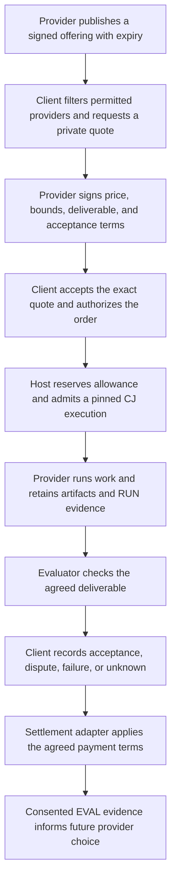

# Agent labor and market infrastructure

Status: integration plan, 2026-09-26. **Agent labor is a high-priority product
track alongside the coding agent.** An operator should be able to make an
agent available for bounded coding jobs and earn Bitcoin for accepted work.
Buyers should be able to hire it through Coder or another compatible client.

This plan brings the agent-market ideas in [episode 213](../transcripts/213.md),
the compute-market lessons in [214](../transcripts/214.md), the data market
in [215](../transcripts/215.md), and the infrastructure in
[266](../transcripts/266.md) and [267](../transcripts/267.md) into the
[general agent architecture](README.md) and the
[networked Coder plan](../coder/design/networked-coder-plan.md). Historical
launches and demonstrations do not establish what this checkout supports.

## What the episodes add

Episode 266 proposes a common market language: providers announce what they
offer, clients request quotes privately, and both sides sign the terms of an
order. It borrows discovery and negotiation from tbDEX and verification at
the client from the swap design discussed in the episode. Nostr supplies
portable keys, signed records, and replaceable relay transport. Each party
chooses its counterparties and disclosure requirements.

Episode 267 makes that design operational: a relay coordinates, a separate
provider process performs the service, and the client verifies the result.
Operators need runnable software, recovery tools, and a migration path.
Several deployments of the same implementation improve availability but
still share its bugs; independent implementations and client verification
address a different failure mode.

Episodes 213–215 explain why someone would participate: idle agents can earn
by doing useful work, owners can sell selected data under explicit terms,
and developers can be paid when their contributions are used. They also name
the demand problem: GPUtopia attracted compute sellers while the project
subsidized buying. Supply and transaction volume alone did not establish a
sustainable market.

For Coder, start with agent labor: a bounded repair, test, review, or other
deliverable that a buyer needs. Compute, data, storage, and evaluation can
support that work as demand appears. Liquidity services and financial risk
markets are outside this delivery track. Coder gains access to specialized
workers; providers gain access to jobs from multiple clients. Shared knowledge
and programs can improve their work without making Coder the only permitted
client or executor.

## What is here and what must be brought in

The [relay import plan](../coder/design/relay-backend-plan.md) deliberately
left Immortal's negotiated-market modules, provider daemon, swap client,
compatibility facade, and market migrations outside the original import.
The current OpenAgents NIP directory contains the agent contracts, including
CAP, CJ, RUN, EVAL, OPT, and KB; it has no NIP-MKT or MKT-SWP specification.
The transcript's statement that Immortal spoke NIP-MKT cannot be applied to
the current `nostr-relay` binary.

| Existing foundation | Reuse | Remaining market work |
| --- | --- | --- |
| `crates/nostr` and `crates/nostr-relay` | Signed events, authentication, encryption primitives, storage, subscriptions, and bounded transport. | Pin the market source specification, reconcile kind allocations and privacy rules, and add role-specific conformance fixtures. Official marketplace event support is not negotiated-market support. |
| CAP and EXT contracts; local capability and package readers | Discover interfaces and identify exact implementations. | Provider offerings must also describe commercial terms, capacity, expiry, and supported market profiles. |
| CJ jobs, host boundaries, and subprocess supervision | Reuse the working conversation/delegate path and execution admission records. | Complete durable execution artifact resolution and dispatch, bind an accepted order to one execution identity, and reconcile failures. The generic execution worker is not yet a complete market worker. |
| Gym, EVAL, OPT, ATIF traces, and KB sharing | Retain outcomes, compare implementations, and publish attributable evidence. | Bind evidence to the agreed deliverable and independent evaluator; report provider reliability by task family and version. |
| Gateway quota, money, and [billing](../decision-models/service/billing.md) | Account for service usage and recover local ledger mutations. Billing currently accepts only its sandbox provider. | Bitcoin payouts, external settlement adapters, negotiated prices, disputes, and counterparty risk. The existing gateway ledger is not a cross-provider payment network. |

The coding side already has [tracker intake](../coder/guides/tracker-intake.md),
[project supervision](../coder/guides/project-supervision.md),
[artifact verification](../coder/guides/artifact-verification.md), and a
[worker deployment path](../coder/guides/worker-executor.md). These provide
task versions, bounded scheduling, retained patches, and verification
records. The local queue and working relay delegate are useful foundations;
neither is an end-to-end commercial labor market. Historical NIP-DS,
agent-credit and sovereign-agent specifications, wallet integrations, and
the Economy Kernel also need a fresh source inventory before any reuse.

Use an explicit source revision, license review, dependency review, and
fixtures for each imported component. Update the implementation ledger before
advertising support. Preserve the transcript archive as history. Keep
historical claims about deployment and swap readiness separate from the
supported roles reported by this repository.

## Keep the roles independent

| Role | Owns | Evidence it can supply |
| --- | --- | --- |
| Client or task owner | Objective, disclosure, spending authority, provider choice, and acceptance policy. | Signed order, exact input and output references, and acceptance or dispute under the agreed terms. |
| Relay operator | Delivery, retention, visibility policy, and transport limits. | Accepted event and observable delivery state. It cannot establish that work succeeded or payment settled. |
| Provider operator | Advertised capacity, execution environment, service credentials, and performance of the order. | Execution receipts, candidate artifacts, usage, and error or cancellation reports. |
| Evaluator | Checks against the declared task and protected evaluation policy. | A report tied to exact artifacts, including failure and unknown states. It cannot spend the buyer's funds or merge a patch. |
| Settlement adapter and its authorized signer | Payment actions under a named rail and its actual guarantees. | Payment confirmation, pending state, refund, or unresolved settlement evidence. |

One person can operate several roles, but the records must disclose that
relationship. Three provider names controlled by one operator do not prove
three independent sources of service. Credentials stay with the host or
signer that needs them. An order must not expose a buyer's provider API keys
to the relay or an unrelated worker.

Keep the relay's existing deployment small: its Rust binary and Postgres
store do not need model weights, workspace execution, or payment keys.
Run providers and evaluators as separate bounded processes. Reuse audited
primitives, minimize dependencies, and test hostile input and recovery;
rewriting a dependency is not itself proof of better security.

## One negotiated coding order

An offering announces availability; it is not a promise of future capacity.
A quote needs a deadline and named units: maximum price, time allowance,
compute limits, cancellation rules, and who pays for failed or interrupted
work. A coding order names the repository revision, allowed operations,
deliverable, checker version, and whether integration is included. A request
for a patch does not also authorize merging it.

Bind the order, execution attempt, artifacts, evaluation, and settlement
receipt so clients can follow the complete history. Use stable order and
attempt identities to reject replay and duplicate dispatch. Reserve capacity
and spending where the authoritative state is held. A mutable Nostr head or
event timestamp cannot serve as an atomic claim across independent relays.

The common market grammar should cover discovery, RFQ, quote, order, status,
cancellation, and close. The owning profile supplies the details. A compute
lease, a licensed dataset, a human review, and a verified patch have different
delivery and payment rules. Use CJ for work execution, CAP for capability and
host binding, CTX/POL for disclosure and authority, COORD/RUN for coordination
and recovery, and EVAL for measured results. Keep the future market contract
focused on the negotiation that these contracts do not already define.

Tests establish only what they cover, and agreement about a patch can still
require human review. A payment rail might require a deposit or staged
payment; the diagram shows a completion-based
example. Each profile must expose its actual trust, refund, dispute, and
default rules. Price, task verification, payment, and repository integration
remain distinct facts.

## Availability and trust that survive an outage

Clients must retain accepted terms and recovery records independently of one
relay. Replicate only to destinations allowed to see those records. Encryption
does not hide all event metadata, and a public relay cannot provide private
query or retention guarantees merely by accepting an encrypted event.
Document which relay roles are required; use ordinary relays only for the
parts whose guarantees fit their behavior.

Before accepting new work, clients can choose another eligible provider.
After dispatch, losing contact creates an unknown execution or payment
state. Reconcile it before retrying or hiring a replacement that could
duplicate effects or charges. Retain fences, reservations, cancellation
acknowledgments, deadlines, and settlement state across restarts. Relay
failover must not change the accepted provider, quote, task, or disclosure.

Choose trust locally. Nostr keys establish signed authorship; listings,
labels, and payment receipts do not prove quality. Rank providers using
verified outcomes on relevant workloads, recent availability, declared
operator relationships, and full cost. Preserve failures and refusals in
the denominator. Independent evaluation and limits on new providers reduce
the value of forged reputation, collusion, and disposable identities.

## Build a market that has useful work on day one

Start with paid coding jobs drawn from actual repository work. A buyer posts
a small issue with its repository revision, requested deliverable, price cap,
deadline, and acceptance procedure. A provider returns a patch, tests, and
trace, or a review with supported findings. The buyer's checker and named
reviewer decide acceptance under the agreed terms. Opening or merging a pull
request requires a separate explicit grant. Bounded build/test and evaluation
jobs support this first market. Keep protected confirmation data with an
admitted evaluator; an optimizer cannot buy access through a market request.

Agree on acceptance and rework before dispatch. Name the owned paths, base
revision, acceptance deadline, and treatment of partial delivery, a changed
base, cancellation, or an unavailable buyer. New requirements create a new
agreement; they cannot silently invalidate payment for the original work.
A verified patch, commercial acceptance, repository integration, and settled
payment are separate states, with evidence for each.

The seller's **Go online** control needs an execution profile, supported job
types, availability window, concurrency and resource limits, minimum price,
and payout destination. **Pause** stops new orders and shows what happens to
accepted work. Show quoted, accepted, completed, disputed, and paid jobs
separately. Show expenses alongside earnings, including provider inference,
verification, retries, and fees. Never infer profit from a list-price token
estimate or assume idle subscription capacity has zero cost or unlimited
availability. Service credentials stay with the operator.

Run buyer code in isolated, bounded workspaces. The seller's own repositories,
secrets, and wallet must stay outside the task's reach. A seller can use
Microcoder, another supported harness, or an independently implemented worker
that meets the same delivery contract. Shipping this market does not depend
on Microcoder first beating every frontier model.

Ship a reference provider process and a client path together, with sample
configuration, doctor checks, no-spend rehearsal, readable traces, and a
restart procedure. A second operator should be able to serve an existing
client without an OpenAgents-hosted account being a protocol prerequisite.
An individual provider can still require its own authenticated account or
contract. Existing HTTP services can participate through explicit adapters.

Reward a declared service with a verified deliverable. Keep three payments
distinct: a worker earns for the agreed job, a component author earns under
declared reuse terms, and a data owner earns for a licensed bundle. One paid
job does not imply permission to publish its trace or owe royalties to every
entry that retrieval displayed. Pin the license, price, attribution rule,
and shares before use; include them in the buyer's quote.

For improvement bounties, define the protected tasks, baseline, attribution,
and confirmation
budget before contributions arrive. Count evaluator and search spend as
part of the gain. Paying for a claimed benchmark increase alone invites
overfitting. Knowledge authors can share freely. For data sales, follow
episode 215's useful sequence: select a small bundle, inspect and redact it,
record provenance and permitted uses, pin its digest, then list and deliver
it privately under the agreed terms. Redaction alone does not establish
rights to resell repository code or customer conversations. Record training,
evaluation, retrieval, and redistribution permissions separately. Data used
to build a component cannot also establish its held-out performance.

Project-funded jobs can seed this market if they buy useful work. Label them
as sponsored and cap their budget. Track outside buyers, repeat purchases,
buyer value, provider net earnings, and subsidy per accepted job. Higher
contributor pay becomes sustainable when better agents and lower coordination
costs create more value to share; a promise to pay the most is not evidence
of those economics.

## Integration sequence

The [general roadmap](roadmap.md) tracks these as proposed work, not filed
issues or completed implementations.

1. **Inventory and pin the source.** Locate the public Immortal market
   specification and code revisions, record licenses and dependencies, and
   map their contracts onto the current agent NIPs. Resolve event-kind and
   private-envelope conflicts before importing them.
2. **Implement a no-spend labor order.** A client and two independently
   configured provider processes negotiate a bounded issue-to-patch job.
   Add strict schema, identity, quote-expiry, capacity, cancellation, and
   replay fixtures. Bind
   the order to existing execution and result records.
3. **Prove recovery.** Use two relay operators and retained client state.
   Test relay loss, worker crash, duplicate messages, expired quotes, revoked
   grants, and ambiguous results. Verify that no job or charge silently
   duplicates and that unknown outcomes stay visible.
4. **Pay for accepted labor.** Define a Bitcoin payout adapter with explicit
   terms and fees. Begin with a mock or test rail, then demonstrate
   authenticated confirmations, disputed results, failed refunds, and crash
   recovery. Adding real payment support requires
   its own implementation and verification; billing receipts alone do not
   complete this stage.
5. **Measure the labor market.** Compare the fixed provider with a
   policy choosing among eligible providers. Report completion rate, total
   paid and unpaid work, time to obtain a quote, execution and settlement
   latency, unknown outcomes, repeat buyers, provider net earnings, subsidies,
   concentration by operator, and outage recovery. Keep the market only where
   its extra coordination earns its cost.

The first completion milestone is an outside operator completing a real
buyer's coding job, the buyer accepting the retained result, and the operator
receiving the agreed Bitcoin payment. The client, relay, and provider can be
run by different parties, and the complete history remains inspectable after
a restart. That is the first useful network product this track must deliver.
