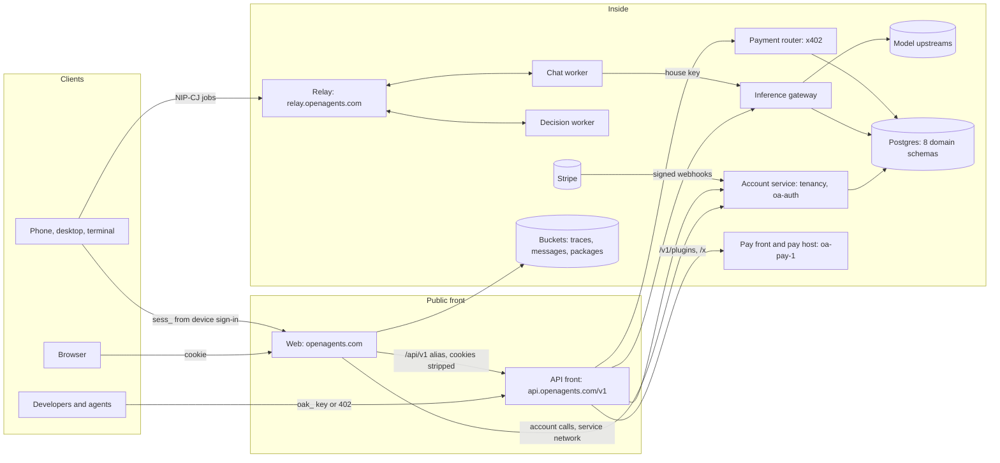

# The OpenAgents API: one design, public and internal

2026-10-09. Owner request: "how this all maps to our API — what our API
should be, public and internal." This page is the target shape of every
HTTP, WebSocket, and relay surface we serve, which of them are for outside
developers and agents, which are for our own apps, and which must stay
inside. It maps every route that exists today onto that shape, names the
inconsistencies, and gives a short migration plan.

It builds on, and does not replace:

- [The OpenAgents API (2026-10-02)](2026-10-02-openagents-api.md): the owner's
  decisions D1 to D16 (plain HTTP, `api.openagents.com`, x402, user-set
  limits, error and pagination conventions).
- [The inference gateway spec](../inference/gateway.md): Open Responses and
  Chat Completions, routing, metering, the rate card.
- [Agent payments](../payments/agent-payments.md): one `402` with every live
  payment method, one receipt.
- [The data schema](../data/schema.md): the eight domains (identity,
  workspace, chat, work, registry, money, telemetry, audit), `workspace_id`
  on every row, payloads in buckets, sealed secrets, append-only money and
  audit. The domain tables below name its tables.
- [Authentication](../auth/README.md), [GitHub sign-in](../auth/github.md),
  [account storage](../deployment/account-storage.md), the
  [chat worker](../deployment/chat-worker.md), and the
  [Kitchen Sink ledger](../kitchen-sink/ledger.md) (sections A, E, H, I, K).

Words follow the [glossary](../glossary.md): account, workspace, membership,
bearer key (`oak_`), account session (`sess_`), tenant, plugin, trace,
thread, run, computer.

## Contents

1. [Summary](#1-summary)
2. [Principles](#2-principles)
3. [Services and boundaries](#3-services-and-boundaries)
4. [The surface, by domain](#4-the-surface-by-domain)
5. [Website pages](#5-website-pages)
6. [Inconsistencies and fixes](#6-inconsistencies-and-fixes)
7. [Public at launch, later, and never](#7-public-at-launch-later-and-never)
8. [Migration plan](#8-migration-plan)

## 1. Summary

- **One API, one address.** `https://api.openagents.com/v1`, with
  `https://openagents.com/api/v1` as an alias. Resource-oriented JSON over
  HTTPS, Open Responses for model calls, OpenAPI 3.1 as the contract.
- **Three audiences.** Every endpoint is exactly one of:

  | Audience | Who calls it | Promise |
  | --- | --- | --- |
  | **PUBLIC** | Outside developers, partner apps, other agents | Documented, in the public OpenAPI, stable within `v1`, deprecated only with notice (section 2.9) |
  | **FIRST-PARTY** | Our own web, mobile, desktop, and terminal clients | Documented in an internal OpenAPI; may change with a client release, kept working for the two newest client releases |
  | **INTERNAL** | Service to service: web to account service, worker to relay, Stripe to us, operators | Never documented publicly, never reachable from the public front, authenticated by a service credential or the private network |

- **Counts in section 4** (one row per endpoint or tight endpoint group):
  71 PUBLIC, 29 FIRST-PARTY, 19 INTERNAL, plus 9 groups of website pages in
  section 5. Of the 71 public rows, 5 are live, 23 ship with Monday's
  launch (a few only through the website at first), 21 are built but not
  offered, and 22 are planned.
- **Top inconsistencies** (section 6): the public front forwards every
  gateway route, admin and internal ones included; two error shapes and
  three list shapes; OpenAPI covers only the inference routes; our apps'
  own APIs sit outside `/v1` on the website host; `/coder/*` is missing
  from the website's owned-route list; `oak_` scopes exist but no one can
  set them; and the workspace is chosen three different ways.

## 2. Principles

### 2.1 One base URL

| Rule | Detail |
| --- | --- |
| Address | `https://api.openagents.com/v1` (decision D6). It points at the API front, never at the website, so site cookies never ride along. |
| Alias | `https://openagents.com/api/v1/...` is forwarded to the same front as `/v1/...` with cookies removed (built: `api_proxy` in `crates/openagents-web/src/lib.rs`). One service either way. |
| Local | A computer's own host (`coder-host`) may serve the same paths on `http://127.0.0.1:<port>/v1` (API doc section 2). Same JSON. |
| Website routes | Pages, forms, and HTML fragments on `openagents.com` are not API. They are the web client and may change any time (section 5). |
| Relay | `wss://relay.openagents.com` is an open Nostr relay: a protocol surface, specified by our [NIPs](../../nips/openagents/README.md), not part of the HTTP API. |

### 2.2 Resources and Open Responses

- Plural nouns from the glossary, lowercase, kebab-case when a noun is two
  words: `/v1/threads`, `/v1/provider-keys`. Ids are opaque, typed
  prefixes: `acct_`, `ws_`, `key_`, `th_`, `msg_`, `run_`, `tr_`, `pl_`,
  `resp_`, `pr_`.
- `GET` reads, `POST` creates or acts (`/stop`, `/share`), `PATCH` edits,
  `PUT` replaces a whole settable thing (limits, a provider key), `DELETE`
  removes.
- Model calls are [Open Responses](https://www.openresponses.org/) at
  `/v1/responses` (primary) and Chat Completions at `/v1/chat/completions`
  (backup), exactly as the [gateway spec](../inference/gateway.md) says. The
  OpenAgents agent itself is one more model id there (`openagents`) until
  `/v1/messages` (offers, runs, threads) lands.
- Money is integers in the smallest unit with the unit in the name
  (`amount_sats`, `usd_micros`); rate cards add decimal dollar strings.
  Times are RFC 3339.

### 2.3 OpenAPI 3.1 is the contract

- `GET /v1/openapi.json` describes **every PUBLIC endpoint** and nothing else.
  A test fails when a mounted PUBLIC route has no entry, or an entry has no
  mounted route (today this holds for inference routes only:
  `crates/gateway/tests/inference_api.rs`).
- FIRST-PARTY endpoints go in a second document, `openapi.first-party.json`,
  committed in the repository and not served publicly; clients are tested
  against it.
- Payment methods appear in OpenAPI only while their adapter is live
  (`x-payment-info`, built in #11136/#11137).
- Each route declares its audience once, in the route table, and the front,
  the OpenAPI generator, and the coverage test all read that one declaration.

### 2.4 Versioning and deprecation

- `/v1` in the path. Within `v1`, only additive changes (the list in the API
  doc section 3.1). Every response carries `openagents-version` (a date).
- A breaking change waits for a new dated version, announced in the API
  changelog beside `llms.txt`.
- **Deprecating a PUBLIC endpoint:** announce in the changelog, then answer
  with `Deprecation: @<unix time>`, `Sunset: <HTTP date>`, and
  `Link: <successor>; rel="successor-version"` (RFC 9745, RFC 8594) for at
  least 90 days before removal.
- **Deprecating a FIRST-PARTY endpoint:** the old path stays as an alias until
  request logs show the two newest released clients no longer call it.
- **Renames** are always an alias first: the old path and the new path run
  the same handler.

### 2.5 Requests and responses

| Topic | Rule |
| --- | --- |
| Idempotency | `Idempotency-Key` on any `POST` that creates or spends. A repeat within 24 hours returns the first answer; the same key with a different body is `409 idempotency_conflict` (built on the decision routes, card funding, and relay jobs). |
| Pagination | Cursor only: `?limit=` (default 20, max 100) and `?after=<cursor>`; the answer is `{"data": [...], "next": "<cursor>" or null}`. An expired cursor is `410 cursor_expired`. No page numbers in new endpoints. |
| Errors | One shape everywhere: `{"error": {"type", "code", "message", "param", "request_id"}}` with standard statuses. `type` is the class (`invalid_request`, `authentication`, `permission`, `payment_required`, `limit_reached`, `not_found`, `conflict`, `rate_limited`, `server_error`, `unavailable`); `code` is the specific reason (`thread_not_found`, `scope_missing`). The full table is section 3.2 of the API doc plus the inference additions (`insufficient_balance`, `upstream_failed`, `no_route`). Mid-stream failures arrive as the stream's own failure event (`response.failed`). |
| Request ids | Every response carries `x-request-id`; a client may send `X-Client-Request-Id`. |
| Streaming | Server-sent events when `Accept: text/event-stream` or `"stream": true`. Open Responses streams follow the spec's event order. |
| Headers we add | `x-request-id`, `openagents-version`, and on model calls `x-openagents-model`, `x-openagents-upstream`, `x-openagents-cost-usd`; on paid calls `x-openagents-receipt`. |

### 2.6 Authentication

| Credential | Form | Who uses it | Where it is checked |
| --- | --- | --- | --- |
| API key | `Authorization: Bearer oak_<id>.<secret>`, with scopes (2.7) | Developers, agents, partner apps, our CLI's `inference` command | Account service (`tenancy::keys`; stored as SHA-256 only) |
| Account session | `Authorization: Bearer sess_<hex>`; on the website, the `oa_cloud_session` cookie (never sent to the API host) | Our apps after sign-in | Account service (`tenancy::sessions`) |
| Device sign-in | RFC 8628 device code; ends in an app session (`sess_`) | Terminal, desktop, phone (`coder login`) | Account service, approved on the website |
| GitHub sign-in | OAuth code with PKCE, exchanged by the website for a session | People on the website | Account service (`POST /v1/sessions/github`) |
| OAuth 2.1 | For MCP clients and agents acting for a person | Built: `crates/openagents-web/src/oauth.rs` issues the token, `/mcp` admits it (#11084) | Account service |
| Nostr key | NIP-98 signed request (`Authorization: Nostr ...`) | Agents with their own key; the pay front already checks it | Planned on the API (#11148) |
| Pay per request | No credential: an unpaid call gets `402` with every live method (x402 v2 `lnbtc`, the `Payment` scheme on the same invoice); the paid retry runs | Keyless agents | Payment router (`crates/x402`) |
| Service credential | The house service key, operator tokens, webhook signatures, NIP-98 by a known service key | INTERNAL only | Each service; never accepted on the public front for admin paths |

Rules: a key or session never appears in a URL; the website's cookies are
stripped on the alias; a `sess_` on the wrong host is refused (built:
`guard` in the website); revoking a key or session takes effect within
seconds.

### 2.7 Scopes for `oak_` keys

The key store already supports scopes (`scopes {models, actions}`, checked
actions `inference`, `models`, `balance`, `billing`, `accounts`); nothing
lets a person set them. The public set, `resource:access`:

| Scope | Allows |
| --- | --- |
| `responses` | `/v1/responses`, `/v1/chat/completions`, compaction, stored responses (today's `inference`) |
| `models:read` | `/v1/models`, `/v1/rates` (also free without a key) |
| `usage:read` | `/v1/key`, `/v1/usage/*`, workspace usage, balance |
| `traces` / `traces:read` | Upload, list, share, delete the workspace's traces |
| `threads` / `threads:read` | Chat threads and `/v1/messages` (planned) |
| `runs` / `runs:read` | Coder runs on computers granted to the key (D4; planned) |
| `plugins` | Invoke and publish plugins (planned) |
| `keys` | Manage the workspace's keys (never its own limits) |
| `billing` | Plans, top-ups, card checkout |
| `workspace` | Members, invitations, workspace settings (today's `accounts`) |

A key made with no scopes keeps today's meaning (everything its tenant
allows) until the migration (section 8) makes new keys default to
`responses models:read usage:read`. Scopes only narrow; user-set limits
(spend caps, price caps, allowed models, rate caps, expiry; D16) apply on
top. A key can never change its own limits or scopes.

### 2.8 Tenancy

- **Every row has `workspace_id`** (schema rule 1), so every request resolves
  exactly one workspace before it touches data.
- **Resources** (threads, traces, runs, projects, computers, responses,
  usage of one key) live at `/v1/<resource>`. The workspace comes from the
  credential: an `oak_` key belongs to one tenant, bound to one workspace.
  A session that belongs to several workspaces sends `X-Workspace-Id`
  (built on the decision and inference routes); without it, the personal
  workspace.
- **Workspace administration** (members, invitations, keys, provider keys,
  billing, budgets, usage reports, audit) lives at
  `/v1/workspaces/{ws}/...`, because it acts on the workspace itself, and
  checks current membership and role.
- A request never reaches another workspace's rows: another tenant's id
  answers `404`, never `403`, so ids don't leak existence.

### 2.9 Limits

- **We impose none** on people (owner rule). The service keeps only
  protective guards (jobs at once, relay connection caps).
- **Users set their own** on their account and keys (D16): spend cap per day,
  month, or total; maximum price; allowed models; requests per minute;
  expiry. Hitting one is `403 limit_reached` (or `429` for a rate cap) naming
  the limit in `param`.
- Third-party keys and the keyless free tier get `x-ratelimit-*` headers;
  past the free tier a keyless caller gets `402`, not `429`.

### 2.10 Events: SSE, WebSocket, webhooks

| Need | Mechanism |
| --- | --- |
| One answer as it is written | SSE on the call itself (`/v1/responses`, `/v1/messages`) |
| Many turns on one connection | Open Responses WebSocket (`GET /v1/responses` upgraded; built) |
| Follow a long thing | `GET /v1/<resource>/{id}/events` (SSE, `?after=<seq>` to resume): threads, runs, environments |
| A workspace's live changes | `GET /v1/events` (SSE): thread list, run state, computer online. Today `/chats/events` on the website |
| Tell a server later | Webhooks for async jobs, signed with `x-openagents-signature: sha256=...` and `x-openagents-event` (built for decision jobs); the same shape for runs and payments later |
| Our phone and agents | The relay (NIP-CJ jobs, NIP-44 encrypted) stays our first-party transport; the HTTP API is the public face (D1, D2) |

### 2.11 Privacy classes

Each endpoint returns data of one of the schema's classes, and the class
decides who may read it through the API:

| Class | Through the API |
| --- | --- |
| Public | Anyone, no key (published plugins, shared traces, rate card, promises) |
| Account | Members of the owning workspace, with the right scope |
| Sealed | Never returned. Writes only (`PUT` a provider key); reads give the provider and a fingerprint |
| Digest | Never returned after creation. A new key's secret is shown once in the create answer |
| Aggregate | Anyone (`/stats`, tokens served) |
| Never stored | Not on the server, so no endpoint |

No endpoint returns prompt or completion text we were not asked to keep
(`store: false` is the default), Jev's internal scores (D11), bearer secrets
in receipts, or another person's data.

## 3. Services and boundaries

| Service | Code | Runs at | Owns |
| --- | --- | --- | --- |
| **Web** | `crates/openagents-web` | `openagents.com` (Cloud Run `web` container) | Pages and forms (section 5), first-party app routes today (`/coder/*`, `/device/*`, `/api/traces`), discovery files, the `/api/v1` alias, docs MCP |
| **API front and account service** | `crates/gateway` with `crates/tenancy`, `crates/oa-auth` | `api.openagents.com` (Cloud Run `gateway` container, `127.0.0.1:8791` beside the web) | Accounts, sessions, device sign-in, workspaces, keys, limits, provider keys, GitHub access, billing and funding, usage, budgets |
| **Inference gateway** | `crates/inference`, mounted by `crates/gateway` | same process as above | `/v1/responses`, `/v1/chat/completions`, models, rates, the meter, the keyless `402` |
| **Payment router and pay front** | `crates/x402` (`router.rs`, `front.rs`), `crates/pay-host`, `crates/pay-ledger` | In the gateway for model calls; `oa-pay-1` (`:8402` pay front, `:4400` pay host) for plugins | `402` challenges, settlement, receipts, paid plugins and hosted resources, the public money flow |
| **Chat worker** | `crates/coder` (`coder-worker`) | Its own host, reached only through the relay | Answers NIP-CJ chat jobs; calls inference with the house key |
| **Decision worker** | `crates/gateway` (`decision-worker`) | Its own host | Answers NIP-DEC jobs by forwarding to TypeSafe's decision API |
| **Relay** | `crates/nostr-relay` | `wss://relay.openagents.com` | Open relay, NIP-98 media and query, NIP-86 management |
| **Push gateway** | `crates/push-gateway` | Loopback listeners behind TLS | Device registration (apps) and wake-ups (relay to device) |
| **Docs MCP / oak MCP** | `crates/openagents-web/src/docs_mcp.rs`, `crates/oak` (`oak-mcp-http`) | `/mcp/docs` on the web; `/mcp` | Docs and API tools for agents |

Boundaries that must hold:

- The website never decides who someone is; it forwards proof (a GitHub
  code, a device code, a key) to the account service and gets a session.
- Only the account service writes `identity`, `workspace`, and the billing
  parts of `money`; only the inference gateway writes attempt records; only
  the payment router writes payment receipts. One crate owns each domain's
  migrations (schema rule 6).
- The chat worker holds no provider keys; it calls inference with the house
  service key (metered, not charged).
- INTERNAL routes are served on the private network or behind a service
  credential, and the public front refuses them (section 6, item 1).

## 4. The surface, by domain

Columns: **Endpoint** is the target path (method first). **Today** is the
current path when it differs, or "same". **Aud.** is the audience.
**Auth**: `key` (an `oak_` key, with scope), `session` (`sess_` or the
website cookie), `app` (`sess_` from device sign-in), `nostr` (NIP-98),
`pay` (402), `service`, `admin`, `none`. **Data** names the
[schema](../data/schema.md) tables. **Status**: **live** (in production),
**launch** (built on `main` and staging, ships Monday 2026-10-12),
**built** (on `main`, not offered yet), **planned**.

### 4.1 identity

| Endpoint | Today | Purpose | Aud. | Auth | Data | Status |
| --- | --- | --- | --- | --- | --- | --- |
| `POST /v1/sessions/github` | same | Finish GitHub sign-in: code and PKCE verifier to a session | INTERNAL | service (web) | `identity.accounts`, `principals`, `linked_identities`, `account_sessions` | launch |
| `POST /v1/sessions` | same | Trade an API key for a session; anonymous funded lane | FIRST-PARTY | key / none | `identity.account_sessions`, `onboarding_budgets` | built |
| `POST /v1/sessions/nostr` | — | Sign in with a Nostr key | PUBLIC | nostr | `identity.principals`, `account_sessions` | planned #11148 |
| `GET /v1/session`, `DELETE /v1/session` | same | The current session; sign out | FIRST-PARTY | session | `identity.account_sessions` | launch |
| `POST /v1/device/code` | web `POST /device/code`, which calls `POST /v1/sessions/device` | Start device sign-in | FIRST-PARTY | none | `identity.device_sign_ins` | launch #11045 |
| `POST /v1/device/token` | web `POST /device/token`, gateway `POST /v1/sessions/device/poll` | Poll; get the app session | FIRST-PARTY | device code | `identity.device_sign_ins`, `account_sessions` | launch |
| `POST /v1/device/sign-out` | web `POST /device/sign-out` | An app signs its session out | FIRST-PARTY | app | `identity.account_sessions` | launch |
| `POST /v1/sessions/device/{lookup,decide,paired}` | same | The website approves or denies a code for the signed-in person | INTERNAL | service (web, with the person's session) | `identity.device_sign_ins` | launch |
| `GET /v1/account` | same | Your account | PUBLIC | key / session | `identity.accounts`, `principals` | built |
| `GET /v1/account/access` | same | What you may do, per workspace | PUBLIC | key / session | `workspace.memberships` | built |
| `POST /v1/account/identities/github` | same | Link GitHub to the signed-in account | FIRST-PARTY | session | `identity.principals`, `linked_identities` | built |
| `GET /v1/account/sessions`, `DELETE /v1/account/sessions/{id}` | same; web `POST /settings/computers/remove` | Signed-in apps and computers; sign one out | FIRST-PARTY | session | `identity.account_sessions` | launch |
| `POST /v1/accounts` | same | Make an account without GitHub | INTERNAL | admin (operator sign-up token) | `identity.accounts`, `workspace.workspaces` | built (refused unless open sign-up) |
| `POST /v1/workspaces/{ws}/recovery`, `POST /v1/recovery/redeem` | same | Owner recovery token | FIRST-PARTY | session / recovery token | `identity.recoveries` | built |
| `GET /v1/account/github`, `POST`/`DELETE /v1/account/github/grant`, `GET /v1/account/github/repositories`, `POST /v1/account/github/app/{grant,refresh}` | same | Connect GitHub repositories (OAuth App or GitHub App) | FIRST-PARTY | session | `identity.github_access` | launch #11034 #11056 |
| `POST /v1/account/github/token` | same | Give the website a GitHub token for one request | INTERNAL | service (web, with the person's session) | `identity.github_access` (sealed) | launch; reachable through the public alias today (section 6, item 1) |
| `POST /v1/account/github/broker` | same | A ticket for a machine to fetch or push one project's repository | FIRST-PARTY | session | `identity.github_access` | built |
| `POST /v1/github/git-credential` | same | Git's credential helper redeems a ticket | FIRST-PARTY | `ogb_` ticket | `identity.github_access` | built |
| `GET /v1/workspaces/{ws}/keys`, `POST /v1/workspaces/{ws}/keys` | same; web `/settings/api-keys` | List and make API keys (secret shown once) | PUBLIC | session / key `keys` | `identity.bearer_keys` | launch (web); API built |
| `POST /v1/workspaces/{ws}/keys/{key}/{pause,resume,rotate,copy}`, `DELETE /v1/workspaces/{ws}/keys/{key}` | same; web `POST /settings/api-keys/revoke` | Key lifecycle | PUBLIC | session / key `keys` | `identity.bearer_keys`, `audit.events` | launch (revoke); rest built |
| `GET`/`PUT /v1/workspaces/{ws}/keys/{key}/limits` | same | The limits you set on a key | PUBLIC | session (never the key itself) | `identity.bearer_keys` | built |
| `GET /v1/workspaces/{ws}/provider-keys`, `PUT`/`DELETE /v1/workspaces/{ws}/provider-keys/{provider}` | same; web `POST /settings/api-keys/own{,/remove}` | Your own OpenRouter and Vercel keys | PUBLIC | session | `identity.provider_keys` (sealed) | launch (web); API built |
| `PUT`/`DELETE /v1/workspaces/{ws}/provider-keys/anthropic` | web `/settings/claude`, `/settings/claude/remove` (sealed in `web/byo/`) | Your own Claude credential for Claude Code on your computer | FIRST-PARTY | session | `identity.provider_keys` (sealed) | launch (web form); move planned |
| `/v1/workspaces/{ws}/sso`, `/sso/{links,unlink,sign-in,audit}` | same | Enterprise single sign-on | PUBLIC | session (owner, admin) | `identity.principals`, `workspace.workspaces` | built, not offered |
| `/v1/account/{acquisition,referrers,attribution,referral-terms,referral-agreement}...`, `GET /join` | same | Referral attribution | FIRST-PARTY | session | `money` (attribution) | built, not offered |

### 4.2 workspace

| Endpoint | Today | Purpose | Aud. | Auth | Data | Status |
| --- | --- | --- | --- | --- | --- | --- |
| `POST /v1/workspaces`, `GET`/`PATCH /v1/workspaces/{ws}` | same | Make, read, rename a workspace | PUBLIC | session / key `workspace` | `workspace.workspaces` | built |
| `POST /v1/workspaces/{ws}/invitations`, `DELETE .../invitations/{inv}`, `POST /v1/invitations/accept` | same, plus `/accept-reviewed` | Invite people | PUBLIC | session | `workspace.invitations`, `memberships` | built |
| `PATCH`/`DELETE /v1/workspaces/{ws}/members/{acct}`, `POST /v1/workspaces/{ws}/transfer` | same | Roles, removal, ownership | PUBLIC | session (owner, admin) | `workspace.memberships` | built |
| `GET /v1/workspaces/{ws}/access` | same | Who may do what | PUBLIC | session / key | `workspace.memberships` | built |
| `GET`/`PUT /v1/workspaces/{ws}/team-policy` | same | Team rules | PUBLIC | session (owner, admin) | `workspace.workspaces` | built, not offered |
| `GET /v1/computers`, `DELETE /v1/computers/{id}` | `GET /v1/account/sessions` (by session); web Settings, Computers | Your computers | PUBLIC | session / key | `workspace.computers` | planned |
| `POST /v1/computers/{id}/check-in` | web `POST /coder/check-in` | A computer says it is online | FIRST-PARTY | app | `workspace.computers` | launch |
| `GET`/`PUT /v1/computers/{id}/sync` | web `GET`/`PUT /coder/sync`, `POST /settings/terminal/sync` | Whether this computer's chats sync | FIRST-PARTY | app / session | `workspace.sync_choices` | launch #11107 |
| `POST /v1/computers` (with a connect code) | — (D4: grant a computer to a partner key) | Grant a computer to a key | PUBLIC | key `runs` | `workspace.computers` | planned |

### 4.3 chat

| Endpoint | Today | Purpose | Aud. | Auth | Data | Status |
| --- | --- | --- | --- | --- | --- | --- |
| `POST /v1/messages` | — (web `POST /chat`, `POST /chat/{id}`; NIP-CJ kind `25900` from apps) | Send a message to OpenAgents; stream route, text, offers, usage | PUBLIC | key `threads` / pay / session | `chat.threads`, `chat.messages`, `money.usage` | planned (API doc 4.2) |
| `GET /v1/threads`, `GET /v1/threads/{id}` | web `GET /chat/list`, `/chat/archived`, `GET /chat/{id}` | List and read threads | PUBLIC | key `threads:read` / session | `chat.threads` | web launch; API planned |
| `GET /v1/threads/{id}/messages` | web `GET /chat/{id}/transcript`, `/chat/{id}/messages/{index}/original` | A thread's messages | PUBLIC | key `threads:read` / session | `chat.messages` + bucket | web launch; API planned |
| `PATCH /v1/threads/{id}` | web `/chat/{id}/rename`, `/pin`, `/archive`, `/project` | Title, pinned, archived, project | PUBLIC | key `threads` / session | `chat.threads` | web launch; API planned |
| `DELETE /v1/threads/{id}`, `DELETE /v1/threads` | web `/chat/{id}/delete`, `/chat/delete-all` | Delete one or all | PUBLIC | key `threads` / session | `chat.threads`, `chat.messages` | web launch; API planned |
| `POST /v1/threads/{id}/stop` | — | Stop an answer | PUBLIC | key `threads` / session | `chat.threads` | planned |
| `GET /v1/threads/{id}/events` | web `GET /chat/{id}/events` | One thread live (SSE) | FIRST-PARTY | session | `chat.messages` | launch |
| `GET /v1/memory`, `POST /v1/memory/sync`, `PUT`/`DELETE /v1/memory/{id}` | web `GET /coder/memory`, `POST /coder/memory/sync`, `PUT`/`DELETE /coder/memory/{id}`; Settings, Memory (`/settings/memory`) | Coder's memory notes on the account: merged by id (newer wins, a delete wins a tie), read by the web chat | FIRST-PARTY | app / session | `chat.memory` (one object per account) | launch #11182 |
| `GET /v1/events` | web `GET /chats/events` | Thread list live (SSE) | FIRST-PARTY | session | `chat.threads` | launch |
| `GET /v1/threads`, `GET /v1/threads/{id}`, `POST /v1/threads/{id}/messages` (app token) | web `crates/openagents-web/src/phone_api.rs` | The apps read the account's web, terminal, and phone chats and reply (#11107) | FIRST-PARTY | app | `chat.threads`, `chat.messages` | built (staging) |
| `POST /v1/computers/{name}/activity`, `GET /v1/agents`, `POST /v1/agents/actions` | web `phone_api.rs` | Coder reports what runs on a computer and takes stop, approve, deny, and message; the phone lists and acts (#11165) | FIRST-PARTY | app | `work.runs` (per-account `agents/activity.json` today) | built (staging) |
| `GET /v1/threads?surface=terminal`, `PUT`/`DELETE /v1/threads/{id}` | web `GET /coder/sessions`, `PUT`/`DELETE /coder/sessions/{session}` | Terminal chats synced to the account | FIRST-PARTY | app | `chat.threads`, `chat.messages` + bucket | launch |
| `POST /v1/threads/{id}/status`, `POST /v1/threads/{id}/replies/take` | web `/coder/sessions/{session}/status`, `/replies` | Working status; take replies typed on the web | FIRST-PARTY | app | `chat.threads`, `chat.messages` | launch |
| `POST /v1/files` | — | Upload an attachment | PUBLIC | key / session | `chat.attachments` + bucket | planned |
| `POST /v1/confirmations/{id}` | — | Confirm an offer (a run, a payment) | PUBLIC | key / session | `chat.messages`, `money.payments` | planned |
| NIP-CJ jobs: kinds `25900`, `27000`, `26900` | same | Chat between apps and the chat worker, over the relay | FIRST-PARTY | device key (NIP-42, NIP-44) | none on the server; usage log | live |

### 4.4 work

| Endpoint | Today | Purpose | Aud. | Auth | Data | Status |
| --- | --- | --- | --- | --- | --- | --- |
| `GET /v1/projects`, `POST /v1/projects`, `DELETE /v1/projects/{id}` | gateway `POST /v1/account/projects`, `DELETE /v1/account/projects/{id}`; web `/projects`, `/projects/{id}/remove` | Projects (a repository each) | PUBLIC | session / key | `work.projects`, `work.repositories` | web launch; API built (account-scoped path) |
| `GET /v1/environments`, `POST /v1/environments`, `GET /v1/environments/{id}`, `GET .../events` | web `/environments*` (local only) | Environments | FIRST-PARTY | session | `work.environments` | built (local only) |
| `POST /v1/environments/{id}/{message,retry,save}` | web same | Shape an environment | FIRST-PARTY | session | `work.environments` | built (local only) |
| `POST /v1/runs` | web `POST /environments/{id}/claude`, `POST /chat/{id}/claude` (local only); unmounted `openagents-chat::api` | Start a Coder run on a granted computer | PUBLIC | key `runs` / session | `work.tasks`, `work.runs` | planned (D4) |
| `GET /v1/runs/{id}`, `GET .../events`, `POST .../steer`, `POST .../stop`, `GET .../diff` | web `/environments/{id}/runs/{run}{,/events,/stop}` | Follow, steer, stop a run | PUBLIC | key `runs` / session | `work.runs` | planned |
| `GET /v1/traces`, `POST /v1/traces` | web `GET`/`POST /api/traces` | List and upload traces (ATIF) | PUBLIC | key `traces` / app / session | `work.traces` + bucket | launch #11109 (first-party) |
| `GET`/`DELETE /v1/traces/{id}`, `POST /v1/traces/{id}/share` | web `/api/traces/{id}`, `/api/traces/{id}/share` | Read, delete, share a trace | PUBLIC | key `traces` / app / session | `work.traces` + bucket | launch (first-party) |
| `GET /v1/traces/{id}/public` | page `GET /trace/{id}` | A shared trace, no key | PUBLIC | none | `work.traces` (public) | launch (page) |

### 4.5 registry

| Endpoint | Today | Purpose | Aud. | Auth | Data | Status |
| --- | --- | --- | --- | --- | --- | --- |
| `GET /v1/plugins`, `GET /v1/plugins/{id}` | — | Browse plugins with their results | PUBLIC | none / key | `registry.plugins`, `plugin_versions`, `eval_results` | planned |
| `POST /v1/plugins/{id}/invoke` | same, on the pay front | Call a paid plugin | PUBLIC | pay / key `plugins` | `registry.plugins`, `money.payments` | built (pay front) |
| `POST /v1/plugins`, `POST /v1/plugins/{id}/publish` | gateway `POST /v1/skills`, `.../versions/{v}/withdraw` | Publish a plugin | PUBLIC | key `plugins` / session | `registry.plugins`, `plugin_versions` | planned; skills directory built |
| `GET /v1/skills...`, `GET /v1/submissions`, `POST /v1/submissions/{id}/appeal` | same | The older skills directory | FIRST-PARTY | none / session | `registry.plugin_versions` | built, not offered; fold into `/v1/plugins` |
| `POST /v1/resources`, `GET /v1/paid-key`, `GET`/`POST /x/{resource}` | same, on the pay front | Authors host paid resources | PUBLIC | nostr / pay | `registry.plugins`, `money.payments` | built (pay front) |
| `POST /v1/evals`, `GET /v1/evals/{id}`, `POST /v1/evals/{id}/publish` | — | Run a plugin's test set; publish results | PUBLIC | key `plugins` | `registry.eval_runs`, `eval_results` | planned |
| `GET /v1/promises` | pages `/promises`, `/roadmap`, `/promises.md`, `/roadmap.md` | What works today, with proof | PUBLIC | none | `registry.promises` | launch (pages) |

### 4.6 money

| Endpoint | Today | Purpose | Aud. | Auth | Data | Status |
| --- | --- | --- | --- | --- | --- | --- |
| `GET /v1/key` | same | This key's balance, spend, limits, free requests left | PUBLIC | key | `money.usage`, `identity.bearer_keys` | launch |
| `GET /v1/usage/{request_id}` | same | One request's cost and timings | PUBLIC | key `usage:read` | `money.usage`, `telemetry` attempts | launch |
| `GET /v1/workspaces/{ws}/usage`, `/usage/{activity,timeseries,export}` | same | Workspace usage | PUBLIC | session / key `usage:read` | `money.usage` | built |
| `GET /v1/workspaces/{ws}/usage/receipts/{digest}` | same | One execution receipt | PUBLIC | session / key `usage:read` | `money.receipts` | built |
| `GET /v1/workspaces/{ws}/balance` | `GET /v1/balance` with `X-Workspace-Id` | The workspace's money position | PUBLIC | session / key `usage:read` | `money.ledger_entries` | built (old path) |
| `POST /v1/workspaces/{ws}/topups` | `POST /v1/workspaces/{ws}/decision-funding/{door}` (Lightning) | Top up with Lightning | PUBLIC | session / key `billing` | `money.payments`, `ledger_entries` | built (old path) |
| `POST /v1/workspaces/{ws}/card-funding/{door}` | same | Top up by card (Stripe Checkout) | FIRST-PARTY | session | `money.payments`, `ledger_entries` | built |
| `GET /v1/plans`, `GET /v1/workspaces/{ws}/billing`, `POST .../billing/{subscribe,checkout,portal,plan,cancel}`, `GET /v1/billing/sessions/{checkout}` | same; web `/settings/plan/{subscribe,manage,extra}` | The Pro plan | FIRST-PARTY | session | `money.subscriptions`, `plans`, `entitlements` | launch (#11072) |
| `POST /v1/workspaces/{ws}/billing/reconcile` | same | Re-read the processor's state | INTERNAL | admin | `money.subscriptions`, `provider_events` | built |
| `POST /v1/billing/webhook`, `POST /v1/billing/prepaid/webhook` | same | Stripe tells us about payments | INTERNAL | provider signature | `money.provider_events` | built |
| `GET`/`PUT /v1/workspaces/{ws}/budgets` | same | Team budgets | PUBLIC | session (owner, admin) | `money.reservations`, `ledger_entries` | built, not offered |
| `GET /v1/earnings`, `/earnings/{party}`, `/export`, `/destination`, `/payouts/{p}` | same | What you earned and where it goes | FIRST-PARTY | session | `money.payouts`, `ledger_entries` | built |
| `GET /v1/workspaces/{ws}/commercial/{product}`, `/plugin-reader`, `/purchase-context/{door}` | same | Purchase authority for the CLI and the plugin host | FIRST-PARTY | session / key | `money` | built |
| commercial-spend operations (Reserve, Settle, Refund, ...) | Unix socket | The private spend controller | INTERNAL | file permissions | `money.reservations`, `ledger_entries` | built |
| `GET /v1/receipts`, `GET /v1/receipts/{id}` | — (one file per replay key in `crates/x402`) | Payment receipts, any method | PUBLIC | key `usage:read` | `money.receipts` | planned #11138 |

### 4.7 payments (any paid route)

| Endpoint | Today | Purpose | Aud. | Auth | Data | Status |
| --- | --- | --- | --- | --- | --- | --- |
| `402` on `/v1/responses`, `/v1/chat/completions` with x402 v2 (`PAYMENT-REQUIRED`, `PAYMENT-SIGNATURE`, `PAYMENT-RESPONSE`) | same | Pay per request on Lightning | PUBLIC | pay | `money.quotes`, `payments`, `receipts` | built #11077, not live |
| Same `402` with `WWW-Authenticate: Payment` on the same invoice | same (`inference.x402.mpp`, off by default) | MPP clients pay the same invoice | PUBLIC | pay | same | built #11136, not live |
| L402 on the same `402` | — | More ways to pay on Lightning | PUBLIC | pay | same | planned #11139 |
| MPP `stripe` | — | Card per request (above the card floor) | PUBLIC | pay | same | planned #11142 |
| Taproot Assets stablecoins over Lightning | — | Dollars on Bitcoin per request ([tap-ldk](https://github.com/OpenAgentsInc/tap-ldk)) | PUBLIC | pay | same | later |
| `/.well-known/acp.json`, `POST /v1/checkout_sessions...` (ACP); `/.well-known/ucp` (UCP); AP2 in the agent card | — | Agent checkout for credits and Pro | PUBLIC | session / mandate | `money.payments` | planned #11143 #11144 #11145 |
| `GET /api/flow/stream`, `/api/flow/snapshot`, `/api/stats` | same (web forwards to pay host `/flow/*`, `/stats`) | The public money flow and totals | PUBLIC | none | `money` (aggregate) | live |

### 4.8 telemetry

| Endpoint | Today | Purpose | Aud. | Auth | Data | Status |
| --- | --- | --- | --- | --- | --- | --- |
| `GET /v1/stats/tokens` | — | Tokens served per day, ours and outside, free and paid | PUBLIC | none | `telemetry.daily_rollups` | planned #11081 |
| `GET /v1/admin/inference/status`, `GET`/`POST /admin/inference{,/session}` | same | Meter, burn-down, alerts | INTERNAL | admin token | inference meter | built; reachable through the public front today (section 6, item 1) |
| `/dashboard...`, `/playground...` | same (gateway HTML) | The decision service's old dashboard and playground | INTERNAL | session / admin | `money.usage`, `workspace` | built; not on the API host |
| `GET /health`, `GET /healthz` | same (web, gateway) | Liveness for probes | INTERNAL | none | — | live |
| `POST /v1/feedback`, `GET /v1/feedback/{id}`, `GET`/`PUT`/`DELETE /v1/updates` | same | Decision-service feedback and update notices | INTERNAL | key | `telemetry` | built |
| Chat worker usage log | file per job | One line per chat job | INTERNAL | — | `money.usage` | live |

### 4.9 audit

| Endpoint | Today | Purpose | Aud. | Auth | Data | Status |
| --- | --- | --- | --- | --- | --- | --- |
| `GET /v1/workspaces/{ws}/audit` | — | Who did what: keys, members, money | PUBLIC | session (owner, admin) | `audit.events` | planned |
| `GET /v1/workspaces/{ws}/sso/audit` | same | Single sign-on events | PUBLIC | session (owner, admin) | `audit.events` | built, not offered |
| `GET /v1/workspaces/{ws}/reports{,/export}`, `POST .../reports/evidence` | same | Team reports | FIRST-PARTY | session | `audit.events`, `money.usage` | built, not offered |
| Store revisions | files (`accounts-history/`, `sessions-history/`) | Every sealed revision of the account stores | INTERNAL | — | `audit.revisions` | live (files); no endpoint, ever |

### 4.10 inference

| Endpoint | Today | Purpose | Aud. | Auth | Data | Status |
| --- | --- | --- | --- | --- | --- | --- |
| `POST /v1/responses` | same | Open Responses: any model, or the router ids (`openagents/auto` ...) | PUBLIC | key `responses` / pay / free tier | `money.usage`, `reservations` | launch #11065 (staging) |
| `POST /v1/chat/completions` | same | Chat Completions, same routing | PUBLIC | key `responses` / pay | same | launch |
| `GET /v1/responses` (WebSocket) | same | Many responses on one connection | PUBLIC | key `responses` | same | launch #11071 |
| `POST /v1/responses/compact` | same | Compact a conversation | PUBLIC | key `responses` | same | launch |
| `GET`/`DELETE /v1/responses/{id}` | same | A stored response (`store: true`) | PUBLIC | key `responses` | stored responses (sealed) | launch |
| `GET /v1/models`, `GET /v1/models/{id}` | `GET /v1/models` | Catalog with prices and live speed | PUBLIC | none / key | rate card | launch; `{id}` planned |
| `GET /v1/rates` | same | Rate card with cost and margin | PUBLIC | none | rate card | launch |
| `GET /v1/openapi.json` | same, also `/openapi.json` on both hosts | The contract | PUBLIC | none | — | launch #11078 |
| `POST /v1/systemone`, `POST /v1/classify`, `/v1/jobs...` | same | Decision calls (TypeSafe's Jev) | INTERNAL | key | `money.usage`, `receipts` | built; TypeSafe documents these at `api.typesafe.ai`, we don't |
| NIP-DEC jobs: kinds `25910`, `26910`, `27010` | same | Decision worker over the relay | INTERNAL | NIP-42 key | — | live |

### 4.11 discovery and docs

| Endpoint | Today | Purpose | Aud. | Auth | Data | Status |
| --- | --- | --- | --- | --- | --- | --- |
| `GET /llms.txt`, `/llms-full.txt`, `/auth.md`, `/index.md`, `/docs.md`, `/docs/api.md`, any page `.md` | web | Docs for agents in plain text | PUBLIC | none | — | launch #11083 |
| `GET /.well-known/api-catalog` | web (RFC 9727); gateway also serves `/api-catalog.json` | The API catalog | PUBLIC | none | — | launch |
| `GET /.well-known/ai-catalog.json` | web | API, MCP servers, agent card, payment methods | PUBLIC | none | — | launch |
| `GET /.well-known/agent-card.json`, `/.well-known/agent-skills/index.json`, `.../SKILL.md` | web and gateway (two different cards) | A2A agent card and skills | PUBLIC | none | — | launch |
| `GET /.well-known/mcp/server-card.json` | web, also `/.well-known/mcp.json`; gateway `/mcp/server-card.json` | MCP server card | PUBLIC | none | — | launch |
| `POST /mcp/docs` | web | Docs MCP server | PUBLIC | none | — | launch #11086 |
| `POST /mcp` | `oak-mcp-http`, forwarded upstream by the web | API tools over MCP | PUBLIC | key (optional) | — | built |
| `GET /robots.txt`, `/sitemap.xml`, `/.well-known/security.txt` | web (also `/security.txt`); gateway has its own robots and sitemap | Crawlers and security contact | PUBLIC | none | — | live |
| `GET /.well-known/apple-app-site-association`, `/.well-known/assetlinks.json` | web | App links | PUBLIC | none | — | live |
| `GET /v1/docs`, `/v1/docs/search`, `/v1/docs/{id}`, `/agents.md`, `/skills.md`, `/openapi.yaml`, `/index.json`, `/mcp-tools.json`, `/api` | gateway (decision-service docs) | The decision service's own docs | INTERNAL | none | — | built; leave off `api.openagents.com` |

### 4.12 relay, push, and other services

| Endpoint | Today | Purpose | Aud. | Auth | Data | Status |
| --- | --- | --- | --- | --- | --- | --- |
| `wss://relay.openagents.com` (NIP-01, NIP-42, NIP-77) | same | Open relay | PUBLIC | event signatures | none kept for ephemeral kinds | live |
| `POST /query`, `PUT /upload`, `GET`/`HEAD`/`DELETE /{sha256}` on the relay | same | Channel windows; media blobs | PUBLIC | nostr | relay storage | live |
| NIP-86 management on the relay | same | Ban, allow, groups | INTERNAL | nostr (management key) | relay storage | live |
| `POST /v1/installations{,/endpoint,/revoke}`, `POST /v1/delegations{,/revoke}` | push gateway | Apps register for wake-ups | FIRST-PARTY | nostr (installation owner) | push gateway store | built |
| `POST /v1/deliveries/{apns,fcm}` | push gateway (loopback) | The relay wakes a device | INTERNAL | nostr (relay key) | — | built |
| `POST /v1/sales` | `sales-remote` binary | Sales adapter | INTERNAL | per-binding bearer | — | built |

## 5. Website pages

These are the web client, not API. They are FIRST-PARTY unless they are
public pages anyone can open. The rule: a page or form may call the API, but
nothing outside our web client may depend on a page's HTML or form fields.
When a page's action is something an app or developer also needs, it gets
an API endpoint (section 4) and the form calls that.

| Area | Routes | Audience | API it maps to |
| --- | --- | --- | --- |
| Public pages | `/`, `/docs`, `/docs/{slug}`, `/docs/api{,/{slug}}`, `/download`, `/cli/install.sh`, `/cli/install.ps1`, `/connect`, `/live`, `/stats`, `/efficiency`, `/promises`, `/roadmap`, `/u/{login}`, `/terms`, `/privacy`, `/trace/{id}` | PUBLIC page | 4.5 promises, 4.4 shared traces, 4.7 flow |
| Games and showcases | `/everglade...`, `/druid`, `/grid`, `/studios/blue-rush...`, `/games/grow-little-bunny...`, `/components...`, `/ui`, `/demo...` | PUBLIC page | none |
| Chat | `/chat`, `/chat/{id}` and its `rename`, `pin`, `archive`, `project`, `delete`, `transcript`, `events`, `workspace`; `/chat/list`, `/chat/archived`, `/chat/delete-all`, `/chats/events`, `/composer/...` | FIRST-PARTY (web) | 4.3 threads |
| Local-only | `/app...`, `/environments...`, `/chat/{id}/claude`, `/chat/{id}/continue` | FIRST-PARTY (this computer only) | 4.4 environments, runs |
| Projects | `/projects`, `/projects/repositories`, `/projects/{id}/remove`, `/projects/disconnect` | FIRST-PARTY (web) | 4.4 projects, 4.1 GitHub access |
| Settings | `/settings`, `/settings/claude...`, `/settings/api-keys...`, `/settings/plan/...`, `/settings/terminal...`, `/settings/computers/remove`, `/settings/traces...` | FIRST-PARTY (web) | 4.1 keys, provider keys; 4.6 billing; 4.2 computers; 4.4 traces |
| Sign-in | `/login`, `/signup`, `/sign-in`, `/sign-out`, `/auth/github`, `/auth/github/callback`, `/auth/github/{repos,repos/finish,install,setup,reconnect}`, `/device`, `/account/avatar`; redirects `/cloud/...` | FIRST-PARTY (web) | 4.1 sessions, device, GitHub |
| Retired | `/ask`, `/pilot`, `/pilot/install` (404); `POST /pilot` intake | FIRST-PARTY (web) | none |
| Assets | `/static/...`, `/chat/assets/{file}`, `/favicon.*`, `/theme` | FIRST-PARTY (web) | none |

## 6. Inconsistencies and fixes

| # | What is inconsistent | Why it matters | Fix | Issue |
| --- | --- | --- | --- | --- |
| 1 | The public front forwards every gateway route. `openagents.com/api/v1/*` (and `api.openagents.com`) reach `/v1/admin/inference/status`, `/admin/inference`, `/dashboard`, `/playground`, operator sign-up `POST /v1/accounts`, the web-only `POST /v1/account/github/token`, and the device-approval internals. Each is guarded by its own credential, but none should be reachable from outside. | INTERNAL routes on a public host are one bug away from exposure, and they show up for scanners. | An allowlist at the front built from each route's declared audience: PUBLIC and FIRST-PARTY pass, INTERNAL answers 404. Admin pages move to a private listener. **Done for the alias (2026-10-09):** `openagents.com/api/v1` forwards only the PUBLIC routes (`crates/openagents-web/src/api_alias.rs`, default deny); FIRST-PARTY routes are reached by the website over the loopback, so the alias refuses them too (404). Staging alone also forwards `POST /v1/accounts` with a bearer for the smoke suite's operator account. `api.openagents.com` does not serve the gateway today (it answers 404 for every path). | #11155 |
| 2 | Two error shapes and three list shapes. Account and decision routes answer `{"error": {"code", "message"}}`; inference answers `{"error": {"type", "code", "param", "message"}}`; the push gateway answers `{"error": "text"}`. Lists use `next_cursor`, `next`, `?after=N`, and `?page=N` (GitHub repositories). | A client needs one error parser and one paging loop. | One error object (section 2.5) with `type` and `request_id` added to the account routes; one list shape `{data, next}` with `?after=`; old fields kept beside the new ones for one release. | #11156 |
| 3 | OpenAPI covers only the inference routes. Keys, limits, usage, workspaces, account, and traces have no entries; the website's own routes have none. | The contract is the product for developers and agents; undocumented PUBLIC routes can't be relied on. | Each route declares its audience; `/v1/openapi.json` covers all PUBLIC routes; `openapi.first-party.json` covers FIRST-PARTY routes; the coverage test runs over both. | #11157 |
| 4 | Our apps' APIs live outside `/v1` on the website host: `/coder/*`, `/device/*`, `/api/traces` (unversioned), while account routes are `/v1/...` on the gateway. Two hosts and three prefixes for one client. | Apps can't move to `api.openagents.com`, and the traces API can't be offered to developers as is. | Serve them as `/v1/threads` (sync), `/v1/computers`, `/v1/device/*`, `/v1/traces` on the API front; the old paths stay as aliases until the two newest app releases stop calling them. | #11158 |
| 5 | `/coder/*` and `/.well-known/security.txt`, `/security.txt` are not in the website's owned-route list (`crates/openagents-web/src/upstream.rs`). When `--upstream` is set, `guard` forwards them, with the app's `Bearer sess_`, to the old server. | An app session token could reach another server; sync and the security contact break behind an upstream. | Add them to the owned list, and a test that every route the router mounts is owned. | #11159 |
| 6 | `oak_` keys support scopes (`models`, `actions`), but neither the website's key form nor the API docs let anyone set them, and the action names (`inference`, `accounts`) don't cover traces, keys, runs, or plugins. | A partner key today can do everything its workspace can. | The scope set in section 2.7, a scope picker on Settings, API keys, `scopes` on `POST .../keys`, and a narrow default for new keys. | #11160 |
| 7 | The workspace is chosen three ways: the `oa_cloud_workspace` cookie (website), `X-Workspace-Id` (decision and inference routes, and `GET /v1/balance`), and `{ws}` in the path (keys, usage, billing). `GET /v1/balance` and `GET /v1/workspaces/{ws}/usage` read the same money two ways. | Callers guess which; a session with two workspaces can act on the wrong one. | The rule in section 2.8: resources take the workspace from the key, or `X-Workspace-Id` for a session; administration is `/v1/workspaces/{ws}/...`; `GET /v1/balance` becomes an alias of `/v1/workspaces/{ws}/balance`. | #11161 |
| 8 | Two discovery sets. The gateway serves its own agent card, `auth.md`, `robots.txt`, `sitemap.xml`, `api-catalog.json`, and `/v1/docs` for the decision service, beside the website's. | Agents reading `api.openagents.com` see a different card than `openagents.com`. | One generator (`crates/discovery`) for both hosts, from the live routes; the decision-service docs leave the API host. | #11137 |
| 9 | Names: `/chat/*` beside `/chats/events`; `/v1/session` beside `/v1/sessions`; `decision-funding` for a Lightning top-up; projects under `/v1/account/projects` while everything else workspace-owned is under a workspace; `skills` where the product word is plugin; four sign-in entries (`/login`, `/signup`, `/sign-in`, `/cloud/sign-in`); repository access under `/auth/github/*`. | Small, but each one is a second word for one thing. | The target names in section 4, as aliases first (section 8). Website pages can rename freely. | with #11158 |

## 7. Public at launch, later, and never

**Public at launch (Monday 2026-10-12)**, if the staging acceptance run
passes on the production deploy (#11094, #11065):

- Inference: `POST /v1/responses` (with WebSocket, compaction, stored
  responses), `POST /v1/chat/completions`, `GET /v1/models`, `GET /v1/rates`,
  `GET /v1/key`, `GET /v1/usage/{request_id}`, `GET /v1/openapi.json`.
- Pay per request: the keyless `402` on Lightning (x402 v2; the `Payment`
  scheme on the same invoice if switched on) (#11077, #11136).
- Discovery: `llms.txt`, `auth.md`, the API and AI catalogs, the agent card,
  the MCP server card, `/mcp/docs`, `/robots.txt`, `/sitemap.xml`,
  `security.txt` (#11083, #11086, #11137).
- Read-only aggregates: `/api/stats`, `/api/flow/*`.
- Keys are made and revoked on the website (Settings, API keys); the key
  endpoints themselves stay first-party until scopes land (#11160).

**First-party at launch:** sessions and device sign-in, GitHub sign-in and
repository access, projects, computers, terminal chat sync, traces upload,
the Pro plan, own provider keys, and the NIP-CJ chat over the relay.

**Public later, in order:** key management and limits through the API (after
#11160); traces (after #11158); workspaces, members, usage, balance, top-ups,
receipts; Nostr sign-in (#11148) and OAuth for MCP (#11084); threads and
`/v1/messages`; runs on granted computers (D4); plugins and evals; more
payment methods (#11139 to #11145); audit; tokens served (#11081).

**Never public:**

- Admin and operator routes: the inference meter and dashboard, billing
  reconcile, operator sign-up, relay management, the decision service's
  dashboard and playground.
- Service-to-service routes: GitHub sign-in completion, device approval
  internals, the web's GitHub token handoff, push deliveries, the spend
  controller socket, the sales adapter.
- Provider webhooks are reachable (Stripe must call them) but never
  documented, and accept only a valid signature.
- The house service key and anything that accepts it as a public caller.
- Any read of sealed values (provider keys, GitHub tokens, own-Claude
  credentials), digests, raw attempt records, store revisions, other
  tenants' data, prompt text we were not asked to keep, Jev's scores, and
  bearer secrets (preimages, tokens, ecash proofs) in receipts or logs.

## 8. Migration plan

Small steps, each shippable alone. Renames are aliases first; nothing a
released client calls is removed.

1. **Close the front (#11155, before launch).** Give every mounted route an
   audience in one table in the gateway and the website; the front refuses
   INTERNAL routes with 404. Move `/admin/inference` and the meter JSON to a
   private listener.
2. **Own `/coder/*` (#11159, before launch).** Add the missing paths to the
   website's owned list and a test that every mounted route is owned.
3. **One error and list shape (#11156).** Add `type` and `request_id` to the
   account routes' errors and `{data, next}` to their lists, keeping the old
   fields for one release.
4. **Scopes for `oak_` keys (#11160).** Map today's actions onto the public
   scope names (`inference` to `responses`, `accounts` to `workspace`), add
   the new ones, add the picker and `scopes` on key creation, and make new
   keys default to `responses models:read usage:read`. Existing unscoped keys
   keep working.
5. **Move app routes under `/v1` (#11158, #11161).** Serve `/v1/device/*`,
   `/v1/computers/*`, `/v1/threads` (terminal sync), `/v1/traces`, and
   `/v1/projects` on the API front; keep `/device/*`, `/coder/*`,
   `/api/traces`, and `/v1/account/projects` as aliases with `Deprecation`
   and `Link` headers; switch the clients (`openagents-login`,
   `coder-sync`, the website) to the new paths; remove the aliases once two
   client releases no longer call them. Add `/v1/workspaces/{ws}/balance`
   and `/topups` beside the old paths the same way.
6. **OpenAPI everywhere (#11157).** Generate `/v1/openapi.json` for every
   PUBLIC route and `openapi.first-party.json` for FIRST-PARTY ones from the
   same audience table; extend the coverage test in
   `crates/gateway/tests/inference_api.rs` to both; publish the error-codes
   page from the same source.
7. **One discovery generator (#11137).** Serve the same agent card, catalogs,
   and `llms.txt` on both hosts, generated from the live routes; take the
   decision-service docs off `api.openagents.com`.
8. **Postgres behind the same paths (#11154).** The move from files to the
   domain schemas changes no endpoint; it makes `workspace_id` filtering and
   append-only money and audit enforceable in the database.
9. **Then the agent itself:** `/v1/threads`, `/v1/messages`, `/v1/runs`,
   `/v1/plugins`, `/v1/evals`, each landing PUBLIC with its OpenAPI entry and
   its scope in the same change.
