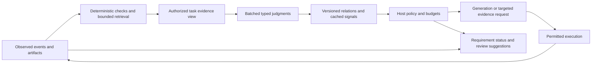

# What cheaper semantic decisions could change in OpenAgents

Research snapshot: September 22, 2026, UTC. Inspected checkout:
`5e2044999a5283a8cf854804ac900fbe59a9c3f3`. This directory contains research,
illustrative requests, and offline analysis. It changes no production behavior.

**Jev could be consequential here, primarily by improving the information that
reaches agents and supervisors. Replacing more model calls is a smaller
opportunity.** OpenAgents already made the basic architectural choice: Rust owns
the workflow and authority; typed models supply decisions; generative models
produce answers and proposed work. The next useful step is to make task-to-evidence
relationships explicit and inexpensive enough to maintain throughout a run.

Start with **content-aware repository evidence selection**, then test
**requirement-to-evidence checking**. Explore **semantic project intake and
dependency discovery** as a larger product capability. Keep each advisory until
it beats a concrete baseline on complete tasks. The retained evidence supports
fast, inexpensive judgments, but does not establish a broadly trustworthy
automatic reviewer, completeness detector, or scheduler.

The smallest useful first experiment is a paired repository-answer test: hold
the generator and its context budget constant, change how evidence is selected,
and measure whether answers improve enough to justify the added delay. An
isolated relevance score cannot settle that question.

## What was inspected and measured

I read the requested TypeSafe introduction, primitives, API, documentation
index, and architecture investigation. I followed the model, confidence,
known-limitations, SDK, fan-out, parallel-question, retrieval, skill-selection,
citation-checking, and extraction-cascade references. The web reader failed on
`llms.txt`; an ordinary HTTP fetch succeeded. The guessed `/pricing` page was
unavailable; the current [model reference](https://docs.typesafe.ai/models)
contains the price and service limits used below.

Locally, I inspected the actual turn and shell loops, generation interface,
program runtime and question sets, evidence collector and selector, review
consumer, project supervisor and conflict harness, SDK retry/configuration
paths, batch-service contract, Gym measurement contracts, relevant tests,
Voyager's episode and decision paths, and retained evaluation records. I also
read the optimization design to avoid proposing its planned features as
missing ideas or shipped implementation. This was a targeted inspection, not a
complete audit of every crate. No private sibling repository or private user
trace was needed.

**New work performed:** offline reanalysis of three retained evaluation logs and
one observed delegation trace. Run [audit.py](audit.py) to reproduce
[audit.json](audit.json), including source hashes. These are recomputed
historical observations, not new inference results. No model API was called.
The active environment exposed none of `TYPESAFE_API_KEY`,
`OPENAGENTS_API_KEY`, or `CODER_DECISION_KEY`; this is not a claim that the
machine has no credentials elsewhere. No live experiment budget was established
for this investigation, so I did not search for other secrets or spend funds.

### Corrections that affect the recommendation

| Retained evidence | What the underlying records support | Consequence |
| --- | --- | --- |
| [Evidence selection report](../../coder/measurements/2026-09-21-evidence-select.md) | Stored grades and summary say **16/18** with one confident error. Regrading the recorded path/span against the committed suite gives **17/18**, agreeing with the original prose report: `es-05`, selected at **0.98**, exactly matches its gold path/span despite `correct:false`. Only `es-10`, at 0.58, remains wrong. | This is an internally inconsistent record, not a demonstrated 0.98 model error. Reconcile grading provenance before using it to fit a policy. |
| [Evidence development experiment](../../coder/measurements/2026-09-22-evidence-select-dev-threshold.md) | 8/10 correct; one verified error at 0.92. The follow-up held-out threshold table propagates the inconsistent `es-05` grade. Regrading still shows that a 0.7–0.8 floor defers one error while losing five or six correct selections. | The favorable development tradeoff did not transfer, even after correcting the held-out grading discrepancy. |
| [Review finding baseline](../../coder/measurements/2026-09-22-review-finding-baseline.md) | 18/20 agreement is reproducible. Current raw labels contain **7 genuine and 13 false findings**, not 8 and 12. A genuine API-key comparison finding received **0.25**; a false finding received 0.51. | The report's claim that both misses occupy the ambiguous band is not supported by those values. Automatic dismissal below 0.3 would discard a genuine finding. |
| [Observed six-delegate trace](../../../crates/coderbench/goldens/devin-fan-out-six.atif.jsonl) | Program, independence, and acceptance decisions took 586, 169, and 269 ms: **1.024 seconds total**. Capability probing took 5.544 seconds; the longest delegate took 40.751 seconds. | In the reported 48.4-second run, removing all decision latency could save only about 2.1%. Avoiding unnecessary delegate work has much more headroom. |

I left the historical files intact and recorded both stored and recomputed
grades here. The `es-05` inconsistency already exists in the commit that added
both files, `37e0539465`; this is not explained by a later change to the gold
span. The retained record does not identify the cause. The review suite
documents a label correction during its original run; therefore
its final 90% agreement is a useful development observation, not pristine
confirmation on labels frozen before exposure. The raw logs are public authored
fixtures, not proof of production defect recall.

Losing more correct selections than errors does not by itself prove abstention
is uneconomical. Regraded at a 0.6 floor, the held-out set defers one error and
three correct selections. That can be worthwhile if avoiding the error saves
more than the fallback and delay on all four deferred cases. The evidence
rejects a free improvement in coverage and accuracy, not every possible
cost-sensitive policy. No new threshold was selected from these exposed cases.

Other useful retained results:

- [Quiet hosted latency](../../gym/measurements/2026-09-20-hosted-jev-quiet-latency.md):
  1,256 calls, eight blocks, average block p50 98.5 ms and p95 159.2 ms,
  without observed failures. Another route to the same service measured a
  substantially higher median. These are client-visible network-plus-service
  observations on that workload, not a latency promise for large requests.
- [Turn-question baselines](../../decision-models/measurements/2026-09-20-coder-question-baselines.md):
  historical `action` scored 28/32 versus 31/32 for always responding;
  `shell_outcome` scored 34/44 versus 24/44 for its constant baseline. The latter
  still made seven false retries and three missed retries. Current source has
  already removed the five retired questions; the report's final implementation
  status is older than this checkout.
- [Program-selection results](../../decision-models/data/program-selection-v2/jev-summary.json):
  30/32 on real turns versus 31/32 for always choosing `none`; 31/36 on authored
  cases versus 10/36 for that constant. Across both groups there were five
  spurious selections and two wrong-program selections. The recognition task
  has value, but authored class balance overstates its real-turn frequency.
- [Same-model review policy](../../coder/measurements/2026-09-22-review-policy-selection.md):
  Kev-0.5b reviewed sixteen units, changed no answer, and added 71% call time.
  This is evidence about that particular pairing, not a Jev review result.
- [Independence wording](../../coder/measurements/2026-09-21-independence-v2-eval.md):
  v2 agreed on 11/12 small authored lists. Its one error was an empty list
  already excluded mechanically. This does not establish safety on hidden
  dependencies in real backlogs.

## The product and its current execution paths

The user outcome is completed, attributable agent work: useful answers, correct
patches, bounded execution, and coordinated work that survives failures without
claiming unsupported success. Coder is the first specialization of the general
agent infrastructure; Voyager provides another, much earlier domain.

| Execution path | Current behavior and concrete source | Opportunity or limit |
| --- | --- | --- |
| Incoming turn | [turn::run](../../../crates/coder/src/turn.rs) pushes the message, awaits program selection, then awaits classification on the ordinary path. [Agent::program and classify](../../../crates/coder/src/agent.rs) implement those calls. | Two serial decisions precede generation. They can be made independent under a common input contract, but presently see different state. |
| Generation and commands | [Agent::turn](../../../crates/coder/src/agent.rs) generates, parses a reply through `Reply::read`, runs admitted commands, judges outcomes, and generates again. [generate.rs](../../../crates/coder/src/generate.rs) streams Open Responses text and records token usage. | Generation and command execution dominate many tasks. The generated command plan contains novel work; it is not merely expensive classification that Jev can replace. |
| Repository context | [repo.rs](../../../crates/coder/src/repo.rs) uses up to four draft terms, eight tracked paths, ten matching lines, 160 bytes per line, and 2 KiB of quoted source; the full evidence block has an 8 KiB cap. README and AGENTS prefixes are 1,200 bytes each. Collection runs with each generation. | Ranking and contiguous context could improve evidence quality. Repeated reads can be cached by content identity. Binding instructions must be retained separately from relevance selection. |
| Turn state | [classify.rs](../../../crates/coder/src/classify.rs) keeps six messages, 768 bytes per message, three shell commands per record, and 256 bytes of each output. | The cap is explicitly motivated by the smallest local Lev door. Hosted Jev's larger limit does not justify blindly expanding every state. Function-specific views are preferable. |
| Evidence selection foundation | [evidence.rs](../../../crates/coder/src/evidence.rs) captures bounded observations; [select.rs](../../../crates/coder/src/select.rs) builds a Choice over candidate records and two Nouls, and separately binds disclosure. | The ranking request contains path/span/readness/size metadata, not source text. Repository-wide call-site search found the selector used in its tests and [evaluation example](../../../crates/coder/examples/select_eval.rs), not the production turn/runtime. Wiring it in is real work. |
| Program execution | [runtime.rs](../../../crates/coder/src/runtime.rs) performs ordered program steps and batches per-requirement completion questions. [completion.json](../../../questions/completion.json) asks whether a delegate's answer is usable. | The state includes task, output, status, expected answer, and verdict. A semantic usability judgment is weaker than evidence that each requirement was actually fulfilled. |
| Review | `Runtime::review_findings` runs the pinned reviewer after mechanical verification, anchors findings, and asks all anchored findings in one request. [review.rs](../../../crates/coder/src/review.rs) preserves confirmed, dismissed, unresolved, and unanswered dispositions. | Basic batching already exists. Better evidence and decomposition may help; finding discovery and deep reasoning still require the reviewer. |
| Project supervision | [controller.rs](../../../crates/coder-project/src/controller.rs) polls and refills prepared tasks. Open unprepared issues are recorded as `unprepared_issues`. [poll.rs](../../../crates/coder-project/src/poll.rs) reads structured states and dependencies. | Semantic intake could turn more of the backlog into reviewable preparation, discover missing relationships, and respond to changed evidence. |
| Scheduling | [footprints_conflict](../../../crates/coder-scheduler/src/catalog.rs) enforces conflicts; an unknown footprint conflicts with everything. [semantics.rs](../../../crates/coder-project/src/semantics.rs) scores supplied proposals against independent labels. | The semantic harness does not call a model. A model must not erase enforced conflicts or make an unknown footprint safe by assertion. |
| Decision service | [batch execution](../../decision-models/service/batch-execution.md) describes bounded concurrent HTTP calls per input for `/v1/classify`, default concurrency one. Native questions within each call share its state. | HTTP concurrency, shared-state question packing, and durable batch jobs are different mechanisms. The existing facade does not promise cross-input packed inference. |
| Voyager | [episode.rs](../../../crates/voyager/src/episode.rs) has a fixed curriculum and mechanical critic; [decide.rs](../../../crates/voyager/src/decide.rs) orders admitted choices. | A bounded semantic curriculum is plausible new behavior, but there is no retained Gym suite demonstrating its benefit. The phase-one design is a deliberate test scaffold, not evidence that model cost forced the fixed curriculum. |

Tests inspected include the production question-text binding, state-cap tests,
shell-verdict tests, selector/disclosure tests, review anchoring and policy
tests, and deterministic conflict fixtures. They establish implementation
contracts; canned answers in those tests do not establish model quality. I did
not rerun Rust tests because no Rust behavior changed.

### Which assumptions could change

Some constraints are economic; others are authority, evidence, or portability
constraints and should remain.

1. **A tiny lexical sample is enough context.** The current code intentionally
   stays bounded and cheap. Treating a larger candidate set semantically could
   let the same generation budget include the right source and test, instead of
   the first matching lines. This is the clearest information bottleneck.
2. **A supervisor can only act on manually prepared work.** Preparation still
   needs human or deterministic validation, but inexpensive semantic screening
   could prepare suggestions for every changed issue, not just the few someone
   reads closely. That is an opportunity, not a proven historical cost motive.
3. **Completion is a final, coarse judgment.** Cheap checks make a live matrix
   of requirements and observed evidence plausible. A missing requirement can
   trigger an additional read while work is active rather than another full
   agent session after review.
4. **One bounded state must suit every model.** Local-window constraints explain
   today's common truncation. Per-function evidence views and explicit door
   budgets could preserve more relevant context while keeping local execution
   possible. Capability and disclosure contracts determine the allowed view.
5. **Every meaningful decision waits for its own turn in the control flow.**
   Program recognition and ordinary routing can be speculated together; checks
   over one completed diff can be batched. A judgment about a not-yet-generated
   patch cannot be speculated into existence.

I found no evidence of a production generative classifier waiting to be
wholesale replaced, nor a production semantic event stream currently sampled
to save inference spend. Sampling appears in evaluation and retained trace
selection. Full event coverage is a proposed capability, not a measured savings
claim against an existing sampling policy.

## What the external evidence establishes

### Documented service contract

As retrieved, `jev-1.13.0` costs **$0.042 per million input tokens**; output
tokens are free. The published bounds are **64k tokens per request**, **32k for
state plus its longest question**, **250,000 tokens/second**, and **1,200
requests/minute**. Limits can change. Both moving aliases currently resolve to
1.13.0. Pin the version for an experiment. These are vendor terms, not a local
throughput measurement. [Model reference](https://docs.typesafe.ai/models).

One HTTP request contains `model`, `state`, and a question map. Choice offers
up to 255 options; Score takes 2–10 ordered levels; Noul returns a yes
probability. Question IDs are application keys, not model-visible context.
There is no documented embeddings or hidden-representation interface here.
[API reference](https://docs.typesafe.ai/api).

Questions share state and are evaluated independently. That means an answer
cannot become a sibling's input. It does **not** mean that the answers' errors
are statistically independent. Stage two is necessary when stage one selects
evidence to retrieve, changes candidates, or constructs new state. Otherwise,
explicitly premised questions can be asked together and unused answers ignored.
[Primitives](https://docs.typesafe.ai/primitives),
[fan-out pattern](https://docs.typesafe.ai/patterns/fan-out).

Score is an expectation over ordered rubric indices, not an arbitrary numerical
measurement. Choice/Score `confidence` is derived from the distribution; Noul
has no separate confidence. Preserve the full distribution and evaluate the
exact field that downstream code thresholds.
[Score](https://docs.typesafe.ai/primitives/score),
[confidence](https://docs.typesafe.ai/confidence).

The vendor documents weaknesses in arithmetic, indirection, large irrelevant
state, adversarial text, and consistency between separately phrased predicates.
These limits are directly relevant to code review and policy checks. Precise
types guarantee an output shape, not semantic truth.
[Known limitations](https://docs.typesafe.ai/model-jaggedness/jev-1.13).

Integration is already available through the in-repo Rust SDK. The vendor lists
Python and JavaScript SDKs; neither is a reason to add a new product language.
Hosted TypeSafe credentials and OpenAgents `oak_` gateway credentials are
different contracts. The gateway's receipts, quotas, and `Idempotency-Key` /
`X-Attempt` semantics must not be attributed to the hosted vendor endpoint.
[SDK reference](https://docs.typesafe.ai/sdk),
[local caller guide](../../decision-models/guides/caller.md).

### Claims, external measurements, and hypotheses

The vendor's parallel-question cookbook reports 12.2× lower cost and 10.0× lower
summed latency for thirteen questions over one document. Its code identifies
Jev 1.12; the comparison serializes the thirteen separate calls. It demonstrates
amortization on that workload, not a tenfold improvement over concurrently
issued requests or over an OpenAgents task. The primitives page still quotes
different ratios, another reason to retain the actual experiment identity.
[Parallel-question cookbook](https://docs.typesafe.ai/cookbooks/parallel_questions).

Archer Hume's external API investigation reports behavioral question isolation,
shared-input accounting, increasing latency at larger question counts, and
option-order sensitivity. Its timing uses a service header, not full client
elapsed time. I did not rerun those probes. They motivate tests for batch
composition, option permutations, and nonlinear scaling. The proposed causal
backbone, sparse experts, pointer versus slot readout, and training mechanism
remain architectural hypotheses; none is an integration dependency.
[Architecture investigation](https://archerhume.com/posts/jevs-architecture-unmasked).

The programming opportunity needs only the observable interface: turn bounded
language evidence into reusable properties and let code combine them. No
encoder access, embeddings, arbitrary feature extraction, or cross-request KV
cache is assumed. An application can cache decisions by content and question
identity without knowing the model's internals.

## Ranked opportunities

Effort estimates are my implementation estimates for one experienced contributor,
excluding the time needed to accumulate trustworthy labels. They are not measured
delivery forecasts.

| Rank | Opportunity | Savings | Better outcomes | New capability | Effort and main risk |
| --- | --- | --- | --- | --- | --- |
| 1 | Content-aware evidence allocation | Potentially fewer rereads, smaller generator inputs, and fewer failed answer attempts | Broader source and test coverage at a fixed prompt budget | A task-aware repository view that updates with changed files | 1–2 weeks for a narrow integration; 3–6 for robust collection and evaluation. Missing candidate retrieval or wrong exclusion can hide the decisive evidence. |
| 2 | Requirement and finding evidence checks | Potentially less reviewer noise and fewer repeated full agent runs | Detect unsupported completion claims and mismatched tests | Live requirement status tied to actual observed artifacts | 1–2 weeks for review-side shadowing; 3–6 for a live evidence matrix. Confident dismissal or apparent verification from incomplete evidence. |
| 3 | Semantic project intake and relationships | Less manual preparation and less duplicated work | Surface hidden dependencies and missing acceptance conditions | Prepare suggestions for every changed issue and update them as evidence arrives | 2–4 weeks for advisory intake; broader autonomy requires more work. Wrong dependency or resource inference. |
| 4 | Combine turn-start decisions; add explicit program invocation | One fewer round trip on ordinary turns; zero recognition call for explicit invocation | Fewer spurious program selections if explicit selection is available | Immediate program previews without running them | Several days plus evaluation. Changed shared state alters behavior; route quality already weak. |
| 5 | Diff-keyed trace indexing and failure triage | Fewer repeated large-context investigations | Every admitted event can be tagged for later retrieval | Search traces by unresolved requirement, missing evidence, or retry cause | 1–2 weeks for offline indexing. Inferred tags mistaken for observed facts; repeated identical events waste calls. |
| 6 | Small-generator / Jev / stronger-generator cascade | Potentially large if many cheap candidates are salvageable | Target deeper reasoning where bounded checks find gaps | Several candidate plans evaluated before one expensive continuation | 2–4 weeks for one narrow workflow. A cheap verifier may miss exactly the subtle failures that need escalation. |
| 7 | Voyager semantic curriculum over admitted skills | Little direct savings against its deterministic baseline | Better response to goal changes or unavailable resources | Goal-conditioned exploration and guild task interpretation | 2–4 weeks after an episode suite exists. Numeric planning, stale world state, and model decisions slower than world changes. |

## Design 1: evidence allocation by content and task

**User problem.** A repository answer or fix needs the right implementation,
call site, constraints, and tests. The current lexical excerpt budget can select
the right file but omit the relevant condition, or spend its whole budget on
incidental mentions. Merely replacing keyword search with a smarter top-one
path choice does not solve that problem.

**Integration.** Insert an asynchronous context-planning operation before
generation in `Agent::turn`; use the captured object for both the prompt and
trace. Keep `Repo::context_with_evidence` as a deterministic baseline/fallback.
Build on `evidence::Candidates` and the disclosure contract in `Select`, but add
an explicitly authorized excerpt field: today's candidate record and selector
do not provide source content to the model. This requires code, not just new
question text.

Retrieve a bounded union of exact identifiers, lexical/BM25 matches, known
callers, and nearby tests. Start with 20–40 candidate spans and a separately
bounded state. Candidate generation recall is a first-class metric. A selector
cannot recover evidence omitted by retrieval.

Use named requirements from a known workflow or the user's explicit list.
When a freeform task needs interpretation into requirements, a generator or
human may propose that list; preserve the original request and measure missed
requirements separately. Jev cannot recover an arbitrary task specification by
silently pretending its answer space is already known.

**Questions and composition.** For each candidate/requirement pair, ask one
Score about direct relevance, with levels such as unrelated, related but
insufficient, and directly informative. For a concrete factual claim, add a
Choice among supported, contradicted, conflicting, and not established. Ask
independent questions over the same captured snippets together. Use distinct
evidence for documented intent, enforcing implementation, and tests; a comment
about a guarantee is not proof the guarantee is enforced.

[evidence.request.json](evidence.request.json) is a complete illustrative request
using public SDK excerpts. Its two relevance questions and documented-contract
Choice share one request. The Choice explicitly asks only what is documented.
An enforcement question needs the actual implementation and test evidence.

Rust-like consumer pseudocode, with proposed helpers rather than existing APIs:

```rust
let snapshot = collect_authorized_candidates(task, retrieval_budget)?;
let key = cache_key(task, &snapshot, wording_digest, model_version, disclosure);
let judgments = cached_or_ask(key, request(&snapshot), deadline).await;
let view = match judgments {
    Ok(answer) if validates_against_snapshot(&answer, &snapshot) => {
        // Scores are comparable rubric signals, not a Choice softmax ranking.
        cover_requirements_within_budget(
            mandatory_instructions,
            lexical_baseline_reserve,
            &snapshot,
            &answer,
            prompt_budget,
        )
    }
    _ => deterministic_context(&snapshot),
};
let view = invalidate_changed_sources(view)?;
generate_with_captured_context(task, view).await
```

Initially reserve space for the deterministic baseline and retain candidates
the model marks contradictory. Do not hide them as irrelevant. Later, permit
replacement only after task-level evaluation supports it. Code performs
deduplication, token budgeting, path authorization, freshness checks, and
coverage accounting. Selecting a candidate never expands disclosure grants.

**Real dependencies.** Metadata screening may precede snippet retrieval when
reading every candidate is costly. A second content pass then has new evidence
and is legitimately sequential. An expansion triggered by a missing requirement
is another sequential request. Begin with one bounded pass; measure whether
two-stage screening actually saves work at the intended repository size.

**What still needs other machinery.** Retrieval finds candidates; a generator
explains code and proposes fixes; compilers/tests check behavior. Code retains
mandatory instructions without filtering. Jev helps allocate attention among
already available, authorized evidence.

**Expected benefit and failure.** This can improve repository answers even when
the current generation bill is small. Its strongest new behavior is a maintained
view of evidence per task: a changed file invalidates only dependent judgments,
and a follow-up question can reuse unchanged observations. The largest failure
is a plausible but wrong evidence omission that makes the generator confidently
incomplete. Neither a high Choice probability nor a coverage Noul prevents it.

## Design 2: requirements connected to observed results

**User problem.** A successful command, a persuasive delegate response, and a
passing test can all coexist with an unmet requirement. Conversely, a reviewer
can name many anchored but invalid findings. The useful semantic work is to
identify the precise relationship between each claim and its evidence.

**Integration.** Start in `Runtime::review_findings`, where findings, pinned
revisions, and diff sections already exist. Extend later to
`requirements_state`, shell outcome records, and ATIF observations. The current
per-finding question bundles presence, location, and introduction into one
Noul; the current completion question is broader still. Preserve the existing
mechanical checks and use a versioned experimental question set.

For each review finding, distinguish:

- Whether the supplied code has the claimed behavior under the stated trigger:
  Choice with supported, contradicted, and insufficient evidence.
- Whether the before/after change introduces that behavior: a separate Noul or
  Choice when sufficient before/after context exists.
- Whether the trigger is actually reachable: Choice with explicit not-established.
- Whether supplied tests exercise the relevant condition: one Noul per test and
  requirement, followed by code inspecting the test result and artifact identity.

These are not interchangeable notions of “genuine.” A conditional defect can be
real while its reachability is unknown. Severity can be a separate Score if a
review policy needs it; severity should not silently decide whether evidence
supports the behavior.

[review.request.json](review.request.json) shows this decomposition for an
`unwrap` introduced in a discount lookup. All four questions share the same
before/after statements, finding, and test. The missing caller validation is
explicit. None of the questions needs another answer to exist. A follow-up
request to inspect caller validation genuinely needs newly retrieved evidence.

```rust
for finding in mechanically_anchored_findings {
    let signal = checked_answers.for_finding(finding.id);
    let disposition = match signal {
        Missing | Invalid => Unresolved,
        Evidence { supported: true, reachable: Unknown, .. } => NeedsCallerEvidence,
        Evidence { supported: true, introduced: true, .. } => NeedsReview,
        Evidence { contradicted: true, .. } => ProposedFalsePositive,
        _ => Unresolved,
    };
    // Shadow phase records suggestions; it does not suppress findings.
    retain_original_and_record_suggestion(finding, signal, disposition);
}
for requirement in requirements {
    let evidence = evidence_for(requirement);
    show_status(observed_artifact_checks(evidence), semantic_links(evidence));
}
```

Do not multiply these probabilities into a “probability the finding is real”:
their errors can be strongly correlated. Learn and validate a policy over the
joint observed signals, or use a conservative rule that preserves uncertainty.
Any dismissal threshold needs independently labeled genuine findings near and
below that threshold. The retained 0.25 miss is a mandatory regression case.

**New behavior.** After each meaningful command result, diff change, or test
completion, update only the affected requirement/evidence relationships. The
interface can distinguish “implementation found,” “relevant test identified,”
“that test passed on this artifact,” and “still missing evidence.” A failed
check can request one targeted read or test rather than sending the whole
assignment to a new agent. This is substantially more useful than another
general `progress` or `useful` score, which the repository already retired.

**What remains expensive.** A reviewer must still discover candidate defects;
Jev's endorsement of supplied findings says nothing about unreported bugs.
Reasoning across a distributed state machine, concurrency interleavings, or a
missing call graph requires deeper analysis. Tests and artifact checks own
verification. A semantic test-coverage label cannot turn a passing irrelevant
test into correctness evidence.

**Expected benefit and failure.** Broad, inspectable coverage could reduce
missed requirements and reviewer time. It adds inference relative to the
current path and must repay that expense through less rework or better quality.
The dangerous failure is a low probability causing suppression of a real
issue; start with annotations and targeted escalation, not automatic approval
or dismissal.

## Design 3: semantic preparation of project work

**User problem.** The supervisor schedules prepared work effectively, but
unprepared issues remain outside its executable catalog. Structured dependency
fields and path conflicts miss semantic relationships: one task may introduce
the contract another consumes, two issues may request the same deliverable,
or a measurement task may need a quiet machine despite touching no shared files.

**Integration.** Read the captured project snapshot before `plan_round`, compare
its issue/body/revision digests with previous observations, and prepare
suggestions alongside `unprepared_issues`. Use the existing scheduler and
semantic harness to evaluate the suggestions. Keep issue ingestion scope,
explicit dependencies, pinned assignments, resource reservations, and host
admission unchanged until their owners accept a new prepared record.

Available state includes issue text, explicit dependencies, acceptance criteria,
declared input/output contracts, observed repository references, current
artifact status, and capacity declarations. A title by itself is often
insufficient. Retrieve likely related issues using references and lexical or
embedding candidates first; label what was omitted.

Ask narrow questions:

- For a candidate ordered pair, does B require the output A says it will
  create? Noul, with both contracts and the current availability observation.
- Do A and B request the same deliverable? Noul. Shared terminology is not a
  duplicate and producer/consumer work is not the same deliverable.
- Does this task request an empirical measurement sensitive to competing load?
  Noul. Parse explicit benchmark flags in code first.
- Which preparation template fits: answer, source change, documentation,
  measurement, or unknown? Choice. It does not estimate exact memory or assign
  execution permission.

[project.request.json](project.request.json) shows a disjoint-file producer and
consumer of a new receipt field. The dependency, duplicate, measurement, and
work-kind questions can share state. If the dependency answer leads to fetching
the current API schema, verification against that schema is a second stage.

```rust
let changed = snapshot.changed_issues_since(last_snapshot);
let candidate_pairs = retrieve_related_pairs(&changed, &snapshot, pair_budget);
let proposals = judge_intake(&changed, &candidate_pairs).await?;
for proposal in proposals {
    if !snapshot_still_matches(proposal.evidence_digest) { continue; }
    publish_local_preparation_suggestion(proposal); // No external message.
}
let catalog = approved_prepared_tasks_with_existing_hard_constraints();
let plan = scheduler.select(catalog, actual_capacity, actual_reservations);
```

Initially show suggested edges and templates for review. Missing evidence keeps
a footprint unknown. A semantic dependency can recommend more ordering; it
cannot erase an explicit edge or relax an enforced conflict. Exact resource
quantities come from observed runs or declarations. If later using probabilities
to order otherwise admissible work, measure starvation and completion quality
as well as throughput.

**New behavior.** Every changed issue can get a preparation dossier: likely
dependencies, relevant code, missing acceptance evidence, and duplicate
candidates. A new artifact can update the dossiers that consume its contract.
The operator handles concrete unresolved preparation instead of repeatedly
reading the whole board. This connects the evidence and requirement designs
into a project-level product.

**Scaling and failure.** All pairs of 100 tasks already produce 4,950 pairs;
two directed dependency questions double that. This is not a free single
request. Bound and retrieve pairs, reuse unchanged judgments, and report
candidate-pair recall. The largest risk is missing a dependency and treating
an issue as ready, or inventing dependencies that stall useful work. Track
those separately. The existing 12-list independence suite does not measure
this workload.

## Economics and response time

### Model the whole path

For an uncached decision request, use:

```text
J = price_per_input_token × (state + question text + criteria + protocol overhead)
E[cost] = preparation + expected_attempts × J
          + fallback_probability × fallback_cost
          + changed_generation_cost + expected_error_rework
E[latency] = preparation + queue + network/service + composition
             + dependent downstream work + retries/fallbacks on their paths
```

Here preparation and rework can be expressed in money or time, but do not add
milliseconds to dollars. Record both. Expected latency is not p95 latency;
measure the joint workflow distribution. In particular, adding stage p95s is
not a valid workflow p95 estimate.

With shared state of S tokens, total question tokens Q, fixed overhead H, and
m independent requests, approximate input is `mS + Q + mH` separately versus
`S + Q + H` together. This saves repeated input. It does not eliminate question
processing, response serialization, network transfer, or queueing. Group only
compatible state and disclosure scopes; do not batch unrelated tenants to save
tokens.

Illustrative input-size costs at the retrieved rate:

| Input tokens, including questions | One request | 100,000 requests |
| ---: | ---: | ---: |
| 2,000 | $0.000084 | $8.40 |
| 6,000 | $0.000252 | $25.20 |
| 12,000 | $0.000504 | $50.40 |
| 18,000 | $0.000756 | $75.60 |
| 24,000 | $0.001008 | $100.80 |
| 48,000 | $0.002016 | $201.60 |

These are current-price calculations, not historical bills. A 48k total request
is possible only if its state-plus-longest-question also fits the branch limit.
Use actual reported token usage to replace estimates. The evidence log's 15,883
input tokens would cost about $0.000667 under this rate, but its recorded actual
charge remains unknown.

For interactive prototypes, assume **10–80 ms preparation**, **100–500 ms per
modest uncached hosted decision**, and **1–30 ms composition/cache work** until
measured. A 20–40-span batch may exceed those ranges; budget a 1-second added
p95 limit as an experiment target, not a service promise. Measure 1/8/32/64
questions and 2k/8k/16k state independently, with first connections and pooled
connections separated. The retained small-request latency does not establish
this scaling curve.

### Concrete break-even conditions

| Candidate | Illustrative work and expected direct cost | Condition that makes it worthwhile |
| --- | --- | --- |
| Evidence allocation | 12k state + 6k question/overhead tokens = 18k total, about $0.000756; perhaps 0.11–0.61 s added on a modest request, larger batches unmeasured | If generator input costs an assumed $0.10–$3/M, removing roughly 7,560–252 uncached generator tokens offsets this decision bill alone. If one avoided failed continuation costs 5–30 s, preventing one in roughly 8–273 tasks can repay 0.11–0.61 s of added mean latency, depending on the actual pairing of values. Quality loss can invalidate either saving. |
| Finding/requirement checks | 8k evidence + 4k questions = 12k total, about $0.000504; original reviewer cost remains | If a false dismissal costs ten minutes and one saved review action saves one minute, false dismissals must be fewer than one per ten saved actions before adding inference and implementation costs. Initial annotation avoids paying that failure cost through automation. |
| Project intake | 6k shared issue evidence + 6k questions = 12k total, about $0.000504 per bounded dossier batch | One avoided duplicate 40-second delegate run can fund about 80–400 decision calls in latency terms at 0.5–0.1 s each, but only if these calls lie on the same relevant critical path. Background calls instead consume capacity and money. Measure preparation minutes saved and false-ready errors. |
| Turn-start batching | At 2k shared input, 400 total question tokens, and assumed 250 overhead tokens: separate 4,900 versus combined 2,650 tokens | Estimated savings about $0.0000945 and one round trip on ordinary turns. If program requests occur with frequency p, speculation saves calls only relative to the ordinary fraction: current calls are approximately `2−p`, combined calls 1. Added state and altered decisions require revalidation. |

The generator price range is a sensitivity scenario, **not** a quote for the
configured Gemini or GLM model. Actual provider rates, prompt-cache discounts,
token usage, and executor charges must be captured before claiming savings.
If the generator already serves cached input cheaply, the monetary argument
for filtering weakens; better evidence can still justify it.

For any cascade with cheap generation C, decision J, fallback F, and fallback
rate f, the direct-cost condition is `C + J + fF < F`. If C=$0.002,
J=$0.0005, and F=$0.02 as hypothetical prices, f must be below 87.5%, before
including retries and errors. Latency has its own, usually tighter condition.
A shallow checker cannot justify this cascade for arbitrary patches; first
choose a task with narrow observable acceptance conditions.

### Critical paths, retries, and load

The ordinary turn currently pays program selection, then routing, then
generation. A combined request could share a state containing the task,
bounded transcript, and program options, with each question pointing to its
own relevant fields. If a program is selected, ignore the ordinary route.
However, adding transcript to program recognition changes its input, and
flattening both questions into one Choice changes their semantics. Either
requires new evaluation. Concurrent separate requests are a simpler comparison
that preserves request shapes but saves no repeated input cost.

The review path necessarily waits for candidate findings and the captured diff.
The independence question necessarily waits for the selected task list.
Completion checks wait for delegate outputs. Those dependencies cannot be
removed by calling their questions “independent.”

[SDK defaults](../../../crates/jev/src/retry.rs) allow two retries and no
whole-call budget; an attempt's default timeout is ten seconds. That is an
unacceptable implicit tail budget for a speculative interactive context pass.
Give the proposed pass one explicit total deadline, and fall back to the
captured deterministic view on service failure. Background intake can use a
different bounded retry policy. Respect `Retry-After` if retrying; do not retry
schema/authorization failures or interpret a missing answer as “no.” Existing
`select_eval` also adds an outer retry, so it is unsuitable for clean
single-attempt latency measurement without accounting for both layers.

If transient independent failures occur at 1–5% and two retries are allowed,
the illustrative attempt multiplier is `1 + r + r² = 1.0101–1.0525`.
Real overload failures are correlated and can be worse. Backoff can dominate
the tail even when token cost barely changes. Record timeout and refused-call
cost as unknown when usage is unavailable; do not count it as zero.

At the published limits, sustained throughput is bounded by
`min(20 requests/s, 250000 / input_tokens_per_request)`, before considering
actual service capacity and burst rules. An 18k-token request has a token-rate
ceiling near 13.9 requests/s. At a hypothetical 250 ms mean, roughly four
in-flight calls could approach that ceiling; adding concurrency indefinitely
cannot increase it. A fleet of 100 sessions sending one request every second
would exceed the published request limit even with tiny states. Event-driven
invalidation, debounce, cache hits, fair queues, and separate foreground and
background budgets are essential.

### Credible cheaper alternatives

- **Deterministic code:** exact symbol lookup, Git diff anchoring, exit status,
  dependency closure, numerical resource calculations, and explicit program
  invocation should stay deterministic. Add contiguous snippets and better
  lexical ranking before attributing their benefit to Jev.
- **Caching:** first avoid identical work. Key judgments by evidence content,
  task/requirement identity, exact question and criteria text, candidate set and
  order where relevant, model version, and disclosure scope. A new task or an
  altered option list can invalidate a result even when file bytes are unchanged.
- **Embeddings/BM25:** excellent shortlist baselines, especially over a large
  repository. They do not directly establish contradiction, contract dependence,
  or whether a test exercises an acceptance condition. Compare them at the same
  retrieval and generator budgets.
- **Conventional classifiers:** useful for stable resource classes or issue
  categories after labels accumulate. The repository's
  [frozen-embedding experiment](../../decision-models/measurements/2026-09-19-frozen-embedding-baseline.md)
  is evidence on support routing, not this workload. Its implemented refusal
  of Noul/Score is a limitation of that particular door; binary and ordinal
  classifiers can be trained and calibrated. Dynamic natural-language criteria
  are a stronger reason to prefer Jev than a claim that classical models cannot
  return probabilities.
- **Smaller generative models:** necessary when inventing queries, decomposition,
  arguments, or explanations. Compare constrained structured output for the
  same narrow question and retain parse failures, retries, and calibration in
  the measurement. An opaque generated confidence number is not a substitute
  for validating its decisions.
- **Local Kev/Lev:** potential privacy and availability choices. The common API
  does not make them interchangeable in quality, context length, or latency.
  Requalify each exact model/function pairing using the existing Gym machinery.

## An evaluation designed to reject these ideas

### First experiment: can better evidence improve an answer?

Use **24 repository tasks** as a first falsification pilot, in six independent
families: exact lookup, cross-file behavior, implementation/test relation,
negated premise, absent evidence, and changed/stale documentation. Include at
least one task where a misleading filename wins the current metadata selector.
Pin each repository revision and authorize the same read set for every arm.
Have a maintainer mark the necessary spans and independently review the answer
rubric. Do not use a model's selected candidate as its own gold label.

1. Capture each task once. Record retrieval candidates, omitted evidence, byte
   and token budgets, source digests, and the intended answer facts.
2. Compare four context arms: current `Repo` excerpts; improved deterministic
   contiguous/BM25 context; that identical candidate pool selected by Jev;
   and a manually selected evidence ceiling. An embedding shortlist is a useful
   fifth arm if it already runs locally.
3. Freeze the generator model/configuration and use identical prompt budgets.
   Interleave arms in randomized blocks. Repeat each task twice to expose
   generation variance: 24 × 4 × 2 = 192 generations. These are clustered
   repeats, not 192 independent tasks.
4. Score factual correctness, required facts covered, unsupported claims,
   citations pointing to the right captured spans, extra reads/commands, and
   explicit recognition of missing evidence. Also score whether retrieval
   contained all required evidence before any ranking.
5. Measure full request-to-completed-answer latency, time to first output,
   p50/p95, tokens by stage, retry/fallback rates, and actual charge when
   available. Record model bill and human review time separately.

**Pilot stop rule:** stop this design if retrieval routinely misses the needed
source, the manually selected ceiling barely beats the deterministic arm, or
the Jev arm fails to recover at least three additional complete answers out of
24 without introducing more unsupported answers. Three is a practical pilot
target, not statistical proof. Also stop the synchronous form if added p95
exceeds one second or end-to-end p95 regresses more than 10% without a clearly
valued quality improvement. Keep asynchronous evidence indexing as a separate
candidate rather than changing the gate after seeing results.

For a positive pilot, author a fresh 100-task confirmation set grouped by
repository/task family, freeze prompts and policy, and evaluate once. Choose
a primary criterion before exposure: either a meaningful quality gain with a
positive paired confidence interval, or at least 15% lower full cost/latency
with task success no more than two percentage points worse and no material
increase in unsupported claims. A 100-task run may still be inconclusive for a
two-point margin; do not call non-significance equivalence. Estimate the needed
sample size from pilot discordance and accept “insufficient evidence.”

**Smallest preflight before those generations:** use the two existing evidence
suites to check the pinned model and plumbing, then ask the illustrative
content request. This is cheap and runnable, but it cannot establish the
proposal's task-level benefit. The existing metadata suites are already exposed
development material for this investigation, regardless of their historical
“held-out” filename.

### Review and requirement checks

Build 100 findings across 30 or more changes, with independent labels for
conditional defect, introduction, reachability, and final disposition. Include
at least 30 genuine findings, including security and concurrency examples, plus
incomplete diffs, pre-existing bugs, misleading test names, omitted caller
validation, and reviewer prose that argues for its own correctness. Keep whole
changes and issue families together when splitting development and confirmation.

Baselines: original reviewer with no Jev filter; existing per-finding Noul;
proposed decomposition; and a distinct reasoning reviewer on exactly the same
flagged cases. Score precision of proposed false positives, genuine-finding
retention, severe-finding retention, unresolved coverage, reviewer minutes, and
complete-task acceptance. For completion, plant unmet requirements whose
delegates say “done” and irrelevant tests that pass.

**Go for annotations:** a useful decrease in measured review effort, such as
20%, without suppressed findings or misrepresented verification status.
**No-go for automatic dismissal:** any severe genuine finding dismissed, or an
upper confidence bound on false-dismissal risk above the declared tolerance.
Zero errors among 30 genuine findings cannot establish a 1% error bound. As a
rough planning rule, about 300 independent zero-error cases are needed for a
one-sided 95% upper bound near 1%; correlated findings need more. Thresholds
must be selected on development data and assessed at their actual operating
coverage. Never reuse the twenty existing findings to claim a new threshold
has been confirmed.

### Project intake

Replay at least 50 historically frozen issue snapshots and 200 related task
pairs, including duplicates, implicit producer/consumer dependencies, unrelated
tasks sharing vocabulary, quiet measurements, and unknown footprints. Annotate
relationships from implementation evidence and issue intent, not just the
same footprints used by the deterministic scheduler. Hold out whole projects
or later time windows to reduce template leakage.

Baselines: explicit metadata plus current scheduler; lexical/embedding pair
retrieval; Jev suggestions; human preparation. Measure pair-retrieval recall,
precision/recall of dependency suggestions, duplicate false positives,
preparation time, false-ready classifications, starvation, and completed
accepted work per wall hour under the same executor/resource limits.

**Go for advisory intake:** at least 30% lower human preparation time in a
blinded timed comparison, useful dependency recall at an agreed precision
target, and every hard-constraint test passing. **No-go for autonomous
admission:** semantic suggestions bypass a declared constraint, freshness
checks fail, or readiness cannot be validated from observed evidence. Refill
speedups in the repository's deterministic simulation are not evidence for
semantic scheduling speedups; compare against the existing refill policy.

### Common adversarial and operational checks

For all three designs, test missing fields, contradictory observations,
truncated source, renamed paths with unchanged content, stale digests, identical
text under different authority, quoted instructions to the model, and plausible
but wrong claims. Compare single questions with batches; shuffle question order,
permute Choice options, append irrelevant questions, and separately append
irrelevant candidates. The last operation changes a Choice problem and may
legitimately change its distribution; it should not silently break the policy.

Use at least two independently written question variants on development data.
Evaluate Noul Brier/log loss and reliability bins, Choice accuracy and
selected-mass reliability, and Score distributions against the labeled ordinal
rubric. Report risk versus coverage separately for each action and consequence.
Do not pool a Score confidence, selected Choice mass, and Noul probability as
though they were the same calibrated quantity.

Load tests should sweep request concurrency 1/4/8, foreground/background mixes,
candidate sizes, network delay, and forced 429/5xx/timeouts. Record queue wait,
dispatch-to-answer, workflow p50/p95, sustained throughput, canceled and stale
results, and cost for every attempt. Failure and no-evidence cases must remain
in the denominator. Threshold fitting, fallback-trigger selection, and reviewer
selection all consume development evidence. Confirmation must freeze the full
policy, not just the question wording.

Use Gym's pinned suite/question/gate identities and receipt-chain reporting for
confirmation, plus CoderBench or an equivalent independent task grader for the
complete workflow. The current report offers no probability threshold as a
production setting.

## Runnable artifacts and procedure

From the repository root, reproduce the new offline analysis:

```sh
python3 docs/audits/2026-09-22-jev-opportunities/audit.py
```

The three `*.request.json` files are complete HTTP request bodies with
illustrative public/authored state. They are not installed question sets and
their outputs have not been measured. [probe.py](probe.py) validates all three
offline by default and can send one explicitly selected request with `--live`
after a key and a budget are supplied. It disables retries, uses a five-second
timeout, records the actual response and elapsed time, and writes to a new
output file. A probe is a plumbing check, not the confirmation experiment.

```sh
python3 docs/audits/2026-09-22-jev-opportunities/probe.py

# After establishing a live budget and exporting TYPESAFE_API_KEY:
python3 docs/audits/2026-09-22-jev-opportunities/probe.py \
  --live --request evidence --budget-usd 0.01 --output /tmp/jev-evidence-probe.json
```

To rerun the existing metadata and finding baselines later, use the repository's
pinned toolchain and a task-specific Cargo target directory:

```sh
CARGO_TARGET_DIR=/tmp/openagents-jev-investigation-target \
TYPESAFE_DEFAULT_MODEL=jev-1.13.0 \
cargo run -p coder --example select_eval -- \
  crates/gym/suites/evidence-select-v1.json /tmp/evidence-select-rerun.jsonl

CARGO_TARGET_DIR=/tmp/openagents-jev-investigation-target \
TYPESAFE_DEFAULT_MODEL=jev-1.13.0 \
cargo run -p coder --example finding_eval -- \
  crates/gym/suites/review-finding-v1.json /tmp/review-finding-rerun.jsonl
```

Those existing examples do not enforce a dollar budget and are not the final
controlled latency harness. Retain their attempt behavior when estimating
spend. Use new output filenames, never overwrite the historical logs. The next
engineering artifact for Design 1 is an experiment-only Rust context adapter
feeding the four captured context arms to the existing generator; that adapter
and the independently annotated 24-task panel remain to be built. This report
does not claim the complete downstream experiment already exists.

## How I would design these parts today

Use a content-addressed observation store and a task record with explicit
requirements. Observed file bytes, diffs, command results, tests, and issue
snapshots retain their identities. Semantic judgments form versioned links
between those records: relevance, support, contradiction, prerequisite, and
test applicability. Keep the raw signals separate from policy and from facts.



Each meaningful evidence change invalidates the relevant links. UI weighting
and ranking can reuse unchanged signals; new wording or a new model version
requires requalification. A missing judgment leaves a missing link, not a
fabricated negative fact. Foreground tasks have short deadlines and reliable
fallbacks; background indexing has separate budgets and backpressure.

Generation runs when the product needs new text, code, decomposition, or deep
reasoning. The host supplies a measured evidence view and retains deterministic
authority over effects. A user's follow-up can reuse verified observations and
ask new narrow questions instead of restating an entire history. The same
contracts can later support Voyager, where block observations and admitted
skills replace repository spans and tests.

This is a concrete interpretation of routine semantic computation: language
judgments become reusable application data with explicit provenance and
invalidation. It does not require putting a model call into every branch or
trusting a model to operate the host.

## Ideas rejected or deferred

- **More generic progress, usefulness, risk, and damage questions.** Existing
  measurements retired these for lack of useful decision impact. Restore only
  a narrowly defined signal with an actual consumer and a relevant dataset.
- **Jev as a full code generator, arbitrary parser, or proof engine.** Closed
  candidate selection works only when candidates exist. Generating code,
  constructing unrestricted paths, and proving multi-hop behavior need other
  machinery.
- **Automatic merge or permission approval from high confidence.** Neither
  typed answers nor calibration creates authority. Retained confident errors
  also defeat the quality argument.
- **Filter everything below 0.8.** The repository's evidence experiment already
  falsifies that as a universal rule. False negatives can be more costly than
  the context tokens saved.
- **Repeat the same model to obtain independent verification.** The retained
  Kev review pairing changed nothing. A second call needs new evidence,
  meaningfully different judgment, or demonstrably complementary errors.
- **Assume a tenfold whole-agent speedup.** Existing calls already batch many
  questions, and generation/execution dominate the observed delegation run.
  The likely large win is avoiding work or improving its first attempt.
- **Score the entire repository or every pair of backlog items on every event.**
  State limits, token rates, dilution, and quadratic growth make this wasteful.
  Use bounded candidate retrieval and incremental invalidation.
- **Predict exact runtime, resource use, or monetary cost with Score.** Learn
  empirical estimates from observed executions; semantic classes can choose a
  conservative estimation regime, not replace accounting.
- **Put semantic policy inside relay admission.** Protocol validity, membership,
  signatures, and quotas remain deterministic. Optional content indexing belongs
  to an authorized consumer; no permission to decrypt or disclose more follows
  from relevance.
- **Replace the Voyager curriculum immediately.** It is an attractive second
  domain, but the missing episode evaluator is the first task. Compare any
  semantic curriculum against the fixed plan and deterministic goal planner,
  including state freshness and action latency.

The recommendation is to fund a narrow evidence-selection experiment first.
The low price makes broad semantic coverage plausible; the repository's own
negative results make evidence quality, task outcomes, and explicit uncertainty
the decisive tests.
