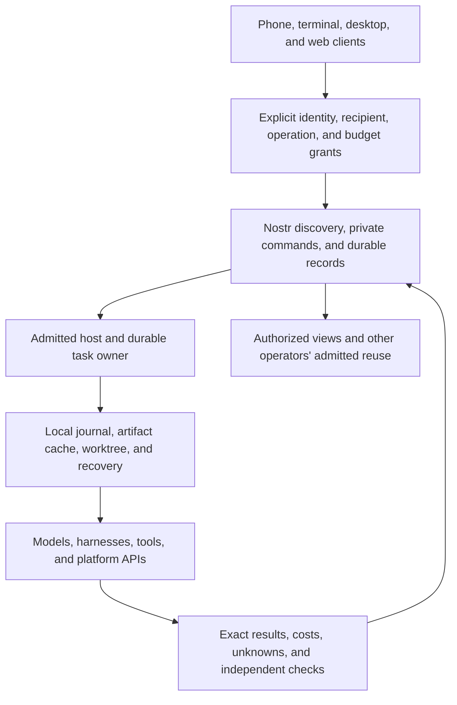

# Nostr adoption audit — September 26, 2026

## Assessment

OpenAgents has working Nostr paths, but it does not yet have one continuous
Nostr-based product. Conversations, decision workers, knowledge publication,
task control, mobile history, Gym boards, and world presence implement different
slices. Much of the state that makes those slices useful still stops at a local
file, a host process, or a separate HTTP account service.

The highest-value change is to make **work, its evidence, and its authority
portable between admitted clients and hosts**. Keep local execution and caches;
add signed identities, durable private records, bounded retrieval, and explicit
reconciliation at the boundaries. Sending every file write, render frame, or
model request through a relay would increase coupling without delivering that
continuity.

The recommended first product milestone is concrete: a task started on a
computer appears on an authorized phone, survives a disconnect, accepts an
explicit correction or cancellation, and preserves its exact execution and
completion evidence. A second host can inspect that evidence without copying
the first host's home directory. This extends the existing task owner and
bridges instead of introducing another execution owner.

The next network-effect milestone is equally concrete: one operator publishes
an exact component and its permitted evaluation evidence; a second operator
retrieves, verifies, explicitly adopts, and evaluates it. Publication alone
does not establish useful reuse or improvement.

| Next work | Existing contracts | Findings |
| --- | --- | --- |
| Durable tasks and phone control | RUN, CTRL, SESS, CJ, CTX | A01, A13 |
| Usable remote computation | CJ, CAP, PRG | A02–A03 |
| Portable complete traces and evaluations | EVAL, CTX, OPT | A04, A10 |
| Exact shared components and private knowledge | EXT, KB, CAP, POL | A05, A12 |
| Independent free labor, then payment | MKT, LAB, X402 | A11 |
| Shared projects, schedules, resources, and service access | WORK, COORD, AUTO, ENV, WS; existing account authority | A06–A09 |
| Remaining Verse and Voyager functions | SESS, MV, KB, EVAL; consented LIVE later | A14–A15 |
| Recovery, artifact availability, and safe primitives | Shared transport, exact artifacts, NIP-46, NIP-77, EXT | B01–B06 |

## Scope and method

Audited source:
[`b152f145e5`](https://github.com/OpenAgentsInc/openagents/commit/b152f145e5).
This includes TestFlight build 42's implementation and its release record.
The [inventory](inventory.json) records all **44 workspace packages**, their
tracked Rust file counts, direct Nostr dependencies, and selected transport
dependencies. A dependency is a search aid, not a conformance result: a crate
can use Nostr through another crate, or depend on Nostr only for pure validation.
The [coverage appendix](coverage.md) records a disposition for every package
and the additional host, registry, and infrastructure surfaces.

The review traces entry points, transports, readers, stores, dispatch paths,
and refusal branches across those packages. It also reviews the iOS host,
standalone Minecraft and Apple model bridges, registries, deployment scripts,
Terminal-Bench tooling, the three NIP lanes, and the existing roadmap and
implementation reports. Retained third-party benchmark outputs and transcript
archives are evidence, not current product implementations.

This is a static architecture and source audit, not an exhaustive line-by-line
security review or a deployment probe. No model, benchmark, training, payment,
production-relay, or private-chat run was performed. Existing tests and receipts
were inspected but not rerun. Findings below distinguish observed source
behavior, proposed integration, and unverified operational concerns.

Read this alongside the [role coverage report](../../protocol/2026-09-26-nip-implementation-coverage.md),
[master roadmap](../../roadmap.md), and [migration tracker](../../coder/migration-status.md).
This audit prioritizes adoption work; it does not mark a draft NIP complete.

## What should use Nostr

Use Nostr when another device, process owner, or independent operator needs to
discover a capability, authenticate an attributable statement, exchange private
work, recover a durable result, or reconcile a shared view. The acting host must
still admit the request and own its effects.

| Boundary | Recommended role |
| --- | --- |
| Work identity, commands, ownership, and status | Signed, private Nostr application records; one admitted execution owner with revisions and fencing. |
| Context, traces, requirements, and evaluation | Exact artifact identities and recipient-scoped access; retained local bytes and bounded remote resolution. |
| Capabilities, programs, plugins, skills, and model offerings | Signed discovery and immutable release pins; installation and execution remain separately admitted. |
| Private reader state and permitted preferences | Encrypted synchronization with an explicit merge and revocation contract. |
| Labor negotiation and delivery | MKT/LAB records linked to actual work, independent verification, and separate settlement. |
| Local inference, subprocesses, files, UI, sensors, and GPU work | Keep direct local interfaces; expose an admitted host operation only when remote access is useful. |
| Provider APIs, Git objects, large artifacts, media, and platform services | Preserve their native data paths; use Nostr for identity, authorization, manifests, coordination, and receipts where applicable. |

The diagram is the proposed integration target. Existing components implement
parts of it. A relay acknowledgment means neither host acceptance nor completed
work; a signed result means attribution, not independent correctness.

## Existing Nostr functionality to preserve

| Working code path | Actual scope | Boundary that remains |
| --- | --- | --- |
| [Coder relay door](../../../crates/coder/src/relay.rs) and [worker](../../../crates/coder/src/bin/coder-worker.rs) | Encrypted conversation jobs and the configured conversation/executor path. | This does not establish generic program dispatch, durable shared sessions, or complete RUN recovery. |
| [Decision worker](../../../crates/gateway/src/relay_worker.rs) and [CAP publisher](../../../crates/gateway/src/advertise.rs) | NIP-CJ decision requests, provisioned signer mapping, the existing HTTP admission path, and a retained worker ledger. | The main decision SDK/caller path is still HTTP; deployment and transport parity require their own evidence. |
| [Scoped task control](../../coder/runtime/nostr-task-control.md) | Private pairing, independent observation/steering/cancellation rights, retained retries, and finite owner projections. | No complete cross-host ownership transfer, full signed RUN journal, or mobile task-control product. |
| [Retained-history connection](../../../crates/coder-connect/README.md) and [mobile reader](../../coder/guides/mobile-readonly.md) | QR/paste pairing, encrypted reads, bounded transcript pages, device cache, and foreground updates. | Observation of external harness history is not managed session execution or permission to submit a turn. |
| [Gym bridge](../../../crates/gym-bridge/README.md) | Separately granted private boards and exact host-installed recipe requests; Verse activates observation on entry. | A board projection is not a portable full trace or a general EVAL/OPT service. |
| [Knowledge publication](../../../crates/microcoder/src/kbnet.rs) | Signed KB versions, discovery heads, withdrawals, and evidence exchange. | Publication, trusted admission, private source access, and measured transfer remain separate. |
| [Verse](../../../crates/verse/src/mv.rs) | World presence/state; additional desktop chat and XP paths exist. | Presence does not make one host authoritative for the shared simulation or synchronize every client feature. |
| [Free labor host](../../coder/runtime/free-labor.md) | A bounded free-order agreement, execution linkage, delivery, checks, and buyer acceptance. | Independent provider operation, paid settlement, and broader disputes are not delivered by this slice. |
| [Protocol and relay](../../../crates/nostr/src/lib.rs) | Signatures, encryption, event validation, stored/private delivery, and specific official/Block server roles. | Helpers and accepted envelopes do not implement the application state machine inside them. |

## Prioritized findings

Priority describes implementation order, not a blanket defect severity.
**P0** blocks promoting a primitive into the proposed product role. **P1**
delivers core continuity or reusable work. **P2** expands collaboration and
operations. **P3** is valuable after the core path works.

### A01 — P1: publish durable task and run continuity

**Observed.** Coder has a durable local task owner and a scoped Nostr control
bridge. ATIF and host records retain useful evidence, but a finite control
projection is not a complete, signed, recoverable RUN history. Current clients
cannot assume that a different host can reconstruct a task, its exact inputs,
pending operations, and uncertain effects from relay history.

**Recommended.** Extend the existing owner with private RUN segments, exact
task/session references, and a durable publication outbox. Map tracked work to
WORK, engine sessions to SESS, context to CTX, and commands to CTRL. Keep ATIF as
the trajectory representation carried by exact artifacts; do not replace the
local write-ahead journal with a WebSocket send. Recovery must retain gaps and
unknown effects rather than re-execute them speculatively.

**Acceptance.** Disconnect after a host commits an action but before the client
receives the reply; reconnect from a second authorized client. Recover the same
logical action and evidence without duplicate execution. Reordered segments,
missing artifacts, revoked readers, and competing owner generations must produce
explicit outcomes. See [task control](../../coder/runtime/nostr-task-control.md)
and [RUN](../../../nips/openagents/NIP-RUN.md).

### A02 — P1: connect the Nostr decision caller to the existing worker

**Observed.** [`decision::from_env`](../../../crates/coder/src/decision.rs)
returns `jev::Client`. [`Profile::client`](../../../crates/coder/src/profiles.rs)
explicitly refuses the relay profile. The [Jev transport](../../../crates/jev/src/transport.rs)
and [Oak client](../../../crates/oak/src/lib.rs) use HTTP. In contrast, the
gateway's `decision-worker` handles kind `25910`, and `decision-advertise`
publishes a signed CAP service manifest. The server half exists; the normal
application caller and admitted discovery path are the integration gap.

**Recommended.** Add a transport-neutral decision interface with an explicitly
selected CJ implementation. Pin the expected worker/service identity, resolve
only admitted CAP advertisements, subscribe before publishing, validate every
result's signer/request/attempt/model/receipt, and preserve cancellation,
deadlines, usage, and refusal semantics. Share it across Coder, Microcoder,
Coder One, and Gym incrementally. Preserve direct local and provider HTTP paths;
do not quietly substitute transports after a configured route fails.

**Acceptance.** The same synthetic request through HTTP and Nostr reaches the
same admission/budget path. Wrong-worker responses, stale manifests, duplicate
requests, cancellation, and a lost final reply must not create a second local
reservation or dispatch. Unresolved provider charges and execution outcomes
remain unknown. Measure added transport cost separately from
model latency before making Nostr a default for small decision calls.

### A03 — P1: finish actual generic execution dispatch

**Observed.** The worker has a kind-`25920` handler, but admitting an execution
request is not equivalent to invoking its program.
[`coder-worker::answer_execution`](../../../crates/coder/src/bin/coder-worker.rs)
supplies an empty artifact-byte map to
[`execution::Store::answer`](../../../crates/coder/src/execution.rs), then
publishes its replies. It does not call `Store::dispatch_program`, although that
library path exists. Required pins cannot resolve through this handler.
[`Runtime`](../../../crates/coder/src/runtime.rs) executes six supported step
kinds, including Wasm modules, but refuses generic `invoke` and does not fetch
remote program/module bytes.

**Recommended.** Resolve the exact program/lock/input closure under the caller's
grant, persist admission and execution intent, and invoke the supported runtime
through the existing execution store. Preserve the distinction between the
working conversation executor and generic PRG/CJ execution. Do not advertise
unsupported steps or reinterpret an admission acknowledgment as execution.

**Acceptance.** A real separate-process fixture executes one bounded synthetic
program once, retains its outputs and RUN evidence, and returns the same result
on retry after restart. Missing artifacts, changed pins, unsupported steps, and
unproven effects refuse explicitly. Relevant contracts are
[CJ](../../../nips/openagents/NIP-CJ.md), [PRG](../../../nips/openagents/NIP-PRG.md),
and [CAP](../../../nips/openagents/NIP-CAP.md).

The first supported executor should reuse the repository adapter in
[`microcoder::repository`](../../../crates/microcoder/src/repository.rs) and
[`coder::task`](../../../crates/coder/src/task/owner.rs), with an explicit
operation/profile. Avoid adding a competing task owner to the generic worker.

### A04 — P1: make complete Gym evidence portable

**Observed.** [`gym::store`](../../../crates/gym/src/store.rs) retains chained
local results; [`views`](../../../crates/gym/src/views.rs) creates local snapshots;
[`runs_replay`](../../../crates/gym/src/runs_replay.rs) loads local and cached
public traces. [Replay synchronization](../../../bench/terminal-bench/tbench/sync_replays.py)
uses SSH. The new Gym bridge serves useful private views, but does not turn the
full trace/evidence archive into an independently resolvable EVAL report.

**Recommended.** Export signed EVAL manifests containing the frozen population,
configuration, attempt identities, denominators, unknowns, costs, timing,
verification references, and exact trace artifacts. Let Gym readers retrieve
authorized artifacts into their existing cache. Keep large trace bytes out of
unbounded event content. Imported Harbor results keep their external provenance;
an OpenAgents signature must not imply that OpenAgents ran them.

Human review also needs attribution: [`runs_marks::default_author`](../../../crates/gym/src/runs_marks.rs)
uses `$USER` or `unknown`, and marks remain a local journal. Preserve that import
provenance, but use authenticated authors and exact evidence revisions for new
shared annotations. A review mark is not a verifier result or a promotion grant.

**Acceptance.** Another machine reconstructs a comparison and replay from a
signed manifest without SSH or access to the publisher's home directory.
Missing bytes remain missing; failed attempts and unknown costs remain in the
population. Sealed predictions and protected outcomes retain their disclosure
boundary. See [EVAL](../../../nips/openagents/NIP-EVAL.md) and
[OPT](../../../nips/openagents/NIP-OPT.md).

There is also a more immediate recovery gap. The Gym host persists launch
intent and retains uncertain dispatch. But
[`verse::gym::Board`](../../../crates/verse/src/gym.rs) keeps the pending client
launch identity in memory. Its same-ID retry does not survive app termination.
Persist the exact logical request before publication and restore it before
admitting another launch. Add a status query and an operator reconciliation
path for unresolved host launches. Test client/host termination before and
after admission, process start, and result publication; never silently replace
an uncertain launch.

Keep the recipe profile's existing limits explicit: an executable digest does
not freeze transitive scripts, models, or environment values; time/start bounds
are not a spend cap. Board observations, process exit, and benchmark success
remain separate. Leaving the building stops observation, not host execution.

### A05 — P1: distribute exact extensions and skills across operators

**Observed.** Local registries and the Wasm host already supply useful execution
primitives. The gateway's [skill directory](../../../crates/gateway/src/skills.rs)
publishes HTTP views backed by [`tenancy::skills`](../../../crates/tenancy/src/skills.rs).
[`discovery::plugins`](../../../crates/discovery/src/plugins.rs) embeds fixed
client plugin packages. These are not an end-to-end signed EXT distribution,
materialization, adoption, and rollback path shared with Coder's runtime.

The local [`coder::package`](../../../crates/coder/src/package.rs) resolver
also uses a legacy package shape and digest convention; its JSON-string digest
must not be relabeled as a wire ArtifactRef over exact bytes. The running Wasm
hosts are [`Runtime::module`](../../../crates/coder/src/runtime.rs) and
[`coder-one::guests`](../../../crates/coder-one/src/guests.rs), the latter
enabled by explicit policy. Missing distribution does not mean missing plugins.

**Recommended.** Introduce one exact release resolver for EXT/CAP/PRG/KB
artifacts and a host adoption record. Publish an immutable release plus its
mutable discovery head; resolve all dependencies by exact identity. Bind the
skill author's identity and rights separately from an operator's review or
takedown. Keep HTTP/MCP package formats as export adapters over the same pinned
release. Do not make a community's review policy universal trust.

**Acceptance.** A second operator retrieves a release without the publisher's
checkout, verifies closure, explicitly admits its host bindings, runs a fixture,
and rolls back. A changed discovery head cannot silently change an installed
lock. Revocation, unavailable bytes, incompatible state, and disallowed effects
block adoption. Existing guest execution should be reused, not rebuilt.

### A06 — P1: unify shared work, schedules, environments, and context

**Observed.** Project/task ownership, local scheduling, execution boundaries,
worktrees, requirements, instruction capture, and frozen context each have local
implementations. Their local integrity does not establish cross-host claims,
portable schedules, environment leases, or a synchronized workspace view.

Specifically, [`coder-project::dispatch`](../../../crates/coder-project/src/lib.rs)
uses the pinned repository and `devin-local`;
[`github::fetch`](../../../crates/coder-project/src/github.rs) imports tracker
state. [`coder-scheduler::ledger`](../../../crates/coder-scheduler/src/ledger.rs)
supplies local locking and ownership; its pure
[`plan::select`](../../../crates/coder-scheduler/src/plan.rs) is not an AUTO
daemon. [`task::checks`](../../../crates/coder/src/task/checks.rs) owns local
frozen requirements/checking context. These should remain the enforcing owners
behind new protocol adapters.

**Recommended.** Add adapters over those owners: WORK/COORD for exact-revision
planning and claims; AUTO for plans and occurrence identity; ENV for materialized
resources, attachment, and cleanup; WS/CTX for resource revisions and bounded
recipient-specific views; POL for exact-action approval and disclosure. Keep
Git as the repository data plane and the host as the filesystem/process owner.

**Acceptance.** Two hosts cannot both execute the same admitted occurrence or
claim merely because relay delivery is duplicated. A stale view cannot authorize
a current edit. Host loss leaves reservations and possible effects as unknown
until reconciled. Scoped context can cross devices without uploading an entire
workspace or implicitly transferring source rights.

### A07 — P2: add Nostr account access without creating a second authority

**Observed.** [`tenancy::accounts`](../../../crates/tenancy/src/accounts.rs)
can represent `nostr:<pubkey>` principals. The decision worker maps a signer to
an operator-provisioned credential. But the [account HTTP adapter](../../../crates/gateway/src/accounts.rs)
authenticates `oak_` keys and `sess_` tokens, and sign-in links through the key
principal. That is not a self-service Nostr account login, key-linking, or
workspace-management flow.

**Recommended.** Add proof-of-key possession and explicitly admitted principal
linking to the existing account identity. A NIP-98 HTTP adapter can preserve web
compatibility; native Nostr commands can expose supported private account
operations. Both must call the same membership and budget owner. Key rotation
must not mint a new balance or discard access history. A NIP-42-authenticated
socket, an owner attestation, and workspace membership are different claims.

**Acceptance.** Link, rotate, revoke, and recover a key without changing the
workspace's quota identity. Refuse replayed linking proofs, cross-origin request
reuse, and self-asserted membership. Do not publish private membership lists or
credentials. FI should be used only if a real federated-issuer deployment needs
it; its helper is not a replacement for a key-possession protocol.

### A08 — P2: deliver durable job notifications to Nostr clients

**Observed.** [`gateway::jobs`](../../../crates/gateway/src/jobs.rs) persists
classification jobs and terminal events. Its `deliver` function posts signed
HTTP webhooks to a configured URL. The job outlives the connection, but a phone
or independent Nostr client cannot consume the same lifecycle through the
existing decision-call envelope alone. Product updates support an optional
email contact in [`updates`](../../../crates/gateway/src/updates.rs).

**Recommended.** Add recipient-bound durable job observations and exact command
operations over Nostr, feeding the same job owner. Reuse retained delivery
identity and retries; keep HTTP webhooks as an adapter. Treat opt-in product
announcements, private task status, and OS push wakeups as separate subscriptions.
An authenticated API credential is not proof of control of a supplied email.

**Acceptance.** A disconnected client later obtains the terminal event and
exact result under its grant; duplicate delivery does not duplicate work.
Unsubscription and revocation prevent new delivery. Mobile OS notification
delivery still requires a platform push path; keeping a relay socket open is
not a complete background-delivery design.

### A09 — P2: make service feedback and usage portable private evidence

**Observed.** [`gateway::feedback`](../../../crates/gateway/src/feedback.rs)
accepts HTTP submissions, stores a local journal, and exposes credential-scoped
status. [`usage`](../../../crates/gateway/src/usage.rs) scans retained execution
receipts and money holds for workspace views. These have useful integrity and
authorization rules, but no general native Nostr reader or publication adapter.

**Recommended.** Expose bounded private feedback/status and usage views with
exact receipt references. Map a feedback item into WORK only when explicitly
accepted as work; do not automatically broadcast private reproduction data.
Use RUN/POL receipts and the applicable AM turn-metric projection for observability,
without conflating billed amounts, estimates, and unknown costs. Consent to
forward a support report must remain explicit.

**Acceptance.** HTTP and Nostr readers resolve the same authorized record and
revocation policy. A reply cannot change its parent report or claimed author.
Partial access produces a partial view, not an apparently complete aggregate.

### A10 — P2: connect training and optimization records to shared evidence

**Observed.** [`tenancy::training`](../../../crates/tenancy/src/training.rs)
already separates training, calibration, development, and locked partitions;
it freezes recipes and retains trials and candidates locally. Gym adds local
commitments, admission gates, and snapshots. These are valuable foundations,
not a networked OPT/EVAL candidate registry.

**Recommended.** Publish permitted recipe/candidate/evaluation manifests with
exact identities and source rights. Resolve remote optimization capabilities
through CAP/CJ only after actual executor admission is implemented. Keep
protected labels and raw private training material out of public records and
out of candidate-generation context. A sealed candidate still serves nothing
until the serving operator admits it.

**Acceptance.** A reader verifies the candidate, recipe, trial accounting, and
evaluation lineage without gaining the locked partition or unrestricted corpus.
Failed/abandoned trials remain visible in the disclosed population; deletion
leaves honest provenance and availability limits.

### A11 — P1 for independent free labor, P2 for settlement

**Observed.** Free LAB execution and validation exist. The gateway's
[`billing`](../../../crates/gateway/src/billing.rs) adapter currently describes
an operator-driven sandbox provider and HTTP webhooks.
[`x402`](../../../crates/nostr/src/x402.rs) validates payment contracts and
proofs but does not consume proofs or operate a wallet. None establishes a paid
Nostr labor market. [`coder-labor`](../../../crates/coder-labor/src/lib.rs) is
a library with a retained free-order engine, not a resident buyer/provider
service. Its local execution grant is correctly separate from the bilateral
agreement; its buyer check is separate from an executor's success claim.

**Recommended.** First complete independent provider discovery, negotiation,
availability, delivery, and recovery against the free LAB host. Then add
separately admitted wallet/settlement adapters. MKT/LAB pays after acceptance;
X402 buys an exact operation before execution; NWC transports wallet requests;
zaps express a different payment commitment. Keep these contracts distinct and
retain the money ledger's single accounting authority.

The free service should have independently configured buyer/provider keys and
stores, CAP/MKT discovery, expiring offers, capacity admission, scoped input
transfer, cancellation/status, delivery, and independent acceptance. Preserve
the existing execution-intent and reconciliation path. The current synthetic
loopback fixture does not establish independent provider availability. Agent
labor is a first-class network-effect milestone, not something to postpone
until every payment or UI feature exists.

**Acceptance.** Duplicate or uncertain payment/dispatch cannot debit twice,
release an unresolved reservation, or claim successful work. Cap fees and spend
at an enforcing boundary. Exercise provider and buyer restarts, unavailable
results, declined checks, and settlement uncertainty before advertising paid
service. Do not replace every billing webhook with Nostr as a prerequisite.

### A12 — P1: finish private knowledge delivery and verified adoption

**Observed.** Public KB publish/sync is real. The ordinary Microcoder run reads
the verified local remote cache rather than syncing during every model step.
[`knowledge::private`](../../../crates/knowledge/src/private.rs) and
[`snapshot`](../../../crates/knowledge/src/snapshot.rs) verify encrypted private
bundles and signed guidance-only EXT snapshots from files.
[`microcoder::kbinput`](../../../crates/microcoder/src/kbinput.rs) admits exact
inputs and model-recipient permission, preserves offline freshness limits, and
uses lexical retrieval for private input to avoid an accidental embedding
disclosure. These are useful boundaries to preserve.

The missing network path is explicit private publication/retrieval into those
loaders, fresh withdrawal/revocation knowledge, and verified adoption.
[`knowledge::evidence`](../../../crates/knowledge/src/evidence.rs) refuses
historical/self-declared prospective reports as admission authority. That is
correct: [`kb::parse_evidence`](../../../crates/nostr/src/kb.rs) validates a
signed publication and its bound report, not the complete EVAL suite,
partition, attempt, materialization, and uncertainty closure.

**Recommended.** Reuse KB, EXT, EVAL, CTX, and POL references through the shared
resolver. Preserve author trust, evaluator trust, data rights, model disclosure,
and local adoption as separate decisions. Add the full report verifier and
prospective-study admission operation before automation can promote an entry.
Coder One's [study schemas](../../../crates/coder-one/src/study/mod.rs) and
[`knowledge::study`](../../../crates/knowledge/src/study.rs) need explicit OPT
adapters; listing protocol names is not wire interoperability.

**Acceptance.** A second admitted reader retrieves the exact permitted private
bundle, cannot expose it to an unapproved embedder/model, and sees missing or
stale evidence explicitly. A new KB head cannot alter an in-flight frozen run.
A signed report that omits failures, includes source tasks as transfer evidence,
or claims an unverified prospective design cannot promote itself. Nostr enables
distribution and attribution; measured transfer establishes useful reuse.

### A13 — P1: make the phone a durable native task client

**Observed.** The phone already uses Nostr for the retained-history observer.
[`coder-mobile`](../../../crates/coder-mobile/Cargo.toml) depends on
`coder-connect` and `coder-history`, but not `coder-control`.
[`Query`](../../../crates/coder-connect/src/protocol.rs) offers catalog/page
reads; the supported sources are Codex and Claude history. Growing transcript
files are not managed engine sessions. The encrypted
[`cache`](../../../crates/coder-mobile/src/cache.rs) and its atomic page/cursor
ordering are useful offline foundations, not missing Nostr integration.

The existing [`coder-control` executable](../../../crates/coder-control/src/main.rs)
offers `serve-once`, not a managed resident phone-control service. Its verified
client boundary can be reused without copying host-local paths or executor
credentials to the device.

**Recommended.** Add a native Coder task view over CTRL/CJ, a managed host
service, and a durable device outbox. Keep observe, steer, cancel, and future
execution rights separate. Persist each command's ID, expected revision,
original event, input references, and unresolved delivery state before sending.
Show correction recorded separately from correction applied, and cancellation
requested separately from confirmed process termination. Reconcile the original
command after reconnect. A Gym grant cannot widen a transcript or task grant.

Add native Coder/ATIF as a separate history adapter. Full
[SESS](../../../nips/openagents/NIP-SESS.md) support additionally needs declared
engine capabilities, effective configuration, attach/open, queued input,
permission waits, resumability, and terminal outcomes. Do not claim all of that
from the existing foreign-history observer profile.

**Acceptance.** Pair separate observing and steering devices; deny escalation
and stale revisions. Terminate the client after publication and recover the
same command. Restart the host across persist/apply/reply boundaries; retain
unresolved effects. Revoke while offline and label cached views stale. Previously
disclosed bytes cannot be remotely erased from an uncooperative recipient.
Share reader preferences only under a defined private merge contract; arbitrary
transcript cursors are not automatically Block RS message references.

### A14 — P2: connect Verse's agent, replay, and remaining client surfaces

**Observed.** Verse already has real MV, chat, XP, and Gym paths.
[`brain`](../../../crates/verse/src/brain.rs), however, explicitly keeps its
AGENT channel off the relay: it constructs a direct `coder::ResponsesDoor`
and keeps volatile history while sending the latest 20 messages. Replay loads
local runs and cached external fixtures.
[`session::WORLD`](../../../crates/verse/src/session.rs)
selects a fixed plaza; [`world::build`](../../../crates/verse/src/world.rs)
constructs local geometry.

**Recommended.** Give the agent interaction a durable session/task identity
and optional admitted CJ/SESS transport. Retain original inputs, cancellation,
usage, and trace references across restarts; keep direct provider HTTP as an
explicit host adapter. Let replay retrieve authorized exact EVAL/CTX/SESS
artifacts using A04/B02, preserving recorded versus estimated timing.

For world selection, verify the MV world definition, admitted relay, spawn,
bounds, and compatibility pins. MV does not specify a renderer, physics,
collision, or geometry format. Downloadable worlds need an explicit inert asset
contract and separately admitted executable components; a signed payload must
not automatically run code.

Mobile currently disables Verse's desktop `model-host`, `xp-host`, and
`replay-host` feature bundle. Its
[`verse_app::Request`](../../../crates/coder-mobile/src/verse_app.rs) exposes
movement/presence, the computer, camera mode, and Gym. Add selected chat, trusted
XP, replay, and agent views using shared product adapters. Their absent UI is
not a reason to invent another event family or couple `rust-native` to Nostr.

**Acceptance.** Desktop and phone resolve the same permitted conversation or
evidence revision with honest offline/unknown state. Public feeds do not imply
that their authors inhabit the world; pose delivery does not prove authoritative
shared physics. Never publish camera images or raw motion samples merely because
device orientation controls the camera. Future [LIVE](../../../nips/openagents/NIP-LIVE.md)
capture/control needs its own consent, authority, and media transport.

### A15 — P2 for Voyager exchange; P1 for truthful coverage claims

**Observed.** Voyager uses Nostr for guild/chat and management roles, while
[`decide::Door`](../../../crates/voyager/src/decide.rs) calls the HTTP decision
client and [`SkillStore`](../../../crates/voyager/src/skills.rs) stores programs
locally. Its bounded Lua executor, game bridge, ledger, and independent checks
are local owners worth preserving. NIP-86 management authenticated with NIP-98
is already Nostr integration despite using HTTP.

**Recommended.** Reuse the shared CJ decision adapter from A02. Export immutable
skill/program versions with EXT/CAP identity, KB provenance, and exact EVAL
evidence; admit the actual executable lock locally before loading Lua. Export
scoped RUN/CTX evidence. Introduce COORD reservations/fencing only when multiple
independent hosts coordinate, and ENV leases for admitted remote materialization.
Do not tunnel the Minecraft game protocol or every control tick through a relay.

**Correctness gap.** [`evidence.rs`](../../../crates/voyager/src/evidence.rs)
labels CJ decision/execution rows `demonstrated` when `trace_has` finds the
request and result kind numbers. That does not establish the rows' stated
signature, correlation, feedback, durable admission, cancellation, and recovery
requirements. Its EVAL row checks for `quest/verification.json`; file existence
is not a signed portable report. Narrow those claims or require verified records
for each property. Keep the explicit absent PRG/EXT/CTX/POL/OPT rows absent until
their roles exist; existing local RUN/COORD labels are the appropriate distinction.

**Acceptance.** Unrelated text containing kind numbers, a wrong signer, a
mismatched request, missing feedback, corrupted verification JSON, or missing
artifact bytes must not establish protocol conformance. A valid local checker
can still establish its local result. Another operator's skill must resolve an
exact admitted lock and preserve training-versus-held-out provenance.

## Cross-cutting prerequisites and adoption blockers

### B01 — P1: share reliable delivery without erasing per-feature authority

[`nostr-transport::Connection`](../../../crates/nostr-transport/src/lib.rs)
is deliberately bounded: at most 120 seconds and 256 received frames. It
expects an AUTH challenge as the first text message, then its matching OK.
It does not itself implement a connection pool, general resubscription, relay
selection, or durable outbox. The product bridges supply their own request
loops and retained state; other clients use separate socket implementations.

That is appropriate for the supported private request profile, but it is not
a general client for arbitrary relays or long-lived background delivery.
Factor reusable handshake state, bounded subscriptions, exact retries, and
catch-up cursors without changing the default disclosure policy. Relay lists,
failover, and NIP-65 discovery must be explicitly admitted: sending the same
private metadata to another relay is a new disclosure, not a harmless retry.
NIP-44 hides content, not routing tags or traffic patterns.

Require fixtures for interleaved notices/authentication, reconnect, relay
rotation, backpressure, partial reads, and duplicate logical requests. Keep a
distinction between retrying a publication and retrying execution.

### B02 — P1: implement one bounded artifact resolver

Private envelopes and exact artifact checking already exist in
[`private_artifact`](../../../crates/nostr/src/private_artifact.rs) and
[`nostr-transport::artifacts`](../../../crates/nostr-transport/src/artifacts.rs).
They are foundations for authorized exchange, not unrestricted remote closure
resolution. Full tasks, traces, workspace views, and extensions need the same
handling of unavailable, revoked, stale, oversized, and incompatible artifacts.

Build a resolver with allowed publishers/recipients, exact digest and size
checks, allowed locators, byte/depth/time budgets, encrypted local caching,
and explicit completeness. Do not follow arbitrary URLs from an untrusted
manifest. Storage replication and garbage collection must preserve active-run
and user retention requirements. Revocation prevents future authorized reads;
it cannot erase bytes an authorized recipient already copied.

The relay's [media service](../../protocol/media.md) can inform bulk storage,
but its documented authentication differs from standard Blossom. Do not claim
interoperability or use a public blob URL for private artifacts without an
explicit encrypted-object and authorization design.

### B03 — P0 before remote signer adoption: fix the exported signer helper

Source inspection confirms that
[`RemoteSigner::cipher`](../../../crates/nostr/src/domain/remote_sign.rs)
passes fixed encryption randomness to both NIP-44 and NIP-04 encryption.
The helper also holds session and bootstrap-consumption state in memory, and
`allowed` treats absent permissions as unrestricted. It must not be promoted
into a production signer as-is.

Its current request/response validation checks message shape; a production host
must also authenticate NIP-01 signatures and bind the expected signer, recipient,
session, and request ID. A correctly shaped encrypted packet is not sufficient
authorization.

This audit does not establish current product exposure: the reviewed references
are the exported helper and its tests, not a running NIP-46 product path. The
required correction is fresh cryptographic randomness, explicit signer-owned
grants, durable replay/bootstrap state, revocation, and an asynchronous signer
interface that lets clients use supported external signers without exporting
their root secret. A client-requested permission list is not user approval.

Acceptance must include repeated encryptions with distinct randomness,
restart-safe bootstrap consumption, denied methods/kinds/recipients, and
revocation while requests are pending. Remote signing is a useful future
identity option; it is not a prerequisite for the existing local-key bridges.

### B04 — P0 before general EXT adoption: align primitives with the current NIP

The current [NIP-EXT](../../../nips/openagents/NIP-EXT.md) requires exact
dependency release EventRefs with manifest ArtifactRefs, closure over component
descriptors, and DefinitionRefs for decision functions' `state_builder` and
`policy`. [`nostr::ext`](../../../crates/nostr/src/ext.rs) currently:

- Parses dependencies with `string_list` and stores `Vec<String>`.
- Parses a component descriptor syntactically, but retains only the definition
  digest for closure checking.
- Parses `state_builder` and `policy` as qualified strings.

These are primitive/spec mismatches, not merely a missing download command.
The bounded guidance snapshot path refuses dependency-bearing packages; keep
that restriction until exact closure is implemented. Update parsed types,
retained references, and fixture coverage before allowing executable remote
packages. Test missing descriptor bytes, substituted dependency manifests,
incompatible references, cycles, and revoked releases at actual adoption.

### B05 — P0 before using reconciliation as proof: audit NEG admission and completeness

The relay's [`handle_neg_open`](../../../crates/nostr-relay/src/gateway/server.rs)
does not repeat the configured authentication and REQ-rate checks in
`handle_req`. It reads `db.history` and uses the returned events without
checking `HistoryResult.complete`. Its filter passes through the normal
history limit clamp before the separate synchronization-size check.

This creates a source-level concern that a bounded/truncated set could be
reconciled as though it were complete, and that NEG admission differs from
ordinary reads. Row-level private visibility still applies; this audit does
**not** claim private payload exposure. No live reproduction was attempted.

Before using NIP-77 as a recovery/completeness mechanism, add real store/socket
fixtures for anonymous access on an authentication-required relay, rate limits,
truncation, cancellation, and limits below the synchronization cap. A
reconciliation set must be complete for the actual negotiated filter/partition,
or return `NEG-ERR`. Labeling a truncated matching set as bounded is insufficient.
The separate RS atomic snapshot implementation does not prove NEG or
cross-subscription EOSE completeness.

### B06 — P2: finish push, thread windows, and read-state consumers deliberately

Block PL delivery is disabled pending durable lease/delivery authority. CW
thread mode is refused rather than fully served. The optional RS HTTP snapshot
exists, but does not provide a complete reader merge or WebSocket delivery
barrier. FI validation helpers do not provide the concrete issuer/JWKS and
session lifecycle. PMA is reserved and rejected; do not turn it on to shortcut
private session synchronization.

These boundaries are documented in the [implementation coverage report](../../protocol/2026-09-26-nip-implementation-coverage.md)
and enforced in the [relay query](../../../crates/nostr-relay/src/gateway/query.rs)
and [configuration](../../../crates/nostr-relay/src/gateway/config.rs) paths.
Implement only the roles needed by a product milestone. The proposed
lease-based notification path needs PL implementation plus actual platform
delivery. APNs and other native push paths do not inherently require PL. Durable
task status must remain recoverable when push is delayed or absent.

## Functionality that should remain local or direct

| Code or responsibility | Why it should stay there | Useful Nostr boundary |
| --- | --- | --- |
| Rust Native, SwiftUI, terminal rendering, Metal, Core Motion, and touch input | These implement local interaction, layout, and frame-time behavior. A generic UI crate should not depend on OpenAgents protocols. | Synchronize product state or explicitly admitted LIVE actions; never stream every camera sample by default. |
| `coder-boundary`, `supervise`, worktree creation, and process reaping | Only the host can enforce local filesystem/process authority and observe cleanup. | Admit remote requests through CAP/CJ/ENV; retain actual effects and unknown cleanup. |
| Kev/Laya inference and Lev's supervised Swift helper | Compute and IPC are local runtime concerns. Existing HTTP serving can sit behind the decision worker. | Publish service capabilities and remotely call the existing admitted door when needed. |
| Jev/OpenRouter/provider HTTP and external Codex/Claude interfaces | These are external provider/harness contracts, not protocols this repository can replace unilaterally. | Wrap an admitted service or session; preserve credentials locally and disclose actual provider/transport. |
| ATIF, caches, journals, indexes, encryption keys, and secret stores | Offline use and crash recovery require local state. Secret material is not a synchronization payload. | Publish exact allowed artifacts and projections, with retention and access rules. |
| Git object transfer, package/weight downloads, large traces, and media | Signed references do not eliminate efficient bulk transfer or upstream interoperability. | NIP-34/GS/MP metadata where useful; exact digests, source provenance, and admitted artifact locators. |
| Minecraft's game protocol and `mc-bridge` | The world runtime and bot control already have their own local/game transport. | Discover/admit remote episodes, publish skills and evidence, and coordinate ownership above the bridge. |
| Docker, SSH, deployment, backup, signing, and TestFlight | These are operator/platform interfaces. A relay cannot replace an OS, Apple distribution, or a database backup. | Gradually expose bounded host/environment operations; retain the direct operator path. |
| Harbor leaderboard and third-party trace retrieval | The external service remains the source of those records. | Cache/export with exact provenance; do not relabel an imported source as a native evaluation. |

## Implementation sequence

1. **Establish the shared substrate.** Address the pre-adoption blockers above;
   provide durable send/retry identity, bounded exact artifact resolution, and
   completeness-aware reads. Reuse existing libraries and owner stores rather
   than merging every feature's grants into one global permission.
2. **Deliver one complete task path.** Extend the local owner/control bridge
   through RUN/SESS/CTX and a phone client. Prove reconnect, cancellation,
   revocation, and unknown-effect recovery before adding more control surfaces.
3. **Connect remote computation.** Complete the decision caller and generic
   execution dispatcher with explicit supported profiles and parity fixtures.
4. **Deliver cross-operator reuse and free labor.** Publish exact extension/knowledge and EVAL
   bundles, retrieve on a second independently configured host, explicitly
   adopt, and compare there. Separate public claims from evidence actually
   available to the reader. Productize the existing free LAB engine with
   independent buyer/provider hosts and retained acceptance evidence.
5. **Expand coordination and service access.** Add WORK/COORD, AUTO/ENV,
   account linking, private feedback, usage, and native job notifications.
6. **Expand the market and platform roles.** Add payment adapters after free
   labor recovery works; add background push, wider client features, and LIVE
   profiles under their own acceptance criteria.

These are proposed implementation slices, not newly opened issues or scheduled
work. Each slice should open or reuse a concrete issue before implementation.
Targeted synthetic fixtures can establish transport and recovery behavior
without starting model or benchmark runs. Performance and outcome claims need
separate, explicitly authorized measurements.

## Existing issue coverage

The GitHub read on September 26, 2026 found four open issues. This is a dated
mapping, not a replacement for their current status or their assigned owners.

| Issue | Relationship to this audit |
| --- | --- |
| [#9671 — Coder suite migration](https://github.com/OpenAgentsInc/openagents/issues/9671) | Umbrella for continuity, clients, host packaging, and later network roles. Use actual child issue state rather than older embedded checklists. |
| [#9674 — Common Microcoder host boundary](https://github.com/OpenAgentsInc/openagents/issues/9674) | Reuse its task/executor boundary in A03. Remaining measurement acceptance is separate from implementing a Nostr adapter. |
| [#9680 — Beat Fable together](https://github.com/OpenAgentsInc/openagents/issues/9680) | KB/XP/Verse evidence and transfer work overlaps A04/A12/A14; preserve its owner and study constraints. |
| [#9683 — Out-of-sample transfer study](https://github.com/OpenAgentsInc/openagents/issues/9683) | Frozen study work; this audit must not alter cohorts or reinterpret results as protocol acceptance. |

Recently closed foundations include task control
[#9691](https://github.com/OpenAgentsInc/openagents/issues/9691), the history and
mobile observer [#9694](https://github.com/OpenAgentsInc/openagents/issues/9694),
[#9695](https://github.com/OpenAgentsInc/openagents/issues/9695), and
[#9696](https://github.com/OpenAgentsInc/openagents/issues/9696), pairing
[#9699](https://github.com/OpenAgentsInc/openagents/issues/9699), Gym
[#9700](https://github.com/OpenAgentsInc/openagents/issues/9700), private KB
[#9686](https://github.com/OpenAgentsInc/openagents/issues/9686), and free labor
[#9679](https://github.com/OpenAgentsInc/openagents/issues/9679).
Their bounded completion is useful evidence, not full completion of the parent
NIPs. Build new slices on them rather than reopen successful scopes. The signer
and reconciliation concerns had no dedicated issue in that open list.

## Documentation and verification debt

Adoption planning also needs accurate status language. These findings are at
the audited revision; retained reports must keep their historical scope.

| Source | Correction needed |
| --- | --- |
| [Relay decision contract](../../decision-models/api/relay-decision-contract.md) | It still says no decision worker exists. The worker, durable job ledger, gateway admission reuse, and CAP publisher now exist; the general caller remains missing. |
| [Block lane index](../../../nips/block/README.md) | FI, PMA, and RS implementation blurbs predate the offline validator, explicit PMA refusal, and atomic RS snapshot. Update the local status summary without rewriting upstream normative sources. |
| [Block handlers](../../protocol/block-nips.md) | Its dated test counts and pending-validation narrative must remain tied to their original revision. Link newer evidence rather than present old counts as today's coverage. |
| [Official fixture ledger](../../protocol/official-nip-ledger.md) | A fixture-backed codec described as configured-and-proven is not necessarily an operational host or a product client. NIP-94's text also says it is not advertised, while the current relay configuration includes it. |
| [Voyager evidence renderer](../../../crates/voyager/src/evidence.rs) | Replace text/file-presence predicates with the verified properties actually claimed, or narrow the status label. See A15. |

Use separate status fields for **specification, primitive, host, product client,
interoperability evidence, and deployment evidence**. Record source/configuration
pins and unsupported profiles in each. A current source audit, a codec test, a
synthetic socket fixture, an independent client test, and a deployed receipt
establish different facts. None should silently substitute for another.

The audit itself changes documentation only. Validation checked 651 local links
across the audit and updated indexes, matched all 44 package rows and tracked
Rust file counts to the source inventory, and checked the finding enumeration
and Markdown formatting. Independent source reviews checked the runtime,
protocol, and mobile/world findings. These checks do not certify the proposed
integrations or repair the identified implementation defects.
