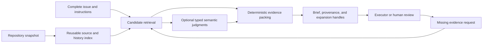

# System One briefing experiments

Recorded October 3, 2026 UTC (October 2 in America/Chicago).
Tracking issue: [#10253](https://github.com/OpenAgentsInc/openagents/issues/10253).
Source inspection and prototype input revision:
`682d958c7eb24a4dc32ed503965f4c103919cd77`.

This extends the [independent efficiency audit](README.md). Its historical
head-to-head results stay frozen at their original revisions. This extension
adds a preparation architecture, isolated experiments, and a runnable
baseline; it makes no new claim about agent completion quality or Jev savings.
Production routing and Claude's concurrent work remain separate.

## 1. What the TypeSafe material adds

The requested `docs/typesafe/` directory is retained as
[`docs/research/typesafe/`](../../research/typesafe/). This audit reads all
three documents in full: 2,066 lines, about 21,700 words.

| Retained source | Useful theory | Application to this audit |
| --- | --- | --- |
| [June AI Council talk](../../research/typesafe/2026-06-19-ai-council-diogo-almeida-transcript.md), especially lines 331–430, 671–695, 746–784, and 1037–1051 | Choose the computational task and expose intelligence through types that software consumes | Make relevance, evidence coverage, and expansion distinct judgments with deterministic consumers |
| [July AI Engineer talk](../../research/typesafe/2026-07-31-ai-engineer-diogo-almeida-transcript.md), especially lines 300–328 and 376–438 | Richer software primitives and calibrated decisions can expose capabilities that a conversational interface obscures | Represent alternatives and uncertainty explicitly; measure whether the selected evidence helps the implementation |
| [September a16z conversation](../../research/typesafe/2026-09-28-a16z-jev-transcript.md), especially lines 151–160, 363–382, 410–450, and 521–550 | Structured state, reusable software investment, and robustness matter; intelligence per dollar and per second can differ | Prepare reusable repository facts in advance; test irrelevant input changes; measure cold cost, warm latency, and amortized outcomes separately |

These are architectural arguments from public talks, not controlled coding
results. The July transcript explicitly describes the proposed training
objective as calibrated decision-making and says it is not RLVR; the video's
short description should not override the transcript. The September
conversation distinguishes service availability, identical output, and
robustness to irrelevant changes. None alone establishes useful automation.

The resulting hypothesis is concrete:

> A program that gathers exact repository facts, asks narrow semantic
> questions, and assembles a cited brief can reduce the discovery work a
> capable coding agent repeats on each issue.

This is more ambitious than shortening the initial prompt. Preparation can
inspect a broad set of candidates, connect them to requirements, retain
uncertainty, and expose a small expandable view. The executor spends its
context on solving the remaining problem. Code and System One have distinct
jobs:

- **Code:** source identity, parsing, exact extraction, dependency traversal,
  candidate enumeration, cache invalidation, budgets, formatting, and checks.
- **System One:** judgments about behavioral relevance, which requirement a
  span supports, whether a test exercises a behavior, and which missing
  evidence is worth retrieving next.
- **Executor:** open-ended diagnosis, design, implementation, and recovery
  when the prepared evidence does not settle the task.

The current [TypeSafe skill](../../../.agents/skills/typesafe-ai/SKILL.md)
and official docs support this decomposition. In particular, selecting from
pre-parsed candidates lets code copy exact values after the semantic choice.
For a brief, those values can be source spans and commit records.
[Source selection cookbook](https://docs.typesafe.ai/cookbooks/pre_parsed_value_extraction_cookbook).

## 2. Compile a briefing in stages

Treat a briefing as a rendered view of a structured evidence record. Separate
the amount preparation may inspect from the amount the executor initially
receives. A large preparation budget need not become a large executor prompt.



| Component | Input | Output contract | Work to prepare ahead of time |
| --- | --- | --- | --- |
| Issue acquisition | Repository and issue identity, or saved JSON | Full title/body, issue URL, update time when available, content digest, acquisition timing | Cache issue records with explicit freshness |
| Repository snapshot | Commit, path scope, optional separately identified dirty overlay | Exact source identity and explicit omissions | Capture reusable clean blobs |
| Source index | Snapshot bytes, parser and extractor versions | Paths, declarations, exact ranges, package facts, test candidates, parse limitations | Parse once per changed blob; maintain lookup tables |
| Candidate retrieval | Issue text, explicit references, prepared indexes | High-recall candidate IDs and retrieval reasons | Lexical postings, path lookup, graph adjacency |
| Semantic selection | Complete task, requirement spans, bounded candidate records | Raw typed judgments, model/question identities, cost and timing | Reuse task-independent semantic attributes when valid |
| Evidence packing | Candidates, judgments, requirements, optional-evidence budget | Exact spans, coverage states, omissions, expansion handles | Tune policy with replayed judgments |
| Rendering | Structured briefing | Readable Markdown and machine-readable JSON | Stable templates |
| Outcome measurement | Brief plus an independently checked run | Rereads, missing evidence, correctness, total cost and time | Retain paired experiment records |

Keep the original issue and admitted instructions complete. Budget optional
source evidence separately. An extracted requirement list helps coverage
accounting, but cannot replace the original request: prose clauses, examples,
negative constraints, and the last line can all change acceptance. Preserve
oversized input or return an explicit capacity error instead of silently
clipping it.

For every source candidate, retain its path, blob or content digest, line and
byte bounds where available, extraction method, exact excerpt, freshness,
and any truncation. Keep these evidence categories distinct:

- A declaration is observed syntax.
- An identifier occurrence is a text match.
- A resolved reference depends on semantic analysis and its configuration.
- A Cargo edge is a package dependency.
- A historical co-change is a search lead.
- A test is a candidate check until its behavior is inspected.
- A retained passing result applies only under a recorded reuse rule.

A ranked candidate does not prove coverage, authorize an edit, or establish
that a check passed. Those distinctions make the output more useful: the
reader can see exactly what to inspect and what remains unknown.

## 3. Make repository traversal reusable

### Existing pieces and gaps

The inspected repository has several useful components to reuse or compare.
These observations refer to the inspection revision above.

| Existing component | What it provides | What a fast preparation path still needs |
| --- | --- | --- |
| [Repository map](../../../crates/plugin-repo-map/src/lib.rs) | Bounded path/size inventory and manifest/test-looking paths; deliberately removed its old symbol outline | Persistent source symbols and relationships |
| [Code search](../../../crates/plugin-code-search/src/lib.rs) | Bounded literal/wildcard matching over granted file text, with truncation | Reusable lookup instead of scanning file contents for each request |
| [Delegate survey](../../../crates/coder-delegate/src/judge.rs) | Explicit and keyword-ranked source candidates | Revision-bound reuse and query latency accounting |
| [Syntax highlighting](../../../crates/code-highlight/src/lib.rs) | Tree-sitter grammars and highlight ranges | Dedicated extraction queries and persisted source facts |
| [Landing checks](../../../crates/coder/src/task/landing.rs) | Cargo package impact in both dependency directions | Cached package/configuration identity and separately evaluated test impact |
| [Snapshot observation](../../../crates/coder-boundary/src/snapshot/observe.rs) | Safe exact-byte digest reuse and change observations | A persistent retrieval index with complete invalidation |
| [Knowledge retrieval](../../../crates/knowledge/src/search.rs) | BM25, optional embeddings, and digest/model-bound vector reuse | Code-domain candidates and graph relationships |
| [Coverage packer](../../../crates/coder-delegate/src/pack.rs) | Requirement-aware slices, omissions, and expansion concepts | Integration that preserves all mandatory issue and instruction text |

A persistent symbol index is a new component in these inspected paths. A
`tree-sitter` dependency or transitive `syn` dependency alone does not mean
that the product already has one.

### Start with syntax, then buy semantic resolution where it helps

**Lexical and declaration baseline.** Extract explicit paths, identifiers,
error strings, file terms, and declaration names. Cache source bytes and
recent history at a commit. This provides a cheap, understandable baseline
for every later experiment. It cannot resolve overloaded methods or infer
behavior reliably from names.

**Tree-sitter extraction.** Add language queries for functions, types,
modules, imports, attributes, error strings, tests, and enclosing bodies.
Store exact spans and parse-error flags. Tree-sitter supports concrete syntax
trees, pattern queries, and incremental reparsing from an edited old tree.
These can avoid repeated full parsing. They do not resolve a Rust method
across traits or macros.
[Parsing](https://tree-sitter.github.io/tree-sitter/using-parsers/2-basic-parsing.html),
[queries](https://tree-sitter.github.io/tree-sitter/using-parsers/queries/1-syntax.html),
[incremental updates](https://tree-sitter.github.io/tree-sitter/using-parsers/3-advanced-parsing.html).

Cache syntax facts by `(blob digest, language, grammar version, query version)`.
Bind path-dependent module facts separately. Keep text edits and digests as
invalidation inputs: a structural changed-range API is not a complete rule
for invalidating literal values, extracted text, or semantic judgments.
[Tree-sitter changed ranges](https://docs.rs/tree-sitter/0.27.0/tree_sitter/struct.Tree.html#method.changed_ranges).

**Rust AST alternative.** `syn` can parse valid Rust files and expose item and
expression structure with spans. Compare its extraction quality with
Tree-sitter for committed source. Tree-sitter's handling of incomplete code
and incremental edits is attractive for working trees. Neither parser alone
provides whole-workspace name or type resolution.
[Syn documentation](https://docs.rs/syn/latest/syn/).

**Semantic index.** A warm rust-analyzer service can answer definitions,
implementations, and references, including relationships affected by macro
expansion and the crate graph. Its architecture separates file syntax from
semantic analysis tied to a crate and configuration, with lazy incremental
queries. Use a supported IDE/LSP boundary rather than assuming internal HIR
crates are stable APIs.
[Architecture](https://rust-analyzer.github.io/book/contributing/architecture.html),
[features](https://rust-analyzer.github.io/book/features.html).

Provision workspace loading outside the query path. Record target, features,
cfgs, toolchain, generated inputs, proc-macro and build-script policy. Turning
those facilities off can reduce work while also reducing semantic coverage.
A cached resolved edge needs these inputs in its identity. Syntax, semantic
resolution, and runtime reachability remain different claims.
[Configuration](https://rust-analyzer.github.io/book/configuration.html).

**Package and test graph.** Cache Cargo metadata, manifest ownership, target
names, reverse dependencies, and nested workspace boundaries. Combine them
with test attributes, assertions, imported symbols, and prior checked changes
to generate test candidates. A package edge or shared identifier is a useful
lead; measure actual behavioral coverage before selecting fewer checks.
The briefing can suggest checks without putting compilation on its critical
path. It must mark them `not_run` unless it has applicable results.

### History belongs in preparation

Build a bounded recent-commit map at the indexed revision. Use commit subjects,
touched paths, renames, issue references, and links as retrieval evidence.
For shortlisted paths, later expansion can use `git log -- <path>`, `git log
-S` or `-G`, and blame. These more expensive operations need their own budgets.

History can answer useful questions before an executor starts:

- Which recent change introduced the relevant branch or error string?
- Did a fix in this area require a test or consumer change elsewhere?
- Does a revert explain a tempting approach that failed?
- Is an interface's unusual behavior intentional, with a sourced rationale?
- Which current implementation superseded the historical one?

Store ancestry, commit identity, exact source text, and current applicability
separately. Commit messages describe intent; current source establishes
present behavior. Co-change is not causality. A stale decision remains useful
as history if its validity is unresolved. Record shallow or bounded history
as incomplete.

For historical experiments, index only ancestors of the pre-fix snapshot.
The issue's eventual patch can help label evaluation cases after retrieval,
but its contents, tests, later comments, and commit message must not enter
preparation inputs. Freeze the issue body and comments as of the same historical
cutoff. If only an edited final issue survives, label the case reconstructed
and keep it out of strict historical comparisons. Otherwise the experiment
measures access to the answer.

### Invalidation and amortization

Reuse immutable blobs across checkouts. Keep dirty and untracked overlays
separate, with explicit identities. A watcher can mark likely changes, but
branch switches, missed events, renames, deletions, and restarts need
reconciliation. A prototype that only supports committed snapshots should
say so and reject a revision mismatch rather than implying it sees local edits.

Invalidate path-dependent relationships after moves; package relationships
after manifest or configuration changes; instruction applicability after
`AGENTS.md` changes; and semantic judgments after any relevant evidence or
question meaning changes. A body edit may leave a signature index valid
while invalidating a behavior judgment. Cache keys for model answers include
state digest, question/criteria version, model identity, and relevant source
identities. Do not flatten away the raw answer distribution.

For `N` uses of a prepared snapshot, report:

```text
preparation cost per task = initial index cost / N
                         + allocated update cost
                         + online retrieval and selection cost

accepted outcome cost = preparation + executor + checks + failed attempts
                        + retries and integration
```

A cold one-off repository may favor on-demand scanning. A frequently used
stable repository can amortize richer extraction and semantic metadata.
Measure both. Replaying saved judgments makes policy iteration inexpensive;
it does not measure current model latency or robustness.

## 4. Concrete System One components

The next integration should consume the deterministic candidate records.
Begin with a small fixed pool and one batch, then expand when missing evidence
is visible. This keeps the model's contribution observable.

### Questions that produce usable data

The following are proposed question meanings, not an implemented API payload.
Each question must name the relevant state fields in its instructions; an ID
such as `relevance_7` does not convey those semantics to the model.

| Judgment | Primitive and proposed criteria | Consumer |
| --- | --- | --- |
| Does source span S provide evidence needed to implement requirement R? | Noul; yes means the actual content helps decide the behavior, rather than only sharing vocabulary | Requirement-to-evidence coverage table |
| How directly does candidate S bear on the requested behavior? | Score: unrelated; orientation only; dependency or supporting behavior; direct implementation or decisive assertion | Comparable per-candidate ranking |
| Which candidate defines the explicitly named behavior? | Choice over source IDs and a no-match option | Exact source lookup; no generated paths |
| Does test T exercise requirement R? | Noul over the test body and assertion, with unknown context exposed | Test evidence ordering |
| Is the evidence sufficient to decide this named question? | Noul with explicit missing-evidence criteria | Preserve unknowns or schedule expansion |
| Which available expansion is most useful next? | Choice over known callers, body, tests, history, and stop/no useful expansion | Bounded retrieval action |
| Does historical decision D still apply to this change? | Noul over the original decision, its scope, and current source | Include as current rationale or mark applicability unresolved |

Noul returns probability of yes; 0.5 is uncertainty, not medium usefulness.
Use Score for degree. Choice represents one exclusive selection, so use
separate Noul questions when several candidates can be relevant together.
[Noul semantics](https://docs.typesafe.ai/primitives/noul),
[Choice semantics](https://docs.typesafe.ai/primitives/choice),
[Score semantics](https://docs.typesafe.ai/primitives/score).

Do not multiply correlated answers into a claimed probability that the whole
task succeeds. Fit thresholds to labeled failure costs. Missing a necessary
constraint usually matters more than including one extra source span.
Confidence describes the distribution; correctness and coverage still need
independent labels.
[Confidence](https://docs.typesafe.ai/confidence).

### Ask independent questions together

Candidate relevance, requirement coverage, test relevance, and evidence
sufficiency can share one request when all their input evidence already
exists. Each question is independent and cannot read another answer. Include
speculative branch premises in the questions and let code consume the useful
answers. A second request is appropriate when the first answer determines
which new source to fetch or which options to construct.
[Speculative fan-out](https://docs.typesafe.ai/patterns/fan-out).

Test three scheduling choices with identical questions and evidence:

1. Serial single-question requests.
2. Concurrent requests with a stated concurrency bound.
3. One shared-state batch, plus bounded-size batches for larger candidate sets.

Measure all billed input, question count, candidate count, latency distribution,
and selection quality. A larger batch saves repeated state but can spend work
on irrelevant questions and enlarge the shared payload.

A TypeSafe [parallel-questions demonstration](https://docs.typesafe.ai/cookbooks/parallel_questions)
reports 13 questions over a 53,777-character document: $0.000497 and 0.27 seconds
for a batch versus $0.006090 and 2.71 seconds for serial requests, averaged over
five repeats with `jev-1.12`. This motivates a batching experiment. It is vendor
evidence on a document workload, not our latency or a coding speedup. Its
summary comparison does not compare every full output distribution. Concurrent
single requests also change the latency comparison.

### Select, pack, and expand

Use code to union candidates from explicit paths, lexical matches, syntax,
package relationships, and history. Semantic ranking cannot recover a source
that the candidate generator omitted. Measure recall before ranking.

Then compare three packers over the **same pool and byte budget**:

- Lexical top-k.
- Semantic top-k.
- Requirement coverage with semantic relevance, duplicate-range elimination,
  exact byte costs, and explicit unknowns.

A greedy coverage selector is an adequate first experiment: insert mandatory
text, select evidence that adds the most uncovered requirement support per
byte, merge overlaps, and expose omitted candidates. Do not treat its weighted
score as a probability. Store separate judgments so weights and budgets can
change without another model request.
[Composite scoring](https://docs.typesafe.ai/patterns/composite-scoring).

Add progressive disclosure: file cards and signatures first, selected bodies
next, then callers, tests, or history. Retain several plausible branches when
evidence is ambiguous. Pair forced-choice selection with a separate
answer-existence judgment so a ranked candidate does not imply a match exists.
[Semantic search example](https://docs.typesafe.ai/cookbooks/semantic_find).

The [skill-suggestion cookbook](https://docs.typesafe.ai/cookbooks/skill_suggestion)
provides an adjacent two-stage example: in its 488-request study, wrong first
loads fall from 16.8% to 7.3% on 315 covered requests, and needless loads
from 9.8% to 4.0% on 173 uncovered requests. The test
includes requests generated from the skill roster and scores the first
response. It supports testing progressive selection, without establishing
completed coding-task gains.

### Reusable semantic metadata and verification

Precompute a small set of stable attributes: persistence, authorization,
retry behavior, serialization boundaries, and test behavior. Store exact
supporting spans and validity inputs. Keep issue-specific relevance online.
Start with frequently retrieved modules so amortization is measurable.

A separate verifier can check a proposed brief claim against its cited source.
Code checks identity and exact bytes; System One can assess semantic support.
This is most valuable for inferred or generated claims. An extractive brief
already gets text fidelity from code. Measure unsupported-claim detection,
false alarms, omissions, and added rereads; a second model opinion is not
independent ground truth.

Retained conversation decisions are another possible index: exact decision,
source message, affected symbols, revision, and validity conditions. Preserve
the difference between a plan, an attempt, an observed result, and a landed
change. A new message can refine an existing objective. Evaluate corrections
and supersession explicitly before replacing longer history with this record.
This prototype uses public issue text and Git history only.

## 5. Define the one-second target precisely

The useful first target is **a fresh CLI process producing a readable brief
from an existing local index and cached issue in under one second**. Measure
through output-file completion, including index load, candidate selection,
packing, rendering, and process startup. Report p50, p95, maximum, and misses.

Keep these additional clocks visible:

| Clock | Included work |
| --- | --- |
| First use | Clone, tool build, full indexing, initial issue fetch |
| Update | New source extraction, relationship invalidation, index write |
| Warm deterministic preview | Process startup, local input load, retrieval, rendering, file write |
| Live issue command | Warm preview plus GitHub acquisition and any refresh |
| Semantic enrichment | Model queue/network/inference, retries, and later rendering |
| Completed issue | All preparation, executor work, independent checks, retries, and integration |

GitHub and model round trips have latency tails. Report their observed values
without promising that an uncached arbitrary issue or cold repository always
finishes within one second. Offer an immediate deterministic brief when a
semantic result is pending; display the later revision and its provenance.
A missing index should produce a clear preparation step rather than quietly
including a multi-minute build in the preview command.

A proposed warm engineering budget is 150 ms input load, 150 ms retrieval,
200 ms graph/history lookup, 100 ms packing/rendering, and 400 ms headroom.
These are targets to allocate work, not measurements. A remote semantic call
gets a separate measured budget until evidence supports including it in the
one-second target.

## 6. Components to test in isolation

Use a fixture per issue: complete issue bytes, the pre-fix source revision,
requirements, necessary evidence with acceptable alternatives, and independent
acceptance criteria. Store inputs and outputs as versioned JSON plus a readable
brief. The first suite can run without an executor or model.

| Experiment | Fixed inputs and treatment | Primary measurements | Decision it enables |
| --- | --- | --- | --- |
| Candidate retrieval | Same issue/snapshot; lexical vs lexical plus declaration names vs Tree-sitter spans | Necessary evidence recall at 8/16/32 candidates and matched source-byte budgets; no-match rate; query latency | Whether structural extraction earns its complexity |
| Relationship expansion | Same initial pool; package neighbors vs syntactic occurrences vs resolved references | Added necessary evidence per byte and per millisecond; false associations | Where semantic resolution is worthwhile |
| History | Same current source; history off vs subjects/path map vs targeted diff/blame | Useful rationale recovered; stale facts; preparation time | Which history belongs in the default brief |
| Requirement extraction | Full raw issue; line/checklist spans vs semantic span selection | Lost constraints, false splits, tail retention, exact-text fidelity | Whether a semantic requirement pass improves packing |
| Semantic ranking | Same candidate pool/budget; lexical vs one typed batch vs oracle selection | Useful precision, necessary evidence recall, calibrated errors, model cost | Whether ranking or retrieval is the bottleneck |
| Batch scheduling | Identical state/questions; serial vs bounded concurrent vs shared batch | Full distributions, selection stability, billed tokens, p50/p95 | Cheapest useful call shape |
| Packing | Same candidates/judgments; top-k vs coverage/novelty selector | Requirement coverage per byte, duplication, partial spans, omissions | Which deterministic policy to ship |
| Expansion | Same maximum budget; fixed brief vs adaptive source reads | Missed branches, extra reads, time until sufficient evidence | Whether a smaller first brief saves total work |
| Cache | Chronological revisions; no cache vs exact facts vs semantic metadata | Initial/update cost, amortized cost, stale outputs, warm latency | Which reusable work pays for itself |
| History state | Same multi-turn task with corrections; recent text vs summary vs sourced decisions | Constraint recall, superseded facts, repeated work | Whether structured task memory is useful |
| Brief verifier | Labeled correct/incorrect source associations | Error recall, false alarms, cost, forced rereads | Whether semantic verification improves reliability |
| Whole briefing | Same native executor; no preparation vs deterministic vs semantic preparation | Accepted outcomes, total cost/pass, elapsed time, rereads, repair steps | Whether component improvements survive integration |

Normalize extracted candidates to comparable source spans, or compare recall
at a shared source-byte budget. A file, declaration, and AST span are different
units; top-k alone can reward a treatment for returning larger chunks.

### Fast iteration protocol

1. **Freeze a small development panel.** Include exact-path issues,
   symptom-only bugs, cross-crate changes, renamed symbols, missing tests,
   documentation tasks, long multi-clause requirements, and absent evidence.
   Add multiple repositories and languages before claiming generality.
2. **Label requirements and evidence.** A final patch is a useful weak label,
   not a complete oracle. Necessary evidence can be read without being edited;
   valid solutions can touch different files. Review ambiguous alternatives.
3. **Run deterministic components first.** Replay cached issue/index inputs
   across flags and budgets. Compare the selected spans and omissions directly.
   Do not pay for an executor to discover a missing candidate or clipped tail.
4. **Collect one semantic judgment record per frozen state.** Reuse it to
   tune deterministic packing and thresholds. Record model identity, questions,
   raw distributions, timings, and charges. Repeat fresh calls separately to
   measure service variability and calibration.
5. **Test robustness.** Reorder candidates, add irrelevant UUIDs, duplicate
   descriptions, vary harmless whitespace, and use equivalent phrasing. Also
   change the actual requirement and verify that selections respond. Include
   lookalike symbols in unrelated packages and missing-evidence cases.
6. **Hold out task families and later revisions.** Tune on development data,
   freeze policy, then evaluate once on held-out cases. Report per-family and
   workload-weighted results; frequent small tasks can dominate aggregate savings.
7. **Launch matched native-agent trials only for promising treatments.** Keep
   model, effort, tools, caching, permissions, source, checks, and retry limits
   fixed. Pair cases and alternate run order. Charge every preparation and
   failed attempt to its treatment.

Suggested initial acceptance targets are hypotheses: zero clipped mandatory
bytes, zero stale source references, at least 95% labeled necessary-evidence
recall on the development panel, and warm p95 below one second. Report exact
counts and uncertainty; a tiny all-pass panel does not establish a 95%
population guarantee. Choose a downstream non-inferiority margin before trials,
then report cost and latency only alongside completion quality.

Classify failures by stage: acquisition, stale snapshot, missing candidate,
wrong semantic relation, packing omission, bad expansion, unsupported claim,
service failure, or executor error. This keeps a retrieval miss from becoming
an undiagnosed claim that System One failed.

## 7. Runnable prototype and measurements

The new [`briefing-lab` crate](../../../crates/briefing-lab/README.md) and
[`briefing-preview.sh`](../../../scripts/briefing-preview.sh) implement the
first deterministic baseline in Rust. The shell wrapper accepts a GitHub issue
URL, a number with `--github-repo`, or cached issue JSON. It produces
`briefing.md` and `briefing.json` outside the inspected checkout.

### Run it

Build on the approved build host, using its persistent target directory. The
wrapper requires a prebuilt binary and never launches a Cargo build on the
owner's Mac. Run these commands on the machine with that binary and checkout:

```sh
export CARGO_TARGET_DIR=/home/user/work/openagents-target-agent3
cargo build -p briefing-lab --release --locked
export BRIEFING_LAB_BIN="$CARGO_TARGET_DIR/release/briefing-lab"

scripts/briefing-preview.sh --repo "$PWD" \
  --rev 682d958c7eb24a4dc32ed503965f4c103919cd77 \
  --issue https://github.com/OpenAgentsInc/openagents/issues/10250 \
  --output-dir /tmp/briefing-10250
```

The first call builds an index and fetches the issue. For repeated local
experiments, save the issue once and reuse the index:

```sh
gh issue view 10250 --repo OpenAgentsInc/openagents \
  --json number,title,body,url,updatedAt > /tmp/issue-10250.json

scripts/briefing-preview.sh --repo "$PWD" \
  --rev 682d958c7eb24a4dc32ed503965f4c103919cd77 \
  --index /tmp/briefing-10250/index.json \
  --issue-file /tmp/issue-10250.json \
  --output-dir /tmp/briefing-10250-warm
```

Change the issue URL or cached JSON to inspect another issue against the same
repository snapshot. A different repository needs its own index. Rebuild when
you choose a new commit. Preview rejects an index for a different revision.

Add `--no-symbols`, `--no-history`, or `--no-lexical` to compare components.
The original issue stays complete in every treatment. Explicit referenced
paths and selected ancestor context remain eligible with all three disabled.

### What exists and what remains experimental

| Implemented baseline | Follow-up experiment |
| --- | --- |
| Commit-bound metadata cache with path terms and Rust declaration-name hints | Tree-sitter spans, resolved semantic edges, inverted postings, incremental updates |
| Up to 64 MiB of attempted source reads, 10,000 files, 512 KiB per file | Per-repository budgeting and larger coverage studies |
| Exact selected Git blobs and path-to-commit verification | Dirty/untracked overlays and live invalidation |
| Full issue title/body and exact selected source excerpts | Requirement extraction and coverage-aware selection |
| Lexical ranking, declaration hints, and 32 recent commit subjects | Batched System One ranking, path history, blame, co-change, semantic history applicability |
| Eight ranked files plus ancestor context, at most 14 excerpts of 64 lines | Syntax-boundary packing and adaptive expansion |
| Timings, digests, omissions, and component switches | Matched executor outcomes and amortized semantic cost |

The index stores searchable metadata, and preview fetches only selected
source blobs. The bounds still omit some material, which every preview
reports. Source and instruction coverage need their own evaluation before
this becomes an executor's default preparation path.

This is a retrieval preview. It does not certify complete repository
instructions or behavioral coverage. Ancestor instructions can be partial
64-line excerpts; a production handoff must load all applicable instructions
separately. The tool includes no issue comments, dirty files, resolved call
graph, test execution, or model call. Paths containing spaces are not reliably
recognized as explicit references. Cached terms and history are local ranking
hints; selected source bytes are checked against Git before rendering.

### Measured results

The [retained measurement record](briefing-measurements.json) contains all raw
warm timings, component selections, source and binary hashes, and host metadata.
The [benchmark script](benchmark_briefing.py) launches a fresh process for each
preview and independently checks issue preservation and every selected source
excerpt against Git. See the [sample briefing](briefing-example.md) and its
[structured evidence](briefing-example.json).

Environment: isolated Boat Linux x86-64 sandbox, 8 logical CPUs visible, AMD
Ryzen 9 9950X host CPU, Rust 1.97.1, release binary. Inputs are the pinned
OpenAgents revision above and three saved public issues. These are current
issue records for a timing/inspection exercise, not reconstructed pre-fix
outcome trials. The OS cache was not flushed.

| Cached issue | Fresh CLI runs | p50 | p95 | Maximum | Runs at or above 1 second |
| --- | ---: | ---: | ---: | ---: | ---: |
| #10250: Codex lean session | 20 | 238.2 ms | 240.9 ms | 243.0 ms | 0 |
| #10162: standing agent comparison | 20 | 236.2 ms | 240.5 ms | 242.1 ms | 0 |
| #10253: this audit and prototype | 20 | 240.6 ms | 247.0 ms | 248.1 ms | 0 |

Each elapsed value includes process startup and exit, local index/issue load,
Git source verification, assembly, and completed output writes. Quantiles use
nearest rank. The three cached shell-wrapper runs took 239.7, 239.1, and
241.3 ms. Component-disabled treatments ran once per case as selection smokes;
those single observations are not comparative latency estimates.

Index construction in the existing clone took **1,806.2 ms**, including process
and output overhead. The 19,822,302-byte JSON index covers **5,294 files** from
27,642 tree entries. It reports 22,172 excluded generated/archive/unsupported
entries and 176 omitted by the index budget. Clone and toolchain/build setup
are outside that measurement. This is an initial index build with existing
Git objects, not a cold-machine claim.

The [local GitHub acquisition observations](briefing-fixtures/fetch-timings.json)
were 425–502 ms, one read per issue on the Mac. They are separate observations
on another machine, not an end-to-end latency distribution. The wrapper times
its own live fetch. The warm result establishes subsecond deterministic
previews on this setup; it establishes no remote-model or arbitrary-network
latency guarantee.

**Quality inspection:** #10250 retrieves its explicit design-document path,
relevant cost material, and current task defaults, but also selects several
historical `coder-one` files. Its default shortlist misses the modern
`microcoder` session implementation, and the design-document excerpt begins
at the first lexical match rather than the specific section the issue names. The exact-source checks pass; behavioral
relevance has not been scored on a labeled panel. This is a concrete reason
to test better candidate retrieval and semantic selection before handing the
brief to an executor. Fast retrieval is the completed result; useful coverage
remains an independently measured question.

**Observed optimization lead:** in the final sample for each case, index and
issue JSON loading costs about 150 ms, while assembly costs 44–48 ms and
selected Git validation/reads cost 4–6 ms within assembly. These nested timers
must not be summed as independent phases. A compact persistent index or
long-lived read-only process is a testable latency improvement. A better
ranker is a separate quality improvement. Keep both comparisons independent.

### Reproduce and verify

After building the binary, run this on the approved build host:

```sh
python3 docs/audits/2026-10-03-independent-efficiency/benchmark_briefing.py \
  --binary "$CARGO_TARGET_DIR/release/briefing-lab" --repo "$PWD" \
  --rev 682d958c7eb24a4dc32ed503965f4c103919cd77 \
  --issues docs/audits/2026-10-03-independent-efficiency/briefing-fixtures/10250.json \
    docs/audits/2026-10-03-independent-efficiency/briefing-fixtures/10162.json \
    docs/audits/2026-10-03-independent-efficiency/briefing-fixtures/10253.json \
  --output /tmp/briefing-measurement --repeats 20
```

Completed validation:

- `cargo test -p briefing-lab --locked`: all 12 regression tests pass on Boat.
- `cargo fmt -p briefing-lab -- --check`: passes.
- `cargo build -p briefing-lab --release --locked`: passes.
- `bash -n scripts/briefing-preview.sh`: passes; cached wrapper runs succeed.
- Sixty default previews and nine component-disabled previews preserve the
  issue and independently verified selected Git source bytes.
- Measurement source hashes match the committed implementation; local document
  links and `git diff --check` pass.

The tests cover stale/missing revisions, long requirements, missing/excluded
paths, no-match cases, deterministic selection, corrupt metadata, exact CRLF
and terminal newlines, path/blob binding, and output boundaries. No local Mac
Cargo build, paid model call, production route change, or deployment ran.

## 8. Recommended implementation sequence

1. **Keep the deterministic preview independently runnable.** It is the
   regression baseline, human inspection tool, and immediate fallback.
2. **Add Tree-sitter as one extraction treatment.** Compare exact declaration
   and enclosing-body retrieval with the baseline before adding a graph.
3. **Add bounded relationship and history treatments.** Measure recall and
   noise separately. Add rust-analyzer only for unresolved cases that matter.
4. **Add one typed semantic selection batch.** Reuse existing Rust SDK and
   caller contracts; retain its raw judgments and cost. Compare with the exact
   same deterministic pool and executor evidence budget.
5. **Tune coverage packing and progressive expansion with replayed records.**
   Keep complete requirements and source provenance as invariants of the tool.
6. **Measure reuse across a chronological issue stream.** Include index builds,
   updates, stale-record defects, and semantic invalidation costs.
7. **Run the standalone Claude/Codex comparisons from the parent audit.**
   Determine whether stronger preparation reduces accepted-outcome cost or
   waiting time while preserving completion quality.

The opportunity is to invest in maintained software that makes context useful
before an expensive agent turn starts. The prototype establishes a measurable
entry point. The experiments identify which extra determinism, source
structure, and semantic judgments actually help.
