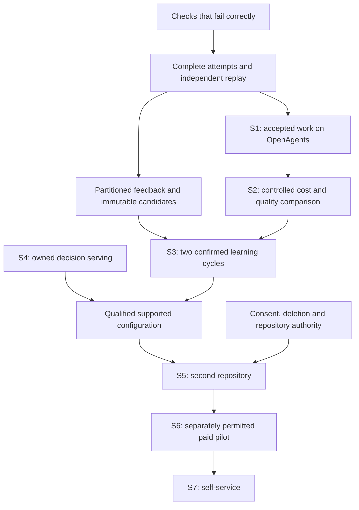

# Roadmap and acceptance

The next milestone is a trustworthy, measured loop on this repository. The repository already has enough components to attempt it. The priority is to make failure, learning eligibility, cost, and promotion agree across those components.

This is an audit recommendation, not a newly authorized backlog or deployment plan. Existing issues remain the owners of their stated scope. A missing integration below needs a small issue after checking the current board and claims; this audit creates none. The [issue map](08-issue-map.md) records the snapshot, and the [method](10-method-and-verification.md) explains the evidence limits.

## Order of work

S4 work can proceed in parallel. Replacing a judge provider does not repair a verifier or establish S2/S3. A bounded manual pilot can test demand earlier under the existing offer, provided it does not claim recursive gains or use customer data for research without the separate agreement.

## Prioritized action register

Priorities express this product's dependency order. **P0** means the success signal cannot be trusted for autonomous acceptance or learning until repaired. **P1** blocks a named product gate or can invalidate its result. **P2** improves efficiency, usability or scale after the relevant boundary works. These are not inherited security severity scores. Effort is deliberately not estimated from source size; owners should size a focused implementation after reproduction.

| Action | Priority and owner area | Dependency or existing work | Required result |
| --- | --- | --- | --- |
| A01. Make `verify` and `finish` honor actual execution results | P0, `briefed-agent` | RUN-01 | Nonzero exit, spawn error, timeout, invalid output, missing target and zero required tests cannot become success; formatting policy is explicit |
| A02. Bind verification reuse to complete candidate content | P1, `briefed-agent` | RUN-02; A01 | Staged, unstaged, untracked and removed content, test scope and checker identity invalidate stale results; no proof from filenames alone |
| A03. Gate delivery on required final checks and task error state | P1, `coder-new` | RUN-03; A01 | A failed required check or agent failure cannot trigger successful delivery/PR-opening behavior; optional checks remain distinguishable |
| A04. Protect the evaluator and constrain candidate execution | P1, runner/environment | RUN-04, CODE-02 | Candidate cannot weaken authoritative acceptance, access deployment credentials or escape the workspace through a symlink; malicious tests run bounded |
| A05. Bound every check process and honor resource policy | P1, runner/`supervise`/leases | RUN-05 | Deadline, output cap, descendant cleanup, cancellation and correct build lease are enforced on all supported execution paths |
| A06. Give each new issue-run its own worktree | P1, `coder-new` | RUN-06 | Each concurrent run owns a distinct scratch tree; starting a new run cannot delete another run's active or uncaptured work |
| A07. Bind replay to checker and execution identities | P1, traces/Gym | RUN-07; A04 | Receipt binds exact base/patch/checker/environment/exit evidence; synthetic edits or tampered receipts cannot enter the accepted feed |
| A08. Make check selection explicit and consistent | P1, verifier/scoping | RUN-08 | Required checks, direct consumers and nested manifests agree; scope derivation failure is visible rather than interpreted as no affected code |
| A09. Preserve full attempt inventory and unknown costs | P1, runner/traces/Gym sales | PRODUCT-03/04/05; A01 | Failed setup, retries, cancellations and supporting costs survive export; null usage stays unknown, not zero |
| A10. Produce the own-repository S1 packet | P1, dogfood owner | A01–A09; cloud issues below | At least 20 prospectively selected distinct qualifying issues, exact attempts, independent outcomes, merge/deploy state, failures and costs |
| A11. Freeze and complete the matched S2 experiment | P1, benchmark owner | #11211; A09–A10 | 20+ issues × 3 repeats per declared arm, complete denominators, protected acceptance, no post-result exclusions, declared uncertainty |
| A12. Stop direct retrain-to-production publication | P1, finder | LEARN-01 | Candidate written separately; overlapping train/eval refused; old model remains active until protected comparison and explicit promotion pass |
| A13. Join trace and corpus partitions | P1, traces/corpus | LEARN-02, #11215 | Existing 41 traces cannot silently move calibration/development issue groups into training; one exposure map covers derived artifacts |
| A14. Correct the learning target and sampling design | P1, corpus/evaluation | LEARN-03 | Edit membership and relevance are separately defined; natural candidate distribution and issue-grouped uncertainty are measured |
| A15. Restrict authoritative feedback to eligible evidence | P1, finder/traces | LEARN-04; A07/A13 | Raw observations may support exploration, but cannot masquerade as replayed labels or bypass tenant/partition permission |
| A16. Join training, calibration, selection and serving | P1, training/Gym/Pylon | #11216/#11217; A12–A15 | Dataset, teacher exposure, recipe, head, calibration, gate and active digest form one auditable chain |
| A17. Demonstrate two learning cycles | P1, experiment owner | A11–A16 | Version N produces new eligible outcomes for N+1, then N+1 for N+2; both win prospectively under fresh protected confirmation |
| A18. Complete owned decision serving | P1 for S4, decision serving | #11225/#11220/#11191/#11192 | Declared local/remote/fallback behavior, quality/cost evidence, no required Jev key, and no provider substitution hidden in results |
| A19. Qualify cloud repo writes, integration and idle cleanup | P1, cloud/GitHub/integrator | #11226/#11227/#11228 | Scoped grants, current-main checks, serialized integration, retry recovery, cancellation and bounded idle billing |
| A20. Complete bake and host-version evidence | P1 for cloud reliability, operator tooling | #11224 closed with live bake deferred | One real authorized bake/deploy result tied to image and running commit; retain failure/recovery records |
| A21. Enforce purpose-specific data grants | P1 before customer learning, tenancy/auth | DATA-01/02/05 | Repository access, provider disclosure, research, training, publication and commercial acceptance resolve to distinct current permissions |
| A22. Remove teacher content on corpus deletion | P1, tenancy training | DATA-03 | Seeded state/question/label/teacher content is removed under the agreed policy; linked exports/caches/checkpoints are handled explicitly |
| A23. Namespace and filter repository feedback | P1 before S5, finder | DATA-04 | Same-basename repositories, same issue numbers and different tenants never share caches or feedback without a declared authorized operation |
| A24. Qualify two-workspace isolation and revocation | P1 before S7, gateway/cloud | #11190, DATA-06–10 | One workspace's load, credentials, artifacts or grants cannot affect another's allowance/data, including workspaces sharing a registry tenant; revoked authority stops new effects |
| A25. Run a second-repository study | P1 for S5, product/evaluation | A17/A21/A23 | Rebuild from only that repository's authorized history; report cold start and adaptation separately, with no cross-repo leakage |
| A26. Reconcile the offer and measure one buyer | P1 for S6, sales/operator | PRODUCT-02/06 | Exact offer, payer of failed attempts, support cap, acceptance, collection/refund and separately permitted improvement chart |
| A27. Connect service acceptance and earned-sale display | P2, sales/receipts | PRODUCT-08 | Valid accepted service without a separate fulfillment supplier displays consistently; no projection creates payment authority |
| A28. Measure whole-operation margin | P1 for outcome pricing, Gym finance | PRODUCT-05, A09/A26 | Cash and fully loaded costs, failed work, labor, training amortization and unknown amounts visible for the same cohort |
| A29. Connect current claims to appropriate evidence | P1 for publication, promises/sales | PRODUCT-07, CODE-05 | Source-reference checks supplemented by dated measured evidence; source implementation, fixture, live qualification and activation distinct |
| A30. Preserve replay through history/artifact migration | P1 before history rewrite, repository tooling | #11116, CODE-06 | Mapping and manifests preserve authorized replay or explicit unavailability; no silent rebasing of old training examples |
| A31. Reduce measured build and repository overhead | P2, owning crates/tooling | CODE-04; earlier health actions | Same-workload before/after timing; scoped compatibility checks; research/history preserved without burdening every run |
| A32. Add post-acceptance quality and rollback reporting | P1 for durable value, task/deploy owners | A09/A17/A19 | Reverts, escaped defects, support and model rollback join the original attempt; delayed failures update future eligibility without rewriting history |

The register groups related findings. It is not a request for one 32-part issue. In particular, A01, A02, A03, A22 and A23 are small enough to reproduce and address independently. Existing commercial work, health fixes and device releases can continue while the experiment runs.

## Gate packets

### S1: Our repository runs through the actual loop

Freeze the selected issue set and exclusion rules before execution. Include a useful mix of behavior changes, regressions, generated artifacts and documentation, with each reported separately. The spec calls for 20+ V1 issues; repeated attempts or repeated historical replay of one issue do not increase that count.

For each selected issue, retain repository and issue snapshots, accepted scope/checks, execution bundle, full attempt tree, all cost components, independent replay, review decision, merge identity, and deployment state where applicable. A check failure, setup failure, timeout, owner-only dependency, rejected patch or cancelled attempt remains in the inventory. A task that needs no deployment should say so rather than invent a deploy event.

S1's operational evidence should exercise interruption, restart, cancellation, a changed remote main, an integration conflict, exhausted provider capacity and an unavailable model. These can be qualified with isolated deterministic fixtures before a small authorized live run. The audit itself launches none.

**Pass:** the frozen qualifying set is independently accounted for, and accepted work follows the claimed path. **Fail or incomplete:** lost attempts, unverifiable outcomes, missing required checks or task records that cannot be joined. A high success rate does not excuse a missing denominator.

### S2: Better cost with adequate quality and latency

Use #11211's larger matched design against **bare Claude Code**, the specification's named baseline: at least 30% lower cost per accepted PR, equal or better success, and no worse median time on 20+ issues × 3 runs. Pin baseline and candidate configuration, issue/base, resource policy, model settings, verifier and budget. Randomize or balance arm order so provider load and cache warmth do not systematically favor one arm. Separate list-price estimates, billed dollars and subscription capacity. Keep missing bills unknown. Count replays and support, not only model tokens.

Report success difference and uncertainty before cost savings. The proposed 30% cost reduction is a gate from the product specification, not an achieved result. “Equal or better” quality requires a prospectively defined comparison and acceptable uncertainty; a small sample with identical observed pass counts does not prove equality. Specify the analysis and latency rule before seeing results. A noninferiority design allowing a positive loss in success would amend the spec and cannot silently qualify its current equal-or-better gate. Do not invent a favorable margin after the experiment.

Report per-issue costs and times, aggregate complete cost per accepted task, median and tail latency, failed work, reviewer time and escaped defects. Bootstrap or otherwise analyze at the issue level; repeats of the same issue are clustered. If the planned sample is inconclusive, say so and prospectively extend it instead of rounding uncertainty into a win.

### S3: Recursion instead of a one-time better configuration

Freeze a baseline bundle B0 and a learning policy. Run a prospective cohort C1 using B0; obtain independent labels and delayed outcomes. Train candidate B1 only from allowed training groups. Tune on development and calibration, select one candidate, then use a protected confirmation set once. If it wins under the frozen gate, approve and deploy its exact digest with rollback available.

Run C2 with B1, capture new eligible outcomes, and repeat for B2 with a fresh confirmation cohort. Compare B2 with B1 and report B2 versus B0. Preserve every failed candidate, tuning attempt, cost and exposure. The same locked set cannot be repeatedly consulted until two consecutive wins appear.

This is a **proposed refinement**, not a verbatim restatement of S3. The spec asks for improvement on a fixed held-out issue set; Gym's protected admission allows one original locked read for a plan/adapter and refuses reuse. Keep a fixed set as an openly labeled development trend, and qualify each promotion on fresh protected confirmation, or preregister a separate valid sequential testing protocol. Resolve that choice before running S3.

Retain the spec's at-least-two-standard-errors and no-worse-calibration promotion requirements. Declare the estimator, independent unit and repeated-trial treatment. Gym's effect rule uses a configurable multiplier times suite/block variation and the sample-size term; it is not a universally hardcoded two-standard-error test over independent issues. The implementation must show how its chosen gate satisfies the agreed product rule, with issue-grouped uncertainty as well as repeated-seed variation.

Maintain an unchanged reference arm where feasible. A sequential improvement could otherwise come from easier issues, a newer provider model, a smaller codebase or warmed infrastructure. Ablate the learned ranker/head from the full workflow to establish that the claimed improvement comes from learning. If only a model switch or briefing rewrite wins, report that useful engineering result under its own name.

**Pass:** both successive promotions meet the frozen useful-work, calibration, cost and regression conditions on eligible independent evidence. **Fail or incomplete:** only retrieval recall improves, the winning checkpoint trained on the evaluation cohort, feedback crosses partitions, quality declines, costs are incomplete, or promotion remains a manual copy unconnected to the gate.

### S4–S7: Serving, transfer and a business

For S4, the spec requires decisions from connected Pylons, Vertex as the only fallback, and no required Jev key. Issue #11225 instead describes hosted Clef before Vertex and optional Jev disabled by default. Reconcile that explicit route conflict before calling either configuration S4-qualified; adding hosted Clef is an amendment to the literal milestone. “Owned decision layer” does not imply that the coding model itself is locally owned. Measure judge adequacy on its task, including abstention and dangerous false positives. Do not turn model agreement into a substitute for executable checks.

For S5, use a second public repository with explicit authorization for the planned execution and evidence use. Rebuild indexes and groups from its own history. Record language, size, issue history, test quality and cold-start behavior. The first repository's high-history Rust environment is not representative of every customer. A second similar Rust monorepo establishes narrower transfer than an unfamiliar smaller repository; state the actual population.

For S6, use the current assisted pilot if that is the chosen offer. A public repository does not waive the buyer's permissions for prompts, derived data, private operational records or publication. The ordinary service and the research/training experiment need compatible separate terms. Keep revenue, refund, fulfillment expense and customer acceptance distinct. One sale supports one pilot result, not repeat demand or product-market fit.

For S7, qualify first-run connection, permissions, task selection, budget, interruption, review, acceptance, export and deletion as one flow. Customer controls must work through the authoritative backend and all supported clients. Hide unavailable controls; do not fill product screens with this audit's internal vocabulary or process narrative.

## Stop and rollback rules

These are proposed operational rules for the implementation, not automations installed by this audit:

- Stop automatic acceptance and learning on unverifiable checks, missing critical costs, partition conflict, revoked training authority, or a lost required artifact. Preserve useful partial work for review.
- Stop new billable work at a cap or uncertain reservation outcome. Reconcile the durable attempt before retrying a possibly completed side effect.
- Keep an approved previous model bundle available. Roll back serving on a predefined quality/cost/availability breach without erasing the failed candidate or its evidence.
- Treat a revert or escaped defect as a delayed outcome attached to the original task. Quarantine affected labels while preserving the historical observation.
- After provider/model/toolchain or verifier changes, run the scoped compatibility/quality qualification and begin a new comparison stratum where needed.
- Honor the current explicit owner approvals or bounded durable policies for production deployment and publication. Acceptance belongs to the responsible maintainer or customer; changes to goals or the acceptance standard require their designated authority. A learner cannot grant itself these rights.

## How to ship this work quickly

Start with independent fixes to A01–A03 and A22, then the attempt/corpus joins. Run targeted tests for edited Rust crates and formatting under the required build lease; use the relevant Python tests for retained training infrastructure. Do not require the full workspace release gate, hardware suites or all unrelated crate tests before each small change. Keep each behavior fix separate from broad formatting.

Close an implementation issue once it has landed on main, its scoped checks pass and any required host deployment is complete. Put owner-only keys, payments, physical-device checks and customer activation in `NEEDS_OWNER.md`; they are not reasons to hold code-complete issues open. Keep project boards and claims current. Full release checks remain reserved for releases, and no GitHub workflows or GitHub-billed automation are proposed.

The first decisive deliverable is a compact evidence packet that answers four questions: did the task get accepted, what did all attempts cost, what exactly learned from it, and did the next version improve on untouched work? Everything above exists to make those answers reliable.
