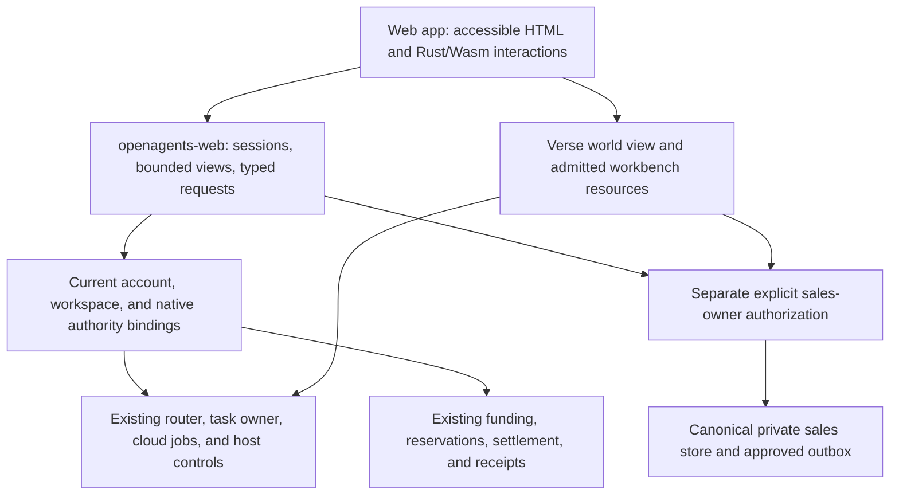

# Coder Cloud and the OpenAgents web app

Status: product and interface specification, October 8, 2026. The component
catalog, public Cloud page, and explicitly configured native account shell are
implemented. Other interfaces below remain proposed. Existing Rust owners remain
authoritative; an implemented library, closed issue, or fixture does not
establish public availability.

Coder Cloud is the browser workspace at **openagents.com** for directing Coder,
supervising agents on your computers or admitted cloud capacity, inspecting
results, and paying for qualified services. Verse presents the same work through
agents, stations, and workbench views. The website also supports the customer,
team, sales, partner, and fulfillment flows in the [sales strategy](../sales/README.md)
and [revenue roadmap](../sales/revenue-roadmap.md).

Build these interfaces from scratch in this repository. The sibling
`~/work/coder` supplies interface reference material only. Reimplement useful
interaction patterns; do not import its private backend, authentication,
prompts, endpoints, credentials, or product code. Product state, permissions,
transport, and behavior stay in Rust. Add no TypeScript.

## Product requirements and sources

[Transcript 276](../transcripts/276.md) establishes the original Coder Cloud
intent: coding agents accessible from web, mobile, and desktop; concurrent work
subject to available infrastructure; and continuity with the terminal. Its
USD 1/hour price, unlimited-agent wording, invitation beta, and historical
`coder.openagents.com` address are historical launch statements. This spec uses
openagents.com as the product entry point and the current versioned contracts
for prices, capacity, and availability.

The surrounding transcripts add requirements:

| Source | Requirement carried forward |
| --- | --- |
| [275](../transcripts/275.md) | One composer reaches owned or rented computers, projects, plugins, memory, and evidence; synchronization is optional. |
| [277](../transcripts/277.md) | Actual commands and outputs make work understandable while it runs. |
| [278](../transcripts/278.md) | Concurrent delegates have distinct identities, progress, results, and parent context. |
| [279](../transcripts/279.md) | One execution runtime serves supervising clients, with honest completion, stop, and recovery states. |
| [281](../transcripts/281.md) | Isolated worktrees, resource-aware placement, and cross-device supervision support parallel work. |
| [259](../transcripts/259.md) and [289](../transcripts/289.md) | Lead with accepted outcomes and evidence; Coder is the repository-work path within the composable OpenAgents product. |

The new interface carries forward a work list, transcript and composer,
selectable child conversations, changed-file pane, and paged trace reader.
Returning to a parent preserves its position. These are interaction requirements,
not a port of an old layout or server.

Use the [current Coder terminal](../../crates/coder-new/README.md),
[workbench resources](../terminal/workbench-resources.md),
[shared UI architecture](../coder/rust-native/architecture.md), and
[Rust Native contract](../../crates/rust-native/docs/spec.md) as implementation
references. The [shared Coder component specification](../coder/rust-native/coder-components.md)
defines the initial web deliverable and complete `coder-new` inventory. Domain
contracts take precedence over older transcript terminology.

## Current foundations and remaining integration

This inventory combines repository sources with open issues and recent closing
audits read on October 8. It describes the reviewed scope, not live telemetry.
Older sales gap tables and runbooks retain their dated context.

| System | Existing foundation | New web work or remaining limit |
| --- | --- | --- |
| Public site | [`openagents-web`](../../crates/openagents-web/README.md) serves Rust pages, documentation, downloads, pilot intake, discovery, public payment views, and browser worlds. | Add the authenticated workspace and qualified commercial navigation. Some production routes still use the legacy sidecar; track their replacement explicitly. |
| Shared UI | [#10943](https://github.com/OpenAgentsInc/openagents/issues/10943) implements the shared `coder-ui` library, reusable `rust-native-web` adapter, and Rust/Wasm catalog with 40 component families and 483 variants. Rust Native v3 adds semantic fields, choices, dialogs, and inline runs. | Compose the authenticated app from these components. Native v3 adapter adoption and live domain integration retain separate acceptance. |
| Local task browser | `/app` reads private local tasks and ATIF, with a loopback-only guard. | Preserve that guard. It is not the authenticated cloud app. |
| Cloud delegation | [#10910](https://github.com/OpenAgentsInc/openagents/issues/10910), including [#10912](https://github.com/OpenAgentsInc/openagents/issues/10912)–[#10917](https://github.com/OpenAgentsInc/openagents/issues/10917), landed durable jobs, Boat integrated agents, headless Coder on Boat/GCE, workspace transfer, usage, recovery, and the terminal agent rail. | Add scoped web observation and controls over [`coder-cloud`](../../crates/coder-cloud/src/lib.rs). Operator access and verified isolated smokes do not establish a retail service. |
| Paid retail | [REV-13–REV-15](https://github.com/OpenAgentsInc/openagents/issues/10820) landed customer transport, resident execution, selected native controls, and deployment packaging. | The browser needs its own admitted adapter and acceptance. Commercial confirmation, funded qualification, and production activation remain required. |
| Browser terminal | [#10685](https://github.com/OpenAgentsInc/openagents/issues/10685) and [#10686](https://github.com/OpenAgentsInc/openagents/issues/10686) landed granted host transport and shared terminal rendering. | Add enrollment and app navigation; retain physical browser, IME, clipboard, and timing limitations. |
| Verse | Grid presence, browser world rendering, host-owned Studio, Alice, and private Agora observation exist at their documented scopes. | Connect these surfaces to the app's exact work identities; offline Everglade currently supplies no host or Studio connection. |
| Alice and Devin | Local Devin ACP execution exists. Alice identity, memory, steering, and jobs use the workshop host. | Alice-on-Devin [#10929](https://github.com/OpenAgentsInc/openagents/issues/10929), placement on two computers [#10930](https://github.com/OpenAgentsInc/openagents/issues/10930), and parallel queue [#10931](https://github.com/OpenAgentsInc/openagents/issues/10931) remain open. |
| Accounts and finance | Canonical attribution [#10826](https://github.com/OpenAgentsInc/openagents/issues/10826), native funding controls [#10830](https://github.com/OpenAgentsInc/openagents/issues/10830), and joined original statements [#10831](https://github.com/OpenAgentsInc/openagents/issues/10831) are code-complete. | Bind the web session to current native authority. Common BTC, native USD, retail credit, service invoices, and payouts retain their original policies. |
| Teams | [#10847–#10850](https://github.com/OpenAgentsInc/openagents/issues/10850) provide scoped limits, policy, reports, and joined recovery. | Qualify each enabled browser route. Existing native qualification does not establish enforcement on every cloud, plugin, or customer host. |
| Sales floor | Paul, approvals, outbox, reply review, meetings, and private boards landed. REV-64, REV-65, and REV-70–REV-72 also landed hiring, reporting, day plans, earned aggregates, and partner/referral desks. | WEB-15 supervises them in the browser through the sales-owner adapter (floor, exact outbox decisions, stop dispatch, private board); hire/retire and reply-review controls stay on the sales host. Exact reviewed batches [#10873](https://github.com/OpenAgentsInc/openagents/issues/10873) and conditional follow-up/channel/voice/jurisdiction work retain their existing issues and qualification. |

Closed implementation issues remain closed while owner qualification is pending.
Display each lane as **Unavailable**, **Proposed**, **Qualified**, or **Available**
from its actual configured evidence. Do not infer availability from issue closure.
The [owner record](../../NEEDS_OWNER.md) holds commercial, device, credential,
funded-payment, and deployment activation steps.

## What openagents.com contains

The following new routes are proposed interface locations. They are not existing
API contracts. Keep public information readable without an account; authenticate
private work, records, and controls.

> **Removed 2026-10-08.** The `/cloud/app` pages this describes were deleted; see [the Cloud reset](../web/cloud-reset.md).

| Location | Purpose |
| --- | --- |
| `/` | OpenAgents introduction, Download, Docs, and the qualified pilot offer. The anonymous Ask OpenAgents terminal keeps its knowledge-only scope. Cloud, components, and demo remain direct-link pages, with no public header or homepage promotion until the owner authorizes it. |
| `/cloud` | Coder Cloud explanation, supported execution choices, contract-based pricing, availability, and **Open workspace**. No historical price or unlimited-capacity claim. |
| `/components`, `/components/{component}` | Public interactive component library, complete `coder-new` state inventory, source references, typed properties/intents, and full Coder screen previews. The first deliverable; all examples use synthetic data. |
| `/demo` | Standalone original Coder demo: five synthetic conversations, exact shared terminal rendering, and local keyboard, plugin, and model controls. |
| `/cloud/app` | Authenticated workspace shell and overview. This separate route preserves local `/app`. |
| `/cloud/app/projects` | Authorized repositories, goals, issues, blockers, review queue, and delivery history. |
| `/cloud/app/tasks/{id}` | One canonical task and its attempts, transcript, children, artifacts, checks, controls, and cost. |
| `/cloud/app/agents` | Delegates, Alice, Studio seats, and authorized crew members with actual placement and current capability. |
| `/cloud/app/computers` | Owned, enrolled, and offered cloud computers, grants, capacity, freshness, and supported operations. |
| `/cloud/app/workbench` | Saved host sessions, panes, terminals, blocks, threads, and exact pending proposals. |
| `/cloud/app/verse` | World and host connection status, associated agents and stations, and optional live world view. |
| `/cloud/app/plugins` | Admitted releases, settings, tests, permitted discovery, and qualified paid invocation. |
| `/cloud/app/team` | Membership, invitations, department capabilities, policy, limits, and private outcome reports. |
| `/cloud/app/billing` | Eligible offers, funding, balances, holds, usage, original receipts, service invoices, and recovery. |
| `/cloud/app/sales` | Separately authorized private sales pipeline, floor supervision, approvals, fulfillment, and reporting. |
| `/cloud/app/partners` | Accepted assignments, attribution, eligible earnings, and payout state within the actor's scope. |
| `/cloud/app/settings` | Account recovery, sessions, approved integrations, notification preferences, and explicit sync/disclosure settings. |

Preserve `/download`, `/docs`, `/pilot`, `/pilot/install`, `/connect`, association
files, legal pages, `/live`, `/stats`, `/efficiency`, and existing world URLs
according to their current route ownership. The world demos remain useful without
private work access. Keep removed legacy routes unavailable until an explicit new
product decision replaces them; the app's private evidence viewer does not
republish the old public Traces, Forum, Gym, Earn, Weights, or QA sections.

Public service descriptions link to the appropriate purchase or bounded intake.
Customer profiles and examples publish only after exact consent and review. A
private account, agent, or customer record never becomes public because it has a
URL. The historical subdomain can redirect only after its owner confirms the
mapping and compatibility requirements.

## Shared components and first deliverable

The sibling `~/work/coder` has a shared component library across platforms.
Build its Rust Native equivalent here: shared semantic components and typed
interactions, product-owned presentation values, and thin platform renderers.
Reimplement the design in this repository; no private sibling code becomes a
dependency or public artifact.

The initial deliverable is **`openagents.com/components`**, with web versions of
**all components from `crates/coder-new`**. Its scope includes imported Markdown
and diff renderers, every visible state and layout branch, all pickers and
specialized settings forms, recovery states, and complete screen compositions.
Production/live variants need fixtures even when existing demo images omit them.
The library must support recreating the exact current Coder UI on the web.

Extend the existing `coder-ui` into the pure Coder component owner. Keep generic
elements, styles, editing, selection, and validation in `rust-native`; add a
reusable `rust-native-web` adapter for escaped semantic HTML and Rust/Wasm DOM
interaction. Application projections retain session state, effects, transport,
and authority. Neither the generic framework nor the browser component library
depends on the full `coder-new` runtime or Ratatui. Coder Cloud composes the same
components instead of creating a second library of page-specific markup.

The [component specification](../coder/rust-native/coder-components.md) supplies
the source inventory, dependency boundaries, catalog routes, interactions,
reference sizes, and completion criteria. Maintain a source-pinned manifest
that maps every render site and visible variant to shared components and
interactive fixtures. Generate navigation and completeness from that manifest;
missing or obsolete fixtures fail its checks.

Provide isolated examples and complete Coder previews with selectable text,
accessible controls, keyboard/pointer input, editing/IME, focus, scrolling, and
deterministic state/animation controls. Preserve the source layout, Paper Mono,
tokens, symbols, wrapping, tool/diff geometry, and live/demo differences in the
default **Coder terminal** profile. Responsive alternatives have separate names
and verification. A screenshot gallery or a terminal buffer drawn in a browser
does not meet the component-library deliverable.

Public fixture examples require no account or commercial activation. Demonstrate
send, test, save, resume, approval, stop, and other effects through deterministic
Rust fixture controllers with no live service or private-store access. The web
catalog's completion establishes the shared web presentation layer; native
adoption and authenticated service integration retain their own acceptance.

## Workspace interaction

On a wide screen, use a workspace/navigation rail, the selected conversation or
work view, and an optional detail pane for files, reviews, receipts, or Verse.
On a narrow screen, open those views sequentially without losing selection or
scroll position. Use Paper Mono and the site's existing white intensity palette
for the site shell. Coder components use the source-derived Coder profile,
including its cyan, magenta, amber, green, orange, and red semantic accents.
Status also has text, not color alone. Verse keeps its own rendering and palette.

The overview answers: what is working, where it runs, what waits, what needs your
decision, what it costs, and what result is ready. Work rows show task title,
project, parent/child relation, executor, computer, state, elapsed time, latest
activity, known usage, and uncertainty. Filters include workspace, project,
computer, agent, state, and **Needs attention**. No task title or unread count
leaks from a workspace the current reader cannot access.

The composer can start work, ask about selected work, or continue an existing
conversation. Make the target and mode visible. An explicit agent or computer
selection survives routing; an unavailable named delegate yields a refusal or a
reviewable alternative. Do not silently substitute it. Support manual selection
without requiring users to understand internal model probabilities.

The task view shows actual streamed tool calls, commands, working directories,
outputs, and diffs under bounded expansion. Page long ATIF transcripts, retain
step links, and show replay gaps. Preserve each child's own conversation and
attempt history. A local UI draft or selection is presentation state; the task
owner supplies execution truth.

Follow new output while the reader is at the bottom. Pause following when the
reader scrolls into earlier output, offer **Jump to latest**, and preserve
separate parent and child positions when switching conversations or prepending
history.

Separate these visible facts:

| Fact | Required presentation |
| --- | --- |
| Submission and admission | A recorded request can be queued without execution authority. |
| Execution and checking | An ended executor may have failed, unchecked, or verified results. |
| Delivery and acceptance | Retained artifacts, independent checks, buyer acceptance, merge, push, and deployment have separate evidence. |
| Steering | The owner accepted a correction; show whether the executor consumed it. |
| Stop | **Stop requested**, executor acknowledgment, resource cleanup, and final charges are separate. |
| Cost | Quote, hold, measured charge, provider expense, subscription usage, estimate, and unknown amount have distinct labels. |
| Connection | Cached, stale, reconnecting, revoked, and unavailable views never look current. |

An action carries the displayed resource revision, current authority, and stable
request identity. If a review or grant changes, reload and review the new terms.
Closing a view detaches observation; it does not stop durable work.

## Projects, computers, and execution

### Start and review a repository task

1. Choose the authorized project and an issue, objective, or direct request.
   Pin the source revision and identify deliverables and independent checks.
2. Choose a granted computer or qualified Cloud class, the actual executor,
   disclosure recipients, effect scope, and time/spend bounds. Explain missing
   credentials, capacity, enforcement, or grants before dispatch.
3. Review any required immutable offer. Confirming changed source, payer,
   recipient, effects, or price requires a new offer.
4. Retain the request and admission before dispatch. Return a durable work URL
   and observe the existing task across refresh, restart, and another client.
5. Inspect the candidate, exact checks, artifacts, and remaining uncertainty.
   Request changes, accept delivery, integrate, or publish only through the
   corresponding admitted operation.

Projects project existing host goals and issue supervision rather than creating
a second scheduler. Show dependencies, claims, worktree ownership, concurrency,
provider reset times, build waits, and review backpressure. A graph is navigation,
not permission to start every node. Honor issue claims and the
[project supervisor](../coder/guides/project-supervision.md).

### Execution choices

| Choice | What the interface permits |
| --- | --- |
| Your computer | Existing host execution and model login/key under current grants; local work does not require buying OpenAgents compute. |
| Another enrolled computer | Explicit allowed host and workspace, materialized source, current route/grant, and separate disclosure approval. |
| Operator Boat | Authorized operator's integrated-agent or headless Coder mode; show the actual executor and model, selected credentials, retained job, and cleanup. |
| Operator GCE | Headless Coder on the explicitly granted pool; show the pool's actual shape and capacity. Boat integrated-agent mode is not a GCE option. |
| Retail Cloud v1 | The exact customer-funded Boat repository task below, behind its qualified availability gate. |
| Sponsored model fallback | An admitted inference resource; it supplies no rented computer, retail entitlement, or customer wallet balance. |

Operator cloud paths can retain a session and workspace for continuation.
Retail v1 deletes its sandbox and requires a new offer for another task. Never
project operator continuation, credentials, limits, or capabilities into a
retail offer. Cloud job cleanup and artifact retention come from the original
job record; the web view must not invent a terminal or successful delivery.

The computer view shows host identity/version, admitted workspace, route,
capabilities, grants and expiry, load/capacity, provider readiness, and data age.
Connect through explicit enrollment. Account sign-in does not enroll a host;
pairing supplies only the issued host rights. It does not approve a particular
merge, disclosure, spend, or screen capture. Browser controls do not read the
service operator's home directory or engine logins.

### Terminals and workbench

Mount [`coder-browser`](../../crates/coder-browser/README.md) and shared
`terminal-core`/`terminal-gfx` through the browser adapter already used by
[`everglade-web`](../../crates/everglade-web/src/terminal.rs). Attach to the
existing host terminal, generation, session, block, thread, and proposal IDs.
The browser drives a granted host PTY; it has no shell on the visitor's device.

Only the current typist can input or resize. Watchers remain read-only. Confirm
the exact proposed command and directory through the owner's existing approval
path. Clipboard needs a user gesture; IME commits once; reserved shortcuts have
visible accessory controls. Report WebGPU/WebGL2 and glyph limitations.
Route loss stops input without queuing or replaying it. Reconnect requires fresh
admission and a retained snapshot. Page close detaches and leaves the PTY alive
under its host lifecycle. Retail v1 offers no customer terminal.

## Verse and delegation in the web UI

Verse is an optional live view alongside ordinary work. The app always makes its
connection visible, even when the 3D view is closed. A world renderer is not a
prerequisite for submitting or supervising work.

Show three independent connections:

| Connection | Visible state and authority |
| --- | --- |
| World | Display identity, zone/instance/content identity, relay or chamber route, accepted subscriptions/admission, reconnect state, and freshness. World connection does not assert that another player is present. |
| Computer | Host identity, version, generation, direct/relay route, and supported task/terminal/Studio operations. |
| Private work | Current observe, operate, review, typist, agent-controller, or separate sales rights, with expiry/revocation. Joining a world supplies none of these rights. |

Authoritative chamber/social play requires the current host `world` grant and an
enrolled character role bound to the admitted instance and content. Presence,
account sign-in, or a computer connection alone cannot assign that role.

Provide **Join**, **Leave**, **Open Verse**, and **Open associated work**. Stations
and app cards resolve the same [workbench references](../terminal/workbench-resources.md):
goal, seat, task, decision, review, terminal, and evidence. A browser task links
back to the associated station/agent when it exists. An offline world or missing
host presents a useful unavailable state, not a fabricated live connection.

World presence carries only admitted display/activity information. Keep repository
contents, prompts, traces, terminal output, private memory, contact information,
sales records, and payment details out of presence and world chat. Private panels
clear on lost authority, inactive surfaces, or transitions to shared worlds,
according to their owner contract. World simulation and agent walking illustrate
real state; reaching a desk never authorizes or starts a task.

### Alice, Devin, and Agent Studio

Read the [Alice runbook](../verse/alice-runbook.md),
[Codex handoff](../verse/alice-codex-handoff.md),
[local Devin runbook](../verse/devin-runbook.md), and
[delegation runbook](../coder/guides/devin-delegation-runbook.md) together with
their current source and closing audits. The older burn-down executor's limits
do not define every new host-owned delegate.

Show Alice's identity, attested/unattested/expired owner attestation, expiry, and
the existing 14-day renewal warning. Her work view shows workspace/base revision,
selected engine and actual delegate/model, computer, running request, queue,
report, children, pending proposals, and host-service state. Offer explicit
**Coding task** and **Terminal request** modes instead of hiding the current
first-word routing heuristic. Today Alice selects `coder` or `codex`, runs on her
home host, and admits one running request plus four waiting. Display those limits
until #10929–#10931 change them and their web projections qualify.

An attestation identifies Alice and supports signed spend evidence; it grants no
execution rights. Her current budget meter covers terminal-mode planning,
reporting, and Coder calls. Task-mode runs bypass that meter and rely on
auto-start/provider capacity. Show the meter's scope and unmetered or unknown
usage; do not present it as a task-mode spending ceiling.

The planned Devin queue shows the owner-selected host allowlist, per-host login
and capacity, concurrency, issue claims, conflicts, task/token/day bounds, build
leases, queued work, and remote cleanup. Remote artifacts return to the reviewed
candidate; a worker does not need publication credentials merely to return a
patch. One queue stop accounts for every child and any unresolved effects.

The installed [Devin ACP route](../coder/runtime/devin.md) uses Devin's own login.
Show effective access, actual session linkage, reported tokens/credit dimensions,
and unknown dollar cost. Steering can cancel and continue at the next turn;
the UI must not imply live input injection. An unavailable usage probe is
unavailable, and a temporary free-use claim is not a lasting service price.

Studio shows goals, seats, assignments, decisions, questions, review queue,
independent checks, and exact candidate revisions. Merge decisions bind the
displayed base, head, and tree. A changed candidate requires a fresh review.
Existing Studio merge updates the host checkout; push and deploy are distinct
effects. Show dirty checkout, detached head, conflict, refusal, and unknown
outcome explicitly. Never derive merge approval from agent completion or auto-start.

Studio snapshots and deltas retain their stream identity and monotonic sequence.
A gap or changed host stream requires a fresh snapshot before controls return.
Cached decisions and reviews remain stale until reconciled with that snapshot.

Expose pause/resume, ask, stop, retry, reassignment, decisions, review, and merge
only when the host advertises and admits that operation. Local owner-key/file
configuration requires a reviewed host operation before it can become a browser
control. Standing jobs show trigger, expiry, enabled state, last occurrence,
skipped/refused occurrences, and bounds; current jobs start disabled and expire
within 90 days. Day plans start no work. Memory notes, proposed preferences,
engrams, and opt-in sync retain their own privacy and acceptance rules.

## Commercial and sales coverage

Coder Cloud supports the whole sales plan through views over existing owners.
Each lane can launch independently after its applicable gates; supporting a lane
in the interface does not activate it or broaden its frozen contract.

| Lane | Required web experience and boundary |
| --- | --- |
| Free local Coder | Download, qualified install/first task, honest login/capacity state, and evidence of accepted outcomes. Local-only use and optional sync remain available. |
| Assisted Coder pilot | Preserve `/pilot` and its permissioned create-only intake. Show proposed terms, responsible human, consent, scope, review date, private agreement, checked delivery, support, and separately confirmed invoice/payment. |
| Paid plugin | Discover a reviewed exact signed release, inspect its measured behavior and total endpoint/author fee, approve payment, obtain a useful result and receipt, and inspect settlement/payout. The current one-guest, no-capability, empty-snapshot envelope remains binding. |
| Retail compute | Read capacity, fund the account, review/confirm the exact supported quote, follow execution/checks, cancel, recover, download retained results, and read final charge/cleanup evidence. |
| Decision or hosted gateway | Show the selected supported resource, provider/model, denomination, capacity, quote/funding, usage, and receipt. Decision access and hosted agent/model execution are distinct resources. |
| Team and department agent | Invite people, enforce scoped data/model/plugin/placement rules and limits, share exact admitted capabilities, and inspect work/cost/wait/outcome reports. Department knowledge starts as admitted documents, workflows, and evaluations; model training is a separate service. |
| Referrals and affiliates | Retain source and permanent attribution, accepted agreement version, eligible settled revenue, accrual, holds/reversals, statement, and actual payout. A self-attribution or marketing source creates no commission. |
| Partners and fulfillment | Scope accepted assignments, responsible humans, qualified capabilities, delivery/independent acceptance, agreed compensation, support, and offboarding. An invitation creates no accepted obligation. |
| Reuse and contribution | Inspect exact release, independent evidence, adoption, rights/consent, accepted obligation, and its separately admitted payment. A task result or benchmark score does not automatically earn money. |

Use the sales JSON records as exact document requirements, not prefilled proof:
[pilot kit](../sales/pilot-kit.json),
[delivery kit](../sales/delivery-kit.json),
[install qualification](../sales/install-qualification.json), and
[team qualification](../sales/team-qualification.json). Preserve pinned versions,
required evidence, responsible actors, null/unavailable fields, and separate
acceptances. Editing a form does not sign an agreement, run checks, book a meeting,
perform cleanup, grant disclosure, pay an invoice, or qualify a customer.

### Funding, prices, and original statements

Retail v1 sells one `retail-boat-large-v1` computer per
`retail-repo-change-v1` task: public HTTPS GitHub source at an exact commit,
1–8 frozen checks, the customer's own OpenAI key, at most 60 minutes, and at most
four concurrent retail sandboxes across customers. It returns a patch, check
outputs, summary, and scrubbed trace with 30-day retention. It offers no private
repositories, publication, customer shell, GCE retail, fan-out, hosted inference,
or continuation on a kept sandbox. See the [retail contract](retail-contract.md).

The [price book](retail-prices.md) defines one credit as one sat: 40 millisatoshis
per metered second plus 100 sats per started task, at most 244 sats for its
60-minute quote. Model expense is paid directly through the customer's key.
Read the actual version and digest; a changed book needs a new offer. Display
contract and price confirmation as pending until their owner activation passes.

The assisted pilot is a separate proposed USD 250 service after accepted
delivery, with zero promotional credit, buyer-paid local model use, a seven-day
review, at most three operator hours, and at most one repair. Its invoice does
not fund product usage. The buyer applies or publishes the checked patch.

Billing resolves the current canonical customer/workspace mapping and original
native payer. It projects eligible purchased balance, available funds, held and
unknown obligations, settled charges, releases, invoices, fees, commissions,
accruals, and payout liabilities. Preserve BTC/millisatoshi and USD denominations
and pinned conversions. Combine original records in a statement only when
their native authority and mapping qualify. A readable joined statement does
not make its balances interchangeable or create spend rights.

Top-up retries retain the original purchase/invoice. A browser return, screenshot,
or customer claim cannot credit money; receiver or processor evidence does.
Confirming an offer reserves its maximum before provisioning. Unknown usage
stays held across restart. A stop request is not a stopped meter. Release of
unused held funds differs from a refund of a settled charge. Retail's
no-redemption rule, card reversals, and MPP remainder liabilities stay within
their separate policies. Quotes, customer charges, provider bills, author fees,
and referral commissions never substitute for each other.

### Private sales workspace and fulfillment

Project [`coder::task::sales::Store`](../../crates/coder/src/task/sales.rs) through
an explicitly authenticated private sales adapter. Do not create a web CRM or
store contacts in replica-local site state. The public intake credential stays
create-only; account membership, Studio observation, and world proximity grant
no private pipeline access.

The pipeline shows stage, responsible human, next action/date, permission and
suppression, original source/referral, qualification, accepted offer, review,
evidence, invoice/payment, delivery, and support. Use the canonical stages and
revision checks. Track installs, first accepted tasks, settled purchases, repeat
use, conversion, full resource expense, margin, and support burden at their
actual scope. Failed attempts and repairs remain in the report.

Provide private modules for **Pipeline**, **Evidence and claims**, **Pilots and
delivery**, **Invoices and fulfillment**, **Partners**, **Referrals and earnings**,
**Journeys and weekly review**, and **Sales floor**. Claims and price references
retain their review pins, withdrawal, and history. Journey measurement is
consented and separate from the assisted pipeline. Partner invitations remain
pending until the exact recipient accepts; refusal, expiry, cancellation, and
human handoff remain visible. Scoped audit exports exclude unrelated customer,
team, and contact records.

A pilot record binds workflow, exact source/task/checks, acceptance decision
maker, installed revision, disclosure, baseline, all attempts, known/unknown
cost, scope caps, and review outcome. Delivery includes exact candidate and
runbook, checks, dependencies, known limits, retained artifacts and retention,
customer acceptance, and separate support-owner acceptance. Offboarding tracks
credentials, grants, test data, resources, local copies, and customer access,
with actual verification and unresolved cleanup. Reuse, training, public examples,
and marketing require separate exact permission.

The [evidence contract](../sales/evidence.md) governs baseline comparisons and
claims. Reports distinguish actual paid expense, estimates, and subscription
capacity; no web page or sales draft claims savings from an unverified demo.
Public reports require the customer-approved redacted material and stated limits.

### Paul and the Agora

The Sales view supervises the same floor described by the
[agent sales floor contract](../sales/agent-sales-floor.md): Paul, qualified
hires, their narrowing charters, assignments, practice, certification, actual
day plans, private boards, model reservations, and outcome reports. Arthur and
Vanna's partner/referral activity joins accepted agreements and earned original
settlements; a sales agent's identity alone cannot pay itself.

The initial floor admits Paul and at most three active hires, in the planned
order Erin, Frank, then Pat when real queues justify them. Show the current
USD 5/day floor-wide ceiling, including planning, Coder, Jev, helpers, research,
drafting, checks, training, reflection, and retries. Unknown expense retains its
hold. America/Chicago calendar days and weeks govern budgets and qualification;
compressed world time governs presentation only. Initial outreach is permissioned
known-US business email with written conversations and human closing. The web
view cannot infer approved capacity, a campaign, or a cost conversion from these
defaults.

Show research, synthetic role-play, practice, pinned calibration/development/locked
evaluation, current certification, suspension, measured draft and expense,
pending contact proposal, exact owner decision, outbox intent, accepted handoff,
delivery/unknown state, untrusted reply, opt-out/bounce, dated follow-up, and
human meeting proposal as distinct stages. Live drafts retain the exact qualified
body and fixed neutral subject, with no attachments or ungraded headers. UI
edits cannot bypass grading. Model capacity, full-context price, output and retry
bounds, deadlines, and reconciliation precede paid calls.

Level 0 requires owner approval of the exact proposal and original revision
before outbound effects. A broader batch grants only reviewed cohort, template,
channel, jurisdiction, spacing, expiry, and caps after its own qualification;
no automatic promotion follows from good results. **Pause crew**, **Stop crew**,
individual retirement, revocation, and suppression fence pending dispatch and
show unresolved delivery. Replies remain untrusted and cannot authorize new
work, payments, disclosure, or follow-ups. Meeting suggestions book nothing.

Private Agora observations use current sales-owner authority and their existing
three-second expiry; clear them on failed refresh, inactive view, or shared-world
transition. The public hall can show only reviewed, delayed, bounded aggregates.
A bell represents one qualified earned sale after original settlement evidence,
delivery, and acceptance, deduplicated by that record. Refunds and disputes adjust
the record without ringing again. It never exposes prospects, messages, amounts
linked to a person, credentials, or a synthetic sale presented as real.

Shared views omit live amounts, deal timing, and private bell audio, ticker, or
applause. Publishing a reviewed aggregate does not authorize publishing the
private events behind it.

Native hiring/retirement REV-64, reporting REV-65, Bob/day plans REV-70, earned
bell/aggregates REV-71, and partner/referral integration REV-72 are code-complete.
WEB-15 projects them read-only in the browser beside exact outbox decisions and Stop dispatch; hiring, retirement, and reply review stay on the sales host. Reviewed batches REV-66 remain open.
Standing follow-ups,
another public-reply channel, voice participation, and another jurisdiction
(REV-73–REV-76) retain their conditional scope and owner gates. Browser support
does not select a mailbox, campaign, customer SSO provider, voice medium, or
jurisdiction.

## Rust implementation and authority

Keep transport adapters thin. Reuse `route-contract`, `workbench`, task/host
operations, `coder-cloud`, `coder-browser`, `openagents-chat`, the capacity book,
supervisor, `commercial-accounts`, `tenancy`, `pay-ledger`, and retail owners.
An API mapping exposes supported domain operations; it does not create a second
coding loop, balance, task scheduler, sales ledger, or permission system.

Public pages render escaped semantic HTML. Interactive application behavior uses
Rust/Wasm and typed events; generated loader glue remains platform glue. Use real
accessible controls for navigation, input, decisions, and records. Canvas is for
Verse and the existing terminal renderer, not every account or sales form.
Apply stable node keys, displayed revision checks, bounded paging, Unicode/IME,
keyboard access, and detached-view cleanup through the shared component library
and web adapter. New account, sales, and Verse connection views extend that
library with product components where appropriate; they do not fork core
editing, layout, focus, or interaction behavior.

The web session adapter resolves existing account/session and membership owners;
current canonical attribution maps native records but grants no product rights.
Web enrollment, account-to-device linkage, and each service credential delegation
need explicit reviewed bindings. No private sibling auth or implicit identity
match becomes a substitute. Unknown/changed mappings refuse new effects while
original cleanup and financial reconciliation retain their original identity.

The [retail transport](retail-service.md#customer-transport-and-resident-worker)
rejects browser Origin requests and uses native bearer/principal authority.
Implement a same-origin Rust web adapter with per-user, per-workspace scoped
delegation to that service. Never expose an operator bearer to JavaScript or
remove the native guard to make the page work. Its browser-session, CSRF,
credential-custody, retry, and revocation contract must qualify before purchases.
Sales likewise needs a reviewed remote adapter; a site instance cannot open the
owner's private store or treat a public session as the owner credential.

For paired host terminals, preserve the existing Rust page-memory key model and
host-signed admission. Do not persist keys, terminal input, or private output in
URLs or browser storage. Provider keys require explicit service-custody consent
and the existing bounded vault/delivery/deletion lifecycle; show masked status,
never key values. Missing browser-safe custody makes that operation unavailable.

Enforce observation, execution, disclosure, and spending separately at the
authoritative owner. Recheck current rights/epochs/generation on reads and
effects. Apply session-bound CSRF protection, same-origin controls, strict cookies,
bounded bodies/events, explicit CSP, private `no-store` responses, safe artifact
downloads, and logs that omit contact content and credentials. No untrusted
artifact, repository instruction, reply, or web form grants itself authority.

Persist request/admission/dispatch identities before effects. Exact retries
recover the original operation; different bytes conflict. Retained event cursors
and explicit gaps support observation after disconnect. An ambiguous dispatch,
input, payment, merge, or mail delivery is reconciled before replacement. A web
server restart or scale-out cannot duplicate work or free unknown holds. Keep
durable domain state with its resident owner, not ephemeral site replicas.

## Delivery slices and acceptance

The request selects **web** as the new interface surface. [REV-44](https://github.com/OpenAgentsInc/openagents/issues/10851)
still needs one concrete commercial lane for its own acceptance; qualify retail
compute v1 first for the Coder Cloud purchase slice, without activating it through
this document. Existing claimed Alice and sales issues retain their ownership.
The [web implementation roadmap](https://github.com/OpenAgentsInc/openagents/issues/10964) tracks the remaining
slices below. Complete them in order, claim each issue before implementation,
and retain each native owner and its separate activation gates.

| Slice | Deliverable | Acceptance |
| --- | --- | --- |
| 1. Shared components and `/components` | Rust Native Coder component library, reusable web adapter, interactive public catalog of every `coder-new` component/state, and complete source-equivalent screens. | Every source render site and visible variant maps to a working fixture; declared interactions work; complete Coder UI composes from the library with verified layout/color/content parity; no live service or private-store effects. See the [complete component acceptance](../coder/rust-native/coder-components.md#delivery-and-completion-evidence). |
| 2. Shell and observation | Rust account/workspace adapter, public Cloud description, authenticated overview, canonical task/child/file/evidence reads, freshness, and capability-based navigation. | Two isolated accounts cannot read each other's records; read-only user cannot mutate; reload follows the same task; private local `/app` and anonymous `/ask` retain their bounds. |
| 3. Work on a granted computer | Enrollment, project/task submission, exact steering/cancellation, operator cloud jobs for authorized operators, reviews, and host terminal attachment. | Browser and another client inspect the same work; lost replies do not redispatch; revocation blocks effects; checks bind the exact candidate; stop/cleanup uncertainty remains visible. |
| 4. Connected Verse and agents | Separate world/host/private-work states, stations linked to work, Alice/Studio views, exact decisions/reviews, and supported delegation settings. | Join/leave changes no task rights; app/station links resolve identical resources; stale review refuses; private content stays out of presence; connection loss disables input. Qualify new Devin/placement/queue capabilities only after their owners land. |
| 5. Qualified Cloud purchase | Browser retail delegation, exact funding/quote/confirmation, progress, artifacts, cancellation, receipt, and recovery. | Fake-payment tests cover concurrent overspend, changed quote, revoked rights, lost dispatch, provider loss, unknown meter, cleanup, and duplicate credit/settlement; then O3/O4/O8 qualify the exact deployed browser lane before availability. |
| 6. Commercial workspace | Proven plugin/gateway lane views, teams and reports, private sales/pilot/fulfillment controls, referrals/partners, Paul and Agora projection. | Every enabled route has its own policy/funding qualification; original statements reconcile; outbound actions need exact approvals; untrusted replies and revoked batches cannot dispatch; shared aggregates reveal no private records. |

### Tracked web implementation

The component catalog is complete under #10943. These issues track the ordered
web implementation:

| Order | Issue | Deliverable |
| --- | --- | --- |
| WEB-01 | [#10948](https://github.com/OpenAgentsInc/openagents/issues/10948) | Implemented: public Cloud entry and honest availability. |
| WEB-02 | [#10949](https://github.com/OpenAgentsInc/openagents/issues/10949) | Implemented: native sessions and the authenticated workspace shell; explicit account-service configuration, current membership, and Rust/Wasm private-view cleanup. |
| WEB-03 | [#10950](https://github.com/OpenAgentsInc/openagents/issues/10950) | Implemented: bounded canonical resident task, child-reference, evidence, and original byte reads under current Observe authority, with Rust/Wasm source and grant cleanup. |
| WEB-04 | [#10951](https://github.com/OpenAgentsInc/openagents/issues/10951) | Implemented: explicit server-custody review, original signed requests, native revision and queue fences, and sealed-result recovery for granted task controls. |
| WEB-05 | [#10952](https://github.com/OpenAgentsInc/openagents/issues/10952) | Implemented: separately admitted resident project snapshots and operator Cloud jobs, original byte reads, source-pinned views, and reviewed native submit, continue, stop, and reconciliation requests. |
| WEB-06 | [#10953](https://github.com/OpenAgentsInc/openagents/issues/10953) | Implemented: separate page-memory native enrollment, shared GPU terminal with current typist and snapshot gates, original saved-session and retained-thread navigation, exact native proposals, and privacy retirement; isolated browser flows pass. Real-device qualification remains in `NEEDS_OWNER.md`. |
| WEB-07 | [#10954](https://github.com/OpenAgentsInc/openagents/issues/10954) | Implemented: `/cloud/app/verse` shows separate world, computer, and private-work connections; Join opens the existing browser chamber renderer through a scoped world ticket only with the native `world` right and a pinned chamber matching the host binding; station references resolve to the same task and workbench views. Real host and browser qualification remains in `NEEDS_OWNER.md`. |
| WEB-08 | [#10955](https://github.com/OpenAgentsInc/openagents/issues/10955) | Alice and Studio observation, exact decisions, and safe request recovery. |
| WEB-09 | [#10956](https://github.com/OpenAgentsInc/openagents/issues/10956) | Implemented: `/cloud/app/billing/retail` uses operator-provisioned account/workspace/epoch delegations to native retail principals from the server, keeping the service's browser `Origin` refusal; journaled request identities recover funding, quotes, confirmations, and stops across lost replies and restarts; the customer's own key sits in a scoped, revocable custody vault released only to the exact reviewed offer. Funded and deployed qualification remains in `NEEDS_OWNER.md`. |
| WEB-10 | [#10970](https://github.com/OpenAgentsInc/openagents/issues/10970) | Implemented: `/cloud/app/billing/retail/{delegation}/purchases` shows each funded purchase with its payer, confirmed review, approval and request, work and sandbox, retained progress, meter, hold and settlement, digest-checked artifacts, stop, and cleanup; payment, completion, acceptance, and publication stay separate lines. First-observed immutable parts are retained privately, so reload and restart recover the same purchase and a changed answer is refused. Fake-payment acceptance covers concurrent spending, changed quotes, revoked rights, lost dispatch, provider loss, unknown metering, cleanup uncertainty, and duplicate credit or settlement. Deployed O3/O4/O8 qualification remains in `NEEDS_OWNER.md`; the completed #10851 is the local read-only purchase browser. |
| WEB-11 | [#10957](https://github.com/OpenAgentsInc/openagents/issues/10957) | Implemented: `/cloud/app/billing/statements` shows the joined original statement under the viewer's own session, typed row by row in its own units (no summed unlike balances, unknown charges stay unknown, releases are not refunds), with plugin release author fees, allocations, payout references, separate payee earnings, and private NDJSON export; retail delegations add the native account, journaled invoices checked against the service, and retained purchase settlements. `/cloud/app/billing/decisions` shows a decision resource's current payer, membership, invocation right, and exact price reference, and recovers an original receipt; browser approval, payment, and invocation for gateway and plugin lanes stay unavailable. Funded and deployed qualification remains in `NEEDS_OWNER.md`. |
| WEB-12 | [#10958](https://github.com/OpenAgentsInc/openagents/issues/10958) | Implemented: `/cloud/app/team` exposes native membership, single-use invitations, roles, removal, recovery, the exact team policy (browser changes only narrow), cumulative limits with concurrent holds, and the private team report with a bounded report and access export, all on the selected workspace under epoch-bound forms. Read-only members get no change; connected observers retire on role or membership change. Enabled only by an explicit browser qualification; native or mobile qualification cannot enable it, and customer-selected SSO (#10857) stays separate. Browser qualification on a deployed origin remains in `NEEDS_OWNER.md`. |
| WEB-13 | [#10959](https://github.com/OpenAgentsInc/openagents/issues/10959) | Implemented: [`coder::task::sales::remote`](../../crates/coder/src/task/sales/remote.rs) is a resident adapter beside the canonical store on the sales-owner host (`sales-remote` serves it on loopback). Owner-provisioned bindings pin one browser actor, workspace, and epoch to one existing sales credential and only narrow it; every call reopens the store and rereads the credential, and effects journal their exact bytes before dispatch. `/cloud/app/sales` reaches it from the server with a per-binding bearer: contact-free summaries, single-record reads, and a journaled stage change whose exact retries recover, changed parameters conflict, and lost replies reconcile by identity and digest. Deployed owner-host qualification remains in `NEEDS_OWNER.md`. |
| WEB-14 | [#10960](https://github.com/OpenAgentsInc/openagents/issues/10960) | Implemented: `/cloud/app/sales` links read-only Evidence and claims, Pilots and delivery, Invoices and fulfillment, and Journeys and weekly review modules plus a one-record audit, read through new adapter operations (`records`, `delivery`, `claims`, `weekly`, `audit`) that the owner's retention, suppression, and recipient checks fence. Agreements, acceptances, support, invoices, payments, and fulfillment stay separate exact records; unknown, disputed, and failed outcomes stay listed; pilot views compare against the pinned kits by digest. No module has a form. Offboarding shows planned items as unverified because no verified cleanup record exists in the native owner yet. Deployed qualification remains in `NEEDS_OWNER.md`. |
| WEB-15 | [#10961](https://github.com/OpenAgentsInc/openagents/issues/10961) | Paul, sales floor, outbox, and private Agora supervision. |
| WEB-16 | [#10962](https://github.com/OpenAgentsInc/openagents/issues/10962) | Implemented: `/cloud/app/partners` reads, under the viewer's own session and selected workspace, the original referral source, attribution decisions (self-referral and review states shown as such), workspace adoption, and any accepted commission agreement and terms version from the account service; the joined statement's separate payee section, typed in full (owner totals as reported, roles never summed, unresolved payouts stay unresolved, unreadable records refused); and, through the WEB-13 sales adapter's new read-only ops, partner assignments scoped as pending invitations or accepted records, plus Arthur's brief, Vanna's attribution view, and the earned-sale ledger for the sales owner only. A scoped NDJSON export carries the same records. No control moves money; payout management stays with its native owner. Live commission terms, accrual, and payout qualification remain in `NEEDS_OWNER.md`. |
| WEB-17 | [#10963](https://github.com/OpenAgentsInc/openagents/issues/10963) | Implemented: both site images package the privacy runtime and the workbench terminal; observation streams resume from `Last-Event-ID`, so a change made while detached is announced, and a reconnect that can no longer be admitted retires instead of retrying; the shell marks its current section. Browser acceptance (IME, keyboard, 320/375 px layouts, dropped streams, reload, tab suspension, session revocation) and the per-lane [activation record](coder-cloud-web-activation.md) are measured and listed. Deployed-origin and screen-reader checks remain in `NEEDS_OWNER.md`. |

WEB-10 extends the completed local read-only REV-44 surface with the authenticated
Cloud purchase flow. Alice #10929–#10931 and conditional commercial issues keep
their existing claims; this roadmap does not take over that work.

All slices support empty, denied, unavailable, stale, failed, cancelled, and
reconciliation states. Essential workflows work without a 3D renderer. Qualify
keyboard navigation, screen-reader semantics, narrow layouts, IME, clipboard
denial, renderer fallback, tab suspension, refresh, and reconnect on the actual
supported browser. Record performance and platform limits at the measured scope.
The [web activation record](coder-cloud-web-activation.md) holds the measured
results, the packaging, and each lane's code and owner status.

Use isolated hosts, account stores, credentials, provider fixtures, and scratch
roots for implementation checks. Required checks run on contributor or non-GitHub
infrastructure, with build/browser leases and no GitHub-billed automation. Follow
[verification scope](../verification.md); a documentation-only spec needs link
and source checks, not a Rust release gate. Implementation tests target edited
crates and relevant consumers.

Launch only a lane whose applicable [O1–O8 activation gates](../sales/revenue-roadmap.md#owner-qualification-and-activation-gates)
and new browser acceptance pass. Keep owner-only steps in `NEEDS_OWNER.md`; a
conditional SSO provider, broader plugin, public messaging platform, voice path,
international campaign, Pylon market, or every other client is not a universal
launch dependency. Public `/live` and `/stats` continue to show actual reviewed
payment aggregates. No fake fixture becomes a customer, sale, saving, or payout.

The owner record also names O9 for exact team capability reuse and curated
discovery. Apply those source/reviewer, release, data-rights, and usefulness
qualifications when enabling those features; O9 is not a universal launch gate.
