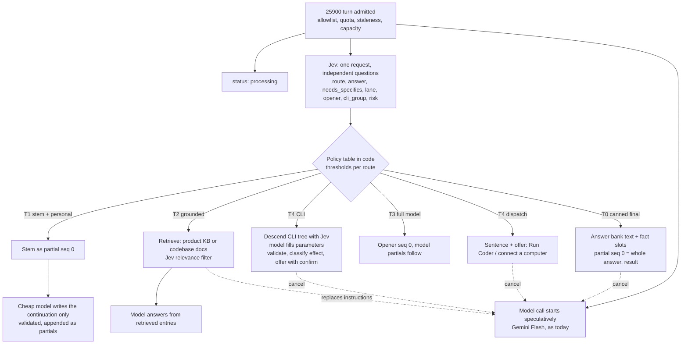

# The chat router: how OpenAgents answers a message, with Jev choosing the route

Status: implemented and deployed on 2026-09-28 (the core in
[#9922](https://github.com/OpenAgentsInc/openagents/issues/9922), T1
personalization, the product and codebase knowledge routes, the CLI route,
and the phone's offers), with every question asked as structured entries
and the policy tuned on the labeled set's tune split
([Structured questions and tuning](#structured-questions-and-tuning-2026-09-28)).
On 2026-09-29 the question set became `chat-router-v2`, with the Gym and
eval routes, the Gym's records, cards, and eval offers; it is deployed on
the chat worker (release `0546032e17`) and serves build 21's Gym in chat
([Gym and eval routes](#gym-and-eval-routes-2026-09-29)). Later that day it
became `chat-router-v3`, with the `capability.missing` route and the
`capability` question over the admitted-capability set
([The admitted-capability set and `capability.missing`](#the-admitted-capability-set-and-capabilitymissing-2026-09-29)).
On 2026-09-30 it became `chat-router-v4`, with the `presentation.open` route
and, on a desktop turn, the `deck` question over the decks the desktop app
ships ([Opening a deck](#opening-a-deck-presentationopen-2026-09-30)).
It extends the first response that shipped in `95c7eda2e3` (`crates/coder/src/first.rs`,
[the first-reply measurement](../measurements/2026-09-28-first-reply.md)) and
the product change in `820bc02ce4` (the first tab is **Chat**, the assistant
speaks as OpenAgents in the plural, and Coder is what gets dispatched).
Tracking: [#9920](https://github.com/OpenAgentsInc/openagents/issues/9920).

The owner's request, in short: much of what a new user does first is kick the
tires (what model is this, who are you, what does it cost, what can you do).
Those questions deserve prebuilt answers that Jev selects and the phone shows
almost at once. Requests for code changes or for looking around a repository
should be answered with "we'll dispatch Coder" and a way to do it. Canned
answers can be personalized by a free or cheap fast model when the user's own
words matter. Other routes should cover the `openagents` command (descending
its command tree level by level, then generating parameters), the OpenAgents
product knowledge base, and knowledge of the OpenAgents codebase.

This document proposes the router's shape, its typed route schema, the answer
bank, the personalization contract, the wire behavior, the initial route
catalog, and how it is measured and rolled out. It ends with questions only
the owner can answer.

## Contents

- [What exists today](#what-exists-today)
- [Goals and latency budgets](#goals-and-latency-budgets)
- [Architecture](#architecture)
- [The typed route schema](#the-typed-route-schema)
- [The code: `coder::router` and its seams](#the-code-coderrouter-and-its-seams)
- [Structured questions and tuning](#structured-questions-and-tuning-2026-09-28)
- [Confidence, thresholds, and fallbacks](#confidence-thresholds-and-fallbacks)
- [The answer bank](#the-answer-bank)
- [Personalization with a cheap model](#personalization-with-a-cheap-model)
- [On the wire](#on-the-wire)
- [The initial route catalog](#the-initial-route-catalog)
- [The CLI route: descending the command tree](#the-cli-route-descending-the-command-tree)
- [Knowledge routes: product and codebase](#knowledge-routes-product-and-codebase)
- [Dispatching Coder](#dispatching-coder)
- [Safety and invariants](#safety-and-invariants)
- [Evaluation and training data](#evaluation-and-training-data)
- [Metrics](#metrics)
- [Rollout](#rollout)
- [Gym and eval routes (2026-09-29)](#gym-and-eval-routes-2026-09-29)
- [From the terminal: `openagents chat` (2026-09-30)](#from-the-terminal-openagents-chat-2026-09-30)
- [Delegation requests (2026-09-30)](#delegation-requests-2026-09-30)
- [Engine requests (2026-09-30)](#engine-requests-2026-09-30)
- [Follow-ups after a Coder run (2026-10-01)](#follow-ups-after-a-coder-run-2026-10-01)
- [Open questions for the owner](#open-questions-for-the-owner)

## What exists today

This table was the starting point when the router was proposed; it is
updated to what `main` holds on 2026-09-28. The router itself is
implemented ([Implemented core](#implemented-core-2026-09-28)): the
`chat-router-v1` judgment, the answer bank, T1 personalization, the product
and codebase knowledge bases, the CLI route (`coder::cli_route`, wired into
the worker as its CLI seam), and the phone's offers, which run a proposed
read-only command on the phone or, through `openagents --json` over
NIP-HOST `terminal.open`, on the connected computer.

| Piece | Where | What it does |
| --- | --- | --- |
| Chat wire | [NIP-CJ](../../../nips/openagents/NIP-CJ.md) | Phone sends a kind `25900` job, NIP-44 encrypted to the chat worker; the worker answers with `27000` feedback (`status`, `judgment`, `partial`) and one `26900` result. All ephemeral; the relay sees ciphertext. |
| Chat worker | `crates/coder/src/bin/coder-worker.rs`, `crates/coder/src/relay/quota.rs` | Open under a quota (6 jobs a minute and 40 a day per key; a global day total), admits, then calls the model. Its log lines carry configuration and errors; this review found none that print message text. |
| Model door | `crates/coder/src/generate.rs` | Vercel AI Gateway, lane `gemini` = `google/gemini-3.8-flash` (also `glm` = `zai/glm-5.3-flash`). 3.0 to 4.3 s to first token. |
| First response | `crates/coder/src/first.rs`, `crates/coder/src/router/` | Before the router: one Jev request beside the model call (`action`, `lane`, `opener`), the argmax opener as partial `seq` 0 about 0.6 s after Send. Now a turn that asks for `router` gets the `chat-router-v1` judgment instead (route, prepared answer, risk, lane, opener), and `first.rs` keeps only what the router and the suggestion ranking share. Opt-in, so Microcoder's cloud steps keep JSON-only replies. |
| Rank | `crates/coder/src/first.rs` | A `rank` job orders up to 16 candidate repos or actions by one Choice. Metered as a turn. |
| Phone | `crates/openagents-mobile/src/basic_coder.rs`, `router.rs`, `coder_tab.rs` | Sends the instructions (speaking as OpenAgents, in the plural), the bounded transcript, `client`, `opener: true`, and the `router` request with a bounded `context` (surface, whether a computer is ready, build, and since #10077 the paired computer's name and the chat's project folder name). No credential, model, grant, or path. Shows the router's offers as its own controls: Run Coder or Connect a computer, screen chips, read-only command cards, follow-up chips, a "Prepared answer" note, and **Wrong answer**. Every new chat goes to OpenAgents; Coder runs on a computer only when the person picks one. Ships in TestFlight build 20 (build 19 sends only `opener`). |
| Jev client | `crates/jev` | `SystemOneRequest` with `Noul` (probability of yes), `Choice` (up to 255 options, with `confidence` and full `probabilities`), `Score` (2 to 10 ordered levels). Questions in one request are answered independently and in parallel. |
| Decision profile | `crates/coder/src/decision.rs`, `crates/coder/src/profiles.rs` | Resolves the one `jev::Client` every call site uses (hosted `jev-latest`, or local Kev/Lev). |
| Knowledge base | `crates/knowledge`, `knowledge/`, [the KB design](knowledge-base.md), [NIP-KB](../../../nips/openagents/NIP-KB.md) | 211 entries of coding knowledge (methods, edge cases, slips). Retrieval is embeddings (`text-embedding-3-small` via OpenAI or OpenRouter, or Vertex) plus BM25, then a Jev Noul relevance filter. Product entries now live in `knowledge/openagents/` (52 admitted) and are served by `coder::product_kb`; see [Product knowledge base](#product-knowledge-base). |
| Code search | `crates/plugin-code-search` | Literal and `*` pattern search over a granted snapshot, ranked by distinct patterns matched. |
| `openagents` command | `crates/openagents-cli`, [its guide](../../cli/README.md) | About 30 groups; each group's syntax is a `USAGE` string. `openagents mcp serve` already parses the top-level help table into tools (`mcp::groups`). |
| OpenRouter client | `crates/openrouter` | Chat completions with a JSON-schema response, usage and cost, embeddings, and a streamed reply (`Client::stream`, added for personalization). |

The rule that constrains every choice below, from `AGENTS.md`: no keyword
matching for intent or tool routing. Routing is a typed semantic selector
(Jev), embedding search, a structured planner, or a modeled parser;
deterministic parsing only after the route is chosen, and only for bounded
fields such as IDs, amounts, and enum values.

## Goals and latency budgets

Goals, in priority order:

1. **Never wrong fast.** A canned answer that answers the wrong question is
   worse than a slow right one. The canned tier is gated on measured
   precision, not on confidence alone.
2. **Something true on screen in well under a second, for every message.**
   Today that is the opener. The router makes it a complete answer for the
   questions that have one.
3. **Say what will happen, then make it one tap.** Work that needs a
   computer gets a plain sentence and an action (Run Coder, connect a
   computer, open a screen), never a model's guess at doing the work in chat.
4. **Spend the full model only where it adds something.** A turn answered from
   the bank costs a Jev call, not a Gemini call.
5. **Every factual claim in a canned answer is sourced.** The model name,
   limits, and privacy statements come from configuration and tested
   invariants, not from prose someone typed once.

Budgets, measured from Send on the phone. Today's relay setup is about 300 ms
of every number (a fresh connection per turn); a kept connection, already
recommended in the measurement, would take that off.

| Tier | First visible words | Complete | Today's equivalent |
| --- | --- | --- | --- |
| T0 canned final | ≤ 700 ms (≤ 400 ms with a kept connection) | same event | opener at 0.6 to 0.75 s, answer at 3.2 to 5.2 s |
| T1 canned stem + personalization | ≤ 700 ms (the stem) | ≤ 1.8 s | same |
| T2 retrieval-grounded model (KB, codebase) | ≤ 700 ms (opener or stem) | first grounded token ≤ 3.5 s | same |
| T3 full model | ≤ 700 ms (opener) | model's own time, 3 to 5 s to first token | unchanged |
| T4 dispatch or CLI proposal | ≤ 700 ms (the sentence) | action card ≤ 1.2 s; CLI parameters ≤ 3 s | Run Coder button only |

## Architecture

The router is a pure module in `crates/coder` (proposed `coder::router`, the
same shape as `coder::first`: a state in, a request out; an answer in, a
reading out), consumed by `coder-worker`. It runs only for a turn that asks
for it, the way `opener` does today.



The same thing as a timeline for a canned turn:

```text
t=0     Send
~300    relay connected, REQ/EOSE (0 with a kept connection)
~430    worker: status processing; Jev request and model request both in flight
~600    Jev answers: route=meta.model p=.93, answer=meta.model p=.88, needs_specifics=.07
~620    partial seq 0: "Our chat runs on Gemini 3.8 Flash from Google, …"  (T0)
~630    result 26900: same text, tier=canned, answer=meta.model@3
        model request cancelled (its tokens so far are the only waste)
```

Four decisions carry the design:

- **One Jev request per turn for routing.** All questions read the same
  state and are answered independently, so asking `answer` and `cli_group`
  speculatively alongside `route` costs tokens but no round trip (the
  TypeSafe guidance: ask independent questions together, consume only the
  applicable answers). A second Jev request happens only when an earlier
  answer is needed to build new state: retrieval candidates for relevance,
  the next CLI level's options.
- **The model call still starts beside the judgment, never behind it.** That
  keeps the current invariant (a slow or failed judge never delays the
  model) and makes every fallback free: the model is already running. When
  the policy picks a tier that does not use the model, the worker cancels the
  stream. The cost is the tokens the model emitted in the ~200 ms before
  cancellation, which is usually none (first token is at 3 s). See
  [question 1](#open-questions-for-the-owner) for the alternative of holding
  the model call for known-canned routes.
- **Code owns policy.** Jev returns probabilities; a table in code maps
  `(route, answer, needs_specifics, lane)` plus thresholds to a tier. Changing
  a threshold never reruns inference and never changes a question's meaning.
- **Text the user sees comes from three places only**: the answer bank
  (reviewed, versioned), a model continuation (bounded and validated), or the
  full model (as today). Jev writes no text.

## The typed route schema

### The Jev question set: `chat-router-v1`

One request, seven questions, over the state `coder::first::state` already
builds (the bounded transcript and latest message) plus a small `context`
object the phone may send (see [On the wire](#on-the-wire)).

| Id | Type | Question (abridged) | Options |
| --- | --- | --- | --- |
| `route` | Choice | "Which kind of reply does the user's latest message call for?" | the route ids in the [catalog](#the-initial-route-catalog), each with its semantic description, plus `none` |
| `answer` | Choice | "Which prepared answer, if any, fully answers the user's latest message as asked?" | every bank entry's id with its `when` text, plus `none` |
| `needs_specifics` | Noul | "Would a good reply need to repeat or refer to specific things the user named (a file, repository, error, feature, or goal), beyond a fixed prepared answer?" | probability of yes |
| `lane` | Choice | `coder::first`'s wording, unchanged | `chat`, `computer`, `none` |
| `opener` | Choice | `coder::first`'s wording (openers reworded in the plural, see below) | 21 openers plus `none` |
| `cli_group` | Choice | "If the user wants something done with the `openagents` command, which command group does it?" | the top-level groups from the help table (about 30), each with its summary, plus `none` |
| `risk` | Choice | "Does the message ask for something we must not do or should warn about?" | `ok`, `secret_shared` (the user pasted a key, recovery words, or password), `asks_for_secret`, `harmful`, `money_movement`, `none` |

Why these are separate questions and not one big Choice: `route` and
`answer` are different judgments (a message can be `meta` without any
prepared answer fitting it exactly), `needs_specifics` is the
personalization switch and is useful on every route, and `risk` must stay
independent so a harmful message is caught whichever route wins. `action`
(respond, clarify, end) is kept as it is for Classify's measured baseline,
and folds into `route` as `clarify` and `end`; the doc proposes measuring
whether `action` can then be retired.

A bank of 40 to 80 entries fits one Choice comfortably (Jev allows 255). If
the bank grows past about 150, `answer` becomes hierarchical: `route` picks
the family, a second question lists only that family's entries.

### What the router returns in code

```rust
/// The router's reading of one turn. Pure data; the worker acts on it.
pub struct Routing {
    pub set: &'static str,            // "chat-router-v1"
    pub bank: BankId,                 // e.g. "chat-answers-v1@<digest>"
    pub route: RouteId,               // the argmax route, or Unknown
    pub route_p: f64,
    pub answer: Option<(AnswerId, f64)>,
    pub needs_specifics: f64,
    pub lane: Lane,                   // coder::first::Lane
    pub opener: Option<OpenerId>,
    pub cli_group: Option<(CliGroup, f64)>,
    pub risk: Risk,
    pub tier: Tier,                   // decided by the policy table
}

pub enum Tier {
    CannedFinal { answer: AnswerId },
    CannedStem { answer: AnswerId },          // stem now, cheap-model continuation next
    Grounded { corpus: Corpus },              // product KB or codebase docs
    Model,                                    // today's path
    Offer { offer: Offer },                   // dispatch, CLI, open a screen
    Refuse { answer: AnswerId },              // a bank refusal, never model text
}
```

## The code: `coder::router` and its seams

Implementation: [#9922](https://github.com/OpenAgentsInc/openagents/issues/9922).
The router lives in `crates/coder/src/router.rs`; the traits other modules
implement live in `crates/coder/src/router/seams.rs`. Each seam has a no-op
implementation, and `Seams::default()` holds only no-ops, so the router
works, and falls back to today's behavior, before any real implementation
lands. Every method returns a `futures_util::future::BoxFuture`, so the
worker holds each seam as `Arc<dyn …>`.

```rust
// T1: writes the rest of a stem's sentence (crates/coder/src/router/personalize*).
pub trait Personalize: Send + Sync {
    fn available(&self) -> bool;               // false: stems close with generic_end
    fn recipients(&self) -> Vec<String>;       // named in the privacy answer
    fn continuation<'a>(&'a self, ask: &'a Ask)
        -> BoxFuture<'a, Result<Continuation, SeamError>>;
}
pub struct Ask { pub route: RouteId, pub answer: String, pub stem: String,
                 pub message: String }         // message: redacted, <= 600 chars
pub struct Continuation { pub text: String, pub model: String }

// T2: product knowledge (knowledge/openagents/) and codebase knowledge.
pub trait ProductKb: Send + Sync {
    fn available(&self) -> bool;
    fn recipients(&self) -> Vec<String>;       // e.g. the embedding provider
    fn ground<'a>(&'a self, lookup: &'a Lookup)
        -> BoxFuture<'a, Result<Grounding, SeamError>>;
}
pub trait CodebaseKb: Send + Sync { /* the same three methods */ }
pub struct Lookup { pub message: String, pub transcript: Vec<Message> }
pub struct Grounding { pub passages: Vec<Passage>, pub commit: Option<String>,
                       pub needs_dispatch: bool }
pub struct Passage { pub id: String, pub title: String, pub text: String,
                     pub source: String, pub relevance: f64,
                     pub answer: Option<String> }   // reviewed short answer, T0 at relevance >= 0.8

// T4 CLI: descends the `openagents` command tree and fills parameters.
pub trait CliRoute: Send + Sync {
    fn groups(&self) -> Vec<CliGroup>;         // the cli_group options; empty: not asked
    fn recipients(&self) -> Vec<String>;
    fn propose<'a>(&'a self, ask: &'a CliAsk)
        -> BoxFuture<'a, Result<CliAnswer, SeamError>>;
}
pub struct CliGroup { pub id: String, pub summary: String }
pub struct CliAsk { pub group: String, pub message: String,
                    pub transcript: Vec<Message>, pub surface: Surface }
pub enum CliAnswer { Proposal(CliProposal), Missing(String), NoCommand }
pub struct CliProposal { pub argv: Vec<String>, pub effect: Effect, pub runs_on: RunsOn }

pub enum SeamError { Unavailable, Failed(String) }   // Failed text: never message text
pub struct Seams { pub personalize: Arc<dyn Personalize>, pub product: Arc<dyn ProductKb>,
                   pub codebase: Arc<dyn CodebaseKb>, pub cli: Arc<dyn CliRoute> }
```

The router, not the implementation, owns the invariants around a seam. It
decides whether a seam is called (the policy table), builds the input (the
latest message passes `router::redact` first, and nothing else from the
turn is included beyond what each input type names), bounds the call
(`PERSONALIZE_BUDGET` 1.2 s, `KB_BUDGET` 2 s, `CLI_BUDGET` 3 s), and checks
what comes back: a continuation passes `router::validate_continuation`, a
passage below `RELEVANCE_FLOOR` (0.5) is dropped, and a CLI proposal passes
`router::gate(effect, surface)` or is not offered (never `spends` or
`secret`; on the phone only `read_only`, and `grants` opens Account >
Computers). `Seams::recipients` feeds the privacy answer, so adding a seam
that sends text somewhere changes what that answer says.

### Implemented core (2026-09-28)

[#9922](https://github.com/OpenAgentsInc/openagents/issues/9922) shipped the
core as `crates/coder/src/router/`:

| Module | What it holds |
| --- | --- |
| `router.rs` | Route, risk, context, offer, and effect types; `gate`, `redact`, `validate_continuation`, `close_stem`, `grounded`, `grounded_note`, and `worker_facts` |
| `router/judge.rs` | The `chat-router-v1` questions (`action`, `route`, `answer`, `needs_specifics`, `lane`, `opener`, `risk`, and `cli_group` when a command tree is wired) and `reading`, which turns an answer into a `Routing` |
| `router/policy.rs` | `decide`: the policy table below, as code, with its thresholds as constants |
| `router/bank.rs` | The bank file's parser, its digest, `Facts`, and the lint |
| `router/wire.rs` | The judgment feedback, the result fields, and the `router` log record |
| `router/rubric.rs` | The structured wording of the questions: instructions, rubrics, and examples from the tune split |
| `router/gym.rs` | The Gym's records, the reply for each Gym and eval route, the grounded news instructions, and the interview step's checks ([Gym and eval routes](#gym-and-eval-routes-2026-09-29)) |
| `router/card.rs` | NIP-CJ `card` feedback built from records, and the request draft's check |
| `gym_kb.rs` | The Gym seam: verified records, the changelog, the tool catalog, and news retrieval |
| `answers/chat-answers-v1.toml` | The bank: 41 entries and 6 openers (53 entries with the Gym's, on 2026-09-29) |

`coder::first` keeps only what the router and the suggestion ranking share.
Where the code settles something this design left open:

- A whole prepared answer (T0) needs the `route` reading to agree: the
  entry must belong to the argmax route at p ≥ 0.80.
- Dispatch by `lane` alone (computer at p ≥ 0.75) is checked after the CLI
  and knowledge routes, which read "which of my computers are online" more
  precisely than the lane does.
- A risk in the warn band (0.60 to 0.85) refuses when the `route` reading
  is also `refuse` at p ≥ 0.80: two independent readings agreeing. Alone,
  it turns off prepared answers, stems, and offers, and a possible secret
  gets `warn.secret_shared` as the lead line above the model.
- A turn that sends only `opener` (the phones before build 20) is decided in
  legacy mode: T0 for entries with no offer, else an opener, else nothing.
- `CODER_WORKER_ROUTER` is `live` (default), `shadow` (log the routed tier
  and serve the legacy one; the judgment's `shadow` field names the routed
  tier), or `off`.
- The phase 0 shadow log is one `router {…}` line per judged turn, whose
  fields are ids, probabilities, tiers, and the judge's time
  (`wire::Shadow`); nothing in it can hold message text.

A live check against Jev over 50 messages across every route (the ignored
test `live_router_eval` in `router/judge.rs`, not the labeled set) chose the
expected route for 47, served 20 whole answers, all correct, and answered in
175 ms at the median and 228 ms at p90. The three misses were "What does
kind 25900 carry?" (read as `clarify`, where `codebase.kb` was expected),
"That answer was wrong" (read as `clarify`, where `general` was expected),
and "Can you work on my Rails app?" (read as `work.dispatch` and offered to
Coder, where `meta` was expected). "How does Coder pick a provider?" chose
`codebase.kb` at only 0.22, below the grounded threshold, so the model
answered it with an opener.

## Structured questions and tuning (2026-09-28)

TypeSafe's System One models read JSON structure in a question's
instructions and in every option's criterion
([Advanced: structure](https://docs.typesafe.ai/primitives/advanced.md)).
Every `chat-router-v1` question now uses it
(`crates/coder/src/router/rubric.rs`):

- **Structured instructions**, `{question, context, focus}`: for `route`,
  "Which kind of reply does the user's latest message call for?", who is
  asking (OpenAgents, which answers in chat and dispatches Coder), and the
  focus "Classify the primary request of the latest message, not every
  topic it mentions."
- **Choice rubrics for boundary clarification**: each `route`, `lane`, and
  `risk` option is `{what, not_for, examples}`. `meta` says it covers
  asking us to connect or link GitHub and whether we can help with a kind
  of work; `work.dispatch` says it is not those, nor questions about how
  the OpenAgents code works, nor checking computers or XP (`cli`); `cli`
  gives "which of my computers are online" as an example.
- **Bank rubrics**: an entry may add `not_for` and `examples`, and the
  `answer` question then reads `{what: when, not_for, examples}`
  (`meta.github`: not a specific task in a repository).
- **Structured Noul criteria** for `needs_specifics`: `{true: {what,
  examples}, false: {what, examples}}`.
- **Walking a taxonomy** for the CLI route: the `cli_group` option and each
  level of the descent read the group's or child's subtree (its commands
  nested as the tree nests them, trimmed to one line per child past 16
  commands), and the descent keeps a beam of two paths scored by the
  geometric mean of their edges, as in TypeSafe's hierarchical
  classification cookbook. A sure `cli` route (p ≥ 0.90) descends an unsure
  group (p ≥ 0.25) beside the next likely groups (p ≥ 0.15, at most two).

Every example is a message from the labeled set's tune split; a test
(`no_example_is_a_held_out_message`) fails if one is a held-out message.
The policy changed in two places: the lane alone no longer offers Coder on
a route with its own answer (`LANE_ROUTES`: only `work.dispatch`,
`general`, `clarify`, and `none`), and a close call between `work.dispatch`
and such a route is not a dispatch.

Measured on the held-out split, one change at a time
([the tuning measurement](../measurements/2026-09-28-chat-router-tuning.md)):
canned precision stayed at 100 % while canned answers served rose from 36
to 44 of 62, dispatch precision rose from 75 % to 94.7 to 100 %, and
"Connect to my GitHub" is answered with `meta.github`.

## Confidence, thresholds, and fallbacks

Starting thresholds. They are placeholders until the labeled set (see
[Evaluation](#evaluation-and-training-data)) sets them to meet the precision
targets; Choice `confidence` measures how concentrated the distribution is,
not whether the workflow is right, so a threshold is only as good as its
measurement.

| Decision | Condition (initial) | Precision target on the labeled set |
| --- | --- | --- |
| T0 canned final | `route` p ≥ 0.80, `answer` p ≥ 0.80, the answer belongs to the route, `needs_specifics` < 0.30, `risk` = ok | ≥ 98 % (wrong canned answers are the failure the user remembers) |
| T1 stem + continuation | `answer` p ≥ 0.70 on an entry with a `stem`, `needs_specifics` ≥ 0.30 | ≥ 95 % that the stem is true for this message |
| Offer: dispatch | `route` = `work.dispatch` p ≥ 0.70, or `lane` = computer p ≥ 0.75 | ≥ 90 %; a false offer costs one ignored card |
| Offer: CLI | `route` = `cli` p ≥ 0.75 and `cli_group` p ≥ 0.60 | ≥ 95 % that the group is right; the command still needs confirmation |
| Refuse or warn | `risk` ∈ {secret_shared, asks_for_secret, harmful} with p ≥ 0.60 | recall matters more: warn when unsure, refuse only at p ≥ 0.85 |
| T2 grounded | `route` ∈ {product.kb, meta, codebase.kb} p ≥ 0.60; below it, or in a close call, `product.kb` or `meta` as the argmax or the close runner-up of `general`, `clarify`, or `none` (#10135) | measured on answer quality, not routing |

Fallbacks, all toward today's behavior:

- **Judge absent, erring, or later than 2.5 s** (the existing `BUDGET`): the
  turn is T3, the model's reply as today. The judge being down never makes a
  reply worse than today's.
- **Below every threshold, or `route` = `none`**: T3 with the argmax opener
  (today's behavior), plus any offer whose own threshold was met.
- **Two routes close** (top two within 0.15): prefer the one that does less.
  An offer loses to an answer; a canned final loses to a stem; a stem loses
  to the model. A clarify route with p ≥ 0.4 wins over a low-confidence
  anything.
- **Cheap model fails, is slow (> 1.2 s), or its continuation fails
  validation**: the stem's generic ending from the bank ("… what you asked
  about.") closes the sentence. The stem is never retracted.
- **Retrieval finds nothing relevant** (no entry at Jev relevance ≥ 0.5): T3
  with a note in the model instructions that we have no documented answer, so
  the model says what it does not know rather than inventing product facts.

## The answer bank

A reviewed, versioned file of short answers in the OpenAgents voice. Proposed
home: `crates/coder/answers/chat-answers-v1.toml`, compiled into the worker
and digested; the digest is the bank's identity in every judgment and result.

```toml
[[answer]]
id        = "meta.model"
version   = 3
route     = "meta"
when      = "The user asks what model or AI powers this chat, or who made the model"
text      = """
Our chat runs on {chat_model} through {chat_model_host}. A small, fast model, \
Jev from TypeSafe, reads each message first to choose how we answer. When we \
dispatch Coder to your computer, it works through the coding agents signed in \
there, such as Codex or Claude Code, or through our own Microcoder."""
facts     = { chat_model = "worker.lane.display", chat_model_host = "worker.door.display" }
sources   = ["crates/coder/src/generate.rs", "docs/deployment/chat-worker.md"]
followups = ["meta.privacy", "meta.pricing", "meta.coder"]
owner     = "chat"
```

Rules for every entry:

- **Plural voice.** "We", "us", "our"; never "I" or "me". A lint refuses a
  first-person singular pronoun in `text` or `stem`. (The 21 current
  openers use "I'll"; they should be reworded to "We'll look into that now."
  and so on in the same change.)
- **Facts are slots, filled by code.** Anything that can change with
  configuration (the model, the limits, the relay, the worker's key) is a
  `{slot}` resolved from the worker's own settings at answer time. A slot the
  worker cannot fill makes the entry ineligible for this turn, never a blank.
- **Every factual claim names its source**: a config key, an `INVARIANTS.md`
  row, or a doc, in `sources`. The lint checks the paths exist. A privacy
  claim must cite an invariant row with a test, or it does not ship.
- **Short.** At most 600 characters; one to three sentences on a phone.
- **Advice is actionable** (the owner's rule of 2026-10-09). An entry that
  tells the reader to do something carries the exact page as an
  `https://openagents.com/...` link or the one command to run in
  backticks, or an offer that does it; short numbered steps only when more
  than one step is truly needed. The bank lint and the product-note check
  flag an instruction with neither (`knowledge::product::unlinked_instruction`,
  a heuristic over our own reviewed copy, never over a person's message).
  The rare exception says why in the entry's `unlinked` field; a product
  note whose steps are screens of the app the reader is in is tagged
  `in-app`, and the website's chat never shows that note whole.
- **True before any work happens.** A canned answer never claims work was
  done or started; offers carry their own action.
- **`when` is written for Jev**, as a description of the messages it answers,
  not a list of keywords. Each `when` includes what the entry does not cover
  when a neighbor is close ("… not how much Coder costs on the user's own
  provider accounts").
- **Stems** (`stem = "Working on"`) are entries whose text ends
  in a continuation written by the cheap model; each has a `generic_end`
  used when personalization is off or fails.
- **Versioned.** A text change bumps `version`; ids are never reused. Old
  versions stay in the file's history so a logged `meta.model@2` can be
  explained.
- **Followups** are bank ids shown as suggestion chips under the answer, so
  a kick-the-tires session can continue at T0 speed.

Initial bank, about 40 entries (full text in the catalog below for the most
common): `meta.who`, `meta.model`, `meta.jev`, `meta.coder`,
`meta.capabilities`, `meta.limits_chat` (what this chat cannot do),
`meta.pricing`, `meta.quota`, `meta.privacy`, `meta.data_retention`,
`meta.open_source`, `meta.computers`, `meta.offline`, `meta.languages`,
`meta.web_access`, `meta.memory` (does it remember me), `meta.team` (who
built this), `smalltalk.hello`, `smalltalk.thanks`, `smalltalk.bye`,
`smalltalk.how_are_you`, `smalltalk.test` ("test", "is this working"),
`dispatch.stem`, `dispatch.no_computer`, `dispatch.explore_stem`,
`dispatch.github_stem`, `wallet.what`, `wallet.receive`, `wallet.send`,
`wallet.units` (BIP 177 amounts), `wallet.backup`, `wallet.never_share`,
`account.computers`, `account.keys`, `account.playtest`,
`account.report_problem`, `refuse.secret_shared`, `refuse.asks_for_secret`,
`refuse.harmful`, `clarify.generic`.

## Personalization with a cheap model

When `needs_specifics` says the user's own words matter, the bank supplies a
stem that is true for every message on that route, and a fast, cheap model
writes only the rest of the sentence.

```text
stem  (bank, shown at ~600 ms): "Working on"
ask   (cheap model):  continue the sentence with what the user asked for,
                      in at most 20 words, as a verb phrase
continuation (≤ 1.8 s): " finding where the relay's retry timeout is set in OpenAgentsInc/openagents and making it configurable."
```

**Continuation only.** The model never rewrites the stem. That keeps NIP-CJ's
rule that the result's text begins with partial `seq` 0, and it bounds what
the model can say: it can name the user's object, not change our promise.

**Model.** Proposed: a free or cheap fast model through `crates/openrouter`
with a JSON-schema answer (`{ "continuation": string }`), for example a flash
tier model with `require_parameters`. The existing gateway door's `glm` lane
(`zai/glm-5.3-flash`) is the alternative with no new credential on the
worker. The choice is measured, not assumed: time to complete answer for a
20-word continuation, cost per turn, and validation pass rate
([question 3](#open-questions-for-the-owner)).

**What may be passed** (the whole prompt, nothing else):

- the route id and the stem;
- the user's latest message, trimmed to 600 characters;
- nothing from earlier turns, no device or worker key, no computer names,
  host keys, or workspace labels the user did not type in this message, no
  wallet data, no `context` fields.

Before sending, a deterministic redaction replaces bounded secret shapes in
the message: Nostr `nsec`, 64-hex keys, BOLT11 invoices, Lightning and
on-chain addresses, and anything the `risk` question flagged as
`secret_shared` stops personalization altogether. This is redaction of
bounded fields after the route is chosen, which `AGENTS.md` allows, not
routing.

**Validation of the continuation**, in code, before it is shown: at most 160
characters, one sentence, no URL, no first-person singular pronoun, no
claim of completion ("done", "fixed", "I have"), no digits that are not in
the user's message. A failure uses the stem's `generic_end`. A Jev Noul
check ("Does the continuation promise anything the stem does not?") is a
candidate for phase 2, measured against the cost of one more call.

**Disclosure.** Personalization sends the latest message to one more
provider. `meta.privacy` must name it, and the worker's privacy invariant row
must list every recipient: the model door, TypeSafe (Jev), and the
personalization provider.

### Implemented and measured (2026-09-28)

[#9927](https://github.com/OpenAgentsInc/openagents/issues/9927) implements
the `Personalize` seam as `coder::router::personalize`
(`crates/coder/src/router/personalize.rs`). The router still owns what the
seam section above gives it (the redacted `Ask`, the 1.2 s
`PERSONALIZE_BUDGET`, `validate_continuation`, and the generic ending); the
module adds the prompt (the `Ask`'s route, stem, and message, nothing
else), two streamed providers, and `check`, which tidies the reply (quotes,
a repeated stem, a missing period) and refuses what the prompt forbids and
the router's validator does not look for: "we", a button, a time, price, or
guarantee the user did not write, a question, and a reply cut off by the
60-token bound. Streaming only ends the call sooner: the continuation is
shown after all of it passes. `crates/openrouter` gained `Client::stream`.
The worker holds `personalize::seam_from_env()`, which is `NoPersonalize`
unless `CODER_PERSONALIZE` names a provider (see
[the chat worker](../../deployment/chat-worker.md)).

Measured with `cargo run -p coder --example personalize_bench`: 20 dispatch,
exploration, and issue requests under the three `dispatch.*` stems, three
rounds (60 calls per provider), from a development Mac after one unmeasured
warm-up call, with no budget applied so the tail shows. "Complete" is the
time from the call to the provider's last byte, when the continuation is
shown if it passes.

| Provider | Model | First delta p50 | Complete p50 | Complete p90 | Max | Valid | Valid within 1.2 s |
| --- | --- | --- | --- | --- | --- | --- | --- |
| OpenRouter | `google/gemini-2.5-flash-lite` | 405 ms | 496 ms | 622 ms | 774 ms | 57/60 | 57/60 |
| OpenRouter | `mistralai/ministral-8b-2512` | 384 ms | 548 ms | 765 ms | 1,502 ms | 50/60 | 48/60 |
| Gateway `glm` lane, run 1 | `zai/glm-5.3-flash` | 996 ms | 1,052 ms | 1,701 ms | 2,858 ms | 40/60 | 36/60 |
| Gateway `glm` lane, run 2 | `zai/glm-5.3-flash` | 962 ms | 1,003 ms | 1,182 ms | 1,628 ms | 57/60 | 51/60 |

The OpenRouter rows and `glm` run 1 were measured before the module moved
onto the router's seam; their validity is counted here under the final
checks (the router's validator refuses `#`, `*`, and backticks, which the
first checks allowed). `glm` run 2 ran under the final checks. OpenRouter
could not be rerun: the account's credits ran out (HTTP 402) between the
runs. Every provider's three refusals in the final checks are the same
message, "work on issue #9920", whose continuation repeats "#9920": the
router's markup rule refuses a `#` even when the user typed it, which the
router should relax for a `#` followed by digits from the message.

An earlier single round also tried `google/gemini-3.1-flash-lite` (736 ms
p50, 19/20, one timeout), `openai/gpt-4.1-nano` (662 ms p50, 20/20, one
repeated "pick up pick up"), and the free `google/gemma-4-26b-a4b-it:free`
(0/20: every call refused). The `glm` lane runs with the Open Responses
`reasoning` effort `none` and Z.ai's `thinking` switch off through the
gateway's provider options. It still sometimes reasons first and spends the
60-token bound before any text (17 of run 1's 20 refusals, none of run
2's), and a larger bound only makes it slower (1.2 to 5 s in hand tests).

**Decision: OpenRouter with `google/gemini-2.5-flash-lite`**, the default
of `CODER_PERSONALIZE=openrouter`. At an equal validation rate (57/60 each
under the final checks) it completes in half the `glm` lane's time at the
median (496 ms against 1,003 to 1,052 ms) and has no call past the 1.2 s
budget, where `glm` has 6 to 9 in 60. At its list price ($0.10 per million
input tokens, $0.40 per million output) a call of about 400 input and 20
output tokens costs about $0.00005. With the stem shown about 600 ms after
Send, its p90 puts a personalized sentence complete at about 1.2 s, inside
the 1.8 s budget; the 1.2 s call budget ends any call that would not be.
Turning it on needs the OpenRouter account funded again (see
[the chat worker](../../deployment/chat-worker.md)); until then
`CODER_PERSONALIZE=gateway` works with the door key the worker already has,
at the `glm` numbers above.

The checks do not judge grammar: in the last round 2 of 20 flash-lite
continuations passed but read awkwardly after their stem ("look through
where the chat worker's quota is implemented"), which the `dispatch.*` stem
choice and the labeled set should measure.

## On the wire

All additive to NIP-CJ, like `opener` and `judge` were; a reader that knows
none of it still renders the reply correctly.

**Request (`25900`)** gains:

```json
{"v": 2, "type": "conversation", "transcript": ["…"], "instructions": "…",
 "client": "openagents-mobile", "opener": true,
 "router": "chat-router-v1",
 "context": {"surface": "phone", "computer_ready": false, "app_build": "1.0.0 (17)"}}
```

`router` asks for routing and implies `opener`. `context` is bounded,
optional, and carries no credential, key, host address, or amount: `surface`
(`phone`, `desktop`, `terminal`), `computer_ready` (whether the device has a
ready computer, so the dispatch answer can say "connect one first"), and the
build (for the bank's version-specific entries). Since #10077 it also
carries `computer` (this device is where Coder runs, with its agents'
readiness, or the phone's paired computer by name) and `project` (the
chat's project folder, with its path only from a computer); see
[Where the chat runs](#where-the-chat-runs-10077). The worker still chooses
its own model; the request never names one.

**Judgment feedback (`27000`)** gains typed fields beside today's `set`,
`lane`, `opener`, and `confidence`:

```json
{"v": 2, "type": "judgment", "verdict": "respond", "line": "…",
 "set": "chat-router-v1", "bank": "chat-answers-v1@9f2c…",
 "route": "meta", "route_p": 0.93, "answer": "meta.model@3", "answer_p": 0.88,
 "tier": "canned", "lane": "chat", "opener": null}
```

**Offer feedback (`27000`, new type `offer`)**, an observation, never
permission, that the phone renders as a card with a button:

```json
{"v": 2, "type": "offer", "offer": "run_coder",
 "target": "connected_computer", "label": "Run Coder"}
{"v": 2, "type": "offer", "offer": "open_screen", "screen": "account.computers",
 "label": "Connect a computer"}
{"v": 2, "type": "offer", "offer": "cli", "argv": ["computer", "list"],
 "effect": "read_only", "runs_on": "this_device", "confirm": true}
```

**Partials.** The streaming rule stays: partials are contiguous deltas from
`seq` 0, and the result replaces them.

| Tier | `seq` 0 | later partials | result `text` |
| --- | --- | --- | --- |
| T0 canned final | the whole answer | none | the same answer |
| T1 stem | the stem | the validated continuation, or the generic end | stem + continuation |
| T2 grounded | the opener or a bank stem ("Here's what our docs say:") | the model's grounded text | all of it |
| T3 model | the opener (as today) | the model's deltas | opener + model text |
| T4 offer | the sentence (bank) | none, or a continuation (T1) | the sentence; the offer rides as feedback |

**Result (`26900`)** gains `tier`, `answer` (id@version, when the bank
supplied text), `route`, and `bank`. `model` stays honest: for T0 it is
`"bank:chat-answers-v1"`, not the chat model, because no model wrote the
text; for T1 it names the continuation model.

**Metering.** A routed turn is admitted and counted exactly like today's
turn: routing happens after admission, and the quota does not change by tier.
Whether T0 turns should count less is [question 4](#open-questions-for-the-owner).

## The initial route catalog

Each route is described semantically (the text Jev reads), not by words to
look for. Examples are messages the labeled set should contain; they are
evaluation data, not triggers.

### 1. `meta`: kicking the tires

- **Description for Jev:** questions about us, the assistant itself: what
  model or AI this is, who we are, who built us, what we can and cannot do,
  what it costs, limits, privacy, whether we remember things, whether we are
  open source.
- **Examples:** "what model are you", "are you ChatGPT?", "who made you",
  "what can you do", "is this free", "how many messages do I get", "do you
  store my chats", "can you browse the web", "are you open source".
- **Tier:** T0 (bank), T1 when the user attaches specifics ("can you work on
  my Rails app?" → `meta.capabilities` stem + continuation).
- **Data:** answer bank with fact slots from worker configuration.
- **Latency:** ≤ 700 ms complete.
- **Safety:** privacy and pricing claims cite tested invariants; no slot, no
  answer.

Sample answers:

> **meta.who** — We are OpenAgents. In this chat we answer questions, explain
> things, and help you plan. When something needs a computer, like reading or
> changing a repository or running commands, we dispatch Coder, our coding
> agent, to a computer you've connected.

> **meta.pricing** — Chatting with us is free right now, up to {day_quota}
> messages a day. Coder runs on your own computer with the coding agents you
> already use there, so it doesn't bill you through us.

> **meta.privacy** — Your messages travel encrypted from your phone to our
> chat worker through our relay, which sees only ciphertext and keeps nothing.
> To answer, we send the conversation to {chat_model_host} for {chat_model}
> and to TypeSafe's Jev, which chooses how we reply. Our worker doesn't keep
> your message text.

> **meta.limits_chat** — In this chat we can't run code, read files, or reach
> your computer. For that we dispatch Coder, which works on a computer you've
> connected.

> **meta.open_source** — We're open source. Everything behind this chat,
> including the worker that answers you, is at
> github.com/OpenAgentsInc/openagents.

### 2. `smalltalk`

- **Description:** greetings, thanks, goodbyes, "is this working", with no
  request in them.
- **Examples:** "hey", "hello?", "thanks!", "test", "good night".
- **Tier:** T0. `smalltalk.bye` also sets `verdict: end_conversation`.
- **Latency:** ≤ 700 ms.

> **smalltalk.hello** — Hi! We're OpenAgents. Ask us anything, or tell us
> about some code you want changed and we'll dispatch Coder.

### 3. `general`: general knowledge and help

- **Description:** questions about the world, programming concepts,
  explanations, writing help, advice: anything answerable in a chat reply
  without our product facts or the user's files.
- **Examples:** "what's a closure in Rust", "explain CRDTs simply", "write a
  regex for emails", "should I use Postgres or SQLite for this".
- **Tier:** T3 with the opener, exactly today's path.
- **Latency:** opener ≤ 700 ms; model's own time after.
- **Safety:** `risk` still applies.

### 4. `product.kb`: OpenAgents product knowledge

- **Description:** how to do something in the OpenAgents app or with
  OpenAgents services: connecting a computer, what the Grid or Verse is, how
  XP works, what NIP-CJ is, how the wallet's amounts work, what a playtest
  report is.
- **Examples:** "how do I connect my Mac", "what's the Grid", "how do I earn
  XP", "why does the wallet say ₿10,000".
- **Tier:** T0 when a bank entry fully answers it; otherwise T2 grounded on
  the product corpus ([below](#knowledge-routes-product-and-codebase)).
- **Latency:** stem ≤ 700 ms; grounded first token ≤ 3.5 s.
- **Safety:** only public, admitted entries; answers cite the entry or doc.

### 5. `codebase.kb`: OpenAgents codebase knowledge

- **Description:** questions about how the OpenAgents software is built:
  where something lives in the repository, how a crate works, what a protocol
  message looks like, why a design choice was made.
- **Examples:** "where is the chat worker's quota implemented", "how does
  Coder pick a provider", "what does kind 25900 carry".
- **Tier:** T2 grounded on docs and a code index of the public repository;
  escalate to a dispatch offer when the answer needs running or reading more
  code than the index holds ("run Coder on the openagents repo to trace it").
- **Latency:** stem ≤ 700 ms; grounded first token ≤ 3.5 s.
- **Safety:** public repository only, at a pinned commit that the answer
  names.

### 6. `work.dispatch`: code changes and repository exploration

- **Description:** the user wants work done on code, a repository, files, or
  a machine: change, fix, build, test, refactor, review a PR, look around a
  repo, find where something is, run a command.
- **Examples:** "fix the flaky test in crates/coder and open a PR", "look
  through my repo and tell me how auth works", "what's in the README of
  OpenAgentsInc/psionic", "bump the version and tag a release".
- **Tier:** T4 offer, with a T1 sentence: stem "Working on" +
  continuation, then the `run_coder` offer (computer ready) or
  `dispatch.no_computer` + `open_screen: account.computers` (none ready).
- **Data:** `context.computer_ready`; the transcript becomes the task prompt
  when the user taps, as **Run Coder** does today.
- **Latency:** sentence ≤ 700 ms, continuation ≤ 1.8 s, card ≤ 1.2 s.
- **Safety:** the router never dispatches. The existing invariant stands: a
  task starts only from a tap, and the target comes from the screen's
  controls, never from reading the message. The model call is cancelled so
  Gemini does not attempt the work in text (the measurement found it tries a
  function call on such prompts).

> **dispatch.no_computer** — That needs a computer. Connect one and we'll
> dispatch Coder there with this conversation.

### 7. `cli`: the `openagents` command

- **Description:** the user wants something that an `openagents` command
  does: list their computers, check a host, read a relay, look up XP, search
  the knowledge base, check wallet status, publish something to the Verse.
- **Examples:** "which of my computers are online", "show my XP", "what
  quests are on the board", "search the knowledge base for docker cp",
  "what capabilities are published on the relay".
- **Tier:** T4 CLI offer; detailed in
  [the CLI route](#the-cli-route-descending-the-command-tree).
- **Latency:** sentence ≤ 700 ms; proposed command ≤ 3 s.
- **Safety:** every command is shown with its effect class and needs a tap;
  money, keys, and grants are never proposed from the phone chat.

### 8. `wallet`: payments and the wallet

- **Description:** questions about the OpenAgents wallet, bitcoin amounts,
  receiving, sending, backup, and fees.
- **Examples:** "how do I get paid", "how do I send bitcoin", "what's ₿",
  "how do I back up my wallet".
- **Tier:** T0 how-to answers with an `open_screen` offer (the Wallet tab);
  T2 grounded on `docs/breez/` for anything the bank lacks.
- **Safety:** chat never moves money, never asks for or shows recovery words,
  and never repeats an amount the user did not type. `risk` =
  `money_movement` turns a request like "send 5,000 to this address" into
  `wallet.send` (how to do it in the Wallet tab) with no amount carried.

> **wallet.never_share** — We'll never ask for your recovery words, and no
> one from OpenAgents will. Keep them offline; anyone who has them has your
> bitcoin.

### 9. `account`: account, settings, and reporting a problem

- **Description:** how to change settings, find identity keys, manage
  computers, turn on a playtest session, or report a problem.
- **Examples:** "where are my keys", "how do I remove a computer", "the app
  crashed, how do I report it".
- **Tier:** T0 with `open_screen` offers (Account > Computers, Identity keys,
  Report a problem).
- **Safety:** `account.keys` never displays a key in chat.

### 10. `clarify`

- **Description:** the message is too ambiguous to act on or answer well.
- **Tier:** T3 with an instruction to ask one question, or T1 with
  `clarify.generic` stem ("To make sure we get this right:") plus a
  continuation that asks the question. Measured against each other.

### 11. `end`

- **Description:** the user is done. Same as Classify's `end_conversation`.
- **Tier:** T0 `smalltalk.bye`; no model call.

### 12. `refuse`: out of scope, harmful, or secrets

- **Description:** requests we must not help with; messages containing a
  secret; requests for someone's key or recovery words.
- **Tier:** T0 bank refusals only; never model text. `secret_shared` answers
  `refuse.secret_shared` ("That looks like a private key or recovery words.
  We won't use it, and we suggest moving those funds or rotating that key.")
  and disables personalization and the offer paths for the turn.
- **Safety:** the full model still answers `harmful` messages that fall below
  the refusal threshold, under its own safety behavior; the bank refusal is a
  floor, not the only guard.

### 13. `capability.missing`: a capability that isn't there yet (2026-09-29)

- **Description for Jev:** the user asks us to do or reach something now
  that would take a capability: book, buy, or order something, send or
  read their email or messages, use their calendar or another account or
  service, browse or open a site, control a device, or fetch live data;
  not a question about whether we can (`meta`), and not work on their own
  code or computer (`work.dispatch`).
- **Examples:** "Book me a flight to Denver next Friday", "read my email
  and tell me what's urgent", "turn off the lights in my living room",
  "what's the current price of bitcoin".
- **Tier:** T0, and only when the `capability` reading agrees: the bank's
  `capability.missing` line (or `capability.missing_near`, naming the
  closest admitted capability) with the `capability` card. See
  [the admitted-capability set](#the-admitted-capability-set-and-capabilitymissing-2026-09-29).
- **Data:** the admitted-capability set, a typed list code builds.
- **Safety:** two independent readings must agree, and the card carries
  nothing of the message; a refusal still comes first.

## The CLI route: descending the command tree

The `openagents` command is a tree: about 30 groups, each with 1 to 20
subcommands, a few with a third level (`wallet channel open`, `x402 policy
set`, `reach directory add`, `sov profile new`, `verse control ENTITY move`),
then positional arguments and `--options`. Every level is already described
in text: the top-level `USAGE` table and each group's `USAGE` string. The
route turns that text into typed choices, one level at a time, then fills
parameters.

### The tree is generated from the help text, never hand-copied

A build step (proposed `openagents-cli` feature `tree`) parses the same
`USAGE` strings `mcp::groups` already parses into a `CommandTree`: each node
has a name, its summary line, its children, and, at a leaf, its usage line
(positionals, options, switches). The router consumes that tree, so a
new or renamed command appears in routing when it appears in `--help`, and a
test fails if a leaf's usage line does not parse.

Each leaf also carries two fields the help text does not have, declared next
to the `USAGE` string in the owning module:

- `effect`: `read_only`, `local_write` (writes this device's stores),
  `publishes` (signs and sends an event), `grants` (changes who may do what:
  `computer approve`, `invite`, `revoke`), `spends` (moves money: `wallet
  pay`, `send`, `x402 buy`), `secret` (`wallet export`), `long_running`
  (`serve`, `tail`, `shell`).
- `runs_on`: where the command can run for this surface: `this_device`
  (the phone's Rust core carries the same client, as `coder_computers::live`
  does for `computer`), `connected_computer` (through `computer exec HOST --
  openagents …`), or `screen` (the phone has a screen that does this better:
  `verse who` is the Grid, `wallet info` is the Wallet tab).

### Descent

```text
level 0  (in the main routing request, free):  route = cli ?   cli_group = computer (p .81)
level 1  (second Jev request, ~200 ms):         which `computer` subcommand?
         options: list, show, link, approve, deny, invite, devices, revoke, forget,
                  enable, disable, retry, workspaces, task, steer, cancel, exec,
                  shell, watch, tail, alias, journal, client-only, none
         → list (p .88)
level 2  only where the leaf has children (e.g. wallet → channel → open)
params   leaf's usage line → JSON schema → fill (below)
gate     validate → classify effect → offer with confirm
```

At each level `none` ends the descent and the turn falls back to T3 with the
opener; a descent never guesses past a `none`. Speculative fan-out is
possible: the main request can also ask the level-1 question for the one or
two most likely groups (their premises stated in the question: "If the user
wants the `computer` group, which subcommand?"), trading tokens for the
second round trip. Measure both.

### Parameters: select where possible, generate only free text

For each positional and option of the chosen leaf:

1. **Enumerable from the device's own state** (a HOST from the device's host
   list, a workspace label from `computer workspaces`, a profile from `key
   list`, an enum from the usage line such as `--rights standard|admin|all`):
   Jev selects among the candidates code supplies ("select instead of
   generate"). The candidates exist only on the device, so on the phone this
   selection runs on the device's request with those candidates included,
   never by sending the host list to the personalization model.
2. **Bounded values the user typed** (a number of lines, a duration, an
   issue number): deterministic parsing of the user's message, allowed now
   that the route is chosen.
3. **Free text** (a task TITLE or PROMPT, a `verse say` line, a KB search
   string): the chat model (or the cheap model) fills a JSON schema derived
   from the leaf, with the transcript as input.

Then the proposal is validated by the same parser the command uses
(`Args::parse` with the leaf's switches) and a dry `--help`-level check that
required positionals are present. A failure asks the user for the missing
piece (T1 `clarify` stem), never runs a guessed default.

### Gates

| Effect | Phone chat | Desktop or terminal chat |
| --- | --- | --- |
| `read_only` | offer, one tap; result rendered as a card | offer, one tap (or auto-run if the owner opts in) |
| `local_write`, `publishes` | offer, one tap, the exact argv shown | offer, one tap |
| `grants` | open the screen that does it (Account > Computers) | offer with the full argv and a second confirm |
| `spends`, `secret` | never proposed; `open_screen` to the Wallet tab | never proposed from chat |
| `long_running` | not offered on the phone | offer, shown as a session |

The proposal is an offer, not permission: the tap runs it under the device's
own authority and the command's own checks, exactly as if the user typed it.

## Knowledge routes: product and codebase

### Product knowledge base

The existing `crates/knowledge` format is the right container, with a new
corpus and kind, not a new system:

- **Corpus:** `knowledge/openagents/` entries of a new kind `product`, same
  YAML front matter (`id`, `version`, `title`, `summary`, `applies_when`,
  `status`, `provenance`), written from the public docs: the launch
  roadmap, `docs/breez/amounts.md`, `docs/game/playtesting.md`, the CLI
  guide, the NIPs' plain-language summaries, the Verse and Grid docs. Only
  `admitted` entries are served, and admission here is operator review (a
  product fact cannot be "measured to help" the way a coding method can).
- **Answer fields:** a `product` entry may carry `answer` (a bank-quality
  short answer in the plural voice). When Jev's relevance for that entry is
  ≥ 0.8 and `needs_specifics` is low, the entry's answer is served at T0.
  This is how the answer bank and the KB meet: the bank is for questions
  about the chat itself; the KB is for everything else we document.
- **Retrieval:** the KB's existing path: embeddings plus BM25 for 20
  candidates, a Jev Noul relevance question per candidate, at most 6 kept.
  Two requests after routing (embedding, then Jev), so T2 starts at about
  1 s. The embedding of the user's message can start speculatively beside
  the routing request.
- **Generation:** the chat model, with the kept entries as reference
  material and an instruction to answer only from them and cite entry ids;
  the phone renders citations as links to the docs.
- **Publishing:** NIP-KB already signs and syncs entries, so the same corpus
  can later serve Coder on the user's computer and third-party agents.

**Status (2026-09-28, [#9923](https://github.com/OpenAgentsInc/openagents/issues/9923)):
implemented.** `knowledge/openagents/` holds 52 admitted entries;
`knowledge::product` loads and checks them (sources exist and are public,
plural voice, answers at most 600 characters), and `coder::product_kb`
implements `router::seams::ProductKb`. It differs from the proposal above in
three ways. Candidates are the 8 nearest by embedding cosine similarity
alone, with no BM25 and no word-matching fallback, because the corpus is
small and the workspace rule prefers embedding search. Jev's request adds
one `answer` Choice over the candidates' reviewed answers beside the
per-candidate relevance Nouls, and a passage carries its answer only when
that Choice picked it at 0.8 or more, so T0 needs both judgments. And the
grounded instructions and the citation check live in `knowledge::product`
for the router's T2 call. On 110 held-out questions, all 82 answers it
would serve at T0 were correct, and grounded replies cited no entry they
were not given ([measurement](../measurements/2026-09-28-product-kb.md)).
The corpus loads at run time from `OPENAGENTS_PRODUCT_KNOWLEDGE` or the
checkout; a worker deployed without the checkout needs that variable.

### Codebase knowledge

Three depths, chosen by the router's `route` and a second Noul ("Can this be
answered from documentation, without reading source code?"):

1. **Docs.** `docs/` (505 documents in the catalog), crate READMEs, and
   `INVARIANTS.md`, chunked by heading and embedded at a pinned commit of the
   public repository. Same retrieval and relevance filter as the product KB.
2. **Code index.** Symbol and module doc comments (`//!` and `///` blocks,
   which in this repository are unusually complete), plus literal search
   through `plugin-code-search` over a snapshot at the same pinned commit. The
   worker holds the snapshot; nothing reaches the user's machine.
3. **Dispatch.** Anything that needs tracing, running, or reading more than a
   few files becomes a `work.dispatch` offer with the openagents repository
   named as the workspace, on the user's computer if connected.

Answers name the commit they read ("as of `820bc02`").

Implemented in `coder::codebase` ([#9924](https://github.com/OpenAgentsInc/openagents/issues/9924)):
the index, where it lives, and how it is refreshed are in
[codebase-kb.md](codebase-kb.md).

Private material never enters either index: only this public repository,
never `alpha` or other private repositories, which `AGENTS.md` keeps behind a
private/public boundary.

## Dispatching Coder

The router's job at dispatch is to say what will happen and put one tap in
front of it; the dispatch itself uses the paths that exist.

| Target | When offered | What the tap does | Status |
| --- | --- | --- | --- |
| Connected computer | `context.computer_ready` | NIP-HOST `task.create` whose prompt leads with the message that asked for the work, then at most six earlier turns, as **Run Coder** does | exists |
| No computer yet | not ready | opens Account > Computers; the conversation is kept for the task | exists |
| OpenAgents cloud | no computer, and the task is repository exploration of a public repo | a cloud workroom task (Cloud crates, `docs/cloud/`) | future; [question 6](#open-questions-for-the-owner) |
| GitHub | the user names a GitHub issue or PR and wants it worked | a task on the connected computer whose prompt carries the issue, then a PR | via the computer today; a GitHub-native path is future |

The dispatch sentence varies by `route` stem: `dispatch.stem` ("We'll
dispatch Coder to …") for changes, `dispatch.explore_stem` ("We'll have
Coder look through …") for exploration, `dispatch.github_stem` ("We'll have
Coder pick up …") for issue work.

The host-side first response noted in the measurement (the host asking the
same judgment at `task.create`) should adopt this router's set, so a chat
that moves from the worker to a computer keeps one route vocabulary.

## Safety and invariants

Proposed `INVARIANTS.md` changes, each with its test, in the change that
implements it:

1. **Routing is typed.** Every route, answer, group, and subcommand choice
   is a Choice or Noul argmax over options code lists; no routing reads
   message text by keyword. Deterministic parsing only for bounded fields
   after the route is chosen, and for secret redaction. (Extends the
   `coder::first` row.)
2. **The judge never delays the model.** Unchanged; the router keeps the
   model call beside the judgment. A tier that does not use the model may
   cancel it.
3. **A canned answer is bank text with code-filled slots**, from a bank whose
   digest the result names; an unfillable slot makes the entry ineligible.
4. **A personalization prompt carries only the route, the stem, and the
   latest message (redacted, 600 characters)**; its continuation is
   validated and appended after the stem, never replacing it.
5. **An offer is not permission.** Dispatch, CLI, and screen offers act only
   on a tap; CLI offers never include `spends` or `secret` commands, and on
   the phone never `grants` (those open the screen).
6. **Privacy disclosure matches recipients.** The privacy answer and the
   worker's row name every service a message reaches (model door, TypeSafe,
   personalization provider, embedding provider for T2).
7. **The router is opt-in per request** (`router`), so Microcoder's cloud
   steps keep JSON-only results, as `opener` is today.

## Evaluation and training data

**Built ([#9925](https://github.com/OpenAgentsInc/openagents/issues/9925)):** 457 rows in
`crates/coder/fixtures/chat-router/routes-v1.json`, exported as the Gym
suite `chat-router-v1`; the eval runner is `crates/coder/tests/router_eval.rs`
and the numbers are in
[the router eval measurement](../measurements/2026-09-28-chat-router-eval.md).
The suite's question set, `crates/gym/questions/chat-router-route-v2.json`,
is generated from the production router's structured `route` question
(`coder::router::judge::route`), and `router_suite.rs` fails when the file
and the router's question differ, so a Gym score measures the question the
worker asks ([#9929](https://github.com/OpenAgentsInc/openagents/issues/9929));
`chat-router-route-v1` is the earlier plain-text question, kept for its
history.

**The labeled set: `chat-router-v1` in the Gym.** A JSON suite beside
`crates/gym/questions/coder-turns-v1.json`, each row a transcript and the
expected `route`, `answer` (or `none`), `needs_specifics`, `cli_group`, and
`risk`. Sources:

1. **Seed, by hand:** about 400 rows written to cover every route and every
   bank entry, with deliberate near-misses between neighbors (`meta.pricing`
   versus "how much does Codex cost", `product.kb` versus `codebase.kb`,
   `wallet.send` versus a request to send), and paraphrases in several
   languages.
2. **Owner and team transcripts:** the owner's own chats, exported with
   consent, labeled.
3. **Playtest reports:** the playtest session log deliberately never records
   message text ([playtesting](../../game/playtesting.md)). So router data
   from testers needs an explicit, per-report opt-in: a **Share this chat**
   control on **Report a problem**, previewed in full like the screenshot,
   plus a lightweight "wrong answer" action on a canned reply that sends the
   message, the chosen `answer@version`, and the judgment. Both need their own
   invariant rows.
4. **Shadow judgments:** in phase 0 the worker asks the router set on real
   turns but serves today's reply; the judgment feedback and the result are
   both on the phone, so the phone (not the worker, which keeps no text) can
   hold them for a tester who shares.

**Held out:** 30 % of rows, never used to pick thresholds or tune `when`
text. Wording changes to the bank's `when` fields or the route descriptions
are optimization candidates measured on the tuning split, then checked once
on the held-out split, as the [optimization design](../../optimization/README.md)
requires for any semantic contract.

**Baselines:** the constant (always T3), the current opener-only path, and
an embedding nearest-neighbor over bank `when` texts. The router has to beat
the embedding baseline on canned precision to justify its questions.

## Metrics

| Metric | Target at phase 1 exit |
| --- | --- |
| Canned precision (T0 answers judged correct, held-out) | ≥ 98 % |
| Canned coverage (share of real turns served at T0) | reported; expected 25 to 40 % in the first week of a user's use |
| Time to first visible words, p50 / p95 | ≤ 650 / 900 ms (≤ 400 / 600 ms with a kept connection) |
| Time to complete answer at T0, p50 | ≤ 700 ms |
| Model spend per 100 turns | down by at least the T0 share |
| Dispatch offer precision; tap-through rate | ≥ 90 %; reported |
| CLI group precision; proposal validity (parses, required args present) | ≥ 95 %; ≥ 90 % |
| Wrong-answer reports per 1,000 canned answers | < 5 |
| Fallback rate (judge absent or late) | < 2 % |
| Personalization validation failure rate | < 10 % |

## Rollout

| Phase | Ships | Exit condition |
| --- | --- | --- |
| 0. Shadow | `chat-router-v1` question set, the bank file with lint, routing asked beside today's reply, judgment fields on the wire; openers reworded in the plural | labeled set built; router beats the embedding baseline on held-out canned precision |
| 1. Canned tier | T0 for `meta`, `smalltalk`, `end`; followup chips; cancel the model on T0 | canned precision ≥ 98 % live on the owner's and testers' shared chats |
| 2. Offers and stems | `work.dispatch` offers with `dispatch.*` stems, `open_screen` offers for account and wallet, T1 personalization | dispatch precision ≥ 90 %; personalization latency and failure rate in budget |
| 3. Product KB | `knowledge/openagents/` corpus, T2 grounded answers, entry answers at T0 | answer quality review on 100 held-out product questions |
| 4. CLI route | `CommandTree` from `USAGE`, effect and `runs_on` per leaf, descent and parameter filling; desktop and terminal first, then phone `this_device` read-only commands | proposal validity ≥ 90 %; zero `spends`/`secret` offers in the logs |
| 5. Codebase knowledge | docs and code index at a pinned commit, escalation to dispatch | answer quality review; citation accuracy |

Each phase is its own issue under #9920's umbrella, with its invariant rows
and tests in the same change.

## Gym and eval routes (2026-09-29)

Implemented in [#9936](https://github.com/OpenAgentsInc/openagents/issues/9936)
(epic [#9931](https://github.com/OpenAgentsInc/openagents/issues/9931)): people
use the Gym and extension evals through this router
([extension evaluation](../../extensions/evaluation.md#chat-the-product-path),
[wireframe revision 3](../../product/2026-09-28-app-wireframe.md#chat-in-the-loop)).
Selection stays Jev's typed questions; nothing matches words. Measured in
[the chat-router-v2 measurement](../measurements/2026-09-29-chat-router-v2.md).

**Status, as shipped and measured (2026-09-29).** Every route below is
implemented and live on the chat worker. The worker's releases:
`17c7484f9f` (the routes, #9936), `ebaa2af04a` (skill-shaped tools stay in
the interview, #9945, with the subscription probe for #9946), and
`0546032e17` (the starter test sets offered, #9943, and news without ids
or banned words, #9944).

| Route | Status | Held-out precision | Live check |
| --- | --- | --- | --- |
| `gym.news` | Live | 100 % | "What's new in the Gym?": first words at a median 1.15 s and the whole reply at 2.5 s over ten fresh-key runs on `dbad257c51` (#9950), with no id or banned word (#9944) |
| `eval.run` | Live | 100 %; the right tool on 6 of 6 offers (#9943) | "Test Project map on Coder" answered in 0.60 s with the tool card and `start_eval` for the starter test set; a phone ran it to a result (#9939) |
| `eval.author` | Live | 100 % (7 of 7 after #9945) | 11 of 11 make-a-tool requests went the right way: skills to a draft, tools that need new code to a Coder offer (#9945) |
| `eval.check` | Live | 100 % | The check card and **RUN THE CHECK**; see the known miss below |
| `eval.result` | Live | 87.5 % | A named tool's published result, or **See your result** |
| `eval.credit` | Live | 87.5 % | The bank's answers; the phone draws `CARD-07` from its ledger |

Across the held-out set, canned precision stayed 100 % and dispatch 94.7 %
over two runs; the v1 rows stayed inside their recorded spread. Known
misses:

- A bare "What's a test?" reads `general` with `gym.what_test` at 0.40 to
  0.54, so the model answers it.
- "Is there a result I can check?", the **Check a result** chip's first
  message, reads `eval.check` at only 0.46 to 0.54 and falls to the model,
  which has no records. The chip's message changes to "Find me a result to
  check", which reads `eval.check` at 0.99 live.
- "What's the Gym?" reads `product.kb` and answered from the Gym note
  before it was reworded for evals; the reworded note ships with the next
  worker deploy.

### The question set: `chat-router-v2`

The route list is part of the set's identity, so it is a new set.
`route` offers 18 routes, the 12 of `chat-router-v1` (`RouteId::V1`, so a
judgment recorded under v1 still reads) and six more, each with a
`{what, not_for, examples}` rubric from the tune split:

| Route | What it covers | What the turn shows |
| --- | --- | --- |
| `gym.news` | What's new or in progress in the Gym: results, test sets, checks, adoptions, other trainers' work, our latest build (`CHAT-9`) | The model, grounded in the Gym's records, and the `news` card (`CARD-05`) |
| `eval.run` | Test a tool on Coder, try a tool, which tool to test (`CHAT-2`, `CHAT-4`) | A bank line, the `tool` card (`CARD-01`), and `start_eval` when the tool has a published test set |
| `eval.author` | Make a tool or a test set with us, and the interview's replies (`CHAT-10`) | One interview step from the author seam, with the `draft` card (`CARD-02`) and its offer |
| `eval.check` | Check another trainer's result (`CHAT-13`) | A bank line, the `check` card (`CARD-06`), and `start_eval` on its test set |
| `eval.result` | How a test or a tool did (`CHAT-5`) | A named tool's published result as the `result` card (`CARD-04`), or **See your result** (`open_screen gym.result`): the person's own results stay on the phone |
| `eval.credit` | What their work earned, how XP from tests works (`CHAT-14`) | A bank answer (`eval.credit.how`, `eval.credit.mine`); the phone draws `CARD-07` from its own ledger |

One more question joins the request when the Gym seam lists a tool
catalog: `tool`, a Choice over the tool notes (`knowledge/openagents/openagents.tool-*.md`,
one per plugin in `deploy/eval-runner/catalog`, in its order, #10090) plus `none`, each option the tool's
name and plain line. A request may name `chat-router-v1` (build 20) or
`chat-router-v2`; both are routed with v2, and the judgment says
`chat-router-v2`.

### Policy

`router::policy::decide` gained three rules:

- **An open interview continues** (rule 0). A request whose `draft`
  passes NIP-CJ's `parse_draft` continues the interview (`Tier::Author`)
  unless the route is sure (0.80) of a route outside `AUTHOR_CONTINUES`
  (the interview's own, `eval.run`, `eval.result`, and the short replies
  that read `smalltalk`, `clarify`, `general`, or `none`); a refusal still
  comes first.
- **Gym and eval** (rule 9, after the knowledge routes). `gym.news` at
  0.60 (`GROUNDED_ROUTE`) or another eval route at 0.70 (`EVAL_ROUTE`,
  like a dispatch offer): `eval.author` is `Tier::Author`, `eval.credit`
  the bank (a sure credit `answer` reading picks the entry, else
  `eval.credit.mine`), and the rest `Tier::Gym { route, tool }`, with the
  `tool` reading at 0.60 (`TOOL_CONFIDENCE`).
- **No records, no numbers** (rule 12). The model gets
  `gym::NO_RECORDS_NOTE` whenever the route or a close runner-up is a Gym
  or eval route, so an unsure Gym turn never states a result.

`Tier::Gym` keeps the model running as its fallback until the Gym seam
answers (2 s, `GYM_BUDGET`); `Tier::Author` drops it at once, since the
interview's words come from its seam or the bank.

### The Gym's records (`coder::gym_kb`)

The Gym seam (`router::seams::GymKb`, implemented by
`gym_kb::GymKnowledge`) holds only verified records:

| Record | Where it comes from | How it is verified |
| --- | --- | --- |
| Published results and checks | `3189` with `oa:ext-eval:v1`, read from the relay every 10 minutes | `nostr::eval_ext::parse_publication`: signature, markers, the inline report against its digest and `x` tag, the profile; checks counted by `nostr::eval_ext::linkage` |
| Published test sets | The starter test sets: `eval-suite` releases (NIP-EXT `3184`) signed by `gym_kb::STARTER_PUBLISHERS` (the hosted runner), with their files from the runner's public bucket; or the test set a verified result ran | `gym_kb::suite_record`: the release's signature and marker, the manifest, suite, and case manifest against their digests; the tool by the package's slug, the size by the case count (#9943); a result's suite release and case count otherwise |
| Adoptions | `coder-defaults` releases | The same release reader |
| App builds | `CHANGELOG` in `crates/openagents-mobile/src/account.rs`, compiled in, newest three | Read for its fixed shape (`gym_kb::changelog`) |
| Notes and the tool catalog | `knowledge/openagents/` entries tagged `gym` or `tool` | The product corpus's own checks (sources exist, plural, short) |

A published subject is matched to a catalog tool by its DefinitionRef's
package or component slug against the tool note's tags (`repo-map`,
`project-map`), else named by its package. For `gym.news`, candidates are
the 8 items nearest the message by embedding similarity and the 4 newest
dated records; one Jev request asks a `relevant_N` Noul for each, and at
most 5 at 0.5 or more are kept. The model is restarted with
`gym::instructions`: answer only from these items, cite each by its
`gym:` id, plain words; `gym::check_reply` reports any other cited id as
invented. The seam's embedder is the product knowledge base's, so it adds
no recipient to the privacy answer.

### The reply for each route (`router::gym::reply`)

A pure function of the route, the `tool` reading, the records, the bank,
and the facts. The bank's Gym entries that say what the records hold
carry `records = true`: the `answer` question never offers them, and
their `{tool}` and `{tests}` slots are filled only from a verified
record. With no catalog at all, `eval.run` is the model told it has no
records; with no Gym seam (`Unavailable`), each route answers from empty
records ("No published result is waiting for a check right now").

### Cards and offers on the wire

Every card and offer body is written and checked by NIP-CJ's own writer
(`nostr::cj_conversation::card_feedback`, `offer_feedback`,
[#9932](https://github.com/OpenAgentsInc/openagents/issues/9932)); one it
refuses is not sent. `router::card::Card` builds the NIP-CJ card from
records, so its numbers are the records' fields. The fixtures in
`crates/coder/fixtures/nip-cj/` are the exact bodies:
`router-card-{tool,result,news,check,draft,credit}.json`,
`router-offer-{start-eval,publish-eval,open-gym-result}.json`, and
`router-request-v2.json` (a request with a draft). A check's `start_eval`
rides beside the `check` card, whose `publication` the client cites when
it sends the check. The result names `tier: "gym"` or `"author"`, the
route, the bank entry, and, for news, the cited items.

### The authoring interview

`router::seams::EvalAuthor` is the chat driver's seam; #9937 implements it
in `coder::eval_author` and wires it in `coder-worker` (one line, marked
there). The router passes it an `AuthorAsk` (the redacted message, the
transcript, the request's checked draft, the surface) and checks the
`AuthorStep` it returns (`gym::check_step`: plural, at most 1,200
characters, the draft through `parse_draft`, and only `start_eval` on the
draft, `publish_eval`, opening the test set or Add to the Gym, or
`run_coder` when a tool needs new code). #9937 landed and the worker wires
it (`coder::eval_author::seam`); without a live door and a judge,
`eval.author` answers `eval.author.soon`. A request may also carry
`tried`, the result of a try or a full run of the open draft, which the
interview reads (`router::card::tried`: a closed object `{runs, with,
without, total, verdict, report, cases}` whose counts fit together, each
case `{id, kind, with, without, failing}`); the phone (#9939) and the
hosted runner (#9935) fill it from the runner's report. A request may also
carry `skip` (#9941): at most 32 `3189` result IDs that `eval.check` must
not offer, the trainer's own results and the ones it already checked,
because the worker holds no trainer key and would otherwise offer a new
trainer their own newest result (`router::card::skip` reads it exactly or
drops it; `gym::Grounding::skipping` takes them out).

### Not in this change

- **Releases.** The starter test sets are read from the hosted runner's
  releases and bucket (#9943), so `eval.run` offers **Start the test** for
  each catalog tool before anyone has published a result. Other authors'
  test sets are read from the results that ran them, and adoptions are not
  read yet.
- **Citations on the phone.** A `gym.news` reply's `[gym:…]` citations are
  taken out as it streams (`router::gym::Tidy`, #9944); the news card
  already says where its items come from.
- **News first words** (#9950). The chat model thinks before it speaks:
  on a grounded news prompt it took 6 to 12 s to its first words, and
  "What's new in the Gym?" showed Thinking for 7 to 12 s. The worker now
  sends the bank's `gym.news.lead` line ("Here's what's new in the Gym.")
  with the news card as soon as Jev has kept the items (about 0.5 s after
  the route judgment), drops the model call started with the turn (a Gym
  reply never shows it), and runs the grounded reply on the news lane,
  `router::gym::NEWS_MODEL` (Gemini 2.5 Flash, reasoning off, through the
  same gateway and key), whose first words came 0.6 to 0.9 s after its
  request with the same citation checks. See
  [the measurement](../measurements/2026-09-29-gym-news-latency.md).
- **The `credit` card from the worker.** Awards are NIP-XP records of the
  trainer's world key, which a chat request does not carry; the phone
  draws `CARD-07` from its own ledger (`xp_ledger::eval`, #9938) on an
  `eval.credit` route, and `router::card::Card::Credit` is ready for a
  worker that is given the trainer.
- **The hosted runner** (#9935), since shipped: `start_eval` offers name
  the hosted runner when the test set fits its bounds.

## The admitted-capability set and `capability.missing` (2026-09-29)

Implemented in [#9960](https://github.com/OpenAgentsInc/openagents/issues/9960)
under the vocabulary of [#9957](https://github.com/OpenAgentsInc/openagents/issues/9957):
on screen the word is **capability**, and people add capabilities of four
kinds (a program, a plugin, a skill, or a knowledge entry). Since
2026-10-01 ([#10087](https://github.com/OpenAgentsInc/openagents/issues/10087))
the on-screen word is **plugin**, a plugin contains skills, workflows,
knowledge, Wasm, and tests, and the reply is "There's no plugin for that
yet"; the route id, the `capability` question, and the set keep their
names. The owner's
direction: chat is pure chat plus the capabilities present, and when a
person asks for something a capability could do but none does, a Jev
classification triggers a special message: here's where there might be a
capability, but there isn't. Measured in
[the missing-capability measurement](../measurements/2026-09-29-missing-capability.md).

### The admitted-capability set

`router::capability::Admitted` is what the chat can do on a turn, built by
code from three lists and deduplicated by id:

| Source | Entries | Reach |
| --- | --- | --- |
| Built-ins (`capability::builtin`) | `chat.knowledge` (the product and codebase knowledge bases), `chat.coder` (Coder dispatch), `chat.cli` (command offers), `chat.wallet`, `chat.account`, `chat.gym` (test, make, check, credit), each with the route that serves it | Chat |
| The catalog (`capability::of_tool`) | The Gym seam's tool notes (`knowledge/openagents/openagents.tool-*.md`), one per plugin in `deploy/eval-runner/catalog`; the kind from the note's tags, else a plugin | Coder run |
| Adoptions (`capability::of_adoption`) | What the newest `coder-defaults` release admitted: `gym_kb::adoption_records` reads the `3184` the package root signed (`packages/coder-defaults/package.json`), its manifest, and each `openagents.eval-admission.v1` admission the manifest's provenance cites, fetched from `packages/coder-defaults/documents/` by digest and checked against it and its issuer; one record per `admit`, matched to a catalog tool by slug. The worker asks the relay for the root's releases beside the results and starter test sets (`gym_kb::defaults_filter`), and `CODER_DEFAULTS_DOCUMENTS=off` reads none | Coder run |

Each entry has an id, a kind (`program`, `plugin`, `skill`, `knowledge`),
one plain line, and a reach (`chat` or `coder`). Jev reads each as
`{what, kind, usable_from}` with the tune split's examples.

### The question set: `chat-router-v3`

The route list is part of the set's identity, so it is a new set;
requests naming `chat-router-v1` (build 20) or `chat-router-v2` (build 21)
are routed with it, and the judgment says `chat-router-v3`. It adds:

- `capability.missing` to `route` (19 routes), with a `{what, not_for,
  examples}` rubric and `not_for` lines on `meta`, `general`, and
  `work.dispatch` that send a request to do something now to it;
- `capability`, a Choice over the admitted set plus `none` (a request none
  covers) and `not-a-capability-request`, asked on every turn. The reading
  keeps the argmax entry, the probability of `none`, and, beside a `none`
  or `not-a-capability-request` argmax, the most likely admitted entry as
  the closest one.

### Policy

Rule 10 of `router::policy::decide`, after the Gym and eval routes and
before dispatch by lane:

- **Missing.** `route` = `capability.missing` at 0.70 (`CAPABILITY_ROUTE`,
  the eval floor) and, independently, the `capability` reading names no
  admitted entry and reads `none` at 0.60 (`CAPABILITY_MISSING`):
  `Tier::Capability`, the bank's `capability.missing` line, or
  `capability.missing_near` naming the closest entry when the reading puts
  one at 0.20 or more (`CAPABILITY_CLOSEST`), filled only from the set.
  Two readings agree before the card shows; a lone route reading is the
  model.
- **The admitted capability answers.** When `route` reads missing but the
  reading names an entry usable only in a Coder run at 0.60
  (`CAPABILITY_CONFIDENCE`) and the lane says computer, the turn is a
  dispatch offer; and every dispatch offer (rules 2, 6, 10, 11) names such
  an entry in its stem: `dispatch.capability_stem`, "We'll dispatch Coder,
  with Project map, to …". An entry usable from chat takes its own route
  (the routes that were there), and the result's `capability` field names
  it.
- Work on code with no computer connected stays `dispatch.no_computer`:
  Coder is an admitted capability, and what is missing is the computer.

### The card and the offer

The worker sends the bank line as partial `seq` 0, then the `capability`
card (`nostr::cj_conversation::Card::Capability`: `status: missing`,
`closest` `{name, summary, reach}` or null, `add`), then, when `add` is
`gym`, an `open_screen verse.gym` offer. `add` is `author` when the
authoring interview seam is wired, else `gym`. The card carries nothing of
the message; its fixture is `crates/coder/fixtures/nip-cj/router-card-capability.json`.
The phone (`eval_cards::capability_card`) draws **NO CAPABILITY FOR THAT
YET**, the closest capability's name and line from the card, and **ADD A
CAPABILITY**, whose tap sends "Help me make a capability for that" as the
person's own message (the `eval.author` route reads it with the turn
before it), or **SEE THE GYM** for the Gym offer. The judgment, the
shadow log line, and the result carry `capability`, `capability_p`, and
`capability_missing_p`: ids and probabilities, never text.

### The labeled set

`routes-v3.json` keeps every `routes-v2.json` row and adds 40
`capability.missing` rows (bookings, email, calendars, sites, devices,
live data, one in French) and 27 near misses an admitted capability
answers (questions about what we can do, Coder work naming a tool,
commands, the wallet, the account, the Gym, making a capability, and the
card's own follow-up message with its turn before it), split by the id's
hash as before; the Gym suite `chat-router-v3` and its question set
`chat-router-route-v4` are generated from it, and the v2 files are kept
as recorded.

## From the terminal: `openagents chat` (2026-09-30)

The router is reachable from the `openagents` command
([#10031](https://github.com/OpenAgentsInc/openagents/issues/10031),
[guide](../../cli/chat.md)). `openagents chat MESSAGE` runs the shared chat
service's commands, through this computer's host when it runs (so the
threads are the desktop's) or in process with the command's own key, and
prints the reply as it streams. In process, the request says
`surface: "terminal"`, which the worker already reads
([`Surface::Terminal`](#on-the-wire)), and `client: "openagents-cli"`.

Nothing on the terminal side routes. `--json` emits the router's typed
fields as NDJSON (`route` with the tier, route, bank, served answer, and the
judgment as it arrived; one `offer` event per offer; `result` with the model
the worker named), so scripts and agents read the same observations the
phone draws. A `run_coder` offer is accepted only through the host's
handoff (`Command::RunCoder`), the desktop's own path.

Each thread renders as one `ATIF-v1.8` trajectory
(`openagents_chat::thread`): one step per turn, the router's judgment as a
decision call (`openagents.decision-call.v1`) on the reply's step, the
served knowledge entry as `served_answer`, and a delegated Coder task as a
`subagent_trajectory_ref`. `openagents chat export --thread ID` prints it.
To support that, a saved turn now keeps when it was saved (`at`) and, for a
reply, the model the worker named (`model`); neither is sent to the worker.

## Opening a deck: `presentation.open` (2026-09-30)

Implemented in [#10058](https://github.com/OpenAgentsInc/openagents/issues/10058),
part 3 of [#10055](https://github.com/OpenAgentsInc/openagents/issues/10055)
(the deck list and the desktop's `open_presentation` are parts 1 and 2).
Measured in
[the presentation route measurement](../measurements/2026-09-30-presentation-route.md).

### The question set: `chat-router-v4`

The route list changed, so it is a new set; requests naming v1, v2, or v3
are routed with it. It adds:

- `presentation.open` to `route` (20 routes), with a `{what, not_for,
  examples}` rubric, and a `not_for` line on `capability.missing` that
  sends opening one of our decks to it;
- `deck`, a Choice over the decks the desktop app ships
  (`openagents_deck::decks()`, read by `router::decks`: the deck crate's
  list without its viewer), each by its title, plus `none`. It is asked
  only when the request's `context.surface` is `desktop`; the reading is a
  listed id or nothing.

### Policy

Rule 9b of `router::policy::decide`, after the Gym and eval routes:
`route` = `presentation.open` at 0.70 (`PRESENTATION_ROUTE`). Off the
desktop, the bank's `presentation.elsewhere` line ("Decks open in the
OpenAgents desktop app, so we can't show one here."). On it, a `deck`
reading at 0.60 (`DECK_CONFIDENCE`) serves `presentation.open` ("Opening
{deck}.") with an `open_presentation` offer naming that id; no deck, or an
unsure one, serves the plain `presentation.unknown` refusal, which lists
the decks there are. All three lines are records entries, picked by code;
the `answer` question never offers them. The model call is dropped.

## Where the chat runs (#10077)

On 2026-09-30 the desktop app answered "Whats your working dir" with "We do
not have a working directory here … we can dispatch Coder to a computer you
connect." On a computer that is wrong: the app *is* the connected computer,
with Coder, its coding agents, and a project folder. Every turn now carries
where the chat runs as typed `context`, and the worker conditions on it.
The route question did not change, so the question set's digest, its
calibration, and the labeled set stand; nothing reads message text.

**What each surface sends** (`openagents_chat::router::Context`):

| Surface | `computer` | `project` |
| --- | --- | --- |
| Desktop app (through the host, `coder_host::control::apply_chat`) | `here`, the host's label, and its coding agents' readiness from the run's own prediction (`Engine::from_runner`) | the project the chat's Coder task was bound to, else the host's first project (where a new run starts), with the picked folder's path |
| `openagents chat` without a host | `here`, with its agents' readiness (none read under `--no-run`) | the checkout it runs in, with its path |
| `openagents chat` through the host | as the desktop app | as the desktop app |
| Phone with a paired computer | `paired`, by the computer's label, even while it is offline | the name of the folder the chat's Coder task named, never a path |
| Phone with none | absent | absent |

**What the worker does** (`coder::router::Context`):

- **The model's instructions.** `Context::note` adds where the chat runs to
  the caller's instructions: on a computer, that Coder runs here, never to
  tell the person to connect a computer (unless they ask about adding
  another), the agents' readiness, and the project folder as the working
  directory; on a paired phone, the computer's name. A desktop or terminal
  turn also sends `basic_coder::INSTRUCTIONS_ON_COMPUTER`, which never says
  we can't reach the computer.
- **Prepared answers.** A bank entry whose words assume the chat is off a
  computer is `place = "away"`, and its variant `id.here` is `place =
  "here"` (`meta.who`, `meta.capabilities`, `meta.limits_chat`,
  `meta.coder`, `meta.github`, `dispatch.no_computer`). Only the entries in
  the chat's place are eligible, so the `answer` question offers one of each
  pair, code that picks an entry by id gets the variant (`Bank::placed`),
  and follow-up chips follow the place. `meta.limits_chat.here` names the
  project folder and its path from the `chat.project` and
  `chat.project_path` facts, and is not offered without them; on a
  computer whose agents can't take work, `dispatch.no_computer.here` says
  so, with no offer to connect a computer.
- **Knowledge answers.** A product entry tagged `off-computer`
  (`openagents.chat-and-coder`, `openagents.overview`) is never served
  whole on a computer; it still grounds the model there. Questions about
  connecting another computer or a phone still get the pairing answers.
- **Local state.** A question about the working directory, the project, or
  where Coder works is answered from the context (the bank's
  `meta.limits_chat.here`, or the model told the folder); work that needs
  the folder's contents goes to Coder on this computer through the existing
  `work.dispatch` route.
- **Privacy.** The computer's name and the project folder reach only the
  worker and the chat model's instructions, never a seam (personalization,
  embeddings, Jev), and the privacy answer says so (`meta.privacy@2`).

### The offer and the desktop

`open_presentation` is a NIP-CJ offer with a bounded `deck` id and a
`label` (`nostr::cj_conversation`; fixture
`crates/coder/fixtures/nip-cj/router-offer-open-presentation.json`). The
desktop reads it with NIP-CJ's parser into
`openagents_chat::router::Offer::OpenPresentation`, and, for a reply to a
message sent from its own window, calls `open_presentation(deck)` at once,
as a coding reply starts Coder at once. A deck its own list does not have
gets the same refusal, as the chat's notice, and no viewer. Nothing reads
the reply's words to open anything. `openagents chat` prints the
`presentation.elsewhere` line for the offer; a turn it sends in process says
`surface: "terminal"` and gets that line from the worker. A message sent
through a computer's host from another device reads as a desktop turn: it
gets the offer, which that device does not act on.

## Delegation requests (2026-09-30)

Fixed in [#10073](https://github.com/OpenAgentsInc/openagents/issues/10073);
measured in
[the delegation route measurement](../measurements/2026-09-30-delegation-route.md).
"do a test delegation now" was read as `eval.run` and answered with a Gym
test card. An explicit request to delegate to Coder, hand it the
conversation, or run or start it now, including a trial or test delegation
that names no task, is `work.dispatch`: its rubric says so, `eval.run`'s
`not_for` sends a delegation to Coder itself there, and `meta` keeps asking
whom or how we delegate. No route changed, so the set stays
`chat-router-v4` with a new digest. The labeled set adds 36 `delegation`
rows and near misses.

When one reply carries more than one thing, the shared chat
(`openagents_chat::delegation::offered`) decides: an explicit `run_coder`
offer offers Coder; else another typed action (a Gym card or
`start_eval`, a deck, a screen other than Computers, a command) is what the router chose, and
the reply does not also offer Coder, whatever the `lane` reading; else a
computer `lane` offers it, only on a reply whose `route` is `work.dispatch`
(`openagents_chat::delegation::defers`,
[#10079](https://github.com/OpenAgentsInc/openagents/issues/10079)). A
reply on any other route answered the message: on the desktop, "What's the
working directory right now?" read `route: cli`, `lane: computer` and was
answered from the surface's context, and must not also start Coder. The
worker's own dispatches off that route (a close call, a missing capability,
the lane rule) carry a `run_coder` offer, which comes first, so the route
question and its calibration are unchanged. The Coder run starts with the message that asked
for the work as its title and the start of its prompt, then bounded
context (`openagents_chat::delegation::prompt`).

## Engine requests (2026-09-30)

Fixed in [#10076](https://github.com/OpenAgentsInc/openagents/issues/10076);
measured in
[the engine request measurement](../measurements/2026-09-30-engine-request.md).
"Do a test delegation to claude" was dispatched, and Coder then started on
Codex, the first engine in the person's settings: nothing carried the
engine they named. The router now asks an `engine` Choice on every turn,
beside the others and in the same request, over a closed list: `codex`,
`claude_code`, `grok_build`, `opencode`, `devin`, and `none`
(`router::judge::engine`, rubric in `router::rubric::engine*`). Only a
dispatch reads it: at `ENGINE_CONFIDENCE` (0.70) the dispatch offer names
the engine (NIP-CJ `run_coder` `engine`) and the reply is the bank's
`dispatch.engine_stem`, "We'll dispatch Coder, asking for Claude Code,
to …"; below it, or on `none`, there is no preference. Asking a model a
question in chat, comparing engines, or asking where an adapter lives
names an engine only as a subject, and its `none` rubric says so. No
route changed, so the set stays `chat-router-v4` with the same digest.

Every start reads the engine from the reply's typed offer
(`openagents_chat::delegation::requested`): the desktop's local run, the
CLI's `openagents chat`, and a host's `thread.run` or handoff, which tells
its task store with the host-only `Tasks::prefer`. The start puts that
engine's routes first among those the settings or the owner's policy admit
(`Policy::preferring`), so it falls back only as it would from any first
route (not signed in, refused for a limit, near its usage threshold), or
when the settings do not allow it. The start card and the offer's
prediction say what was asked and why another runs, from the typed
`Runner` (`requested`, `PassedOver::NotAllowed`).

## Follow-ups after a Coder run (2026-10-01)

Fixed in [#10094](https://github.com/OpenAgentsInc/openagents/issues/10094);
measured in
[the follow-up measurement](../measurements/2026-10-01-coder-followup-route.md).
After a Coder run finished in a chat, the desktop sent every follow-up
straight to Coder as its next turn: "summarize what happened" started a
second run whose answer was a summary the chat could have given, and its
"Coder continued … (turn 2)" card showed above the person's message.

**While a run works, or asks**, nothing changed: a message is queued for
Coder's next turn, or stops it and sends, and an answer goes to Coder's
question. **Once its turn has ended** (a result, a failure, or a stop), a
follow-up is the router's, on every surface: the desktop's composer, the
phone (a task chat started from a conversation sends it to that
conversation; a computer's thread through the host), the host's threads,
and `openagents chat --thread`. The composer says "Message OpenAgents…".

**The context.** The turn carries `context.coder_run`
(`openagents_chat::router::CoderRun`, built from the task's events by
`coder_events::run_result`): how the turn ended, its engine and model, the
summary Coder reported, the files it changed, and its commands, each
bounded (NIP-CJ). The host reads it for a thread bound to a task
(`coder_host::control::set_local_result`, `coder::task::local::result_in`);
`openagents chat` without a host reads it from its own store; the phone
from the task's chat. The worker (`coder::router::CoderRun`) gives the
summary, files, and commands only to the chat model's instructions
(`Context::note`), so the chat answers questions about the run, and puts
one fixed line before the latest message in the transcript Jev reads,
saying only that the run ended and how (`CoderRun::marker`,
`Context::judged`). The privacy answer is `meta.privacy@3`.

**The route.** The rubric (the set's digest moves; no route changed):
`general` covers, when that line is present, a question about the run;
`work.dispatch` covers, then, more work on it; `meta` and the `lane`
rubric send a question about the run to the chat. The reply's typed
judgment decides through #10073's precedence (`delegation::offered`): a
reply that offers Coder continues the same task with the message as its
next turn (`coder_run::Run::continue_with` on the desktop, `chat_coder::start`
in the CLI, a `task.command` send on the phone), in the same worktree; a
reply that answered continues nothing. The desktop continues at once even
when `coder.start` is `ask_first`: the person started Coder in this chat
already. The labeled set adds 46 rows tagged `coder_followup`.

**The transcript.** Each Coder turn's rows follow the chat reply that
handed it to Coder (`Run::rows_anchored`, by the message that started the
turn), the person's message shows once, and a later turn's card comes after
the message that started it.

## Open questions for the owner

The owner answered these on 2026-09-28: keep the parallel model start and
cancel it on a bank answer (1); the plural voice everywhere, "We'll
dispatch Coder to …" (2); canned turns count against the quota (4); naming
Gemini, the AI Gateway, and Jev in the app is fine (5); no cloud Coder offer
at launch, connect a computer only (6); phone CLI offers are read-only
commands only (7); the bank's text is reviewed like user-facing copy (9).
The original questions follow.

1. **Hold the model for known-canned routes?** The design starts the model on
   every turn and cancels it when the bank answers. The alternative holds the
   model up to about 250 ms for the judgment, which saves the cancelled
   calls but changes the "never in front of the model" invariant and adds
   250 ms to every non-canned turn when the judge is slow. Proposed: keep
   the parallel start, measure the waste.
2. **Voice for dispatch.** The request phrased it "I'll dispatch a Coder
   agent"; the product voice is plural. Proposed: "We'll dispatch Coder to
   …". Confirm, and confirm that the current openers should all move to "we".
3. **Personalization provider.** OpenRouter (a free or cheap flash-tier
   model, new key on the worker, JSON-schema answer, no streaming in our
   client) or the gateway door's existing `glm` lane (no new key, streams)?
   Proposed: measure both on the 20-word continuation, pick the faster at
   equal validation rate. Answered on 2026-09-28: measured, and OpenRouter's
   `google/gemini-2.5-flash-lite` won (496 ms against 1,003 to 1,052 ms at
   the median, 57/60 valid each under the final checks); see
   [the measurement](#implemented-and-measured-2026-09-28).
4. **Do canned turns count against the 40-a-day quota?** They cost a Jev
   call, not a model call. Counting them keeps the limit simple and the abuse
   surface small; not counting them makes kicking the tires free.
5. **What may we say about the model?** `meta.model` names Gemini 3.8 Flash,
   Vercel AI Gateway, and Jev. Is naming vendors in-app the stance you want,
   and should we name the coding agents Coder uses on the user's computer?
6. **Cloud dispatch with no computer.** Should a user with no computer be
   offered Coder in an OpenAgents cloud workroom for public-repo exploration,
   or is "connect a computer" the only path at launch?
7. **Which CLI groups belong in phone chat at all?** Proposed for phone:
   read-only `computer list/show/workspaces`, `verse who/quests/board/xp`,
   `kb search`, `cap/prg/ext list`, `session list`; everything else opens a
   screen or is desktop-only.
8. **Shared-chat data for evaluation.** Is a per-report **Share this chat**
   control and a "wrong answer" action on canned replies acceptable, given
   the playtest program's no-message-text position?
9. **Who owns the bank's text?** Proposed: the bank file is reviewed like
   user-facing copy (the owner or a named delegate approves text changes),
   since `AGENTS.md` protects user-facing copy from drive-by edits.

## Opening the route map: `meta.map` (2026-10-01)

Implemented in [#10085](https://github.com/OpenAgentsInc/openagents/issues/10085).
"Show me how you route things" is a question about us, so it stays on
`meta`; the route list and the question set's name do not change
(`chat-router-v4`, its digest moves with the rubric). What changed:

- **The `meta` rubric** covers asking to see how we route or handle
  messages, how we are put together, our routes, what serves each, our
  plugins and engines, or where we are weak; `codebase.kb`,
  `presentation.open`, and `clarify` name it in their `not_for`.
- **Two bank entries**, a pair like `.here`: `meta.map` (place
  `off_desktop`) says the route map opens in the desktop app;
  `meta.map.desktop` (place `desktop`, shown only when the request's
  `context.surface` is `desktop`) carries a typed `open_screen` offer for
  `routes.map`, **Open the map**. The bank's new places
  (`Place::Desktop`, `Place::OffDesktop`) are the `.desktop` variant's
  rule, which the lint checks as it checks `.here`; `Bank::placed` picks
  the desktop variant first.
- **The wire.** NIP-CJ's `open_screen` adds `routes.map`; the desktop
  opens its Map page when a reply to its own message arrives with the
  offer, with no tap (#10102), and **Open the map** opens it again; the
  phone never gets it and stays in the chat if it did.
- **The labeled set** adds 22 rows tagged `map` (14 asking to see the map,
  8 near misses), and calibration is refit for the moved bank. Numbers:
  [the route map measurement](../measurements/2026-10-01-route-map-route.md).

## The plugin catalog in the chat, and "the map" (2026-10-01)

Implemented in [#10090](https://github.com/OpenAgentsInc/openagents/issues/10090).
After the example plugins landed (#10086), "Which plugins are in the
Gym?" got three of six, "What plugins can I test?" offered Project map
alone, and "open the map" on the desktop was read as the Project map
plugin. What changed:

- **One catalog.** The hosted runner's `deploy/eval-runner/catalog` is
  compiled into the worker (`gym_kb::CATALOG_SOURCE`), and the tool
  catalog (`gym_kb::tools`) is ordered by it. `crates/coder/tests/plugin_catalog.rs`
  holds every other list to it: one product note per plugin, titled and
  summarized as its `package.json`; the app's Gym chips; the authoring
  interview's starter catalog; and the table in `docs/plugins/README.md`.
  `knowledge/openagents/openagents.plugin-list.md`, which answers "which
  plugins are there", is generated from the catalog
  (`PLUGIN_LIST_WRITE=1`). No answer or note hand-lists the plugins:
  `gym.what_tool` (v3) and `openagents.tools` (v4) name Project map as one
  and point to the list.
- **`eval.run` with no plugin named** answers with the bank's
  `eval.run.choose`, whose `{plugins}` slot (`gym.plugins`) is every
  catalog plugin's name from the verified records, and still offers the
  default plugin's test set and card.
- **The route rubric** (the set's digest moves): `product.kb` covers which
  plugins the Gym has and what one of ours does, even when its name sounds
  like another product's (`general` names it in `not_for`); `eval.run`
  covers which plugins can be tested; `work.dispatch` sends testing a
  plugin whose name reads like a task to `eval.run`; `meta` covers "the
  map" and sends testing a plugin to `eval.run`. Outside the digest, the
  `tool` question says the map names no plugin, the `capability` question
  reads asking to see the map as no capability request, and
  `needs_specifics` says asking to open one of our screens names no
  particulars. Stale hand lists of three plugins in the rubric are gone.
- **The labeled set** adds 17 rows tagged `plugins` (`ROUTER_EVAL_ROWS=plugins`).

## Our essays in the chat (2026-10-01)

Implemented in [#10099](https://github.com/OpenAgentsInc/openagents/issues/10099).
The chat answered "what's a capability claim?" and "what's your thesis about
general agents?" from the model alone: no product note covered our essays,
[Test-Time Capabilities](../../essays/2026-09-29-test-time-capabilities.md)
and [The Return of the General Agent](../../essays/2026-10-01-the-return-of-the-general-agent.md),
and the router read the questions as `general`. What changed:

- **Knowledge.** 42 entries in `knowledge/openagents/` (`openagents.ttc-*`
  and `openagents.gen-*`): an overview of each essay and an entry per
  section, written from the essay, naming it and linking it on GitHub, in the
  glossary's words (plugin; skills, workflows, knowledge, Wasm, tests).
- **The route rubric** (the set's digest moves): `product.kb` covers what our
  own essays say, by name and by idea; `general` names it in `not_for`.
- **The labeled set** adds 28 rows tagged `essays` (`ROUTER_EVAL_ROWS=essays`),
  all in the tune split. See [the measurement](../measurements/2026-10-01-essays-route.md).
- **The release gate** gains `essays-chat`.


### Summaries of our essays (2026-10-01)

Fixed in [#10102](https://github.com/OpenAgentsInc/openagents/issues/10102).
"Summarize both of the essays, please" with no earlier turn read `clarify`
(the essays had no referent), and the reply talked about dispatching Coder to
read files. What changed:

- **The route rubric** (the set's digest moves): `product.kb` covers asking to
  summarize, give an overview of, explain, or compare our essays, and says
  "the essays", "both essays", and our essays, posts, or writing mean the two
  published essays, never files on the user's computer; a README, file, or
  document in the user's own repository stays `work.dispatch`, and someone
  else's essay `general`. `clarify`, `work.dispatch`, and `general` name our
  essays in `not_for`; the `chat` lane covers a summary of them.
- **Retrieval.** The two overview entries (version 2) cover asking about the
  essays together, so a request for both keeps both overviews and the
  grounded model summarizes each, with its link; no single overview's answer
  is served whole for it.
- **The labeled set** adds 22 rows tagged `essays`, with near misses. In the
  same change: rows tagged `map` for opening the route or plugin map, the
  rubric and bank wording that serve them `meta.map.desktop` on the desktop,
  and the `explain` opener's new line, "We'll look that up for you."
  See [the measurement](../measurements/2026-10-01-essays-route.md#summaries-of-our-essays-and-the-map-on-the-desktop-10102).

### Replies that start work begin with the verb (2026-10-02)

Fixed in [#10212](https://github.com/OpenAgentsInc/openagents/issues/10212).
The owner, on "We'll have Coder pick up one of the open issues …": "dont
talk about Coder ... speak like 'Picking up one of the...' just the verb". A
reply that starts work begins with the verb in its -ing form and names no
one doing it. What changed (the route rubric and its digest did not, so no
recalibration):

- **The bank** (version 3 of each `dispatch.*` stem, 2 of `cli.run`):
  `dispatch.stem` "Working on" + "fixing the flaky relay test." (generic end
  "this."); `dispatch.explore_stem` "Looking through" (generic end "the
  code."); `dispatch.github_stem` "Picking up"; `dispatch.capability_stem`
  "Using {capability} to"; `dispatch.engine_stem` "Starting {engine} on
  this."; `cli.run` "Running the openagents command for that on this
  computer."; `dispatch.fan_out` (version 2) "Exploring the repo with
  Codex, Claude Code, and Grok Build." for a read-only plan, "Working on
  this with ..." otherwise, and the client's start report "Running Codex,
  Claude Code, and Grok Build, read-only." (it said "Started 3 read-only
  runs: ...").
- **Personalization.** The prompt asks for the -ing form after a stem ending
  in "on", and -ing for every listed verb after an -ing stem; `check`
  refuses a continuation that hands the work to someone by name ("have
  Coder", "Coder will", "dispatch"), so the generic end shows instead.
- **The chat instructions** (`basic_coder::INSTRUCTIONS`,
  `INSTRUCTIONS_ON_COMPUTER`) say the same for a model-written reply.
- **The eval** `crates/coder/tests/dispatch_ack_eval.rs` over
  `crates/coder/fixtures/chat-router/dispatch-ack-v1.json`: recorded
  continuations replayed through `check` and `close_stem`, every bank line
  that starts work, and live runs against the personalization model and the
  hosted chat.
- **Not changed:** the locked labeled set `routes-v4.json` keeps its earlier
  assistant turns ("We'll dispatch Coder ...") as recorded transcripts;
  changing them would move the calibrated eval, and the route question does
  not read the bank's stems.

## Making a plugin on a computer (2026-10-02)

[#10177](https://github.com/OpenAgentsInc/openagents/issues/10177). On the
Mac, "Help me make a plugin that keeps my disk from filling up …" with its
details went to `work.dispatch` and straight to Coder, and the Episode 289
flow (what should it do and not do, drafted tests, run them, register) never
ran. Two changes:

- **The route.** The `eval.author` rubric now says a new plugin, however
  detailed (what it must not touch, that it runs in the background, that it
  stays off until turned on), and "yes" to our "There's no plugin for that
  yet. Want to make one?"; `work.dispatch`'s `not_for` says making a new
  plugin is `eval.author` even when it describes work on the person's
  computer or files. Scripts, CLIs, other editors' extensions, and changes
  to an existing plugin's files stay `work.dispatch`. The route question
  moved, so the set's digest, the Gym question set, and the calibration
  moved with it (see the measurement).
- **The flow.** On a turn from a terminal where Coder runs (surface
  `terminal` and `context.computer.place = here`, whose client runs the
  steps that happen on the computer),
  `eval.author` with Jev's `tool` reading `make` (a skill or new code alike)
  is the plugin-creation flow, a typed state per step
  (`openagents_chat::plugin_flow::Step`), served by
  `coder::eval_author::plugin` and carried on the result as `plugin`:

  | Step | Served by | Next on |
  | --- | --- | --- |
  | `scope` | the worker: one question, skipped when Jev's `scope` reading is `stated` at 0.8 | any reply |
  | `draft` | the worker: a Run Coder offer; the client adds `plugin_flow::BRIEF` to Coder's prompt | Coder's run ending (`context.coder_run`) with a plugin under `plugins/` |
  | `tests` | the client: the drafted tests, read from the task's worktree as `plugin test` loads them | Jev's `reply` reading: approve, change (Coder again with `plugin_flow::REVISE`), or neither (shown again) |
  | `run` | the client: `openagents plugin test run DIR --trust`, and the result | the run ending |
  | `publish` | the client: the publish question | Jev's `publish` reading: both, publish, enable, or neither at 0.7; `again` runs the tests again (a run that stopped before its report keeps the step) |
  | `done` | the client: `plugin publish` when this build has it, `plugin install` and `plugin enable` for what was chosen | none: the flow ends |

  The worker recovers the open step from our last message's fixed line (an
  exact comparison, as the interview's gates are) and the Coder run, and
  policy rule 0b keeps a reply in the flow when it reads as one of
  `AUTHOR_CONTINUES`, more work for Coder, or a command. The phone and the
  desktop app still get the authoring interview until their clients run
  the computer's steps. A plugin that only brings skills now resolves
  without a program (`Package::resolve` refuses one that carries nothing).

## Standing instructions: `standing.rule` (2026-10-02)

"Keep my disk above 50 GB free", "every morning pull main in
~/work/openagents", and "tell me whenever a Coder run fails" are not runs:
they are background rules the host keeps running
([background processes](../../background/2026-10-02-background-processes.md),
#10157; the agentic execution router's "Standing rule" route family,
section 13.9). So are changes to one: "only keep 2 agent target dirs",
"pause disk cleanup until tomorrow".

### The question set: `chat-router-v5`

The `route` Choice gains `standing.rule`: something to keep happening on
its own on the user's computer, over time or whenever something happens,
or a change, pause, resume, or removal of such a rule; its rubric names
the neighbors (doing it once now and writing a cron job in their code are
`work.dispatch`; a one-time reminder or email is `capability.missing`; how
rules work is `product.kb`; listing rules is `cli`), and `work.dispatch`
and `capability.missing` name it back. Requests naming `chat-router-v4`
and earlier are routed with v5.

### Policy

Rule 2b, after risk and the close-call rule and before prepared answers:
`standing.rule` at 0.60 or more serves `standing.rule` ("Drafting a
background rule for this computer. Nothing is saved until you confirm
it.") on the terminal surface, and `standing.elsewhere` (rules are set up
on the computer, in OpenAgents Terminal or with `openagents background add
--message`) everywhere else. Both are picked by code (`records = true`),
never offered to the `answer` question.

The worker never compiles a rule: it cannot see the computer's rules or
disk. The terminal's client, seeing the `standing.rule` route with the
`standing.rule` answer (exact enum values), runs `openagents background
draft --id THREAD -- WORDS` on its computer (read-only: it shows a card
and keeps a draft) and offers `openagents background apply THREAD` as a
command to confirm. The compiler asks Jev over typed catalogs and code
fills bounded fields; below `background.compile` it asks one question
instead.
