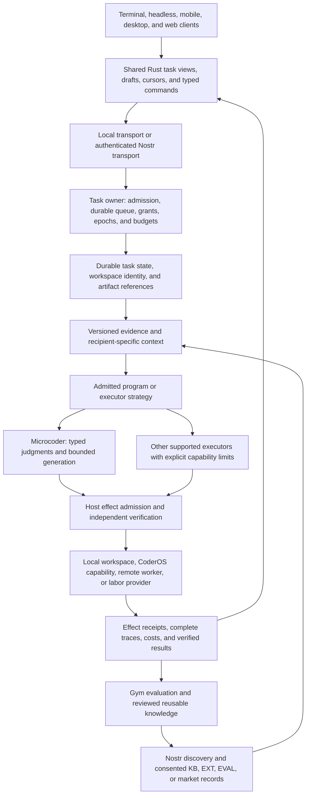

# Coder suite migration: gaps and delivery roadmap

Status: proposed implementation roadmap, September 26, 2026. This is a source
review and design document; it does not import the private product, launch
experiments, or establish that its deployments still work.

**Bring Coder's product breadth into OpenAgents around one durable Rust task
host.** Preserve the useful OS, mobile, desktop, work management, and extension
designs. Reimplement their behavior against the public Nostr contracts and
existing OpenAgents execution primitives. Develop Microcoder as a replaceable
execution strategy inside that host, with independent verification and shared
knowledge. Build mobile and CoderOS as first-class consumers of the same task,
authority, artifacts, and evidence.

The first complete slice should let someone start a repository task on a
computer, inspect its full trace on a phone, submit a correction, reconnect,
and receive one independently checked result. Losing the phone connection
must not lose or duplicate the task. This gives the OS and mobile work a
concrete foundation while the coding-quality work continues separately.

## Reading guide

- [Evidence and review scope](#evidence-and-review-scope)
- [What to carry forward](#what-to-carry-forward)
- [The public implementation gap](#the-public-implementation-gap)
- [Target architecture](#target-architecture)
- [Microcoder and TypeSafe integration](#microcoder-and-typesafe-integration)
- [Mobile, desktop, and web](#mobile-desktop-and-web)
- [CoderOS and execution environments](#coderos-and-execution-environments)
- [Knowledge, extensions, and agent labor](#knowledge-extensions-and-agent-labor)
- [Protocol work](#protocol-work)
- [Delivery roadmap](#delivery-roadmap)
- [Acceptance and measurement](#acceptance-and-measurement)
- [Migration and release procedure](#migration-and-release-procedure)
- [Source review ledger](#source-review-ledger)

## Evidence and review scope

| Source | Reviewed snapshot | What it establishes |
| --- | --- | --- |
| Private Coder checkout, `~/work/coder` | `f2d85b120ac96b4a4be9116e823e7795472088c1`, September 23, 2026 | Implemented designs, source-level tests, product experiments, and historical plans worth considering. |
| Public OpenAgents | [`d451bad5514e6a7aa6583696aee83fbb3cc611cf`](https://github.com/OpenAgentsInc/openagents/commit/d451bad5514e6a7aa6583696aee83fbb3cc611cf) | The implementation baseline before this documentation change. |
| Public protocol audit | [September 26 coverage](../../protocol/2026-09-26-nip-implementation-coverage.md) | Implemented subsets, explicit refusals, and missing runtime obligations across the three NIP lanes. |
| Product and algorithm direction | [TypeSafe suite](typesafe-product-suite.md), [networked Coder](networked-coder-plan.md), [Microcoder](../guides/microcoder.md), [optimization architecture](../../optimization/architecture.md) | The target behavior and evidence required before adoption. |

The review covers the private workspace's binary and crate inventory, the OS
tree, platform clients, runtime and persistence boundaries, tools, plugins,
fleet and execution infrastructure, and supporting design and test files.
Representative implementation paths were inspected beneath each major
surface. The [source ledger](#source-review-ledger) records those paths and
the limits of the findings. This is not a line-by-line audit of every file.

Private source paths below are reference metadata, relative to that checkout.
They are deliberately not links to public files. This document contains
original analysis, not private source, prompts, service addresses, deployment
configuration, credentials, or customer records. Implementation must follow
the repository's [reference-material rule](../../../AGENTS.md): reimplement
the design here, and record that provenance in commits. A separately licensed
public dependency requires its own license and compatibility review.

No private builds, device tests, OS installs, paid calls, or live services were
run for this assessment. “Implemented in the private source” means code was
found, not that a current release passed acceptance. Test source demonstrates
intended coverage; it is not an executed test receipt. Older audit and product
documents sometimes understate newer code and sometimes describe unfinished
work. Source and explicit release evidence take precedence.

This review extends the [teardown integration plan](teardown-nostr-integration.md).
That plan synthesized historical research; this one examines the separate
private product and selects actual behavior to rebuild. Neither a private
feature nor a newly written NIP automatically becomes a public feature.

## What to carry forward

The private product's strongest contribution is the machinery around an
agent: persistent ownership, usable clients, workspace control, tools that
understand their host, and operational recovery. The public product's stronger
direction is explicit authority, small measured AI operations, retained
evidence, and interoperable contributions. Combine those strengths without
preserving the private backend as a required intermediary.

“Reimplement” below means preserve useful behavior in fresh public code.
“Extend” means build on an existing OpenAgents implementation. “Defer” means
retain the idea but keep it outside the initial release's dependencies.

| Area | Private source finding | Public migration decision |
| --- | --- | --- |
| Durable sessions and task control | Runner journals, supervisor state, checkpoints, queued work, and child-result accounting exist. | **Reimplement and extend first.** Generalize public recovery primitives into a host-owned task service. |
| iOS and Android | Native clients use shared Rust application/UI code with platform bridges, secure credential storage, lifecycle handling, caches, and remote task views. | **Reimplement as priority clients.** Deliver observation first, then scoped control and recovery. Resolve the platform-language boundary before choosing native bridge code. |
| CoderOS | A substantial NixOS module/package/script tree, compositor, desktop, device tools, and update machinery exist. | **Reimplement in stages.** Start with a portable host bundle and reproducible Linux profile; make the custom compositor an optional later surface. |
| Terminal experience | Rich composition, task navigation, transcripts, tools, keyboard behavior, and shared presentation models exist. | **Extend the public terminal.** Keep its design system, Markdown rendering, and shared terminal/headless execution path. |
| Desktop | A GPUI application and desktop/control abstractions exist, with different implemented coverage across hosts. | **Reimplement a thin native client.** Reuse the task client and view model; add host capabilities independently. |
| Web | A server-rendered console and a separate GPUI/Wasm showcase exist; their transport behavior differs. | **Build one supported web client first.** Use Rust server rendering as the first read-only delivery path; verify live interaction and accessibility before choosing a richer renderer. |
| Workspaces, worktrees, and remote environments | Filesystem leases, execution environments, fleet adapters, and cleanup/recovery mechanisms exist. | **Extend public boundaries and supervision.** Add durable materialization, reservations, and exact result integration. |
| Context, tools, and code navigation | Scoped filesystem access, repository context, syntax/graph tools, and selected-history machinery exist. | **Reimplement selected evidence tools.** Admit them through CAP/PRG/EXT and measure whole-task benefit. |
| Plugins and skills | A larger authoring/catalog/host system and scoped guidance machinery exist. | **Extend the public Wasm host and package system.** Preserve useful lifecycle and authoring behavior, not the private ABI or store service. |
| Knowledge and memory | Session memory and accepted/proposed information are distinct concerns in the private design. | **Extend public knowledge.** Keep private task memory, reusable domain references, and evidence for admission separate. |
| Work planning and automation | Tasks, delegation, schedules, and ongoing work have supporting runtime designs. | **Extend public project/scheduler code.** Add durable occurrences, claims, and observable outcomes under WORK/AUTO/COORD. |
| Browser and computer use | Host-specific browser, capture, input, camera, and recording paths exist. | **Reimplement admitted capabilities.** Separate observing, recording, transmitting, speaking, and acting. |
| Cloud service and accounts | A broad private service joins identity, sync, execution, and product surfaces. | **Decompose.** Reuse public gateway/tenancy where their existing contracts fit; build Nostr application services and optional hosting separately. |
| Earn and inference providers | Provider/fleet and payment-related machinery exists beside research inference paths. | **Carry forward provider operations, with agent labor first.** Add bounded coding fulfillment before broad hardware or inference markets. |
| Local and distributed inference | Multiple backends and split-inference experiments exist with uneven proof and hardware support. | **Defer as a critical dependency.** Add an optional CAP binding only after target-host quality, capacity, disclosure, and cost measurements. |
| Calendar and notes | Calendar has domain code, routes, and tests. The inspected Notes specification names a new crate absent from the source inventory. | **Defer full standalone products.** Scheduling and artifact notes needed for coding can use the shared runtime; a notes product is not an existing app ready to port. |
| Games and exploratory interfaces | Several world/game/application experiments coexist with Coder. | **Keep separate.** Reuse measured infrastructure through existing Verse/Voyager work where appropriate; do not make them dependencies of the coding suite. |
| Old model loops, prompt catalogs, and deployment defaults | The private product accumulated provider-specific behavior and operational assumptions. | **Do not transplant.** Retain behavioral lessons and adapter requirements; design public implementations around current contracts and measurements. |

This is a large migration, but it is not one large import. The same durable
task, view, authority, and artifact work should unlock terminal, mobile, OS,
cloud workers, and labor rather than being rewritten once per product.

## The public implementation gap

### Foundations to keep

OpenAgents already has meaningful building blocks:

- [Coder's shared turn](../../../crates/coder/src/turn.rs), permit, delegate
  adapters, local program runtime, and [execution boundary](../verification/2026-09-20-execution-boundary.md).
- [Subprocess supervision](../runtime/subprocesses.md), capability trust,
  worktrees, project supervision, and local scheduling.
- [Program-run recovery records](../../../crates/coder/src/runstate.rs),
  reconciliation, pinned package bytes, and retained [ATIF traces](../runtime/traces.md).
- [Microcoder](../../../crates/microcoder/), the Jev and generation clients,
  [knowledge retrieval and publication](../guides/knowledge-base.md), and Gym.
- [Bounded Wasm guests](../../extensions/plugins.md), local programs and
  question sets, and separate specifications for richer package adoption.
- The Nostr library/relay, private artifact checks, and decision-service
  gateway, tenancy, billing, and receipts.

Extend these components. A new app must not invent another subprocess
supervisor, permission system, cost ledger, Markdown interpretation, or
definition of successful work.

### Gaps that block a coherent suite

| Gap | Concrete current limitation | Consequence |
| --- | --- | --- |
| Interactive task ownership | Program-run recovery exists, but not the complete SESS/CTRL owner, queue, grant, and cross-client lifecycle. | A trace viewer or relay conversation cannot promise resumable tasks or safe transfer. |
| Microcoder execution integration | [`env.rs`](../../../crates/microcoder/src/env.rs) runs local commands with `tokio::process::Command`; it does not route them through `coder-boundary` and `supervise`. | Do not expose this adapter as the suite's general-purpose local or remote execution authority. |
| Read and cancellation guarantees | The local adapter joins requested file paths without the shared scope boundary. Docker uses an in-container timeout when available; some reads collect output before truncating it. | Add enforced reads, bounded I/O, process-tree cancellation, and explicit unsupported outcomes before unattended product use. |
| General task admission | The Microcoder library has a generic environment interface, but its CLI is a Terminal-Bench task runner. | Add a repository/task adapter and explicit host admission; a new CLI flag alone is insufficient. |
| Durable state and complete trace integration | Microcoder emits its own events/summary; its bounded prompt state and in-memory loop variables are not a crash-recovery protocol. | Retain exact effects and reconstructible state, then integrate the existing evidence with ATIF/Gym without discarding original records. |
| Completion semantics | Generated acceptance tests can be added later or dropped after a Jev dispute; green tests are not necessarily faithful to the real requirement. | Preserve test versions/dispositions, and distinguish a proposed finish from independent verification and integration. |
| Task views and sync | No implemented suite-wide WS view protocol and SESS application service follows merely from the existing relay. | Build ordered views, explicit gaps, bounded replay, conditional mutations, and reconciliation. |
| Trusted device control | CTRL has a specification, not an end-to-end device grant/command service. | Phones need signed admission, revocation at the owner, replay control, and separately scoped observation. |
| Native clients and OS | The private product's native mobile/desktop/OS code is absent from this public suite. | Budget for real client, host, packaging, and device testing work. |
| Notifications | The current Block push delivery configuration is deliberately refused pending a complete durable implementation. | Do not advertise background mobile notifications until lease authority, outbox, delivery, and current-access checks work. |
| Full extension lifecycle | Public evidence guests work, but general manifest-driven distribution, activation, and compatibility are incomplete. | A private plugin catalog cannot simply point at the public host. |
| Knowledge evidence integrity | Current reports group exposure by task/model and entry ID; missing cost fields and unreadable summaries are not fully represented. | Treat reports as observational screening until exact study identities, complete intake, and uncertainty are implemented. |
| Paid labor | MKT/LAB validate a subset of negotiation and terms; durable fulfillment and settlement remain absent. | A signed offering or successful run is not an accepted, paid order. |

The Microcoder guide's old dependency summary is narrower than the current
[`Cargo.toml`](../../../crates/microcoder/Cargo.toml), which also depends on
Coder and Nostr. That dependency does not make its command adapter inherit
Coder's execution guarantees. Use source-level call paths when judging
integration, not crate names or package dependencies.

## Target architecture

The proposed logical boundaries below are responsibilities, not commitments
to create a new crate for every box. Start by extending existing crates;
extract a shared crate when a second consumer establishes the boundary.

The host owns execution. The relay transports and stores authorized records;
it is not a scheduler, process supervisor, or proof that work happened. A
locally running client should use the same typed task contract without
requiring a public relay or hosted account. Nostr support adds transport,
identity, discovery, and interoperability without changing who can cause an
effect.

Keep three promises distinct:

1. **Client continuity:** execution survives a UI disconnect.
2. **Presentation recovery:** another client reconstructs the task and its
   evidence, including gaps and unknowns.
3. **Execution recovery:** after a host failure, the owner reconciles actual
   effects before resuming or transferring work.

Deliver and test them separately. Replaying a transcript proves neither
that a shell process is still running nor that it is safe to run it again.

The task owner needs a durable command inbox, task identity, ownership epoch,
admission receipt, and effect-intent journal. Persist acceptance before
acknowledging an accepted command; persist required intent before effects.
After a crash between intent and outcome, investigate the effect or retain
an unknown result. Do not promise exactly-once arbitrary shell execution.
Use stable command identities, idempotent supported effects, and fencing to
prevent duplicate owners. A valid Nostr signature does not supply an atomic
lock at the resource owner.

Task completion, check results, user acceptance, Git integration, and payment
are separate records. A stopped process can leave a useful candidate; a
passing check can leave an untested requirement; an accepted labor result
can still await payment. Every client must preserve those distinctions.

## Microcoder and TypeSafe integration

### Keep the small loop; replace its surrounding assumptions

Microcoder is a good development vehicle because each step exposes knowledge,
judgments, generated commands, observed outputs, and spend. It is not yet the
durable multi-device product runtime. Keep its small generation strategy while
moving execution, task state, authority, and evidence onto shared host services.

The first integration should:

1. Accept an exact task frame, source revision, environment binding, grants,
   budgets, and component lock from the task host.
2. Read only admitted source captures and knowledge. Record versions,
   retrieval candidates, selections, omissions, expansions, and recipients.
3. Return bounded action proposals to the host. The host validates and
   executes them through the common boundary and supervisor.
4. Receive actual effect results and updated evidence. Do not let a renderer
   or model infer successful execution from a submitted command.
5. Emit retained typed events and recoverable state at supported boundaries.
   Preserve unknown costs and partial outputs rather than manufacturing
   completeness.
6. Propose a finish with requirement-to-evidence links. Run independent
   checks against the exact candidate; leave integration to its own policy.

Keep the existing Coder path available while this adapter is measured.
Replacing the terminal's default executor needs separate evidence. Other
agents can remain bounded adapters: capability negotiation must say which
support steering, cancellation, checkpoints, artifact capture, usage, and
resume. A foreign session import must state lost structure or missing usage;
it must not invent native recovery guarantees.

Retain requested and effective model, effort, tool, and environment settings.
Mark each adapter feature as native, emulated, or unsupported. Queueing a
future turn, steering an active one, and interrupting execution are different
operations. Asking for information is not requesting effect approval. Test
these distinctions at admission and show material fallback changes to the
user rather than silently presenting a different configuration as the one
requested.

### Give typed decisions useful, limited jobs

The [founding TypeSafe proposal](thoughts-on-a-typesafe-coding-agent.md) is
broader than choosing the next model. Carry forward context selection,
progressive tools, explicit state, scoped instructions, reusable intermediate
values, concurrency, and background understanding.

| Decision opportunity | Deterministic foundation | Candidate semantic operation | Required measurement |
| --- | --- | --- | --- |
| Evidence selection | Enumerate allowed, revision-bound candidates; retain mandatory instructions. | Rank relevance and choose which originals to expand. | Useful evidence recall, missed requirements, expansion cost, whole-task outcome. |
| Tool discovery | Filter by installed support, grants, input types, and effect bounds. | Select among eligible descriptors, including none. | Needed-tool recall, false activation, invalid arguments, loading overhead. |
| Task state | Persist user corrections, active revision, observed effects, and unresolved work. | Propose structured summaries or topic changes. | Lost/invented obligations and correction cost across long sessions. |
| Progress and escalation | Observe failed commands, repeated states, tests, spend, and remaining bounds. | Judge likely stalls or select an eligible escalation. | False stops on eventual successes, rescues, total latency and cost. |
| Code knowledge | Retrieve provenance-bearing entries and exact source spans. | Judge applicability or possible contradiction. | Transfer to unseen tasks, false rejections, poisoning resistance, full retrieval cost. |
| Background views | Share permitted evidence with a separate low-priority allowance. | Rank findings or produce cited explanations. | Useful findings, stale claims, attention burden, foreground slowdown. |
| Placement | Filter hosts by actual capabilities, grants, capacity, and disclosure. | Rank eligible placements when the tradeoff needs semantic context. | Accepted throughput, queueing, transfer cost, collisions, failed placements. |

Stable semantic contracts allow implementations to change independently:
deterministic retrieval, Jev questions, generation, or bounded compositions
can compete against the same acceptance criteria. Keep host authority and
protected evaluation outside that search. Pin an implementation at task
admission; a package update does not relabel a running task.

Batch independent questions over the same permitted state. Fetch new evidence
before asking questions that depend on it. Keep raw answers and the consuming
policy separate so a display preference does not require rerunning inference.
TypeSafe's [composite scoring](https://docs.typesafe.ai/patterns/composite-scoring)
supports code-controlled combinations of independent dimensions. Its
[confidence contract](https://docs.typesafe.ai/confidence) describes Choice
and Score concentration; Noul supplies a yes probability without that separate
confidence field. Neither is an execution grant or proof of correctness.
Evaluate thresholds on the intended workload rather than carrying forward
an old constant as a universal rule. These live references were checked on
September 26, 2026.

### Preserve what the experiments actually established

The [current results ledger](../../terminal-bench/tb4-results.md) contains
promising knowledge-assisted development wins. Those tasks informed the
knowledge and are in-sample. The ledger reports no out-of-sample Microcoder
passes. A fastest successful run does not establish a better median, pass
rate, or complete development cost.

The earlier [matched controller study](../../terminal-bench/2026-09-23-matched-controller-targeted.md)
cost 68% more and took about 2.2 times as long without a statistically
established pass-rate gain. This is a direct reason to measure each added
layer. Mobile continuity and OS reliability are valuable even before a new
algorithm beats a comparator; their success cannot establish coding-quality
superiority by itself.

Generated acceptance tests remain useful evidence with limited authority.
Retain baseline results, original tests, later additions, disputes, and
removals as separate events. Jev can identify a suspect test; it cannot
silently amend a user-approved acceptance contract or the protected grader.
The [later assessment](2026-09-25-assessment.md) and
[networked plan](networked-coder-plan.md) qualify the thesis's original
red-first/green-means-done assumptions. This migration must use those
corrections rather than restoring the disproven shortcut.

## Mobile, desktop, and web

### One task client, several presentations

Reimplement a shared Rust client model for task lists, transcripts, artifacts,
questions, approvals, drafts, and typed commands. Share ordering, reduction,
pagination, reconnect logic, and status definitions. Keep layout, text input,
accessibility, platform storage, and rendering in surface adapters.

The private shared cell/grid and component approach is a useful reference,
not a mandate to force every interface into terminal geometry. Preserve the
public amber design system where applicable. Phone selection handles,
screen readers, browser navigation, and desktop input need platform-specific
acceptance, even when the underlying task data is identical.

A transcript must remain inspectable when paused or disconnected. Show the
first available content on initial load, distinguish historical playback
from live execution, and display explicit states for loading, missing
artifacts, denied access, empty content, and structural gaps. Preserve full
retained text behind shortened rows, along with Markdown, code, diffs,
tools, checks, and original timestamps. An unknown event type gets an inert
fallback row; it must not disappear. Jev relevance is an optional view over
the same records and cannot hide the chronological source.

### Phone delivery

The private phone apps are remote interfaces, not on-phone agent engines.
Carry forward their cached view, secure storage, lifecycle, input, and fleet
navigation designs. Keep provider credentials and execution on the admitted
host. A phone may hold its own scoped device identity; that identity must
not become the user's unrestricted worker credential.

Deliver in this order:

1. Pair a device and grant read-only access to named tasks. Fetch a bounded
   view, page the complete transcript, inspect artifacts, and show freshness.
2. Add task submission through task admission, and correction/cancellation
   through the relevant CTRL rights. Approval requires separately recognized
   POL approver authority for the exact action and inputs; CTRL pairing does
   not mint that authority. Bind each command to its task, revision/epoch,
   grant, recipient, and stable command identity.
3. Persist exact command bytes and identity in a bounded client outbox before
   clearing the composer. Distinguish locally queued, owner-accepted,
   applied, refused, and unconfirmed commands. After a lost acknowledgment,
   reconcile disposition before retrying the exact bytes under current
   authority. A pending approval whose inputs changed becomes stale; it
   must not execute later merely because the phone reconnects.
4. Test foreground/background transitions, process death, offline use,
   multiple devices, key revocation, and changes in task ownership.
5. Add notifications only after the durable push service is implemented.
   A notification signals that an authorized client should refresh state;
   it does not carry execution authority or expose private transcript text
   by default.

Isolate caches and outboxes by account and device identity. Logout, account
switch, or key loss must not submit another account's pending commands.
Define local cache removal separately from accepted owner work, which does
not silently cancel or disappear on logout. Revocation stops future
owner-mediated access and control; it cannot guarantee deletion of plaintext
already disclosed to an authorized device.

The current [language contract](../../../AGENTS.md) permits Rust product code
and the specific FoundationModels Swift bridge. It does not authorize the
private UIKit/Swift and Android/Kotlin bridges. Begin mobile feasibility
work with Rust platform bindings and the smallest possible platform shell.
Evaluate text input, secure storage, lifecycle, rendering, and accessibility
on real devices before committing to a toolkit. If a non-Rust platform bridge
is necessary, propose a narrow, reviewed contract exception before adding it.
This roadmap neither silently grants that exception nor treats the existing
private wrappers as portable code.

### Desktop and web delivery

Start desktop as a client of an independently owned host process. Closing a
window must not kill an admitted background task. Surface local approvals,
diffs, current source, cost, and remote task state before adding integrated
browser/capture panels. Do not merge the desktop renderer, Linux compositor,
and agent owner into one failure domain.

For web, the private tree contains a server-rendered console and a distinct
Wasm showcase. The latter has transport and parity limits; it is not evidence
of a complete browser client ready for migration. Start the public web
surface with Rust-rendered task, transcript, artifact, and status views over
the same view contract. Keep it read-only until authentication and mutation
semantics pass acceptance. Compare a Rust/Wasm interactive shell with the
server-rendered approach using actual keyboard, accessibility, large-trace,
reconnect, and packaging results. No TypeScript product layer is proposed.

Optional hosted web access needs its own authenticated session and signing
boundary. Do not make users paste a long-lived Nostr private key or provider
API key into a browser page. Public decision-service sessions are useful
infrastructure, but a workspace account is not automatically a Nostr device
grant. Implement and test that binding explicitly.

## CoderOS and execution environments

### Deliver the host before the custom desktop

CoderOS should make a computer dependable for agent work: reproducible tools,
isolated workspaces, predictable resources, visible device access, complete
evidence, and recoverable updates. Its first public deliverable need not
replace the user's desktop shell.

Build a portable host bundle for supported Linux and macOS environments,
then a reproducible Linux CoderOS profile. The bundle installs the task owner,
worker, capability probes, resource manager, and evidence store. It reports
which capabilities are usable and why an unsupported one is refused. The
Linux profile can add declarative OS configuration and service units as
infrastructure, while executable product behavior stays in Rust.

Retain the private NixOS design's separation between packages, modules,
grants, launchers, hardware configuration, and update mechanisms. Recreate
generic profiles from reviewed public dependencies. Exclude private host
inventories, user accounts, networking defaults, device assignments, and
deployment secrets. Test a clean machine rather than assuming a developer's
configured workstation represents an installation.

The custom compositor is substantial product work. First make terminal and
native desktop work with an existing host desktop. Revisit the compositor
after the same tasks and device grants work there. Its later release gate
includes input routing, recovery, display changes, accessible controls,
application focus, and an escape path when the shell fails. A beautiful
compositor is not evidence of reliable task execution.

The source already contains a Smithay compositor with hardware/nested
backends, multiple outputs, scaling, Xwayland, screenshots, and input paths.
The reviewed OS configuration still defaults to Hyprland and exposes the
custom compositor through a trial path. Carry this distinction into the
roadmap: the custom shell is real code, but it is neither the only desktop
path nor proven portable by its presence. The private deterministic desk
interface is the more immediate design to reimplement above an existing
desktop, with authenticated local admission added explicitly.

### Capabilities and physical effects

Expose shell, filesystem, browser, screenshots, window inspection, input,
camera, microphone, recording, and connected Android devices as separate
capabilities. Each needs a support probe, concrete grant, bounded invocation,
effect receipt, and revocation path. Preserve platform differences instead
of advertising the union of all machines' capabilities on every host.

For browser and computer input, bind an action to a fresh observation and
target. Refuse stale coordinates or changed windows when the binding no
longer holds. Reading a screen does not authorize typing into it. Recording
consent does not authorize uploading the recording to a model. A user-visible
recording indicator needs to track the actual capture lifecycle, including
process failure and permission revocation.

Stop and revocation gate new input. Release held keys/buttons where supported,
and preserve uncertainty about already-dispatched actions or failed teardown.
Do not label an acknowledgment as proof that input or capture stopped.

Continuous media belongs to admitted media transports. Use Nostr for discovery,
consent, participants, session state, and artifact references, not as the
video frame bus. Voice transcription and generated speech are replaceable
operations with their own source/recipient policy and cost. Persist only
the material the task's retention policy allows.

The private dictation path does not establish on-device transcription or a
duplex voice agent. Its camera/hand interpretation is a separate optional
input and accessibility track. Preserve that idea, but evaluate it in shadow
mode with latency/error measurements and a human override before admitting
gesture-driven effects. Neither feature blocks ordinary keyboard, pointer,
or mobile use.

### Environments, resource control, and updates

Use the public boundary/supervisor for local work. Add explicit ENV adapters
for container or VM materialization where stronger isolation is required.
The private guest-agent, lease, and fleet designs inform those adapters;
they do not establish public containment on a new platform. Check filesystem,
process, network, mount, and credential behavior independently.

Reserve build slots, disk space, CPU/memory where enforceable, and workspace
ownership before dispatch. Placement uses actual capacity and supported
bindings. Keep one Cargo target directory per worktree. Preserve artifacts
before cleanup, retain uncertain cleanup as unknown, and do not delete a
workspace because its controlling client went away.

Stage updates by immutable component set. Verify artifacts, compatibility,
available disk, and rollback capability; drain or pin running work; activate;
check health; retain the prior working version. A binary rollback cannot
undo an incompatible database migration or external side effect. Test both
application and state-schema compatibility. Lost power, interrupted downloads,
full disks, and failed health checks need retained recovery evidence.

The private auto-updater is a useful development precedent: it follows a
branch, bounds build resources, checks the resulting version, swaps a binary
link atomically, and retains previous builds. It explicitly does not run the
test suite. It is not signed, tested whole-OS delivery. The public release
design must add promotion gates and separately verify boot generations,
service/state migrations, reboot recovery, and binary compatibility.

Local inference and remote inference can be later capability bindings. A
worker's model label or advertised GPU does not prove quality, availability,
or privacy. Record actual model/runtime versions, participants, queueing,
energy/hosting cost where known, and complete task performance. Distributed
inference research must not block the first OS or phone release.

## Knowledge, extensions, and agent labor

### Turn useful source behavior into components

Prioritize the private designs that can remove repeated expensive work:
scoped repository reads, syntax outlines, stale-aware code graphs, test
report extraction, source-linked context, and safe workspace cleanup. The
private graph command exists as an independently measurable tool; the source
documentation says the agent does not consume it. Measure a public integration
before claiming it improves coding.

Extend the public [evidence guests](../../extensions/plugins.md#evidence-guests)
and [programs](../../extensions/programs.md). Known preparation belongs in
host-driven steps; open-ended generation can propose actions from a small
eligible tool set. Pin guest bytes, ABI, source/build provenance, schemas,
read handles, and bounds. The private plugin ABI and public no-WASI host are
different systems. Importing a manifest cannot establish compatibility.

Add authoring, packaging, linting, local testing, inert installation,
activation, and rollback before a broad plugin store. Skills need canonical
scope, instruction precedence, bounded hooks, expiry, and cleanup. Mandatory
instructions cannot be discarded by relevance ranking. MCP and external
agent integrations remain admitted adapters with explicit capability limits.

### Keep memory and shared knowledge distinct

Task memory stores private intent, corrections, observations, and unresolved
obligations. Shared knowledge stores reusable claims with provenance and
rights. Neither should be a dump of all historical chats. The existing
knowledge crate is the starting point for retrieval, publication, trust,
withdrawal, and admission; the private accepted/proposed-memory designs are
references for task memory and review flows.

When a source is corrected, withdrawn, or deleted, invalidate dependent
memory and caches and retain appropriately scoped tombstone/provenance
records. Do not silently convert unreadable memory into an empty store.
Report incomplete state so a task cannot mistake lost obligations for an
absence of obligations.

A contribution cycle is complete only when another operator can discover an
exact entry or component, inspect its evidence and license, choose whether
to admit it, reproduce benefit on new work, and withdraw it without rewriting
past traces. Same-task harvesting is development evidence. Signatures prove
who published bytes, not that those bytes improve a new task.

Keep candidate, reviewed-reference, measured, adopted, and withdrawn states
visible. Record poisoned or unhelpful candidates and rollback. Publish
redacted, permissioned evidence with useful source anchors; do not strip
provenance so aggressively that an independent consumer cannot assess it.

### Repair evidence intake before strong promotion claims

The current [`knowledge::evidence`](../../../crates/knowledge/src/evidence.rs)
is useful screening infrastructure, but it is not a controlled study. It
groups runs by task and model, identifies exposure by entry ID, and can use
historical or non-retrieval runs as the baseline. It excludes the source
tasks named by an entry and counts unknown rewards, which are useful
foundations. It does not establish comparable effort, harness, environment,
budget, exact entry version, or prospectively assigned arms.

`read_run` sums the cost components that are present, so an absent model,
Jev, or embedding cost contributes zero. `scan` drops unreadable/malformed
summaries from its returned runs. These are concrete gaps to fix before
using those reports for strong efficiency claims or automatic promotion.
Retain intake failures and distinguish incomplete runs from corrupt ones;
carry unknown component costs; preserve all attempted runs in the study
denominator. Pin exact entry digests and full run configuration. Use frozen
prospective comparisons and uncertainty for causal claims, keeping historical
screening available under an accurate label. This finding does not invalidate
every retained benchmark result or the knowledge-sharing implementation.

### Keep agent labor high priority

Build the [labor track](../../agents/market-infrastructure.md) alongside task
ownership and remote execution. The initial product is one buyer and one
provider completing a bounded coding order: exact source, deliverable,
allowed tools, resource/disclosure limits, checker, price terms, deadline,
rework bound, and reuse rights. The provider returns attributable artifacts
and evidence; the buyer checks and accepts or records a dispute.

Use a free order first to test durable agreement, dispatch, delivery, and
acceptance without conflating those failures with wallet integration. Add
paid operation only when budget reservation, payment authorization,
settlement, duplicate prevention, and uncertain-payment recovery work.
Provider economics include idle capacity, failed work, checks, retries,
support, and disputes, not only model tokens. A board full of offers is not
evidence of useful demand.

The current NIP is [LAB](../../../nips/openagents/NIP-LAB.md), paired with
[MKT](../../../nips/openagents/NIP-MKT.md). Fixed-price labor acceptance and
[X402](../../../nips/openagents/NIP-X402.md) upfront operation purchase have
different lifecycles. Preserve that distinction. Nostr wallet transport,
zaps, and invoice validation are supporting pieces, not a completed labor
settlement service. This roadmap adds no swap product requirement.

## Protocol work

The immediate shortage is runtime implementation and cross-client conformance,
not another set of NIP names. Use the existing drafts, add concrete profiles
and fixtures when a real adapter needs them, and version incompatible changes.
Read the [coverage report](../../protocol/2026-09-26-nip-implementation-coverage.md)
before claiming that any row below already works end to end.

| Product contract | Existing specification | Required implementation |
| --- | --- | --- |
| Identity and device control | Official 01/42/44, [CTRL](../../../nips/openagents/NIP-CTRL.md), [POL](../../../nips/openagents/NIP-POL.md) | Possession-backed pairing, scoped rights, owner-enforced epochs/revocation, fresh commands, recipient-specific views. |
| Durable session and effects | [SESS](../../../nips/openagents/NIP-SESS.md), [RUN](../../../nips/openagents/NIP-RUN.md), [CJ](../../../nips/openagents/NIP-CJ.md) | Inbox/queue persistence, honest adapter support, effect intent/result records, recovery, cancellation, and foreign-history loss reporting. |
| Files, artifacts, and synchronized views | [WS](../../../nips/openagents/NIP-WS.md), shared private artifacts, Block RS/CW | Conditional mutations, exact source identity, coherent view cuts/deltas, gaps, access refresh, and bounded reconstruction. RS snapshots do not implement WS or the subscription barrier. |
| Tasks, claims, and automation | [WORK](../../../nips/openagents/NIP-WORK.md), [COORD](../../../nips/openagents/NIP-COORD.md), [AUTO](../../../nips/openagents/NIP-AUTO.md) | Authoritative claims, dependencies, occurrence identity, lease recovery, aggregate budgets, deduplication, and cancellation. |
| Execution location and devices | [ENV](../../../nips/openagents/NIP-ENV.md), [CAP](../../../nips/openagents/NIP-CAP.md), [LIVE](../../../nips/openagents/NIP-LIVE.md) | Admitted materialization, real attachment, reservations, verified support, fresh observations, consented capture, teardown, and cleanup evidence. |
| Context, memory, and learning | [CTX](../../../nips/openagents/NIP-CTX.md), [KB](../../../nips/openagents/NIP-KB.md), [EVAL](../../../nips/openagents/NIP-EVAL.md) | Revision-bound evidence, context manifests, task memory, partition/leakage policy, contribution rights, and independent evaluation. |
| Programs and replacement implementations | [PRG](../../../nips/openagents/NIP-PRG.md), [EXT](../../../nips/openagents/NIP-EXT.md), [OPT](../../../nips/openagents/NIP-OPT.md) | Complete resolution/locking, supported host bindings, manifest admission, activation/rollback, and measured promotion. |
| Phone notifications | Block PL and the relevant channel/session admission | Durable leases and outbox, current-recipient checks, bounded delivery/retry, revocation, privacy, and actual device receipts. Delivery remains disabled until complete. |
| Labor and optional paid operations | MKT/LAB, X402, relevant official Lightning NIPs | Durable agreement and execution linkage, buyer checks, acceptance/disputes, wallet authority, actual settlement, and recovery. |

Keep high-volume local data local where appropriate. Nostr events can name
exact artifacts and carry commands or attributable state without uploading
every file, keystroke, or trace. Relay storage, artifact availability, data
retention, and local execution survival are different guarantees.

## Delivery roadmap

These work packages are proposed issue boundaries, not filed issues or
estimated completion dates. Before implementation, reconcile them with the
then-current issue list and claim one owner per shared area. Record actual
dependencies and acceptance before coding. Do not reopen completed work
because an older plan described it as missing.

### Phase 0: contracts and feasibility

| Work package | Deliverable | Completion evidence |
| --- | --- | --- |
| M0 — Public migration fixtures | A public-safe feature/contract inventory, fresh synthetic task fixtures, source provenance, and a selected first cross-device scenario. | Every imported design has a disposition and acceptance owner; no private implementation or operational configuration enters git. |
| M1 — Mobile and rendering feasibility | Small Rust-first iOS/Android shells and a shared task-view fixture; compare desktop/web rendering options. | Real-device input, secure storage, lifecycle, accessibility, and long-trace findings; explicit decision on any required language exception. No full app claim. |
| M2 — Runtime contract | Exact task identity, command/disposition model, ownership epoch, grants, budgets, artifact references, requested/effective configuration, and native/emulated/unsupported adapter features. | Fixtures separate completion/verification/integration, queue/steer/interrupt, and elicitation/POL approval; silent configuration fallback refuses or requires explicit policy. |

M1 runs in parallel with M2. Mobile is not postponed until the entire backend
is finished; its feasibility work informs the shared view/input contract.

### Phase 1: one durable local task

| Work package | Depends on | Deliverable and release gate |
| --- | --- | --- |
| M3 — Durable owner | M2 | Local service/owner, acknowledged journal, queue, cancellation, effect reconciliation, and pinned task configuration. Fault injection covers every acknowledged-command/effect boundary; unknown effects remain unknown. |
| M4 — Microcoder host adapter | M2, M3 | General repository adapter using the common read/write boundary, supervisor, cancellation, accounting, and trace sink. Local and container fixtures demonstrate bounded reads/processes and truthful incomplete outcomes. |
| M5 — Evidence and views | M3 | Stable event reduction, retained originals, artifact capture, paging, gaps, and ATIF/Gym integration. A fresh client reconstructs the same task, checks, cost, and trace without the old process's memory. |
| M6 — Acceptance and context | M4, M5 | Versioned requirement/check map, independent verification, scoped instructions, context manifests, knowledge provenance, and explicit test disputes. A false-green fixture cannot become verified success. |
| M6a — Knowledge evidence integrity | Current knowledge/Gym code; can start immediately | Retained intake failures, unknown costs, exact entry/configuration identity, explicit observational versus prospective study records, and uncertainty. Missing costs or summaries cannot improve a promotion result. |

The phase ends with terminal/headless using one durable host contract. Retain
the current execution path until the new adapter meets its quality and
reliability gates. Do not couple this milestone to algorithm superiority or
automatic optimization.

### Phase 2: Nostr continuity and phone control

| Work package | Depends on | Deliverable and release gate |
| --- | --- | --- |
| M7 — Nostr task transport | M2, M3, M5 | SESS/CTRL/RUN application support, authenticated commands, private artifacts, exact cursors, replay/refusal behavior, and owner-side access checks. Two independent clients cannot create two owners. |
| M8 — Mobile observation | M1, M5, M7 | iOS/Android task lists, complete transcripts, artifacts, checks, cost, drafts, and readable unavailable states. Device tests cover paging, offline cache, process death, and revoked access. |
| M9 — Mobile control | M8 | Admitted submission, CTRL steering/cancellation, separate POL approval authority, durable exact-byte outbox, stale-approval refusal, and reconciliation. The selected computer-to-phone task completes once after disconnect/reconnect. |
| M10 — Notifications | M7, M8 | Complete PL service plus platform delivery bindings, private refresh semantics, lease expiry, durable retry, and revocation. Test with real devices and retained delivery records before advertising it. |

M10 is not required to use a foreground phone client. Publish that limitation
instead of simulating background delivery. Phone approval and task completion
must continue to work without notifications.

### Phase 3: CoderOS, desktop, and useful remote work

| Work package | Depends on | Deliverable and release gate |
| --- | --- | --- |
| M11 — Portable Coder host | M3, M5, and acceptance of the selected existing executor | Install/doctor/service/upgrade bundle, resource admission, portable grants, and clean uninstall. Fresh Linux/macOS checks distinguish supported capabilities and preserve rollback. Microcoder activation separately requires M4/M6. |
| M12 — CoderOS profile | M11 | Reproducible generic Linux configuration, pinned packages, task services, visible device grants, and staged update/recovery. Clean install, disk pressure, interrupted update, and rollback fixtures pass. |
| M13 — Desktop and web clients | M1, M5, M7 | Native desktop and Rust-rendered web observation, followed by separately tested control. Closing/reloading the client preserves the task; all surfaces agree on its result. |
| M14 — Device adapters | M11, M12 for OS integration | Browser, capture, input, recording, and connected-device capabilities one at a time. Unsupported hosts refuse; stale observations, changed targets, revoked consent, and teardown failures have tests. |
| M15 — Remote environments | M3, M7, M11 | Owned worker/container/VM adapters, resource leases, retained artifacts, cleanup reconciliation, and exact integration. Concurrent writers stay isolated; crashes and reconnects do not duplicate effects. |

Build the first generic Linux profile before custom compositor parity. An
optional compositor follows only after M12/M14 establish the service and
device contracts. Hardware acceleration and inference experiments get
separate support profiles; they do not block the default host.

M11/M12 can proceed alongside Phase 2 using an already admitted executor.
Begin generic OS packaging/probe fixtures during Phase 0; shipping still
requires the host gates. CoderOS does not wait for a better Microcoder score,
finished phone applications, or the entire extension lifecycle.

### Parallel tracks: components and labor

| Work package | Earliest dependency | Deliverable and release gate |
| --- | --- | --- |
| M16 — Evidence components and packages | M5, M6 | Reimplemented syntax/context tools, compatible package authoring, scoped skills, inert installation, and rollback. Each enabled component shows measured benefit or remains optional. |
| M17 — Task automation | M3, M6 | WORK/AUTO integration over the existing scheduler/project primitives, bounded occurrences, aggregate budgets, cancellation, and restart. Missed/duplicate/overlapping triggers have explicit dispositions. |
| M18 — Agent-labor fulfillment | M2; execution uses M15 or an admitted existing worker | MKT/LAB durable free agreement, source/artifact closure, delivery, buyer checks, acceptance/rework/dispute, then paid settlement. One buyer/provider round trip is attributable and recoverable before a broad marketplace. |
| M19 — Measured network contributions | M6, M6a, M16 | A second operator consumes a permissioned KB/EXT contribution on unseen work, retains complete outcomes, and can withdraw it. Show benefit and all-in cost; keep unsuccessful contributions visible. |
| M20 — Managed hosting | M7, M11, M15 | Optional hosted owner/workers and account binding, capacity/SLO/cost evidence, export, backup/restore, and per-tenant isolation. The product remains usable without the managed service. |

Labor protocol and buyer/provider design can start with M2; it need not wait
for native clients, a compositor, or benchmark leadership. Paid fulfillment
still waits for its actual authority and settlement gates. M16/M19 can
improve coding quality while OS and client work proceeds independently.

### Critical path and staffing boundaries

The first phone-controlled task depends on **M2 → M3 → M5 → M7 → M8 → M9**,
with M1 supplying platform feasibility and M4/M6 supplying the Microcoder
execution/verification path. The first CoderOS release depends on M11/M12,
not the full private inference or gaming stack.

Use separate owners for task runtime, client/view models, host/OS adapters,
and measurement/components when working in parallel. Share the M2 contracts
and synthetic fixtures before parallel implementation. Two developers cannot
independently redefine task state or the event schema and rely on a late
merge to reconcile them. A single-contributor effort should finish one
vertical slice before expanding platform breadth.

Do not set a calendar promise from source volume. Estimate after M1/M2 with
real toolchain, signing, platform, and protocol constraints. Device/accessibility
work, crash recovery, and reproducible OS releases are substantial independent
deliverables even though private examples exist.

## Acceptance and measurement

### Required product scenarios

| Scenario | Evidence needed for a pass |
| --- | --- |
| First installation | A clean supported machine reaches a useful task; missing providers/capabilities have specific remedies; no developer-home assumptions. |
| Local task | Terminal and headless share admission, effects, checks, traces, and exit/outcome meanings. |
| Computer-to-phone continuity | The same task and artifact are visible; a correction is acknowledged once; reconnect does not resubmit accepted work. |
| Revoked device | Future history reads, live delivery, artifact lookup, queued control, and notifications enforce the updated grant at their owners. Account/key changes isolate local caches/outboxes; earlier disclosed plaintext cannot be recalled. |
| Owner crash | Faults before/after journal append, dispatch, effect, result, and acknowledgment preserve dispositions and unknowns. |
| Interrupted execution | Child process trees, containers, output caps, cancellation, and cleanup match declared support; uncertain remote effects are not retried blindly. |
| Conflicting writers | Workspaces and leases prevent unadmitted concurrent mutation; integration binds exact candidate and base revisions. |
| Complete evidence | Long traces page correctly; Markdown and tool output remain readable; missing files/timestamps/costs are explicit; no empty pane silently masquerades as a loaded trace. |
| Device input | Changed targets, stale screenshots, and revoked rights gate new dispatch. Supported teardown releases held input; uncertain in-flight actions and failed stop remain visible. |
| OS update | Interrupted download, full disk, failed activation, incompatible state, and rollback preserve task/evidence integrity. |
| Extension update | Old and new versions remain distinguishable; running work stays pinned; incompatible or withdrawn packages do not silently activate. |
| Labor order | Agreement, execution, artifact, checks, buyer acceptance, and settlement are linked and separately recoverable. |
| Network contribution | Another operator reproduces a benefit on source-separated work without receiving unauthorized private context. |

Use unit/contract tests for deterministic reducers, invalid records, and
boundary failures; integration tests for durable owners, relays, workers,
and crashes; real-device/OS acceptance for platform behavior. Retain the
commands, environment, versions, outcomes, and omissions. Run applicable
[repository verification](../../verification.md) for behavior changes;
documentation work itself does not require Rust gates.

### Measure two different kinds of improvement

**Product reliability:** task completion after disconnect, duplicate effects,
lost commands, stale approvals, recovery time, first useful task time,
transcript completeness, accessibility, cancellation latency, resource use,
and human intervention. Record denominators and unresolved outcomes. Do not
count a cached display as a successful resumed execution.

**Coding effectiveness:** independently verified pass rate, false-success
rate, cost per verified pass including failures, median/tail task time,
and correction burden. Hold model, effort, tools, budgets, source revision,
hardware/environment, and task selection fixed when evaluating a component.
Disclose differences when comparing full agents.

Separate knowledge-development tasks from confirmation by task family,
repository, and source provenance where applicable. Freeze the comparison
before inspecting protected outcomes. Count Jev, generation, embeddings,
indexing, review, background work, retries, hosting, and development cost
where relevant; leave missing values unknown. Publish negative and
inconclusive studies. No automatic optimization is required to run this
measurement; a manually selected, frozen component is a valid candidate.

The first useful experiment after M4/M6 is the same admitted repository
workload under the existing executor and the Microcoder adapter, followed by
KB/context component on/off comparisons. Device and OS experiments should
then ask whether continuity and better tools save human time without
changing task correctness or authority. Avoid rerunning large benchmark
cohorts merely because another surface was added.

## Migration and release procedure

1. **Specify behavior from the source review.** Write public requirements,
   failure cases, and synthetic fixtures. Record source snapshot/path
   provenance without copying private implementation, prompts, or service
   configuration. Review public dependency licenses before selecting them.
2. **Build beside the existing product.** Use explicit opt-in adapters and
   feature support. Keep old evidence immutable and retain a working path
   until the replacement meets the agreed gate.
3. **Import data explicitly.** A user's requested session/workspace import
   creates new public-format identities with source provenance, field-loss
   notes, private visibility, and checksummed artifacts. Do not import
   credentials, customer data, private prompts, or histories into git or a
   public relay. Translate records; do not migrate the private database as
   the new public application's contract.
4. **Treat old tasks as history by default.** Restoring presentation does not
   resume execution. A new host must reconcile effects and re-admit any
   continuation, workspace, grant, and budget. Do not silently replay tools
   from an imported transcript.
5. **Verify with fresh installations and peers.** Use unrelated host/device
   identities, clean artifact stores, missing optional tools, revocation,
   reconnects, and partial failures. Record incomplete support honestly.
6. **Release immutable artifacts.** Produce checksummed/signed packages,
   compatibility manifests, platform support notes, and retained manual
   acceptance receipts. Native signing/distribution credentials stay
   outside source. Use contributor machines or non-GitHub infrastructure;
   do not introduce GitHub-billed workflows.
7. **Adopt and observe.** Change defaults only after the relevant evidence,
   retain rollback and export, measure regressions, and keep contribution
   publication separate from ordinary product use.

The first implementation action should be to turn M2–M6 into bounded issues
with one shared fixture and acceptance owner, while starting M1's platform
feasibility work. That creates the reusable foundation for the requested OS
and mobile suite instead of recreating the private product's backend coupling.

## Source review ledger

Private paths in this section refer to the pinned private snapshot above.
They identify reviewed design evidence, not files proposed for copying.
Tests listed here were inspected as source and were not executed in this
review. Public paths link to the implementation or design being extended.

The ledger is organized by subsystem; it is not a claim that every file in
the private repository was individually audited. Detailed migration
dispositions appear above, and each implementation issue must narrow its
own source and acceptance scope.

### Task runtime, workspaces, and adapters

| Private source anchors | Finding and limit | Public destination |
| --- | --- | --- |
| `crates/coder-runner/src/journal.rs`; `crates/coder-contract/src/journal.rs` | Critical journal writes are acknowledged separately from best-effort progress; intent, settlement, children, and result consumption have records. The entire runner is not thereby durable: its top-level run store is in memory. Duplicate identity must also bind identical input bytes in the new host. | M2/M3; extend program recovery and RUN/SESS with durable interactive ownership. |
| `crates/coder-runner/src/supervisor.rs`; `crates/coder-runner/src/supervisor/storage.rs` | Supervisor snapshots and local ownership are separate from the journal. Failed durable saves stop further mutations; external storage needs fencing/conditional writes. | M3; test crashes and storage failure rather than assuming a journal alone supplies recovery. |
| `crates/coder-runner/src/workspace_lease.rs`; `crates/coder-runner/src/workspace_lease_receipts.rs`; `crates/coder-runner/src/workspace_revision.rs` | Workspace holders, fences, base revisions, and cleanup authority are explicit. A renewal timeout is not sufficient reason to reassign a workspace whose old holder can still act. | M3/M15; ENV/WS and the existing public worktree/boundary primitives. |
| `crates/coder-runner/src/run/lifecycle.rs`; `crates/coder-runner/src/agent_recovery.rs` | Compute lifecycle and task outcome differ; unknown stop/recovery cannot safely be interpreted as no effect. | M3/M7; distinguish acknowledgment, process stop, task cancellation, and acceptance. |
| `crates/coder-runner/src/checkpoint.rs`; `crates/coder-runner/src/replay.rs` | Structured checkpoints retain constraints, source positions, pending children, authority/configuration references, and selected/dropped material at complete call/result boundaries. | M5/M6; deterministic recovery and CTX evidence, with foreign-history loss accounting. |
| `crates/coder-acp-client/`; `crates/coder-acp/`; `crates/coder-acp-codex/`; `crates/claude-agent-sdk/` | There are multiple executor/SDK adapters, not one universal SDK. Transport, updates, reverse requests, and permissions have distinct handling. | M2/M4/M7; a public host contract with truthful adapter support and current public upstream interfaces. |
| `bins/coder-serve/src/lease.rs`; `bins/coder-serve/src/worker.rs`; `bins/coder-serve/src/workspace.rs` | Transactional claims, renewed ownership, bounded admission, and reusable prepared workspaces exist in private service code. | M15/M20; reimplement those responsibilities without the service or private database contract. |
| `bins/coder-serve/src/autopilot_driver.rs`; `crates/coder-runner/src/verification.rs` | Ongoing objectives and expensive verification have ownership/resource coordination. They are useful scheduling precedents, not authorization for unlimited continuation. | M17/M11; AUTO occurrences, aggregate budgets, build admission, and parent/child deadlock tests. |

### Clients and shared presentation

| Private source anchors | Finding and limit | Public destination |
| --- | --- | --- |
| `crates/coder-ui-core/coder_ui_core.rs`; `crates/coder-ui/grid.rs`; `crates/coder-app/host.rs` | Shared view/component semantics and host actions underlie multiple renderers. Sharing a grid does not establish equivalent input, accessibility, transport, or lifecycle behavior. | M1/M5/M13; fresh shared view models extending the public design system. |
| `bins/coder-ios/src/ios.rs`; `bins/coder-ios/src/utf16.rs`; `bins/coder-ios/host/App/ViewController.swift`; `crates/gpui_ios/src/accessibility.rs` | Actual iOS Rust/GPUI app with UIKit/Metal host, UTF-16/IME handling, touch/keyboard layout, lifecycle/network callbacks, and VoiceOver projection. Not an on-phone coding engine or current device-test receipt. | M1/M8/M9; native feasibility, language-contract decision, physical-device input/accessibility gates. |
| `bins/coder-android/src/android.rs`; `bins/coder-android/src/host.rs`; `crates/gpui_android/src/platform.rs`; `bins/coder-android/tests/session.rs` | Actual Android activity/JNI-backed Rust app, rendering/lifecycle/input paths, and a source-level credential test. No equivalent Android accessibility-node tree was found in the inspected host/platform sources. The credential test is not device verification. | M1/M8/M9; fresh platform host, accessible semantic controls, actual APK/device coverage. |
| `crates/coder-cloud/src/account.rs`; `crates/coder-cloud/src/keychain.rs`; `bins/coder-android/host/app/src/main/java/com/openagents/coder/SessionStore.kt`; `crates/gpui_ios/src/platform.rs` | App-specific Apple Keychain and Android Keystore-backed session storage exist. Generic iOS platform credential/path hooks are separately unsupported; generic platform support must not be confused with the app-specific path. | M1/M8; independently verify credential lifecycle, locked/key-loss behavior, logout, and no credential disclosure. |
| `bins/coder-terminal/src/admission.rs`; `bins/coder-terminal/src/admission_lease.rs`; `crates/coder-contract/src/peer.rs` | Pairing, allowlists, submit/drive restrictions, revocation, and queued leases exist despite stale README absence claims. The inspected direct TCP hello is not a Nostr key-possession proof. | M7/M9; retain useful pairing UX and replace the trust contract with CTRL/POL enforcement. |
| `crates/coder-cloud/src/outbox.rs`; `crates/coder-cloud/src/outbox_tests.rs`; `crates/coder-cloud/src/resume.rs`; `crates/coder-cloud/src/cache.rs` | Persistent submission, bounded queues, corrupt-item quarantine, cached lists, and cursors exist. Tests target killed-process delivery and acknowledgments. Client retry logic alone does not establish exactly-once execution. | M5/M8/M9; exact-byte outbox, current-owner admission, visible cache freshness, and reconciliation. |
| `crates/coder-cloud/src/phase.rs`; `crates/coder-cloud/src/source_follow.rs`; `crates/coder-app/endpoints.rs`; `crates/coder-app/peer_tests.rs` | Native follow observes lifecycle and bounded retries; endpoint generations and sequence gaps are explicit. Tests cover gaps, duplicate echoes, read-only composition, and session separation. | M5/M7/M8; fresh reducers and cross-client failure scenarios. |
| `crates/coder-app/screens/chat.rs`; `crates/coder-app/screens/children.rs`; `crates/coder-app/children_tests.rs`; `crates/coder-app/seen_tests.rs` | Task/child views, per-conversation drafts and unread state, exact child attempts, expanded records, and unavailable artifact reasons exist. | M5/M8/M13; complete evidence and child navigation on small and large screens. |
| `bins/coder-desktop/src/writer.rs`; `bins/coder-desktop/src/engine.rs`; `bins/coder-desktop/src/live.rs` | Desktop can use a separate headless writer or another runtime path. These are distinct ownership/lifecycle paths, not automatically a single durable owner. | M3/M13; explicit attach/detach, one owner, and independent UI shutdown. |
| `bins/coder-serve/src/ui/console.rs`; `bins/coder-serve/src/html.rs`; `bins/coder-serve/src/web.rs`; `bins/coder-web/src/main.rs`; `bins/coder-web/README.md` | Primary HTML console and separate GPUI/Wasm showcase. Browser polling/follow differs from native; actual browser terminal display against a writer is not established by the linked library. | M1/M13; one selected public web path with real transport, accessibility, and reconnect gates. |
| `bins/coder-ios/Cargo.toml`; `bins/coder-web/Cargo.toml`; `crates/coder-ui-core/snapshots/` | Target-gated mobile/Wasm code and presentation snapshots need separate acceptance. A host workspace build can miss the actual product target. | Platform-specific build, simulator, real-device, browser, and release receipts; no inferred parity from host tests. |

### OS, devices, and execution infrastructure

| Private source anchors | Finding and limit | Public destination |
| --- | --- | --- |
| `os/flake.nix`; `os/modules/coderos/default.nix`; `os/modules/coderos/desktop.nix` | Real NixOS modules and packages, host services, grants, resource settings, and desktop launchers. Hyprland remains the reviewed default; custom compositor use has a trial path. This is not a portable installer/support matrix. | M11/M12; generic profiles, clean installation, and explicit hardware differences. |
| `bins/coder-compositor/src/udev.rs`; `bins/coder-compositor/src/nested.rs`; `bins/coder-compositor/src/screens.rs`; `bins/coder-compositor/src/screencopy.rs` | Hardware/nested Smithay backends, multi-output behavior, scale, and capture are implemented. Earlier multi-monitor absence claims are stale. | Optional compositor after M12/M14; nested and physical-output acceptance with a fallback desktop. |
| `crates/coder-desk/src/lib.rs`; `crates/coder-desk/src/serve.rs`; `crates/coder-desk/src/hyprland.rs` | A deterministic desk interface has native socket and Hyprland implementations, generations, bounded replies, and unsupported results. Generation checks alone do not authenticate a caller. | M14; one portable admitted desktop capability boundary, independent of renderer/compositor. |
| `bins/coder-compositor/src/panes.rs`; `bins/coder-compositor/src/closing.rs`; `bins/coder-compositor/src/drive.rs` | Pane/child ownership and cautious close behavior exist alongside input actuation. UI disappearance and actual child termination remain separate. | M13/M14; owned-pane lifecycle, human-input preemption, and uncertain-stop records. |
| `crates/coder-tools/src/browser.rs`; `crates/coder-tools/src/browser_flow_tests.rs`; `crates/coder-tools/src/browser_privacy_tests.rs` | Browser grants, handles, bounded flow approvals, changed-input reapproval, and redaction test designs exist beyond an early MVP document. | M14; fresh browser adapter with navigation invalidation, exact action inputs, and current authority. |
| `crates/coder-tools/src/recording.rs`; `crates/coder-tools/src/recording_tests.rs`; `os/bin/dictate-toggle`; `ops/tests/dictate-toggle.sh` | Bounded recording, source selection, visible purpose, and cancellation have implementation/test paths. Dictation includes transcription orchestration; it does not establish local inference or duplex voice. Fake recorder tests do not prove actual device stop latency. | M14; LIVE admission, recipient policy, actual capture/teardown tests, and separately evaluated voice operations. |
| `bins/coderos-camera/src/serve.rs`; `bins/coderos-camera/src/control.rs`; `os/modules/coderos/hands.nix`; `crates/coder-hands/` | Camera control/output and optional hand interpretation are wired into the OS/compositor. Capture, loopback, recording, classification, and input are separate effects. | Optional post-M14 accessibility/input track with shadow evaluation and human override. |
| `bins/coder-box-agent/src/commands.rs`; `bins/coder-box-agent/src/files.rs`; `bins/coder-box-agent/src/snapshot.rs`; `crates/coder-box-control/src/placement.rs` | Guest execution, rooted file operations, bounded output, process stop/recovery, snapshots, allocation, and fences exist. Environment allocation is distinct from model-serving capacity. | M15; minimal ENV provider and crash-tested leases, artifact capture, reservations, and cleanup. |
| `bins/coder-fleet-adapter/src/backend.rs`; `bins/coder-inference-daemon/src/main.rs`; `os/modules/coderos/inference.nix`; `crates/coder-gptoss/`; `docs/psionic/release-audit-0.5.0.md` | Model adapters, local serving, resource/device constraints, and research backends exist. Historical audit labels some paths dormant or supported only by limited evidence. They are not a current heterogeneous serving guarantee. | Optional CAP provider bindings; verify current target hardware and full task economics before enabling or distributing. |
| `os/bin/coder-update`; `os/modules/coderos/coder-update.nix`; `os/modules/coderos/cpu-limits.nix`; `os/tests/cutile-smoke/` | Bounded branch-following binary updates, resource configuration, and hardware smoke tooling exist. Compile/version checks and retained binaries are narrower than tested OS promotion and state rollback. | M11/M12; separate developer and stable releases, immutable provenance, migration compatibility, and recovery gates. |

### Evidence, extensions, memory, and adjacent products

| Private source anchors | Finding and limit | Public destination |
| --- | --- | --- |
| `crates/coder-jev/src/explore.rs`; `crates/coder-jev/src/pack.rs`; `crates/coder-jev/src/measure.rs`; `crates/coder-rlm/src/runtime.rs` | Source-oriented packing and measurement exist. Bounded recursive analysis has explicit callbacks rather than inherent filesystem/process authority. Neither is automatically a better default than simpler retrieval. | M6/M16; optional measured CTX/PRG implementations with retained original evidence. |
| `crates/coder-tools/src/authority.rs`; `crates/coder-tools/src/skills.rs`; `crates/coder-tools/src/skill_invoke.rs`; `crates/coder-tools/src/deferred.rs` | Host grants and inherited skill restrictions are distinct from text. Deferred discovery exists, but its inspected schema response is mostly identity/description/digest metadata, not a complete schema/manual system. | M6/M16; scoped instruction handling, exact schemas, lifecycle cleanup, and mechanical eligibility. |
| `crates/coder-tools/src/sandbox.rs`; `crates/coder-tools/src/plugin_cli_package.rs`; `crates/coder-tools/src/plugin_cli_freshness_tests.rs` | Bounded plugin execution and build provenance exist under a different ABI. Freshness tests target same-mtime changes, changing inputs during builds, unsupported layouts, and failed receipts. | M16; keep public ABI/host admission and freshly implement authoring, provenance, and update tests. |
| `crates/coder-tools/src/projection.rs`; `crates/coder-tools/src/projection_validate.rs`; `crates/coder-runner/src/managed_retrieval.rs` | Structured output processing, raw captures, fallback accounting, release pins, and workspace digest rechecks have implementations. | M5/M16; one bounded artifact resolver and processor contract, preserving failures, raw evidence, and actual costs. |
| `crates/coder-contract/src/memory.rs`; `crates/coder-runner/src/memory.rs`; `crates/coder-runner/src/memory_proposal.rs` | Scoped evidence-backed memory proposals, supersession, stale support, exclusions, and deletion propagation exist. Silent skipping of unreadable records is a behavior to correct, not preserve. | M6/M16; task memory with correction/deletion and explicit incomplete-state handling. |
| `plugins/knowledge-base/src/lib.rs`; `crates/coder-graph/src/graph.rs`; `crates/coder-graph/src/anchor.rs`; `crates/coder-graph/src/cache.rs` | The private KB is an embedded curated corpus, not a demonstrated learning network. Graph extraction/anchors/similarity are implemented experiments for limited languages. Parsing and structural similarity do not prove semantic correctness. | Keep public KB canonical; reimplement selected graph/evidence behavior and measure it under M16/M19. Do not copy the private corpus. |
| `crates/coder-bench/src/claims.rs`; `crates/coder-bench/src/distill.rs`; `crates/coder-bench/src/gate.rs`; `crates/coder-conformance/` | Claims map to evidence obligations; trace-derived cases remain candidates; gates distinguish unverifiable criteria. Projected-state conformance still cannot detect every uninstrumented external effect. | M5/M6a/M19; public claim-to-evidence records, independently graded candidates, complete intake, and fault tests. |
| `crates/coder-calendar-core/src/slot.rs`; `crates/coder-calendar-core/src/tests.rs`; `bins/coder-serve/src/calendar/routes.rs`; `docs/product/coder-notes-spec.md` | Calendar has actual slot computation, timezone tests, and service routes. Notes is a product specification whose proposed core crate was absent from this inventory. | Reuse scheduling requirements through M17; defer standalone calendar/notes products and avoid treating their specifications as completed clients. |

The unifying migration test is whether a source idea helps another consumer
perform the same admitted task with better reliability, usable evidence, or
measured efficiency. If it only increases feature count, duplicates an owner,
or imports an unverified assumption, leave it outside the default product
until that question has an answer.
