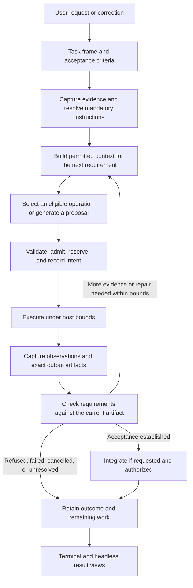

# Coder Terminal v0.5: algorithm, benchmark tasks, and golden traces

Status: design proposal, September 22, 2026. This document proposes a fresh
algorithm and its evaluation contract. It adds no runtime, benchmark result,
golden recording, or protocol kind. Implementation observations refer to
OpenAgents commit `a2b98a41b4819140e73b12f81c874df937775e13`, including the
execution-job and service-discovery changes that landed during this review.

**Build v0.5 around a task's unresolved requirements and retained evidence.**
Rust owns admission, state transitions, execution, verification, and recovery.
Replaceable AI operations prepare context, propose work, and assess uncertain
relationships. The terminal and headless interface present the same runtime.
Measure whether this arrangement completes useful work with less rework and
acceptable total cost.

Start with eight Terminal-Bench tasks: **`build-cython-ext`,
`vllm-deepseek-streaming`, `fix-code-vulnerability`, `fix-git`,
`cancel-async-tasks`, `headless-terminal`, `batched-eval-parity`, and
`math-eval-grader`**. Use the first six to develop repository work and runtime
behavior; add the last two as demanding evaluation-integrity workloads.
Keep separate conformance fixtures for our controller and protocols. Repairing
an upstream scheduler or parser does not establish that Coder's own scheduler
or parser is correct.

The most immediate protocol contracts are [CTX](../../../nips/openagents/NIP-CTX.md),
[POL](../../../nips/openagents/NIP-POL.md), [CAP](../../../nips/openagents/NIP-CAP.md),
[RUN](../../../nips/openagents/NIP-RUN.md), and [EVAL](../../../nips/openagents/NIP-EVAL.md).
Use [OPT](../../../nips/openagents/NIP-OPT.md) from the start to distinguish an
operation's meaning from its implementation. Add [PRG](../../../nips/openagents/NIP-PRG.md)
and [EXT](../../../nips/openagents/NIP-EXT.md) where composition and reusable
components have a consumer. [CJ](../../../nips/openagents/NIP-CJ.md) and
[COORD](../../../nips/openagents/NIP-COORD.md) become essential for remote, parallel, and
background work. All ten contribute to the complete design; they need not all
be network services before the first useful local repair.

## Sources and what they imply

This synthesis draws on the original proposal and its retained exports, the
TypeSafe analysis, roadmap, protocol addendum, consumer inventory, runtime
documentation, optimization design, related audits, and all ten
[OpenAgents NIPs and their shared contracts](../../../nips/openagents/README.md).
The [earlier chat-fit study](../measurements/2026-09-22-terminal-bench-chat-fit.md)
supplies the recent-work comparison and golden inventory. This document
reweights that shortlist for architectural coverage.

| Source | Implication for v0.5 |
| --- | --- |
| [Original TypeSafe coding-agent proposal](thoughts-on-a-typesafe-coding-agent.md) and [transcript 286](../../transcripts/286.md) | Construct query-specific context; retain explicit variables and expandable observations; discover tools progressively; preserve scoped instructions; account for cache rebuilding; share evidence across foreground and background work. Transcript 286's discussion around 01:30–05:30, 06:00–10:30, and 11:30–18:56 motivates these choices. Its transcription and illustrative economics are not measurements. |
| [Analysis](typesafe-agent-analysis.md), [roadmap](typesafe-agent-roadmap.md), and [protocol addendum](typesafe-agent-protocol-addendum.md) | Separate evidence, authority, and presentation. Model judgments can recommend relevance or independence; the host enforces permissions, actual conflicts, freshness, and budgets. |
| [AI programming and optimization design](../../optimization/README.md) | Freeze semantic purpose and protected controls while allowing prompts, retrieval, models, and bounded inference composition to change through experiments. A golden must allow a better valid implementation to take a different path. |
| [Jev opportunity audit](../../audits/2026-09-22-jev-opportunities/README.md) | Improve the evidence supplied to generation first. Compare against deterministic retrieval. The current metadata selector is not a production content-selection pipeline, and repeated review does not automatically improve quality. |
| [Project completion failure audit](../../audits/2026-09-21-project-completion-failure/README.md#how-a-typesafe-native-coder-could-prevent-this-failure) | Retain the complete acceptance matrix, corrections, tested artifact, review backlog, and stop condition. Passing checks on successive partial changes did not deliver the requested issue. Measure accepted completion rather than commits or active delegates. |
| [Earlier Terminal-Bench audit](../../gym/terminal-bench.md) | Workload budgets and useful diagnostic capture precede classifier experiments. Repeated controls are necessary. Its proposed Noul completion gate is a hypothesis: check exact certificate properties in code, and use semantic review only for requirements that need it. Its numerical noise floor belongs to its measured suite and cannot transfer to a new task panel. |

The live TypeSafe [building guidance](https://docs.typesafe.ai/concepts/how-to-build-with-system-one)
and [state contract](https://docs.typesafe.ai/concepts/state), retrieved on
September 22, support narrow judgments over explicit state within software
control flow. Our OPT design extends this to replaceable generation and
composition. It does not require every useful AI operation to return a
Noul, Choice, or Score.

## The proposed algorithm

The unit of work is a versioned task frame with the original objective,
binding constraints, acceptance criteria, source snapshot, attempts, and
unresolved requirements. A correction creates a new revision and invalidates
affected pending contexts and actions. It does not erase effects already made.

1. **Admit the task and pin its meaning.** Resolve owner instructions,
   repository scope, available operations, implementation versions, environment,
   and resource limits. Explicit structured program invocation resolves directly;
   ordinary work can have no named program. An inferred subgoal remains linked
   to the user's actual objective. Existing grants can authorize work without
   asking again; a changed action must still satisfy the applicable policy.
2. **Capture the evidence needed for the next unresolved requirement.** Start
   with exact identifiers, bounded lexical search, source/test relationships,
   and existing observations. Preserve original captures, versions, omitted
   bytes, and consistency limits. Source content, tests, and documentation have
   different evidentiary roles. A failed read is unavailable evidence.
3. **Construct context for its recipient.** Include mandatory instructions
   before optional evidence selection. Use contiguous excerpts and deterministic
   diagnostic parsing as the baseline. A measured selector or summary can improve
   that view, with originals retained for bounded expansion. Record the actual
   serialized input, schemas, candidate omissions, and coverage. If mandatory
   content cannot fit, narrow the request or refuse that dispatch.
4. **Choose or propose bounded work.** Filter operations mechanically by
   capability, effects, recipient, and supported bounds. Load compact descriptors
   first and full schemas/manuals for shortlisted operations. A semantic choice
   can select among eligible candidates or return no match. Generation supplies
   novel queries, arguments, patches, and explanations. Validate those proposals
   before execution. Pin one implementation for each admitted invocation.
5. **Execute through one host boundary.** Recheck source preconditions and
   grants, reserve aggregate resources, obtain required claims, and persist
   intent before dispatch. Bound the complete invocation, including retries,
   subprocesses, and children. Capture results before reporting recoverable
   progress. An uncertain write stays unknown until reconciled.
6. **Advance acceptance using evidence.** Associate checks with the exact
   candidate tree, command, environment, and requirement. Semantic assessments
   can expose gaps or request evidence; they cannot replace required checks.
   Reuse a check only when its relevant inputs and coverage still match. A new
   repair invalidates affected checks. Reserve review and integration capacity
   before increasing execution concurrency.
7. **Finish, integrate, or stop with a truthful result.** Report execution,
   verification, and integration separately. Integration rechecks the destination
   and current authority. Stop on the user's correction, exhausted resources,
   terminal refusal, or an unresolved condition that requires new input. Preserve
   the remaining acceptance items so another turn need not infer them from prose.

The host bounds this iterative repair controller. PRG v1 describes a bounded
acyclic graph; a diagram with a repair loop is not permission to serialize a
cyclic PRG graph. Each admitted workflow invocation has explicit inputs,
attempts, and a reservation drawn from the parent allowance. General durable
human waits need the separate work identified in the
[general-agent roadmap](../../agents/roadmap.md).

### The AI operations worth comparing

These are proposed semantic operations, not new wire schemas or installed
question sets. Each needs a documented abstention result and an actual consumer.

| Operation | Meaning and possible implementations | Protected boundary |
| --- | --- | --- |
| Prepare sufficient evidence | Given a requirement and permitted candidates, return a bounded view plus gaps. Compare deterministic retrieval, per-item judgments, joint selection, and bounded expansion. | Source provenance, mandatory instructions, recipient restrictions, and declared coverage survive every implementation. |
| Select a useful operation | Given eligible descriptors and a task, nominate an operation or no match. Compare explicit invocation, retrieval, and a typed selector. | Selection cannot install, enable, grant, or invoke by itself. Missing retrieval candidates remain measurable. |
| Propose a repair | Given a failure, current sources, and constraints, return an anchored patch or inability to propose one. Compare generators or bounded compositions. | Exact input identity, write scope, independent checks, and integration preconditions. |
| Relate a requirement to evidence | Assess supported, contradicted, conflicting, or insufficient evidence for one criterion. Start with annotations and targeted reads. | The observation that a test passed and the judgment that it is relevant remain separate; neither silently closes other criteria. |
| Select a model route | Choose among permitted, qualified implementations using measured workload behavior and expected remaining cost. | Every selector, generator, reviewer, and fallback receives only its admitted context. Estimates and actual usage remain separate. |

Noul expresses a proposition's yes probability; Choice compares a supplied
option set; Score expresses degree against an ordered rubric. Do not pool their
values into one confidence scale or use Score for exact bytes, elapsed time,
or money. Batch independent questions only when they share permitted state and
fit the backend. A result that changes retrieval or candidate construction
requires a subsequent call with new state. The vendor's
[fan-out pattern](https://docs.typesafe.ai/patterns/fan-out) motivates this
amortization; full-path latency and error behavior still need measurement.

### What can be reused today

| Existing foundation at the inspected commit | Work needed for this proposal |
| --- | --- |
| [`turn::run`](../../../crates/coder/src/turn.rs) and the shared terminal/headless path | Keep one controller. Add task/evidence events there rather than implementing another scheduler in the terminal. |
| [Shell permits and bounded execution](../runtime/shell-loop.md), [`supervise`](../../../crates/supervise/), and execution boundaries | Admit workload-specific budgets. The ordinary shell path still has three rounds, a 15-second command deadline, and a 2 KiB displayed output head. These are insufficient defaults for many selected tasks. Larger limits must remain enforced and accounted for. |
| [Repository source references](../runtime/repository-evidence.md), [`evidence.rs`](../../../crates/coder/src/evidence.rs), and [`select.rs`](../../../crates/coder/src/select.rs) | Build persistent task state, content-aware selection, complete mandatory-instruction handling, invalidation, and per-recipient context in the production turn. Existing source references do not establish all of CTX/POL. |
| [ATIF recording](../runtime/traces.md), [CoderBench](../../coderbench.md), and [Gym](../../gym/) | Retain independently inspectable artifact/check evidence, map outcomes explicitly, and add complete-task comparisons. An append-only ATIF file is not a durable effect controller. |
| [Program authority](../guides/program-authority.md), [artifact verification](../guides/artifact-verification.md), and [project supervision](../guides/project-supervision.md) | Extend the existing admission, review, and claim foundations. Full context sharing, protocol-wide recovery, immutable implementation materialization, and optimization adoption remain delivery work. |
| [Execution-job store and program dispatch](../../../crates/coder/src/execution.rs), worker subscription to `25920`, and [CAP service discovery](../../../nips/openagents/NIP-CAP.md#decision-services) | Reuse the new intake, claim persistence, shared-runtime dispatch primitive, and pinned service-resolution support. Demonstrate an actual remote repair with resolved artifact bytes and complete verification; these foundations alone do not establish that flow. Bind the discovered model/artifact to the served receipt. |

The NIPs are draft contracts. A feature's name in a document or an old project
board status does not establish implementation or conformance. Advertise only
the roles and guarantees demonstrated by the host's fixtures and live evidence.

## The Terminal-Bench panel

The catalog is the cloned [Harbor Terminal-Bench repository][tb-root] at
`3b5caaa4863d64dda7f0957bf4fc2d4f019202d4`: **66 tasks in `tasks/` and 90 in
`archive/`**. The preceding chat-fit study considered all 156. This design
rechecked the selected instructions, task configuration, and verifier entry
points. Archive tasks remain useful engineering cases but are not members of
the current `tasks/` set. This mixed panel is not an official leaderboard suite.

The ranking below is architectural relevance, not predicted pass rate. “Golden
evidence” means what a future observed Coder run should retain, in addition to
the common manifest described later. Task requirements and verifier coverage
are separate: neither agent prose nor a test name proves the complete contract.

| Priority and upstream task | Why it matters for v0.5 | Distinctive golden evidence and principal NIPs |
| --- | --- | --- |
| **1. [build-cython-ext][tb-cython] — archive** | A genuine diagnose, patch, compile, and use loop. The decisive diagnostic can occur after a long build banner; a successful installation can still omit a usable extension. | NumPy 2.3.0 and pyknotid source identity; original diagnostics and selected spans; successive patches; three compiled-extension imports and real use; relevant repository tests. **CTX/POL/CAP/PRG/RUN/EVAL** connect evidence selection to independently verified repair. |
| **2. [vllm-deepseek-streaming][tb-vllm] — current** | Our recent work includes generation transport and tool parsing. This task repairs corruption of streamed answer boundaries and tool-call JSON in a real source tree. | Chunk/token observations, failing reproduction, relevant parser state, patch, and independent chunk-boundary/JSON regressions. **CTX/CAP/RUN/EVAL** describe the repair; **CJ** is relevant to separate Coder transport tests, not a protocol used by this upstream task. |
| **3. [fix-code-vulnerability][tb-vulnerability] — archive** | Tests reasoning and preserved behavior alongside efficiency. The deliverable includes both a vulnerability report and a source fix with correct invalid-input errors. | Anchored source and trigger evidence, report artifact, patch, exception behavior, existing tests, and remaining review uncertainty. **CTX/POL/RUN/EVAL** prevent a plausible report or a high review score from standing in for a fix. |
| **4. [fix-git][tb-git] — archive** | Closest compact case for recovering work and integrating it into the intended branch. It separates discovering an artifact from landing it. | Initial refs, reflog/object evidence, recovered changes, destination state before integration, resulting tree/refs, and verification. **CTX/POL/RUN** are central; add **COORD** only in a companion case with actual competing writers. |
| **5. [cancel-async-tasks][tb-cancel] — archive** | Bounded concurrency, queued work, interruption, and cleanup are central to the host and delegates. The task itself asks for a Python async implementation. | Proposed implementation plus independent below/at/above-cap cancellation checks, observed cleanup, and final process outcomes. **CAP/PRG/RUN/EVAL** describe the repair; host cancellation and remote **CJ/COORD** require additional fault fixtures. |
| **6. [headless-terminal][tb-terminal] — archive** | Directly relevant to terminal behavior: interactive bash, startup files, interactive programs, modifier keys, and persistent shell state. | PTY input/output observations, startup and state-persistence checks, control-C behavior, patch, and verifier result. **CAP/POL/RUN/EVAL** capture operation semantics. Coder's resize, Unicode, event pressure, and terminal restoration remain separate UI checks. |
| **7. [batched-eval-parity][tb-parity] — current** | Strongest test of preserving meaning while improving batching and caching. Repeated IDs, conditioning-only spans, calibration, generation stopping, and metric denominators interact. | Frozen task/model/configuration, baseline and patched outputs, input-position mapping, packed/padded and reordering comparisons, independent oracle result, and shared-prefix runtime evidence. **CTX/OPT/EVAL/RUN** connect exact implementation identity to quality and performance. |
| **8. [math-eval-grader][tb-math] — current** | Combines source extraction, grader construction, real inference, and honest reporting. Useful for our evaluation tooling and evidence chain. | PDF-to-gold references, grader source, labeled development inputs, exact Qwen revision/recipe, actual decoded generations, submitted results, and external verifier evidence. **CTX/CAP/OPT/EVAL/RUN** distinguish the model under evaluation, the authored grader, and the protected benchmark verifier. |

Retain verifier limitations alongside the result. For example, the inspected
`fix-git` verifier checks two resulting files; the requested merge also warrants
independent branch/history observations in our companion profile.
`math-eval-grader` checks generation plausibility and consistency, which is
weaker than independently observing the exact inference execution. Coder's
capture and execution evidence should support that stronger provenance claim.

The older archive configurations above generally allow 900 agent seconds;
the four current tasks in the core/streaming extension discussed here
(`vllm-deepseek-streaming`, `sglang-qwen-burst`, `batched-eval-parity`, and
`math-eval-grader`) declare 28,800 seconds. These are ceilings, not estimates
of actual runtime. `math-eval-grader` declares an H100 environment. Pin the
actual environment, images, model artifacts, runner, and verifier before
budgeting runs. A source commit alone does not pin an externally fetched image
or model. Do not schedule this panel as eight cheap smoke tests.

### Useful extensions and controls

| Task | Role and limit |
| --- | --- |
| [sglang-qwen-burst][tb-sglang] — current | Closest transfer test for the streaming family: preserve interleaved content/tool-call order across split tags and speculative bursts. Group it with vLLM for reporting and leakage analysis rather than counting it as an unrelated domain. |
| [wal-recovery-ordering][tb-wal] — current | Repair durability-before-acknowledgment, ordered recovery, and detached snapshots. Excellent reasoning workload for RUN/COORD developers. Its constrained in-memory storage exercise does not prove our journal's disk durability, fencing, or recovery implementation. |
| [mteb-retrieve][tb-mteb] — archive | A narrow model-backed retrieval and ranking workload. Useful CAP/model/data-provenance control; retrieving one ranked document does not evaluate repository-context sufficiency. |
| [rs-archive-clone][tb-archive] — current | Long-horizon black-box investigation with exact stdout, stderr, exit, modes, file effects, and malformed-input behavior. Useful stretch case for evidence reuse and progressive operation discovery. Keep the task's cleanroom constraints binding. |
| [embedding-drift-monitor][tb-drift] — current | Statistical correctness and stateful alert behavior across multiple modules. Useful regression and background-finding analogy; alert debouncing is not our background scheduler. |
| [openssl-selfsigned-cert][tb-cert] — archive | Small completion-accounting control. Check files, permissions, key/certificate properties, and script behavior mechanically. Compare any added semantic completion pass against that baseline. |

Do not select `llm-inference-batching-scheduler` to stand in for agent
coordination: its request-packing problem is different. Likewise,
`constraints-scheduling` schedules meetings, and `large-scale-text-editing`
is a constrained editing exercise rather than a representative docs workflow.
The [chat-fit study](../measurements/2026-09-22-terminal-bench-chat-fit.md)
records these distinctions and the broader shortlist.

### Coverage the task panel cannot supply

The proposal in transcript 286 reaches beyond single-task repository repairs.
Add separately named companion experiments for these claims; passing the eight
tasks alone cannot establish them.

| Proposal area | Additional experiment and contract |
| --- | --- |
| Large operation catalogs and structured skills | Add irrelevant and unavailable descriptors around a real repair, vary catalog size, and measure retrieval misses, schema/manual bytes, and false activation. Verify mandatory POL instructions and EXT hook lifetimes despite optional guidance changes. |
| Long history and query-specific memory | Replay captured attempts with later evidence hidden, introduce an owner correction, restart, and retrieve the still-relevant evidence. CTX records visited and unexpanded history branches; measure recovery recall and full latency as history grows. A tree index alone establishes no logarithmic semantic-retrieval guarantee. |
| Model switching and cache economics | Compare stable-recipient and routed runs with equal task policy. POL records permitted recipients, rebuild estimates, actual usage, and observed cache behavior. A matching prefix digest establishes eligibility, not a provider cache hit. |
| Shared context, parallel work, and background assistance | Use a task pair with a real dependency plus independent reads, a bounded reviewer, and a competing integration. COORD/RUN must enforce claims, reserve review capacity, invalidate stale findings, and measure preparation, assimilation, duplicate work, and foreground delay. |
| Richer evidence and privacy | PDF extraction exercises one derivative chain; it does not establish general image/audio/video grounding. CTX needs supported media adapters and source anchors. POL must constrain selectors, reviewers, and fallbacks as well as generators. |

## What a golden trace contains

A golden is an attributable reference episode plus a protected correctness
contract and inspectable evidence. Preserve at least one observed successful
run where one exists, alongside failures and authored conformance cases.
An upstream solution script, an authored ideal path, a staged recording, and
an observed Coder run have different provenance. Do not relabel one as another.

**Golden invariants should constrain required transitions and outcomes while
allowing different correct strategies.** Reading different files, choosing
another qualified model, or skipping an unnecessary classifier can be valid.
For open-ended repairs, check the required partial order and acceptance
conditions. Exact call-order assertions remain appropriate for a fixture whose
subject is a specific protocol path, as in the existing six-delegate golden.

| Component retained for each episode | Protocol mapping | What the checker can establish |
| --- | --- | --- |
| Task request, revision, acceptance criteria, corrections, and source snapshot | **CTX** task frame, snapshot, typed variables, and correction references | Which task was attempted, which bytes were observed, and which obligations remained. A Git branch name alone is insufficient. |
| Mandatory and optional instruction set; recipients; effect policy | **POL** instruction bundle, recipient, action, route, and applicable approval/grant evidence | Which instructions and destinations applied; whether exact actions satisfied host admission. A model's safety opinion grants nothing. |
| Operation descriptions, bindings, presence observations, and enforceable limits | **CAP**, with **EXT** component definitions where packaged | What was actually available and which host/executor enforced each bound. Inert discovery does not authorize probes. |
| Semantic purpose and complete implementation closure | **OPT** AI signature, AI implementation, targets, and materialization; shared closure lock | Which realization ran, including prompts, questions, renderers, models, adapters, and configuration. Alias-only model identity remains an explicit assurance limit. |
| Selected workflow and typed input/output dependencies | **PRG** program, steps, exact definitions, and shared bounds | How admitted operations compose. Supported step kinds are `query`, `check`, `decide`, `delegate`, `program`, `module`, and `invoke`; host support must be proven. |
| Raw captures, selected representations, derived summaries, and missing coverage | Shared evidence descriptors and **CTX** representations, candidate/selection records, context manifests, and context builds | What each recipient actually saw, where it came from, and what was omitted. Store actual serialized input; a summary cannot reconstruct it later. |
| Decision and generation requests, answers, consuming policy, and observed usage | **OPT/POL/CTX** identities, ATIF calls, and **CJ** receipts when transported | Which answer affected control, which model was requested/served, and what is known about cost. Private hidden reasoning is unnecessary. |
| Actions, dispatch identity, outputs, effect observations, and attempt outcomes | **RUN** controller journal; **CJ** execution request/feedback/result for remote work | Intent before effects, admitted attempts, observed results, and unknown outcomes. A signed receipt establishes attribution at its stated assurance. |
| Parallel tasks, claims, shared reservations, findings, and integration proposals | **COORD**, linked to **CTX/POL/RUN** | Dependencies, isolated or fenced writes, stale findings, and independently accepted integration. Similar goals are not exact reusable results. |
| Candidate patch/tree/files and checks on that exact artifact | Shared ArtifactRefs, **RUN** observations, domain check records, **EVAL** acceptance | What changed and what was tested. Include commands, toolchain/features, coverage, output, and exit observations. A successful delegate answer does not prove correctness. |
| Independent episode verdict and complete resource accounting | **EVAL** suite, report, baseline, denominators, and scoped admission | Outcome evidence, failures, missing evidence, latency, known/unknown cost, and comparison uncertainty. Upstream reward and our conformance verdict remain separate fields. |
| Human-readable chronology and interface observations | **ATIF**, referencing the records above; terminal/headless event evidence | What was displayed or recorded, including provisional text and the final result. ATIF is the trajectory format, not another OpenAgents NIP or an execution lease. |

The shared contract distinguishes execution
`completed/refused/failed/cancelled/unknown`, verification
`passed/failed/unverifiable/not_run`, and integration
`accepted/rejected/pending/not_requested`. EVAL reports use
`pass/fail/inconclusive`; current CoderBench uses Gym's
`passed/failed/unverifiable`. An adapter must map these deliberately while
preserving their original values. A run may complete execution, fail verification,
and never request integration.

Join records with explicit task/frame, run, step, request, attempt, artifact,
and model identities. Preserve each format's digest rules: raw-byte hashes,
JCS artifact/lock hashes, domain-separated RUN digests, ATIF value digests,
and Nostr event IDs are not interchangeable. A new encrypted envelope can
carry the same logical run record without acquiring a new logical identity.

### Local artifacts and Nostr events

Most golden components are artifacts or references. They do not require their
own event kind, a relay round trip, or public publication.

| Network purpose, when used | Current draft kinds and responsibility |
| --- | --- |
| Discover capabilities and preferences | **CAP: `30180`, `30181`**. The service profile advertises public lanes, shared doors, limits, and schema versions under an operator publisher pin. Check freshness and served identity. Resolve immutable definitions for execution; mutable discovery heads are not execution pins. |
| Discover programs and modules | **PRG: `30182`, `30183`**. A program describes bounded composition; the host interprets it. |
| Release and discover reusable components | **EXT: `3184` release, `3185` revocation, `3186` namespace migration, `30184` listing, `30185` revocation checkpoint**. Install inertly; enable and invoke under separate host policy. |
| Carry conversation, decision, or execution jobs | **CJ request/result/feedback:** `25900/26900/27000`, `25910/26910/27010`, and `25920/26920/27020`, respectively. Conversation streaming does not provide execution-job durability. |
| Retain recoverable controller records | **RUN: `3187` journal and `30186` head hint**. The controller establishes sequence, durable intent, and fencing; a replaceable relay head does not establish a complete authoritative history. |
| Share a private artifact | Shared **`3188`** envelope, when a separately signed private artifact is needed. CTX, POL, COORD, and OPT introduce no dedicated event kinds. Artifacts can also remain local or be referenced by RUN. |
| Publish an authorized evaluation | **EVAL: `3189`**. Publication does not adopt an implementation or authorize execution. Private reports can stay local or use `3188`. |

NIP-42 connection authentication and NIP-44 encryption support the transport.
They do not establish tool permission or semantic correctness. Relay ACLs and
retention need conformance checks of their own. A public EXT release should
contain only its cleared reusable closure; private task evidence and generated
derivatives do not become public because a component performed well.

### Worked repair golden: `build-cython-ext`

The task frame preserves the requested source version, installed NumPy version,
three extension requirements, README usage, and repository-test exceptions.
The CAP binding places package installation inside the benchmark environment;
the task's request for a global Python installation never means the developer's
host Python. POL supplies that exact write/process/network scope.

An observed build produces a bounded original log and a capture-completeness
record. CTX links diagnostic excerpts and relevant source to that log. A
deterministic extractor and a semantic selector can consume the same captured
candidate pool in paired experiments. A diagnosis beyond the captured bytes
remains missing evidence; selecting a tail cannot recover discarded output.

Generation proposes a source change against the captured version. The host
validates preconditions, records admitted intent, applies it in the task
environment, and retains the resulting artifact. A PRG workflow can compose
the supported operations; OPT identifies the exact repair implementation.
The next iteration receives the changed diagnostic and previous attempt
references, which prevents treating a repeated failure as a new discovery.

The protected evaluator tests the resulting installation, genuine extensions,
usage, and the required test scope. Keep that evidence separate from the
agent's exploratory tests. RUN retains the actual execution and effect
observations; EVAL joins the upstream grade and the additional controller
checks. Benchmark completion need not include a Git push. Integration is
`not_requested` unless a separate profile asks for it.

The required order is source capture before context use, admission and durable
intent before an effect, and verification of the resulting artifact before a
verified-success claim. The exact grep commands, number of hypotheses, and
model-call decomposition are implementation choices.

### Worked runtime cases: cancellation and streaming

For **`cancel-async-tasks`**, the upstream golden records Coder implementing
and testing a cancellation-safe Python function. Its result says something
about the repaired function. A separate authored host fixture interrupts
Coder with queued and running operations, observes process-group termination
and cleanup, and checks retained reservations and final status. A remote
variant sends CJ cancellation and checks RUN reconciliation: a cancellation
acknowledgment is not proof the remote work stopped. COORD must prevent a
stale worker from integrating after its claim or generation becomes invalid.

For **`vllm-deepseek-streaming`** and **`sglang-qwen-burst`**, retain the
upstream reproductions, parser changes, and independent ordering/JSON checks.
Then exercise Coder's own interface with a separate transcript fixture:
text before a tool call, the call, then text after it; arbitrary chunk splits;
preview pressure; cancellation; and a missing sequence number. CJ conversation
partials require contiguous sequence handling; after a gap, incremental
rendering must stop until the complete result is available. Never dispatch
an operation from incomplete streamed JSON. Compare terminal and headless
final artifacts and authoritative transitions even when previews differ.

These are two evaluations per family: solving the repository task and checking
the agent that solves it. Report each under its own identity. Fault injection
or altered instructions create a companion profile, not an unmodified upstream
Terminal-Bench score.

### How the existing six-delegate golden maps

The retained [observed ATIF trace](../../../crates/coderbench/goldens/devin-fan-out-six.atif.jsonl),
[metadata](../../../crates/coderbench/goldens/devin-fan-out-six.meta.json),
[evidence sidecar](../../../crates/coderbench/goldens/devin-fan-out-six.evidence.json),
and [grade](../../../crates/coderbench/goldens/devin-fan-out-six.grade.txt)
describe a Coder-driven run on September 20 at
`34df6bc026aa68947979f172614a2ae533e4ed77`.

| Observed component | Relevant target contract | Limit of the existing evidence |
| --- | --- | --- |
| Six requested repository questions and pinned base | CTX task frame, snapshot, and acceptance references | The task is an easy, read-only fan-out by construction. It does not measure general decomposition or repair quality. |
| Capability probe, registry resolution, and admission check | CAP, PRG, and POL | These establish the observed local path; they do not prove every current draft's wire or host role. |
| Program choice, independence answers, and acceptance judgments | OPT implementation identity, CTX decision input, and ATIF decision calls | Preserve the actual historical answers and policies. The manifest's independent expected answers establish answer correctness, not the acceptance Noul. |
| Six local Devin subprocess results and boundary metadata | CAP execution and RUN/COORD observation concepts | It used the local adapter, not CJ execution jobs. It records no proof of the new durable journal, distributed claims, or private shared contexts. |
| Live grade: six matching answers, unchanged workspace, successful exit | EVAL episode evidence | The sidecar summarizes live observations; raw before/after snapshots were not serialized. An offline trace comparison cannot independently re-establish exit or workspace state. |

Keep this golden unchanged. One question asks what PRG defined at its historical
base; today's expanded NIP does not justify editing the recorded answer.
Any CTX/RUN mapping added later must be labeled a derived migration record,
with unavailable fields explicit. New guarantees require new observed runs.

## Build a corpus that can reject the design

Retain four distinct kinds of evaluation evidence:

1. **Upstream task runs:** original instructions, environment, artifact selection,
   and protected verifier at the pinned commit. Record every attempt and reward.
2. **Observed episode goldens:** selected complete runs with exact requests,
   source/context/artifact references, host outcomes, and independent checks.
   Keep failures as well as successes; selection of a golden is not a pass-rate
   estimate.
3. **Authored conformance cases:** stale source or approval, missing mandatory
   instructions, no useful operation, recipient refusal, conflicting claims,
   duplicate delivery, interrupted dispatch, unknown writes, truncated evidence,
   and cancellation races. These establish controller invariants without
   pretending a scripted answer measures model quality.
4. **Controlled algorithm comparisons:** candidate selection, routing, or
   composition changes under frozen workload and acceptance identities.

For v0.5, a local episode bundle should index the task/environment pins,
provenance, ATIF file, artifact closure, available RUN records, independent
check evidence, outcome mapping, and usage. A proposed directory convention
could group `manifest.json`, `trajectory.atif.jsonl`, `artifacts/`,
`verification/`, and `evaluation/`. This is a storage proposal, not a new
interoperable schema or a claim those files exist today. Content references
must resolve under the retention policy; credentials and private histories
must not enter the public golden directory.

Conformance checks should cover at least these counterexamples:

| Counterexample | Required result |
| --- | --- |
| Correct patch reached through a different valid tool/model path | Accept its task result if the same protected invariants and checks hold. |
| Attractive summary omits a required diagnostic or owner correction | Expose incomplete coverage and expand or stop; never treat omission as satisfaction. |
| Check passed before the candidate changed | Invalidate the affected acceptance evidence. |
| Two identical remote retransmissions for the same admitted request/attempt | Reuse the claim/result without redispatch. A new independent evaluation repetition gets a distinct attempt and actually runs. |
| Crash after dispatch with no confirmed effect result | Retain `unknown`, reconcile before retry, and keep unresolved resource usage visible. |
| Two disjoint paths hide a producer/consumer dependency | Preserve the dependency and deny unsafe readiness. No textual merge conflict does not prove semantic independence. |
| Background review returns after a source revision changes | Mark stale; revalidate before using or integrating its finding. |
| Task-local tests pass but a required artifact or behavior is absent | Fail or remain unverifiable under the declared check; do not accept a “done” message. |

## Evaluate implementations without freezing today's algorithm

Begin with a serial deterministic-evidence baseline using the same generator,
operation grants, environment, and task allowances as the candidate. Compare
one change at a time: improved deterministic retrieval, optional semantic
selection, then bounded expansion or another inference strategy. The generator
still produces novel repairs; “deterministic baseline” describes preparation
and control, not an assumption that the entire agent is deterministic.

Use EVAL for both local-function and complete-task outcomes. OPT freezes the
signature, baseline, allowed search surfaces, data rights, optimizer version,
selection objective, protected acceptance, and aggregate budget. Each trial
must materialize the exact candidate and demonstrate that the changed surface
was loaded. A filename naming a candidate is insufficient. Retain unsuccessful
builds, refusals, unknown charges, and failed confirmation.

The eight named tasks and inspected public verifiers are **development
material for this design**. They are not fresh held-out confirmation. Track
prior exposure, group near-duplicate repositories and task families, and reserve
genuinely unexposed confirmation cases before search. In OPT's data plan,
search and selection form EVAL development; confirmation maps to held-out.
Using confirmation feedback for further tuning consumes that separation.
Benchmark evaluation access does not grant training or prompt-optimization
rights. Respect upstream data restrictions and separately authorize any reuse
of private traces; this design publishes no private chat excerpts.

Record and compare:

- **Delivery:** upstream task success, independently verified requirements,
  incorrect success claims, regressions, and requested integration outcomes.
- **Evidence:** retrieval recall before selection, selected-evidence coverage,
  mandatory-instruction retention, stale inputs, extra reads, and expansions.
- **Operations:** catalog misses, false activations, invalid arguments, duplicated
  work, retries, refusal, cancellation, and unresolved effects.
- **Economics:** complete elapsed time, time to useful output, all decision,
  generation, reviewer, executor, verifier, and optimizer usage; actual cache
  observations; preparation and assimilation costs. Keep estimates separate.
- **Coordination and experience:** accepted work per wall hour, review backlog,
  contention, stale background findings, foreground interference, operator
  corrections, and terminal/headless outcome parity.

Use repeated, interleaved baseline/candidate runs under matched conditions;
report per-family results and task-clustered uncertainty. Fresh repetitions
cannot be replaced by cached or coalesced results. Measure wall time directly
and total process usage separately. Include missing and failed attempts using
the suite's declared denominator policy. A lower token count with more failed
repairs is not sufficient adoption evidence.

No universal probability floor or improvement percentage follows from this
panel. The [Jev audit](../../audits/2026-09-22-jev-opportunities/README.md)
records grading inconsistencies and confident errors that must be accounted
for before fitting a policy. Its evidence-selection and review cases are useful
development regressions, not a fresh confirmation set. Choose workload-specific
acceptance and a sample size capable of resolving the intended effect.

Adoption follows an eligible measured implementation and explicit operator
policy. EXT publication and OPT selection are separate steps. New admissions
can use the adopted pin; active runs retain their original one. Model drift,
revocation, or changed recipients can invalidate eligibility even when the
output schema stays the same.

## Delivery order for v0.5

| Increment | Complete deliverable | Evidence required before expanding |
| --- | --- | --- |
| **1. Local repair and evidence** | One task frame, deterministic context builder, native operations, enforced task budgets, and observed `build-cython-ext` plus a compact `fix-git` or certificate control. | Original captures, exact candidate artifacts, independent verification, terminal/headless results, and no lost mandatory instructions. CTX/POL/CAP/RUN/EVAL define the contract; OPT pins the baseline. |
| **2. Trustworthy runtime** | Streaming, terminal, and cancellation task runs plus the separate host fault corpus. Add the vulnerability task as a reasoning and false-acceptance check. | Process cleanup, safe handling of incomplete streams, effect reconciliation, truthful status, and current-artifact verification. Remote CJ roles are enabled only after their fixtures pass. |
| **3. Measured AI improvement** | A paired evidence-selection experiment and exact candidate materialization. Add batching-parity and math-grader workloads as environment capacity permits. | Useful complete-task improvement or an honest inconclusive/no-win result, full cost, protected evaluators, and unexposed confirmation. Connect the existing optimization backlog rather than create a parallel framework. |
| **4. Shared work and reusable components** | One bounded multi-task case, one revision-bound background review, and a small packaged workflow. | COORD claims/fencing, shared reservations, review backpressure, valid reuse, stale-result handling, and PRG/EXT closure verification. The six-delegate smoke golden remains a regression case, not the whole acceptance bar. |

The release criterion is a complete, inspectable task lifecycle: the user can
see the requested outcome, the evidence used, the exact work performed, the
checks that apply, and what remains unresolved. The implementation can evolve
without changing those meanings or granting itself more authority.

## Baseline evidence

[Terminal-Bench trace analysis](../measurements/2026-09-22-terminal-bench-trace-analysis.md)
reads the retained ATIF trajectories of Claude Code, Codex, and Devin on this
panel's tasks, step by step. Its findings translate directly into requirements
on the operations above: coverage-checked evidence capture (the `.pyx` miss),
enumerate-then-rewrite repair, bounded context excerpts, out-of-tree
verification, byte-exact post-write reads, and budget discipline that reserves
capacity for the acceptance path rather than spending it all on exploration.

[tb-root]: https://github.com/harbor-framework/terminal-bench/tree/3b5caaa4863d64dda7f0957bf4fc2d4f019202d4
[tb-cython]: https://github.com/harbor-framework/terminal-bench/tree/3b5caaa4863d64dda7f0957bf4fc2d4f019202d4/archive/build-cython-ext
[tb-vllm]: https://github.com/harbor-framework/terminal-bench/tree/3b5caaa4863d64dda7f0957bf4fc2d4f019202d4/tasks/vllm-deepseek-streaming
[tb-vulnerability]: https://github.com/harbor-framework/terminal-bench/tree/3b5caaa4863d64dda7f0957bf4fc2d4f019202d4/archive/fix-code-vulnerability
[tb-git]: https://github.com/harbor-framework/terminal-bench/tree/3b5caaa4863d64dda7f0957bf4fc2d4f019202d4/archive/fix-git
[tb-cancel]: https://github.com/harbor-framework/terminal-bench/tree/3b5caaa4863d64dda7f0957bf4fc2d4f019202d4/archive/cancel-async-tasks
[tb-terminal]: https://github.com/harbor-framework/terminal-bench/tree/3b5caaa4863d64dda7f0957bf4fc2d4f019202d4/archive/headless-terminal
[tb-parity]: https://github.com/harbor-framework/terminal-bench/tree/3b5caaa4863d64dda7f0957bf4fc2d4f019202d4/tasks/batched-eval-parity
[tb-math]: https://github.com/harbor-framework/terminal-bench/tree/3b5caaa4863d64dda7f0957bf4fc2d4f019202d4/tasks/math-eval-grader
[tb-sglang]: https://github.com/harbor-framework/terminal-bench/tree/3b5caaa4863d64dda7f0957bf4fc2d4f019202d4/tasks/sglang-qwen-burst
[tb-wal]: https://github.com/harbor-framework/terminal-bench/tree/3b5caaa4863d64dda7f0957bf4fc2d4f019202d4/tasks/wal-recovery-ordering
[tb-mteb]: https://github.com/harbor-framework/terminal-bench/tree/3b5caaa4863d64dda7f0957bf4fc2d4f019202d4/archive/mteb-retrieve
[tb-archive]: https://github.com/harbor-framework/terminal-bench/tree/3b5caaa4863d64dda7f0957bf4fc2d4f019202d4/tasks/rs-archive-clone
[tb-drift]: https://github.com/harbor-framework/terminal-bench/tree/3b5caaa4863d64dda7f0957bf4fc2d4f019202d4/tasks/embedding-drift-monitor
[tb-cert]: https://github.com/harbor-framework/terminal-bench/tree/3b5caaa4863d64dda7f0957bf4fc2d4f019202d4/archive/openssl-selfsigned-cert
