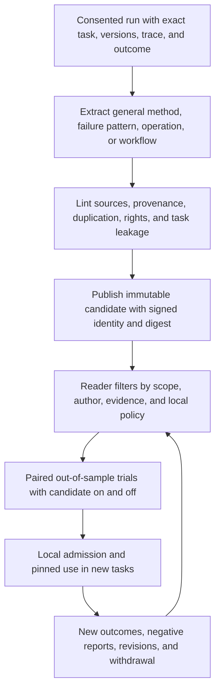

# A measured path to the best coding agent

Status: plan, 2026-09-26. This document defines what Coder must prove, what
to build next, and how an open network can make each useful improvement
available to other agents. It combines the [determinism thesis](thesis.md),
the [TypeSafe agent roadmap](typesafe-agent-roadmap.md), the
[2026-09-25 assessment](2026-09-25-assessment.md), the [Microcoder guide](../guides/microcoder.md),
the [knowledge-base design](knowledge-base.md), and the
[OpenAgents protocols](../../../nips/openagents/README.md). It also uses the
design discussions in [episode 286](../../transcripts/286.md),
[episode 287](../../transcripts/287.md), and the in-progress
[episode 288](../../transcripts/288.md). Those transcripts express product
intent; their benchmark remarks are not substitutes for retained run records.

Update: [episodes 213–215, 266, and 267](../../agents/market-infrastructure.md)
add agent labor and market infrastructure to this plan. Agent labor is a
high-priority parallel track: let independent operators earn Bitcoin for
bounded coding jobs. It does not wait for every model or component to reach
the top of a benchmark.

## The claim to earn

Coder can become the best coding agent by combining reliable execution,
independent evidence, economical model routing, and a growing collection of
reusable, measured components. No single model or prompt can guarantee that
position. An open network matters only if a contribution improves a new
task for another operator after its cost, privacy, and failure risks count.

Define *best* on a declared workload and budget, not on a selected win. The
primary quality measure is pass rate on complete, independently graded tasks.
Report cost per verified pass **including failed attempts**, trial and agent
wall time, harmful errors, unresolved outcomes, and human intervention. Show
the quality–cost–latency frontier rather than collapsing it into one number.
Run public benchmarks for comparability and private, newly written repository
tasks for transfer. A Terminal-Bench rank is valuable; it cannot establish
performance on all day-to-day coding work.

Every comparative claim needs the same task revision, environment, allowance,
model, effort, tool set, and run count when assessing a Coder component. When
comparing whole agents, disclose the differing configurations and hardware.
Freeze selection before held-out trials. Publish denominators, uncertainty,
failures, unknown costs, and all attempted variants. The
[component measurement ladder](../../optimization/coder-components.md) and
[NIP-EVAL](../../../nips/openagents/NIP-EVAL.md) supply the evaluation shape.

## Where the evidence stands

The [eight-task development panel](../../terminal-bench/development-results.md)
showed that Jev probes and a lean Opus executor could preserve 24 of 24 passes
at lower cost than Claude Code. That is evidence that the harness matters,
but the panel is small and reused during development. The
[matched controller study](../../terminal-bench/2026-09-23-matched-controller-targeted.md)
also found a controller costing 68% more without a significant pass gain.
More control is not automatically better.

Episode 288 adds a useful operational lesson: an agent must make its work
legible while it runs, not only after a grade. The Gym's transcript, Jev
ranking, and read-only run questions let a person inspect apparent wins,
unearned success, and repeated mistakes. The later “Fire Loop” discussion
asks for short, bounded trials that stop on specific evidence of a stall and
explain the reason. A fast stop is useful only if its false-stop rate is
measured on successful traces. An interesting Jev story is a lead for
inspection, not an outcome label. The
[pattern-components analysis](pattern-components.md) gives the complementary
rule: turn repeated winning behavior into reusable evidence work or an
executed check, not wording fitted to a benchmark task.

The original acceptance-contract thesis has not yet earned its strongest
premise. Luna-written suites in v6–v8 sometimes went green while the official
verifier failed, or even reversed a correct fix. Later self-scores accepted
failures. The [failure audit](2026-09-25-assessment.md) found that a check
written from the same mistaken belief as the fix is not independent evidence.
Executable checks still have a role, but each check needs a stated source,
an observed run, a completeness claim, and authority proportional to its
measured reliability. A green local suite alone must not declare success.

[Issue #9670](https://github.com/OpenAgentsInc/openagents/issues/9670) has
delivered a real first network component: `crates/knowledge` parses, lints,
retrieves, versions, and scores entries; Microcoder retrieves them with words,
embeddings, and Jev and records their costs; `kb add`, `harvest`, `evidence`,
`admit`, `withdraw`, `publish`, and `sync` support local contribution and
NIP-KB sharing. The initial 14 cited entries and later harvested candidates
do not prove generalization. The MMD win was developed with that task in
view. Four other tasks run once with and without the base yielded 0 of 8
passes. The initial evidence reports found no entry with enough paired tasks
to justify evidence-based admission. The provenance correction in
`d00c9c8373` explicitly excludes the task that inspired the two MMD entries
from their evidence; `5aaae05aa8` adds a reviewed SA-CCR reference entry
whose source task is likewise excluded. Operator review can admit a useful
reference, but it is distinct from measured benefit.

A new local development run on `react-lead-form` passed its task verifier in
425.6 seconds and $0.1104 of recorded model, Jev, and embedding cost.
Fable 5.1 low passed two of five public attempts; the successful attempts'
median was 440.5 seconds and $2.78. See the
[frozen local protocol](../../../bench/terminal-bench/experiments/2026-09-25-microcoder-mac/protocol.md).
This is one promising knowledge-assisted pass, not a matched speed or pass-rate
result: machines, task runners, and network controls differ. The build also
emitted a browser compatibility warning, so the verifier's pass is the claim,
not proof that every user path works. Repeat under a matched runner with KB
on and off before attributing the win to knowledge.

## The coding loop to build

Keep [Microcoder's](../guides/microcoder.md) small, inspectable action loop as
the development vehicle. The product Coder can adopt components after they
win; do not replace its current path wholesale on a benchmark anecdote.

1. **Establish the task and authority.** Capture the user's objective,
   corrections, repository revision, applicable instructions, allowed
   actions, recipient and disclosure policy, budget, and success criteria in
   a versioned task frame. Read-only discovery does not grant execution.
2. **Get evidence before editing.** Run cheap deterministic probes, retrieve
   relevant source spans and admitted knowledge, then use Jev only where a
   narrow typed judgment has measured value. Preserve source anchors,
   omitted candidates, and uncertainty. Mandatory instructions never depend
   on relevance ranking. Expand original evidence on demand.
3. **Map requirements to checks.** Distinguish task-stated requirements,
   standards and references, existing tests, newly written tests, and the
   protected grader. Execute checks on a baseline and on the candidate;
   record whether each check discriminates a known-good from a known-bad
   state when possible. Freeze checks and their provenance before using them
   to drive a repair. A red-first test can still be wrong; a passing check
   cannot cover an untested requirement. Where a task supplies an independent
   checker, reference implementation, or measurable goal, use that evidence
   before writing a surrogate check. A separately written oracle can flag a
   suspect result, but it cannot block a passing candidate until false
   rejections have been measured on unseen successful work.
4. **Generate and execute bounded actions.** Let a model write code or
   propose one tool action. Host code validates arguments, scope, budgets,
   and preconditions, runs commands in the boundary, records actual effects,
   and rechecks the affected requirements. A Jev judgment may prioritize the
   next observation or detect likely stalling; it cannot authorize a write
   or certify completion. Stream the selected evidence, Jev answers, checks,
   actions, elapsed time, and budget into the Gym so a person can inspect a
   live run and ask cited questions about it.
5. **Escalate for a reason.** Use observed failure signatures, remaining
   budget, and measured family outcomes to choose the next action: another
   cheap iteration, broader evidence, a stronger executor, a human question,
   or a truthful stop. A fast monitor must cite the observed failure and
   retain the trace; “looks unlike Fable” is not a reason to terminate.
   Route across available providers when disclosure and interface contracts
   allow it. Count setup, retries, cache behavior, review, and unsuccessful
   attempts in that policy's cost.
6. **Finish with an attributable result.** State which requirements have
   executed support, which remain unverified, and what the independent
   grader or repository checks observed. Keep output, trace, candidate bytes,
   grader result, cost, and exact component versions. Completion, verification,
   and integration are separate states.

This is the practical reading of the [thesis](thesis.md): code owns control
and effects; Jev supplies cheap, typed uncertainty estimates; generation
does the irreducibly generative work. The [TypeSafe architecture](typesafe-agent-analysis.md)
allows a semantic operation's implementation to change without changing its
meaning or its protected host constraints.

## How the network compounds

The unit of compounding is a **reusable improvement with independent
evidence**, not a longer prompt or a count of packages. Harvest a general
method from a run, cite an independent reference, and record the run as
`written_from` so that task cannot validate its own lesson. Keep failed and
neutral trials. Compare the exact entry or component digest against its
absence across new tasks and operators. If retrieval distracts, costs more,
or misleads, demote or withdraw it. Each reader chooses whose authorship and
evaluation evidence to trust. A signature authenticates an author; it does
not certify correctness. Private traces remain local unless their owner
explicitly permits a scoped publication or study.

The first shared currency should be compact, cited knowledge and reproducible
evaluation reports because [NIP-KB](../../../nips/openagents/NIP-KB.md)
already has a local implementation. Grow to immutable program, plugin, and
decision implementations only after their interfaces and host boundaries are
tested. The `plugins/` directory currently packages decision-service clients
for other agents; it is different from the bounded Wasm plugin host in
`crates/plugin`. The [extension specification](../../extensions/README.md)
describes future distribution, but installed packages remain inert until an
operator grants and admits them. Dynamic discovery should load a small,
relevant descriptor and then an exact schema, never dump a whole registry
into every model prompt.

The network can become a durable advantage because independent people can
contribute different task families, libraries, environments, methods,
evaluators, and model configurations under common contracts. It is open: a
different client can use the same verified entry. Coder should compete by
being the most reliable consumer and contributor, not by assuming exclusive
ownership of the graph. Measure the network effect as **incremental
out-of-sample verified passes per adopted contribution**, with full marginal
cost, latency, and harmful-regression rates. If that number does not rise as
contributors and entries grow, the flywheel is not working.

## Agent labor makes the network useful now

The network needs buyers as well as contributors. Coder should be able to
hire another operator's agent for a bounded repair, regression test, review,
or investigation, and let its own operator offer that labor through a
controlled **Go online** mode. Buyers specify deliverables and acceptance
terms; providers quote price and capacity, return artifacts and evidence,
and receive the agreed Bitcoin payment. The
[agent labor plan](../../agents/market-infrastructure.md) defines the roles,
missing implementation, recovery tests, and delivery order.

This gives the knowledge network a source of useful experience. Accepted
jobs can produce reusable components and licensed data when their owners
permit it; better components can then improve later jobs. Pay the worker,
data owner, and component author under separate agreements. A recorded use
does not prove an entry caused a win or grant permission to share the trace.

Start with real Coder work and named buyers. Episodes 213 and 214 describe
GPUtopia's excess supply and subsidized demand; avoid repeating that result
by treating provider signups as success. Measure repeat buyers, accepted jobs,
provider net earnings, full buyer cost, and project subsidy. A successful
labor market must deliver work the buyer values and earnings the provider
can sustain. Providers can use any compatible executor that meets the
contract, so the first market does not depend on Luna winning every task.

Carry over the infrastructure principle from episodes 266 and 267: separate
client, relay, provider, evaluator, and payment authority. Run the same client
against independently operated providers and relays; retain accepted terms
and reconcile uncertain work after outages. The relay delivers records;
the buyer checks the agreed result. The existing relay and gateway billing
do not yet implement this commercial lifecycle.

## Protocol responsibilities and present limits

All documents under [`nips/openagents/`](../../../nips/openagents/README.md)
are draft contracts. Their existence is not evidence that every path is live.

| Contract | Role in a networked Coder | Current limit that affects this plan |
| --- | --- | --- |
| [Shared contracts](../../../nips/openagents/contracts.md), [CAP](../../../nips/openagents/NIP-CAP.md), [POL](../../../nips/openagents/NIP-POL.md) | Exact artifact and capability identity, scoped grants, instruction precedence, disclosure, and operator adoption. | A discovered capability or signed package never grants execution. Host enforcement and per-recipient policy must precede use. |
| [CTX](../../../nips/openagents/NIP-CTX.md) | Task frame, source snapshots, recipient-specific context manifests, omissions, and expansion. | Build the complete coding path and measure source coverage; summaries cannot silently replace mandatory evidence. |
| [PRG](../../../nips/openagents/NIP-PRG.md), [EXT](../../../nips/openagents/NIP-EXT.md) | Pinned typed workflows and portable releases of programs, bounded Wasm guests, skills, and AI implementations. | Seven local programs and the Wasm host core exist; full package discovery, distribution, installation, and adoption remain planned. |
| [CJ](../../../nips/openagents/NIP-CJ.md), [COORD](../../../nips/openagents/NIP-COORD.md), [RUN](../../../nips/openagents/NIP-RUN.md) | Carry jobs, fence multi-agent claims, preserve durable intent/effects, and reconcile unknown outcomes. | A relay receipt is not a lock, durable execution, or proof of effect. Start with local runs; add cross-machine work only with recovery tests. |
| [KB](../../../nips/openagents/NIP-KB.md) | Immutable knowledge versions, current heads, withdrawals, and reader-specific trust. | Local retrieval and Nostr publish/sync work. Curated EXT snapshots, encrypted private entries, and OPT studies are not built. |
| [EVAL](../../../nips/openagents/NIP-EVAL.md), [OPT](../../../nips/openagents/NIP-OPT.md) | Matched, partitioned whole-task evidence and studies of replaceable implementations. | Reports and specifications exist; a candidate must be materialized and confirmed on protected tasks before any automatic promotion policy is considered. |
| [MV](../../../nips/openagents/NIP-MV.md) | Shared 3D world state. | Standalone and not on the coding-agent critical path. It should not inflate Coder's delivery scope. |

## Delivery order and gates

The table orders the coding-quality work. Build the agent-labor track
alongside it, starting with a bounded issue-to-patch order, runnable provider,
client acceptance, and a payment adapter. It uses the same retained evidence
and host boundaries without waiting for stages 4–6. Its first milestone is
a real buyer accepting an outside operator's result and that operator
receiving the agreed payment, with recovery and receipts demonstrated.

| Stage | Build and measure | Gate to advance |
| --- | --- | --- |
| 1. Make evidence comparable | Pin task images, graders, model targets, budgets, start/end clocks, component digests, and retained ATIF traces. Reconcile unknown cost and setup failures. Run a small mixed task panel with cheap and frontier baselines. | Every attempt, including failure and timeout, has a replayable record and an honest outcome; official and local runner differences are explicit. |
| 2. Fix the stopping signal | Build an independent requirement/evidence ledger, executed checks, verifier-only fact coverage, and tiered check authority. Replay old false-green and false-red cases before live trials. | The signal distinguishes successful and failed retained candidates on unseen task groups without hiding unknowns or reversing verified fixes. Otherwise do not let it terminate a run. |
| 3. Prove an economical task loop | Compare Microcoder with KB off/on and with one controller change at a time on a predeclared unseen family. Include stronger-model escalation for tasks Luna cannot solve. Measure total cost per pass and wall time. | Quality is no worse than a declared baseline within uncertainty; at least one task family shows a repeatable cost or time gain. Keep a simple fallback policy for the remainder. |
| 4. Prove knowledge transfer | Correct `written_from` provenance, evaluate admitted entries and candidate snapshots across new tasks and independent operators, and publish negative NIP-EVAL reports. Add private entries and curated pins after the local comparisons work. | At least two distinct out-of-source task families show a reproducible positive contribution without a material regression elsewhere. Current #9670 admission counts alone are too small for a global claim. |
| 5. Package the useful parts | Materialize digest-pinned knowledge snapshots, program steps, Wasm plugins, and semantic AI implementations with local grants, conformance fixtures, revocation, and rollback. Use progressive discovery. | A second client can install, inspect, run, evaluate, and remove the same version without changing its authority or result semantics. |
| 6. Optimize and scale | Run NIP-OPT studies over context selection, Jev question sets, routing, check selection, and program choice; confirm on protected partitions. Add parallel optimization cohorts only when they yield a measured gain. Labor orders already require durable claims and recovery through COORD/RUN, including with one remote worker. | A pinned policy improves whole-task results on independent cohorts and survives model/provider updates. Maintain a human-controlled adoption and rollback path. |

Use the four-tier fixture → retained replay → mini-task → pinned cohort ladder
from the [component design](../../optimization/coder-components.md). Run cheap
isolation checks before spending on long trials. Study the whole policy
whenever a component changes the task outcome. Search may change model-facing
implementations; it may not change graders, permissions, data partitions, or
the acceptance rule mid-study.

## What would disprove this plan

Stop claiming the contract is an advantage if independent checks cannot
predict official outcomes across unseen task families. Stop claiming a
knowledge network effect if entries help only their source tasks, if larger
catalogs raise false retrieval and cost, or if different operators cannot
reproduce an entry's benefit. Stop claiming a router advantage if its full
task cost, including exploration and failed escalations, exceeds a fixed
strong executor at comparable quality. If a cheap model has an irreducible
capability gap, route that family to a capable model rather than repackage
the same failure as another prompt.

The next concrete experiment is a matched, frozen `react-lead-form` cohort
with KB on and off and the same Microcoder binary, model, effort, grader,
machine class, and budgets. Then expand to several unrelated tasks with
known source exclusions. Publish the traces and negative outcomes before
deciding whether this knowledge entry, the loop, or a different component
deserves credit. Separately, replay the prewritten-oracle and fast-stop
policies against both passing and failing retained candidates before
granting either live authority, then run a frozen on/off trial. These are
the smallest tests of whether one operator's learning can reliably help
the next one without discarding correct work.
