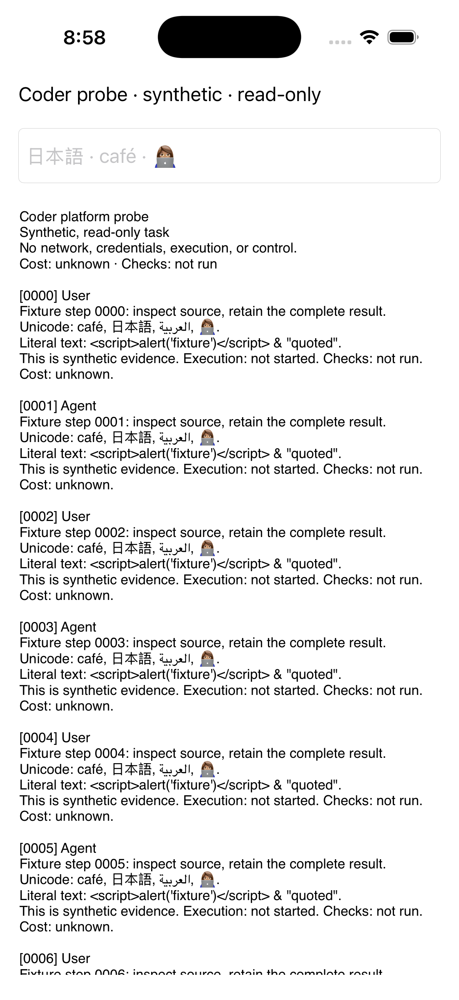

# Rust-first Coder client feasibility

Status: **Feasibility decision; client release gates remain open.**
Date: 2026-09-26.
Tracking: [#9678](https://github.com/OpenAgentsInc/openagents/issues/9678),
[suite delivery](../migration-status.md), and the
[migration design](coder-suite-migration.md#mobile-desktop-and-web).

**Current implementation direction:** [Rust Native](../../../crates/rust-native/README.md)
and its [adoption plan](../rust-native/adoption.md), tracked in
[#9693](https://github.com/OpenAgentsInc/openagents/issues/9693), add the shared
semantic/style/theme foundation and plan progressive native adapters. The
Apple target uses a thin SwiftUI bridge with Rust state and domain logic.
Native renderers remain planned. The observations below concern the existing
UIKit and Android framework probes; they are not SwiftUI acceptance evidence.

## Decision

Use shared Rust task and evidence models with native text controls for the
first read-only mobile clients. Use Rust-rendered semantic HTML for the first
web view. Keep the existing terminal renderer. Share identities, ordering,
pagination, unavailable states, and actions across surfaces; do not make a
custom graphics canvas the prerequisite for reading a task.

The public prototype runs UIKit from Rust on the iOS simulator and standard
Android widgets from Rust through JNI on an Android emulator. Neither shell
adds Swift, Kotlin, Java, or TypeScript product source. The native controls
retain the platform's text system. That is a useful feasibility result, not
proof of every keyboard, screen reader, OS release, or production credential
lifecycle.

The most important measured finding concerns complete transcripts. A single
large Android `TextView` rendered a 2,000-step fixture, but its accessibility
output stopped at step 386. The revised prototype uses an Android `ListView`
with separate, recycled rows. Its first and last accessibility snapshots
contain step 0, step 1999, and the final transcript marker in the corresponding
views. **A complete string in memory is insufficient evidence that a person
can navigate a complete transcript.**

Proceed with M5's shared views and M8's native observation clients on this
basis. Keep M7 transport and M9 control separate. This prototype grants no
task, filesystem, approval, wallet, or signing authority. The physical-device
and operational gates below must pass before a client release; completing
this feasibility decision does not satisfy G2.

## What ran

The new [`coder-mobile-probe` crate](../../../crates/coder-mobile-probe/)
generates public synthetic `atif::Step` records and exports them through the
existing ATIF document implementation. It neither reads private chats nor
copies private Coder code. Every row contains text, Unicode, and a literal
HTML injection example. Cost remains **unknown**, checks remain **not run**,
and execution remains **not started**.

The native fixture has 2,000 steps; its full text export is 561,166 bytes.
The Rust HTML path escapes the text before embedding it, uses an explicitly
labeled input, and requires no executable browser code. The input fields are
test controls: they send nothing and do not persist a draft.

| Surface | Observed result | Boundary of this evidence |
| --- | --- | --- |
| macOS host | Two fixture tests passed. ATIF export, last-step retention, Unicode, and HTML escaping are covered. | Host tests do not test mobile lifecycle or input. |
| iOS simulator | Linked, installed, launched, and visually inspected native UIKit text controls on iPhone 17 Pro / iOS 26.5. Synthetic Keychain add/read/byte comparison/delete/missing-item checks passed. Background/foreground and process restart were exercised. | Simulator evidence; physical lock behavior, VoiceOver, text composition, and durable drafts remain unmeasured. |
| Physical iOS target | `aarch64-apple-ios` linked. The app was signed using an existing matching development profile. Installation was attempted. | Installation stopped because the paired iPhone was locked. No physical-device runtime result is claimed. |
| Android emulator | Linked an ARM64 APK, installed, launched native views on API 35, retained lifecycle logs, and exercised a process restart. App-scoped Keystore AES-GCM encryption, decryption, byte comparison, and key deletion passed. | Emulator evidence; hardware backing, physical keyboards, TalkBack, and key invalidation were not tested. |
| Android accessible transcript | Native virtualized rows expose the first and final steps and the end marker. Each observed row contains at most 241 characters in the retained snapshots. | This validates the fixture's rows, not every possible large individual tool result. Expansion and bounded paging of a single large result still belong in M5/M8. |
| Physical Android | No device was attached. | No real-device result. |
| Web | The Rust-generated document opened in the in-app browser. Its labeled input retained `café 日本語 👩🏽‍💻`; the expanded accessibility text reached step 1999 and the end marker. | This is a static read-only page, not an authenticated web client or a mobile-browser qualification. |

The [runtime receipt](../verification/2026-09-26-mobile-feasibility/runtime-receipt.json)
records these distinctions. Build receipts retain commands, durations, and
source digests for the [host](../verification/2026-09-26-mobile-feasibility/host-build.json),
[iOS simulator](../verification/2026-09-26-mobile-feasibility/ios-simulator-build.json),
[iOS device target](../verification/2026-09-26-mobile-feasibility/ios-device-build.json),
and [Android](../verification/2026-09-26-mobile-feasibility/android-build.json).

The [first Android view](../verification/2026-09-26-mobile-feasibility/android-first.xml)
and [last Android view](../verification/2026-09-26-mobile-feasibility/android-last.xml)
are small native accessibility snapshots, rather than an assertion that a
giant text field is accessible. The [iOS event log](../verification/2026-09-26-mobile-feasibility/ios-lifecycle.jsonl)
retains the initial failed Keychain result alongside the corrected result.



## Public dependencies and platform boundary

| Dependency or facility | Version | License or distribution boundary | Use |
| --- | --- | --- | --- |
| `atif` | Workspace | Existing repository code and license policy | Shared trace steps and export. |
| `serde_json` | Locked workspace version | MIT or Apache-2.0 | Structured exports and receipts. |
| `objc2` | 0.5.2 | MIT | Objective-C ABI calls implemented in Rust. |
| `objc2-foundation` | 0.2.2 | MIT | Foundation strings and geometry types. |
| `android-activity` | 0.6.1, `native-activity` | MIT or Apache-2.0 | OS `NativeActivity` entry and lifecycle. |
| `jni` | 0.22.4 | MIT or Apache-2.0 | Native Android text controls and Keystore calls from Rust. |
| UIKit, Foundation, Security | iOS SDK | Apple SDK and distribution terms | Native views and Keychain; no private framework use. |
| Android framework and Keystore | API 26 minimum; API 35 exercised | Installed Android platform APIs and SDK terms | Native controls, virtualized lists, and app-scoped key use. |

All registry versions already existed in the repository's lockfile. The new
package makes its platform dependencies explicit. Distribution still requires
the notices and repository-license decision described in the
[dependency policy](../../dependencies.md); a Cargo license check is not an
App Store or Play Store release review.

The upstream [Android activity guidance](https://github.com/rust-mobile/android-activity)
distinguishes `NativeActivity` from `GameActivity`: NativeActivity has no
built-in full input-method integration for a custom rendered surface. This
prototype instead uses the OS `EditText` widget, returns input and rendering
to the Android View system, and uses the native list for observation. It does
not claim that raw native key events are a complete IME implementation.
The [Android framework source](https://android.googlesource.com/platform/frameworks/base/+/refs/heads/main/core/java/android/app/NativeActivity.java)
explains the surface/input ownership that caused the initial blank screen.

On Apple platforms, [objc2](https://github.com/madsmtm/objc2) permits Rust to
call the native framework ABI. Keychain access must remain app-scoped and
properly entitled; [Apple's Keychain access-group documentation](https://developer.apple.com/documentation/security/sharing-access-to-keychain-items-among-a-collection-of-apps)
describes that boundary. A Rust binding does not remove signing requirements
or prove that a secure item behaves correctly while a device is locked.

## Input, accessibility, and long transcripts

Keep text composition in native text controls. A surface adapter should
receive committed edits, selection changes, and composition state without
reinterpreting every physical key as a character. Preserve Unicode byte and
UTF-16 boundaries explicitly when a platform API needs them. Do not use a
successful pasted string as evidence for marked-text composition, dictation,
autocorrection, or an external keyboard.

The automated iOS simulator input attempt did not establish Unicode IME
behavior: simulated typing produced different text, and clipboard forwarding
timed out. The browser's Unicode field test passed, but it likewise does not
establish a physical mobile keyboard result. Retain those as different
observations. Real device tests must include a composing Japanese keyboard,
an accented Latin sequence, emoji modifiers and joined sequences, right-to-left
text, deletion across a selection, and input while the keyboard resizes the
viewport.

Use stable semantic rows for transcripts. Retain the entire source evidence
and expand a large individual record through bounded regions. A renderer may
virtualize rows, but it must preserve a stable cursor, original event identity,
and the ability to reach the last byte. Accessibility must expose the same
record and unavailable states that the visual surface shows. The Android
ListView finding supports this design directly. The iOS prototype still uses
one `UITextView`; its accessible paging needs the same production treatment
before M8 is complete.

The first native shells deliberately use standard platform appearance. They
are not a second Coder design system. Product clients should consume the
existing Coder intensity and layout semantics through a platform-compatible
adapter, and preserve native focus, Dynamic Type or font scaling, safe-area
insets, and keyboard behavior. The prototype's fixed iOS layout and limited
rotation coverage are not release-ready layout evidence.

## Credential storage, lifecycle, and reconnect

The Keychain probe writes a public synthetic marker under this app's own
service and account, reads it, compares bytes, deletes it, and verifies that
it is absent. It selects `WhenUnlockedThisDeviceOnly`; the test did not lock
the device and therefore does not validate that restriction operationally.
The Android probe creates an app-scoped synthetic AES key in Android
Keystore, encrypts and decrypts a public marker with GCM, and deletes the key.
It neither exports the key nor claims hardware backing or StrongBox support.
Neither test reads an operator credential.

For the product, store the credential in the platform store and expose an
opaque signing or credential handle to the shared Rust state. Treat locked,
missing, invalidated, revoked, and unavailable states separately. Logout must
remove the client credential, retained grants, and relevant cached private
material. Avoid a plaintext fallback when secure storage is unavailable.

The simulator and emulator reconstruct the same fixture after process death;
they do not reconstruct a network session or retain a draft. UIKit callbacks
and Android lifecycle events establish the adapter hooks, not durable task
ownership. The host owns execution while clients disconnect. M5 supplies
reconstructible views, and M7 must bind fetched records, cursors, grants,
recipients, and current revocation state. A mobile UI must show cached,
stale, unavailable, and current evidence explicitly. Client restart must not
dispatch a task again merely because its last acknowledgment is missing.

There is no transport in this probe. Actual reconnect and revoked-access
tests remain part of M7/M8/G2, including an offline cache whose contents are
permissioned and whose source digest cannot silently change.

## Desktop and web comparison

| Option | Decision | Reason and remaining evidence |
| --- | --- | --- |
| Existing terminal | Keep and extend | It already provides Coder's terminal design system and Markdown renderer. Consume the common evidence view instead of making a new agent loop. |
| Native desktop text/list controls | Compatible future adapter | The mobile result supports sharing state while retaining native controls. No AppKit or Linux desktop shell was built in this probe; M13 must test actual input, accessibility, packaging, and reconnect. |
| Rust-rendered semantic HTML | First read-only web path | The real browser test verified labeled Unicode input and access to the complete expanded fixture without product JavaScript. Authentication, paging, caching, and action admission still require implementation. |
| Shared custom GPU canvas | Defer as a product prerequisite | A renderer alone does not provide IME, semantic accessibility nodes, safe-area layout, secure storage, or reliable background/reconnect behavior. Existing Verse/winit rendering is useful reference infrastructure, not evidence that those client obligations are solved. |
| Private Coder UI or bridge copy | Excluded | This implementation is new public Rust code using public platform APIs. No private bridges, backend, prompts, or configuration were carried over. |

The shared boundary should be a Rust evidence/view contract, not a serialized
pixel grid. A web server may render HTML from the same records that a native
adapter turns into rows. UI state, such as a draft or scroll position, cannot
be mistaken for the host's task state, and an observation client cannot gain
execution authority from an available control.

## Reproduce the probe

Use the pinned toolchain. Build outputs and debug keys stay outside git. The
build helper forwards only toolchain environment paths; it never forwards
inherited provider credentials to build wrappers.

```sh
rustup target add aarch64-apple-ios aarch64-apple-ios-sim aarch64-linux-android

python3 scripts/mobile-probe.py host --output /tmp/coder-probe-host
python3 scripts/mobile-probe.py ios-simulator --output /tmp/coder-probe-ios
python3 scripts/mobile-probe.py ios-device --output /tmp/coder-probe-device

python3 scripts/mobile-probe.py android \
  --sdk /path/to/android-sdk \
  --ndk /path/to/android-sdk/ndk/27.1.12297006 \
  --jdk /path/to/jdk17 \
  --output /tmp/coder-probe-android
```

The Android packaging helper currently targets the macOS NDK host, build
tools 36.0.0, and API 35 packaging. It creates a separate synthetic debug
signing key under the output directory. It does not modify production signing
material. Its APK has no network permission and contains no Java/Kotlin
source or `classes.dex`.

For the iOS simulator, select a simulator identifier from `xcrun simctl list
devices available`, then install and launch the generated `CoderProbe.app`
with `simctl`. Read `Documents/probe-events.jsonl` from the app container to
inspect Keychain and lifecycle results. Simulator entitlements belong in its
Mach-O entitlement section; do not reuse those synthetic entitlements for a
device build.

The device bundle is deliberately unsigned. Sign it with a development
identity and a matching profile that authorizes the intended device and
`com.openagents.coder.platformprobe`, then install with `xcrun devicectl`.
Do not replace a production Coder app or distribute the debug probe. Device
unlocking and any operating-system consent remain operator actions.

For Android, choose the intended emulator or device serial explicitly:

```sh
adb -s DEVICE_SERIAL install /tmp/coder-probe-android/coder-probe.apk
adb -s DEVICE_SERIAL shell am start -W \
  -n com.openagents.coder.platformprobe/android.app.NativeActivity

# Restart the synthetic app at its final rows for an accessibility check.
adb -s DEVICE_SERIAL shell am force-stop com.openagents.coder.platformprobe
adb -s DEVICE_SERIAL shell am start -W \
  -n com.openagents.coder.platformprobe/android.app.NativeActivity \
  --ei start_row 1999
```

`start_row` selects a fixture view, not a task command. Read the native
accessibility hierarchy and app-scoped logs; do not publish broad device logs
or unrelated application state.

## Release gates retained after this decision

The following remain in the suite's M5/M7/M8/M9/M13 and G2 acceptance work:

- Run physical-device IME, VoiceOver/TalkBack, font scaling, safe-area,
  rotation, and external-keyboard checks with retained results.
- Verify locked-device, invalidated-key, restart, logout, revocation, and
  recipient-scoped cached-content behavior. Distinguish unavailable credentials
  from an empty session.
- Replace the iOS giant text view with accessible paging or recycled rows,
  and test individual tool outputs larger than a view page on both platforms.
- Persist drafts and view cursors separately from acknowledged task commands.
  Test actual transport disconnect/reconnect and process death without duplicate
  execution or invented completion.
- Build native desktop adapters and qualify mobile browsers separately from
  the tested desktop browser. Finish the shared design-system adapter.
- Run the complete computer-to-phone task scenario against a real host,
  actual scoped authority, full traces, and independent checks before claiming
  operational cross-device control.

These are product delivery gates. They do not require postponing the
evidence-backed choice of Rust state plus native text controls, and they must
not disappear when the feasibility issue closes.
