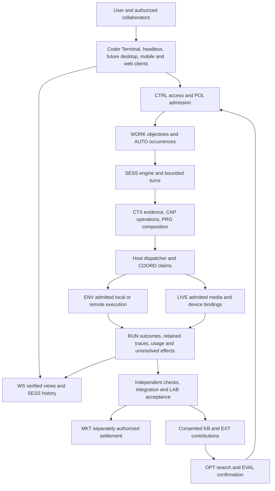

# Incorporating the teardown archive into Coder through Nostr

Status: design and specification plan, 2026-09-26. This pass adds six protocol
drafts and extends two existing specifications. It does not implement their
Rust validators, schedulers, clients, device drivers, or deployed services.

Coder should incorporate the archive's strongest architectural ideas as one
product: a durable coding engine, independently usable clients, inspectable
agent fleets, coherent workspaces, recoverable remote execution, governed
learning, and a market for accepted agent work. Nostr supplies interoperable
identity, discovery, authenticated commands, and attributable records. Hosts
enforce authority and effects; clients render the same verified state.

The useful network effect is concrete: one operator can publish a capability,
program, knowledge entry, measured improvement, or labor offering that another
operator can inspect and use without adopting the first operator's entire
application or backend. Contributions still need permission, usable artifacts,
supported bindings, and evidence that they help the recipient's workload.

## Source and method

The deletion was commit
[`dabc08102f`, “Nuke,” on September 18](https://github.com/OpenAgentsInc/openagents/commit/dabc08102fddd72118d710d644a69c5c4eab95a2).
Its parent,
[`8f84d05896`](https://github.com/OpenAgentsInc/openagents/tree/8f84d05896ef14edee491621bf977ee5315cc8ed/docs/teardowns),
contains **81 Markdown files totaling 4,077,845 bytes** under
`docs/teardowns/`, including its index and the seven-file `cc/` series.

The [file-by-file coverage ledger](../../protocol/2026-09-26-teardown-coverage.md)
accounts for all 81 files. The
[source inventory](../../protocol/teardown-source-inventory.json) pins each
path, byte count, and SHA-256 digest to that parent commit. Links open the
historical files at their original revision. The old directory is not restored
as current product documentation.

The review uses document structure, substantive architecture and failure
analysis, adaptation recommendations, and later addenda. The catalog index
helps locate sources; it does not replace individual teardown review. Sources
are compared with all existing OpenAgents NIPs, the then-pinned fifteen Block NIPs, and
the relevant pinned official specifications. No upstream lane is changed.

Historical prescriptions for Effect, TypeScript, Electron, Omega, a particular
cloud, or a private central service are historical design decisions. This plan
reimplements the useful behavior within the current Rust and Nostr direction.
It copies no private implementation, prompt, endpoint, or credential. Archive
observations are point-in-time evidence, not fresh claims about competitors.

## The missing contracts

The existing CAP/PRG/EXT/CJ/RUN/CTX/POL/COORD/EVAL/OPT/KB foundation already
covers much of the archive. CTRL adds task-scoped client access; MKT and LAB
add negotiated work and settlement. The remaining gaps are agreements that
independent clients or operators need in order to interoperate.

| Contract | Addition | Why the existing contract is insufficient |
| --- | --- | --- |
| [SESS](../../../nips/openagents/NIP-SESS.md) | Engine sessions, actual adapter capabilities, requested/effective configuration, durable input queues, turn control, pending interactions, and history lineage. | CJ carries bounded operations; CTRL grants scoped client rights. Neither defines a persistent engine session or whether a native adapter can steer, fork, resume, or answer a reverse request. |
| [WS](../../../nips/openagents/NIP-WS.md) | Workspace/resource identity, versioned documents, conditional mutations, worktrees, checkpoints, and reusable snapshot/delta views. | A repository announcement is not a checkout; a read marker is not a synchronized operational view; a live stream is not complete history. |
| [WORK](../../../nips/openagents/NIP-WORK.md) | Durable planning objects, relationships, accountable ownership, delegation links, activity, and external-system provenance. | A tracked objective can outlive many sessions and runs. COORD claims execution resources; it is not an issue/project/initiative system. |
| [AUTO](../../../nips/openagents/NIP-AUTO.md) | Admitted schedules, external triggers, bounded recurring work, restart-safe occurrence identity, and objective continuation. | COORD's initial background triggers describe derived work inside a task. ER reminds a user; PL wakes a client. Neither authorizes recurring execution. |
| [ENV](../../../nips/openagents/NIP-ENV.md) | Allocation requests, leases, realization, exact materialization, runtime attachment, cleanup, and uncertain resource accounting. | CAP advertises a possible operation. Presence, a cloud VM label, or a claimed free slot does not reserve capacity or prove isolation. |
| [LIVE](../../../nips/openagents/NIP-LIVE.md) | Voice/media session admission, scoped tracks and recipients, floor control, capture evidence, transcript corrections, media anchors, and device input. | A room, a recognized voice, a screenshot, or a Nostr presence event cannot grant task control, capture, recording, or actuation. |
| [POL extension](../../../nips/openagents/NIP-POL.md#learned-preferences-and-governed-activation) | Evidence-backed private preference candidates, reviewed activation, generation changes, application records, and withdrawal. | Binding preferences and mutable memory do not specify consent to learn from private history or how a learned rule becomes optional guidance. |
| [EXT extension](../../../nips/openagents/NIP-EXT.md#foreign-formats-and-compatible-host-components) | Loss-accounted foreign-format imports and exact compatible host component sets. | Installing a package is distinct from upgrading the engine, adapter, helper, client, or guest image as a compatible, recoverable set. |

These additions allocate **no new event kinds**. They use private `3188`
artifacts, admitted CAP operations over CJ execution, and RUN evidence. New
schemas and roles still require implementation and conformance tests. A relay
that can retain an envelope cannot advertise the host behavior inside it.

## One architecture across the product

Nostr is the shared control and evidence substrate around these relationships.
It does not require a relay round trip for every local function call or
terminal redraw. The same admitted artifacts can stay local. Live media,
large blobs, Git objects, and native engine streams use their supported
transports with exact identity and admission; their control and evidence remain
interoperable through Nostr. Local execution does not need a central vendor's
session database. Remote use needs an explicit retention and availability
agreement, not an assumption that every relay stores everything forever.

## Carry the useful ideas into the right layer

| Archive idea | Coder adaptation | Owner and evidence |
| --- | --- | --- |
| One engine with several clients | Interactive, headless, attached, and remote paths use the same admission and turn state machine. Detaching a view does not kill work. | SESS host; prove two clients observe and control one task without creating two executors. |
| Native harness adapters and emulation | Pin the actual adapter, engine build, protocol, model, settings, and declared feature semantics. Unsupported requests refuse. | CAP/SESS/EXT; test real adapter capabilities and reverse requests rather than only generated types. |
| Durable queue, steering, interruption | Persist input before acknowledgment; preserve user-selected semantics; bind steering to a live turn; reconcile stop before unsafe next work. | SESS/RUN; inject crashes and lost acknowledgments at every transition. |
| A complete agent fleet | Register child identity before launch, preserve causal parent edges, expose independent transcripts, and retain orphan/gap nodes. | SESS/COORD/CTX; compare retained children against linked plus explicit unknown children. |
| Safe fan-out and missions | Claims, independent snapshots, shared reservations, explicit child limits, retained findings, and separate integration. | COORD/ENV/EVAL; successful children cannot accept the parent's work. |
| Shared work beyond chats | Issues, plans, dependencies, projects, and initiatives remain stable while sessions and delegates change. | WORK; execution, verification, disposition, and commercial acceptance stay distinct. |
| Mobile and web as real controllers | Pair once under scoped rights; use the same typed operations and projections; keep credentials at the host. | CTRL/SESS/WS; verify sleep, revoke, reconnect, and queued-input behavior on real devices. |
| Fast recent-work discovery | Small authorized catalogs load before transcripts; bounded pagination has explicit continuation and no hidden age cutoff. | WS view definitions plus client performance work. |
| Consistent replicated views | Retained cuts, source frontiers, bounded pages, atomic deltas, gap repair, and command-visibility evidence. | WS; never advance a cursor past state the projector has actually applied. |
| Coherent editor and project services | Files, unsaved content, search, diagnostics, diffs, Git, terminals, previews, and agents share resource identity and version semantics. | WS adapters and clients; old ranges cannot mutate a changed document. |
| Multi-human work | Authenticated people propose, review, comment, and steer under separate rights. One admitted authority serializes effects. | WORK/CTRL/WS/POL; membership and shared cursors grant no shell, merge, or payment rights. |
| Checkpoints and rewind | Capture explicit coverage; preflight restoration; retain a safety checkpoint; record partial application and irreversible effects. | WS/RUN; no claim that rewinding files undoes a message or payment. |
| Portable execution | Resolve a materialization and compatible engine attachment, fence the old controller, and obtain fresh destination authority. | ENV/SESS/RUN; do not copy live credentials or silently fork native execution. |
| Leased sandboxes and cloud workers | Reserve before provisioning; record actual isolation and recipients; reconcile cleanup and unknown cost. | ENV/CAP; names, TTL expiry, and heartbeats are not deletion or billing evidence. |
| Authored tools and code as orchestration | Reimplement as pinned PRG/plugin/operation artifacts with one dispatcher for nested effects. | CAP/PRG/EXT; no host credentials, ambient network, or second approval path inside a guest. |
| Progressive catalogs | Mechanical permission filtering before optional semantic ranking; exact schema and description pins at invocation. | CAP/EXT/CTX; measure task outcome and discovery cost, not just catalog size. |
| Context management and compaction | Keep originals, summaries, exclusions, source versions, and expansion paths separate; preserve mandatory instructions. | CTX/POL; tune retrieval, cache layout, and compression in measured host implementations. |
| Memory, taste, and correction learning | Separate explicit instructions, learned preferences, reusable knowledge, history, and presentation state. | POL/KB/CTX/OPT; private mining and activation are separately admitted. |
| Knowledge graphs and graph retrieval | Preserve provenance and relation types; evaluate retrieval against alternatives under identical disclosure and cost rules. | CTX evidence graphs, KB and EVAL; graph structure alone is not truth or a demonstrated advantage. |
| Durable goals, schedules, and source watches | Persist finite occurrence identity, current objective, aggregate limits, cancellation, and restart behavior. | AUTO/WORK/RUN; a reminder or source update is not execution permission. |
| Fast Follow research | Watch pinned sources, retain observed changes, propose bounded work and measured candidates, then obtain separate adoption. | AUTO/WORK/CTX/OPT/EXT; monitoring never silently deploys an update. |
| Voice, meetings, and computer use | Admit exact sources/participants/recipients; retain capture and transcript provenance; bind device input to fresh observations. | LIVE/POL; listening, recording, speaking, and acting are different permissions. |
| Local and distributed inference | Admit actual participants, exact model/runtime configuration and disclosure; route only among eligible bindings. | CAP/ENV/POL; gossip is discovery, and a capability label is not proof of quality or free capacity. |
| Reusable packages and updates | Import inertly with explicit losses; pin a complete compatible component set; stage, drain, verify, and recover. | EXT/SESS/ENV; no moving marketplace branch or signed-but-unverified platform claim. |
| Work evidence linked to Git | Bind retained sessions/checkpoints and changes to exact commit/artifact identities while keeping private traces separately scoped. | RUN/CTX/WS plus official NIP-34 and Block GS; Git is not the default private prompt store. |
| Agent labor and provider economics | Negotiate exact deliverables, bounded execution, independent checks, acceptance, disputes, and payment evidence. | MKT/LAB/WORK; payment, completion, and repository issue status cannot substitute for one another. |
| Product measurements and optimization | Attribute full outcomes, failures, costs, timing, configuration, uncertainty, and confirmation access. | EVAL/OPT; include failed attempts and new coordination overhead in comparisons. |

## Local product work remains necessary

The archive's presentation ideas are substantial: quiet composers, clear
Send/Queue/Steer/Stop states, answerable questions, recoverable drafts,
progressive tool rows, complete fleet navigation, good Markdown and diffs,
fast cold start, keyboard and pointer parity, stable scrolling, accessibility,
and useful phone/tablet layouts. Carry them into Coder's shared terminal
design system and future native clients. Protocol data makes them possible;
adding a NIP does not render them.

Use pure shared derivations for ordering, attention, status, and omissions.
Keep geometry, animation, row caching, terminal escape handling, theme tokens,
LSP adapters, editor algorithms, and platform packaging in the appropriate
Rust consumer. A rich renderer must not acquire arbitrary execution because
it can display a tool result. Unknown tool/item variants have a safe textual
fallback and an inspectable record, not a disappearing row.

The first WS edit profile uses conditional writes under an authoritative
source. Human and agent participants can propose changes through it. A
particular CRDT/OT editor or collaborative buffer algorithm needs its own
pinned source adapter and consistency evidence before claiming interoperable
editing. Nostr group membership alone supplies neither the algorithm nor edit
authority. This is an explicit implementation/profile boundary, not a reason
to drop collaborative work from the product.

The same rule applies to distributed inference partitioning, media codecs,
physical-device interlocks, and financial instruments. Reuse their control,
identity, evidence, and admission contracts; choose and verify concrete
implementations before making stronger guarantees.

## Network effects without losing evidence or control

Five contribution paths share the same foundation:

1. **Operations and programs:** publish exact EXT artifacts and CAP interfaces;
   another host supplies its own admitted binding and grants.
2. **Knowledge and preferences:** share consented KB entries with provenance;
   keep private preference activation under the receiving owner's POL policy.
3. **Measured implementations:** use OPT to propose bounded changes and EVAL
   to test transfer beyond their source tasks before adoption.
4. **Workers and inference:** discover eligible capabilities; admit actual
   ENV participants, recipients, reservations, and runtime identities.
5. **Agent labor:** WORK describes the objective; MKT/LAB bind buyer/provider
   terms, delivery, acceptance, and independently confirmed settlement.

A provider can compete on one component rather than replace all of Coder.
A failed contribution remains measurable. An operator can switch clients or
relays while retaining signed evidence and its own authority decisions.
These are mechanisms that can support network effects; their economic and
quality benefits must be measured. More participants or a valid signature do
not automatically improve completion rates.

No labor payment grants data resale, training, or public trace rights. A
contribution's author, publisher, evaluator, execution provider, buyer, and
payout recipient can be different parties with different claims. Attribution
and payout formulas must not be inferred from a dependency graph or a single
self-published score. General royalties, credit, swaps, and speculative
liquidity are not prerequisites for this plan's agent-labor market.

## Implementation sequence and completion evidence

The [protocol workstreams](../../protocol/implementation-plan.md) track the
owning contracts. The following local planning IDs are not filed GitHub issues.
Build one narrow end-to-end slice at a time; do not start six unrelated product
rebuilds or delay the working Microluna/Microcoder evaluation loop until every
client and protocol is finished.

| Order | Slice | Required completion evidence |
| --- | --- | --- |
| `TD-1` | Strict schemas and cross-record validation for one SESS/WS/WORK path, plus private artifact access. | Negative fixtures for mismatched signatures, subjects, revisions, references, scopes, unknown features, and every read/count/fanout surface. No role advertises unsupported behavior. |
| `TD-2` | One durable local session with two clients, one real engine adapter, and native retained evidence. | Submit/queue/steer/interrupt have distinct outcomes; process and client restarts retain history, queued input, pending questions, usage, and unknown effects without duplicate dispatch. |
| `TD-3` | Work objective, versioned repository workspace, patch proposal, independent check, and deliberate integration. | One tracked work item links exact frame, run, candidate, checks, integration receipt, and retained transcript. A stale base or failed check cannot become accepted work through UI state. |
| `TD-4` | Read-only replicated catalogs/history and complete child navigation, then conditional workspace writes. | Disconnect and resume across two relay operators; cold catalogs, snapshot races, lost deltas, lagging projections, orphan children, and revoked readers remain truthful. Measure cold-start and interaction latency. |
| `TD-5` | One local and one remote ENV realization, bounded child fan-out, and controller transfer. | Exact source/materialization identity, effective containment, shared limits, stale-worker fences, native session compatibility, and unknown cleanup/cost survive host failure. |
| `TD-6` | One AUTO schedule and one admitted source-watch/goal loop over WORK. | Duplicate events, downtime, pause, cancel, changed objective, budget exhaustion, and lost acknowledgments produce one accounted occurrence or explicit missed/unknown state. No paid unbounded catch-up. |
| `TD-7` | One consented preference-learning job and one KB/EXT contribution with measured adoption. | Current user corrections override guidance; source withdrawal prevents future application; independent held-out results include total learning, review, and execution cost. |
| `TD-8` | One voice/capture session, then separately admitted device input. | Exact participants/recipients, recording consent, stop/reconnect behavior, transcript gaps, stale geometry, response ambiguity, and complete usage are retained. Physical-device claims require additional binding-specific proof. |
| `TD-9` | Two independent operators perform useful agent labor and settle separately. | Start with a no-spend rehearsal. Then test the payment rail independently before authorized live settlement. Report accepted work, total buyer cost, provider earnings, subsidies, failures, unknowns, and repeat demand. |

Agent labor remains a high priority. Its initial bounded delivery flow can
proceed with the existing MKT/LAB contracts alongside `TD-1` through `TD-3`;
it need not wait for a mobile workbench, ambient capture, or a complete editor.
Likewise, a useful local agent need not publish every intermediate record.

## Evaluation and limits on claims

Retain full native evidence where authorized, exact adapter and component
identities, total model/tool/coordination costs, wall time, retries, failures,
unknown outcomes, and acceptance evidence. Keep retained bytes and public
redacted projections distinct. Unknown cost is never zero. A countersigned
receipt is an attributable claim by another observer, not universal attestation.

Measure at three levels: protocol correctness under faults, real product
journeys across clients/hosts, and task quality/efficiency under matched
configurations. Use the existing Gym/Terminal-Bench discipline and independent
confirmation to decide whether new coordination, memory, or tool selection
improves Coder. Native versus emulated harness behavior, changed model
settings, task contamination, and missing evidence must remain visible.

The acceptance bar is one useful job that survives disconnection, transfers
only with enforceable fencing, preserves every relevant source and outcome,
and can be inspected by another independently implemented client. Repeated
measured wins and successful outside contributions can then justify broader
claims. The specification set itself establishes none of those results.
