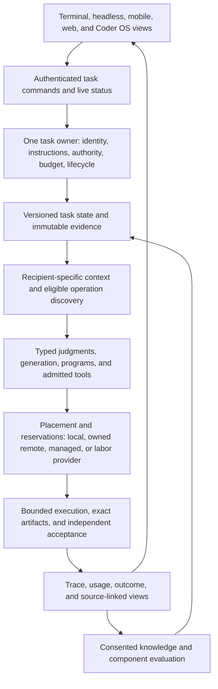

# Applying the TypeSafe design across the Coder suite

Status: delivery plan, 2026-09-26. This document connects the complete
[TypeSafe proposal](thoughts-on-a-typesafe-coding-agent.md), including its
three appendices, to the [networked Coder plan](networked-coder-plan.md).
It also incorporates episodes 275–281, linked individually below. The
proposal supplies mechanisms; the episodes supply the product they serve.
The [protocol coverage table](typesafe-agent-protocol-addendum.md#recommendation-by-recommendation-coverage)
remains the detailed mapping from each source insight to a NIP and host
responsibility. This plan adds delivery order and tests of user value.

**Coder is one coding product across several interfaces and execution
locations.** Terminal-first describes the first delivered interface.
It does not limit Coder to a terminal, a single computer, or a particular
model. The shared runtime must make useful work available from terminal,
headless integrations, mobile, web, and an opinionated computer environment.
Agent labor remains a high-priority parallel track: the same product can
hire an outside agent or let its operator offer bounded work.

The design commitment is to implement and evaluate every opportunity below,
not to enable every feature or insert a Jev call into every operation.
Retain negative findings. A feature earns its default setting through useful
work, complete cost, and measured reliability.

## Product scope and current implementation

| Product responsibility | What this repository has | What the suite still needs |
| --- | --- | --- |
| Terminal and automated coding | Terminal and headless modes share `coder::turn::run`; the delegate door, traces, and execution boundary are implemented. | An explicit, durable task model usable by every client, with richer context and operation selection. |
| Inspecting work | Gym supports traces, head-to-head replay, Jev views, and cited run questions. | The same evidence and task status accessible from other clients, including selected and omitted context. |
| Own and remote computers | Bounded worker execution, tracker intake, project supervision, resource reservations, and result verification exist. | Fleet-wide placement, transfer, recovery, and resource enforcement where supported. Local CPU/memory accounting alone is not containment. |
| Mobile and web | The archive demonstrates earlier Android/iOS clients. They are not current product clients in this workspace. | Thin clients that observe, steer, approve, and cancel the same host-owned task. |
| Coder Cloud and access plans | Gateway accounts, dashboard, and billing serve the decision service. They do not establish a deployed Coder Cloud product. | Optional managed workers and sync, with measured capacity, support costs, and access entitlements. |
| Coder OS and device control | Host execution primitives exist; the archive's Coder OS distribution is not present here. | Reproducible environment setup and admitted browser, desktop, and connected-device capabilities around the same runtime. |
| Agent labor | Execution and evidence components exist; a complete commercial order and Bitcoin payout path does not. | Buyer/provider views, accepted terms, isolation, recovery, acceptance, and settlement, as defined in the [labor plan](../../agents/market-infrastructure.md). |
| Network contributions | Local knowledge retrieval and NIP-KB sharing work; programs and the bounded Wasm host have partial implementations. | Measured transfer, package discovery/adoption, scoped skills, and contributor agreements. |

Current implementation references: [delegate execution](../runtime/delegate-door.md),
[traces and their limits](../runtime/traces.md),
[worker execution](../guides/worker-executor.md),
[project supervision](../guides/project-supervision.md), and
[plugin implementation status](../../extensions/plugins.md).
Each Coder invocation currently owns its trace session; saved traces do not
provide cross-process task resume. An ephemeral relay conversation also does
not provide durable cross-device control. These are gaps to build and test.
[NIP-CTRL](../../../nips/openagents/NIP-CTRL.md) now defines the device-control
contract; [NIP-MKT](../../../nips/openagents/NIP-MKT.md) and
[NIP-LAB](../../../nips/openagents/NIP-LAB.md) define negotiated labor.
All three are drafts awaiting runtime implementation.

### What episodes 275–281 add

| Episode | Product requirement carried forward |
| --- | --- |
| [275: all-in-one Coder](../../transcripts/275.md) | One entry point for models, local or rented computers, work tracking, memory, extensions, and earning. Keep useful defaults and optional advanced configuration. |
| [276: Coder Cloud](../../transcripts/276.md) | Hosted concurrent agents complement terminal and mobile access. Account for capacity and the complete cost of hosted work. |
| [277: accessible onboarding](../../transcripts/277.md) | Make it quick to reach a useful prompt, show actual commands, and support both accessible entry and powerful workflows. Measure onboarding completion and sponsorship cost. |
| [278: delegation](../../transcripts/278.md) | Stay neutral across providers. Support explicit delegation and independent parallel work without a redundant investigation before dispatch. |
| [279: runtime architecture](../../transcripts/279.md) | Keep one execution owner, honest lifecycle states, stable child identities, bounded cancellation, retained task state, and optional sync. |
| [280: Coder OS](../../transcripts/280.md) | Reach applications and devices through an opinionated environment and reusable host capabilities. Browser actions need the same effect and authority records as shell actions. |
| [281: across devices](../../transcripts/281.md) | Continue one task across terminal, Android, and iOS; support trusted-device links and optional hosted sync; manage worktrees, builds, disk, and placement across machines. |

These episodes are historical product evidence, not shipping instructions.
Their model choices, prices, free subsidies, demo login shortcuts, and
permission settings are not current commitments. Reimplement useful designs
in this Rust workspace using public contracts; do not copy private sibling
code, leaked implementations, or prompts. Coder One, Microluna, and
Microcoder are components and development vehicles, not separate customer
brands that each need a competing product surface. The forge remains
deferred; episode 281 explicitly identifies that expansion as premature.

## One runtime, several views

The target structure is vertical because every interface reaches the same
task owner and every result returns through the same evidence path:

The durable task graph records parents, children, dependencies, observations,
pending effects, and integration state. ATIF remains the attributable trace;
a derived index makes that history searchable. Register a child before
dispatch so foreground waiting and background observation refer to the same
child. Preserve distinct completed, failed, cancelled, interrupted, and
unknown outcomes. A generated final answer cannot relabel an execution error.

A remote view controls the existing owner; it does not create a second agent
with another copy of the chat. Actual execution transfer additionally requires
an exact source/artifact manifest, a new admitted host, reconciled effects,
and fenced ownership. A reconnect or duplicate command must not repeat a
write. Do not synchronize credentials as conversation content.

Support local-only use, an explicitly paired trusted-device connection, and
opted-in hosted synchronization. Pairing and sync grant neither publication
nor training rights, and do not authorize a paid job. Represent observation,
steering, effect approval, administration, and spending as distinct powers.
Mobile users need visible working indicators, current commands, budget,
results, and complete transcripts just as terminal users do. Bounded live
previews must link to complete retained artifacts.

## Turn the complete TypeSafe proposal into runtime work

The following workstreams are implementation obligations. The existing
[analysis](typesafe-agent-analysis.md) explains the architecture, and the
[addendum](typesafe-agent-protocol-addendum.md) maps all individual source
recommendations to CTX, POL, CAP, PRG, EXT, COORD, RUN, EVAL, and OPT.
These runtime features do not depend on first building an optimizer.

### 1. Make context explicit and choose when to preserve the cache

Capture source once with revision, scope, freshness, and original spans.
Keep the task objective, corrections, mandatory instructions, unresolved
effects, and budget outside any one model conversation. Construct a separate
manifest for each operation and recipient: include the original, a long or
short representation, or an explicit omission with an expansion path.
Select related evidence together when separating it would lose a dependency.
Evaluate retrieval recall separately from selection recall: ranking cannot
recover evidence that the candidate search never found.

Treat the source's “no KV cache” thought experiment as permission to explore
new context structures, not a requirement to discard a useful cache. Choose
among reuse, trim, rebuild, and model switch using observed cached and
uncached input, expected remaining work, and the cost of returning to a
stronger model. A stable mandatory prefix can coexist with dynamic evidence.
Include selection, summarization, expansion, failed detours, and cache rebuilds
in whole-task time and cost. Do not reuse the source's illustrative prices as
current rates.

Acceptance: mandatory-rule preservation, source coverage, unsupported claims,
context reconstruction, and complete task success at a measured cost. Expose
quality, time, and spend preferences as understandable controls with shared
ceilings. Do not make users tune raw relevance probabilities.

### 2. Search history and reuse explicit intermediate state

Build task/topic indexes over retained history, with source references from
summary nodes to original records. Use bounded traversal with alternative
branches and deeper expansion when evidence is insufficient. Appendix 3 warns
that cheaper per-message scoring still scans a growing history. Measure
recall, maintenance, and latency as history grows; do not promise logarithmic
retrieval of useful evidence. Check access before searching other tasks or
other agents' history.

Apply the recursive language model (RLM) idea by keeping typed intermediate
values, evidence references, and reusable computations outside a prompt.
Programs can request bounded
investigation or expansion rather than replay everything. Any generated
context-processing code remains an admitted operation; it does not gain the
host's credentials or unrestricted execution. Bound recursion, children,
tool calls, and total spend. Revalidate stale values before use. This extends
the current typed program bindings; the full shared context system is a target.

Acceptance: fewer repeated reads and replayed tokens without forgotten user
corrections, lost obligations, stale reuse, or duplicate effects on restart.
Preserve observed reasoning only when an executor actually supplies it; do not
invent missing internal reasoning to make a history look complete.

### 3. Discover a small useful tool set and load its manual

Maintain an inert catalog of capability and operation descriptors. Filter
eligibility mechanically, retrieve a bounded candidate set, optionally use
typed ranking with a `none` outcome, and then load exact schemas and relevant
manual sections. Known program steps remain host-driven. For an open-ended
task, generation may propose an action using this small admitted tool set;
the host validates its arguments and actual effects. The design does not
require either a permanently loaded giant toolbox or a ban on native tools.

Apply the same flow to MCP servers, skills, and installed packages. Discovery
and installation do not activate code. Native integration can manage context,
scheduling, and evidence in ways an external-client plugin cannot; keep both
distribution paths, with their different capabilities explicit.

Evaluate the appendix's tools as adapter candidates: headroom/rtk-style output
compression, AST queries and outlines, repository exploration, and persistent
fuzzy indexes. Check licensing and supported interfaces before adopting an
external tool. Preserve original output and a safe expansion path. Pin indexes
to source state, invalidate them on edits, and test watcher failures. For an
unfamiliar query language, load its manual, generate a bounded set of query
candidates, and validate them before running useful candidates.

Acceptance: useful-tool recall, false activation, invalid arguments, search
recall, stale results, and task outcomes as the catalog grows. Count index
maintenance and manual loading. The three current evidence guests are off by
default and still need measured benefit; a built adapter is not a proven win.

### 4. Preserve scoped instructions, skills, and authority

Resolve mandatory root and subtree instructions by canonical path and stated
precedence before semantic relevance selection. Keep those obligations across
context rebuilds and handoffs. Rank optional guidance separately. A structured
skill names its pinned content, activation scope, permitted hooks, expiry,
resource bounds, and cleanup behavior. Test cancellation, reentrancy, and
unloading so one task's hook does not silently affect the next task.

Semantic command review should inspect the referenced script or file, not
only a benign-looking command name. Bind any approval to the relevant bytes,
interpreter, arguments, working scope, and preconditions. Changed inputs
invalidate that approval; the execution path must enforce the binding rather
than trust an earlier description. The existing execution boundary and permit
remain authoritative. A model's confidence cannot widen them.

Apply recipient and data policy before sending content to a selector,
embedding service, executor, reviewer, fallback model, or log sink. Anticipating
which files an agent might read is not confinement. Future network/read
restrictions need actual enforcement and truthful unsupported outcomes.
Acceptance includes mandatory-rule loss, stale hooks, changed-script refusal,
disclosure violations, and unnecessary interruption burden.

### 5. Make parallel work save time after all costs

Share immutable read results where scopes permit. Give each independent
writer an admitted workspace and conflict scope, and integrate its exact
artifact deliberately. Coalesce work only when source, operation, authority,
and acceptance identities permit reuse; semantic similarity can suggest reuse
but cannot merge two independently required attempts. Preserve independent
benchmark repetitions even when their prompts are identical.

Episode 281 shows why worktrees alone are insufficient: simultaneous builds
can exhaust disk and overload the computer. Add build slots, disk reservations,
retention rules, and placement decisions across owned and rented workers.
Respect separate Cargo target directories per worktree under the repository
contract; compare compiler caching and persistent workspaces through their
actual hit rates. Do not serialize unrelated writers just because another
task is active. Claims, leases, and recovery need enforcement at the resource
owner, not merely announcements on a relay.

Acceptance: accepted task throughput, foreground latency, queue time, memory
and disk peaks, collisions, duplicate work, integration failures, and full
cost. Explicit delegation should dispatch promptly after necessary admission;
measure briefing time separately and remove redundant preparation.

### 6. Use shared evidence for background help and review

Build optional progress pages, plain-language explanations, quizzes, and small
interactive explanations from revision-bound evidence already captured for
the coding task. The source's screenshots are examples of richer views, not
a requirement to publish every task as a website. Local rendering and external
publication are different operations. A relevance heatmap explains selected
and omitted spans; label it as a judgment, not internal model attention.

Run read-only background work at lower priority with an explicit allowance.
Share expensive preparation, preserve each consumer's disclosure scope, and
cancel or revalidate stale findings. A cross-model reviewer receives the
exact artifact and allowed sources; retain disagreement and measure false
rejection as well as discovered errors. Background code changes require their
own task admission, write scope, and integration.

Generated evals are candidates for independent review. Freeze accepted tests
and partitions before study; shadow traffic needs explicit data rights and
budget. A background judge cannot silently change an active task, promote a
candidate, publish a trace, or train on private work.

Acceptance: incremental cost, foreground slowdown, useful findings, stale or
unsupported explanations, correction time, and user ability to understand
the result. Novel displays alone do not establish a better coding agent.

## Use TypeSafe as a measured programming primitive

Separate supplied facts from the judgments asked about them. Batch independent
questions over the same allowed state, including speculative questions whose
answers code can ignore. If a question requires a newly retrieved fact or a
previous answer as input, construct a later request. These are the live
TypeSafe [state](https://docs.typesafe.ai/concepts/state) and
[fan-out](https://docs.typesafe.ai/patterns/fan-out) contracts, checked
2026-09-26; the performance benefit still needs measurement in Coder.

Keep the operation's meaning stable while comparing deterministic retrieval,
Jev, another compatible decision implementation, generation, and bounded
combinations. Retain refusal, unknown, model and question-set identity, and
policy identity. Calibrate thresholds on the actual task family. A Noul near
0.5 expresses uncertainty, not medium intensity; a concentrated Choice is
not proof. Permissions and verified outcomes remain host decisions supported
by their actual evidence.

Appendix 1's input-token table motivates measurement, not a new claim about
Coder. Record files, search, diagnostics, schemas, instructions, generation,
and explanations. Report replay amplification separately rather than counting
the same input twice. Preserve missing usage and prices as unknown. Compare
complete successful and failed tasks, including review and background spend.

## Delivery sequence and release tests

These are planned milestones, not newly filed issues or claims of completed
implementation. Open bounded implementation issues before starting each
slice. Keep the existing [optimization backlog](../../optimization/proposed-issues.md)
for policy search; its DSPy/GEPA dependencies do not block deterministic host
features or manual, frozen on/off evaluation.

| Milestone | Concrete slice | Required evidence |
| --- | --- | --- |
| TS-1: one observable task | Task identity, honest lifecycle, mandatory task frame, source captures, context manifest, and source expansion through terminal/headless. | The same task has attributable actions, costs, constraints, and outcomes; restart reconciles uncertain effects. Start with a simple deterministic selector. |
| TS-2: economical evidence and tools | Compare cache reuse/rebuild, hierarchical history, typed intermediate state, lazy schemas/manuals, structural search, scoped guidance, and skill cleanup one change at a time. | Improved whole-task quality, time, or cost at a declared quality floor; no lost rules or disclosure regressions; retention of no-win results. |
| TS-3: one task across devices | Pair a read-only client first, then add authenticated steering, approval, and cancellation; extend to mobile/web and optional hosted sync. | Start on desktop, inspect and steer from another device, finish once. Reconnect, duplicated commands, ownership loss, and cancellation have retained tests. |
| TS-4: useful concurrency and views | Native children, resource-aware placement, shared reads, independent writers, safe deduplication, and optional background explanations/reviews. | Higher accepted throughput after preparation and integration costs, bounded resource use, readable complete evidence, and no duplicate writes. |
| TS-5: interoperable contributions | Package useful operations and measured policies; evaluate unseen tasks and another operator; publish consented EVAL/KB/EXT evidence. | A second consumer reproduces the benefit, can reject or withdraw it, and observes the same grants and result semantics. |

TS-1's task identity and recovery also serve the first labor order. Do not
make paid bounded work wait for all mobile clients, background displays,
automatic optimization, or benchmark leadership. Conversely, infrastructure
progress does not establish a better-model or cheaper-agent claim. The
[networked plan's evidence gates](networked-coder-plan.md#delivery-order-and-gates)
still govern those claims.

Terminal-Bench remains one evaluation surface. Add suite scenarios for
desktop-to-phone continuation, cross-client cancellation, disconnected-device
recovery, independent local/remote writers without build storms, a bounded
autopilot goal over recent commits/issues, and a buyer accepting an outside
provider's result. Use the same task identities, traces, costs, artifacts,
and acceptance records in every interface. Measure time to accepted work and
human intervention, not only model response speed.
