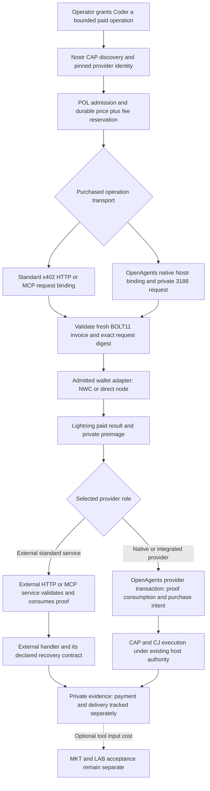

# Integrating x402 Lightning with Nostr and Coder

Reviewed September 26, 2026. **Adopt the merged x402 Lightning method for paid
operations, with Nostr providing discovery, identity, scoped authority, and
private retained evidence.** Implement standard HTTP first, MCP next, and an
explicit native Nostr profile when both endpoints can enforce it. Keep agent
labor paid after acceptance as a separate contract.

The new [NIP-X402](../../../nips/openagents/NIP-X402.md) specifies these
boundaries, a required CAP feature, native private purchase records, and recovery.
It allocates no kinds. It is a **Designed** draft; this change does not create a
wallet adapter, facilitator, paid endpoint, or deployed payment service.

## What merged, and what was inspected

[PR #2861](https://github.com/x402-foundation/x402/pull/2861) merged on
September 23 at
[`6fe0d4bfd104e8c61ae0b6aeaefe9da506d502ff`](https://github.com/x402-foundation/x402/commit/6fe0d4bfd104e8c61ae0b6aeaefe9da506d502ff).
Its old title mentions BIP-122, but the final specification is
[`scheme_exact_lnbtc.md`](https://github.com/x402-foundation/x402/blob/4fcf836cc393174130e1358577ce5d37356da1c3/specs/schemes/exact/scheme_exact_lnbtc.md).
Follow that final text, not the earlier comments proposing different units,
request bindings, or network names.

The repository was cloned to `~/work/x402`. Its reviewed main revision is
`4fcf836cc393174130e1358577ce5d37356da1c3` (September 25). PR head
`276e7cdce1620142139bf1aa6995fdad6a76cd88` is retained locally as
`refs/remotes/origin/review-pr-2861`. The 760-line Lightning specification is
byte-identical at both revisions; SHA-256 is
`20711e1556930cb8e8f48ad471491f3f6c912ea78e688cc814da9d24b7f9d56b`.
The clone remains reference material outside OpenAgents; no upstream source
was copied into our product or executed as a payment client.

The review covers the full Lightning specification, x402 core v2, exact-family
rules, HTTP and MCP transports, payment identifiers, signed offers/receipts,
SIWX, and corresponding TypeScript, Go, and Python entry points. It also
covers our shared/CAP/POL/CJ/RUN/MKT/LAB contracts, Nostr wallet and invoice
primitives, and the official payment NIPs. External NWC extensions were
reviewed at
[`26c1830ca4c38be1d60b63a3f549f9aecf42bb83`](https://github.com/nostr-wallet-connect/nwc/tree/26c1830ca4c38be1d60b63a3f549f9aecf42bb83).
Those extensions are not in our vendored NIP-47 core and are not implemented
merely because this review references them.

The alternative [PR #1311](https://github.com/x402-foundation/x402/pull/1311)
closed unmerged September 24 in favor of #2861. Its invoice-only proof and
receiver-node lookup are different mechanics. A wallet that cannot return a
preimage cannot use the merged method by falling back to that draft silently.

## The payment contract in plain terms

1. A service quotes the exact operation and returns a fresh Lightning invoice.
   The invoice's signed description hash commits to the request.
2. Coder checks the actual intended request, invoice, receiver, price, and
   host spending grant. Its admitted wallet pays and returns a preimage.
3. The service/facilitator validates that proof and atomically records it as
   consumed. This settle step moves no money: Lightning already did that.
4. Only then does the service perform the operation. Payment and delivery can
   succeed or fail independently; a failed paid operation has no automatic refund.

The final method is x402 v2, `exact`, `BTC`, `bolt11`, explicit `upfront`.
Mainnet is `lnbtc:000000000019d6689c085ae165831e93`; testnet is
`lnbtc:000000000933ea01ad0ee984209779ba`. Amounts are decimal integer strings
in **millisatoshis**: 21 sats is `"21000"`. No `bip122:` alias, regtest,
BOLT12, keysend, Cashu, or on-chain transfer is implied.

The invoice signer must equal the compressed Lightning `payTo` key. That key
needs exclusive invoice-issuance control for the service: untrusted customers
sharing an invoice-signing custodial key could otherwise create their own
proofs. A Nostr identity declaration does not establish that operational
property. Payer and receiver roles need separate configured adapters.

The proof checks invoice face value, not actual total received or routing
fees. The receiver knows the preimage too; seller-published proof is not
independent revenue evidence. Retain the payer wallet observation, provider
consumption, fees, and actual delivery separately. Upstream requires `payer`
to be omitted from the settlement response; a Nostr buyer is application
identity, not a Lightning-derived payer address.

## How the systems fit

The atomic purchase/intent transaction is the recommended first provider
implementation, and a requirement of the embedded native role. A third-party
HTTP provider might supply a weaker recovery contract. Coder must expose and
admit that distinction before payment; it cannot manufacture atomicity in a
remote service by wrapping it in Nostr.

| Layer | Responsibility | What it does not establish |
| --- | --- | --- |
| x402 | Payment requirements, transport binding, proof, single-use consumption. | Wallet permission, delivery, labor acceptance, refunds. |
| CAP/EXT | Signed interface, exact adapter/version, service and receiver associations. | A usable wallet, private access, spending permission. |
| POL and payment host | Per-purchase and aggregate budget, recipient/account, fee enforcement, disclosure. | Provider quality or guaranteed delivery. |
| NIP-47 | Optional encrypted wallet RPC under separate connection authority. | A durable payment ledger or universally enforced fee cap. |
| NIP-01/42/44 and private 3188 | Authenticated private records and retained provenance. | Atomic consumption, current host grants, or exact-once external effects. |
| CJ/RUN | Admitted operation, attempt identity, recovery, output and unknown outcomes. | An invoice is paid or purchased work meets a labor contract. |
| MKT/LAB | Negotiated labor, acceptance, earned-price obligation, its own settlement. | Prepayment for a tool means the buyer accepted the final work. |

## Why a new NIP is appropriate

The missing contract is narrow: how a Nostr-discovered operation identifies
its x402 payment method, how a host authorizes and records it, and how the
native flow binds a paid proof to a stable signed operation without duplicating
charges or work. None of the existing NIPs supplies those combined meanings.

NIP-X402 reuses CAP `30180` with an explicitly required feature and private
`3188` artifacts. It does not borrow a new public kind or extend the existing
MKT payment-profile allowlist. An unsupported feature must refuse rather than
be interpreted as inert metadata. Native provider identity and operation
bytes are committed before issuing an invoice, so the binding has no circular
dependency on a future payment claim or CJ event ID.

There are two compatibility levels:

- **Standard bridge:** Nostr discovers a service, but x402 HTTP/MCP wire and
  binding stay unchanged. This can interoperate with independently implemented
  conforming services; actual interoperability still needs testing.
- **Native extension:** `nostr:openagents:1` commits to buyer, provider,
  purchase nonce, and the complete immutable request-artifact digest. It uses
  x402 core payment types inside private Nostr records. An unextended conforming
  facilitator must reject that unknown profile. The reviewed upstream SDKs
  do not yet implement the Lightning mechanism itself.

No universal Nostr/x402 transport is claimed. The native draft can be proposed
upstream later with vectors and two independent implementations. Do not depend
on upstream registration to build the interoperable HTTP path.

## Zaps and the other Lightning NIPs

| Source | Reuse | Important difference |
| --- | --- | --- |
| [47: NWC](../../../nips/official/47.md) | `pay_invoice` preimage, invoice creation, lookup, encrypted wallet identity. | Pure RPC formats do not enforce all fees, grant semantics, or recovery. |
| [57: zaps](../../../nips/official/57.md) | Independent voluntary tips and social receipts. | Zap invoice `h` commits to the signed zap request; x402 `h` commits to the purchased operation. The same invoice cannot satisfy both different digests. |
| [A3: payment targets](../../../nips/official/A3.md) | Discover addresses or payment destinations. | No bound invoice, settled amount, receiver isolation, or wallet authority. |
| [98: HTTP auth](../../../nips/official/98.md) | Prove a Nostr principal to an HTTP service. | Its changing Authorization event interacts with exact HTTP request binding; authentication does not pay. |
| [90: data vending](../../../nips/official/90.md) | A separate job/payment-required compatibility vocabulary. | Its flexible lifecycle is not x402 consumption or CJ/RUN recovery. |
| [15](../../../nips/official/15.md) and [99](../../../nips/official/99.md) | Human-visible shop and service listings. | Mutable price/payment hints are not an accepted operation or paid proof. |
| [60](../../../nips/official/60.md), [61](../../../nips/official/61.md), and [87](../../../nips/official/87.md) | Separate Cashu/Fedimint wallet and discovery roles. | Different proof and mint/custody trust; not a BOLT11 fallback. |
| [69](../../../nips/official/69.md) and [75](../../../nips/official/75.md) | Trade advertisements and zap goals. | Neither defines a paid API entitlement. |

A public zap receipt may disclose a preimage. Never publish x402 proof as a
zap to make payment visible; it remains bearer authorization until consumption
and private purchase evidence afterward. Any optional public acknowledgment
needs separate disclosure consent and must omit invoice/proof details.

NIP-98 composition deserves a dedicated test. If Authorization selects the
account, upstream `http:1` requires its hash in the binding. Refreshing that
header after paying changes the request; retaining it can exceed the service's
freshness window. Do not bypass this by omitting the header or hashing just a
pubkey. Use a proven compatible bounded policy for first admission, or the native
profile. Separately authenticated recovery can retrieve an already admitted
result; it cannot rescue a first paid request whose authorization expired.
MCP likewise cannot select an account only through unbound transport/session
state.

NWC extension 08 adds bounded connection grants including outgoing fees;
09 supplies stronger payment lookup. Both are useful when actually enforced.
Extension 321 includes `max_fee` but permits wallets without support to ignore
it: advertisement alone does not satisfy a hard fee bound. Pin the wallet's
behavior, use an independently enforceable reservation/limit mechanism, or
refuse before payment. Missing fees are unknown, never zero. Connection
credentials stay in the payment host, outside worker prompts and ordinary traces.

## Other proposals and name choice

[L402/LSAT](https://github.com/lightninglabs/L402/blob/592203a95ea297fad6d7e10c6de2d827bfd450b2/protocol-specification.md)
is already a different protocol: macaroon plus Lightning preimage, with its own
HTTP authentication headers and caveats. It is not another name for x402.
A future L402 adapter needs its own protocol discriminator; the new document
is therefore **NIP-X402**, not NIP-L402.

Relevant Nostr proposals remain unmerged as of this review:

| Proposal | Scope and decision |
| --- | --- |
| [#2291, paid API announcements](https://github.com/nostr-protocol/nips/pull/2291) | Proposed kind `31402` discovery for several payment rails. A possible future discovery adapter, not current standardized allocation or settlement. |
| [#780, NIP-105 marketplace](https://github.com/nostr-protocol/nips/pull/780) | Also proposes `31402` with a different shape. Do not create an unversioned union of both drafts. |
| [#2315, gateway descriptor](https://github.com/nostr-protocol/nips/pull/2315) | Proposes `10164`, already used by current official [F4](../../../nips/official/F4.md) for podcast authors. Do not copy that kind. |
| [#2273, agent service agreements](https://github.com/nostr-protocol/nips/pull/2273) | Broader offerings/agreements with L402. Compare future MKT adapters explicitly; it does not replace the narrow x402 bridge. |

The reviewed official, Block, and OpenAgents trees had no existing NIP-X402.
This is a scoped collision check, not a worldwide name reservation. Reusing
our existing kinds avoids depending on any of those proposed allocations.

## What the x402 code already does, and what it lacks

The upstream source has no lnBTC mechanism implementation in its TypeScript,
Go, or Python mechanism trees at the reviewed revision. The merged contribution
is a specification. There is no general Rust SDK in that checkout; its Cargo
package is an unrelated EVM vanity-mining tool. Use the architecture as public
reference and implement the product path here in Rust.

The code does supply useful flow and enrichment machinery:

| Pinned source location | Finding |
| --- | --- |
| [`core/server/paymentFlow.ts`](https://github.com/x402-foundation/x402/blob/4fcf836cc393174130e1358577ce5d37356da1c3/typescript/packages/core/src/server/paymentFlow.ts) | Explicit authorization/upfront/escrow phase selection. Lightning must use upfront only. |
| [`x402HTTPResourceServer.ts`](https://github.com/x402-foundation/x402/blob/4fcf836cc393174130e1358577ce5d37356da1c3/typescript/packages/core/src/http/x402HTTPResourceServer.ts) | Enrich requirements before matching, settle before handler, retain the settlement response. |
| [`MCP paymentWrapper.ts`](https://github.com/x402-foundation/x402/blob/4fcf836cc393174130e1358577ce5d37356da1c3/typescript/packages/mcp/src/server/paymentWrapper.ts) | Similar flow hooks, but binding must use actual tool/server identity and original arguments, not just a configured URL. |
| [`mechanisms.ts`](https://github.com/x402-foundation/x402/blob/4fcf836cc393174130e1358577ce5d37356da1c3/typescript/packages/core/src/types/mechanisms.ts) and [`x402HTTPClient.ts`](https://github.com/x402-foundation/x402/blob/4fcf836cc393174130e1358577ce5d37356da1c3/typescript/packages/core/src/http/x402HTTPClient.ts) | Client payload construction receives requirements/extensions/spend cap, not the full actual request. A plug-in cannot safely reconstruct Lightning binding from that alone. |
| [`fetch wrapper`](https://github.com/x402-foundation/x402/blob/4fcf836cc393174130e1358577ce5d37356da1c3/typescript/packages/http/fetch/src/index.ts) | Payload creation precedes its already-paid retry guard; recovery can create another payload. Durable wallet-side reuse is essential. |
| [`payment-identifier`](https://github.com/x402-foundation/x402/blob/4fcf836cc393174130e1358577ce5d37356da1c3/specs/extensions/payment_identifier.md) | Defines scoped cached-response behavior, but SDK helpers do not implement the required durable deduplication/cache automatically. |
| [`offer/receipt extension`](https://github.com/x402-foundation/x402/blob/4fcf836cc393174130e1358577ce5d37356da1c3/specs/extensions/extension-offer-and-receipt.md) | Receipt schema requires a payer identifier; Lightning omits it. The TS hook skips payerless receipts and runs at settlement, before delivery under upfront. Do not fabricate payer or delivery evidence. |
| [`SIWX`](https://github.com/x402-foundation/x402/blob/4fcf836cc393174130e1358577ce5d37356da1c3/specs/extensions/sign-in-with-x.md) | Existing EVM/Solana identity support is not Nostr/lnBTC authentication. |

Go and Python have corresponding upfront/dynamic-field hooks; they do not
supply the missing Lightning mechanism. Register only invoice as dynamic.
Required binding validation must refuse on failure, not run inside optional
observational hooks whose exceptions can be logged and ignored.

Our own [zap invoice helper](../../../crates/nostr/src/domain/zap.rs) explicitly
omits signature and expiry validation. It is not a secure x402 BOLT11 validator.
Our [NWC primitives](../../../crates/nostr/src/domain/wallet_connect.rs) encode
and parse messages; some lookup result structure is discarded, extension
commands are not complete typed implementations, and no live wallet client
or durable wallet journal exists. Crypto, JCS, ArtifactRefs, private envelopes,
and existing receipt/reservation patterns are reusable foundations, not the
complete payment feature. Keep networking, storage, and credentials outside
the pure `nostr` crate.

## Recovery is the main implementation problem

There are two distinct durable keys: x402's `network:payment_hash` consumption
key and our `(provider, buyer, purchase)` execution key. A fresh challenge,
new relay event ID, new RPC ID, or new invoice must not reset either one.

| Observed state | Safe continuation |
| --- | --- |
| Wallet not dispatched | Validate and reserve, then dispatch one payment. |
| Wallet in flight or unknown | Reconcile the same invoice/hash; no replacement payment. |
| Paid, unused valid proof | Present the original invoice/proof for the same operation and terms. |
| Proof consumed, work pending | Resume the admitted operation from durable intent; do not settle or pay again. |
| Completed, response lost | Return the authorized retained result; no execution or settlement retry. |
| Remote settle response lost | Obtain separately supported authoritative reconciliation or retain unknown. A duplicate error is not original success. |
| Paid but too late, canceled, or failed handler | Preserve spent money and undelivered/failed state; a refund is a separately admitted operation. |

The first provider should embed the facilitator and atomically commit proof
consumption, purchase admission, and execution intent. An external facilitator
needs an authenticated reconciliation contract; standard x402 defines no
general status endpoint that closes this crash gap. All replicas serving a
receiver share durable consumption state. Restore/failover must not resurrect
spent proofs. An operation with external effects still needs downstream
idempotency or honest unknown-effect recovery.

Native purchase requests pin admission, execution, and recovery deadlines
before payment. They retain request bytes separately from fresh transport
signatures, which helps authenticated result recovery without rewriting what
was purchased. Worker input includes only scoped entitlement references,
never a wallet secret or preimage. Protect every alias for the paid operation,
including a direct CJ path; adding a paywall to HTTP alone is insufficient.

## Implementation plan and release gates

| Stage | Build | Evidence required to advance |
| --- | --- | --- |
| 1. Pure contracts | Rust v2 types, strict BOLT11 signature/amount/time validation, exact arithmetic, HTTP/MCP/native binding, CAP feature and record schemas. | Upstream vectors and negative cases; full JCS Unicode/number cases beyond this document's ASCII digest fixture; malformed/unknown inputs refuse. |
| 2. Durable payment host | Payer/receiver adapter traits, exact fee enforcement, scoped wallet credentials, reservations and lookup/reconciliation. | Crash/timeout/duplicate wallet cases, fee-cap unsupported refusal, current grants, no secret leakage; deterministic adapters first. |
| 3. Standard HTTP purchase | Actual-request capture on client/server, embedded facilitator, one durable consumption/admission transaction, protected response recovery. | Correct upstream headers, raw body/account/URL binding, concurrent replay, paid handler failure, restart and response loss. |
| 4. MCP and native Nostr | True `mcp:1` request inputs; opt-in native 3188 challenge/claim/status, stable request digest and CJ admission. | Changed tool/server/account/input refuses; no transport-auth bypass; private ACL/COUNT/search tests; cross-process execution deduplication. |
| 5. Real interoperability | Explicitly selected wallet and exclusive receiver on a supported test network, then a separately approved small mainnet pilot. | Paid preimage and actual fees, independent implementation exchange, revocation/expiry/recovery evidence, no hidden missing cost. |
| 6. Coder product integration | Discover paid tools, show exact price/fee ceiling and upfront risk, enforce task budgets, export redacted RUN evidence. | A user can inspect payment, consumption, delivery, outcome, unknown fees, and recovery separately. No model-generated approval or automatic re-purchase. |

These are proposed components, not newly created crates. Prefer one reusable
pure validator and one host ledger/adapter layer rather than separate payment
logic per transport. Shared decision-service quotas and money books supply
design patterns; their current units/credits are not Bitcoin funds. Keep msat
amounts exact and convert conservatively into any parent currency budget.

MKT's existing fixed-price postacceptance profile stays unchanged. A future
upfront MKT profile would also need different obligation purposes, deadline
ordering, cancellation, paid-nondelivery liability, and refund rules; appending
an enum string alone would contradict its current global contract. Agent labor
can use paid tools now in the design without waiting for that broader market
revision.

For each behavior stage, open/claim the scoped implementation issue before
building it, follow the repository's Rust gate, and run the relevant wallet,
relay/Postgres, race, and recovery fixtures. This documentation pass opens no
issues, runs no wallet calls, and spends no funds. It does not deploy a service.

## Verification in this pass

The source pin, PR merge/head, and unchanged Lightning-file digest were checked.
The [retained binding vectors](../../protocol/fixtures/x402-lightning-bindings-v1.json)
recompute upstream HTTP/MCP examples and the new native domain-separated
binding using ASCII/string-only objects. They validate those digest examples,
not arbitrary JCS number/Unicode behavior, invoice signatures, or paid execution.

The final documentation check covered 843 local links and anchors, two JSON
examples, and seven binding digest vectors across 15 changed or new files.
Profile names, state transitions, and kind/name boundaries were also reviewed.
The full Rust gate was not run because
this pass changes specifications and documentation only. No upstream SDK tests,
wallet integration tests, or production probes were run. The earlier
[upstream NIP source-ledger failures](../../protocol/2026-09-26-upstream-nip-sync.md#verification-and-limits)
remain unchanged; this proposal does not claim to fix them.
