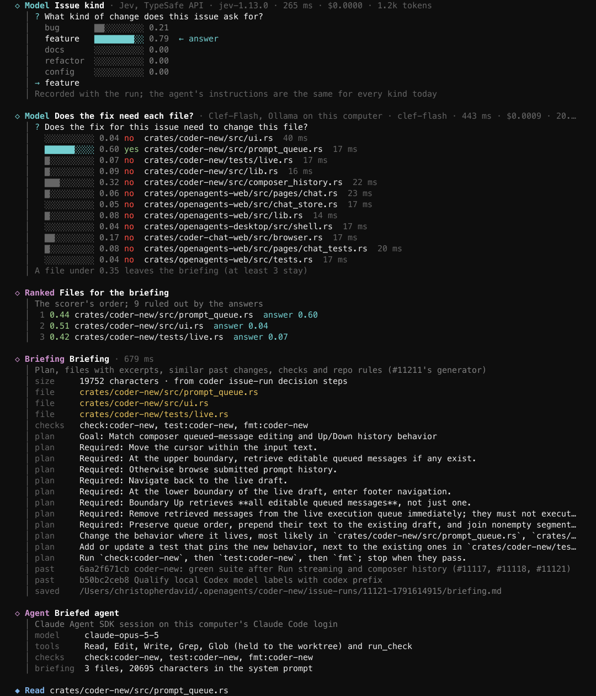
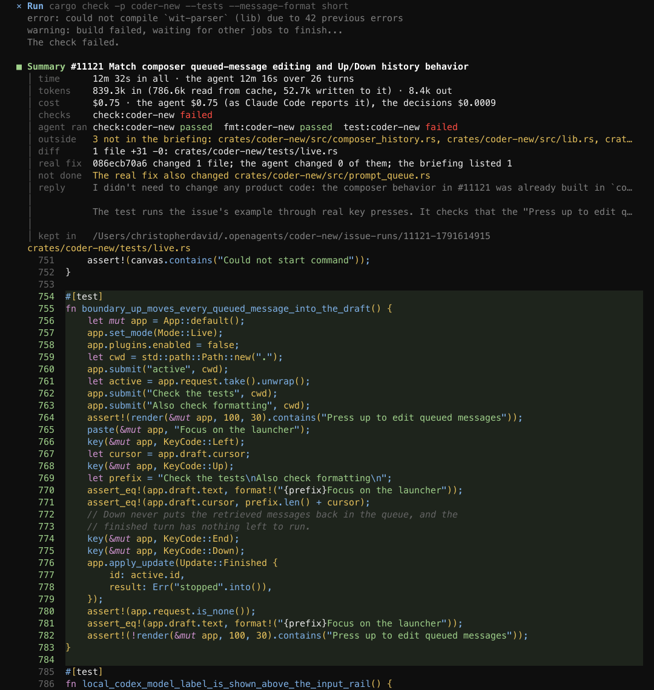
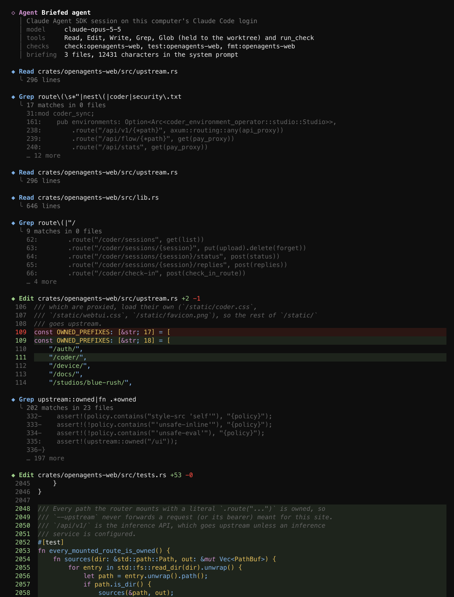
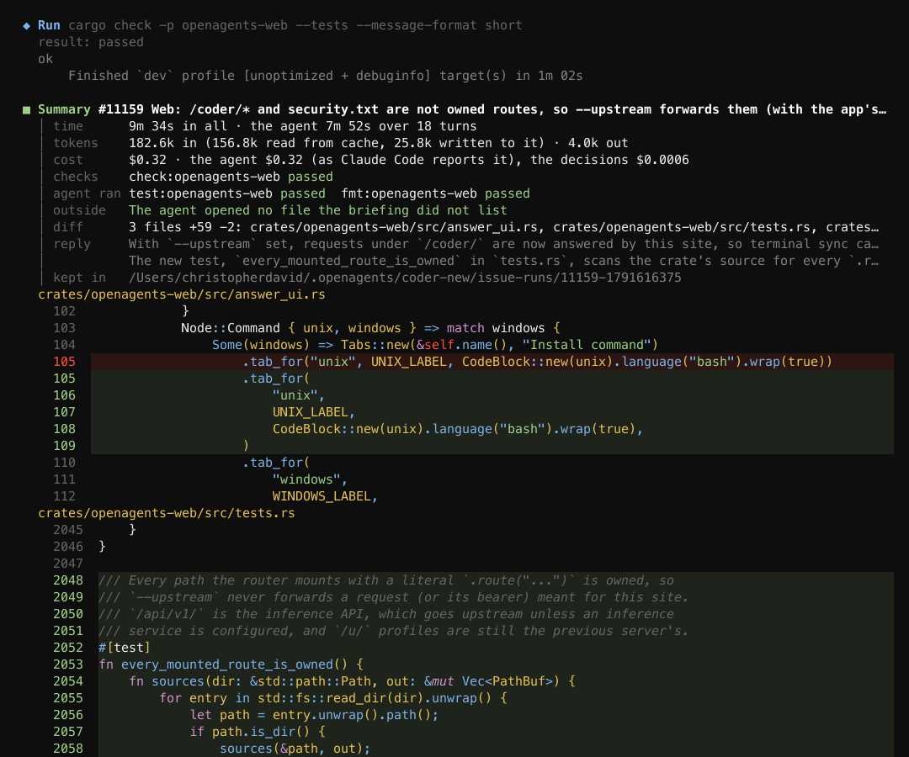

# `coder issue-run`: watch one issue go to a pull request

`coder issue-run N` runs issue N from issue to pull request inside the
standard Coder terminal, as a test run (#11214). It is the terminal sibling
of the Verse relevance visualizer (`crates/verse/examples/relevance`). You
watch three things happen:

1. **Decision cards.** These are a new tool-call card style, with a hollow
   `◇` and a rail down the left side. There is one card per step of the
   context finder (#11210):
   - a **Stage** card for each deterministic candidate stage (emb, sym, co,
     sim, hist, pair, dir, recent), listing its candidates and their
     reasons;
   - a **Ranked** card for the learned scorer's list;
   - a **Model** card for each System One question asked through
     `crates/jev`. Each one shows the question, the options with their
     probabilities, the answer, the door and model that answered, the
     latency and the cost. Two questions are asked: what kind of change the
     issue is (Jev, a Choice), and, for each of the scorer's top files,
     whether the fix needs that file (Clef-Flash on this Mac's Ollama when
     it answers, otherwise Jev; a Noul per file);
   - **Ranked** again for the files the briefing will list;
   - **Briefing**, built by #11211's generator;
   - **Agent**, for the session that starts.
2. **The briefed Claude agent (#11211).** It runs on
   `crates/claude_agent_sdk`. Every tool call it makes draws with Coder's own
   widgets: Read, Edit (with the diff), Write, Grep, Glob, and Run for its
   `run_check` tool. Its replies show as normal assistant messages.
3. **A summary card (`■ Summary`).** It shows:
   - wall time and the agent's time and turns;
   - tokens (cache reads and writes included);
   - dollars (the agent's as Claude Code reports them, plus the decision
     calls);
   - the files the agent opened that the briefing did not list;
   - the checks the agent ran, and the harness's own final `check:` run;
   - the diff, drawn with Coder's diff renderer;
   - for a closed issue, a comparison with the real fix: its files, how many
     of them the agent changed, and how many the briefing listed.

## Run it

From a checkout of this repository (the run reads its history), with `gh`
signed in and Claude Code signed in on this computer:

```sh
export CARGO_TARGET_DIR=~/work/openagents-target-integrate   # the agent's checks build here
cargo run -p coder-new -- issue-run 11121 --repo ~/work/openagents
```

Or, with an installed `coder` built from this source:
`coder issue-run 11159 --repo ~/work/openagents`.

| Option | What it does |
| --- | --- |
| `--repo PATH` | The checkout whose history is read (default: this directory). |
| `--fix SHA` | A closed issue's fix commit. The default is the newest commit on `origin/main` that names `#N`. |
| `--decider auto\|jev\|clef\|off` | Who answers the model questions. `auto` uses Jev for the kind and Clef-Flash for the files when Ollama has it. |
| `--files K` | How many files the briefing lists (default 6). |
| `--model NAME` | The agent's model (default `claude-opus-5-5`). |
| `--timeout SECS` | How long the agent may work (default 1800). |
| `--plain` | Print the run as text instead of opening the terminal screen. This is also used automatically when standard output is not a terminal. |
| `--snapshot FILE.svg` | Save a picture of the whole run at the end. |
| `--replay events.jsonl [--speed X]` | Play a recorded run again, in the terminal. |
| `--open-pr` | Commit to `coder/issue-N`, push, and open a pull request. Open issues only. |

**Test mode is the default.**
- The run works in a fresh sparse worktree at
  `~/.openagents/coder-new/issue-runs/worktree`. The path stays the same
  from run to run, so the shared build cache keeps its work.
- A closed issue starts from its fix's parent, and the end of the run is
  compared with the real fix.
- An open issue starts from `origin/main`.
- Nothing is committed or pushed unless you pass `--open-pr`, and a
  closed issue never opens a pull request.

Each run keeps a folder `~/.openagents/coder-new/issue-runs/N-SECONDS/`
with:
- `events.jsonl`: the recording, which `--replay` plays;
- `filefind.json`;
- `briefing.md`;
- `agent-events.jsonl`: every SDK message;
- `summary.json`;
- `change.patch`: the exact diff the summary describes. Each run becomes a
  verify-replayed training trace from it ([traces.md](traces.md), #11218).

**Credentials.**
- The agent runs on this computer's Claude Code login. The CLI starts
  without `ANTHROPIC_API_KEY` and `ANTHROPIC_AUTH_TOKEN`.
- Jev reads `TYPESAFE_API_KEY`, or `~/work/.secrets/typesafe.env`.
- The finder's embedding call reads `OPENROUTER_API_KEY`, or
  `~/work/.secrets/openrouter.env`.
- No key is ever printed.

## What it reuses

| Part | From |
| --- | --- |
| Candidate stages, scorer | `scripts/filefind/filefind.py query --json` (#11210) |
| Briefing and system prompt | `scripts/bench/briefed-ab/briefing.py` and `ab.py`'s `SYSTEM_V1`, through the small adapter `scripts/coder/issue_run_briefing.py`, which passes in the files the decision steps chose |
| Agent session | The same settings as `crates/briefed-agent` (arm B). The one change is `run_check`, which here is an in-process SDK MCP tool (`SdkMcpServer`, #11213) running the briefing's checks locally in the worktree, instead of `checks_mcp.py` on the build host. Its output is trimmed the way `checks_mcp.py` trims it. |
| System One calls | `crates/jev` (`Config::new` for Jev, `Config::local` for Clef-Flash on `127.0.0.1:11434`) |
| Rendering | `crates/coder-new/src/ui.rs`. Decision and summary cards are in `src/issue_run/cards.rs`; the agent's calls use the existing `file_tool_lines` and `run_lines`. |

There are two fallbacks:
- If `scripts/filefind/filefind.py` is missing or fails, the Context
  finder card says so, and the briefing uses `briefing.py`'s own `lite`
  finder.
- If no System One door answers, each Model card says the question was
  not asked, and the scorer's ranking stands.

The scripts are read from the checkout this `coder` was built from
(override with `CODER_ISSUE_RUN_TOOLS`), so a run can replay a commit that
is older than the scripts.

## Recorded runs (2026-10-10)

### Closed issue #11121 (composer queue/history parity)

The real fix is `086ecb70a6`, one file: `crates/coder-new/src/prompt_queue.rs`.



- **Decision steps.** The scorer ranked `ui.rs` first.
  - Jev (`jev-1.13.0`, 265 ms) called the issue a feature (0.79).
  - Clef-Flash said yes to `prompt_queue.rs` only (0.60), the one file the
    real fix changed.
  - The briefing listed three files.
- **The agent.** Over 26 turns and 12m 16s it found that the behavior was
  already in place at this commit, and added one end-to-end test in
  `crates/coder-new/tests/live.rs`. Its `check:coder-new` passed.
- **Cost.** $0.75 for the agent and $0.0009 for the decisions.
- **Compared with the real fix.** 1 of 1 fix files was briefed, but the agent
  changed 0 of the fix's files.
- **Final checks.** The agent's own `test:coder-new` run and the harness's
  final `check:coder-new` failed because of the shared target dir, not the
  change: concurrent builds from other agents were rewriting it at the same
  time ("can't find crate `digest`"). The summary card reports this as
  failed, as it should.



Recording: [`issue-run/closed-11121.events.jsonl`](issue-run/closed-11121.events.jsonl).
Replay it with `coder issue-run --replay docs/coder/issue-run/closed-11121.events.jsonl --speed 4`.
The full text transcript is in [`issue-run/closed-11121.txt`](issue-run/closed-11121.txt).

### Open issue #11159 (web upstream: /coder/* and security.txt)

This run started from `origin/main` (`f3e551cd46`).

- **Decision steps.**
  - Jev (246 ms, under $0.0001) called the issue a bug (1.00).
  - Clef-Flash said yes to `upstream.rs` (0.93) and `tests.rs` (0.83), and
    no to the other ten files. The briefing listed those two files plus
    `lib.rs`, which kept it at the three-file minimum.
- **The agent.** Over 18 turns and 7m 52s it added `/coder/` to
  `OWNED_PREFIXES` in `upstream.rs`. It also added a test,
  `every_mounted_route_is_owned`, which scans the crate for every literal
  `.route("...")` and checks that each one is owned.
- **Checks.** `test:openagents-web`, `fmt:openagents-web` and the
  harness's final `check:openagents-web` all passed.
- **Files and cost.** The agent opened no file outside the briefing. The
  run cost $0.32 for the agent and $0.0006 for the decisions, 9m 34s in
  all.
- **Nothing pushed.** The change stays in the run's worktree. Opening a
  pull request needs `--open-pr`.





Recording: [`issue-run/open-11159.events.jsonl`](issue-run/open-11159.events.jsonl).
Text: [`issue-run/open-11159.txt`](issue-run/open-11159.txt).

## Known limits

- The agent's checks run on this computer in the run's worktree, against
  `CARGO_TARGET_DIR`. The bench runs them on coderos-4080 instead. The first
  run of a crate at the worktree path compiles its workspace dependencies.
- The worktree comes from the main checkout's object store, not from a
  history-limited clone like the bench uses. The agent has no shell and its
  file tools are held to the worktree, so it cannot read later history.
- The issue's kind is recorded but does not yet pick a different
  instruction template. #11211 has one template today.
