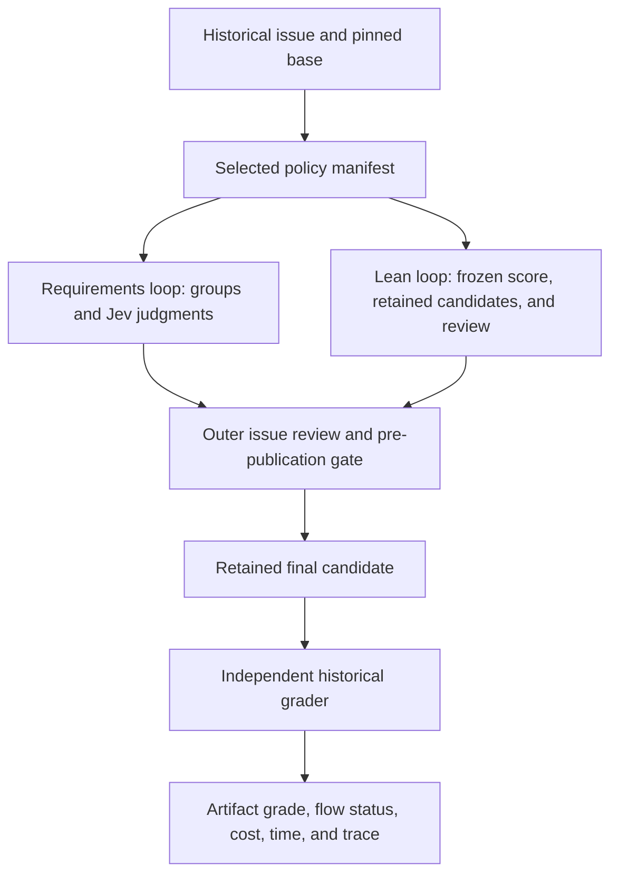

# Issue-flow policy comparison: retain requirements

**The issue-flow default remains `issue-flow.json`.** The completed round
has **1/4 passing artifacts for each policy**. Lean costs **17.7% less** and
takes **22.2% less total time across all attempts**, short of the registered
20% cost-saving threshold for a tied pass count. On the sole task both
passed, lean was cheaper but **14.1% slower**. These are four selected
historical development issues, with material grader and host limitations.

The operator stopped the study on 2026-09-25 at 22:04:39 UTC and requested
closure of [#9624](https://github.com/OpenAgentsInc/openagents/issues/9624)
with the results available. Eight attempts completed. Slot 9 was interrupted
and has no final grade; slots 10–16 never started. **The planned two-round
study did not complete.** The one-repeat decision is descriptive and leaves
the existing default unchanged. There is no repeatability or held-out claim.

| Completed round | Requirements | Lean |
| --- | ---: | ---: |
| Independently passing artifacts | 1/4 | 1/4 |
| Passed checks | 15/18 | 14/18 |
| Flow reports `finished` | 1/4 | 4/4 |
| Both finished and independently passed | 0/4 | 1/4 |
| Luna price estimate | $0.097146 | $0.085402 |
| Jev price estimate | $0.011725 | $0.004151 |
| Total price estimate | $0.108871 | $0.089553 |
| Mean cost per attempt | $0.027218 | $0.022388 |
| Mean total seconds per attempt | 629.7 | 490.2 |
| Mean flow seconds per attempt | 615.9 | 476.9 |
| Luna model calls | 269 | 180 |
| Jev calls | 134 | 44 |

`finished` is a flow status, not proof of acceptance or a clean host gate.
Every dollar total in the completed comparison is known as a token-based
estimate. The eight attempts cost **$0.198424154**. Both invalid earlier
studies add **$0.093755924**, and the interrupted ninth attempt retains at
least **$0.011851400** of Luna usage. Combined recorded spend is therefore
**at least $0.304031478**; the interrupted attempt has incomplete Jev and
final accounting, so its missing charges are not zero.

## Every completed attempt

| Slot | Task | Policy | Artifact checks | Flow | Total s | Total $ | Luna calls | Jev calls |
| --- | --- | --- | --- | --- | ---: | ---: | ---: | ---: |
| 1 | #9450 | lean | passed 4/4 | finished | 263.8 | 0.013515 | 32 | 9 |
| 2 | #9450 | requirements | passed 4/4 | stuck | 231.2 | 0.017961 | 44 | 33 |
| 3 | #9446 | requirements | failed 2/3 | stuck | 556.6 | 0.028910 | 71 | 38 |
| 4 | #9446 | lean | failed 2/3 | finished | 205.5 | 0.014486 | 35 | 9 |
| 5 | #9451 | lean | failed 1/3 | finished | 860.0 | 0.034239 | 61 | 13 |
| 6 | #9451 | requirements | failed 2/3 | stuck | 979.4 | 0.039748 | 100 | 41 |
| 7 | #9597 | requirements | failed 7/8 | finished | 751.7 | 0.022252 | 54 | 22 |
| 8 | #9597 | lean | failed 7/8 | finished | 631.4 | 0.027313 | 52 | 13 |

## What the comparison measures

This compares two complete issue-flow configurations on four historical
OpenAgents development issues, once per configuration in the completed round. Both use GPT-6
Luna, live Jev, a pinned executable, withheld GitHub access, no external
network from commands, and the same candidate/toolchain read scope. The
requirements policy and lean policy have different session and command
bounds; the result does not isolate a single algorithmic component.

The four tasks are a stale documentation correction (#9450), a development
launcher (#9446), the delegate answer channel (#9451), and a Gym minitask
explanation (#9597). The requirements loop was already tuned on #9597 over
14 attempts. That task is reported separately. These are development
results, not held-out acceptance, Terminal-Bench wins, or a representative
sample of future GitHub issues.

The planned order alternates arms across two rounds. The decision rule was
pushed before inference. For the available one-repeat comparison, it selects
lean with one more passing attempt, or with tied passes and at least 20%
lower mean cost.
Otherwise retain requirements, with a contamination veto against lean.
The decision uses final independently graded artifacts; `finished`,
`stuck`, and internal self-scores are also reported and are not substituted
for that grade.

The outer review can edit a candidate after the inner loop scores it.
That is why the retained final candidate's independent grade matters.

## What is complete in #9624

| Requirement | Implementation and evidence |
| --- | --- |
| Load terminal and issue-loop bounds from manifests | `terminal-microluna.json`, `issue-flow.json`, and `issue-flow-lean.json`; selection and validation in `crates/coder-one/src/terminal.rs`. |
| Report the selected manifest and digest | `crates/coder/src/checkup.rs` renders both defaults in `coder doctor`; every turn records its selected manifest. |
| Run lean in the issue flow | The scripted `an_issue_turn_runs_the_lean_loop_its_manifest_names` test checks the lean loop, candidate retention, and review. The live comparison exercises historical issues. |
| Preserve the outer issue-flow gate | Tests, figures, links, style, plain language, and dependent-code checks remain before publication. Evaluation runs publish no pull requests. |
| Preserve quick questions | The question path uses one session; `a_question_keeps_one_session_and_a_read_only_turn_runs_no_checks` covers it. |
| Keep requirements available and choose the default from evidence | Both manifests remain selectable through `CODER_ISSUE_POLICY`; the registered rule determines the default below. |

The terminal's ordinary change-request default is a separate manifest.
This comparison chooses the issue-flow default only.

## Evidence integrity and limits

Two earlier cohorts are invalid and excluded. The original three attempts
allowed private-history reads; the exposed attempt remains quarantined on
the operator's host, with only content identities and accounting published.
The next pair exposed the scorer integration gap introduced by confining
reads. Both cohorts, their failure diagnoses, and their costs remain in the
[repair report](../verification/2026-09-25-issue-eval-read-isolation.md).
Their combined $0.093755924 counts against the same $5 budget.

The repaired seal grants the candidate, owned scratch and tool state,
installed tools, prefetched registry sources, and a read-only grant to the
host-selected evaluator. Sessions, the gate, and the frozen-score runner
use that scope. The grader runs afterward outside the model's access.
A scripted two-session regression exercises the evaluator, finish hook,
outside-read refusal, GitHub stub, and evaluator immutability. The historical
coder crate also compiled through the same toolchain scope.

All reported dollar amounts are token-based list-price estimates, including
Jev, rather than provider invoices. Missing totals remain unknown; they
cannot establish a cheaper-policy claim. Total wall time includes setup,
flow, and independent grading; flow time is also shown. Compiler output
under each ignored candidate target is discarded only after a final
receipt. Source diffs, retained candidates, model/tool transcripts, scores,
and receipts remain.

Wilson intervals describe attempt counts. The paired task bootstrap keeps
each task's available pair together and enumerates all 256 four-task resamples.
With only four selected tasks, neither calculation establishes broad
reliability. The registered rule is an operational default choice, not a
claim of statistical superiority across all coding work.

## What the traces show

In slot 2 (requirements, #9450), the first work session made the edit.
All eight work-session records carry the same candidate digest afterward;
seven sessions made no further edit. The controller still selected `retry`
for R3/R4 and R5/R6, and the three-attempt bound converted each group's
last retry into `stuck`. The checks recorded zero scenarios, zero packets,
and all seven requirements as unobserved; their failure probabilities
remained approximately 0.33–0.35, explicitly `unknown`. The independent
grader subsequently passed all four artifact checks. This explains the
termination-label mismatch in the retained control records. Why Jev
preferred retry needs separate calibration; the records do not show those
unchanged retries improving the artifact.

Slot 1 (lean, #9450) reached 5/5 on its own script in one work session.
The read-only self-review returned `blocked` without reading a file,
saying it could not validate without commands. The outer issue flow
continued, and the final artifact passed all four independent checks.
That is a limitation of the review's behavior, not a permission failure:
the review was intentionally restricted to reading and finishing.

The #9446 launcher grader has a material compatibility limitation already
noted in its frozen entry: it drives the candidate through `CODERDEV_CARGO`
and `CODERDEV_ENV_FILE`, names chosen by the historical fix and absent from
the issue. It also requires a particular startup-message format on stderr.
In slot 3, the requirements candidate called `cargo +1.97.1` directly,
printed a different identity format on stdout, and documented credential
loading in the caller's subshell. Its own fixtures and a real `--help`
launch passed, but the retained command exited 64 and the trial scored
2/3. Ignoring the stub-selection variable means the historical fixture
cannot exercise the candidate as intended. This score does not establish
that the launcher ran a stale binary, nor does the successful `--help`
launch prove every acceptance condition. The registered grader and score
stay unchanged; interpret this cell as compatibility with the retained
fixture, not a complete semantic assessment of every valid launcher.

In slot 4 (lean, #9446), the inner read-only reviewer identified a real
relative-`CARGO_TARGET_DIR` bug: the launcher builds after changing to the
repository, then resolves the same relative executable path after returning
to the caller's directory. Its stub checks used an absolute target path and
did not cover this. It also distinguished invoking Cargo repeatedly from
proving incremental rebuild behavior. The three outer repair sessions edited
README wording only. The internal 5/5 score, substantive blocked review,
outer `finished` status, and independent 2/3 grade therefore describe
different things. In addition to the retained fixture's compatibility limit,
this candidate has a concrete unaddressed behavior concern.

Slot 5 (lean, #9451) demonstrates another gap between a source-level
self-score and an end-to-end result. The writer added an `answer` field and
changed `correct()` to use it, but guessed that the last stdout line was the
answer. The inner reviewer caught multiline truncation and the missing
adapter contract. Outer review changed the heuristic to the last nonempty
paragraph and added a helper test; it still did not establish where the
executor's final message starts. A multi-paragraph answer can still be cut.
The candidate left `recorded_output()` returning the full stdout transcript.

The frozen grader failed compilation because it expects `answer()` and
`transcript()` methods rather than a public `answer` field. That API-shape
failure alone does not prove the candidate lacks every requested behavior.
A separate deliverable check found no `transcript` change in `trace.rs`,
and the final diff confirms that the trace integration was untouched.
All 37 existing delegate tests passed under the independent grader. Inside
the sealed flow, however, tests that start another `sandbox-exec` failed
with `sandbox_apply: Operation not permitted`. Three repair sessions spent
time rerunning or diagnosing those platform failures. This is a real
limitation of running the historical boundary tests inside the Mac seal,
not evidence that the agent broke all 17 failing delegate tests. The final
artifact still fails its registered acceptance grade (1/3); the flow says
`finished` while its final reply explicitly says the gate finds two problems.

The requirements attempt on #9451 shows the review handoff problem too.
Its first outer reviewer explicitly said the change should not land,
identifying unconditional last-line extraction and a caller that still
returns `delegation.output` instead of the new answer. The next repair's
request came from the mechanical gate, not those review findings. It
changed `boundary_supported()` to try launching a harmless sandboxed
command, so nested-sandbox-dependent tests skip when enforcement cannot
start. This is an environment-capability check, not proof that the skipped
delegation paths work. The report must retain both the reviewer’s substantive
findings and any skips, alongside the independent artifact grade.

The source explains this handoff: `issue_turn::work` stores the review's
status and summary, then replaces its `remaining` list with `gate()`'s
problems. `fix_request()` contains that list and the staged diff. A review
that finishes `done` while its answer says the code should not land does
not become a tracked blocking finding. The read-only lean review can also
identify a defect without that defect entering the outer repair list.
This is distinct from preserving a failed delegate or review execution
status, which the existing `reviewed_outcome` tests cover.

Slot 6's final requirements candidate passes 2/3 registered checks: it
updates trace serialization, but fails the same method-shaped injected test
as slot 5. Its last repair raises the historical worktree lock timeout from
30 to 120 seconds and passes the focused concurrency test. Those edits
address the evaluation environment's symptoms; they do not fix the two
answer-channel defects raised by the outer reviewer. The candidate uses
100 Luna calls and 41 Jev calls, versus lean's 61 and 13. Seven of its ten
work sessions make no further source edit. These generated changes remain
benchmark candidates and are not applied to the product checkout.

## Configuration differences

Both manifests use GPT-6 Luna, Jev 1.13.0 with `builtin-v1` questions,
v2 probes, a 40-file survey, a 12,000-character briefing, and a declared
2,400-second executor deadline. Their Microluna configurations differ:

| Setting | Requirements | Lean |
| --- | --- | --- |
| Work organization | Up to 5 requirement groups, 3 attempts per group, 10 sessions total | `lean.sessions = 4`, whole-task work and read-only review |
| Per-session turns | 24 | 60 |
| Per-session seconds | 480 | 900 |
| Declared spend | $1 | $1, with per-session spend bounding enabled |
| Check mechanism | Jev checks, including per-part judgments | Frozen generated score script and retained candidates |
| Evidence required | No | Yes |
| Parallel tools | Default (off) | Enabled |
| Additional lean bounds | Not applicable | 2,100-second loop wall, 300-second command, 120-second scorer |
| Early finish handling | Requirement decisions | Up to 3 returns; reserves 8 turns and 90 seconds |

The same outer issue review and host gate follow both inner loops. The
reported whole-flow time includes those reviews, repair rounds, compilation,
and tests; a single Microluna session's limit is not the whole run's limit.

Slot 7 (requirements, #9597) fails only `view-gives-time`: the rendered
view says `22.0 s` and `about 1 s`, while the retained check searches for
the English word `second` or `seconds`. The display does provide time, so
this check is a lexical compatibility failure, not evidence that the view
omits timing. Its other seven checks pass. The registered result remains
failed; the report must not equate this cell with failure to explain time.

Its first three work sessions edit the explanation and run the focused
Gym test. The first outer review reflows long lines. Three further repair
sessions inspect full-suite failures in retained-run catalog and ranking
fixtures; the recorded responses match only one of four evidence keys.
The candidate changes only the guide and `coder_minitasks.rs`, and the
agent declines to invent missing fixture judgments. The trace attributes
those failures to unrelated fixture evidence, but this study does not
include an isolated before/after full-suite control to establish their
cause. All of that investigation and the final gate remain in the
751.7-second, $0.022252 total. `finished` does not mean every gate passed.

Slot 8 (lean, #9597) fails `view-gives-cost`: its final view describes
model usage without a measured dollar figure. The inner reviewer had
already identified that exact omission; later rounds did not supply it.
This is a substantive omission, unlike slot 7's `s` versus `seconds`
mismatch. The original script still scored itself 4/4.

Both lean moves also record `snapshot_error` and `keep_error`: the
historical Gym checkout contains about 896 MiB of tracked and unignored
files, exceeding the 256 MiB snapshot cap. Much of that size is retained
Terminal-Bench transcripts. The submitted record has no supported score
or matching selected workspace. Keep-best and intermediate candidate
retention did not work for this cell. This is the existing documented
algorithm bound, so the attempt remains a result rather than being
replaced. Its final candidate is reconstructible from the pinned base and
published diff; its absent intermediate snapshots cannot be recovered by
claiming that full model transcripts are equivalent to snapshots.

The outer review added a TUI assertion but its focused TUI test filter
matched zero tests; the retained summary says so. Later full-suite runs
failed on the same ranking-fixture evidence as requirements. No such
failed or zero-test invocation is counted as validation of the TUI change.

## Uncertainty and what the result supports

Each arm's 1/4 pass count has a descriptive 95% Wilson interval of
**4.6%–69.9%**. The exhaustive paired four-task bootstrap puts the mean
lean-minus-requirements cost difference at **−$0.004829**, with a descriptive
interval of **−$0.011930 to +$0.002419**. Its time difference is **−139.6 s**,
with an interval of **−293.2 to −5.7 s**. The pass-difference interval is
artificially `[0, 0]`: every observed task pair has the same binary grade.
It says nothing about repeatability, because the second round was stopped.
These selected tasks and strict graders do not support a population-level
claim that either policy solves more coding work.

The launcher fixture requires historical variable names; the answer-channel
fixture requires historical method names and a separator; the Gym timing
fixture rejects `s`. Those limits make the numerical pass count narrower
than a semantic assessment of the requests. Conversely, the traces show
real omissions that internal self-scores miss. No score was changed after
seeing a candidate. No interrupted or invalid attempt is silently dropped
from the accounting.

## Retained evidence and verification

The [frozen protocol and stop amendment](../../../bench/terminal-bench/experiments/2026-09-25-issue-flow-policies-sealed-scorer/protocol.md),
[executable and policy pins](../../../bench/terminal-bench/experiments/2026-09-25-issue-flow-policies-sealed-scorer/pins.json),
and [machine-readable comparison](../../../bench/terminal-bench/experiments/2026-09-25-issue-flow-policies-sealed-scorer/records/comparison.json)
retain the decision inputs. The
[eight-run archive index](../../../bench/terminal-bench/experiments/2026-09-25-issue-flow-policies-sealed-scorer/records/evidence.json)
links full native and ATIF transcripts, available candidate snapshots,
frozen evaluators, final diffs, grades, and driver records. Each archive has
SHA-256 and member digests. Snapshot failures are explicit; transcripts do
not stand in for missing candidate snapshots.

The [interrupted ninth attempt](../../../bench/terminal-bench/experiments/2026-09-25-issue-flow-policies-sealed-scorer/records/09-9450-requirements-interrupted/evidence.json)
retains its partial transcripts and candidate files at termination. It has
no invented final manifest or grade. The
[stop receipt](../../../bench/terminal-bench/experiments/2026-09-25-issue-flow-policies-sealed-scorer/records/operator-stop.json)
records the terminated processes. Nothing was restarted or independently
regraded after the stop.

Before inference, all four development graders distinguished their base
and historical fix. The scoped pinned Rust gate passed formatting, strict
Clippy, and **1,061 tests in each of two feature configurations**, with
three ignored tests in each. Its
[receipt](../../../bench/terminal-bench/experiments/2026-09-25-issue-flow-policies-sealed-scorer/records/preflight/rust-gate/run.json)
labels the result `partial` because this is scoped coverage for `coder-one`,
`microluna`, and `coder-boundary`, not a workspace release gate. It includes
the sealed evaluator regression. No Rust behavior changes follow this
measurement; final publication checks archive digests and documentation
links instead of rerunning model or Rust workloads.

## Follow-up priorities

Carry substantive review findings into repair requests and require explicit
resolution; a review that finishes its work can still reject the candidate.
Separate baseline environment failures from candidate regressions before
spending repeated repair sessions on them. Improve the historical graders'
contract coverage without changing this frozen study's labels. Finally,
make lean candidate retention usable on large repositories with retained
traces, while keeping an explicit storage bound. These observations do not
justify silently enabling an unmeasured fix or claiming #9624 completed its
original 16-run plan.
