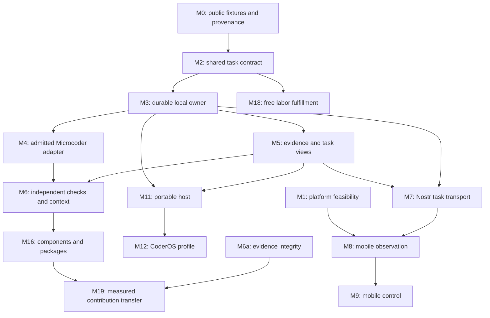

# Coder suite migration: implementation tracker

Updated September 26, 2026. This is the delivery tracker for the
[suite migration assessment](design/coder-suite-migration.md). The assessment
records the private source review and target behavior; this document records
what exists publicly, what is being built, what comes next, and what evidence
permits each part to close. Its starting revision is
[`21a67d1bd3`](https://github.com/OpenAgentsInc/openagents/commit/21a67d1bd317d5648d9f09ae53e082100dbfd4f8).

**Shipped foundations now include** explicit durable execution, reconstructed
evidence, knowledge integrity, private knowledge inputs, Rust mobile feasibility,
and a recoverable free labor order. Frozen context and protected independent checks are delivered. The Microcoder
repository adapter now includes detached and container code paths. Fresh live
acceptance was stopped at the user's request; retained attempts are not an
independently verified success. Code and documentation work can continue, while
[#9674](https://github.com/OpenAgentsInc/openagents/issues/9674) remains open. See
the [exact stopped record](verification/2026-09-26-repository-adapter/README.md). The original inbox
[#9672](https://github.com/OpenAgentsInc/openagents/issues/9672) remains the inert
submission boundary; execution requires a separate grant.
This is the foundation for moving between terminal, headless, phone, desktop, and
CoderOS without creating a separate agent for each interface. Microcoder's
execution strategy, shared knowledge, and agent labor remain important
parallel work. A task record alone does not make any of those products complete.

The first suite milestone is one repository task started on a computer,
observed and corrected on a phone, and completed with independently checked
artifacts after disconnect and reconnect. The [migration epic](https://github.com/OpenAgentsInc/openagents/issues/9671)
tracks that full path. Deliver and test local admission, then the execution
owner and evidence contract.

## How to read the status

| Status | Meaning |
| --- | --- |
| Shipped foundation | Public implementation exists. The linked source or verification record defines its limits; this does not complete a larger migration package. |
| In progress | A contributor has claimed a bounded implementation. Closure still needs the stated tests and landed code. |
| Partial | Some required behavior exists, but the package's acceptance gate is incomplete. |
| Next | The next bounded implementation to claim, once its listed dependencies are accepted. |
| Queued | Defined work with no active implementation claim in this tracker. |
| Deferred | An optional extension outside the first suite milestone. |

No package is complete because its NIP exists, a related issue closed, a
fixture passes, or the private product contains similar code. Completion
requires the package's own implementation and acceptance evidence. An owner
is **unassigned** unless an issue claim names one; proposed work below is
not automatically running in another agent.

## Active work and immediate queue

| Order | Work | Status and ownership | Exit condition |
| --- | --- | --- | --- |
| 1 | [Durable local inbox, #9672](https://github.com/OpenAgentsInc/openagents/issues/9672): M0 fixtures, M2a/M3a | **Shipped foundation.** The implementation and [acceptance evidence](verification/2026-09-26-task-inbox.md) complete this bounded slice. | Opt-in `coder task` submission/list/inspection and queued-task cancellation; versioned closed commands, exact-byte retry identity, expected revisions, private atomic storage, and real CLI tests. No execution, Nostr control, or running-task interruption. |
| 2 | [Durable execution owner, #9673](https://github.com/OpenAgentsInc/openagents/issues/9673), then [Microcoder adapter, #9674](https://github.com/OpenAgentsInc/openagents/issues/9674): M3/M4 | **Owner delivered; #9674 remains in progress.** The bounded-command owner passes its acceptance. The Microcoder adapter uses the same host and has detached/container paths. Code checks are separate from the stopped, incomplete live acceptance under #9674. | Owner/view acceptance: 38 focused task cases and nine process/CLI cases pass. Retain the incomplete acceptance result and finish code/documentation scope; do not launch more model or benchmark runs under this task. |
| 3 | [Evidence and views, #9675](https://github.com/OpenAgentsInc/openagents/issues/9675): M5 | **Shipped foundation.** Paged ATIF reads, retained artifacts, explicit gaps, and reconnect fixtures pass targeted acceptance. | A new reader reconstructs task state and pages complete retained evidence without the writer's memory. Missing, truncated, or inaccessible evidence stays visible. |
| 4 | [Independent completion and context, #9676](https://github.com/OpenAgentsInc/openagents/issues/9676): M6 | **Delivered.** Frozen coverage, exact knowledge and source lineage, scoped instructions, corrections, and protected independent checks pass [targeted acceptance](verification/2026-09-26-frozen-context/README.md). | The exact candidate has a versioned requirement/check record; a model's finish, changed tests, or an exit code cannot create verified success. |
| 5 | [Scoped Nostr control, #9691](https://github.com/OpenAgentsInc/openagents/issues/9691): bounded M7/M9 foundation | **Delivered bounded host/client bridge.** Owner-installed mapping, separate rights, expiry/revocation, signed private commands, durable replay, and finite views. | Synthetic authenticated socket and separate-process recovery checks; [runtime limits](runtime/nostr-task-control.md). This does not complete mobile apps, full signed RUN history, or distributed handoff. |
| Parallel | [Knowledge evidence integrity, #9677](https://github.com/OpenAgentsInc/openagents/issues/9677): M6a, following closed [#9670](https://github.com/OpenAgentsInc/openagents/issues/9670) | **Shipped foundation.** Complete intake and honest cost/comparison semantics pass targeted tests and strict Clippy. Existing retrieval, contribution, and relay sharing remain shipped. | Complete attempt intake, exact entry/configuration identities, unknown cost accounting, source-separated confirmation, and uncertainty before stronger admission claims. |
| Parallel | [Mobile feasibility, #9678](https://github.com/OpenAgentsInc/openagents/issues/9678): M1; [free labor, #9679](https://github.com/OpenAgentsInc/openagents/issues/9679): M18; generic host packaging fixtures: M11/M12 | **Shipped bounded slices.** Mobile feasibility has simulator/emulator evidence; free labor has a retained authenticated relay/process round trip. Host bundle installation and one-shot service packaging are delivered in #9690. | Narrow public prototypes and explicit findings that inform shared contracts; no device, OS, or market release claim from prototypes. |
| Parallel | [Desktop history #9694](https://github.com/OpenAgentsInc/openagents/issues/9694), [encrypted observer #9695](https://github.com/OpenAgentsInc/openagents/issues/9695), [iOS reader #9696](https://github.com/OpenAgentsInc/openagents/issues/9696), [framework purity #9697](https://github.com/OpenAgentsInc/openagents/issues/9697) | **Implemented; native delivery checks tracked separately.** Read-only Codex/Claude history, pair/serve/revoke, encrypted device cache, foreground updates, and SwiftUI rendering. | [Usage](guides/mobile-readonly.md) and [exact verification](verification/2026-09-26-mobile-reader.md). No phone writing, model runs, or task-control completion claim. |
| Parallel | [Rust Native, #9693](https://github.com/OpenAgentsInc/openagents/issues/9693): shared presentation for M1/M8/M13 | **Core and iOS observer implemented.** Serializable stack/list/text/button views, current-view typed intents, deterministic generic styles. `coder-ui` owns the application theme and `coder-terminal` re-exports it. | Verify the bounded core and existing terminal compatibility. Follow the [build order](rust-native/build-order.md) for incremental adapter/consumer slices; the [iOS reader](guides/mobile-readonly.md) adds retained external-harness observation, while cross-client task control remains separate. |

The inbox's [usage guide](guides/tasks.md), [source](../../crates/coder/src/task.rs),
and [verification record](verification/2026-09-26-task-inbox.md) define exactly
what originally landed. Follow-on claims are recorded on #9673–#9679. The
[owner contract](runtime/task-owner.md), [knowledge evidence contract](runtime/knowledge-evidence.md),
and [mobile feasibility decision](design/rust-mobile-feasibility.md) document
current implementation limits. Each issue ships after its relevant acceptance checks pass. Full workspace
verification is release-only and never blocks independent issues. A focused
test does not establish unrelated migration acceptance gates.

[Private knowledge and immutable EXT snapshots, #9686](https://github.com/OpenAgentsInc/openagents/issues/9686)
are implemented and pass targeted verification. Exact encrypted source artifacts,
explicit recipient/model disclosure grants, and inert snapshot loading remain
separate from proof of improved results. The [fixed-study helper](runtime/knowledge-studies.md)
provides prospective bookkeeping, not a launched or completed benchmark study.
A separate contributor owns [#9680–#9685](https://github.com/OpenAgentsInc/openagents/issues/9680),
including the preregistered transfer study and related model/provider work.
Their Gym, publication, and XP changes remain intact. This task does not launch a competing cohort or claim that work complete.

This order does not require another expensive benchmark campaign before
task durability can improve. Use deterministic fixtures and fake executors
for contract and recovery work. This task is restricted to code and documentation; no further model or
benchmark runs are authorized here. Algorithm comparisons remain separately
owned, frozen studies, and any unmeasured live acceptance stays incomplete.

Rust Native is an incremental shared presentation layer, not another task
runtime or an all-at-once client rewrite. Its
[specification](rust-native/architecture.md) and
[file-by-file adoption map](rust-native/adoption.md) define
the boundary. The Apple target is a thin SwiftUI platform bridge with Rust
state and domain logic. Android, terminal, and web adapters follow their own
native semantics and support checks. The existing UIKit/Android feasibility
results remain historical evidence for those exact prototypes; no SwiftUI
runtime result is implied. Independent host, executor, knowledge, and labor
issues continue while the adapters are built.

## Public foundations to reuse

| Area | Implemented basis | What remains for this migration |
| --- | --- | --- |
| Local task requests | [Durable inbox](guides/tasks.md), [store and command contract](../../crates/coder/src/task.rs), and [acceptance](verification/2026-09-26-task-inbox.md). | Local execution admission, owner lifecycle, and evidence recovery are delivered. The bounded CTRL bridge in #9691 connects explicit clients to the owner; complete mobile integration and conversational inbox adoption remain separate. |
| One terminal/headless execution path | [Shared turn](../../crates/coder/src/turn.rs), host permits, [headless guide](guides/headless.md), and [delegate door](runtime/delegate-door.md). | A durable interactive owner that survives client exit, reconciles effects after failure, and accepts typed control from multiple clients. |
| Execution and workspaces | [Subprocess supervision](runtime/subprocesses.md), [execution boundary](verification/2026-09-20-execution-boundary.md), and [worktree lifecycle](verification/2026-09-20-worktree-lifecycle.md). | Apply these guarantees to every selected task adapter; add resource leases and truthful support reporting where they are absent. |
| Existing durable records | [Program run state](../../crates/coder/src/runstate.rs), reconciliation, and [project supervision](guides/project-supervision.md). | Reuse the established separation of execution, verification, acceptance, and integration. These are not already a complete cross-client SESS owner. |
| Traces and evaluation | [ATIF traces](runtime/traces.md), [Gym](../gym/), and [Terminal-Bench results](../terminal-bench/README.md). | Shared task identities, complete artifact closure, replayable views, cost completeness, and fault/recovery evidence. A trace is evidence of recorded events, not permission to replay effects. |
| Shared presentation | [Rust Native](../../crates/rust-native/README.md): validated initial view elements, typed intents, deterministic generic styles. The separate `coder-ui` application theme is consumed by the terminal. | Add native renderers, composition-aware input, accessible transcript paging, and lifecycle handling in small slices. Keep UI instance/revision separate from task ownership, grants, and evidence cursors. |
| Microcoder | [Current guide](guides/microcoder.md), [source](../../crates/microcoder/), and closed [#9666](https://github.com/OpenAgentsInc/openagents/issues/9666)–[#9669](https://github.com/OpenAgentsInc/openagents/issues/9669). | The repository adapter implements admission, shared boundaries, cancellation, detached launch, and task evidence. Complete live independent acceptance remains unverified after the stop request; existing benchmark execution is a distinct path. |
| Knowledge | [Knowledge guide](guides/knowledge-base.md), [design](design/knowledge-base.md), [source](../../crates/knowledge/), and closed [#9670](https://github.com/OpenAgentsInc/openagents/issues/9670). | Evidence integrity (M6a) and private/immutable inputs (#9686) are delivered. Package activation and complete OPT integration remain in M16; independently demonstrated transfer remains M19. Do not rebuild existing retrieval, publication, or withdrawal. |
| Extensions | [Wasm host and evidence guests](../extensions/plugins.md), local programs, and capability trust. | Complete package distribution, compatibility, host activation, rollback, and measured adoption. Installation must remain inert. |
| Nostr | [Protocol coverage audit](../protocol/2026-09-26-nip-implementation-coverage.md), relay, contract validators, private artifacts, and existing CJ/KB transports. | Persistent application services for sessions, device control, workspace views, environments, automation, and labor. Pure validation and relay acceptance do not establish those services. |
| Accounts and optional hosting | [Gateway and tenancy](../decision-models/service/gateway.md). | Bind hosted task owners and workers to their own authorization, isolation, export, and recovery contracts. Local use must not depend on a hosted account. |

The migration does not reopen the completed Microcoder implementation issues
or treat an older design's missing-feature list as current fact. #9670 closed
with retrieval, contribution, and sharing shipped; its
[closing comment](https://github.com/OpenAgentsInc/openagents/issues/9670#issuecomment-5846779833)
maps the remainder to M6a, M16, and M19. The reported same-task knowledge improvements remain in-sample;
they do not establish the unseen-work contribution gate in M19.

## Complete work-package ledger

The IDs below match the assessment, including M6a. The ledger covers all
22 packages. Each row gives the dependency and a concrete closure test;
linked architecture details supply the fuller contract. Unless the active
queue says otherwise, ownership is unassigned.

### Phase 0: public contracts and platform feasibility

| Package | Status and dependencies | Work and acceptance required |
| --- | --- | --- |
| **M0 — Public migration fixtures** | **Partial; #9672 supplies inbox fixtures.** Source review and dispositions exist; full suite scenarios remain incomplete. | Turn the assessment's behaviors into fresh public fixtures: task admission, duplicate commands, disconnected views, revoked control, failed checks, and uncertain effects. Record provenance and the owner of each acceptance scenario. Keep private code, prompts, endpoints, credentials, and customer history out of fixtures. |
| **M1 — Mobile and rendering feasibility** | **Feasibility delivered, [#9678](https://github.com/OpenAgentsInc/openagents/issues/9678); Rust Native foundation in [#9693](https://github.com/OpenAgentsInc/openagents/issues/9693).** Can proceed alongside M2. | Preserve the UIKit/Android and Rust HTML prototype results and their unmeasured input/IME, accessibility, and device-release gaps. Rust Native adds a shared semantic/style contract and a separate application theme; its planned SwiftUI bridge has a separate narrow platform boundary. A foundation test, simulator, or host build does not prove native renderer or device acceptance. |
| **M2 — Runtime contract** | **Partial, local inbox subset M2a shipped in [#9672](https://github.com/OpenAgentsInc/openagents/issues/9672); the owner-facing remainder is in [#9673](https://github.com/OpenAgentsInc/openagents/issues/9673)'s scope.** M0 supplies public fixtures. | Define exact task/input/workspace/configuration identity, typed command dispositions, ownership epochs, grants, budgets, artifacts, and adapter capabilities. Separate queue/steer/interrupt, elicitation/approval, and completion/verification/integration. Test duplicate identity with changed inputs and unsupported effective configuration. The first store does not finish every contract in this row. |

### Phase 1: one durable local task

| Package | Status and dependencies | Work and acceptance required |
| --- | --- | --- |
| **M3 — Durable owner** | **Local owner delivered in [#9673](https://github.com/OpenAgentsInc/openagents/issues/9673).** Depends on M2. | Persist accepted commands before acknowledgment; fence one owner; journal intent before effects; retain queue and cancellation dispositions. Add real dispatch, process reconciliation, and fault injection around journal, dispatch, result, and acknowledgment boundaries. Unknown effects cannot be silently rerun or marked successful. |
| **M4 — Microcoder host adapter** | **In progress, [#9674](https://github.com/OpenAgentsInc/openagents/issues/9674).** M2, M3. | Admit ordinary repository tasks through the shared task contract. Replace direct effect paths with the common read/write boundary, supervisor, output caps, cancellation, accounting, and trace sink. Check local and container paths independently, including descendant processes, oversized reads, symlink escape, timeout, and partial output. |
| **M5 — Evidence and views** | **Local evidence reader delivered, [#9675](https://github.com/OpenAgentsInc/openagents/issues/9675).** M3. | Bind original trace events, exact artifacts, decisions, requested/effective settings, usage, and outcomes to the task. Implement stable reduction, bounded paging, explicit gaps, and ATIF/Gym joins. A reader starting with no old process state reconstructs the same result and sees missing costs or evidence as unknown. |
| **M6 — Acceptance and context** | **Delivered, [#9676](https://github.com/OpenAgentsInc/openagents/issues/9676).** [Exact context and check lineage](runtime/frozen-task-context.md) extend the owner and local adapter. M4, M5. | Retain versioned requirements, checks, their authority, test additions/removals/disputes, scoped instructions, source captures, and recipient-specific context. Independent checks bind the exact candidate and base. A false-green candidate, a withdrawn test, or Jev's judgment cannot become verified success by itself. |
| **M6a — Knowledge evidence integrity** | **Delivered, [#9677](https://github.com/OpenAgentsInc/openagents/issues/9677).** Current knowledge/Gym code; follows closed #9670. | Keep unreadable summaries, failed attempts, missing costs, exact entry digests, exposure, and full configuration identity in reports. Distinguish retrospective screening from prospective randomized or paired studies. Exclude development provenance, report uncertainty, and prevent omissions from improving admission results. |

Phase 1 ends when terminal and headless use one admitted task owner with a
real executor and retained independent checks. A working task-management
command or append-only journal is an intermediate result, not that gate.

### Phase 2: Nostr continuity and phone control

| Package | Status and dependencies | Work and acceptance required |
| --- | --- | --- |
| **M7 — Nostr task transport** | **Bounded CTRL host/client slice delivered in [#9691](https://github.com/OpenAgentsInc/openagents/issues/9691); full M7 remains partial.** [Supported scope](runtime/nostr-task-control.md). M2, M3, M5. | Implement SESS/CTRL/RUN application handling, signed and admitted commands, private artifact resolution, ordered views, cursors, and owner-side revocation. Exercise duplicate/reordered delivery, replay, restart, and two clients attempting concurrent ownership. Relay acknowledgments cannot authorize an effect. |
| **M8 — Mobile observation** | **Queued; shared presentation foundation in #9693.** M1, M5, M7. | Deliver iOS and Android task lists, complete readable transcripts, artifact/check/cost views, drafts, and explicit unavailable states. Adopt Rust Native components progressively; native renderers are not yet implemented. Test real-device paging, offline freshness, process death, credential loss, account changes, and revoked access. Retain each platform's results separately. |
| **M9 — Mobile control** | **Queued.** M8 and accepted owner control. | Add admitted task submission, steering, cancellation, exact-byte outbox/reconciliation, and separately granted POL approval. Refuse stale approvals and changed arguments. Complete the selected computer-to-phone task once across disconnect and restart; a retried request cannot create a second task effect. |
| **M10 — Notifications** | **Queued.** M7, M8. | Implement durable PL lease/delivery authority, platform push bindings, bounded retries, current-access checks, expiration, and revocation. Use notifications to request an authorized refresh rather than disclose private task content. Test real-device background delivery; foreground clients must work without it. |

### Phase 3: CoderOS, desktop, and remote work

| Package | Status and dependencies | Work and acceptance required |
| --- | --- | --- |
| **M11 — Portable Coder host** | **Packaging slice delivered, [#9690](https://github.com/OpenAgentsInc/openagents/issues/9690); full host acceptance remains partial.** See [runtime and platform limits](runtime/portable-host.md). M3, M5, and an accepted executor. | Add install/doctor/service/upgrade/uninstall, resource admission, portable grants, and rollback. Start generic packaging/probe fixtures early. Accept clean Linux and macOS hosts separately. Existing executors can unlock this package; Microcoder activation additionally requires M4/M6. |
| **M12 — CoderOS profile** | **Queued.** M11. | Build a generic reproducible Linux profile with pinned packages, task services, visible device grants, staged updates, and recovery. Verify clean install, missing hardware, disk pressure, interrupted upgrade, incompatible state, and rollback. Keep the custom compositor optional. |
| **M13 — Desktop and web clients** | **Queued; shared presentation foundation in #9693.** M1, M5, M7. | Deliver thin native desktop and Rust-rendered web observation, then scoped control. Follow Rust Native's incremental adapter plan; reuse task views and Markdown semantics without forcing terminal cell geometry onto native controls. Test input/accessibility per renderer. Closing or reloading the client preserves the task; every surface shows the same outcome and artifact identities. |
| **M14 — Device adapters** | **Queued.** M11; M12 for OS integration. | Admit browser, screen capture, input, recording, and connected devices individually. Separate observation, transmission, recording, speaking, and actuation. Test stale observations, changed targets, revoked rights, unsupported hosts, human override, and failed teardown; no all-platform capability claim from one implementation. |
| **M15 — Remote environments** | **Queued.** M3, M7, M11. | Add ENV worker/container/VM materialization, resource/workspace leases, fencing, exact artifacts, cleanup, and integration. Crash/reconnect fixtures must preserve unresolved effects; concurrent writers stay isolated. Expired leases cannot prove the old worker stopped. |

M11/M12 can advance while phone clients are in development. Neither waits
for benchmark leadership, a custom compositor, distributed inference, or a
complete marketplace. Platform releases still require their own acceptance.

### Parallel tracks: reusable components and agent labor

| Package | Status and dependencies | Work and acceptance required |
| --- | --- | --- |
| **M16 — Evidence components and packages** | **Partial foundations; queued migration.** M5, M6. | Extend the public ABI with selected context/syntax evidence tools, exact schemas, scoped skill lifecycles, compatible package authoring, inert installation, provenance, and rollback. Compare enabled components against the same workload without them; keep unmeasured components optional. |
| **M17 — Task automation** | **Partial scheduler foundations; queued integration.** M3, M6. | Connect WORK/AUTO to existing project and scheduler code. Persist occurrence IDs, task claims, aggregate budgets, skip/coalesce/cancel decisions, and restart reconciliation. Test missed, duplicate, overlapping, and conflicting triggers without duplicate work or silent budget expansion. |
| **M18 — Agent-labor fulfillment** | **Free bounded host delivered; remaining market roles explicit in [#9679](https://github.com/OpenAgentsInc/openagents/issues/9679).** Design starts with M2; execution can use M15 or an admitted existing worker. | First persist a free buyer/provider agreement, admit its exact LAB source/artifact graph, link one bounded CJ execution, retain delivery/checks, and resolve acceptance/rework/dispute. Test restart and repeated messages. Add actual authorized settlement only after free fulfillment works. Neither a quote nor a passing run is payment or buyer acceptance. |
| **M19 — Measured network contributions** | **Queued.** M6, M6a, M16. | A second operator consumes an exact permissioned KB/EXT contribution on unseen work, records all outcomes and costs, and can withdraw it. Freeze comparison and source separation before confirmation. Report negative/inconclusive results; publishing a signed entry does not prove a positive network effect. |
| **M20 — Managed hosting** | **Queued.** M7, M11, M15. | Add optional hosted owners/workers and account binding with per-tenant isolation, capacity/SLO/cost evidence, export, backup/restore, and continuity after host loss. A clean local installation must remain useful without this service. |

## Dependency paths and release gates

The diagram shows the main delivery paths; the complete dependencies remain
in the package ledger. M18 also needs an admitted executor, even if that
executor does not require new M15 infrastructure.

**G0 passed for the local inbox on September 26, 2026.** The
[acceptance record](verification/2026-09-26-task-inbox.md) names the source
hashes, 26 focused tests, seven-command CLI proof, and manual verification
coverage. The [owner/view acceptance](verification/2026-09-26-task-owner.md)
now covers local continuity and explicit independent checks. The
[free labor rehearsal](verification/2026-09-26-free-labor/README.md) covers G4
with distinct identities under one operator. Full model-context G1 and the
cross-device, host-release, transfer, and paid-service gates remain incomplete.

| Gate | Required demonstration | What it does not establish |
| --- | --- | --- |
| G0 — Durable task inbox | Submit, list, inspect, and cancel queued tasks; exercise exact duplicate commands, conflicting reuse, stale revisions, corruption, concurrent mutation, private storage, and reload through the real CLI. | No claim of a continuously running owner, executed cancellation, or model integration. |
| G1 — Local task continuity | Run a real task through the admitted owner; detach/reconnect; interrupt; restart around effect boundaries; inspect complete evidence and independent checks. | No phone, remote ownership, or background notification claim. |
| G2 — Cross-client continuity | Two independent identities use the real transport; the phone observes, steers, and reconnects without duplicate admitted work. Revocation reaches readers and the owner. | No inferred iOS/Android parity; each needs acceptance. |
| G3 — Supported host release | Fresh Linux/macOS installs, bounded resources, service restart, upgrade, disk pressure, and rollback preserve tasks and artifacts. | No custom-compositor or all-hardware support claim. |
| G4 — Free labor rehearsal | Independent buyer/provider identities retain agreement, admitted task, exact artifact, checker results, and buyer disposition through restart. | No wallet integration or paid-market claim. |
| G5 — Contribution transfer | Another operator improves on a source-separated workload using an exact contribution under a frozen comparison, with uncertainty and full cost. | No general claim that more users automatically improve the agent. |
| G6 — Optional paid and hosted service | Real settlement/fulfillment and tenant isolation/export/restore each pass their own protocol and operational tests. | Payment success cannot substitute for task correctness or acceptance. |

## Issue and ownership workflow

Use this tracker as the complete migration backlog and
[#9671](https://github.com/OpenAgentsInc/openagents/issues/9671) as the GitHub
epic. Issues #9672–#9679 are the first bounded execution records. The remaining
M-packages stay in this ledger and the epic until split into claimable issues;
they are not missing or implicitly assigned. An issue is useful when it can name one
reviewable result, owned paths, concrete tests, and a closure condition. Avoid
creating one enormous “port Coder” issue whose state hides unfinished apps.

[#9670](https://github.com/OpenAgentsInc/openagents/issues/9670) delivered
shared knowledge retrieval, contribution, and Nostr sharing and is closed.
Knowledge follow-ups belong to #9677 (M6a), M16, and M19; do not create a
second retrieval implementation. An issue being open does not imply every
original requirement is still missing.

For every new implementation slice:

1. Link its M-package IDs and the contract or scenario it implements. State
   the behavior already present and the specific missing path.
2. Claim the issue with owner, worktree, write paths, dependencies, and
   exclusions. Inspect other claims before changing shared schemas.
3. Record the accepted task contract before parallel consumers implement
   incompatible versions. Keep migrations and compatibility behavior explicit.
4. Retain the implementation, verification commands, tested revision,
   environment, outcomes, failures, and omitted prerequisites. Use the
   [repository verification gate](../verification.md) for Rust behavior.
5. Update this tracker and the relevant runtime guide with the actual shipped
   boundary. Close only that slice; leave remaining package gates visible.
6. Push accepted work to `main` and link the landing commit in the issue.
   A claim, local patch, or closed planning issue is not shipped code.

Suggested ownership areas are task contract/store, executor integration,
evidence/views, clients/platforms, host/OS, and knowledge/measurement. They
are coordination boundaries, not assignments. Shared reads can overlap;
schema changes and overlapping write paths need a single current owner.

## First local-task slice and its follow-ups

[#9672](https://github.com/OpenAgentsInc/openagents/issues/9672) implements
an **inert local inbox**, not a new agent or a daemon. Local OS-user access is
its authority boundary. Its acceptance is deliberately narrower than M2/M3:

- Add opt-in `coder task` operations to submit, list, inspect, and cancel
  queued tasks. The existing terminal/headless turn remains unchanged.
- Persist versioned, closed task-command records with exact intent, workspace,
  and requested configuration. The configuration is inert; admission does
  not claim an executor supports or will honor it.
- Make mutations conditional on expected revisions. Identical command bytes
  under the same command identity return the original receipt; conflicting
  reuse refuses rather than changing an accepted request.
- Persist state and its receipt atomically before acknowledgment. Use an OS
  lock, private Unix permissions, fsync, and atomic replacement. Corrupt,
  unsupported, oversized, or incomplete data refuses rather than becoming
  an empty queue.
- Cancel only queued work. Do not claim a process stopped, a task completed,
  a candidate passed checks, or a result was integrated.
- Test restart, concurrent processes, duplicate/conflicting commands, stale
  cancellation, invalid input, and storage failure/corruption with public
  synthetic fixtures. Exercise the real CLI without paid model calls.

The completed follow-up,
[#9673](https://github.com/OpenAgentsInc/openagents/issues/9673), delivered the
local execution owner and its bounded runtime contract. It pins effective
configuration, source, grants, budgets, and capability support; keeps an
OS-held owner lock and ownership epoch; acknowledges commands durably; and
records effect intent before dispatch through the existing supervisor and
boundary. Owner loss leaves uncertain effects unknown until reconciliation.
Client detach, requested cancellation, confirmed process stop, completion,
verification, acceptance, and integration need separate meanings.

Bounded executor, evidence-view, and frozen-check fixtures now cover those
local contracts. [#9674](https://github.com/OpenAgentsInc/openagents/issues/9674)
retains an incomplete live Microcoder acceptance gate after the operator stopped
runs. The current terminal/headless path remains available alongside the opt-in
owner and repository adapter. The [scoped Nostr control bridge](runtime/nostr-task-control.md)
in #9691 and portable-host bundle packaging in #9690 are independent slices;
neither establishes complete G1 or mobile product acceptance. Claude's
registered study and recent issues remain separately owned.

## Protocol implementation boundaries

Use the [current coverage audit](../protocol/2026-09-26-nip-implementation-coverage.md)
as the source of truth for existing protocol code. The migration adds the
application responsibilities below; it does not need a new NIP for every
private feature.

| Packages | Contracts to implement or consume | Required application responsibility |
| --- | --- | --- |
| M2–M5 | SESS, RUN, CJ, CAP, POL | Durable task owner, supported adapter features, exact command/effect identity, admitted execution, recovery, and truthful outcomes. |
| M5–M9, M13 | WS, CTX, CTRL, private artifacts | Ordered views and artifacts, source and recipient policy, pairing/control admission, current-owner revocation, and client reconciliation. |
| M10 | Block PL | Durable push lease/delivery and platform refresh; the present refusal remains until complete service acceptance. |
| M11, M12, M14, M15 | CAP, ENV, LIVE, POL | Actual host enforcement, workspace/resource ownership, separately admitted physical effects, and cleanup evidence. |
| M16, M19 | EXT, PRG, KB, EVAL, OPT | Exact packages and component pins, evidence provenance, admission/rollback, and measured contribution transfer. |
| M17 | WORK, AUTO, COORD | Persistent claims/occurrences, dependency and conflict admission, aggregate budgets, and cancellation/restart. |
| M18 | MKT, LAB, CJ, EVAL; payment contracts when paid | Agreement and closure validation, bounded fulfillment, buyer checks/disposition, and separately authorized settlement. |
| M20 | Existing gateway/tenancy plus task contracts | Hosting admission, tenant isolation, capacity, export, recovery, and operational accountability. |

For payment work, follow the existing
[market infrastructure plan](../agents/market-infrastructure.md) and
[x402 integration assessment](design/x402-lightning-nostr-integration.md).
Agent labor is the priority market application. A swap product is not a
migration dependency; x402 operation purchases and post-acceptance labor
settlement retain their different contracts.

## Evidence, scope, and maintenance

Every release record must distinguish **source inspected**, **code present**,
**test executed**, **live acceptance passed**, and **default enabled**. Keep
unknown spend, failed attempts, unavailable artifacts, and unsupported
capabilities visible. Never promote a result because a missing cost was
treated as zero or a failed run disappeared from intake.

Measure product reliability separately from coding effectiveness. For
reliability, report lost or duplicated commands, unresolved effects, recovery
time, transcript completeness, cancellation latency, and human intervention.
For coding comparisons, report independent pass rate, false success, all-in
cost per verified pass, and task-time distributions with frozen conditions.
The [networked Coder plan](design/networked-coder-plan.md) and
[migration acceptance section](design/coder-suite-migration.md#acceptance-and-measurement)
define the comparison limits.

Keep optional compositor parity, general notes/calendar products, broad
hardware/inference markets, distributed inference, games, and experimental
input systems outside the first task/client release. Their useful behavior
can become later CAP/PRG components with its own evidence. Reimplement designs
from private reference material in fresh public Rust; do not transplant the
private service, corpus, prompts, or operational configuration.

Update this tracker when a slice lands, its scope changes, an owner releases
a claim, or a release gate passes. Include a commit/issue/evidence link and
the remaining limitation. Keep the assessment as the architectural source;
keep this document focused on actual delivery status.
