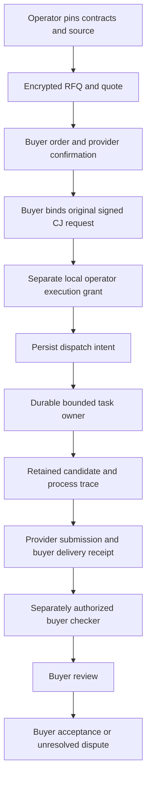

# Recoverable free coding orders

`crates/coder-labor` implements one bounded, free buyer/provider order over
[NIP-MKT](../../../nips/openagents/NIP-MKT.md) and
[NIP-LAB](../../../nips/openagents/NIP-LAB.md). It is a Rust library host with a
reproducible local acceptance fixture. It is not a public marketplace, paid
settlement service, or a general implementation of every LAB role.

The [retained acceptance evidence](../verification/2026-09-26-free-labor/README.md)
contains the original signed and encrypted events, both role journals, both
process traces, artifact manifests, and candidate bytes. The source and all
identities in that fixture are synthetic. The implementation was written in this
public repository; it contains no copied private service implementation.

## Authority and state

The host preserves four separate decisions:

1. Buyer and provider confirm the exact commercial order. The free profile has
   a zero price and fee limit. Confirmation creates no process authority.
2. The buyer binds a signed CJ request to that order. The provider's operator
   separately supplies a local task execution grant. Both must agree before
   the existing [task owner](task-owner.md) can dispatch a process.
3. The provider submits exact deliverable artifacts and an attributable RUN
   chain. The buyer records availability and runs its own admitted checker.
   A successful process or checker does not accept the order.
4. The buyer signs its review and final acceptance. Acceptance changes no
   balance and invokes no wallet. A disputed order remains unresolved because
   this first host does not execute a resolver.



A CJ request with `requires: ["openagents.labor-binding.v1"]` is accepted only
through the explicit labor decoder. Generic workers still refuse it. The host
checks the original signature and body fingerprint; it does not strip the
feature or rewrite the signed request to make a generic worker execute it.

## Supported contract

`admission::Admission` is an operator-selected closure of exact artifacts.
The receiver cannot choose the host's source, target, checker, rights, or
recipient by sending a different relay declaration. Admission checks the
pinned artifacts and the following supported subset:

| Component | Supported behavior |
| --- | --- |
| Parties | One buyer and one provider that is also the worker; all-in-one ownership is disclosed in the fixture. |
| Price | Free profile only; both price and fee limit are zero. |
| Definitions | Exact target and checker CAP definitions with complete single-component locks. |
| Source | One retained repository source in an original buyer-owned task frame; an exact commit and workspace snapshot bind the task input. |
| Instructions | A pinned empty instruction set under `coder.free-labor.empty-instructions.v1`; arbitrary instruction resolution refuses. |
| Disclosure | `coder.free-labor.disclosure.v1` admits the named buyer and worker under the explicit trusted-command profile. No implicit external model or fallback recipient is admitted. |
| Execution | Exact local program bytes, argument digest, write mode, wall time, stream cap, memory cap, source snapshot, task identity, and intent digest must match the operator grant. |
| Resources | CJ bounds cover one job, elapsed time, and retained process output. The output ceiling includes the owner's 2 MiB streamed stdout allowance plus both captured stream caps. Deliverable size has its own bound. This is not a whole-filesystem disk quota. |
| Deliverables | Complete named set, exact artifact bytes, declared schemas, and maximum sizes. |
| Checks | Pinned checker and lock, exact submission/input/criteria, attributable checker receipt, and separate buyer verification. |
| Rework | Zero executable reworks. Requests are retained as refusals; they cannot expand the existing grant or move its deadline. |
| Disputes | Buyer/provider declarations are retained with their causes and evidence. Direct final acceptance then refuses; resolver execution is unsupported. |
| Rights | Exact license, recipient, use, publication, training, evaluation, redistribution, and retention declarations are pinned. The fixture exercises restrictive rights with synthetic material. |
| Recovery | Exact duplicate events replay as duplicates. Missing or conflicting state never grants permission to replace a dispatch. |

The local command is explicitly trusted by its operator. The task owner supplies
workspace-and-system read scope, filesystem write confinement, and subprocess
bounds. Network behavior follows the actual platform boundary in the task
receipt; on macOS the current owner denies external IP access while allowing
localhost. These are explicit limits, not an arbitrary disclosure-policy engine. This lane must not be advertised as an
arbitrary untrusted remote-code execution service or as enforcement of every
possible disclosure policy.

Signatures attribute a declaration to a key. A signed provider RUN chain or
buyer checker receipt is not remote hardware attestation. The acceptance
fixture additionally runs the real provider and buyer processes locally and
retains their task-owner evidence.

## Host API and persistence

A caller constructs `book::Setup` from its admitted offering, encrypted terms,
market identity, and closure. `store::Store::open` receives the endpoint key in
memory; no secret key is serialized into its journal. Its API is:

- `receive(event, observed_time, attachments)`: verify the private event, apply
  the supported transition, and retain the event, exact attachments, local
  observation time, and outcome before returning.
- `dispatch(event, grant_bytes, task_directory, observed_time)`: check the
  confirmed order and original linkage, persist dispatch intent, submit the
  immutable task, and invoke `coder::task::owner::execute` under the separate
  grant.
- `reconcile()`: recover that same task identity. A missing or not-started task
  remains unknown; a different frozen intent refuses. It never starts another
  attempt.
- `observations()`: read the retained applied, duplicate, gap, conflict, and
  refusal observations.

The private directory is created as `0700`; ordinary journal and lock files
are `0600`. The store holds an OS lock, checks its stable inode before mutation,
rejects symlinks and hardlinks, atomically replaces a synced journal, and syncs
the directory. An initialized directory missing its journal or lock refuses
instead of starting a new history. An uncertain write poisons the open handle
until recovery. The closure is bounded to 256 artifacts and 8 MiB; the journal
is bounded to 256 observations and 16 MiB.

`transport::publish` and `transport::fetch` open bounded WebSocket connections,
require NIP-42 authentication acknowledgment, and verify exact event identity,
signature, and private recipient access. Reconnect fetches the retained event;
missing evidence is unavailable. Each operation has a ten-second deadline,
a message bound, and a 1 MiB message limit. Relay selection and endpoint-key
admission remain the calling host's responsibility. There is no discovery
service, background subscription daemon, CLI command, or deployment in this
slice.

## Reproduce the acceptance fixture

Use the repository's pinned toolchain and a worktree-specific target directory.
The fixture invokes local `/usr/bin/git`, `/bin/sh`, and `/usr/bin/cmp` through
the task owner, so it requires a supported macOS or Linux execution boundary.
It uses no model account, paid API, wallet, public relay, or private repository.

```sh
CARGO_TARGET_DIR=../target cargo test --locked -p coder-labor --lib
CARGO_TARGET_DIR=../target cargo clippy --locked -p coder-labor --all-targets -- -D warnings
CARGO_TARGET_DIR=../target cargo test --locked -p nostr \
  labor_requires_explicit_decoder_and_keeps_signed_fingerprint
```

To retain a fresh successful process and relay fixture rather than deleting its
temporary working directories:

```sh
CODER_LABOR_ACCEPTANCE_DIR=/tmp/coder-labor-acceptance \
CARGO_TARGET_DIR=../target cargo test --locked -p coder-labor \
  bounded_coding_order_runs_separate_buyer_check_and_accepts_over_relay \
  -- --nocapture
```

The test generates a synthetic Rust file returning `41`, freezes expected
bytes returning `42` before dispatch, and grants one exact shell edit. The
buyer copies the retained candidate as data into a separate checker workspace
and grants a read-only `cmp` against those frozen bytes. It publishes and
retrieves signed private agreement, linkage, submission, availability,
verification, review, and acceptance records over fresh authenticated
connections. Both role journals reconstruct acceptance after relay shutdown.

The retained run observed 47 ms for the provider process and 60 ms for the
buyer checker. Those are single process observations, not a speed benchmark or
full transaction latency. There were zero inference calls. The commercial
price is zero; total CPU, storage, energy, and operator costs are unmetered, so
`all_in_cost_usd` is null.

The suite also tests missing closure, changed pins and bytes, unauthorized
readers, invalid signatures, wrong publishers, duplicates, restart, late
delivery, failed or unknown checks, unknown execution, zero-rework refusal,
unresolved disputes, missing journals or locks, replaced lock inodes, and
closure overflow without mutation. The unknown-dispatch check injects the
persisted intent-before-submit state; it is explicitly a recovery fixture,
not a claimed operating-system crash experiment.

## Remaining product work

This completes the narrow recoverable free-order experiment from
[issue #9679](https://github.com/OpenAgentsInc/openagents/issues/9679), subject
to the retained checks and landing review. It does not demonstrate model
coding quality, independent operators, a public relay deployment, general
checker execution, arbitrary instruction policies, nonzero rework, resolver
adjudication, cancellation economics, or paid settlement. Generalize those
roles only with their own host admission and acceptance evidence. Paid orders
also need reservations, wallet authority, settlement identity, duplicate
prevention, and uncertain-payment recovery before they can execute.
