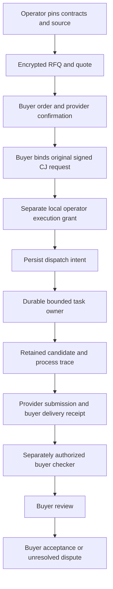

# Recoverable coding orders

`crates/coder-labor` implements one bounded buyer/provider coding order over
[NIP-MKT](../../../nips/openagents/NIP-MKT.md) and
[NIP-LAB](../../../nips/openagents/NIP-LAB.md). It is a Rust library host with a
reproducible local acceptance fixture. The default remains free. An explicitly
admitted fixed postacceptance Lightning profile additionally joins current
canonical partner custody, protected execution and checking, signed acceptance,
and authenticated inbound funding to the existing central ledger. Independent
commercial operation remains unqualified.

The [retained acceptance evidence](../verification/2026-09-26-free-labor/README.md)
contains the original signed and encrypted events, both role journals, both
process traces, artifact manifests, and candidate bytes. The source and all
identities in that fixture are synthetic. The implementation was written in this
public repository; it contains no copied private service implementation.

## Authority and state

The host preserves four separate decisions:

1. Buyer and provider confirm the exact commercial order. The free profile has
   a zero price and fee limit. Confirmation creates no process authority.
2. The buyer binds a signed CJ request to that order. The provider's operator
   separately supplies a local task execution grant. Both must agree before
   the existing [task owner](task-owner.md) can dispatch a process.
3. The provider submits exact deliverable artifacts and an attributable RUN
   chain. The buyer records availability and runs its own admitted checker.
   A successful process or checker does not accept the order.
4. The buyer signs its review and final acceptance. Acceptance changes no
   balance and invokes no wallet. A disputed order remains unresolved because
   this first host does not execute a resolver.

```mermaid
flowchart TD
    A[Operator pins contracts and source] --> B[Encrypted RFQ and quote]
    B --> C[Buyer order and provider confirmation]
    C --> D[Buyer binds original signed CJ request]
    D --> E[Separate local operator execution grant]
    E --> F[Persist dispatch intent]
    F --> G[Durable bounded task owner]
    G --> H[Retained candidate and process trace]
    H --> I[Provider submission and buyer delivery receipt]
    I --> J[Separately authorized buyer checker]
    J --> K[Buyer review]
    K --> L[Buyer acceptance or unresolved dispute]
```

A CJ request with `requires: ["openagents.labor-binding.v1"]` is accepted only
through the explicit labor decoder. Generic workers still refuse it. The host
checks the original signature and body fingerprint; it does not strip the
feature or rewrite the signed request to make a generic worker execute it.

## Supported contract

`admission::Admission` is an operator-selected closure of exact artifacts.
The receiver cannot choose the host's source, target, checker, rights, or
recipient by sending a different relay declaration. Admission checks the
pinned artifacts and the following supported subset:

| Component | Supported behavior |
| --- | --- |
| Parties | One buyer and one provider that is also the worker; all-in-one ownership is disclosed in the fixture. |
| Price | Free by default. The optional paid setup pins exact positive BTC millisatoshis, zero added platform fee, one buyer-approved selection, and a fee ceiling. It provides no escrow. |
| Definitions | Exact target and checker CAP definitions with complete single-component locks. |
| Source | One retained repository source in an original buyer-owned task frame; an exact commit and workspace snapshot bind the task input. |
| Instructions | A pinned empty instruction set under `coder.free-labor.empty-instructions.v1`; arbitrary instruction resolution refuses. |
| Disclosure | `coder.free-labor.disclosure.v1` admits the named buyer and worker under the explicit trusted-command profile. No implicit external model or fallback recipient is admitted. |
| Execution | Exact local program bytes, argument digest, write mode, wall time, stream cap, memory cap, source snapshot, task identity, and intent digest must match the operator grant. |
| Resources | CJ bounds cover one job, elapsed time, and retained process output. The output ceiling includes the owner's 2 MiB streamed stdout allowance plus both captured stream caps. Deliverable size has its own bound. This is not a whole-filesystem disk quota. |
| Deliverables | Complete named set, exact artifact bytes, declared schemas, and maximum sizes. |
| Checks | Pinned checker and lock, exact submission/input/criteria, attributable checker receipt, and separate buyer verification. |
| Rework | Zero executable reworks. Requests are retained as refusals; they cannot expand the existing grant or move its deadline. |
| Disputes | Buyer/provider declarations are retained with their causes and evidence. Direct final acceptance then refuses; resolver execution is unsupported. |
| Rights | Exact license, recipient, use, publication, training, evaluation, redistribution, and retention declarations are pinned. The fixture exercises restrictive rights with synthetic material. |
| Recovery | Exact duplicate events replay as duplicates. Missing or conflicting state never grants permission to replace a dispatch. |

The local command is explicitly trusted by its operator. The task owner supplies
workspace-and-system read scope, filesystem write confinement, and subprocess
bounds. Network behavior follows the actual platform boundary in the task
receipt; on macOS the current owner denies external IP access while allowing
localhost. These are explicit limits, not an arbitrary disclosure-policy engine. This lane must not be advertised as an
arbitrary untrusted remote-code execution service or as enforcement of every
possible disclosure policy.

Signatures attribute a declaration to a key. A signed provider RUN chain or
buyer checker receipt is not remote hardware attestation. The acceptance
fixture additionally runs the real provider and buyer processes locally and
retains their task-owner evidence.

## Host API and persistence

A caller constructs `book::Setup` from its admitted offering, encrypted terms,
market identity, and closure. `store::Store::open` receives the endpoint key in
memory; no secret key is serialized into its journal. Its API is:

- `receive(event, observed_time, attachments)`: verify the private event, apply
  the supported transition, and retain the event, exact attachments, local
  observation time, and outcome before returning.
- `dispatch(event, grant_bytes, task_directory, observed_time)`: check the
  confirmed order and original linkage, persist dispatch intent, submit the
  immutable task, and invoke `coder::task::owner::execute` under the separate
  grant.
- `reconcile()`: recover that same task identity. A missing or not-started task
  remains unknown; a different frozen intent refuses. It never starts another
  attempt.
- `observations()`: read the retained applied, duplicate, gap, conflict, and
  refusal observations.

The private directory is created as `0700`; ordinary journal and lock files
are `0600`. The store holds an OS lock, checks its stable inode before mutation,
rejects symlinks and hardlinks, atomically replaces a synced journal, and syncs
the directory. An initialized directory missing its journal or lock refuses
instead of starting a new history. An uncertain write poisons the open handle
until recovery. The closure is bounded to 256 artifacts and 8 MiB; the journal
is bounded to 256 observations and 16 MiB.

`transport::publish` and `transport::fetch` open bounded WebSocket connections,
require NIP-42 authentication acknowledgment, and verify exact event identity,
signature, and private recipient access. Reconnect fetches the retained event;
missing evidence is unavailable. Each operation has a ten-second deadline,
a message bound, and a 1 MiB message limit. Relay selection and endpoint-key
admission remain the calling host's responsibility. There is no discovery
service, background subscription daemon, or deployment in this
slice.

## Explicit paid fulfillment

`book::Setup.paid` selects the fixed postacceptance Lightning lane. It pins the
canonical accepted partner assignment and its separately priced BTC obligation
triggered by accepted delivery,
source and disclosure closure, trusted policy issuer and current epoch, provider
and central receive destinations, and independent buyer checker. Its exact
scope allows one bounded UTF-8 patch file and zero executable revisions or reworks.
A request for additional work retains its signed cause and support action; a new
accepted order is required to execute it.

`dispatch_paid` reads the current signed policy and authenticated canonical
pipeline before dispatch and while the existing task owner runs. Canonical
custody locks are released between checks so permission can be revoked. A signed
cancellation, rework request, or unavailable current admission stops unaccepted
execution. The existing task identity and failed or unknown result remain
retained. Policy, credentials, labor journals, checker custody, wallet state,
and the central ledger must stay outside provider workspace writes.

`verify_paid_delivery` runs the separately admitted `/usr/bin/cmp` checker under
the same bounded task owner. Before earning can accrue, the host joins the exact
provider patch to retained task artifacts and RUN dispatch evidence, and joins
the signed LAB verification to the actual protected checker result. Passing a
checker does not supply buyer acceptance. Later cancellation does not erase an
already accepted obligation.

`openagents labor execute` requires `--pipeline`, `--credential`, and
`--authority-evidence` for a paid book. `labor verify` uses those same explicit
private sources. `labor support` receives one signed private support, cost,
rework, or cancellation event; it queues narrowing notices for a running book.
`labor invoice` additionally requires an explicit resident `--wallet-home` and
prepares one exact invoice after acceptance. The buyer separately authorizes
payment through `openagents x402 node pay BOLT11 --max-fee-msat N`, where `N`
is the exact accepted fee ceiling. The payer must check the retained invoice,
amount, central destination, and payment deadline before authorizing it.
`labor fund --ledger FILE` verifies the resident node's exact inbound lookup
before calling `record_worker_earned`. It opens no replacement node and performs
no outgoing payment or payout. It verifies the retained signed invoice separately
from optional lookup invoice metadata and leaves absent fee evidence unknown.
Invoice creation and funding lookup carry the admitted node identity to the
resident, which refuses a replaced node before either operation.
It rechecks the admitted payout destination after the lookup before accrual.

Interrupted invoice preparation remains unknown and cannot silently issue a
replacement. Unknown funding creates no liability; failed or conflicting
funding refuses credit. Exact retries, restarts, and relay replacement preserve
the obligation and payment identities. The existing central ledger retains the
worker payable share and owns later payout reservation and reconciliation.

The private paid report retains attributable support and signed cost evidence
for coordination, execution, checking, failed attempts, and payment fees. Missing
categories stay unknown, and no complete all-in cost or commercial qualification
is inferred. BTC fulfillment remains explicitly denominated; USD service
contribution remains unknown until separately compatible cost evidence exists.
Real independence, source rights, customer demand, wallet funding, and payout
qualification remain in [`NEEDS_OWNER.md`](../../../NEEDS_OWNER.md).

## Reproduce the acceptance fixture

Use the repository's pinned toolchain and a worktree-specific target directory.
The fixture invokes local `/usr/bin/git`, `/bin/sh`, and `/usr/bin/cmp` through
the task owner, so it requires a supported macOS or Linux execution boundary.
It uses no model account, paid API, real wallet, public relay, or private
repository. The paid test uses a signed fake BOLT11 and authenticated fake receive
lookup; it exercises actual local execution and central liability with synthetic
source and operators.

Run `cargo test --locked -p coder-labor --lib` through the build lease with your
existing `CARGO_TARGET_DIR`. To include the paid CLI process fixture, first build
`openagents-cli --bin openagents` through the same lease, then set
`CODER_LABOR_CLI` to that binary's absolute path for the library test.

To retain a fresh successful process and relay fixture rather than deleting its
temporary working directories:

Set `CODER_LABOR_ACCEPTANCE_DIR` to a directory below `openagents scratch`, then
run the same leased library test. It prints the retained fixture directories.

The test generates a synthetic Rust file returning `41`, freezes expected
bytes returning `42` before dispatch, and grants one exact shell edit. The
buyer copies the retained candidate as data into a separate checker workspace
and grants a read-only `cmp` against those frozen bytes. It publishes and
retrieves signed private agreement, linkage, submission, availability,
verification, review, and acceptance records over fresh authenticated
connections. Both role journals reconstruct acceptance after relay shutdown.

One retained free-order run observed 47 ms for the provider process and 60 ms for the
buyer checker. Those are single process observations, not a speed benchmark or
full transaction latency. There were zero inference calls. The commercial
price is zero; total CPU, storage, energy, and operator costs are unmetered, so
`all_in_cost_usd` is null.

The paid fixture negotiates a synthetic 10,000 msat price. Its optional CLI
process check reopens already verified journals, reconciles authenticated fake
funding twice, refuses unauthorized or canceled execution, and checks the
retained funding state. Fresh provider and protected checker execution run
through the owning Rust API in the same fixture. These checks do not establish
an independently operated paid service or real collection.

The suite also tests missing closure, changed pins and bytes, unauthorized
readers, invalid signatures, wrong publishers, duplicates, restart, late
delivery, failed or unknown checks, unknown execution, zero-rework refusal,
unresolved disputes, missing journals or locks, replaced lock inodes, and
closure overflow without mutation. The unknown-dispatch check injects the
persisted intent-before-submit state; it is explicitly a recovery fixture,
not a claimed operating-system crash experiment.

## Remaining product work

The free-order experiment from
[issue #9679](https://github.com/OpenAgentsInc/openagents/issues/9679) and the
explicit paid lane have scoped local acceptance checks. Their fixtures do not
demonstrate model coding quality, independent operators, a public relay
deployment, general checker execution, arbitrary instruction policies,
nonzero rework, resolver adjudication, or real commercial settlement. Generalize
those roles only with their own host admission and acceptance evidence. Real
funding, payout, and complete costs remain owner qualification steps.
