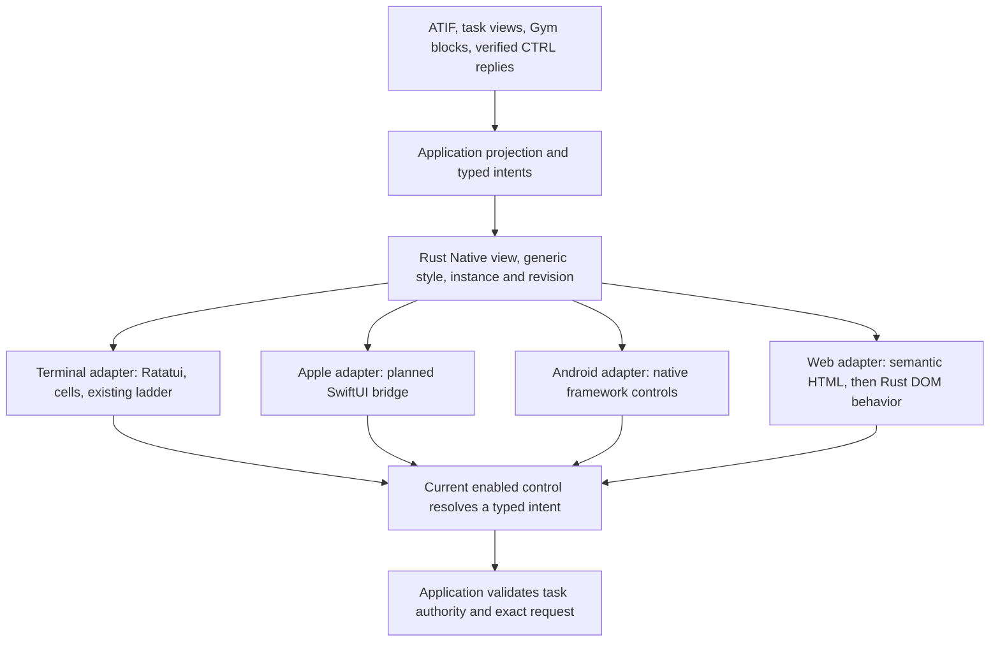

# Adopting Rust Native in Coder

Status: adoption plan, September 26, 2026. The first production change moves
the existing public palette into the application crate `coder-ui` and preserves
the terminal's exports. Rust Native remains reusable, with no Coder dependency
or palette. Its semantic vocabulary includes `Stack`, `List`, `Text`, and
`Button`.
Native renderers, text editing, transcript virtualization, and a complete
Coder screen remain subsequent work.

This plan reviews public source at `6958741c4a72` and the accompanying Rust
Native foundation. It uses the separate Coder checkout only as design
reference. No private source, prompts, service contracts, or credentials are
copied. No platform application, model call, or benchmark run is part of this
adoption review.

## What the existing code already provides

The public terminal has a useful design system, but it is not yet a shared
native component library. Preserve its behavior while extracting the parts
that have a real second consumer.

| Public source | Existing contract | Adoption decision |
| --- | --- | --- |
| [Terminal intensity](../../../crates/coder-terminal/src/intensity.rs) | Four ordered amber intensities, two background colors, stable CSS class names, and snapshot digits. | Move the definitions to `coder_ui::theme`; preserve their values, ordering, and terminal import paths. |
| [Terminal ladder](../../../crates/coder-terminal/src/ladder.rs) | RGB, indexed color, `NO_COLOR`, and caller-selected dim/bold fallback. | Keep in the terminal adapter. These are terminal capabilities, not universal style semantics. |
| [Hairline drawing](../../../crates/coder-terminal/src/hairline.rs) | Ratatui frames and labels placed in rules, with narrow-area behavior. | Keep its public API and drawing rules. A native group need not imitate a terminal cell border. |
| [Markdown](../../../crates/coder-terminal/src/markdown.rs) | A parsed block tree, inline marks, rendered lines, width-dependent wrapping, and literal raw HTML. | Later extract parsing and semantic blocks from Ratatui styles and cell layout. Keep current entry points during that change. |
| [Editor](../../../crates/coder-terminal/src/editor.rs), [keys](../../../crates/coder-terminal/src/keys.rs), and [composer](../../../crates/coder-terminal/src/composer.rs) | A byte-offset, grapheme-aware draft/caret model; terminal key bindings; framed display. | Preserve the terminal implementation. Its current editor is not a complete mobile selection/composition contract. |
| [Decision evidence](../../../crates/coder-terminal/src/decision.rs) and [progress](../../../crates/coder-terminal/src/progress.rs) | Explicit unknown, unavailable, simulated, measured, verification, and execution states with readable detail. | Preserve these distinctions in future semantic projections. Do not replace them with generic success/error badges. |
| [Scrollback](../../../crates/coder-terminal/src/scrollback.rs) and [event lanes](../../../crates/coder-terminal/src/events.rs) | Bounded display retention and width caches; separate reliable outcomes from bursty text. | Keep transport, scheduling, and retention policy outside the component tree. Make display truncation visible and retain a route to original evidence. |
| [Mobile fixture](../../../crates/coder-mobile-probe/src/lib.rs) | One synthetic ATIF source with text, HTML, Unicode, and full-transcript exports. | Use as the first follow-on semantic consumer before attaching remote authority. |
| [iOS probe](../../../crates/coder-mobile-probe/src/ios.rs) and [Android probe](../../../crates/coder-mobile-probe/src/android.rs) | Actual UIKit controls through Rust Objective-C calls and Android framework widgets through Rust JNI. | Reference working platform boundaries. Neither is a SwiftUI or Compose renderer. |
| [Gym transcript](../../../crates/gym/src/runs_transcript.rs) | Recorded sources become typed transcript blocks with full content, timestamps, and optional costs. | Keep ingestion and source interpretation in Gym. Project those blocks into shared components without importing Gym into the UI core. |
| [Gym replay](../../../crates/gym/src/runs_replay.rs), [replay terminal](../../../crates/gym/src/runs_replay_tui.rs), and [run terminal](../../../crates/gym/src/runs_tui.rs) | One replay clock, recorded versus estimated timing, expandable transcript rows, navigation, and details. | Migrate presentation a pane at a time; preserve the replay model, timestamp interpretation, and existing controls. |

The private reference's centralized `coder-ui-core` demonstrates useful
separation among component meaning, action identity, renderer bindings, and a
catalog of deterministic examples. Its terminal, graphics, and HTML adapters
also show why platform differences need explicit contracts. Its character-grid
layout, private account/service assumptions, input overlays, and platform
bridges are not public implementations to import. Reimplement selected ideas
around this repository's public task, evidence, and authorization contracts.

## Keep the dependency direction explicit

Rust Native owns reusable semantic vocabulary, generic style resolution,
and view-instance validation. `coder-ui` owns Coder palettes and application
components; the framework has no product defaults. It must not depend on `coder`, `gym`, a relay,
an executor, a wallet, or a clock. Adapters own platform objects and rendering.
Applications own their typed intents and decide whether an intent may become
an effect.

A valid view activation resolves a current enabled control's intent. It does
not prove a physical user gesture or grant execution, access to a file, relay
publication, steering, or cancellation. In particular, a view revision is not a task-owner generation
or a verified evidence cursor. Keep all three identities distinct.

Remote task clients continue to use the client-only
[`coder-control` configuration and verification](../../../crates/coder-control/src/client.rs).
Its authorized view reaches the application projection only after signature,
recipient, grant, artifact, and scope checks. Rendering does not fetch a link,
publish an event, or interpret transcript text as instructions. Keys, secure
storage, retained outboxes, and reconnect state stay outside Rust Native.

## File-by-file migration map

The first two rows describe the foundation change. Later rows name proposed
small changes, not files or integrations that are already implemented. Row
numbers identify targets, not dependency order. Follow the [build order](build-order.md):
static HTML belongs in RN1, and native adapters can proceed alongside RN2.

| Target | Public files to change | Concrete change and compatibility boundary |
| --- | --- | --- |
| 1 | `crates/rust-native/src/{lib,style,view}.rs`, `crates/rust-native/Cargo.toml`, root manifests | Add the reusable Rust foundation: generic colors, typed per-property styles with ordered composition, and validated serializable `View<I>`, `Node<I>`, and `Element<I>`. Start with stack, text, and button semantics only. Keep the default dependency surface free of a renderer or application. |
| 2 | `crates/coder-terminal/src/intensity.rs`, `crates/coder-terminal/src/lib.rs`, `crates/coder-terminal/Cargo.toml` | Keep palette ownership in `coder-ui` with terminal compatibility reexports. Preserve `coder_terminal::{Intensity, NEAR_BLACK, NEAR_BLACK_TINT}` and every existing color/class/digit. Keep `Ladder` and Ratatui APIs local. Existing Gym and Verse callers should not need source changes. |
| 3 | New `crates/rust-native/tests/` fixture coverage and catalog example; `crates/coder-mobile-probe/src/lib.rs` | Build a small synthetic status section from stack/text/button nodes. Check source text, ordering, labels, explicit unknown values, disabled states, and activation identity. Preserve existing fixture exports; label this an example rather than task control. |
| 4 | New `crates/coder-terminal/src/native.rs`; `crates/coder-terminal/src/lib.rs`; a focused terminal example | Implement the first renderer adapter for the initial subset. Use existing `Ladder`, `frame`, and wrapping. Map focus and activation to current node identities. Unsupported semantics must produce an explicit refusal or documented faithful fallback. |
| 5 | `crates/coder-terminal/src/markdown.rs`; proposed `crates/rust-native/src/text.rs` or a dedicated pure text crate | Separate parse/semantic data from `Marks::style`, terminal wrapping, and rendered lines. Preserve the old Markdown facade. Add fixtures for nested lists, tables, links, raw HTML, fenced code, Unicode, and exact source recovery before switching a consumer. Do not perform this extraction just to add a dependency. |
| 6 | `crates/gym/src/runs_tui.rs`, `runs_replay_tui.rs`, and a new Gym-local projection module | Start with the replay header and its unavailable/error state. Then move transcript row headers and expansion controls. Keep `runs_transcript.rs`, `runs_replay.rs`, and original artifact readers authoritative. Keep chronology/interesting ordering and playback speed in the existing controller. |
| 7 | `crates/coder/src/main.rs` and a new Coder-local presentation module | Extract presentation from the current draw loop. Adopt the same status/transcript primitives after Gym proves them. Keep `turn::run`, task ownership, permits, event handling, and the terminal editor unchanged in this slice. |
| 8 | `crates/coder-mobile-probe/src/lib.rs`, `ios.rs`, `android.rs`, `main.rs`; proposed adapters under Rust Native | Replace one synthetic status section through the adapter while retaining a baseline fixture route. Move long transcripts only after stable native row identity and accessible paging exist. Record UIKit and SwiftUI as separate adapter implementations. |
| 9 | A dedicated Coder client presentation layer over `coder-control`; native app entry points | Connect verified task pages to the same projection. Add an exact persisted outbox and explicit stale, revoked, expired, disconnected, and delivery-unknown states before enabling correction/cancel controls. A disabled control must carry its reason. This is a client milestone, not a generic UI-core feature. |
| 10 | Web adapter in RN1/RN3 and, separately, `crates/gateway/src/dashboard.rs` or `playground.rs` | Begin with inert semantic HTML in RN1, then interactive DOM support in RN3. Reuse semantic components where the product contract matches. Preserve existing HTTP authentication, escaping, and disclosures. Gateway account views are a later consumer; do not force all service pages or server logic through the first Coder transcript migration. |

Do not duplicate the Coder application palette in mobile or web code. Conversely, do not
make application code depend on a terminal crate just to obtain colors. The
compatibility reexport allows current Verse code to keep its existing imports
while later choosing the application theme path on its own schedule. Verse's
world renderer remains a specialized renderer; adopting theme provenance does
not turn it into a native widget surface.

## Native component mapping

The initial three elements establish the contract. The remaining rows are
extensions that need their own schema, adapter behavior, and acceptance.
Sharing meaning does not require identical geometry or typography.

| Semantic element | Terminal | Apple target | Android target | Web target |
| --- | --- | --- | --- | --- |
| Stack | Ordered rows/columns within terminal bounds. | SwiftUI `VStack`/`HStack` with native sizing; UIKit grouping is a separately named fallback. | Native `LinearLayout` or another admitted layout container. | Semantic grouping with CSS layout. |
| Text | Existing Unicode wrapping and intensity styles. | SwiftUI `Text`; selectable long text needs a separately qualified selection path. | `TextView` with appropriate selection behavior. | Text nodes and semantic text elements, never untrusted `innerHTML`. |
| Button | Focusable labeled affordance with keyboard/mouse activation. | SwiftUI `Button`. | Native `Button` and an explicitly implemented Rust callback bridge. | Native `button`, keyboard focus, and disabled semantics. |
| Text input, planned | Existing terminal editor and key table. | Native composing control through the SwiftUI bridge; preserve selection and marked text. | `EditText` with native IME composition. | Labeled `input` or `textarea`, with composition-aware events. |
| Transcript list, planned | Visible rows with stable source/event identities and full-detail navigation. | Native lazy/recycled rows with readable headings and expandable records. | A recycled native list; the current probe uses `ListView`. | Semantic entries with accessible bounded paging and source-detail links. |
| Disclosure and details, planned | Existing open/closed row commands plus a full-record view. | Native disclosure/navigation control with restored focus. | Native expanded row or details screen. | `details`/`summary` or an equivalent accessible disclosure. |
| Table/code, planned | Terminal-aligned columns and source-preserving code blocks. | Native text/list/table treatment with horizontal access when necessary. | Native text/table treatment with accessible row and column labels. | Semantic table and `pre`/`code`, with safely handled links. |

SwiftUI is the intended Apple adapter, not another name for the existing
UIKit probe. Apple's [UIKit integration documentation](https://developer.apple.com/documentation/swiftui/uikit-integration)
describes the explicit hosting/representable boundary. A thin SwiftUI bridge
must expose rendering and platform callbacks to Rust while Rust retains
application state and business logic. It requires its own narrow language and
build boundary; no Swift implementation is added by this foundation. Treat a
UIKit-only fallback as UIKit support, not SwiftUI completion.

Android framework widgets are the shortest path from the public probe. Compose
is not implied by JNI calls to those widgets. Adding Compose would require a
separate justified bridge and build decision. Keep native text editing intact;
Android's [input-method contract](https://developer.android.com/develop/ui/views/touch-and-input/creating-input-method)
distinguishes composing text from committed text and physical key events.

The first web renderer can produce semantic HTML entirely in Rust. Interactive
DOM behavior is a later adapter; [web-sys](https://wasm-bindgen.github.io/wasm-bindgen/web-sys/index.html)
provides Rust bindings to browser APIs. Declare any generated binding/runtime
glue and its distribution requirements. A static HTML export does not establish
an interactive authenticated web client, and a canvas is not the fallback for
missing semantic DOM controls.

## Risks that the adapters must handle

**Accessible meaning and contrast.** Share labels, roles, relationships,
enabled state, and reasons alongside visual style. Preserve text distinctions
when color is absent. The existing low-intensity amber tokens are not evidence
of accessible body-text contrast on every display; native text can require a
more legible semantic style and system accessibility settings. Apple's
[accessibility guidance](https://developer.apple.com/documentation/swiftui/accessibility-fundamentals)
also requires attention at SwiftUI/UIKit integration boundaries. A semantic
tree test does not establish VoiceOver or TalkBack behavior.

**Composition and selection.** The current terminal editor has a caret and
history, not the complete native selection/marked-text contract. Avoid two
concurrent draft owners. Define which layer owns composition, map UTF-16
platform ranges and UTF-8 source ranges explicitly, and apply committed edits
without resetting an active composing region. Include right-to-left text,
joined emoji, accented characters, selection replacement, and undo in the
future acceptance corpus.

**Long transcripts.** The retained
[mobile feasibility result](../design/rust-mobile-feasibility.md)
shows why one enormous native text view is insufficient: the initial Android
accessibility output stopped before the end of the 2,000-step fixture.
Virtualization must preserve logical event identity, reading position, and
access to the entire source. One very large tool result also needs bounded
detail pages; recycling short rows alone does not solve it. Keep missing,
damaged, partial, and undisclosed evidence distinct from an empty transcript.

**Lifecycle and identity.** Apply UI changes on the platform's UI thread.
Invalidate callback identities when a view instance is replaced. Backgrounding,
rotation, process death, and reconnect must preserve or explicitly discard
drafts, selection, reading position, and unacknowledged actions. A reused list
cell must not keep the previous task's callback. The UI core must not quietly
retry application effects when rebuilding a tree.

**Fallbacks.** Declare adapter support per semantic feature. Missing text
selection, link handling, scrolling, accessibility, or a required control is
not cosmetic. Refuse the unsupported interaction or present a visible,
readable fallback that retains meaning. Never advertise a control whose
platform path silently does nothing. In the terminal, keep `NO_COLOR`, narrow
widths, and keyboard-only operation; in native views, respect dynamic type,
safe areas, keyboard insets, and reduced motion.

**Untrusted content and disclosure.** Links, Markdown, source paths, and trace
text are data. Opening external content is a separate application action.
Do not parse terminal escape sequences as renderer commands or allow a
transcript to create authorized controls. Logs and accessibility dumps can
disclose the same content as the screen; use synthetic fixtures for examples
and retain only authorized evidence in product diagnostics.

## Completion checks for each slice

These are acceptance requirements for subsequent implementation, not a request
to launch platform or benchmark runs during this documentation task.

| Slice | Required check | What it does not prove |
| --- | --- | --- |
| Palette foundation | Exact existing values/order/classes/digits; terminal reexport compatibility; focused terminal and neutral-core checks. | A native renderer, accessibility, or visual parity. |
| Semantic core | Invalid/duplicate identities and stale instance/revision activations refused; only current enabled buttons resolve intents; deterministic style precedence and serialization; bounded tree validation. | Host authorization or effect idempotency. |
| First adapter | One synthetic stack/text/button fixture renders with readable labels and focus order; unsupported semantics are explicit. Keep deterministic adapter fixtures independent of paid services. | Other platforms or production application behavior. |
| Markdown extraction | Existing terminal fixtures and source text still match; unsafe HTML remains inert; links/images retain their target/alt semantics; wrapping stays adapter-specific. | Browser sanitization for an adapter that has not been implemented. |
| Transcript consumer | Original identities, order, time provenance, unknown costs, all expansion paths, and the final byte remain reachable; changes in viewport do not activate another row. | New benchmark outcomes or proof that incomplete source artifacts exist. |
| Native input/lifecycle | Later authorized target testing covers composition, selection, accessibility, background/foreground, restart, rotation, and long records. Record simulator/emulator and physical-device results separately. | A target compile is not runtime acceptance; one device is not every supported release. |
| Remote task control | Verified page/cursor continuity, disclosure/refusal states, exact persisted action identity, stale/revoked grant refusal, and independently retained host result. | A local callback or optimistic screen update is not successful task control. |

Use focused code tests for the changed layer and relevant consumers. Keep
platform runtime work separately authorized and separately reported. Preserve
the existing renderer until its replacement passes the slice's checks; the
release matrix must not block an independent palette or semantic-core change.

The first adoption is complete when the palette has one application owner and
existing terminal behavior remains compatible. The next useful outcome is one
readable synthetic status surface rendered from the initial semantic subset.
A shared Coder transcript, native editing, and cross-device task control each
need their own later completion record.
