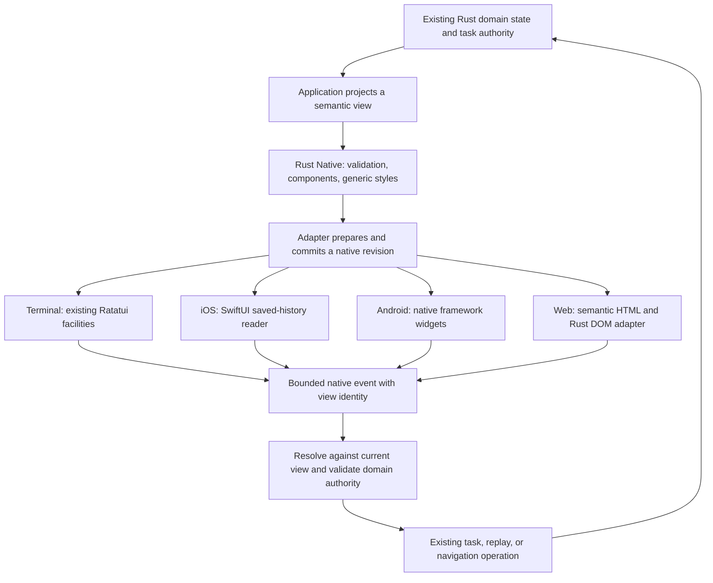

# Coder shared UI architecture

Status: experimental foundation and proposed framework direction, September 26,
2026. [Issue #9693](https://github.com/OpenAgentsInc/openagents/issues/9693)
covers the initial crate. The later [read-only iOS reader](../guides/mobile-readonly.md)
implements one native application slice; its [receipt](../verification/2026-09-26-mobile-reader.md)
records the checked platforms and remaining limits. Sections distinguish that
delivery from general adapter contracts and complete suite support.

## Product and architecture

Coder should define a task card, transcript, composer, approval, or replay
control once in Rust and present it appropriately on each surface. An iOS
button should be a native button, with native accessibility and input behavior.
A terminal button needs keyboard navigation and a terminal representation.
The common contract is meaning and behavior, not identical pixels or a
character grid stretched onto a phone.

Effect Native provides the useful separation among a serializable component
tree, named typed intents, and platform renderers. React Native provides
lessons about immutable render revisions, native mounting, measurement, and
input synchronization. Rust Native reimplements selected ideas in this
repository; it does not port either runtime. The [source review](references.md)
records what was inspected and what the earlier implementations did not prove.

The reusable core data contract exists in Rust Native. Coder theme values
belong to `coder-ui`, outside that core. The iOS reader connects the core to
SwiftUI controls and a Rust application host. General mount reconciliation,
editable input, and other platform integrations remain subsequent work.

## Ownership and dependency direction

| Layer | Owns | Must leave elsewhere |
| --- | --- | --- |
| `rust-native` | Semantic component vocabulary, style composition, generic color values, immutable validated views, interaction identity. | Network clients, credentials, task execution, clocks, persistence, platform objects. |
| Application projection | Maps task, ATIF, replay, or account state into a view; defines its closed intent enum. | Platform handles and a second source of truth for task outcomes. |
| Application host | State transitions, current view identity, subscriptions, effect dispatch, durable task controls, disclosure and authorization. | Native layout and direct component-specific drawing. |
| Platform adapter | Native widgets, layout, focus, accessibility, input composition, mounting, event translation. | Inferring success, granting permission, calling models, or inventing task lifecycle transitions. |

The core has no dependency on `coder`, `gym`, `atif`, or Nostr. An application
can depend on those libraries to form a projection. Keep application widgets
such as `TaskCard` as Rust functions or modules that build primitives before
adding another wire kind. `coder-ui` owns the application theme and can collect shared
application projections without making them the framework's domain model.

The existing task host remains authoritative when a UI disappears. Closing a
window releases its subscriptions and native objects; it does not cancel a
remote task. Explicit cancellation still passes through the task controller's
scope and lifecycle checks. UI instance IDs, task-owner generations, and
evidence cursors are separate identities.

## View and interaction contract

### Implemented schema

`View<I>` contains the schema name `rust-native.view.v1`, a surface `instance`,
a positive `revision`, and a root `Node<I>`. Each node has a stable `key`, a
resolved `Style`, and one `Element<I>`:

| Element | Meaning |
| --- | --- |
| `Stack` | Ordered children on a horizontal or vertical axis. No universal pixel layout algorithm is implied. |
| `List` | A labeled bounded window of stable rows; the application retains paging and original content. |
| `Text` | Literal Unicode or selectable Markdown with an explicit role. Links and embedded content remain inert unless the application separately admits them. |
| `Button` | A visible nonempty label, enabled state, and typed application intent. |

Validation checks the schema, identities, globally unique node keys in the
view, button labels, and resource bounds. `ValidatedView<I>` exposes an
immutable view and the checked serialization/activation paths. Unknown core
fields and element variants are rejected. The application should use a closed
intent enum and validate any domain identifiers carried within it.

| Bound | Current limit |
| --- | --- |
| Surface, node, and style identifiers | 1–96 ASCII bytes: letters, digits, `_`, `-`, `.`, and `:`. |
| Encoded view | 512 KiB, including style, intent payloads, and JSON escaping. |
| Nodes | 1,024. |
| Node depth | 16, counting the root as one. |
| JSON nesting | 96 containers, including intent payloads; below the decoder's recursion limit. |
| Text value or button label | 64 KiB in UTF-8 bytes. |

Input byte and JSON nesting bounds apply before decoding. Constructed trees
also pass structural and encoded bounds. These are initial per-view limits,
not a bound on an application's entire data store or on arbitrary caller
code. Long transcripts need a bounded window and retained source access,
rather than an ever-growing full tree. App-defined serialization/deserialization
code is compiled host code, not a plugin sandbox.

The pre-alpha schema is deliberately small. A new component or changed wire
meaning needs an explicit schema compatibility decision and fixtures; do not
quietly reinterpret a version already written to disk. There is no stable ABI
or automatic migration of old views yet.

### Revisions and activation

Allocate a fresh surface instance whenever a screen is mounted as a new
lifetime. Within that lifetime, increase the revision when publishing a new
immutable tree; do not reuse a revision for different content. The application
host must enforce those lifecycle rules; the core validates one view at a time.

`Activation` carries only `instance`, `revision`, and `node`. Calling
`activate` on the application's current validated view rejects a stale
instance/revision, a missing or noninteractive node, or a disabled button. A
valid activation resolves the intent stored in that tree. It cannot substitute
an arbitrary action payload.

This is a consistency check, not proof of a physical user gesture, source
authenticity, or permission. The host still authenticates the event source,
checks current domain state and scope, and assigns any durable operation ID.
Repeated activations can resolve the same intent; idempotency belongs to the
operation. The initial strict revision policy may reject a click concurrent
with a refresh. Prefer that visible stale-view response to applying an action
against changed data. A more permissive policy needs its own exact preconditions.

## Native rendering: delivered subset and remaining contract

Borrow React Native's separation of rendering, committing, and mounting without
recreating React, Fabric, or Yoga. A projection builds an immutable semantic
tree. An adapter validates support and prepares changes. Its mount phase
applies the revision on the platform's UI thread and acknowledges which
revision became visible. See the pinned [architecture sources](references.md).

Keep both the latest received revision and the last applied revision. A
callback must name the revision of the widget that generated it. A dropped,
failed, or superseded mount must never report that a newer view is displayed.
Use stable keys to reconcile controls without losing focus, selection, list
position, or native object identity unnecessarily. Do not allow an old mount
completion to replace a newer revision. The initial code does not implement
a general reconciler or applied-revision acknowledgment protocol. The reader
uses a narrower serialized Rust/native bridge with revision-bound callbacks;
its working controls do not establish the complete framework protocol.

| Surface | Initial adapter direction | Existing foundation and limits |
| --- | --- | --- |
| Terminal | `coder-terminal` maps semantics through Ratatui, its ladder, and existing input facilities. | Theme adoption works now. Framing, Markdown, editor, and key bindings remain intact. A generic view renderer is still needed. |
| iOS | Implemented read-only SwiftUI adapter using `Text`, `Button`, `VStack`/`HStack`, and `List`. | [Reader source](../../../bins/coder-ios/host/App/NativeView.swift) and [receipt](../verification/2026-09-26-mobile-reader.md) cover paged saved history, selection, inert Markdown, and follow behavior. Shared editable input and physical-device acceptance remain open. The earlier UIKit probe is separate. |
| Android | Rust JNI adapter to native framework text, button, layout, and list widgets. | Reuse the public probe's platform boundary. A Compose adapter would be a separate decision, not a dependency of the first implementation. |
| Web | Start with escaped semantic HTML; add Rust/Wasm DOM reconciliation and bounded events. | Static HTML proves serialization and semantics, not browser interactions. Use real controls and accessible roles, not a canvas for every screen. |
| Desktop and Verse | Add appropriate native or existing terminal adapters; share semantic overlays where useful. | Verse retains its `wgpu` world and controller. A scene renderer is not replaced by a UI component tree. |

Apple documents [hosting SwiftUI in UIKit](https://developer.apple.com/documentation/swiftui/uihostingcontroller).
SwiftUI's Swift types require a thin Swift boundary; claiming a pure Rust
call to SwiftUI would hide necessary platform glue. Keep that glue limited to
view mounting, native state, and callbacks. Rust retains application state,
authorization, protocol handling, and domain effects. The initial foundation
added no SwiftUI source; the reader now supplies that narrow boundary under
[`bins/coder-ios/host`](../../../bins/coder-ios/README.md), separately from the
reusable `rust-native` crate.

Before building a foreign-function boundary, define its version, byte-buffer
ownership, release function, callback lifetime, error result, and threading
rules. Use bounded encoded packets or a specified C representation. Do not
pass Rust `String`, `Vec`, enums, references, or panics across a C ABI. Scope
handles to a surface lifetime and reject callbacks after disposal.

Adapters should publish support per component/property as native, approximate
with a stated fallback, or unsupported. Make unsupported essential behavior
visible to the application. Do not silently discard a button, selection state,
accessibility role, or permission prompt. This support report is planned;
current structural validation does not check platform capabilities.

## Styles, layout, and accessibility

The implemented stylesheet is a typed registry of declarations. Canonical
leaf properties compose in caller order. Explicit reset removes earlier local
choices and resolves against supplied defaults. There is no implicit parent
inheritance, CSS selector language, runtime CSS string, or StyleX compiler.
The [styling design](styling-design.md) defines the planned theme and platform mapping
work and explains the deliberate shorthand difference from StyleX.

Treat terminal cells, points, density-independent pixels, and browser CSS
pixels as different units. The initial `Space` tokens have no universal numeric
conversion. Each adapter documents its mapping, scaling, direction, and
rounding. Native text uses native font metrics and dynamic text sizing. A
shared `Stack` is an ordering and layout intention, not a guarantee of equal
wrapping across platforms.

The amber theme preserves current product identity. Accessibility preferences
can require higher contrast, system colors, reduced motion, or larger text;
these belong in explicit theme/environment resolution. Information must not
depend on amber intensity alone. A disabled control remains semantically
disabled; a status still says whether a check passed, failed, was not run, or
is unknown.

Before adding more components, define accessible name, role, state, grouping,
focus order, and keyboard operation. Native control availability is useful but
does not itself prove correct accessibility. Retain checks for terminal
keyboard navigation, VoiceOver, TalkBack, browser semantics, and accessible
virtualized content at the adapter stage.

## Native text input and long content

Do not add a text field as a string property plus an unversioned change
callback. The contract must account for native editing, selection, composition,
dictation, secure text, autocorrection, and programmatic replacement. Keep a
local native draft while an edit is composing; do not replace it from a stale
Rust render after every keystroke.

Use an edit sequence and acknowledged application revision to reconcile a
programmatic update. Specify offset units at each boundary: the terminal uses
UTF-8 byte offsets with grapheme-aware movement, while native APIs can use
UTF-16 indices. Conversion must reject invalid boundaries and preserve emoji
and composed text. Submit is a distinct typed intent and still checks current
task authority. Input support remains planned until these rules and focused
fixtures exist.

Lists and transcripts need stable item identities, windows/cursors, selection,
copy/export, and access to full retained text. Preserve Gym's recorded versus
estimated timestamps, replay clock, literal tool output, costs, and source
references. Share Markdown parsing and a semantic document model only after
separating them from Ratatui layout; keep raw HTML inert. Do not create thousands
of widgets merely to claim full-transcript support, or truncate without telling
the reader where the complete record lives.

## State, services, and lifetimes

The Effect Native idea also concerns state, services, concurrency, and cleanup.
In Rust, start with ordinary state structs, explicit update functions, existing
async facilities, and RAII. An application host can combine a state reducer,
service handles, a bounded event queue, cancellable view subscriptions, and a
pure projection. There is no need to build an Effect clone or another agent
runtime before drawing the first shared screen.

Distinguish reliable actions/outcomes from coalescible rendering updates. A
burst of status frames may supersede older frames; it may not silently drop a
cancel acknowledgment or user submission. Bound queue capacity, surface
backpressure, and schedule a mount without blocking the UI thread on network
or inference. Model calls, subprocesses, retries, credentials, and durable
task lifecycles remain in their existing libraries.

## Network and extension boundaries

Serializability helps testing, snapshots, and native bridges. It does not make
every tree safe to accept from a relay or plugin. The first consumers construct
views from trusted Rust projections after verifying the underlying data.
Transcript content stays data even when it resembles commands or UI metadata.

Keep Nostr transport and task-control verification in the existing host/client
layers. Rust Native does not publish events, fetch artifacts, or hold signing
keys. A future remote view contract would need authenticated origins, intent
allowlists, disclosure policy, version negotiation, and bounds independently
of this schema. Do not invent a new NIP merely to serialize local UI.

Plugin components should initially return bounded domain data that a trusted
projection renders. Arbitrary native class names, script bodies, shell
commands, and executable style expressions are outside the view contract.
An extension requiring a new native control needs a reviewed semantic contract
and an adapter capability declaration.

## Evidence and completion

Core tests cover encoding limits, nested intents, stale callbacks, disabled
controls, property composition, reset, and compatibility with the current
terminal palette. Deterministic view fixtures establish structure, not visual
or behavioral platform parity.

The reader's [verification record](../verification/2026-09-26-mobile-reader.md)
adds focused Rust, relay, and SwiftUI simulator evidence. It leaves physical
devices, VoiceOver, shared editable input, Android/web, and a general mounting
runtime unaccepted. Broader adapter completion requires separate checks for
native identity, mount order, cleanup, accessibility, input, and long content.
Existing receipts retain their original scope. This documentation update adds
no runs. Follow the
[build order](build-order.md) to adopt one useful surface at a time.
