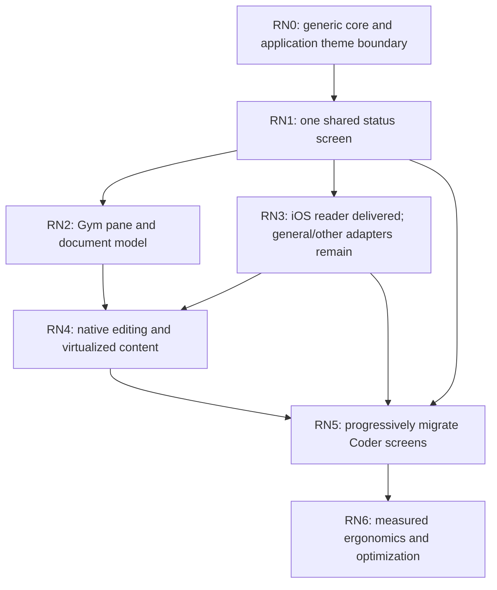

# Rust Native build order

Status: implementation plan, September 26, 2026. Rust Native becomes the shared
UI direction immediately, through incremental adoption. Existing agents, task
hosts, terminals, and client work keep shipping while adapters mature.

The [specification](architecture.md) defines ownership. The [adoption map](adoption.md)
names the existing files. The [suite tracker](../migration-status.md)
remains the application-level issue map; this document supplies the UI work
within it, rather than another competing product roadmap.

## First foundation: delivered in #9693

The initial crate contains validated semantic views, typed button intents,
style declarations and composition. The initial #9693 change also moved the
existing amber theme into that crate. #9697 corrects that dependency boundary:
`coder-ui` owns Coder theme values; `coder-terminal` re-exports them; Rust Native
uses generic RGBA colors and a product-neutral settings example.

This shares application palette ownership without completing migration of
screens. The original #9693 issue delivered no native renderer or remote
client. The later #9694–#9697 work adds the bounded iOS reader described below;
it does not add general input reconciliation or every platform adapter.

| Initial acceptance item | Evidence |
| --- | --- |
| Core is independent of platform and domain runtimes. | [Crate manifest](../../../crates/rust-native/Cargo.toml), [module surface](../../../crates/rust-native/src/lib.rs). |
| Views are bounded, serializable, and reject stale or invalid interactions. | [View implementation](../../../crates/rust-native/src/view.rs), [focused tests](../../../crates/rust-native/src/view/tests.rs). |
| Style composition has deterministic leaf precedence and explicit reset. | [Style implementation and tests](../../../crates/rust-native/src/style.rs). |
| Existing palette values and terminal imports remain compatible. | [Shared theme](../../../crates/coder-ui/src/theme.rs), [terminal compatibility exports](../../../crates/coder-terminal/src/intensity.rs), terminal unit tests. |
| Native claims and migration order are explicit. | [Specification](architecture.md), [adoption](adoption.md), [styling](styling-design.md), [source review](references.md). |

## Current application delivery

The [iOS reader](../guides/mobile-readonly.md) is the first implemented native
consumer: Rust owns catalog/transcript synchronization and encrypted cache;
[SwiftUI](../../../bins/coder-ios/host/App/NativeView.swift) renders the shared
lists, text, and buttons. Its [receipt](../verification/2026-09-26-mobile-reader.md)
records synthetic relay/application checks and native simulator checks.
Distribution status belongs to that receipt, not this build-order document.

This delivers portions of RN1, RN3, RN4, and RN5 for read-only saved history.
The initial terminal/HTML demonstration, Gym pane, general mounting protocol,
shared editable-input/IME contract, Android/web reader, and task-control screens
remain open scope. The existing UIKit probe is historical feasibility evidence;
it is not the SwiftUI implementation or acceptance for the new reader.

## Sequence and completion criteria

Open a bounded implementation issue before each follow-on phase. Do not create
a single all-platform rewrite or leave downstream issues waiting for that
rewrite. A phase is complete for the surfaces its issue names; other surfaces
remain explicitly pending.

| Phase | Build | Complete when | Dependencies |
| --- | --- | --- | --- |
| RN0: foundation | Core tree, validation, activation, generic stylesheet, and migration docs; application theme outside the framework. | Core and first-consumer tests pass; existing terminal imports remain valid. | Initial contract in #9693; product separation in #9697. |
| RN1: first shared screen | A read-only task/status projection from the mobile probe's synthetic ATIF fixture; terminal and escaped HTML adapters for the initial vocabulary. A static fixture catalog records inputs and views. | Both adapters consume the same validated tree; unknown cost and unrun checks remain distinct; text stays literal; terminal keyboard activation resolves the expected intent; unsupported properties are reported. Static HTML remains explicitly inert pending RN3 DOM events. | RN0. No service credentials or agent runs. |
| RN2: application adoption | A Gym replay status/control pane and shared transcript document contract. Keep replay timing and evidence interpretation in Gym. | One pane uses the projection without changing replay, search, full-text access, recorded/estimated labels, or `l` analysis behavior. Parsing and wrapping retain existing Markdown semantics. | RN1; inspect and preserve the current Gym model. |
| RN3: native adapter boundary | Preserve the delivered iOS reader ABI and SwiftUI subset; add a reusable mounting contract with applied-revision acknowledgments, Android native widgets, and Rust/Wasm interactions where needed. | Each claimed platform preserves native control identity, disposes callbacks, rejects stale mounts, exposes accessible labels, and routes bounded events. A supported-platform matrix states what was actually checked. | RN0 and an application projection; terminal/HTML, Android, and Apple slices proceed independently. |
| RN4: editing and long content | Preserve delivered iOS transcript paging, text selection, and full-record access. Add shared editable input, selection/composition reconciliation, and richer document rendering. | Unicode and IME edits survive refreshes, no stale update clobbers native composition, list windows retain full-record access, and accessibility reaches the final item. | RN2 document semantics and RN3 lifecycle contract. |
| RN5: Coder suite screens | Preserve the delivered read-only saved-history reader. Add task inbox/detail, composer, evidence/permission views, and scoped control over the appropriate APIs. | The same application projection drives each declared surface; actions retain existing authorization, idempotency, unknown-state, and evidence contracts. | RN4 for editing screens; read-only screens can adopt after RN1/RN3. |
| RN6: framework ergonomics | Measured caching, typed theme groups, environment predicates, optional authoring macros, and web stylesheet extraction. | A demonstrated duplication or performance problem is reduced without changing semantics or platform support claims. | Evidence from real application integrations; never a prerequisite for RN1–RN5. |

RN1 and RN2 should each remain small enough to review as a concrete screen or
pane. Decompose RN3 by platform and RN4 by input/document/list contract. Keep
the native adapter minimal until the first actual application identifies what
it needs. Do not introduce a universal layout engine, scheduler, or schema
generator preemptively.

## Switch current work over now

Use `coder_ui::theme` for Coder palette consumers. Applications outside Coder
supply their own colors and defaults; they do not depend on `coder-ui`.
Existing terminal imports remain supported. Put new shared component meaning
and typed style properties in Rust Native; keep Ratatui cells, color detection,
terminal key handling, and rendering caches in `coder-terminal`.

When an existing feature needs a screen on multiple surfaces, extract its
application projection and intent enum first. Keep its current terminal view
working until an adapter covers its behavior. Compose application-level
components from primitives before expanding the wire schema. Do not copy
private Coder UI source or its character-grid layout as the mobile contract.

| Current workstream | Immediate planning change | Work that continues independently |
| --- | --- | --- |
| Suite M3/M5, task owner and transcript views | Treat task state and ATIF as projection inputs; keep UI state out of durable task ownership. | Task lifecycle, retention, control scopes, and reconnect correctness. |
| Suite M1, mobile/rendering feasibility | Extend the delivered SwiftUI observation slice within its tested scope; add native Android controls separately. Keep UIKit receipts as historical evidence. | Build/install feasibility and native transport research within their own scope; stopped acceptance remains stopped. |
| Suite M8/M9, mobile observation/control; M13, desktop/web clients | Build task status and read-only history first, then input and control views. Reuse verified task-control APIs. | Protocol verification, scoped pairing, outbox/reconnect state, secure storage. |
| Suite M11/M12, portable host and CoderOS | Draw host/client status through shared projections when screens are introduced. | Installation, credentials, service supervision, and update integrity. |
| Suite M14/M15/M17, device adapters, remote environments, and task automation | Reuse the eventual task/trace UI instead of defining a second widget catalog. | Execution adapter, resource admission, and scheduling correctness. |
| Gym | Migrate replay/status panes while preserving clock and transcript models. | Evidence ingestion, comparison, retained traces, and cost accounting. |
| Gateway account and operator pages | Consider semantic projections when a second surface needs them; start with static web coverage. | Existing Rust HTTP routes, authentication, billing, and operator functionality. |
| Verse | Reuse the shared theme now and semantic overlays later. | World rendering, controls, and multiplayer. |

## State and effect integration

The first screen can be a Rust function from an input snapshot to `View<I>`.
Add a reusable application host only when two consumers demonstrate the same
state/service/subscription pattern. That host should use the existing async
and supervision contracts. It must distinguish disposing a view subscription
from cancelling a durable task.

Jev and Microcoder stay upstream of presentation. A typed decision can alter
which evidence a view shows, but the renderer does not call a model or turn a
model suggestion into permission. Native and terminal clients show the same
provenance, uncertainty, unavailable costs, and actual execution state.

## Keep adoption reversible

Retain compatibility exports and existing screens during each migration.
Document which new adapter is selected and how to return to the existing
presentation while behavior is incomplete. Keep one authoritative task model
and one intent handler; parallel renderers may coexist without parallel task
runtimes. A temporary renderer switch is an implementation aid, not a reason
to maintain two diverging domain models.

Use focused checks for every code change and affected consumer. Separate
structural fixtures, renderer tests, real native interaction evidence, and
performance measurements. Do not treat a static screenshot or serialized tree
as proof of accessibility, IME, app lifecycle, or transport reconnection. The
full workspace gate is release-only, and this plan does not authorize new
benchmark or platform acceptance campaigns that the user has stopped.

## Historical foundation verification

These are the retained #9693 checks before the #9697 palette separation and
list additions; they are not a verification claim for the later edits.

The September 26, 2026 foundation was checked with the pinned Rust 1.97.1
toolchain and a separate target directory for the implementation worktree:

- `cargo test -p rust-native -p coder-terminal --lib`: 13 core tests and 119
  terminal tests passed. The core tests were repeated after the test-only Clippy
  correction and all 13 passed.
- `cargo clippy -p rust-native -p coder-terminal --all-targets -- -D warnings`:
  passed, including compilation of the task status example.
- `cargo fmt -p rust-native -p coder-terminal --check` and `git diff --check`:
  passed.
- Local Markdown target checks: 1,468 links across the 16 changed or new
  Markdown files resolved. The transcript archive has no changes.

These checks do not cover native mounting, SwiftUI, Android, DOM interaction,
device accessibility, or full-suite release behavior. No model, benchmark, or
platform acceptance run was performed for this foundation.
