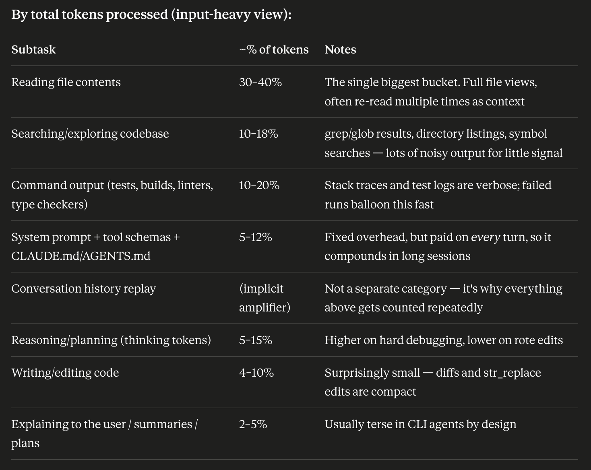
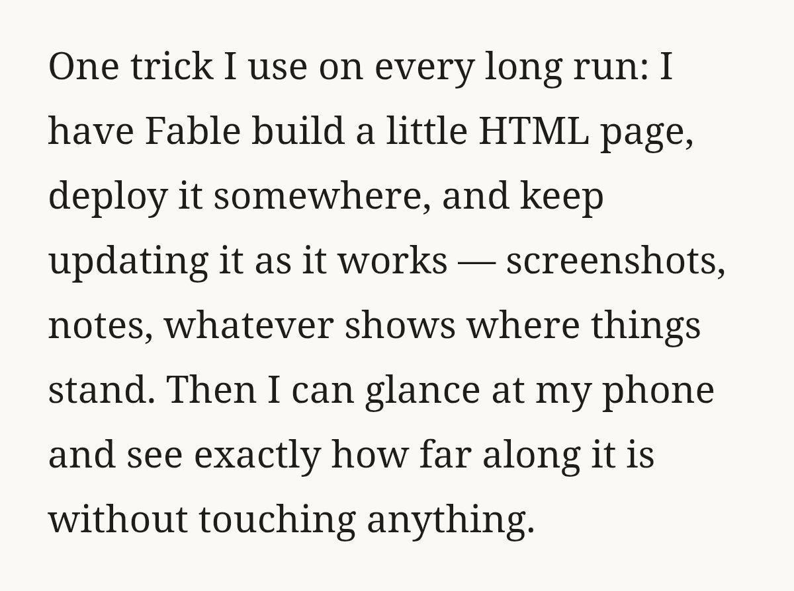
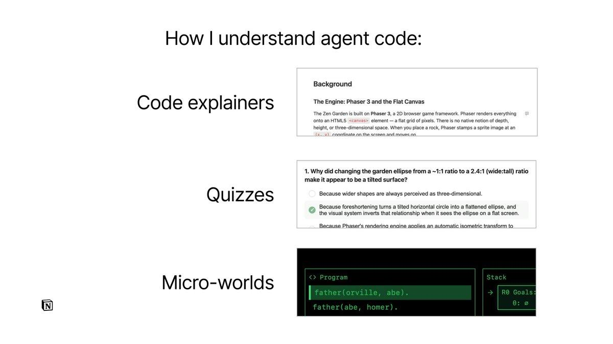
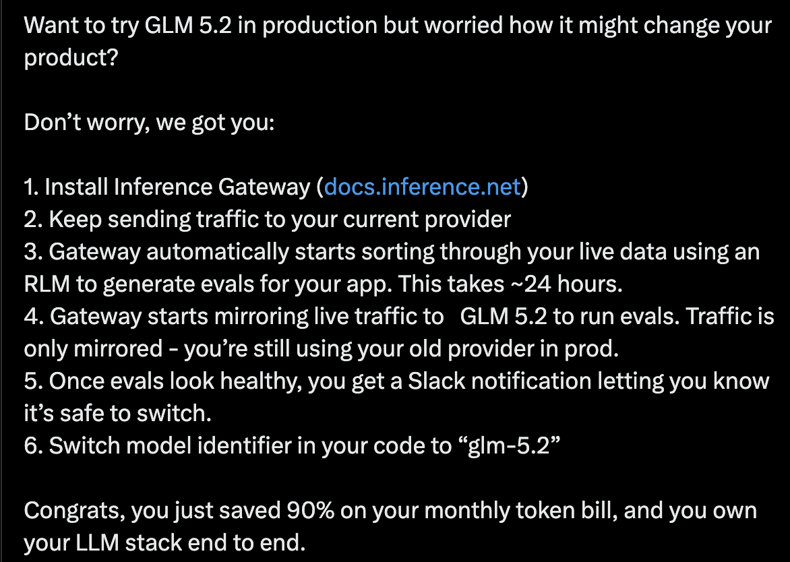
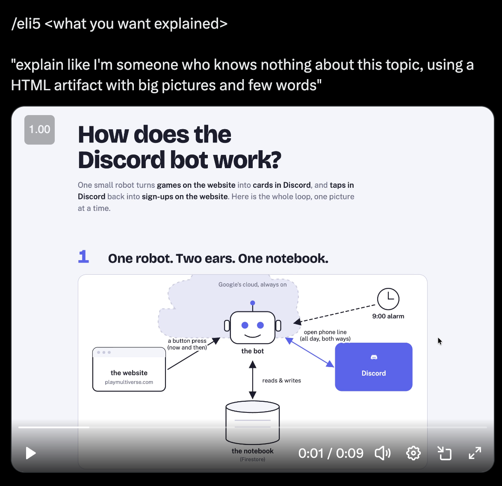
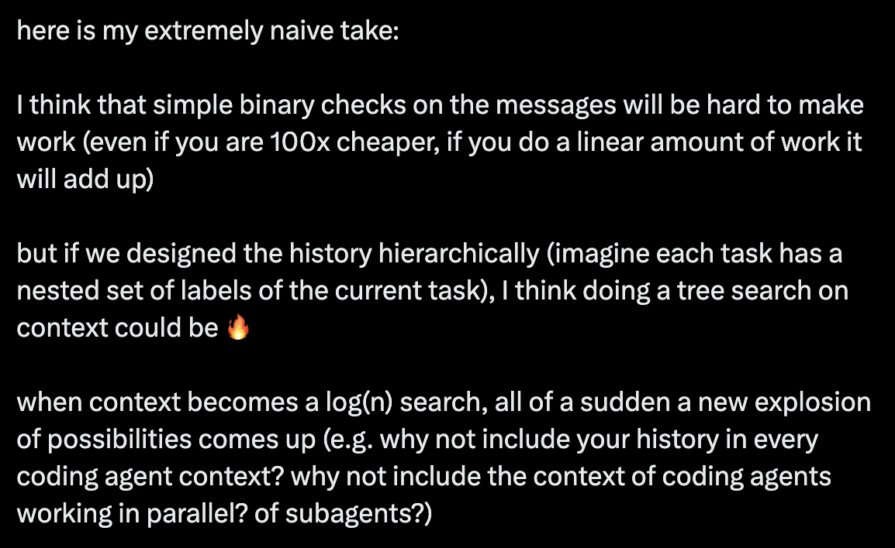

# [public] thoughts on a typesafe coding agent

Transcribed from the [public Google Doc](https://docs.google.com/document/d/1G61uUB0FifUnmmrPzFQojZ3KpczYKmXGpgEXDJ2l_Zg/preview)
and checked against the Desktop snapshot on 2026-09-21. The
[original PDF](thoughts-on-a-typesafe-coding-agent/original.pdf) preserves Google's rendered layout;
the [HTML export](thoughts-on-a-typesafe-coding-agent/original.html) retains Google's exported styles.
See the [source and verification notes](thoughts-on-a-typesafe-coding-agent/README.md).

<!-- Begin source document. -->

Why yet another agent?

- There are a couple of key assumptions I have:
  - Coding agents are surprisingly simple
    - Especially the agentic part
      - They tend to be while loops with a small number of tools
    - There seems to be very little meaningful innovation in the non-agent part
  - We can re-use the best parts of existing coding agents
    - The models of course -\> we should be able to use all the best ones via API
    - Perhaps even the UX/UI components
      - Lots of open-source to be inspired by
    - (not sure about auth complexity eg. for MCP)
  - The cost advantage of first party agents may be decreasing
    - (maybe) it seems like agent use is more moving in the direction of pay as you go API pricing
- There are some things that we can only do natively
  - I.e. not being a plugin to existing agents
  - One of my favorite questions I ask people here is “how would you design a coding agent if LLMs had no KV cache?”
    - This obviously allows us to design a typesafe-centric way
    - But also allows us to see the limitations of current design and why things that people think intuitively should work do not

### What weird things are caused by the tyranny of the KV cache?

Thing 1: Routing doesn’t work. Old calculation:

```text
  - opus: 5 / 25
  - sonnet: 3 / 15
  - assumptions
    - compare:
      1. pure opus
      2. opus -> sonnet -> opus
    - X million context tokens
    - Y million output tokens
    - Z million additional generated tokens in that output (eg. commands, file reading)
  - path 1:
    - cost is
      - 25 * Y (generate w/ opus)
      - 5 * Z (read w/ opus)
      - total: 25 Y + 5 Z
  - path 2:
    - cost is
      - 3 * X (sonnet load context)
      - 15 * Y (generate w/ sonnet)
      - 3 * Z (read w/ sonnet)
      - 5 * (Y + Z) (opus load context)
      - total: 3 X + 20 Y + 8 Z
  - path 2 is more expensive
    - in a long session (large X)
    - if there is 67% more generated tokens than generated output tokens
    - some combination of the 2
  - let's have chatgpt vibe some proportion of X / Y / Z
      - X = 0.65
      - Y = 0.12
      - Z = 0.23
    - (25 * 0.12 + 5 * 0.23) / (3 * 0.65 + 20 * 0.12 + 8 * 0.23)
      - pure opus is 2/3 the cost
```

- TL;DR is that routing to a smaller model then routing back can cost *more* because the context needs to be re-processed by the larger model

Thing 2: tool calling is a weird tradeoff

- Tools need to be specified up front (in the system message)
- But they aren’t always relevant
- And you need to specify arguments/everything with the tool calls
- Which causes issues:
  - Taking a fuck ton of context
  - Not being that smart
    - Best guess: models are not that good at some combination of (1) high cardinality (2) off-policy tool calling
- (debatably this is why skills have a big advantage, but they are quite different from tools / MCP)

Thing 3: compaction exists

- Compaction makes perfect sense if you assume that all future agent turns will want a single shared state
- But also, why assume that?
- Compaction attempts to solve the problem of compression, which is:
  - Very hard
  - And likely to be worse than any query-aware compression (eg. if you knew what to look for, it’s way easier to compress)

Thing 4: subagents are meh

- Not super sure about this, but I’m a little surprised that models don’t do more automatic parallelization
- I suspect the problem with having to figure out state is part of it
  - What parts of the context to pass in
  - What parts of the subagents’ context to merge back in

Thing 5: restarting exists

- This also makes sense if an agent is stateful and that state eventually gets corrupted
- But it also could make sense to load up all old relevant state on the fly

Thing 6: batteries aren’t included

- There is big debate between whether or not batteries should be included in agents
- Example: [https://x.com/sudoingx/status/2061073944611029393](https://x.com/sudoingx/status/2061073944611029393)
- There tends to be a tradeoff between ease (with openclaw as an extreme) and power users (eg. claude code/codex)

### TypeSafe + Coding Agent

There are a whole bunch of things that we could do, so I’ll break them up into categories!

#### Basic stuff - things that could be integrated into any agent

**Permissions / Approval**

- Should any command be run
  - Similar to claude’s auto-mode
  - Ideally with programmable queries on what is/isn’t allowed
- There could be more in-depth permissions
  - E.g. reading the contents of a file before executing it (for python/bash/etc.)

**MCP / Tool calling**

- We could be the router for tool calls
- Give a high-level text description of what we are trying to do, then use many typesafe calls to figure out either the best tool cool or the top X

#### Advanced stuff - TypeSafe native features

**“Meta-attention”: Smart context / relevance / filtering**

- The idea that context is static can be entirely removed
- For any one user query, we could re-calculate:
  - How good the previous context is/was
    - I.e. re-using existing KV cache is fine + natural and we should be making educated cost-aware decisions&nbsp;based on how good re-using the current cache is vs recreating one from scratch
  - How to construct a new context with everything relevant inside of it
    - In its simplest form, you could imagine this as a noul on every “chunk” of context
      - Tool call inputs
      - Tool call outputs
      - Internal reasoning
      - Possibly even back and forths with the user
    - A future version could even be a score on each “chunk” from:
      - Don’t show
      - Show a small summary
      - Show a longer summary
      - Show the whole thing
      - (Or something similar)

**Routing + “Sub”-agents**

- First-class dynamic contexts would then allow for routing easier tasks to cheaper/faster models
  - Of course, everything should be cost/intelligence-aware!
- My guess is that a large cost of subagents is figuring out context vs simple commands (like a user would type) and if it was easier/cheaper/more automatic, we could do much more with sub-agents
- This will likely also enable exposing more knobs to users between spend-more for better/faster or be conservative and spend as little as possible

**First-principled version of Skills/MCP/Tool calling**

- I believe that there should be something in between to exist:
  - Small snippets about what is available
    - Because how could a model suggest an action if it doesn’t directionally know such an action could exist
    - Similar to the description of skills
      - But it may not have to be included in the system message vs dynamically loaded when appropriate
  - The ability to dump the full schema of actions available when needed
    - Similar to the tool search tool
  - This not corrupting the context
    - Unprecedented (:
- If this works, we could truly include all sorts of batteries with little to no cost!
  - If we can include things with ~no cost, we could have an incredible super power for both co-marketing and having things just work™
  - (Imagine having 100s of tools + 1000s of docs built-in)

#### Weirder stuff - just throwing things in here to cook

**Better batteries**

- There are a whole bunch of projects that people cook up that ideally help agents, but in reality don’t
  - Example: [https://github.com/rtk-ai/rtk](https://github.com/rtk-ai/rtk)
    - Context compression tool
  - My guess: because LLMs don’t natively understand them
- We could make first-party prompts/etc. centered around these tools to make sure they are prompted properly (think of it like a native subagent / skill for a tool)
- The cleanliness of our context allows us to load + not be poisoned by custom logic
- Generally including batteries of hype-flavor-of-the-day projects can be a good way to get our own hype
  - Side note: an open source hype vehicle might be a great deliverable (something that can be constantly in the loop of what’s hyped right now

**Conditional system messages / AGENTS.md**

- We could dynamically load different parts of an AGENTS.md depending on different different conditions
  - E.g.
    - Is it front-end? Load the style guide
    - Is it in this subdirectory? Load the footguns/gotchas file (tbh every subdirectory should have a gotchas file)
- This is somewhat similar to skills, but my experience of skills is they tend to be “do this now” vs “have this in memory somewhere”
  - Additionally the “have this is memory somewhere” constraint could be immune to compaction/being filtered out (i.e. if you load a skill, then eventually hit compaction, that skill likely will get compacted out/summarized)
- Side note: I’m noticing that I really want this for a chatbot
  - Do I want a summary? Here is how I want it in org-mode
  - Am I asking for writing in my style? Here are samples + what not to do
  - Is it code? Don’t add a million assertions and here’s a style guide

**Structured skills**

- This is a little undercooked, but depending on how programmable we make the harness, skills could add a whole bunch of behavioral changes
- Similar to claude skill hooks: [https://code.claude.com/docs/en/hooks#hooks-in-skills-and-agents](https://code.claude.com/docs/en/hooks#hooks-in-skills-and-agents)&nbsp;but more powerful
  - Last I checked, these permanently add the hook into the session

**Recursive language models**

- See [https://alexzhang13.github.io/blog/2025/rlm/](https://alexzhang13.github.io/blog/2025/rlm/)
- TL;DR is more variables/explicit state
- There is a world where treating state as explicit variables could be a lot cleaner

**Fancier summarization**

- One idea is that if we could heatmap “what part of this grep output is relevant”, we could dynamically filter it down by any amount we like
- It would look cool

**Extreme subagents + parallelization**

- Not sure how this will work for us, but it could become very easy to spawn many tasks at once (due to the above section), and then we’d have to figure out all sorts of annoying but useful things like synchronization primitives or even communication
  - I.e. they could all share state and have locks/etc. for write collisions

**Security-aware routing**

- Chinese models are *way* cheaper and likely yoinking all the data passing through them (e.g. DeepSeek V4 is insanely cheap)
- What if:
  - Sub-agents/tasks had some notion of likelihood of touching different types of files
  - We had different policies for different types of files
- We could then route some of these queries to *much*&nbsp;cheaper models
- Further extensions: there may be many other reasons to route than difficulty/cost (eg. don’t use anthropic models for LLM research, don’t use openai/anthropic for safety-sensitive things)

---

### Appendix

- Example tools that could be integrated / improved
  - [https://github.com/chopratejas/headroom](https://github.com/chopratejas/headroom)
    - Context compressor
    - Notes
      - Could have a classifier on whether or not the compression contains the necessary/important info
  - [https://github.com/rtk-ai/rtk](https://github.com/rtk-ai/rtk)
    - Tool output compressor
  - [https://github.com/ast-grep/ast-grep](https://github.com/ast-grep/ast-grep)
    - Alternative search
    - Notes
      - For novel tools, we could load up the manual for a one-off query, generate N queries, then use our model to filter the queries for relevance
  - [https://ast-outline.github.io/](https://ast-outline.github.io/)
    - Another structural search
    - Notes
      - I wonder if we could use this for hierarchical function calling -\> use model to figure out which subtree to investigate
  - [https://github.com/microsoft/fastcontext](https://github.com/microsoft/fastcontext)
    - Sub-agent for repo exploration
    - Notes
      - Interesting claim: In our analysis of GPT-5.4 trajectories, reading and searching account for 56.2% of all tool-use turns and 46.5% of the main agent's total tokens
        - If this generalizes, that could mean a lot of efficiency by just focusing on this
      - It could be valuable to both:
        - Be able to route to sub-agents intelligently
        - Replace the sub-agents search with structure!
  - [https://github.com/dmtrKovalenko/fff](https://github.com/dmtrKovalenko/fff)
    - Typo-resistant path and content search, frequency-ranked file access, a background watcher, and a lightweight in-memory content index. Way faster than CLIs like ripgrep and fzf in any long-running process that searches more than once.
- I wonder if there are ways to make /goal like behavior better (eg. through explicit deduplication)
  - I’m not sure if it ever repeats, but you could imagine that before spawning off a thing, it could have a “subgoal” that gets deduplicated from all previous subgoals
- SLOP: A breakdown of coding agent subtasks
  - 
  - If we wanted to make special behavior for subtasks, this list seems like a good place to start

### Appendix 2: &nbsp;background processing: a potential agent pattern

- I’ve been noticing a bit of a pattern in some recent popular-ish agent workflows:
  - [https://x.com/xpasky/status/2073298979203211628](https://x.com/xpasky/status/2073298979203211628)
    - Building HTML pages that are updated in parallel
    - 
  - [https://x.com/geoffreylitt/status/2072522251300409556](https://x.com/geoffreylitt/status/2072522251300409556)
    - “Understanding is the new bottleneck”
    - 
  - [https://x.com/samhogan/status/2071608749429829858](https://x.com/samhogan/status/2071608749429829858)
    - Creating evals in the background
    - 
  - [https://x.com/trq212/status/2090884854590382515](https://x.com/trq212/status/2090884854590382515)
    - ELI5 skill
    - 
- What do these things have in common?
  - The thing that pops out to me is they all run in the background!
  - They generally are background extensions to the normal coding workflow
  - Not only are they in the background, they tend to be read-only functions of your current codebase state
- With that pointed out, there may be existing patterns that fit into the mold of background processing
  - The one that pops out to me is cross-model review
    - E.g. Have codex review claude’s work

#### Where does TypeSafe come in ?

- One of the assumptions I have in a TypeSafe-centric coding agent is that we’d have to be quite explicit about state (everything in context)
  - Specifically, by being smart about state, we can be much more efficient about routing, sub-agents, etc.
- The synergy between this and read-only background tasks seems quite high!
  - Presumably it’s a non-trivial amount of work to find relevant information for a code change
  - If that work can be shared between all the background tasks, it can be much cheaper to run them and potentially economical to run many more than otherwise
- I think being explicit about state (reads vs writes) should generally give us super powers eventually 🙃

### Appendix 3: recent post

[https://x.com/CompleteSkeptic/status/2100804802339082717](https://x.com/CompleteSkeptic/status/2100804802339082717)



<!-- End source document. -->
