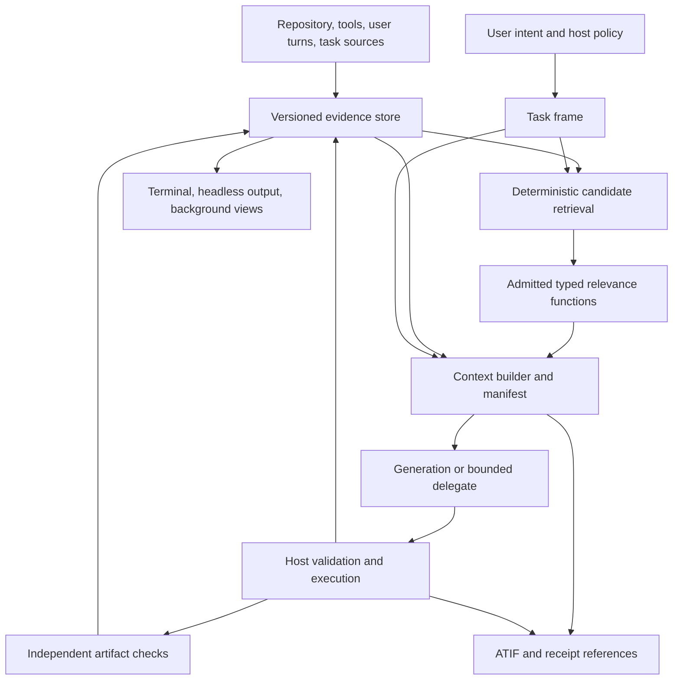

# A TypeSafe-native Coder

Status: design analysis, checked on 2026-09-21 against repository revision
`9dd4ddab67`, the public TypeSafe documentation, and both OpenAgents project
boards. This document proposes behavior; it does not report new model or
agent measurements. The [delivery roadmap](typesafe-agent-roadmap.md) turns
the proposals into implementation slices. The
[project snapshot](2026-09-21-project-roadmap-snapshot.md) records the work
already in flight and the differences between the boards.

## The main opportunity

The founder's [coding-agent document](thoughts-on-a-typesafe-coding-agent.md)
argues for an agent organized around relevant state rather than a single
ever-growing generation transcript. Its most consequential idea is
*meta-attention*: use inexpensive typed judgments to decide what a more
expensive operation needs to see. Model routing, progressive tools,
specialized subagents, and background work become applications of that
state architecture.

Coder has much of the control machinery for this design: Rust-owned turns,
typed decisions, program manifests, explicit host authority, bounded
subprocesses, isolated writing delegates, traces, and a project supervisor.
Its missing center is a reusable evidence store and a context builder that
can serve different questions from the same observations. Adding more
questions to the existing transcript loop would leave that gap intact.

The recommended direction is to make Coder a native consumer of decision
models at every *useful semantic boundary*: retrieving evidence, choosing
among eligible operations, allocating context, reviewing uncertain results,
and helping independent tasks share observations. Rust owns the state,
mechanical rules, budgets, effects, and transitions. Generation produces
patches, explanations, and other open-ended content. Typed output constrains
the answer's shape; it does not establish that the judgment is correct.

The first demonstration should be concrete: Coder investigates a failing
Rust test, finds the relevant implementation and previous observations,
constructs a compact task-specific context, repairs the code, and shows the
independent check and a source-linked explanation. Compare that complete
workflow with the same generator using deterministic retrieval. This would
demonstrate the founder's central idea before a complete marketplace,
commercial billing system, or autonomous project manager exists.

## What the source establishes, and what it leaves open

The source is a set of architectural hypotheses and examples. Its pricing
example is explicitly an old calculation; its token breakdown is an
illustration from another agent. Neither establishes Coder's current costs
or a measured speedup. The suggested libraries are candidate techniques,
not a dependency list that Coder must adopt. Preserve the original document
and its images as the source; this analysis interprets it separately.

| Source insight | Consequence for Coder | Qualification to test |
| --- | --- | --- |
| Changing generation models can lose cache value | Route using the cost of the complete remaining task and context transfer | A cheaper output token does not guarantee a cheaper task |
| Large fixed tool catalogs consume attention | Retrieve eligible tool descriptions, then load their schemas | Discovery must retain the operation the task needs |
| Universal compaction loses query-specific detail | Keep observations and derive different context views | A summary needs source references and an expansion path |
| Subagents spend effort transferring context | Give each task a snapshot and return structured findings | Omitted dependencies and stale snapshots can erase parallel gains |
| Restarting discards useful history | Retrieve relevant earlier observations into a fresh task frame | Old facts require version and scope checks |
| More capabilities can be available without always being in the prompt | Keep a small searchable catalog with scoped activation | Installation, access, and execution still need host configuration |
| Instructions and skills can be conditional | Resolve mandatory instructions mechanically; select optional help semantically | Relevance must never erase a binding user or repository constraint |
| Shared state enables background work | Reuse observations for explanations, reviews, and test proposals | Background work still consumes resources and can disclose data |
| Hierarchical context retrieval can reduce search | Traverse repository and task indexes with bounded alternatives | A wrong early branch can hide the answer; logarithmic work is not guaranteed |

The public [System One building guide](https://docs.typesafe.ai/concepts/how-to-build-with-system-one)
supports small semantic functions composed by ordinary code. Its
[fan-out pattern](https://docs.typesafe.ai/patterns/fan-out) supports asking
independent questions together when they share state. These are useful
implementation patterns, not a reason to ask every conceivable question
on every turn. Our own retired questions show why each function needs a
consumer and a measured purpose.

## The actual starting point

### One turn, several different state paths

[`turn::run`](../../crates/coder/src/turn.rs) is shared by terminal and
headless mode. It attempts a program before ordinary action classification;
programs now have their own explicit host grants. The ordinary shell path
constructs a route-derived permit before it runs a generated command plan.
Keep that shared engine as the architecture grows.

The current state paths are asymmetric:

- The action classifier uses bounded transcript slices. The documented
  production defaults retain six messages with 768-byte message
  slices; task and repository inputs are not a universal hard input bound.
- The generator receives the agent's in-memory conversation. It does not
  consume a common context manifest shared with the classifier.
- The shell runner caps captured output, then gives the judge and generator
  a much smaller head of that output. The useful diagnostic can occur
  beyond that head.
- ATIF records observations and decisions as they happen, but it is not an
  indexed evidence store or an orchestration recovery ledger.

Sources: [state-budget measurement](../decision-models/2026-09-20-state-budget.md),
[`Agent`](../../crates/coder/src/agent.rs),
[shell loop](shell-loop.md), and [traces](traces.md).

This is the precise opportunity for query-aware context. First preserve a
bounded, addressable observation; then choose useful excerpts. Increasing
the transcript window cannot recover bytes the collector already discarded.
Capturing more output also needs storage and process bounds, so the answer
is a bounded artifact with a truncation record, not unlimited logging.

### More implementation has landed than the older plans imply

Program authority and scoped tracker intake are implemented under
[#9504](https://github.com/OpenAgentsInc/openagents/issues/9504) and
[#9507](https://github.com/OpenAgentsInc/openagents/issues/9507). A
[project supervisor](project-supervision.md) has deterministic scheduling,
resource accounting, durable claims, prepared task mappings, and recovery
that preserves ambiguous running work as unknown. The
[artifact verifier](artifact-verification.md) independently inspects a
committed worktree and runs protected host checks. A typed `run-suite` host
path exists; a general Gym adapter and complete `review-changes` workflow
remain unfinished.

The keyed HTTP gateway, credentials, and caller CLI also exist. A partial
[`/v1/classify` route](../decision-models/classification-http.md) supports
ordered Choice, multi-label Noul, and named dimensions through serial native
requests; additional modes, packed inference, and durable jobs remain open.
The [relay decision contract](../decision-models/relay-decision-contract.md)
now has a pure protocol implementation, while its worker/network service
remains unfinished. Direct loopback client configuration no longer requires
a fabricated provider key.
However, Coder still needs one resolved decision profile across all decision
sites, explicit configuration failures, and integrated receipt consumption.
The current `Client::from_env().ok()` paths can hide an invalid configuration
as absence. See the [consumer contract](coder-as-decision-router-consumer.md)
and the implementation comments linked in the project snapshot.

These foundations let context work start now. Their existence does not mean
that arbitrary backlog execution, automatic integration, full budget
recovery, or decision inference over the relay is complete.

## What Jev, Kev, and Lev can justify today

Model assignment should be per function and workload. Compatibility with
`POST /v1/systemone` is a transport property; it does not make three models
interchangeable in judgment quality, context limits, or calibration.

| Evidence | Finding | Design consequence |
| --- | --- | --- |
| [Coder question baselines](../decision-models/2026-09-20-coder-question-baselines.md) | In that retained run, action was 28/32 correct versus 31/32 for constant `respond`; shell outcome was 34/44 versus 24/44 for its constant baseline | Keep the useful shell-outcome hypothesis; action needs a better value case. Do not revive `risk`, `progress`, or `needs_code` without new evidence |
| [Program selection v2](../decision-models/2026-09-20-program-selection-v2.md) | Jev was 61/68 on open items; the 32 real items contain only one positive request and two spurious selections among 31 negatives | Report false activations and misses separately. Authored positives are coverage, not real request prevalence |
| [Kev 4B candidate](../kev/measurements/2026-09-20-candidate-4b.md) | Shell outcome improved to 39/44; action had 14 local refusals and only 15/32 correct; program selection was 53/68 | Consider a shell-specific candidate experiment. Do not promote Kev as the global Coder replacement |
| [Lev disposition](../lev/disposition.md) | Calibration admissions are family-specific; Coder probes include refusals and weaker out-of-domain behavior | Treat local relevance and routing functions as new admission problems. Local execution alone is not evidence of suitability |
| [State-budget study](../decision-models/2026-09-20-state-budget.md) | Large state reductions on a small development slice did not show a measurable loss on its historical questions | Use this as motivation to measure context selection, not proof that arbitrary coding context can be removed |

The action counts in the baseline and candidate records come from different
retained runs; the candidate comparison reports Jev at 29/32. Do not merge
them into a single result. The Kev conformance tests establish numerical
agreement with the reference implementation, not agent success or immunity
to misleading inputs. Historical CPU and Metal timings have different
hardware and execution conditions and cannot establish a portable ranking.

Jev is the practical hosted reference for new functions where its disclosure
and usage policy fit. Kev is a candidate for measured local functions and
batch workloads. Lev offers an on-device path where its available context,
guardrails, estimator, and admitted family fit. A required unsupported
function should explain its unavailability. It must not quietly turn a
local-only session into hosted inference. Local inference also consumes
time, memory, power, and scheduling capacity even without a per-call bill.

## Proposed architecture: state that can answer many questions

The following components are proposed. They extend the existing host,
decision client, generator, scheduler, and trace contracts.



### Evidence store and task frame

An evidence item needs an immutable identity, a kind, a content digest, an
origin, an observation time, and a scope. Repository items also need the
repository/base, path, content version, and span anchors. Tool items need
the command or adapter identity, attempt, exit outcome, captured artifact,
and truncation status. Generated summaries need the model and source
references. Record disclosure classification and whether the content is a
user instruction, repository instruction, tool observation, or untrusted
retrieved data.

Represent relationships such as `derived_from`, `supports`, `contradicts`,
and `supersedes`. A summary does not replace its sources. An edited file
invalidates conclusions tied to its earlier digest; a test pass applies to
the artifact it tested. Immutable snapshots let tasks reuse observations
without pretending the working tree stayed still.

A task frame holds the current objective, user corrections, binding
constraints, acceptance references, attempted approaches, unresolved
questions, and current artifact identity. Some fields come directly from
the host or user; inferred subgoals must remain distinguishable. Correcting
the objective should supersede an earlier interpretation explicitly. Do
not force the next generator to rediscover a correction in a long transcript.

Keep three stores conceptually separate: ATIF explains what happened; the
evidence store supplies inspectable working context; the durable controller
owns which effects may resume. One observation may be referenced by all
three. A new evidence store must support retention, deletion, and rebuilding
indexes without making a deleted source silently appear available.

### Context as a reproducible artifact

A context request specifies the task or question, recipient capabilities,
allowed disclosure, token/input limit, and required evidence. The context
builder produces a manifest of included items, representation versions,
source spans, omitted candidates and reasons, unresolved coverage, and the
policy and decision identities used to select them.

Always include the applicable user constraints and host-resolved mandatory
instructions. Retrieve optional evidence around them. Rank coherent bundles
when understanding requires a caller, callee, test, and failure together.
Scoring isolated lines can reward plausible fragments while omitting the
relationship that makes them useful.

Support exact excerpts, structured observations, and short or long summaries
with expansion links. A semantic relevance judgment and the cost of a
representation are separate inputs. A Score mean between rubric levels is
not automatically an instruction to display a particular summary length.
The host can allocate a token budget deterministically, with measured rules
for mandatory evidence and diversity. A missing answer is unknown evidence,
not evidence that the candidate is irrelevant.

The context artifact is replayable as supplied input. This does not promise
the provider will reproduce a generation, reveal hidden reasoning, or reuse
a KV cache. Store only observations and model output actually available to
Coder, including explicit summaries rather than inaccessible internal state.

### Retrieval before reranking

Start with paths, symbols, imports, test names, exact search, and task
history. Measure what this inexpensive stage misses before adding semantic
reranking. TypeSafe's [reranking example](https://docs.typesafe.ai/cookbooks/rerank_typesafe)
illustrates the important separation: a reranker can reorder a shortlist;
it cannot recover a missing candidate. Its legal-document results are not a
coding benchmark.

Noul suits independent relevance propositions when several items may all be
needed. Choice suits a mutually exclusive selection from real candidates,
with an explicit no-match path. Score suits an ordered relevance rubric.
Use the same task and rubric for comparable candidate judgments; do not
sort raw Choice probabilities from unrelated candidate sets as if they were
global relevance scores. Measure order sensitivity and position effects.

For large repositories, build hierarchical indexes of directories, symbols,
task episodes, and artifact groups. Keep multiple promising branches and a
bounded expansion or full-text fallback. The
[hierarchical-classification cookbook](https://docs.typesafe.ai/cookbooks/hierarchical_classification)
demonstrates greedy and beam traversal; Coder still needs its own recall
measurements on cross-cutting changes. A bug spanning storage, protocol,
and UI will rarely fit one clean tree branch. Line-level heatmaps should be
a later view over span evidence, not the initial storage abstraction.

### A concrete repair through the proposed loop

Consider a request to fix a parser regression after a format change. The
current task frame pins the failing behavior, repository base, allowed
scope, and the requirement to retain compatibility with an older fixture.
A bounded test operation records the failure artifact. Structural retrieval
finds the parser, format definition, fixture, and callers; history retrieval
finds an earlier rejected approach tied to its old source versions.

A relevance function evaluates those bundles against this particular repair.
The context builder includes the failure span and compatibility requirement,
uses exact code around the parser, and summarizes the earlier attempt with
a source link. If no candidate explains the failure, the host expands the
search under its budget rather than inventing a source. Generation proposes
an anchored edit. The host validates the source version, applies the edit,
and invokes the independent check on the resulting artifact.

The next context can focus on the remaining failure instead of repeating
all the search output. A background explanation consumes the same before/
after evidence and test result; it does not repeat repository exploration.
If the user changes the compatibility requirement, the task frame records
that correction and invalidates conclusions that depended on the earlier
requirement. The final answer links the change and verification to the
artifact actually checked.

Each semantic function has a narrow input and a concrete consumer:

| Proposed function | Input and output | What Rust does with it |
| --- | --- | --- |
| Evidence relevance | Task plus candidate bundle → independent Noul or ordered Score | Selects within a token budget while retaining mandatory evidence and unknown coverage |
| Operation relevance | Task and eligible descriptors → Choice with `none`, or independent relevance for several useful operations | Loads selected schemas; validates and executes only host-admitted proposals |
| Summary sufficiency | Task, retained source, and proposed summary → Noul | Uses the summary or expands the original within the context policy |
| Remaining requirement review | One requirement and attributable artifact/check evidence → typed judgment | Marks the semantic requirement satisfied, unmet, or unresolved alongside mechanical results |
| Duplicate-task suggestion | Proposed task and candidate prior tasks with bases/acceptance → typed match suggestion | Reuses only an outcome whose exact identity, freshness, and acceptance are compatible |

These functions are proposals, not production question sets. A summary
check that rereads a large source can cost more than including it once;
cache reusable judgments by their full input identities and measure whether
the extra function helps. The example succeeds when the complete repair
improves, not merely when its relevance scores look plausible.

## Routing without losing the benefit to context costs

There are three different routing problems: choosing a decision backend,
choosing a generator, and choosing or scheduling an executor. They have
different costs and failure consequences. An executor such as Devin also
owns its internal context and tools; routing work to it does not make its
internal loop Jev-driven.

The founder's historical example gives:

```text
stay on the stronger model: 25Y + 5Z
switch away and back:       3X + 20Y + 8Z
extra cost of switching:    3X - 5Y + 3Z
```

Under those assumptions, switching helps only when `5Y > 3(X + Z)`.
The example proportions give costs of 4.15 and 6.19. This demonstrates a
context-transfer penalty; it is not a current price comparison. Real policy
must also include cached-input prices, cache availability, question calls,
retrieval, retries, summaries, queue time, and the cost of returning to the
stronger generator after a failed attempt.

Use stable instruction prefixes and incremental context updates when they
help a recipient retain useful cache state. Rebuild context when its value
outweighs the cost. A context digest records input identity, not evidence
that a provider cache hit occurred. Record actual provider usage where
available and leave unknown cache behavior unknown.

Start with operator-pinned generator profiles. Introduce automatic selection
only among eligible profiles with measured quality on the relevant task
family. A latency-oriented profile may prefer local inference; a difficult
repair may justify stronger generation. The product should expose the
tradeoff through understandable quality, time, cost, and disclosure settings,
not ask the user to tune dozens of confidence thresholds.

## Native tools and scoped instructions

The current ordinary agent executes a generated JSON shell plan. That is a
useful foundation, but full control over evidence and editing needs native
operations such as bounded file reading, symbol/search retrieval,
version-anchored edits, and test execution with retained diagnostics.
Selection can choose an existing path or operation; generation remains
appropriate for new code and open-ended arguments. Validate arguments and
source versions before executing either kind of proposal.

A progressive operation catalog should have two levels: small searchable
descriptors and the complete schema/instructions for selected operations.
Filter by host availability, authority, and compatibility first. Then use a
measured semantic selector where it adds value. Tool discovery should not
install a server, approve an adapter, or acquire credentials. An adapter's
claim that it compresses output is insufficient; verify whether its output
preserves diagnostics and links to the captured source.

The founder's conditional instructions require a similar separation.
Resolve root and subtree instructions from the active paths and instruction
precedence mechanically. Keep applicable requirements in the task frame.
Use relevance to select optional guidance and examples. A structured skill
can declare inputs, applicable operations, lifecycle hooks, and outputs,
but the host must bound its lifetime, calls, resource use, and effects.
Activating a skill cannot grant it permission to install or run itself.

This offers much of the founder's recursive-state idea without first
building an arbitrary model-controlled REPL: named artifacts, typed
references, bounded queries, and explicit transformations over evidence.
Evaluate richer programmable manipulation later if these operations prove
too restrictive. Rust remains the product implementation language.

## Parallel and background work that shares evidence

Independent tasks should share immutable observations, not a mutable global
prompt. Each task receives a snapshot, task frame, context manifest, and
declared read/write footprint. A result returns artifact references,
structured findings, verification, and unresolved questions. The parent
retrieves what matters instead of concatenating all child transcripts.

The existing project scheduler already accounts for prepared task conflicts
and capacities. Extend it with evidence invalidation and task-specific
context. Known dependencies and write conflicts are mechanical constraints;
semantic independence judgments can only address the remaining uncertainty.
Integration checks the base and changed artifacts again. Semantic task
deduplication should propose possible duplicates while exact identity and
acceptance comparisons decide whether to reuse an outcome.

The [supervisor measurement](verification/2026-09-21-project-supervisor.md)
supports a bounded refill scheduler and reports real limits: three smoke
tasks succeeded, while four writing tasks timed out and needed host repair.
Its fixture scheduling timings do not establish an optimal concurrency for
live model workloads. Keep the declared local Devin capacity until actual
resource and outcome evidence supports changing it.

Background features are useful early consumers of the same state: a diff
explanation, a source-linked progress view, candidate regression tests,
cross-model review, or an optional learning explanation. Key each result to
the evidence snapshot it read. Debounce changed-input events, coalesce
duplicate work, cancel obsolete work, and reserve capacity for the user's
foreground task. A read-only reviewer still consumes money and may send
source to another provider; the session's disclosure policy applies.

Start with one background diff explanation that reuses collected evidence.
Add reviews and test proposals after measuring usefulness and interruption
cost. The founder's quizzes and interactive learning views are product
extensions, not prerequisites for effective coding. Background tasks should
stay quiet when nothing actionable changed.

## Permissions, privacy, and confidence

The source suggests semantic command inspection, including inspecting a
script behind a short command. That can help explain a proposal or flag
ambiguity after deterministic checks. It cannot prove arbitrary script
behavior. Bind any inspection to the actual executable/script digest and
arguments; changed files, dynamic imports, environment, and network inputs
can invalidate it. Existing filesystem write isolation does not establish
read or network confinement.

Likewise, choose data destinations from explicit repository classification,
operator policy, provider contracts, and supported enforcement. The
source's provider examples do not establish privacy properties by company
name or nationality. A local decision call says nothing about where a later
generation or delegated task runs.

TypeSafe's [confidence documentation](https://docs.typesafe.ai/confidence)
distinguishes distribution concentration from correctness. Coder's current
`requires_calibration` program check only recognizes a named model and
probability; it does not validate a workload-specific calibration record.
Correct that contract before presenting a numerical threshold as an
admitted reliability guarantee. Review should preserve the original answer,
the review, and the rule that chose which result to consume.

## Product experience and evidence of value

The terminal should keep its framed composer, amber intensity ladder, and
task-focused conversation. Add expandable views for selected evidence,
decisions, changed artifacts, and background findings. Show what Coder is
trying to establish, which sources it used, what it omitted, and what the
check actually established. A score display without those references adds
little. Headless consumers need the same typed events and final outcomes.

Measure the complete loop: task success, evidence coverage, false exclusion,
unnecessary tool activation, edits invalidated by stale context, repair
attempts, foreground latency, disclosed tokens, total known money, and
operator correction effort. Include missing results and refusals in the
denominator. Separate query-level relevance labels from downstream task
success; both are necessary. Fit policy on development data and reserve
held-out tasks for comparisons. The support suite's historical noise floor
is not a universal threshold for these workloads.

Use staged comparisons: deterministic retrieval with a fixed generator;
the same workflow plus typed relevance; then query-aware representations;
then generation routing; then shared background work. This isolates which
change helped. Keep a simpler path available if a decision function fails
to pay for its latency, mistakes, or cost.

The strategic advantage would be cumulative: collect an observation once,
make it available to several small decisions, give each generator only the
evidence its task needs, and retain enough provenance to correct a mistake.
The [roadmap](typesafe-agent-roadmap.md) makes that outcome the organizing
goal for the existing consumer and service work.
