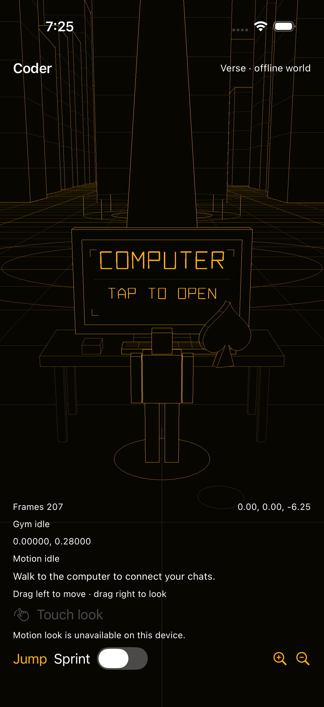

# Computer interaction in Verse — September 26, 2026

[Issue #9703](https://github.com/OpenAgentsInc/openagents/issues/9703) changes
Coder's mobile Verse computer to present its interaction prompt on the
physical 3D monitor. The visible native **Computer** / **Use computer** button
is removed from both iOS and Android. The [mobile guide](../../verse/mobile.md)
describes the controls.

## Rendering and interaction

The monitor displays **COMPUTER** and a proximity-dependent **WALK CLOSER** or
**TAP TO OPEN** message. Rust builds the letters as amber mesh faces and places
them on the monitor's display plane. The ordinary Verse renderer supplies
perspective, depth, and occlusion. The label is not a native text view projected
to a screen coordinate or a separate screen overlay. The geometry is shared
with desktop Verse; mobile hosts mount the same renderer. Desktop displays
the neutral title because it does not yet have the mobile reader interaction.

Mobile pointer input is interpreted in Rust. A tap casts a ray through the
rendered viewport and intersects the physical display rectangle. Opening
requires a nearby player, the monitor's front face, a point inside the visible
viewport, and a clear path through static, local-avatar, follower, and presented
remote-entity geometry. Remote geometry comes from the last presented frame;
checking a tap does not advance its animation. A visible monitor edge stays
tappable when another entity hides its center. The display's perspective and
hit area therefore use the same camera and world coordinates.

A valid tap begins and ends on the monitor without becoming a drag, long hold,
cancelled touch, or multiple-finger gesture. Touch and motion camera modes share
this path. Input reserved for the monitor does not also move the player or
rotate the camera. Opening the computer releases held input. Backgrounding,
closed surfaces, and open panels prevent another pointer interaction.

The native world surface retains a **Use computer** accessibility action for
VoiceOver and TalkBack. Rust checks the same reach, front-face, and unobstructed
monitor-center conditions before opening. This action adds no visible button.

Application-specific lettering, picking, and interaction remain in `verse` and
`coder-mobile`. The generic `rust-native` crate gains no Coder component,
palette, or application behavior.

## Scope

The computer prompt and its pointer interaction move into the 3D world.
Existing native pairing, QR scanning, world-connection, and read-only transcript
panels remain. Keyboard input, selectable transcript text, and reader paging are
unchanged surfaces. Gym boards and movement controls are outside this visual
change. No model, training, or benchmark workload is required.

## Verification status

The [retained evidence](../../../bins/coder-ios/verification/2026-09-26-world-computer/README.md)
includes source hashes, logs, and screenshots. Checks use synthetic data and do
not run models or benchmarks.

| Check | Result |
| --- | --- |
| Shared mobile library | 28 tests passed, including tap/drag/cancel/long-hold/multitouch and partial-occlusion regressions. |
| Verse library without desktop features | 122 tests passed, including perspective picking, invalid coordinates, static/local/remote occlusion, lettering orientation, and desktop prompt capability. |
| Selected-package formatting and Clippy | Passed for `coder-mobile` and `verse`, including default desktop features. |
| iOS simulator | Initial full suite: 12 passed. After final corrections: all 3 world tests passed, covering the real monitor tap, chat navigation, background/resume, and pairing fallback. Screenshots were inspected. |
| Android emulator | Corrected monitor screenshot and actual-tap reader acceptance passed on API 35. The second full suite passed 11 of 13. The subsequent focused motion and Gym rerun failed both checks; this is not a full Android acceptance pass. |
| Signed iOS archive and TestFlight | Build **0.5.0 (43)** is `VALID` and `IN_BETA_TESTING`, archived from clean commit `e1d0800a89`. [Distribution receipt](../../../bins/coder-ios/verification/2026-09-26-world-computer/testflight-build43.json). |

The initial Android suite passed 12 of 13 checks. Its Gym check failed because
screenshot capture waited for the continuously rendering UI to become idle,
allowing a short-lived synthetic snapshot to expire. The next full suite passed
11 of 13: GPU screenshot readback still delayed recipe selection, and the motion
check raced sensor startup by waiting for an already-passed frame count.

Test-only experiments reviewed the fresh Gym recipe before screenshots and
waited for three new rendered frames after enabling motion. Both checks still
failed. These experiments are retained as a patch and are not shipped as a fix.
Product expiry rules, sensor validation, and test assertions remain intact.

The motion failure image shows about 125 rendered frames over roughly one
minute on the SwiftShader emulator. The Android adapter sends a fresh motion
sample before advancing the Rust frame clock; Rust rejects samples more than
250 ms from the last frame. That ordering is a plausible cause at this low frame
rate, not a directly measured sample-to-frame clock diagnosis. The Gym check also
remains unsuccessful under these slow-emulator conditions. Both need separate
clock and fixture diagnostics; successful monitor-tap acceptance does not
establish their correctness. The failed full-suite and focused records remain
available in the evidence bundle. [Issue #9714](https://github.com/OpenAgentsInc/openagents/issues/9714)
tracks those diagnostics. Android build **0.5.0 (5)** remains installed on the
emulator in normal offline mode, without a data reset.

The initial native suites preceded the lettering-direction and partial-occlusion
corrections. The final native checks and images cover those corrections. Desktop
now shows a neutral monitor title; only mobile advertises the available tap
action.

Simulator and emulator evidence cannot establish physical-device camera
quality, motion comfort, frame rate, thermals, or a live paired desktop session.
Those remain separate from this interaction change. No physical-device result
is claimed here.
