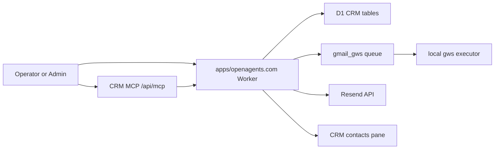

# 2026-07-04 CRM Codebase History And Architecture Audit

Status: audit only
Repository target: `openagents`
Primary current runtime: `apps/openagents.com` Cloudflare Worker plus D1
Historical source material reviewed: root workspace docs and scripts,
`deprecated/openagents.com`, `autopilot3`, `autopilot-deprecated`,
`autopilot-omega`, and `vortex`

## Executive Summary

OpenAgents has built CRM three different times, each time with a slightly
different authority model.

The current implementation home is the active `openagents` monorepo,
specifically `apps/openagents.com`. It is a Cloudflare Worker and D1 CRM slice
with tenant-scoped tables, CSV import, contact/account/list/activity/
engagement/opportunity storage, template rendering, Gmail queueing, Resend
sending, approval-gated contact commands, dry-run-first batch sends, a local
Gmail executor, and a grant-filtered CRM MCP server.

The richest historical implementation is the deprecated Laravel
`deprecated/openagents.com` app. That app introduced the investor CRM data
model, admin CRM APIs, admin pages, transactional email templates/messages/
deliveries, portal activity projection, engagement scoring, opportunity
pipeline records, source export, and Blueprint-style idempotent writebacks.
It should be treated as source material only, not as the active runtime.

`autopilot3` was the serious Convex-backed parity attempt. It imported the
Laravel shape into Convex, added project/organization scope, kept source
identity, implemented writeback ledgers, exposed CRM admin APIs, added a
`/crm` operator workspace, and documented a Laravel retirement path. That repo
is valuable architecture evidence, but the June Cloudflare cutover moved the
current product authority into `openagents/apps/openagents.com`.

`autopilot-deprecated` is mostly valuable for the older voice/CRM and HUD
work: command routing, CRM pane plans, intent parsing, selected-contact
context, sensitive action gating, and the original "Autopilot owns UI,
Blueprint owns truth, old website exports/writes back" product thesis.

`autopilot-omega` and `vortex` contain CRM-shaped product/workroom/design
references, but not a live CRM authority that should be used for new work.

The main architectural gap today is not that CRM is missing. It is that the
current Cloudflare/D1 CRM is a practical operator slice, while the old Laravel
and Convex systems contained broader source-authority, export, writeback,
engagement-scoring, portal-rollup, and opportunity-admin ideas that have not
all been reconstituted in the current runtime.

## Audit Method

This audit reviewed:

- Active `openagents` CRM docs under `docs/crm` and `docs/mcp`.
- Active `apps/openagents.com` Worker migrations, stores, route modules,
  scripts, tests, and the pure UI CRM pane.
- Root workspace Gmail/CRM docs and the local `scripts/crm-gmail.sh` bridge.
- Deprecated Laravel CRM docs, migrations, services, controllers, routes, and
  feature tests.
- `autopilot3` CRM parity docs, Convex schema contract docs, writeback
  retirement runbook, source import material, route inventory, and smoke
  scripts.
- `autopilot-deprecated` voice/CRM docs and CRM source files.
- `autopilot-omega` and `vortex` CRM references found by targeted search.

No ignored secret files were opened, and this document intentionally omits raw
tokens, production customer data, personal contact examples, provider payloads,
and live CRM record contents.

## Current Authority Map

Current CRM authority is inside `apps/openagents.com`:

- Data authority: D1 migrations `0218`, `0219`, and `0220`.
- Runtime authority: Worker route modules imported by
  `apps/openagents.com/workers/api/src/index.ts`.
- Send authority: `crm-send.ts`, with channel adapters in `crm-resend.ts` and
  the Gmail queue/writeback path.
- Tool authority: `crm-mcp.ts`, `crm-mcp-routes.ts`, and grant code in
  `crm-mcp-grant.ts`.
- Operator UI: `apps/openagents.com/apps/web/src/ui/crm-contacts-panel.ts`,
  currently presentational rather than a full data-fetching console.

The previous Laravel site and Autopilot repos are reference material, not the
runtime to extend unless a future task explicitly asks for compatibility work.

## Active OpenAgents CRM

### Schema

The active schema is defined in:

- `apps/openagents.com/workers/api/migrations/0218_crm_contacts.sql`
- `apps/openagents.com/workers/api/migrations/0219_crm_email_templates_and_messages.sql`
- `apps/openagents.com/workers/api/migrations/0220_crm_mcp_grants.sql`

Migration `0218` creates the native D1 CRM graph:

- `crm_accounts`
- `crm_contacts`
- `crm_contact_lists`
- `crm_contact_list_memberships`
- `crm_activities`
- `crm_engagement_snapshots`
- `crm_opportunities`
- `crm_opportunity_contact_roles`
- `crm_contact_commands`
- `crm_source_import_runs`

Every table carries `tenant_ref`. That is the most important difference from
the deprecated Laravel schema. The D1 model is multi-tenant from the start,
uses text primary keys and ISO timestamps, stores JSON as text, represents
booleans as `0` or `1`, uses CHECK constraints for bounded status enums, and
supports soft archival with `archived_at` on the main durable records.

Migration `0219` adds outbound email:

- `crm_email_templates`
- `crm_email_messages`

The active email ledger is intentionally smaller than Laravel. It preserves
channel, provider message id, provider draft id, provider thread id, status,
timestamps, and template/rendered body fields, but it does not yet have a
separate `crm_email_deliveries` table or first-class delivered/opened/clicked/
replied timestamps.

Migration `0220` adds scoped MCP grants:

- `crm_mcp_grants`

Raw MCP tokens are never stored. The Worker stores a token hash, tenant,
authority-class JSON, label, status, expiration, and timestamps.

### Store Layer

`apps/openagents.com/workers/api/src/crm-store.ts` is the central D1 access
layer. It defines the default tenant `tenant.openagents`, normalizes email
addresses, projects raw rows into typed CRM objects, and exposes the main
contact/account/list/activity/snapshot/opportunity/import-run functions.

Important behaviors:

- Contact upsert is keyed by tenant and normalized primary email when present.
- Account upsert and list membership helpers keep CSV import idempotent.
- Activity recording supports source-system/source-record dedupe.
- List/search functions clamp limits and remain tenant-scoped.
- Import runs capture totals, imported counts, updated counts, duplicate
  counts, failed counts, status, and error summaries.

The invariant here is straightforward: callers should go through this typed
store layer rather than constructing CRM SQL in unrelated route modules.

### CSV Import

`apps/openagents.com/workers/api/src/crm-import.ts` implements the current CSV
ingestion path. It includes a small RFC-4180-style parser for commas, quoted
fields, newlines, and doubled quotes. It maps common header synonyms for email,
first name, last name, full name, company/account, job title, secondary email,
and notes.

Import behavior:

- Requires an email column.
- Validates email with a simple bounded pattern.
- Deduplicates rows inside the uploaded file by normalized email.
- Derives or upserts accounts from company/account fields.
- Optionally adds contacts to a contact list.
- Records an import run with counts and failure diagnostics.

The route is `POST /api/operator/crm/import`.

### Templates And Email Ledger

`apps/openagents.com/workers/api/src/crm-email.ts` owns CRM templates and
rendering. It supports two channels:

- `gmail_gws`
- `resend`

The renderer performs bounded `{{ token }}` replacement over contact and app
tokens, including contact first/full name, job title, primary email, and app
base URL/name. It also converts a deliberately small Markdown subset to HTML
after escaping user content.

Primary routes:

- `GET /api/operator/crm/templates`
- `POST /api/operator/crm/templates`
- `GET /api/operator/crm/contacts/:id/render?template=...`
- `POST /api/operator/crm/contacts/:id/gmail-writeback`
- `GET /api/operator/crm/contacts/:id/emails`

The Gmail writeback route can update an existing queued message row. It records
provider draft/message/thread metadata and creates CRM activity when a send is
confirmed.

### Unified Send

`apps/openagents.com/workers/api/src/crm-send.ts` is the channel dispatcher.
It is the right public internal seam for new CRM send flows because it applies
the same suppression and unsubscribe/preference gate before either channel is
used.

Route inventory:

- `POST /api/operator/crm/contacts/:id/send`
- `GET /api/operator/crm/gmail-queue?tenant=&limit=`

Channel behavior:

- `resend` sends through the Resend adapter when explicitly armed and
  configured.
- `gmail_gws` composes the email, records a queued ledger row, and leaves
  actual Gmail draft/send work to the local executor.

### Resend Channel

`apps/openagents.com/workers/api/src/crm-resend.ts` is deliberately inert by
default. It sends only when the Resend API key/from address and
`CRM_RESEND_SEND_ENABLED` are present and truthy.

Important behaviors:

- Uses the CRM message id as the Resend idempotency key.
- Returns explicit result kinds: `dry_run`, `not_configured`, `suppressed`,
  `sent`, and `failed`.
- Records queued and sent/failed ledger state.
- Records `email_sent` activity only when the provider send succeeds.

The direct route is `POST /api/operator/crm/contacts/:id/resend-send`, though
new callers should usually prefer unified send.

### Gmail Channel

The Gmail channel intentionally keeps OAuth and the Google Workspace CLI local.
The Worker composes, gates, queues, and receives writeback. The local machine
does the Gmail operation.

Current active files:

- `docs/crm/gmail-gws-channel-runbook.md`
- `apps/openagents.com/scripts/crm-gmail-send.mjs`
- `apps/openagents.com/scripts/crm-gmail-executor.mjs`

The executor drains `GET /api/operator/crm/gmail-queue`, calls `gws gmail`
with draft-first semantics unless live send is explicitly requested, and writes
provider metadata back to `POST /api/operator/crm/contacts/:id/gmail-writeback`.

This is the Cloudflare-era successor to the root
`scripts/crm-gmail.sh` Laravel bridge.

### Commands And Approval

`apps/openagents.com/workers/api/src/crm-command.ts` implements the
approval-gated contact command lane.

Current command shape:

- `proposeCrmSendCommand` records a `send_email` contact command in status
  `proposed` with approval state `pending_approval`.
- `approveAndExecuteCrmSendCommand` re-checks state and calls unified send.
- `rejectCrmCommand` marks the command rejected.
- Suppressed recipients can still be proposed, but approval execution marks the
  command failed rather than bypassing the send policy.

Routes:

- `POST /api/operator/crm/contacts/:id/commands/send-email`
- `GET /api/operator/crm/commands?status=proposed`
- `POST /api/operator/crm/commands/:id/approve`
- `POST /api/operator/crm/commands/:id/reject`

This is smaller than the deprecated Blueprint writeback system, but it captures
the critical safety property: operator-facing sends are proposed, approved, and
receipt-backed rather than fired as opaque direct mutations.

### Batch Sends

`apps/openagents.com/workers/api/src/crm-batch.ts` implements the Sprint A
batch lane. The route is:

- `POST /api/operator/crm/send-batch`

Route behavior defaults to dry run. Live batch sends must be explicit.
Contacts are chunked into waves, failures are recorded per row, and one failed
recipient does not abort the whole wave. Dispositions include `sent`, `queued`,
`dry_run`, `would_send`, `suppressed`, and `failed`.

The MCP batch tool is even more conservative: it is dry-run-only.

### CRM MCP

The CRM MCP server is the most complete current agent-facing CRM surface.
It lives in:

- `apps/openagents.com/workers/api/src/crm-mcp-routes.ts`
- `apps/openagents.com/workers/api/src/crm-mcp.ts`
- `apps/openagents.com/workers/api/src/crm-mcp-grant.ts`
- `apps/openagents.com/workers/api/src/crm-mcp-grant-routes.ts`
- `apps/openagents.com/workers/api/src/crm-mcp-discovery-routes.ts`

Transport:

- Endpoint: `POST /api/mcp`
- JSON-RPC 2.0
- Protocol version: `2025-06-18`
- Server name: `openagents-crm-mcp`
- Discovery: `GET /.well-known/openagents-mcp.json`

Read tools:

- `crm.contacts.list`
- `crm.contact.get`
- `crm.contact.activities.list`
- `crm.contact.engagement.get`
- `crm.contact.emails.list`
- `crm.accounts.list`
- `crm.account.get`
- `crm.lists.list`
- `crm.opportunities.list`
- `crm.opportunity.get`
- `crm.imports.list`
- `crm.templates.list`
- `crm.contact.render`
- `crm.gmail.queue.list`
- `crm.commands.list`

Write tools:

- `crm.send.command.propose`
- `crm.template.upsert`
- `crm.send.command.approve`
- `crm.send.command.reject`
- `crm.import.run`
- `crm.batch.send`

Authority classes:

- `operator_read`
- `workspace_write`
- `approval_resolution`

Important properties:

- Tool catalogs are filtered by grant. Ungranted tools are absent, not merely
  hidden in docs.
- Tenant is bound to the resolved principal. Client-supplied tenant arguments
  do not override the grant/admin tenant.
- Raw MCP tokens are returned once on mint and then represented only by hashes.
- Revoked, expired, invalid, or authority-empty grants resolve to no principal.
- Output is projected through the OpenAgents MCP output boundary.
- Unknown tools and tool failures return MCP tool error content rather than
  crashing the transport.

Resources:

- `mcp://openagents/worker/crm/contacts`
- `mcp://openagents/worker/crm/accounts`
- `mcp://openagents/worker/crm/lists`
- `mcp://openagents/worker/crm/opportunities`
- `mcp://openagents/worker/crm/imports`
- `mcp://openagents/worker/crm/commands`
- Single contact/account/opportunity resource reads.

The phase-1 MCP audit in `docs/mcp/2026-06-22-crm-mcp-server-phase-1-audit.md`
records this as a completed 21-tool server.

### UI Pane

`apps/openagents.com/apps/web/src/ui/crm-contacts-panel.ts` is a pure
presentational CRM pane. It builds:

- contact list state
- selected contact detail
- activity summaries
- email counts
- Gmail queue state

It does not fetch data, hold send authority, or own CRM mutations. This is
healthy as a UI primitive, but it means the current CRM does not yet have a
full operator console equivalent to the old Laravel admin pages or the
Autopilot3 `/crm` workspace.

### Current Tests

The active test suite covers the useful CRM contract well:

- Store normalization, upsert, tenant filtering, search, activity dedupe, and
  import-run lifecycle.
- CSV parser, header mapping, duplicate rows, account/list membership, and
  missing-column failures.
- Template rendering, safe Markdown/HTML conversion, and fallback values.
- Email routes, render eligibility, suppression, Gmail writeback, ledger
  updates, and existing queued-row updates.
- Resend dry-run/configuration/suppression/provider-failure/send behavior.
- Unified send channel selection and shared suppression gate.
- Command propose/approve/reject behavior and suppressed-command failures.
- Batch planning, dry-run behavior, live Gmail/Resend dispatch, suppressed
  rows, and route defaults.
- MCP transport, lifecycle methods, grant filtering, tenant binding, resources,
  read/write tool coverage, smoke flows, and revoked-grant behavior.
- Pure CRM pane helpers and model building.

For a doc-only audit, no runtime tests need to be re-run, but the coverage
shows the current CRM slice is not just notes.

## Existing Active Docs

The active docs under `docs/crm` record the Cloudflare cutover:

- `2026-06-22-crm-state-of-the-world-and-cloudflare-cutover-audit.md`
- `csv-import-runbook.md`
- `gmail-gws-channel-runbook.md`
- `resend-channel-runbook.md`
- `chat-blueprint-send-command-runbook.md`
- `desktop-crm-pane-and-executor-runbook.md`
- `sprint-a-150-send-runbook.md`

The 2026-06-22 audit is especially important. It states the current mandate:
do not resurrect Laravel as the runtime, do not move CRM back into Convex, and
build the shared multi-tenant CRM inside `apps/openagents.com` on Cloudflare,
Effect, and D1.

That audit also names the June implementation line:

- D1 contact CRM model and read APIs.
- CSV import.
- Gmail/gws channel.
- Resend channel, inert until armed.
- Unified two-channel send.
- Chat to Blueprint-style `send_email` command flow.
- Desktop pane and executor.
- Sprint A batch-send runbook.

The MCP docs under `docs/mcp` record the next layer:

- `2026-06-22-crm-mcp-server-phase-1-audit.md`
- `crm-mcp-client-runbook.md`

## Root Workspace CRM And Gmail Work

Before the active Cloudflare CRM, the root workspace had local Gmail/CRM
operator material:

- `docs/2026-04-29-openagents-com-investor-crm-and-engagement-audit.md`
- `docs/2026-04-29-gmail-api-drafts-and-openagents-production-data-audit.md`
- `docs/2026-04-30-gws-gmail-crm-runbook.md`
- `scripts/crm-gmail.sh`

The April 29 investor CRM audit defined the common CRM vocabulary that still
shows up in every later implementation:

- accounts
- contacts
- contact lists
- list memberships
- activities
- email templates
- email messages
- email deliveries
- engagement snapshots
- opportunities
- opportunity contact roles
- later tasks and notes

It also made the core modeling decision: do not turn an investor access table
into a giant CRM table. CRM contacts are the relationship records; portal
access and portal events are linked evidence.

The Gmail audit and runbook established the draft-first local Gmail posture:
use the production CRM API as source of truth for contact/template data, keep
Google OAuth local, draft by default, and add writeback only after the draft
flow is stable.

`scripts/crm-gmail.sh` was the old Laravel bridge. It read a local ignored
secret file, resolved a CRM contact/template through `/api/admin/crm`, rendered
an email preview, and invoked `gws`. It was draft-first and explicitly local.
The active Worker Gmail executor is the direct successor, but now the Worker
owns queueing and writeback.

## Deprecated Laravel Website CRM

The deprecated website under `deprecated/openagents.com` contains the broadest
implemented CRM feature set.

### Laravel Model

Important docs:

- `docs/investor-crm-foundation.md`
- `docs/investor-crm-api.md`
- `docs/investor-crm-sanctum-agent-runbook.md`
- `docs/investor-crm-admin-decommission-plan.md`
- `docs/investor-crm-activities.md`
- `docs/investor-crm-engagement-snapshots.md`
- `docs/investor-crm-transactional-email.md`
- `docs/investor-crm-opportunities.md`
- `docs/autopilot-onboarding.md`

Important tables:

- `crm_accounts`
- `crm_contacts`
- `crm_contact_lists`
- `crm_contact_list_memberships`
- `crm_email_templates`
- `crm_email_messages`
- `crm_email_deliveries`
- `crm_activities`
- `crm_engagement_snapshots`
- `crm_opportunities`
- `crm_opportunity_contact_roles`
- `crm_writeback_requests`

The Laravel model was investor-CRM-first but fairly complete. It had contact
owner fields, WorkOS user links, secondary email, relationship stage,
portal-access status, last-contacted/engaged/replied timestamps, engagement
score, email provider delivery rows, provider payload storage, activity
bridges, opportunity pipeline records, and a durable writeback ledger.

### Laravel API

The admin CRM API lived under `/api/admin/crm` with Sanctum plus admin approval
middleware. It used explicit abilities:

- `crm:read`
- `crm:write`
- `crm:email:send`
- `crm:export`
- `crm:writeback`

The app supported `transitional`, `read_only`, and `redirect` modes through
CRM admin mode configuration. Direct browser/admin mutations and direct email
sends could be locked while source export and writeback compatibility remained
available.

Read/write route groups covered scope, contacts, accounts, lists, templates,
previews, emails, activities, snapshots, opportunities, investor access links,
source export, and writebacks.

### Source Export

`AdminCrmSourceExportController` was one of the best pieces of historical
architecture. It exposed CRM resources as source records with:

- stable external source ids
- source table/resource names
- source primary keys
- source timestamps
- schema version
- classification
- redaction metadata
- tombstone markers
- cursor pagination
- `updated_since`
- sanitized fixture mode

Exportable resources included contacts, accounts, contact lists, memberships,
templates, messages, deliveries, activities, engagement snapshots,
opportunities, opportunity roles, dataroom access links, portal sessions,
portal activity events, and investor access records.

This has not been fully recreated in the active Worker. The current Worker has
MCP reads and operator APIs, but not the same generalized source export
contract with classification, sanitized fixtures, tombstones, and stable
source-record wrappers.

### Writeback

`AdminCrmWritebackController` implemented the broadest writeback contract. It
required idempotency and Blueprint-style fields such as action submission,
workspace, actor, purpose, source authority, source write request, approval,
rollback posture, and optional receipt id.

Supported operations:

- contact update
- account update
- transactional email send
- dataroom access link create

The writeback ledger hashed idempotency keys, rejected conflicting reuse,
created durable rows, supported dry run, recorded request/response/error
payloads, and used `unknown_external_state` when an operation might have
escaped before failure.

The current Worker `crm_contact_commands` table and MCP command tools capture
approval-gated send behavior, but they are not equivalent to this generalized
writeback ledger.

### Email And Engagement

The Laravel transactional email system had:

- templates
- messages
- deliveries
- Markdown/HTML rendering
- provider thread/message ids
- delivered/opened/clicked/replied timestamps
- provider payload/error capture
- email activity projection

The engagement service computed last portal/email/manual touch fields,
30-day portal/email counters, meeting counts, engagement score, and score
reasons. It synchronized denormalized contact timestamps and scores.

The active Worker keeps the essential message ledger and snapshot record, but
the older detailed scoring and provider-delivery model has not been fully
ported.

### Portal And Investor Bridges

Laravel services bridged investor-specific flows into CRM:

- `CrmInvestorSyncService` projected investor access and configured emails into
  CRM accounts, contacts, system lists, and memberships.
- `CrmActivityService` projected portal views, clicks, logins, and other
  events into CRM activities.
- `CrmEngagementSnapshotService` converted activity and email signals into
  snapshots and contact scores.
- `InvestorDataRoomAccessLinkService` created dataroom links tied to contacts.

These bridges are important because they make CRM a relationship memory, not
only an outreach table.

### Laravel Admin UI

The deprecated browser UI included:

- CRM contact index.
- CRM contact detail.
- Contact email send panel.
- Compatibility investor admin pages.
- Activity and engagement views.

The active `openagents` CRM has a pure UI pane but not yet a full replacement
operator console with the same breadth.

### Autopilot Onboarding In Laravel

`docs/autopilot-onboarding.md` and the related services implemented a
CRM-adjacent lead/conversation path:

- public/admin onboarding surfaces
- lead/session/turn/spec records
- LiveKit/voice support
- LLM-generated onboarding specs
- Forge work-order handoff

The important CRM lesson from this work is the authority boundary: onboarding
and agent conversations may gather context, but they must not execute or
approve source-system writes without a Source Authority, writeback path,
approval policy, and audit event policy.

## Autopilot3 CRM

`autopilot3` is the main non-OpenAgents repo to remember for CRM. Its May 2026
docs say it was moving from investor-portal CRM substrate to canonical
Convex-backed CRM.

Important docs:

- `docs/2026-05-14-crm-openagents-com-parity-audit.md`
- `docs/crm-convex-schema-contract.md`
- `docs/crm-source-import-runbook.md`
- `docs/crm-writeback-retirement-runbook.md`
- `docs/crm-contact-command.md`
- `docs/crm-contacts-and-conversation-associations.md`
- `docs/crm-parity-tests-and-retirement-checklist.md`

Important source areas:

- `convex/schema.ts`
- `convex/crm.ts`
- `convex/crmAdmin.ts`
- `convex/crmContactCommands.ts`
- `convex/crmSourceImport.ts`
- `src/routes/api/admin/crm/*`
- `src/routes/api/crm/*`
- `src/routes/crm/*`
- `scripts/crm-api-smoke.mjs`
- `scripts/crm-parity-suite.mjs`

### What It Had

Autopilot3 implemented or documented:

- Convex tables for accounts, contacts, lists, memberships, activities,
  templates, messages, deliveries, engagement snapshots, opportunities,
  opportunity roles, source import records, contact commands, and writeback
  requests.
- Source identity fields such as external source, source table, source primary
  key, source id, and source update time.
- Optional organization and project scope on CRM records.
- Optional email contacts for honest legacy import.
- Contact owner/account owner support.
- Broader email delivery fields than the current Worker.
- Engagement snapshot fields for portal/email/manual activity and counters.
- Opportunity pipeline records.
- A durable `crmWritebackRequests` table with idempotency hash, canonical
  payload comparison, status, external state, dry-run support, replay/conflict
  detection, and unknown-state handling.
- API token scopes matching the Laravel abilities.
- Admin routes for scope, accounts, contacts, lists, opportunities,
  writebacks, source import/export, email templates/messages, and investor
  access links.
- A `/crm` operator workspace, described as a compatibility surface while the
  product direction moved toward chat tools, typed dialogs, receipts, and audit
  events.

### Why It Is Not The Current Runtime

The June Cloudflare audit made a new ownership decision: active CRM work should
live in `openagents/apps/openagents.com`, not in Convex-backed Autopilot3.

So Autopilot3 is best used as:

- parity reference for fields and route behavior
- writeback/idempotency design reference
- source import/backfill reference
- project-scoping reference
- operator workspace reference

It should not be treated as the place to add new CRM product behavior unless
the task explicitly asks for Autopilot3 compatibility or historical extraction.

## Autopilot Deprecated CRM And Voice Work

`autopilot-deprecated` contains the older P0 Autopilot CRM thesis. The key
document is `docs/crm-master-spec-roadmap.md`.

That roadmap describes a completed P0 track across Blueprint, Autopilot, and
the old website:

- Blueprint CRM package, source mappings, Source Authority, context packs,
  action types, receipts, eval fixtures, SDK helpers, and app manifest scope.
- Autopilot CRM BFF contract, HUD panes, investor prep workflow, enrichment
  queue, outreach approval/status panes, team access, operator queues, and
  rollout gates.
- Old website source export, approval-gated writeback compatibility, and
  Laravel read-only/decommission mode.

The product thesis was:

- Autopilot owns the product surface, command flows, HUD panes, route
  orchestration, and BFF calls.
- Blueprint owns durable CRM truth, source mappings, identity, Source
  Authority, actions, approvals, events, evidence, receipts, evals, and SDK
  scope.
- The old website remains public site, investor portal, dataroom, and
  transition CRM source.

The code also contains CRM-specific voice and UI material:

- `src/crm/crmAdapter.ts`
- `src/crm/crmClient.ts`
- `src/crm/intentParser.ts`
- `src/crm/panePlans.ts`
- `src/crm/CrmPaneContent.tsx`
- `src/crm/voiceSchemas.ts`
- `docs/voice-crm-schema-contract.md`
- `docs/voice-crm-threat-model.md`
- `docs/voice-crm-workos-implementation-roadmap.md`
- `docs/crm-voice-observability.md`

This lane is most useful for command semantics, sensitive action gating,
voice-to-CRM UX, selected-object context, and pane composition. It is not a
current durable CRM authority.

## Autopilot Omega And Vortex

`autopilot-omega` contains CRM-shaped Omni/workroom references:

- CRM follow-up workroom tests and implementation.
- Workroom-kind templates.
- Targeted-site outreach schema docs.
- The same previous Resend/Gmail email systems audit that later influenced the
  active `openagents` Worker.

It is useful for source extraction and product-language history, but it should
not receive unspecified CRM work.

`vortex` contains product and design references:

- CRM/CEO/Ops dogfood docs.
- Convex schema and prototype references.
- JSON-render and screenshot/demo material for CRM tables and workrooms.
- Signature package examples around CRM account briefs.

It helped shape the idea that CRM should be a business-object/workroom system,
not merely a sidebar database. It is not an active CRM runtime.

## Related Active Product Surfaces

Some current OpenAgents code is CRM-adjacent but not part of the CRM tables.

### Business Signup And Funnel

`apps/openagents.com/workers/api/src/business-signup-routes.ts` and
`business-funnel-dashboard.ts` capture public signup and aggregate funnel
metrics. This is lead/funnel infrastructure, not the CRM graph.

Important boundary:

- Public signup responses are safe and do not echo private submitted details.
- Funnel dashboard output is aggregate only.
- It excludes contact details, user ids, business names, payment payloads,
  raw provider payloads, client identifiers, and per-user journey state.

Future CRM work could connect accepted/signup leads into contacts, but that
must happen through a typed route/tool and preserve the public projection
privacy boundary.

### Customer One Cohort

`customer-one-cohort-projection` code exposes private operator rows and public
evidence-only projection. It is customer-success adjacent, not relationship CRM.

The public projection intentionally rejects raw prompts, shell logs, private
repo paths, local paths, URLs, emails, provider payloads, secrets, wallet data,
payment data, invoices, and customer private data.

This is a good privacy model for any future public CRM-adjacent projection.

### Autopilot Concierge Tools

Some inference/concierge code mentions `crm_write` as a capability class, but
the active guardrails are clear: do not promise CRM writes unless a reviewed
surface actually performs them. Today, the reviewed write surfaces are the CRM
operator routes, command approval routes, and MCP tools described above.

## Data Model Delta

| Area | Deprecated Laravel | Autopilot3 Convex | Current OpenAgents Worker |
| --- | --- | --- | --- |
| Tenancy | Mostly single app/admin with Sanctum abilities | Organization/project optional scope | Required `tenant_ref` on every CRM table |
| Contacts | Rich investor CRM fields, owner, WorkOS, relationship, score | Parity fields plus source identity and project scope | Core person fields, relationship/lifecycle, external refs, metadata, soft archive |
| Accounts | CRM account/fund records | Source identity and project scope | Tenant-scoped accounts with status/type/domain/source refs |
| Lists | System lists and memberships | System lists plus roster fields | Tenant-scoped lists and memberships |
| Activities | Portal/email/manual activity bridge | Source identity and scope | Tenant-scoped activity ledger with source dedupe |
| Engagement | Detailed rollups and scoring reasons | Detailed portal/email/manual counters | Snapshot table exists, but scoring/rollup depth is slimmer |
| Email templates | Markdown/HTML templates and variables | Parity plus provider-agnostic persistence | Active templates with bounded token rendering |
| Email messages | Message plus separate deliveries | Message plus deliveries and event capture | Message ledger, channel, provider ids, no separate delivery table |
| Opportunities | Fundraising pipeline and roles | Full parity plus scope | Opportunity and role tables exist, API/tool surface is read-oriented |
| Source export | Generalized classified export with sanitized fixtures | Source import/export parity path | Not yet equivalent; MCP reads cover operational access |
| Writeback | General idempotent Blueprint-style writebacks | General writeback ledger | Send command ledger plus approval tools; not full source writeback |
| UI | Laravel admin pages | `/crm` workspace and chat-native direction | Presentational CRM pane plus operator/API/MCP surfaces |
| Gmail | Local root script over Laravel preview API | Reference only | Worker queue plus local executor and writeback |
| Resend | Transactional email send path | Persisted provider rows, live send not always attached | Inert-until-armed Resend adapter with idempotent send |

## Security And Policy Invariants

The shared workspace and OpenAgents invariants matter for CRM:

- Do not add ad hoc string or keyword routing for CRM/database query routing or
  user-facing intent routing. Use typed tools, structured planners, semantic
  selectors, MCP schemas, or modeled parsers.
- Keep tenant authority on the server side. Client arguments must not override
  a grant-bound tenant.
- Keep raw tokens out of stored records, docs, logs, and commits. Store hashes
  for operator/MCP/API tokens.
- Keep Gmail OAuth local unless a future reviewed product decision changes the
  authority model.
- Keep Resend inert until explicitly armed and configured.
- Apply suppression/unsubscribe/preference checks before all sends, including
  command approvals and batch sends.
- Make batch operations dry-run-first.
- Keep public projections aggregate or evidence-only and free of private CRM
  contact details.
- Treat source-authority/writeback changes as policy changes: model the
  bounded behavior, preserve idempotency, and turn counterexamples into tests.

## Gaps And Risks

### General Source Export Is Missing In The Current Worker

The active MCP read surface is useful for agents, but it is not the same as
the Laravel source export contract. If OpenAgents still needs CRM backfill,
auditor-friendly export, sanitized fixtures, or cross-system source authority,
the Worker needs a Cloudflare-native source export model with classification,
redaction metadata, tombstones, cursors, and stable source ids.

### Full Writeback Ledger Is Missing In The Current Worker

The current `crm_contact_commands` model is good for approval-gated sends, but
it does not cover generalized contact/account/opportunity/dataroom writebacks
with idempotency, replay/conflict handling, source authority refs, rollback
posture, and unknown external state.

If future tools write CRM records beyond send commands, they should not invent
one-off mutation routes. They should either extend the current command ledger
or introduce a Worker-native writeback table modeled after the Laravel and
Autopilot3 designs.

### Engagement Scoring Is Shallower Than The Old System

The current Worker has snapshots, but the old Laravel service had richer
portal, email, manual touch, meeting count, and score reason logic. If CRM is
used for prioritization, follow-up scoring, or public/private customer health
views, the rollup/scoring model should be rebuilt in the active runtime.

### Email Delivery Model Is Slimmer

The current ledger is enough for Gmail queueing and Resend send receipts, but
it lacks the separate provider delivery table and delivered/opened/clicked/
replied timestamps from Laravel and Autopilot3.

This is acceptable for Sprint A outreach, but not for a full engagement CRM.

### Operator UI Is Not Yet A Full Console

The presentational pane is useful, but it does not replace:

- Laravel contact index/detail pages.
- Autopilot3 `/crm` workspace.
- Source import diagnostics.
- Writeback status panels.
- Opportunity admin views.
- Approval queue console.

The MCP server covers agents well; humans still need a richer first-party
operator workflow when CRM becomes more than batch outreach.

### Resend And Gmail Operational Proof Are Separate

The code correctly gates both channels. The remaining work is operational:

- prove Resend sender/domain/key readiness in the target environment before
  live sends;
- prove Gmail executor dry-run, draft, live send, and writeback loops on the
  intended operator machine;
- keep those proofs out of public docs when they contain private contact data.

### Autopilot3 Has Ideas Worth Porting, But Not Wholesale

Autopilot3's source identity, project scope, writeback ledger, and source
import diagnostics are valuable. Its full Convex runtime should not be copied
back into OpenAgents. Port the contracts and tests, not the old authority.

## Recommended Next Work

1. Decide whether the current Worker needs a first-class `crm_source_exports`
   or source-record export API. If yes, port the Laravel classification,
   sanitized fixture, tombstone, cursor, and source-id concepts into D1/Effect
   style.
2. Add a generalized Worker-native CRM writeback ledger before exposing any new
   CRM mutations to agents beyond the existing send-command flow.
3. Rebuild engagement rollups in the active Worker: portal events, email
   delivery/open/click/reply events, manual touches, meetings, score reasons,
   and denormalized contact score/timestamps.
4. Decide whether to reintroduce a separate `crm_email_deliveries` table or
   extend `crm_email_messages` enough to track provider delivery lifecycle.
5. Build a real operator CRM workspace around the existing pane, MCP tool
   catalog, Gmail queue, command approval queue, imports, and send-batch dry
   runs.
6. Port only the Autopilot3 contracts that still matter: project scope, source
   identity, idempotent writebacks, conflict handling, and source import
   diagnostics.
7. Keep business signup, customer cohort projection, and concierge tool
   capabilities as adjacent surfaces until a typed CRM ingestion route exists.
8. Add one explicit architecture doc for "CRM authority and mutation policy"
   once the writeback/export decision is made, then update invariants if that
   policy changes.

## Bottom Line

OpenAgents has enough CRM to operate the current outreach loop today: import
contacts, render templates, queue Gmail, send through gated Resend, approve
commands, run dry-run batches, expose MCP tools, and record activity.

The older systems show what the next maturity level looks like: source export,
writeback authority, richer engagement, delivery lifecycle, opportunity
workflow, and a proper operator console. The safest path is to keep the active
runtime in `apps/openagents.com`, then selectively port those contracts into
the Cloudflare/D1 stack with the same approval, tenant, redaction, and
idempotency discipline.
