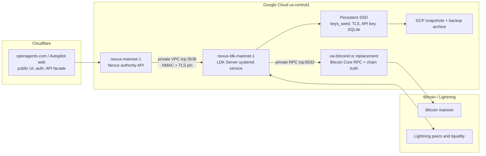

# Nexus LDK GCP Runbook

Date: 2026-05-16

This runbook implements the LDK-06 topology for Nexus v0.2 and Pylon v0.2:
hosted `bitcoind` plus LDK Server on Google Cloud, with Nexus calling the LDK
node over a private interface. LDK-07 cuts the standard Nexus funding-invoice
path to LDK `Bolt11Receive`; LDK admin operations own peer, channel, and payout
smoke.

## Architecture



Hosting decision:

- Google Cloud is the right host for `bitcoind`, LDK Server, channel state,
  node seed, SQLite state, snapshots, and restore drills.
- Cloudflare remains the right host for web, edge API facades, auth, queues,
  read-only projections, and React/Three visualizations.
- Cloudflare Workers must not host the LDK node or Nexus treasury spend
  authority.

## Scripts

All scripts live under `scripts/deploy/nexus/`.

1. Provision the private topology:

```bash
NEXUS_LDK_TOPOLOGY_DRY_RUN=true \
scripts/deploy/nexus/22-provision-ldk-topology.sh

NEXUS_LDK_TOPOLOGY_DRY_RUN=false \
scripts/deploy/nexus/22-provision-ldk-topology.sh
```

The provisioning script creates or updates:

- `nexus-ldk-mainnet-1` with no external IP.
- `nexus-ldk-data-mainnet` persistent SSD.
- IAP SSH ingress only from `35.235.240.0/20`.
- private LDK gRPC ingress on `tcp:3536` only from the Nexus host tag.
- private `bitcoind` RPC ingress only from the LDK host tag.

It does not expose the LDK gRPC port publicly. Public Lightning P2P is skipped
by default. Set `NEXUS_LDK_ALLOW_PUBLIC_P2P=true` only after the node is ready
to announce and the operator has reviewed channel/liquidity policy.

2. Install and pin LDK Server:

```bash
NEXUS_LDK_INSTALL_DRY_RUN=true \
scripts/deploy/nexus/23-install-ldk-server-host.sh

NEXUS_LDK_SERVER_REF=<reviewed-commit-or-tag> \
NEXUS_BITCOIND_RPC_HOST=<private-bitcoind-ip> \
NEXUS_BITCOIND_RPC_PORT=8332 \
NEXUS_BITCOIND_RPC_USER=<rpc-user> \
NEXUS_BITCOIND_RPC_PASSWORD_PATH=/etc/ldk-server/bitcoind-rpc-password \
scripts/deploy/nexus/23-install-ldk-server-host.sh
```

The install script requires the `bitcoind` RPC password file before a real
install. For a bootstrap that intentionally writes a placeholder first, set
`NEXUS_LDK_INSTALL_ALLOW_PLACEHOLDER_BITCOIND=true`; do not treat that as a
passing read-only host until the real password is written and smoke passes.

The installer:

- mounts the LDK data disk at `/var/lib/ldk-server`;
- builds `ldk-server` and `ldk-server-cli` from the pinned
  `NEXUS_LDK_SERVER_REF`;
- writes `/etc/ldk-server/ldk-server.toml`;
- binds LDK gRPC/metrics to `0.0.0.0:3536`, protected by private VPC firewall;
- enables Prometheus metrics on the same port;
- installs `ldk-server.service` with `Restart=always`;
- installs `/etc/logrotate.d/ldk-server`;
- leaves LDK-generated API key and TLS files on disk without printing them.

LDK Server stores the API key as raw bytes at:

```text
/var/lib/ldk-server/<network>/api_key
```

The CLI expects hex when used manually:

```bash
xxd -p -c 64 /var/lib/ldk-server/bitcoin/api_key
```

Do not paste the raw or hex API key into docs, issue comments, logs, or commit
messages.

## Pylon v0.2 Registration

Pylon v0.2 nodes must register an LDK-compatible Lightning payout target before
Nexus treats them as eligible for new paid work. Configure one of:

- a BOLT12 offer, preferred for durable registration;
- a BIP353 name;
- an LNURL-pay target;
- a per-payment BOLT11 invoice when the provider can rotate invoices safely.

Example config intent:

```text
payout_destination = "lno..."
```

Normal Pylon startup no longer creates Spark payout destinations. The only
Pylon registration path is Lightning-only. Spark-only workers remain visible to
Nexus for audit, but new paid-work eligibility should show
`payout_target_requires_ldk_v0_2`.

3. Run read-only smoke:

```bash
# Local proof smoke, no hosted VM required.
scripts/deploy/nexus/24-smoke-ldk-server-readonly.sh

# Hosted VM smoke.
NEXUS_LDK_REMOTE_SMOKE=true \
scripts/deploy/nexus/24-smoke-ldk-server-readonly.sh
```

Hosted smoke checks:

- `ldk-server.service` is active;
- `keys_seed`, `tls.crt`, network `api_key`, and `ldk_node_data.sqlite` exist;
- `ldk-server-cli get-node-info` works;
- `ldk-server-cli get-balances` works;
- `GET /metrics` responds on the private gRPC port.

4. Sync LDK client material to Nexus:

```bash
scripts/deploy/nexus/28-sync-ldk-client-material.sh
```

This script copies only the client API key and TLS certificate needed by the
Nexus process from `nexus-ldk-mainnet-1` to `nexus-mainnet-1`. It does not
print secret bytes. It installs:

- `/etc/nexus-relay/ldk-server/api_key`
- `/etc/nexus-relay/ldk-server/tls.crt`
- `/etc/nexus-relay/ldk-server/client.env`

The Nexus Docker service mounts `/etc/nexus-relay` read-only, so these files
are visible to the container at the same paths. The generated `client.env` is
an operator receipt; the deploy script still writes the canonical runtime env.
The API key is owned by UID `60000`, matching the non-root `nexus` user inside
the `nexus-relay` image.

5. Deploy Nexus against LDK:

```bash
DEPLOY_IMAGE=<registry-image> \
NEXUS_TREASURY_PROVIDER=ldk \
NEXUS_LDK_SERVER_URL=auto \
NEXUS_LDK_API_KEY_PATH=/etc/nexus-relay/ldk-server/api_key \
NEXUS_LDK_TLS_CERT_PATH=/etc/nexus-relay/ldk-server/tls.crt \
NEXUS_LDK_NETWORK=bitcoin \
NEXUS_LDK_CHAIN_BACKEND=bitcoind \
NEXUS_CONTROL_TREASURY_POLICY_APPLY_ENV=true \
NEXUS_CONTROL_TREASURY_POLICY_CHANGE_REASON="cut production Nexus treasury provider to LDK Server" \
scripts/deploy/nexus/03-configure-and-start.sh
```

`NEXUS_LDK_SERVER_URL=auto` resolves to
`nexus-ldk-mainnet-1:3536`, not the private IP. The LDK Server TLS certificate
is valid for the VM hostname, and GCE internal DNS resolves that hostname from
the Nexus VM. Production deploys refuse to proceed unless
`NEXUS_TREASURY_PROVIDER` is
`ldk`, `NEXUS_LDK_NETWORK` is `bitcoin`/`mainnet`, and the LDK client paths are
set.

6. Back up LDK state:

```bash
NEXUS_LDK_BACKUP_DRY_RUN=true \
scripts/deploy/nexus/25-backup-ldk-server-state.sh

NEXUS_LDK_BACKUP_BUCKET=gs://openagentsgemini-nexus-ldk-backups \
scripts/deploy/nexus/25-backup-ldk-server-state.sh
```

The backup script creates:

- a GCP persistent-disk snapshot of the LDK data disk;
- a secret-bearing archive containing `keys_seed`, `tls.crt`, optional
  `tls.key`, network `api_key`, `ldk_node_data.sqlite`, optional
  `ldk_server_data.sqlite`, and `/etc/ldk-server`.

The archive contains custody material. Store it only in the restricted backup
bucket and do not copy it into the repo.

7. Run a restore drill:

```bash
NEXUS_LDK_RESTORE_DRY_RUN=true \
NEXUS_LDK_RESTORE_SNAPSHOT=<snapshot-name> \
scripts/deploy/nexus/26-restore-ldk-server-drill.sh

NEXUS_LDK_RESTORE_SNAPSHOT=<snapshot-name> \
scripts/deploy/nexus/26-restore-ldk-server-drill.sh
```

The drill creates a temporary read-only restore VM/disk, mounts the restored
disk read-only, verifies critical files, and leaves cleanup commands in the
output.

8. Run production readiness smoke:

```bash
NEXUS_BASE_URL=https://nexus.openagents.com \
NEXUS_CONTROL_ADMIN_BEARER_TOKEN=<admin-token> \
scripts/deploy/nexus/27-smoke-ldk-production-readiness.sh
```

The readiness smoke verifies the active Nexus API path:

- `GET /v1/treasury/status` reports `active_treasury_provider=ldk`,
  `active_treasury_rail=ldk`, and an `ldk_readiness` snapshot.
- The status payload separates `wallet_total_onchain_balance_sats`,
  `wallet_spendable_onchain_balance_sats`, `wallet_lightning_balance_sats`,
  and `wallet_balance_sats`. Treat `wallet_balance_sats` as usable payout
  liquidity; total on-chain sats may still be pending and are not enough for
  production readiness.
- `POST /v1/treasury/funding-target` returns a BOLT11 invoice from the LDK
  provider and no non-LDK invoice field.
- `POST /v1/admin/treasury/operations` can read `treasury.status`,
  `treasury.listPeers`, `treasury.listChannels`, and `treasury.listPayments`.
- JSON artifacts are written under `target/nexus-ldk-readiness/<timestamp>/`.

Optional write smoke is opt-in because it can connect peers, open channels, or
send payments:

```bash
NEXUS_LDK_WRITE_SMOKE=true \
NEXUS_LDK_SMOKE_PEER_NODE_ID=<peer-node-id> \
NEXUS_LDK_SMOKE_PEER_ADDRESS=<host:port> \
NEXUS_LDK_SMOKE_CHANNEL_AMOUNT_SATS=100000 \
scripts/deploy/nexus/27-smoke-ldk-production-readiness.sh
```

`NEXUS_LDK_SMOKE_CHANNEL_AMOUNT_SATS` must be at least
`NEXUS_LDK_SMOKE_MIN_CHANNEL_SATS`, which defaults to `20000`. This keeps the
write smoke from creating tiny channel probes that counterparties reject below
their policy minimum. A rejected pending open is reconciled back to a failed
operation and does not count as readiness capacity.

For payment send smoke, set one of:

```bash
NEXUS_LDK_SMOKE_PAY_INVOICE=<bolt11-invoice>
NEXUS_LDK_SMOKE_PAY_OFFER=<bolt12-offer>
NEXUS_LDK_SMOKE_PAY_AMOUNT_SATS=<amount-for-zero-amount-targets>
```

Each write command requires an idempotency key and records a redacted
`TreasuryOperationRecord`. Do not paste raw invoices, node secrets, API keys,
TLS keys, or bearer tokens into issue comments or docs.

## Nexus Client Configuration

After hosted LDK Server smoke passes, configure Nexus with disk paths that live
on the Nexus host and contain copied, pinned client material:

```bash
NEXUS_TREASURY_PROVIDER=ldk
NEXUS_LDK_SERVER_URL=nexus-ldk-mainnet-1:3536
NEXUS_LDK_API_KEY_PATH=/etc/nexus-relay/ldk-server/api_key
NEXUS_LDK_TLS_CERT_PATH=/etc/nexus-relay/ldk-server/tls.crt
NEXUS_LDK_NETWORK=bitcoin
NEXUS_LDK_CHAIN_BACKEND=bitcoind
```

Copy the API key and TLS cert through a secure operator path. The Nexus process
must load the key from disk and log only a TLS certificate fingerprint.

The supported operator path is:

```bash
scripts/deploy/nexus/28-sync-ldk-client-material.sh
```

After this configuration is active, `POST /v1/treasury/funding-target` should
return a BOLT11 invoice plus `phase_timings`. The standard funding path must
not create any non-LDK invoice.

## Production Readiness Gates

Production LDK is ready only when every gate below is green:

- `ldk_readiness.state` is `ready` on `/v1/treasury/status`, or the only
  remaining state is a documented warning accepted by the operator for that
  rollout.
- `wallet_spendable_onchain_balance_sats` and/or Lightning spendable outbound
  capacity have moved above zero after funding confirms.
- `ldk_readiness.projected_outbound_capacity_sats` is above the active payout
  reserve.
- `ldk_readiness.projected_inbound_capacity_sats` is nonzero once Pylon payout
  targets exist.
- `ldk_readiness.recent_failed_payment_count_24h`,
  `recent_no_route_count_24h`, and `recent_insufficient_balance_count_24h` are
  below alert thresholds.
- `treasury.listPeers` shows expected peers or a documented reason to run
  without announced peers.
- `treasury.listChannels` shows the channel set expected for the rollout.
- `treasury.listPayments` and `treasury.reconcilePayments` agree on recent
  payment state.
- The latest LDK backup and restore drill succeeded after the active
  `NEXUS_LDK_SERVER_REF` was installed.
- A fresh LDK funding invoice was created and paid, and the wallet/status view
  observed the receive.
- A bounded payout smoke through `treasury.payInvoice` or `treasury.payOffer`
  completed from the active production binary.

## Rollback Conditions

Stop before LDK-07 if any of these are true:

- LDK gRPC is reachable from public internet source ranges.
- The VM has an external IP unexpectedly.
- `bitcoind` is not synced or RPC is unavailable from the LDK host.
- `ldk-server-cli get-node-info` fails.
- `ldk-server-cli get-balances` fails.
- Metrics are not available through the private path.
- `keys_seed`, `ldk_node_data.sqlite`, API key, or TLS files are missing.
- Backup fails, or restore drill cannot verify files read-only.
- The scripts or logs print raw API keys, TLS private keys, wallet seeds, or
  bearer tokens.
- The configured `NEXUS_LDK_SERVER_REF` does not match a reviewed commit or
  tag.

Rollback at this phase is straightforward: do not configure Nexus to use the
hosted remote LDK Server, leave funding/payout endpoints on their current
disabled or legacy path, and delete the temporary restore-drill resources.

## Verification Commands

Local script verification:

```bash
bash -n scripts/deploy/nexus/22-provision-ldk-topology.sh \
  scripts/deploy/nexus/23-install-ldk-server-host.sh \
  scripts/deploy/nexus/24-smoke-ldk-server-readonly.sh \
  scripts/deploy/nexus/25-backup-ldk-server-state.sh \
  scripts/deploy/nexus/26-restore-ldk-server-drill.sh \
  scripts/deploy/nexus/27-smoke-ldk-production-readiness.sh \
  scripts/deploy/nexus/28-sync-ldk-client-material.sh

scripts/deploy/nexus/test-ldk-topology-shell-guards.sh
scripts/deploy/nexus/24-smoke-ldk-server-readonly.sh
git diff --check
```

Hosted read-only smoke:

```bash
NEXUS_LDK_REMOTE_SMOKE=true \
scripts/deploy/nexus/24-smoke-ldk-server-readonly.sh
```

Manual host probes:

```bash
gcloud compute ssh "$NEXUS_LDK_VM" --tunnel-through-iap \
  --zone "$GCP_ZONE" \
  --command 'systemctl is-active ldk-server && sudo ss -ltnp | grep 3536'

gcloud compute ssh "$NEXUS_LDK_VM" --tunnel-through-iap \
  --zone "$GCP_ZONE" \
  --command 'API_KEY_HEX="$(sudo xxd -p -c 64 /var/lib/ldk-server/bitcoin/api_key)"; sudo ldk-server-cli --base-url localhost:3536 --api-key "$API_KEY_HEX" --tls-cert /var/lib/ldk-server/tls.crt get-node-info'

gcloud compute ssh "$NEXUS_LDK_VM" --tunnel-through-iap \
  --zone "$GCP_ZONE" \
  --command 'API_KEY_HEX="$(sudo xxd -p -c 64 /var/lib/ldk-server/bitcoin/api_key)"; sudo ldk-server-cli --base-url localhost:3536 --api-key "$API_KEY_HEX" --tls-cert /var/lib/ldk-server/tls.crt get-balances'

gcloud compute ssh "$NEXUS_LDK_VM" --tunnel-through-iap \
  --zone "$GCP_ZONE" \
  --command 'curl -fsSk https://localhost:3536/metrics | head'
```

Do not run two restored nodes with the same LDK identity at the same time.
Restore drills mount the disk read-only for that reason.
