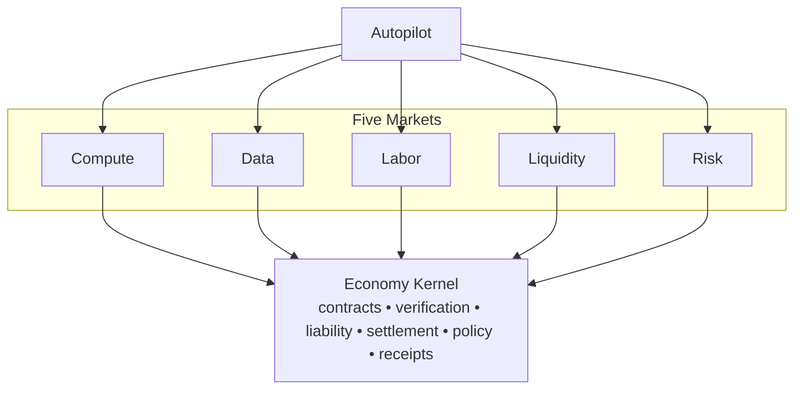
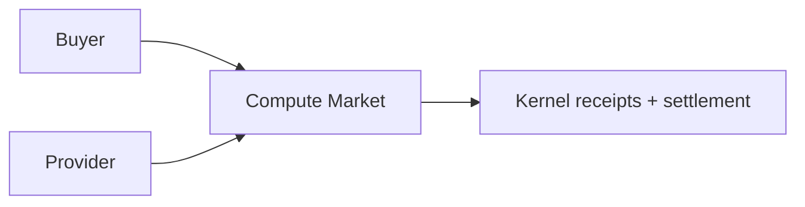
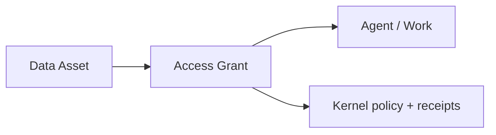
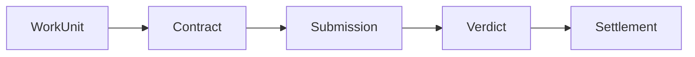
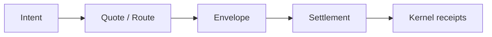
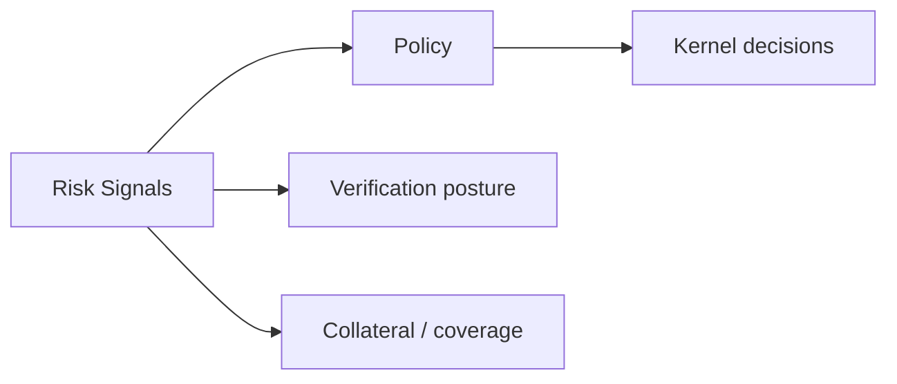

# OpenAgents Deck Plan: Autopilot + Five Markets

Status: initial draft
Date: 2026-03-06

## Goal

Create a WGPUI-based browser presentation system at `apps/deck` and use it to ship an initial OpenAgents deck whose first deliverable explains a single clear story:

- `Autopilot` is the user-facing wedge.
- `Autopilot` connects to five interlocking markets.
- those five markets sit on one shared economy kernel.

This plan is derived from:

- `README.md`
- `docs/kernel/economy-kernel.md`
- `docs/kernel/diagram.md`

The first deck should not try to present the full kernel spec. It should present a compressed product-and-system story that is easy to follow live.

## Primary Narrative

The most important framing from the current docs is:

1. `Autopilot` is the personal agent that users run.
2. The visible MVP wedge is compute-provider-first.
3. The broader marketplace is five interlocking markets:
   - `Compute`
   - `Data`
   - `Labor`
   - `Liquidity`
   - `Risk`
4. These markets are not separate products. They are different views of one shared substrate.
5. The shared substrate is the `Economy Kernel`: contracts, verification, liability, settlement, policy, and receipts.

That is the story the first deck should tell.

## Product Constraint

The first deck should optimize for:

- clarity over completeness,
- live presentation readability over spec fidelity,
- one idea per slide,
- diagrams that can be understood in a few seconds.

It should not begin with dense protocol or lifecycle diagrams. The first deliverable should establish the mental model first.

## First Deliverable

The first deliverable should be a six-slide deck:

1. one introductory slide about `Autopilot` connecting to five markets
2. one slide for `Compute`
3. one slide for `Data`
4. one slide for `Labor`
5. one slide for `Liquidity`
6. one slide for `Risk`

That is the minimum useful v1 deck.

## Slide Outline

## Slide 1: Autopilot connects to five markets

Purpose:

- establish `Autopilot` as the wedge,
- show the five-market taxonomy,
- show that the markets share one kernel.

Core message:

`Autopilot` is the personal agent users run, and under the hood it plugs into one machine-work economy with five interlocking markets.

Suggested on-slide bullets:

- personal agent
- wallet
- local runtime
- first earning loop
- gateway into five markets on one kernel

Suggested simplified diagram:

Speaker note intent:

- Start from the product the audience can picture: `Autopilot`.
- Then explain that the product wedge sits on a larger machine-work economy.
- Emphasize that the five markets are interlocking, not siloed.

## Slide 2: Compute market

Purpose:

- explain the first and most mature wedge,
- connect it to the current MVP,
- show why compute is the first visible market.

Core message:

The compute market allocates machine capacity. In MVP terms, this is the first visible market because users can already offer spare CPU/GPU capacity and get paid.

Suggested on-slide bullets:

- buys and sells machine capacity
- current product wedge for `Autopilot Earn`
- capacity, delivery, pricing
- foundation for broader machine work

Suggested simplified diagram:

Optional speaker detail:

- tie back to `README.md`: spare compute -> paid machine work -> bitcoin in wallet
- explain that richer commodity semantics exist in the kernel spec, but the first deck stays at the market level

## Slide 3: Data market

Purpose:

- explain that machine work needs context, not just compute,
- position data as permissioned access rather than generic “data marketplace” hype.

Core message:

The data market prices access to useful context under permission: datasets, artifacts, stored conversations, and local context.

Suggested on-slide bullets:

- context, permissions, access
- datasets, artifacts, stored conversations, local context
- explicit access grants and revocation
- makes machine work more useful and more controllable

Suggested simplified diagram:

Speaker note intent:

- emphasize “permissioned access” and “explicit policy”
- show that the data market is about controlled context, not just raw files

## Slide 4: Labor market

Purpose:

- show where agents actually do work,
- connect work to contracts, submission, verdict, and claims.

Core message:

The labor market is where machine work is bought and sold. It consumes compute and data, then settles against verified outcomes.

Suggested on-slide bullets:

- buy and sell machine work
- work units, contracts, submissions, verdicts
- settlement tied to verified outcomes
- software can hire software, but only if trust scales

Suggested simplified diagram:

Speaker note intent:

- this is the “software can hire software” slide
- tie directly to the kernel’s core four steps: define work, check work, assign responsibility, move money

## Slide 5: Liquidity market

Purpose:

- explain how value moves through the system,
- keep the message concrete and legible.

Core message:

The liquidity market moves value between participants and rails: quotes, routing, FX, envelopes, and reserves.

Suggested on-slide bullets:

- routes, FX, settlement, reserves
- value movement between participants and rails
- bounded envelopes, not open-ended credit
- liquidity is plumbing, but critical plumbing

Suggested simplified diagram:

Speaker note intent:

- explain that payment movement is a market too
- emphasize bounded, policy-controlled movement rather than hidden finance logic

## Slide 6: Risk market

Purpose:

- explain why prediction/coverage/underwriting belong in the same system,
- show that risk is priced uncertainty, not a side feature.

Core message:

The risk market prices uncertainty across labor and compute: coverage, underwriting, prediction, and policy signals that shape verification and autonomy.

Suggested on-slide bullets:

- coverage, prediction, underwriting
- implied failure probability and calibration
- feeds policy, collateral, and verification requirements
- makes autonomy safer and more legible

Suggested simplified diagram:

Speaker note intent:

- explain that the system treats uncertainty as a priced signal
- connect risk back to verification, liability, and autonomy throttles

## Simplified Diagram Strategy

The source docs contain much richer diagrams than the first deck needs.

For the initial presentation, we should derive simplified versions using these rules:

1. Preserve the nouns, compress the mechanics.
2. Prefer one diagram per slide.
3. Keep each diagram under 5-7 boxes if possible.
4. Use market-level shapes first, authority/protocol details later.
5. Avoid full trust-boundary or receipt-graph diagrams in the first six slides.

## What to simplify from `docs/kernel/diagram.md`

Keep:

- `Autopilot`
- five markets
- `Economy Kernel`
- key kernel nouns like contracts, verification, settlement, policy, receipts

Compress:

- full trust-zone breakdown
- minute snapshot lane
- audit/export subgraphs
- incident/ground-truth subgraphs
- full receipt/evidence graph
- optional liability market and belief-position state machines

## What to simplify from `docs/kernel/economy-kernel.md`

Keep:

- the five-market taxonomy
- the market-to-object map
- the “software can hire software” framing
- the kernel’s core responsibilities
- the idea that verification is the bottleneck

Compress:

- full invariants section
- detailed authority transport rules
- full state-machine semantics
- detailed compute derivatives/futures instrument logic
- proto-first wire-contract details

## Visual Style Guidance

The deck should use:

- `apps/deck`
- WGPUI HUD-style visual language
- `Frame::corners()`-style framing or equivalent deck chrome
- `DotsGrid` or similarly restrained background treatment
- large, readable headings
- high contrast
- one accent color strategy that distinguishes the five markets without making the slides noisy

The deck should not feel like a spec document pasted into a canvas. It should feel like a clean product-and-system narrative.

## Deck App Scope

The deck app should live at:

- `apps/deck`

That app should own:

- browser bootstrapping
- deck loading
- deck state
- slide routing
- presenter controls
- slide rendering composition

`crates/wgpui` should continue to own only reusable, product-agnostic UI and rendering primitives.

## Recommended V1 Content Format

Start with markdown-plus-metadata.

The deck source should support:

- deck title
- theme
- slide separator
- per-slide title
- per-slide layout
- per-slide notes
- per-slide diagram block

The first deck should be authored as content, not hand-coded slide-by-slide in Rust scene logic.

## Initial Backlog

These are the GitHub issues needed to build the first real version fully.

## App + bootstrap

### Issue: Create `apps/deck` workspace app

Description:

- Add a new workspace member at `apps/deck`.
- Set up wasm/browser bootstrapping around retained `wgpui` web support.
- Keep deck-specific state and routing out of `crates/wgpui`.

### Issue: Add HTML shell and local serving path for `apps/deck`

Description:

- Add a minimal full-screen canvas HTML shell.
- Define a simple local run/build path for the browser deck.
- Keep the shell thin and deterministic.

### Issue: Implement browser input bridge for deck navigation

Description:

- Translate keyboard, pointer, wheel, and resize events into deck app input.
- Support arrow-key navigation and simple pointer interaction from day one.

## Deck model + content

### Issue: Define typed `Deck` and `Slide` model for `apps/deck`

Description:

- Introduce typed deck objects for deck metadata, slide kinds, layout, notes, and transitions.
- Keep parsing and rendering separate.

### Issue: Define deck markdown-plus-metadata source format

Description:

- Specify how authored decks are stored.
- Include slide separators and per-slide metadata.
- Support at least title, layout, notes, and diagram sections.

### Issue: Implement parser for deck source files

Description:

- Parse the deck source format into typed slide models.
- Validate malformed inputs with useful errors.

## First deck content

### Issue: Author the first `Autopilot + Five Markets` deck

Description:

- Build the first six-slide deck:
  - intro slide: `Autopilot` connects to five markets
  - `Compute`
  - `Data`
  - `Labor`
  - `Liquidity`
  - `Risk`
- Base the content on `README.md`, `docs/kernel/economy-kernel.md`, and `docs/kernel/diagram.md`.
- Keep the copy concise and presentation-oriented.

### Issue: Produce simplified diagram set for the first deck

Description:

- Derive presentation-safe diagrams from the current kernel docs.
- Prefer compressed diagrams over direct copies of the full-fidelity mermaid sources.
- Keep one primary diagram per slide.

### Issue: Add speaker notes for the first six slides

Description:

- Add concise presenter notes for each slide.
- Preserve the product-first story while retaining kernel accuracy.

## Rendering + chrome

### Issue: Implement `MarkdownSlide` rendering in `apps/deck`

Description:

- Render title, bullets, paragraph blocks, and code blocks using WGPUI.
- Use presentation-specific typography rather than raw markdown defaults.

### Issue: Implement diagram slide blocks in `apps/deck`

Description:

- Support rendering simplified diagrams inside slides.
- Start with a constrained diagram block model suited to the first deck.

### Issue: Add deck chrome widgets

Description:

- Add frame, slide counter, progress indicator, and footer/citation bar.
- Keep these app-local first; upstream only if they prove reusable.

## Navigation + polish

### Issue: Add slide navigation and URL state

Description:

- Support next/previous, `Home`, `End`, and shareable slide URLs.
- Keep navigation deterministic and presentation-safe.

### Issue: Add overview mode for deck browsing

Description:

- Add a slide index / overview mode for quick navigation.
- Optimize for live presentation flow.

### Issue: Add fullscreen and presenter notes toggle

Description:

- Support browser fullscreen.
- Support notes visibility toggle without changing slide content layout unpredictably.

## Toolkit improvements likely needed

### Issue: Improve markdown typography for presentation use

Description:

- Add a presentation-oriented markdown config with stronger heading hierarchy and spacing.
- Keep the configuration explicit.

### Issue: Add link interaction support to `MarkdownView`

Description:

- Implement clickable links and hit targets.
- Keep this generic so other WGPUI apps benefit.

### Issue: Add image/SVG support needed by deck slides

Description:

- Add the minimum reusable media support needed for future deck content.
- Keep deck-specific logic in `apps/deck`; keep generic media primitives in `crates/wgpui`.

## Build Order

## Phase 1

- create `apps/deck`
- add browser boot path
- define typed deck model
- define source format

## Phase 2

- render the first six-slide deck
- add simplified diagrams
- add deck chrome

## Phase 3

- add notes
- add overview mode
- add fullscreen/presenter controls

## Success Criteria

This plan succeeds when:

1. there is a new `apps/deck` app surface,
2. the first deck opens in the browser,
3. the deck begins with `Autopilot` connecting to five markets,
4. each of the five markets has its own slide,
5. the diagrams are simplified enough to present live without reading the spec aloud,
6. the implementation keeps deck-specific workflow logic out of `crates/wgpui`.

## Final Recommendation

The first deck should behave like a product narrative with kernel backing, not like a spec dump.

Start with the six-slide story:

- `Autopilot`
- `Compute`
- `Data`
- `Labor`
- `Liquidity`
- `Risk`

Then expand later into appendix slides for:

- the economy kernel
- trust boundaries
- receipts and verification
- authority vs projection
- compute-market depth

That sequencing matches both the current repo story and what a live audience can actually absorb.
